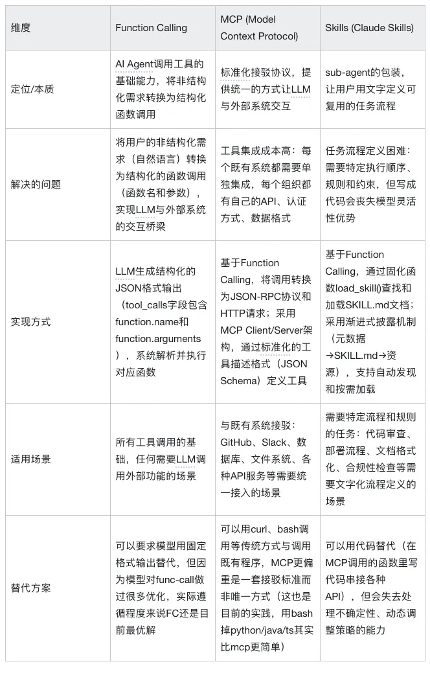
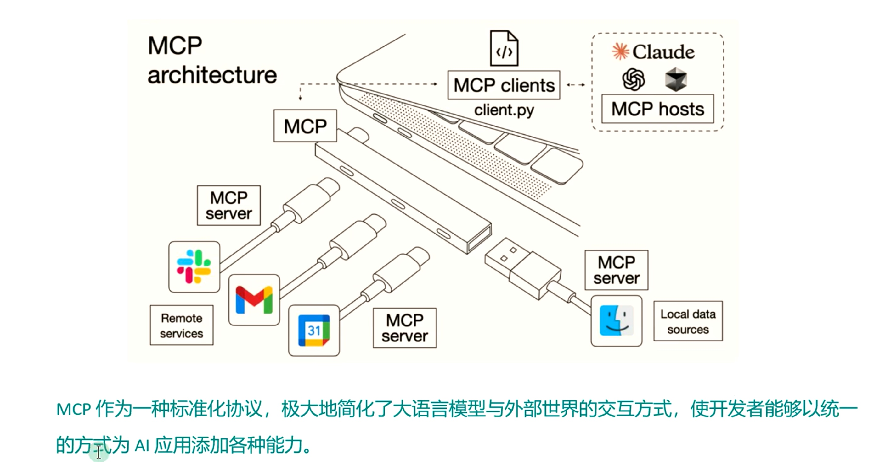
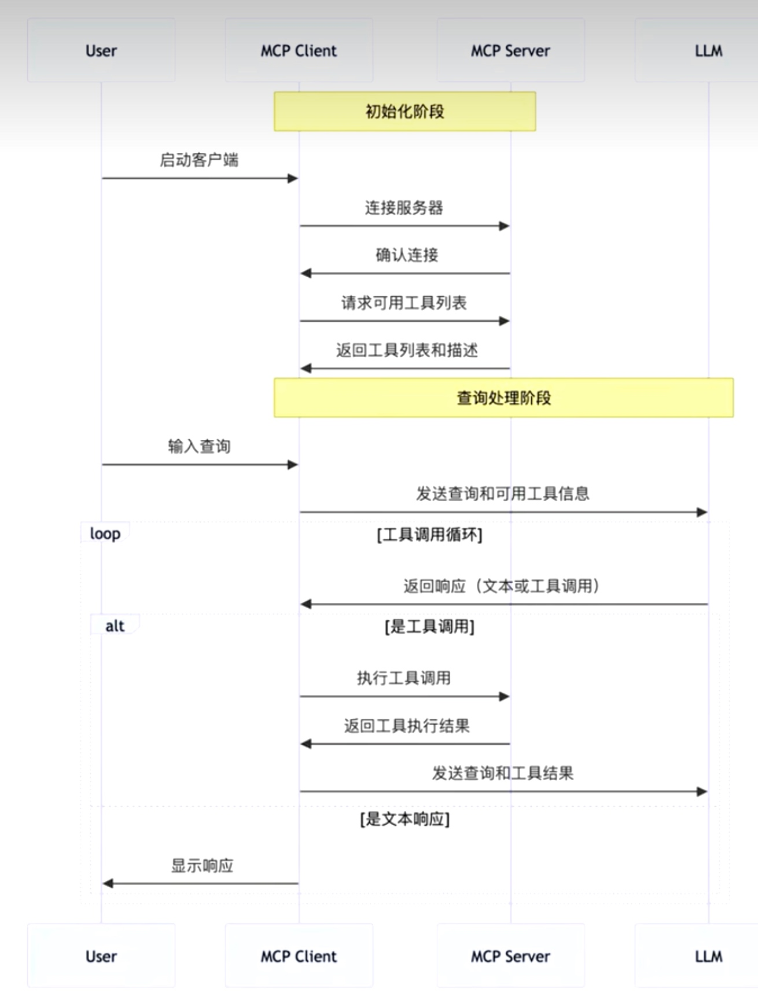
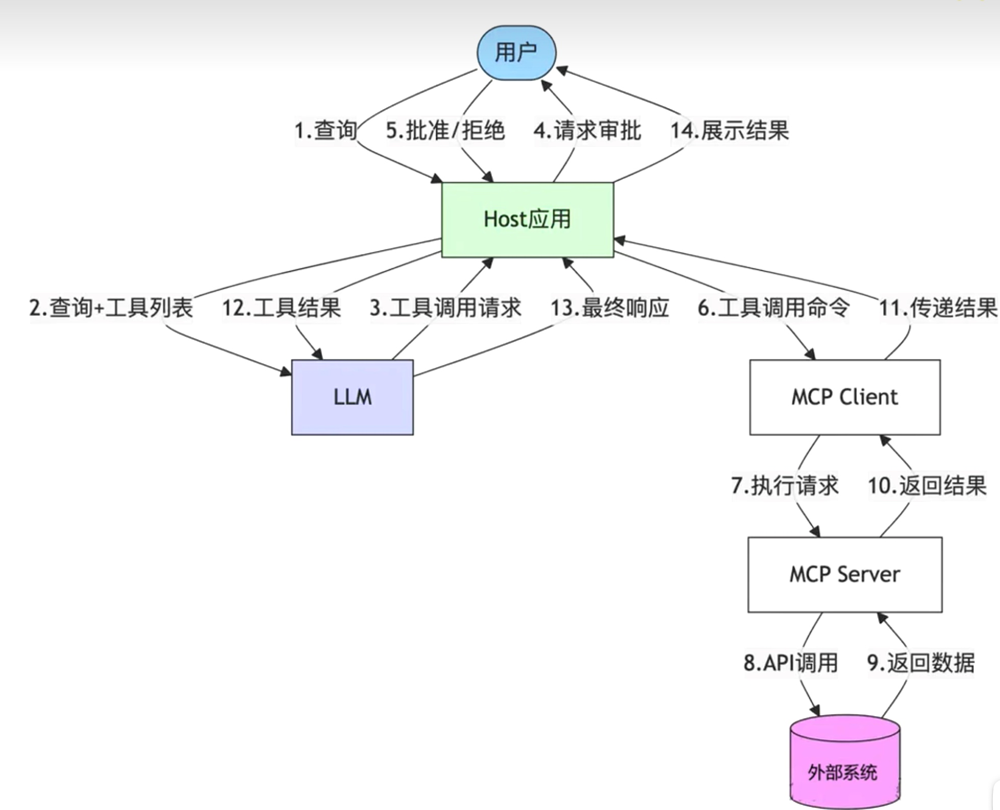

# AI
- [ReAct Agent](#react-agent)
  - [核心思想：观察/感知-推理/决策-执行](#核心思想：观察感知推理决策执行)
  - [Function Calling、MCP、Skills本质差异](#function-calling、mcp、skills本质差异)
- [RAG](#rag)
  - [基础概念](#基础概念)
  - [工作逻辑](#工作逻辑)
- [MCP](#mcp)
  - [基础概念](#基础概念)
  - [工作逻辑](#工作逻辑)
- [Agent](#agent)
- [个人理解](#个人理解)
- [MCP](#mcp)
  - [底层原理](#底层原理)
  - [工作流程](#工作流程)

需求一次性说完，不要拆开
提供业务上下文

# ReAct Agent
## 核心思想：观察/感知-推理/决策-执行
ReAct 这个名字听起来挺高大上，其实拆开看就明白了：Reasoning（推理）+ Acting（行动）。说白了，就是让 AI 一边想一边做，而不是想完了再做。

打个比方，传统的方式就像你出门前把整个路线都查好，然后严格按照路线走。而 ReAct 更像是你出门后，走一段路，看看周围环境，再决定下一步往哪走。比如你要去一个没去过的咖啡店，传统方式是你提前查好所有路线，ReAct 则是你走到路口，看看路牌，再决定左转还是右转，边走边找。（有一个整体目标的前提下，走一步看一步，这个过程会一直循环，直到任务完成）

**关键要素**
1. 历史上下文（History）ReAct 会维护一个对话历史，记录之前所有的思考、行动和观察。这样 LLM 在做决策时，可以参考之前发生了什么，避免重复操作或者走错路。

2. 观察当前环境信息（Current Environment Information）这是 Agent 在当前时刻接收到的外部信息，比如用户的输入、系统的状态、或者其他需要处理的数据。这些信息会作为 LLM 推理的输入，帮助决定下一步该做什么。

3. 语言模型（LLM Thinking）这是 ReAct 的"大脑"，负责推理和决策。每次需要思考下一步该做什么时，LLM 会根据当前的历史上下文、环境信息和观察结果，生成下一步的行动计划。（后续表格里这个think是隐藏的，最终表现形式就是toolcall）

4. 工具/动作（toolcall）这是 ReAct 的"手脚"，用来执行具体的操作。比如搜索、查询 API、读写文件等等。每个工具都有明确的输入输出，Agent 可以调用这些工具来完成实际工作。

5. 观察结果（toolcall结果）每次执行动作后，都会得到一个观察结果。这个结果会被反馈给 LLM，作为下一轮推理的依据。观察结果可能包括成功的数据、错误信息、或者需要进一步处理的内容

下面是一个 round 的执行流程伪代码，展示了核心的执行逻辑：

```text
函数 执行一个轮次(用户目标, 历史上下文):
    // 1. 获取当前环境信息
    当前环境信息 = 获取当前环境信息()
    
    // 2. 构建提示词（替换占位符）
    提示词模板 = "已知：\n当前历史上下文：${历史上下文}\n当前环境信息：${当前环境信息}\n用户目标：\"${用户目标}\"\n\n做出下一步的决策\n\n你必须最少使用一个工具来实现该决策"
    完整提示词 = 替换占位符(提示词模板, {
        历史上下文: 历史上下文,
        当前环境信息: 当前环境信息,
        用户目标: 用户目标
    })
    
    // 3. 调用 LLM 进行推理（思考过程隐藏，直接输出 toolcall）
    工具调用结果 = 调用语言模型(完整提示词, 历史上下文)
    
    // 4. 解析工具调用
    工具名称 = 解析工具名称(工具调用结果)
    工具参数 = 解析工具参数(工具调用结果)
    
    // 5. 执行工具调用
    观察结果 = 执行工具(工具名称, 工具参数)
    
    // 6. 更新历史上下文
    新历史上下文 = 追加到历史上下文(历史上下文, {
        行动: 工具调用结果,
        观察结果: 观察结果
    })
    
    // 7. 返回结果
    返回 {
        观察结果: 观察结果,
        新历史上下文: 新历史上下文
    }
结束函数

// 主循环
函数 执行ReAct流程(用户目标):
    历史上下文 = 空
    当前轮次 = 1
    最大轮次 = 10
    
    当 当前轮次 <= 最大轮次 且 未完成任务:
        结果 = 执行一个轮次(用户目标, 历史上下文)
        历史上下文 = 结果.新历史上下文
        
        如果 判断任务已完成(结果.观察结果):
            中断循环
        
        当前轮次 = 当前轮次 + 1
    结束循环
    
    返回 历史上下文
结束函数
```

## Function Calling、MCP、Skills本质差异
这个流程的核心在于：LLM需要把用户的非结构化需求（一段自然语言文本）转换为结构化的函数调用（函数名和参数），然后与其他应用程序交互，再将结构化结果返回给模型，让模型能够基于这些结果进行下一步决策。

问题的本质在于，历史上其他系统（数据库、API、文件系统等）只能处理结构化信息，而LLM擅长处理非结构化信息（文本）。因此，LLM必须想办法在两种信息形式之间架起桥梁：将非结构化的用户需求转换为结构化的函数调用，这样才能与外部系统交互。

这就是Function Calling的本质，也是后面MCP和Skills能够存在的前置条件。

Function Calling确实解决了核心问题：让LLM能够稳定地输出结构化的工具调用请求，实现了"非结构化→结构化"的转换

MCP解决工具集成问题

模型的核心优势是面对不确定性时可以走一步看一步，动态调整策略。如果全部落成程序，就会丧失模型的核心优势。

Skills产生原因：提供一个方式，让用户可以用文字定义指令、脚本和资源，形成可复用的任务流程。

Skills的核心其实也是基于Function Calling的。它做的事情很巧妙：通过一个固化的函数和参数，让模型去查找和加载固定的skills文档。

**核心定位**

我们可以看到Function Calling、MCP和Skills三者之间的本质关系：MCP和Skills都是基于Function Calling的，它们只是在Function Calling这个基础能力之上的不同应用方式。

MCP的核心是解决与既有系统的接驳问题 ： 实际上，与外部系统接驳的方法并不只有MCP这一种——我们完全可以用curl、bash等传统方式来与程序接驳。MCP的价值在于它提供了一套标准化的接驳协议，让不同的工具和数据源能够以统一的方式被LLM使用。通过JSON-RPC协议和标准化的工具描述格式，MCP降低了工具集成的成本，让开发者不需要为每个系统单独编写集成代码。但本质上，MCP更偏重是一套接驳标准，而不是唯一的接驳方式。

Skills则实际上是一个sub-agent的包装 ： 它让用户可以用文字来写流程，替代了过去在MCP调用的函数里用代码写的一套串接各种API的逻辑流程。这种方式可以增强流程的环境适应性——因为模型可以根据实际情况动态调整策略，处理不确定性，理解自然语言意图。这正是我们第二篇文章提到的核心观点：Agent将决策权完全下放给了模型和Prompt，能够解决原有写程序不能解决的问题。但代价就是不可能100%准确，因为模型的行为存在不确定性，无法像传统代码那样保证完全可预测的执行结果。



**MCP与Skills的竞争关系**
虽然很多人认为MCP和Skills是互补关系，但实际上，这两者更多是竞争关系。这种竞争主要体现在它们解决的是同一个问题：如何整合多个既有系统，实现复杂的多步骤任务。

要理解它们的竞争关系，我们需要回到Function Calling的本质：LLM要实现工具调用，实际上最需要的内容只有：函数名、参数要求，以及一个description。基于这个前提，我们来看看MCP和Skills的不同解决思路：

MCP的解决思路：通过标准化的协议和Server架构，引入了一个新的协议转换Server（这个Server可以用Node.js、Python或其他语言来实现）。但这个协议转换层往往也只是先做了函数调用的协议转换，然后再增加一个description，打包，发布。这个流程是非常薄的——它本质上只是在Function Calling的基础上，增加了一层JSON-RPC协议转换。

Skills的解决思路：选择了更简单的办法，可以不需要这层协议转发Server，直接用bash以参数形式调用，结果其实是一样的，还更省事。换句话说，MCP的JSON-RPC可以被直接替换为命令行脚本或curl远程调用，在本地直接调用。这样甚至都不需要额外做MCP封装了。而且在这个基础上，Skills还能支持更复杂的流程定义——通过SKILL.md文档告知LLM如何组合多个接口调用，所以长流程任务的成功率会更高。

这就是为什么说它们是竞争关系：当用户选择使用Skills时，他们就不需要在MCP Server的函数中编写复杂的串接代码了；反之，如果选择在MCP Server中实现完整逻辑，Skills的价值就会降低。它们解决的是同一个问题（如何整合多个既有系统），但采用了不同的方法（协议转换Server+代码型流程定义 vs 直接命令行调用+文字化流程定义）。


让每个Agent能力都通过函数的方式暴露，这样就能更好地把Agent集成到既有的系统中，让他不再仅仅是一个对话框：
* 接受结构化的参数输入，而不是依赖纯文本描述；
* 返回结构化的结果，方便与现有系统集成；
* 支持多种调用方式，不仅仅是聊天界面；
* 与现有的业务逻辑、表单、API无缝对接；

# RAG
RAG：AI 的 “实时外挂”，解决 “知识过时、回答不准” 的问题；

## 基础概念
Retrieval-augmented Generation（索引增强生成）
作用：为大模型提供从特定数据源检索到的信息，以此来修正和补充生成的答案。其实就是给 AI 配了个 “可更新的外挂知识库”！
平时 AI 的知识停留在训练数据截止日，有了 RAG，它会先去你的专属知识库（比如公司文档、最新资讯、冷门资料）搜答案，再结合自己的知识整合回复，再也不会 “过时” 或 “瞎编”～通俗理解：AI 本来是个学霸，但只背了课本；RAG 给它加了本 “实时错题本 + 最新教辅”，考试（回答问题）自然又快又准！

## 工作逻辑
1、检索：你问 “今年最火的 AI 工具”，RAG 先把问题拆成关键词，去知识库扒相关信息；
2、增强：把搜到的 “2026 年热门 AI 工具清单” 和你的问题一起喂给 AI;
3、生成：AI 结合 “旧知识 + 新信息”，给你整理出有条理的回答，还不跑偏～


# MCP
MCP：AI 的 “万能翻译官”，解决 “不同模型不会合作” 的问题；
## 基础概念
Model Context Protocol（模型上下文协议）
作用：统一大模型与外部数据源和工具之间的通信协议
通俗理解：就像微信转账功能，不管你用哪家银行的卡，都能通过微信互通；MCP 让 AI 们 “跨平台聊天”，还能共享干活的上下文（比如 “用户之前问过 XX 问题”）。

## 工作逻辑

# Agent
Agent：AI 的 “全能打工人”，解决 “需要人一步步指挥” 的问题。

**核心思想**：
设计工具时，把模型当成一个聪明的“实习生”。不需要告诉他每个技术细节（最小化接口），但需要把相关的任务打包好（避免零散），并明确告诉他这个任务的目标是什么（任务导向）。在分配工作时，一次只给他当前相关的资料（最小化工具编排 + 渐进式披露），如果流程复杂，就给他一份清晰的操作指南（如 Agent Skill）。

工具定义：“模型友好”
* 名称用“动词-名词”结构（如 create_order、manage_order），避免技术实现名（如 call_http_endpoint）。
* 描述既要简洁，又要完整说明用途、输入输出、典型场景和异常处理，不夸大能力。
* 输入/输出统一用 JSON Schema（或 Pydantic/Zod 等生成），善用类型（string/integer/enum 等）和约束（minimum/maximum/pattern/enum/examples/required），避免巨大的嵌套结构，必要时拆平参数。

工具规划：控制“颗粒度”和“数量”
* 遵循“最小必要接口”：只暴露完成任务必须的参数和功能，去掉无意义或永远是固定值的参数。
* 避免拆得过碎：从“用户要完成的任务”出发，把强相关步骤打包成一个任务型工具，而不是几十个原子接口。
* 以“任务导向”而不是“接口罗列”为中心设计工具集，让模型理解“现在要完成什么事”。

工具编排：“减负 + 渐进披露”
* 不要一次性把所有 MCP 工具都挂给一个 Agent，而是根据具体场景按需加载一小部分工具集。
* 可以通过标签或搜索按任务动态选择工具，避免上下文被无关工具描述淹没。
* 对于复杂流程，用 Agent Skill 写一份“操作说明书”，引导模型按步骤调用多个工具完成任务。


# 个人理解
坏消息：
如果我们只会写代码甚至只会CRUD，那么AI 100%可以取代我们，AI在写局部代码方面已经超越了90%的程序员。写得快的没有AI写得好，写得好的没有AI写得快。

好消息：
AI目前还无法取代程序员的两个方面
* 业务理解能力。AI对于特定公司的特定业务的理解程度远不如团队内的程序员。涉及到需求讨论和方案设计，AI无法准确判断合理性。形象点说：AI没法和产品经理PK需求合理性和实现细节。
* 架构设计能力。AI对于特定公司特定团队的利益关系网络无法正确理解。虽然AI可以给出很多可选方案，但是无法代替我们做出多方利益相关的最终决策，无法理解不同利益优先级和重要程度。形象点说：AI不知道你做的架构设计项目，是我们为了明年晋升而做的项目；还是为了让我的leader赶在绩效考核截止前一定要上线的KPI项目。

学习：
系统学习架构设计方法论：学习完整的架构设计方法论，掌握架构设计思路、架构设计原则、架构设计流程、架构设计原则和理论（CAP、FMEA、BASE等），在此基础上结合业界实践和经验，形成自己的架构设计技能体系。

程序员：


# MCP
MCP本身和智能体没有必然的联系，只不过是实现大模型调用工具的一个协议而已，MCP 本身没有价值，就像 HTTP 不是网页内容本身，但它让网页能互联互通。Agent 通过MCP的这种“调用能力”的标准化是促进生态发展的关键一环
简单来说就是，大模型相当于机器人的大脑，MCP连接机器人的手臂，使得大模型能够控制机器人的手臂执行对应的操作

**作用**：标准化AI模型与上下文来源/工具之间的数据交互方式
**解决**：Agent和Tools（访问数据库，执行代码）的交互（融合万物的接口，比如：github、webAPI、gamil、database）

**如何理解大模型LLM和MCP**

**框架**：Java + Spring AI/ LangChain / LangChain4J + MCP => AI智能落地

**方向例子**：
1、部署新版本到测试环境，触发MVP链式调用GitLab API（代码合并）、Jenkins（构建镜像）、Slack API（通知团队）
2、通过自然语言输入，比如“查询某个集团部门上个季度销售额”，就能查询出对应数据库的数据，结合LLM进行回答，不用编写精准SQL

manus智能体 - 市场分析PPT、获取用户数据、财务系统API（调取报表）、邮件API（发送总结报告）
旅游规划，通过MCP调用天气API（获取目的地气象）、交通API（查询航班动态）、地图API（规划路线），AI自动生成带实时数据的形成方案

## 底层原理
MCP的C/S架构
* MCP hosts：作为运行MCP的主应用程序接口，为用户提供与LLM交互的接口，同时集成MCP Client以连接MCP Server
* MCP Clients：充当LLM和MCP Server之间的桥梁，嵌入在主机程序中，主要负责接收来自LLM的请求，将请求转发到响应的MCP Server，将MCP Server的结果返回给LLM
* MCP Servers：MCP服务器既可以作为本地应用程序（stdio）在用户设备上运行，也可部署至远程服务器（SSE）
> 对于python 使用uvx命令运行，对于TypeScript使用npx命令运行
* Local Resources：
* Remote Resources：

## 工作流程


**数据流向**


**MCP Server**
* filesystem：对本地文件系统的版权，受控访问
* mysqldb-mcp-server：支持与Mysql数据库进行安全交互
* amap-maps：高德地图，允许用户利用高德地图MCP服务器进行基于位置的服务
* Firecrawl：网页数据爬取
* github-server：进行代码的提交和拉取以及更新
* git
* 记忆图谱memory：长期记忆系统用于维护上下文
* desktop-commander：控制台，使用命令执行和文件作工具简化开发任务