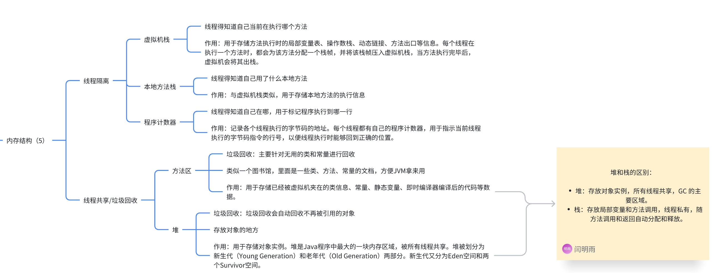
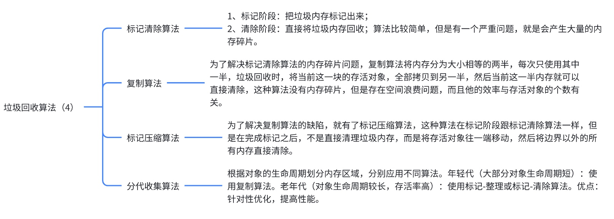
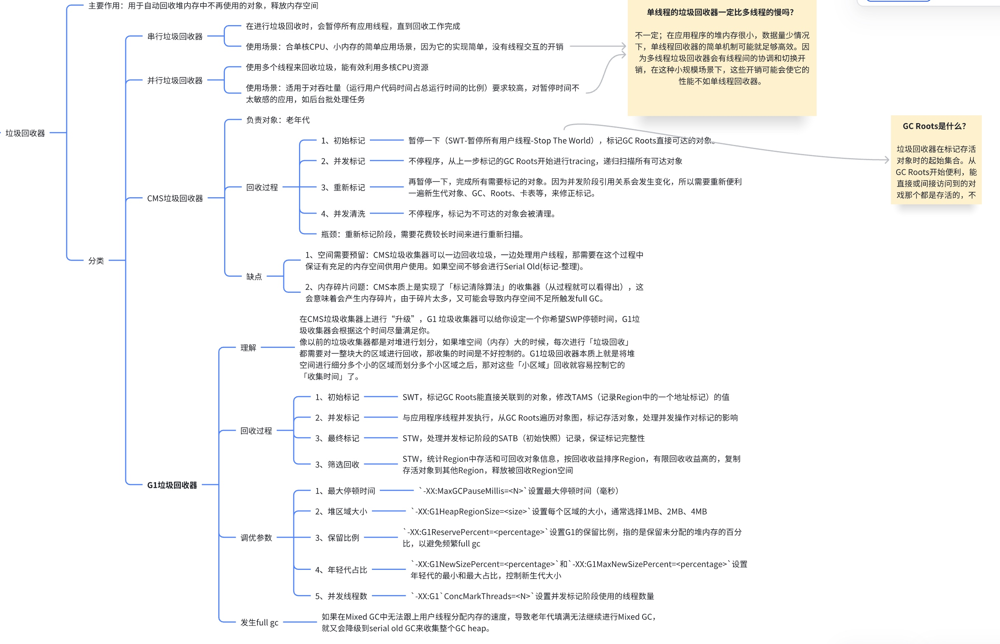
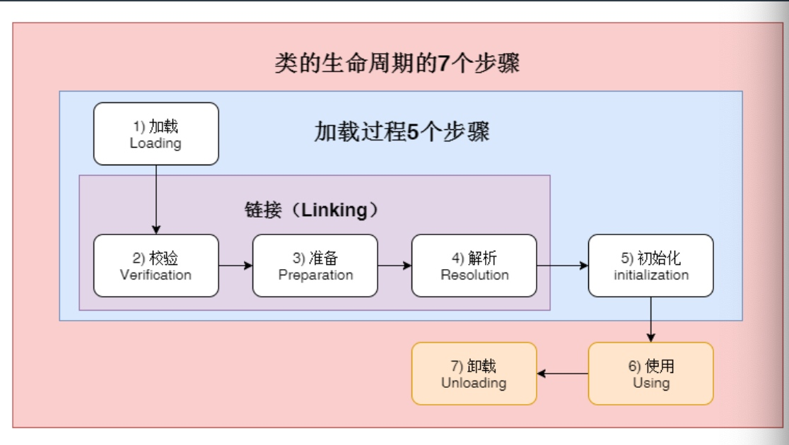

# JVM
  - [**JVM内存结构**](#jvm内存结构)
  - [**垃圾回收算法/方式（4）**](#垃圾回收算法方式（4）)
  - [**垃圾回收器**](#垃圾回收器)
- [**内存溢出和内存泄漏的异同**](#内存溢出和内存泄漏的异同)
- [如何排查JVM问题](#如何排查jvm问题)
  - [fullgc如何调优](#fullgc如何调优)
  - [OOM触发场景，是什么类型内存泄漏](#oom触发场景，是什么类型内存泄漏)
  - [对于已经发生了OOM的系统：](#对于已经发生了oom的系统：)
  - [**内存溢出**是使用什么工具，如何进行排查的](#内存溢出是使用什么工具，如何进行排查的)
  - [**JVM调优**](#jvm调优)
- [类加载过程](#类加载过程)
- [**类加载机制**](#类加载机制)
  - [类加载的生命周期](#类加载的生命周期)
  - [JVM有哪些类加载机制](#jvm有哪些类加载机制)
    - [**双亲委派机制** - 加载过程](#双亲委派机制加载过程)
  - [为什么要使用这种双亲委派模式](#为什么要使用这种双亲委派模式)
- [其他问题](#其他问题)
  - [JVM内存模型（JMM）](#jvm内存模型（jmm）)
  - [垃圾回收的基本原理/判断对象是否可回收的方法](#垃圾回收的基本原理判断对象是否可回收的方法)
    - [Minor GC 什么时候会触发呢](#minor-gc什么时候会触发呢)
  - [引用类型](#引用类型)
  - [linux下调节JVM垃圾收集器](#linux下调节jvm垃圾收集器)
    - [JVM性能调优有哪些参数，在什么时候应该调这些参数?（FullGC调节）](#jvm性能调优有哪些参数，在什么时候应该调这些参数（-fullgc调节）)
  - [参数之间的关系总结](#参数之间的关系总结)
  - [JVM命令行工具](#jvm命令行工具)

## **JVM内存结构**

## **垃圾回收算法/方式（4）**

## **垃圾回收器**

# **内存溢出和内存泄漏的异同**
**内存泄漏**：对象没有被正确释放，GC 无法回收。
**内存溢出（OOM）**：程序占用了超过允许范围的内存，无法分配新对象。
内存泄漏可以导致 OOM，但 OOM 可能不是由泄漏引起的。

# 如何排查JVM问题
对于还在正常运⾏的系统：

1. 使⽤jmap来查看JVM中各个区域的使⽤情况 
2. 通过jstack来查看线程的运⾏情况，⽐如哪些线程阻塞、是否出现了死锁
3. 通过jstat命令来查看垃圾回收的情况，特别是fullgc，如果发现fullgc⽐较频繁，那么就得进⾏调
优了
4. 通过各个命令的结果，或者jvisualvm等⼯具来进⾏分析

## fullgc如何调优
1. ⾸先，初步猜测频繁发送fullgc的原因，如果频繁发⽣fullgc但是⼜⼀直没有出现内存溢出，那么表示 fullgc实际上是回收了很多对象了，所以这些对象最好能在younggc过程中就直接回收掉，避免这些对象进⼊到⽼年代，对于这种情况，就要考虑这些存活时间不⻓的对象是不是⽐较⼤，导致年轻代放不下，直接进⼊到了⽼年代，尝试加⼤年轻代的⼤⼩，如果改完之后，fullgc减少，则证明修改有效 
2. 同时，还可以找到占⽤CPU最多的线程，定位到具体的方法，优化这个方法的执行，看是否能避免某些对象的创建，从而节省内存。

## OOM触发场景，是什么类型内存泄漏
| 类型             | 触发场景                                       | 诊断工具                      |
| ---------------- | ---------------------------------------------- | ----------------------------- |
| **堆内存泄漏**   | 对象未被回收（静态集合、缓存、监听器未释放等） | `jmap`、`MAT`                 |
| **直接内存泄漏** | NIO `ByteBuffer.allocateDirect` 未释放         | `jstat`、NMT                  |
| **元空间泄漏**   | 类加载过多（反射、热部署、动态代理）           | `jcmd VM.class_histogram`     |
| **线程泄漏**     | 线程池增长，线程未结束                         | `jstack`、`jcmd Thread.print` |
| **GC 相关 OOM**  | 频繁 GC，老年代溢出                            | GC 日志、`jstat -gcutil`      |

## 对于已经发生了OOM的系统：
1. 一半生产系统中都会设置当系统发生了OOM时，生成当时的dump文件（-XX:+HeapDumpOnOutOfMemoryError -XX:HeapDumpPath=/usr/local/base）
2. 可以利用jvisualvm等工具来分析dump文件
3. 根据dump文件找到异常的实例对象，和异常的线程（占用CPU高），定位到具体的代码
4. 然后再进行详细的分析和调试

总之，调优不是一撮而就的，需要结合当前应用场景，进行分析、推理、实践、总结、再分析，最终定位到具体的问题

## **内存溢出**是使用什么工具，如何进行排查的
在生产环境下面，先使用jmap命令将程序的内存数据保存下来。然后将堆栈文件下载到本地电脑，jvisualvm.exe打开分析可以看到程序的运行概况，最大的对象，和推测泄露点。
遇到过的问题：
1. 在多条件复杂查询的时候，并没有判断参数值是否存在就进行拼接导致最后都是查询出所有数据来。
2. 在哈长项目的注册功能的时候，因为注册的时候需要提交多种不同类型的信息，比如：账号基本信息、公司基本信息、公司相关图片，当时前端需求是通过多个接口分步保存数据，由于后续图片保存中需要对应之前公司保存的id，当时的做法是在当前类中定义companyid然后注册之前信息的时候去给这个变量赋值，前端顺序调用这几个接口，但是这么写并发量一上来同时注册的话就会出现保存的id不是期望的id。后面在第一次保存企业的时候把companyId加在cookie里面去解决这个问题。

## **JVM调优**
一般来说优化系统的思路是：一般来说是关系型数据库先到瓶颈，这个时候首先排查是否为数据库的问题，这个过程中需要评估建立的索引是否合理（建立联合索引在一个表中经常会对多个列进行联合查询，比如在车辆历史记录表中按车辆ID和日期查询）、是否需要引入分布式缓存，数据是否需要分库分表等。**其次**、会去考虑是否需要扩容就是加机器。**接着是**，应用层面的代码层面的排查并优化（这个过程中我们会审视自己写的代码是否存在资源浪费的问题，又或者是在逻辑上可存在优化的地方，比如说通过并行的方式处理某些请求，或者去优化算法的一个复杂度，还可以实施懒加载的一些策略来提高我们的一个性能）
**再接着**，是jvm层面的排查并优化（审视完代码之后，这个过程我们观察JVM是否存在多次GC问题等等），**最后**，网络和操作系统层面排查

在进行jvm调优的过程中，一般调优JVM我们认为会有几种指标可以参考：『**吞吐量**』、『**停顿时间**』和『**垃圾回收频率**』，基于这些指标，我们就有可能需要调整：①内存区域大小以及相关策略（比如整块堆内存占多少、新生代占多少、老年代占多少、Survivor占多少、晋升老年代的条件等等）。比如（-Xmx：设置堆的最大值、-Xms：设置堆的初始值、-Xmn：表示年轻代的大小、-XX:SurvivorRatio：伊甸区和幸存区的比例等等）（按经验来说：IO密集型的可以稍微把「年轻代」空间加大些，因为大多数对象都是在年轻代就会灭亡。内存计算密集型的可以稍微把「老年代」空间加大些，对象存活时间会更长些）②垃圾回收器（选择合适的垃圾回收器，以及各个垃圾回收器的各种调优参数），比如（-XX:+UseG1GC：指定 JVM 使用的垃圾回收器为 G1、-**XX:MaxGCPauseMillis**：设置目标停顿时间、-XX:**InitiatingHeapOccupancyPercent**：当整个堆内存使用达到一定比例，全局并发标记阶段 就会被启动等等）

但是在绝大部分场景下，jvm已经能做到开箱即用
一般是「遇到问题」之后才进行调优的，而遇到问题后需要利用各种的「工具」进行排查，比如使用Arthas，常用的是dashboard，thread命令，1）**dashboard**命令能扫面当前java进程的全局信息，包括堆栈和线程信息。2）jvm：**查看当前 JVM 的相关信息**，包括堆大小、GC 策略、线程数等。3）**thread(cpu占用过高/死锁)**：查看和操作线程状态和堆栈信息，包括线程数量、状态、阻塞信息等。
1. 通过`jps`命令查看**Java进程「基础」信息**（进程号、主类）。这个命令很常用的就是用来看当前服务器有多少Java进程在运行，它们的进程号和加载主类是啥
2. 通过`jstat`命令查看**Java进程**「统计类」相关的信息（类加载、编译相关信息统计，各个内存区域GC概况和统计）。这个命令很常用于看GC的情况
3. 通过`jinfo`命令来查看和调整Java进程的「运行参数」。
4. 通过`jmap`命令来查看Java进程的「内存信息」。这个命令很常用于把JVM内存信息dump到文件，然后再用MAT( Memory Analyzer tool 内存解析工具)把文件进行分析
5. 通过`jstack`命令来查看JVM「线程信息」。这个命令用常用语排查死锁相关的问题

**JDK1.8默认使用的垃圾回收器为**
“Parallel Scavenge” + “Parallel Old”。
新生代并行回收器，内存分布使用的**复制算法**。
Parallel Old：是Parallel收集器的老年代版本，采用**标记-整理算法**

**如果满足下面的指标，则一般不需要进行GC**:
Minor GC执行时间不到50ms;
Minor GC执行不频繁，约10秒一次；
Full GC执行时间不到1s;
Full GC执行频率不算频繁，不低于10分钟1次。

# 类加载过程
通过类加载器将.class 字节码加载到 JVM，经验证、准备、解析完成链接，最终执行静态代码为静态变量赋实际值完成初始化，生成 Class 对象存入方法区，全程遵循双亲委派且懒加载（仅主动使用触发初始化）。

# **类加载机制**
## 类加载的生命周期

* 1、类的加载: 查找Class文件
* 2、验证: 验证格式、依赖
* 3、准备: 为类的静态字段分配内存，并将其初始化为默认值
* 4、解析: 符号引用转换为直接引用
* 5、初始化：为类的静态变量赋予正确的初始值，JVM负责对类进行初始化，主要对类变量进行初始化。
* 6、使用： 类访问方法区内的数据结构的接口， 对象是Heap区的数据
* 7、卸载： 结束生命周期

## JVM有哪些类加载机制

1、**全盘负责**，当一个类加载器负责加载某个Class时，该Class所依赖的和引用的其他Class也将由该类加载器负责载入，除非显示使用另外一个类加载器来载入

2、**父类委托**，先让父类加载器试图加载该类，只有在父类加载器无法加载该类时才尝试从自己的类路径中加载该类

3、**缓存机制**，缓存机制将会保证所有加载过的Class都会被缓存，当程序中需要使用某个Class时，类加载器先从缓存区寻找该Class，只有缓存区不存在，系统才会读取该类对应的二进制数据，并将其转换成Class对象，存入缓存区。这就是为什么修改了Class后，必须重启JVM，程序的修改才会生效

4、**双亲委派机制**, 如果一个类加载器收到了类加载的请求，它首先不会自己去尝试加载这个类，而是把请求委托给父加载器去完成，依次向上，因此，所有的类加载请求最终都应该被传递到顶层的启动类加载器中，只有当父加载器在它的搜索范围中没有找到所需的类时，即无法完成该加载，子加载器才会尝试自己去加载该类。

### **双亲委派机制** - 加载过程

**自己请求 → 父加载器尝试加载 → 父加载器无法加载时自己加载**。

1. **加载请求传递**：
   - 当一个类加载器接收到加载类的请求时，先将该请求传递给其父类加载器。
   - 例如：
     - Application ClassLoader 将请求传递给 Extension ClassLoader。
     - Extension ClassLoader 再传递给 Bootstrap ClassLoader。
2. **父类尝试加载**：
   - 父加载器会判断自己是否能加载该类：
     - 如果能加载，则直接返回该类。
     - 如果不能加载，则将请求返回给子加载器。
3. **子类加载器尝试加载**：
   - 当父加载器无法加载时，子类加载器会尝试加载该类。
4. **最终加载结果**：
   - 如果最终仍无法加载，会抛出 `ClassNotFoundException`。

优点：

**安全性**：防止核心类库被篡改。例如，即使用户自己定义了一个 `java.lang.String` 类，由于双亲委派机制，JVM 会优先加载核心类库中的 `String` 类。

**避免重复加载**：同一个类只会被加载一次，减少内存浪费。

## 为什么要使用这种双亲委派模式
因为这样可以避免重复加载，当父亲已经加载了该类的时候，就没有必要子ClassLoader再加载一次。
考虑到安全因素，我们试想一下，如果不使用这种委托模式，那我们就可以随时使用自定义的String来动态替代java核心api中定义类型，这样会存在非常大的安全隐患，而双亲委托的方式，就可以避免这种情况，因为String已经在启动时被加载，所以用户自定义类是无法加载一个自定义的ClassLoader。

# 其他问题
## JVM内存模型（JMM）
目的是解决在多线程环境下，如何让线程之间安全地共享数据。它规定了变量的访问方式、线程之间如何通信，以及在什么情况下需要同步。
**1、主内存和工作内存**：在 JMM 中，所有的实例变量、静态变量和构成数组对象的元素都存储在主内存中，可以理解为一个公共的内存区域，所有线程都可以访问。
每个线程还有自己的工作内存（也可以称为本地内存），这是线程独有的。线程在执行过程中，会把需要使用的变量从主内存拷贝到工作内存中进行操作，操作完成后再把结果写回主内存。
**2、内存可见性**：因为线程操作的是工作内存中的变量拷贝，所以一个线程对变量的修改，其他线程是不可见的，除非它把修改后的值刷新回主内存，其他线程再从主内存中读取这个最新的值。
**3、jmm中的指令重排序**，为了提高性能，编译器和 CPU 可能会对指令进行重排序，这在单线程环境下不会有问题，但在多线程环境下可能导致线程之间的执行顺序不一致。
为了解决这个问题，JMM 提出了 happens-before 原则，规定了哪些操作必须先于其他操作发生，确保程序的执行结果是可预测的。

## 垃圾回收的基本原理/判断对象是否可回收的方法
常用的算法有两个**引用计数法**和**可达性分析法**。
**1、引用计数法思路很简单**：当对象被引用则+1，但对象引用失败则-1。当计数器为0时，说明对象不再被引用，可以被可回收。引用计数法最明显的缺点就是：如果对象存在循环依赖，那就无法定位该对象是否应该被回收。虽然循环引用的问题可通过 Recycler 算法解决，但是在多线程环境下，引用计数变更也要进行昂贵的同步操作，性能较低。
**2、可达性分析**： 从 GC Root 开始进行对象搜索，可以被搜索到的对象即为可达对象，此时还不足以判断对象是否存活/死亡，需要经过多次标记才能更加准确地确定，整个连通图之外的对象便可以作为垃圾被回收掉。同时CG Root是必须是一组活跃的引用。

**GC Roots一般是什么？你说它是一组活跃的引用又是什么意思？**
比如在JVM内存结构中的虚拟机栈，虚拟机栈里有栈帧，栈帧中又包含有局部变量吗，局部变量就存储着引用嘛。那如果栈帧位于虚拟机栈的栈顶，是不是就可以说明这个栈帧是活跃的（换言之，是线程正在被调用的）。
既然是线程正在调用的，那栈帧里的指向「堆」的对象引用，一定是「活跃」的引用。所以，当前活跃的栈帧指向堆里的对象引用就可以是「GC Roots」。当然GC Roots也不单指上述的那一块，比如类的静态变量引用，被本地方法区所引用的对象等等。

**新创建的对象一般是在「新生代」嘛，那在什么时候会到「老年代」中呢？**
1、如果对象太大了，就会直接进入老年代（对象创建时就很大 || Survivor区没办法存下该对象）
2、如果对象太老了，那就会晋升至老年代（每发生一次Minor GC ，存活的对象年龄+1，达到默认值15则晋升老年代 || 动态对象年龄判定 可以进入老年代）

### Minor GC 什么时候会触发呢
当Eden区空间不足时，就会触发Minor GC
**年轻代GC不也会扫描到老年代的对象嘛？这个跟全局GC有啥区别？年轻代引用了老年代对象怎么办？**
HotSpot 虚拟机「老的GC」（G1以下）是要求整个GC堆在连续的地址空间上。所以会有一条分界线（一侧是老年代，另一侧是年轻代），所以可以通过「地址」就可以判断对象在哪个分代上。
当做Minor GC的时候，从GC Roots出发，如果发现「老年代」的对象，那就不往下走了（Minor GC对老年代的区域毫无兴趣）
**那如果「年轻代」的对象被「老年代」引用了呢？**
HotSpot虚拟机下 有「card table」（卡表）来避免全局扫描「老年代」对象。在「堆内存」的每一小块区域形成「卡页」，**卡表实际上就是卡页的集合**。当判断一个卡页中有存在对象的跨代引用时，将这个页标记为「脏页」。
那知道了「卡表」之后，就很好办了。每次Minor GC 的时候只需要去「卡表」找到「脏页」，找到后加入至GC Root，而不用去遍历整个「老年代」的对象了。

## 引用类型
> 硬引用：对象生命周期长，需要一直存在，不会被 GC 轻易回收，只有当强引用被显式置为 null，GC 才有可能回收它。
> 软引用：适用于缓存场景，只有在内存不足时，GC 才会回收软引用对象，避免内存溢出（OOM）。缓存机制，如图片缓存、对象缓存，在内存充足时保留，在内存不足时释放。
> 弱引用：GC 发现弱引用对象后会立即回收，无论内存是否充足。即使系统内存充足，下一次 GC 发生时，弱引用对象就会被回收。适用于存储短暂存在的对象，比如ThreadLocal。ThreadLocal 的 key 使用弱引用，防止内存泄漏。
> 虚引用：对象被 GC 回收时，虚引用本身不会被移除，而是进入 ReferenceQueue，方便后续处理。管理资源释放（如关闭文件、数据库连接）。跟踪对象的回收状态，可以配合 ReferenceQueue 使用。

| 引用类型   | GC 何时回收                  | `get()` 方法      | 适用场景                       |
| ---------- | ---------------------------- | ----------------- | ------------------------------ |
| **强引用** | 只有当对象没有任何引用时     | 能获取对象        | 主要对象、普通对象             |
| **软引用** | **内存不足**时才回收         | 能获取对象        | **缓存（如图片缓存）**         |
| **弱引用** | **下一次 GC 就回收**         | 能获取对象        | **ThreadLocal、WeakHashMap**   |
| **虚引用** | GC 回收时进入 ReferenceQueue | **始终返回 null** | **资源释放管理、对象回收跟踪** |

在实际应用中：

- **强引用**用于**必要对象**，如普通 Java 对象。
- **软引用**适用于**缓存**，减少 OOM。
- **弱引用**适用于**短生命周期的对象**，如 `ThreadLocal`、`WeakHashMap`。
- **虚引用**用于**资源管理**，追踪对象回收情况。

## linux下调节JVM垃圾收集器
起因：

1. 当我将新开发的巡检模块上传到测试服务器之后，发现CPU 使用率异常高，进行top查看整体CPU的使用情况，定位到了消耗CPU最多的进程，就是刚更新的一个应用模块jar包
2. 然后free查看系统内存，判断是因为JVM进程耗尽了系统内存，jmap查看内存对象占用情况，查看确实是因为最新模块导致的，然后导出JVM内存快照。

3. jstack和watch分析线程堆栈，查看是否有线程阻塞、死锁、或是否有大量线程在等待垃圾回收。
4. jstat查看GC的状态，发现FGC持续时间长，判断有可能是内存溢出。

最终解决：检查 GC 日志，发现OOM，然后debug调试，发现Stream文件流处理文件没有合适的终止条件，因为Stream是惰性计算，会生成大量的中间结果，就会导致其无法被释放，从而造成，内存溢出问题，解决此问题，将调整初始堆内存-Xmx参数为2G

上传之后发现应用启动很慢，加快应用启动速度，以及xms为521M，让应用在启动阶段就能申请足够的内存。

Stream流第一开始分块Spark计算文件。

arthas工具 查看业务线程(mian)死循环&& 系统线程(system)垃圾回收机制是否忙不过来，heapdump && jvisualvm -> 分析文件 -> 定位对象，==不可在生产环境导出文件，因为文件在如果过大会导致服务器宕机==

### JVM性能调优有哪些参数，在什么时候应该调这些参数?（FullGC调节）

==检查垃圾回收日志，分析是否存在频繁的 Full GC，并通过调整 GC 配置（如增大堆内存、使用 G1 GC 等）来减少 GC 停顿。==

- 堆内存相关参数
- -Xms：初始堆大小。例如，-Xms512m表示初始堆内存为512MB。如果应用启动时就需要较多内存，就可以适当增大这个值。
- -Xmx：最大堆大小。如 -Xmx2g代表最大堆内存为2GB。当应用处理大量数据，需要足够内存空间来避免内存溢出（OutOfMemoryError）时，可以调整这个参数。
- 垃圾回收器相关参数
- -XX:+UseSerialGC：使用串行垃圾回收器。它适合单CPU、小内存的场景。
- -XX:+UseParallelGC：启用并行垃圾回收器，适用于多核CPU、对吞吐量要求高的场景。
- -XX:+UseG1GC：使用G1垃圾回收器，适用于大内存应用，它能在停顿时间和吞吐量之间取得较好平衡。
- 栈内存相关参数
- -Xss：设置每个线程的栈大小。如-Xss256k，栈大小会影响线程数量和每个线程的栈帧大小。
- 通过GC日志分析回收频率和停顿时间。

从而减少短生命周期对象的创建，避免过多的直接内存分配。

调优时机

- 内存溢出或内存泄漏时：如果出现内存溢出错误，需要分析是堆内存还是栈内存不足，相应调整 -Xms、-Xmx或 -Xss参数。如果是内存泄漏，除了修复代码，也可能需要调整堆内存参数来缓解。
- 性能瓶颈在垃圾回收时：当垃圾回收时间过长，导致应用程序长时间停顿，可以更换垃圾回收器或调整其参数来优化。例如，使用G1GC并调整它的停顿时间目标等参数。
- 应用启动缓慢时：适当增大初始堆内存（-Xms）智慧巡检模块刚开发出来的一个应用jar包，可以加快应用启动速度，让应用在启动阶段就能申请足够的内存。

1. ==在内存允许情况下，可以增加阻塞队列的大小并调整堆内存。==（调整堆内存）
2. ==为了充分利用CPU，可以调整线程池`maximumPoolSize（最大线程数）`，提高任务处理速度，避免阻塞队列任务过多导致内存用完。==（调整方法参数）

## 参数之间的关系总结

| **参数**                  | **作用**           | **默认值（JDK 8）**      |
| ------------------------- | ------------------ | ------------------------ |
| `-Xmx`                    | 堆的最大大小       | 通常为物理内存的1/4      |
| `-Xms`                    | 堆的初始大小       | 与 `-Xmx` 的默认值一致   |
| `-Xmn`                    | 新生代的大小       | 通常为 `-Xmx` 的1/3      |
| `-XX:MetaspaceSize`       | 元空间的初始大小   | 21MB                     |
| `-XX:MaxMetaspaceSize`    | 元空间的最大大小   | 无限制（受物理内存限制） |
| `-XX:MaxDirectMemorySize` | 直接内存的最大大小 | 与 `-Xmx` 的值一致       |
| `-Xss`                    | 每个线程的栈大小   | 1MB                      |

**常见问题排查**

| **问题**                  | **可能原因** | **解决方法**               |
| ------------------------- | ------------ | -------------------------- |
| OOM: Java heap space      | 堆内存不足   | 增大 `-Xmx`                |
| OOM: Metaspace            | 元空间不足   | 增大 `MaxMetaspaceSize`    |
| OOM: Direct buffer memory | 直接内存不足 | 增大 `MaxDirectMemorySize` |
| StackOverflowError        | 线程栈溢出   | 增大 `-Xss`                |

## JVM命令行工具

| 工具           | 简介                            |
| -------------- | ------------------------------- |
| jps/jinfo      | 查看Java进程                    |
| jstat          | 查看JVM内部gc相关信息           |
| jmap           | 查看heap或类占用空间统计        |
| jstack         | 查看线程信息                    |
| jcmd           | 执行JVM相关分析命令（整合命令） |
| jrunscript/jjs | 执行js命令                      |
