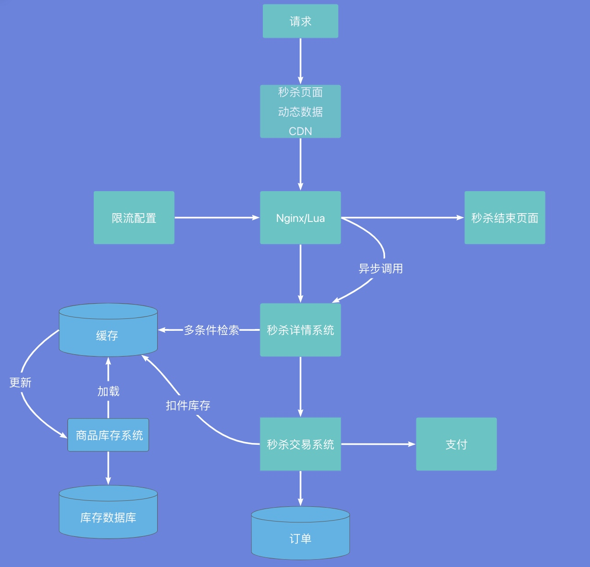
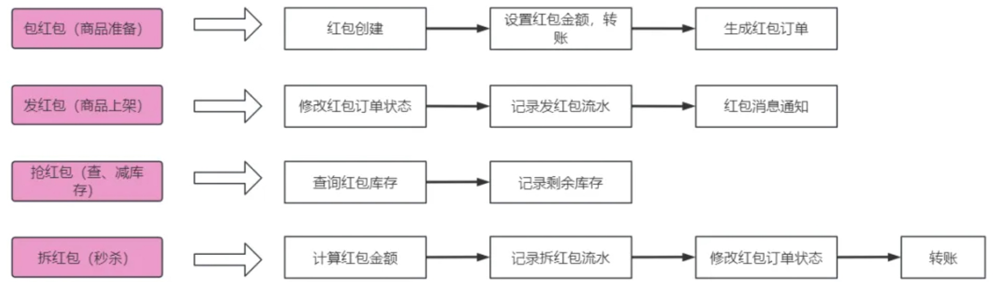

# Java基础
  - [**Java的8种基本数据类型**](#java的8种基本数据类型)
  - [python和c++与java区别](#python和c与-java区别)
  - [**面向对象和面向过程区别？**](#面向对象和面向过程区别？)
  - [**面向对象特征：封装、继承和多态**](#面向对象特征：封装、继承和多态)
  - [方法重载和重写的区别](#方法重载和重写的区别)
  - [== 和 equals比较](#和equals比较)
  - [String为什么是不可变的](#string为什么是不可变的)
  - [**String、StringBuffer、StringBuilder**](#string、stringbuffer、stringbuilder)
  - [如果自己定义一个类，类名叫String，这个类能生效吗](#如果自己定义一个类，类名叫string，这个类能生效吗)
  - [List和Set的区别](#list和set的区别)
  - [Array和ArrayList区别](#array和arraylist区别)
  - [**ArrayList和LinkedList的区别**](#arraylist和linkedlist的区别)
  - [**ArrayList扩容机制**](#arraylist扩容机制)
  - [抽象类和普通类的区别](#抽象类和普通类的区别)
  - [**接口和抽象类区别**](#接口和抽象类区别)
  - [**深拷贝和浅拷贝**](#深拷贝和浅拷贝)
  - [final关键词](#final关键词)
  - [static关键字](#static关键字)
  - [try&catch&finally&throw&throws](#try-catch-finally-throw-throws)
  - [从源码（.java）到代码**执行过程**](#从源码（java）到代码执行过程)
  - [直接获取Class对象方法](#直接获取class对象方法)
  - [**反射**概念、优缺点、应用场景](#反射概念、优缺点、应用场景)
- [**HashMap**](#hashmap)
  - [HashMap和HashTable区别](#hashmap和hashtable区别)
  - [HashMap底层实现](#hashmap底层实现)
  - [hashMap扩容机制](#hashmap扩容机制)
    - [**HashMap的长度为什么是2的幂次方**](#hashmap的长度为什么是2的幂次方)
  - [为什么HashMap线程不安全](#为什么hashmap线程不安全)
  - [HashMap 中的 key 为什么强烈推荐使用 String？](#hashmap中的-key为什么强烈推荐使用-string？)
  - [多少种**解决 hash 冲突**的方法？](#多少种解决hash冲突的方法？)
- [**concurrentHashMap**](#concurrenthashmap)
  - [ConcurrentHashMap和HashTable的区别](#concurrenthashmap和hashtable的区别)
  - [concurrentHashMap具体如何实现线程安全/分段锁机制](#concurrenthashmap具体如何实现线程安全分段锁机制)
  - [什么时候用CAS，什么时候用synchronized](#什么时候用cas，什么时候用synchronized)
  - [你讲了分段锁，那你讲讲为什么分段锁被concurrent废弃了，为什么不能在cas和syn上层再用分段锁优化呢](#你讲了分段锁，那你讲讲为什么分段锁被concurrent废弃了，为什么不能在cas和syn上层再用分段锁优化呢)
- [**线上问题**](#线上问题)
  - [生产环境服务器变慢，如何诊断处理](#生产环境服务器变慢，如何诊断处理)
  - [**线上接口负载剧增，快扛不住了，首选方案是什么**](#线上接口负载剧增，快扛不住了，首选方案是什么)
  - [线上服务器CPU飙升，如何定位到Java代码](#线上服务器cpu飙升，如何定位到java代码)
- [场景设计](#场景设计)
  - [**设计一个秒杀系统**](#设计一个秒杀系统)
  - [商品的库存有限，在面对大量订单情况下，如何解决超卖问题？](#商品的库存有限，在面对大量订单情况下，如何解决超卖问题？)
  - [如何保证秒杀系统的高可用？](#如何保证秒杀系统的高可用？)
  - [线程池方案](#线程池方案)
  - [如何对项目进行压测、有哪些工具](#如何对项目进行压测、有哪些工具)
  - [支付失败以及订单失效、又换圈及货品相关原子性问题](#支付失败以及订单失效、又换圈及货品相关原子性问题)
- [顺序打印ABC 三个线程](#顺序打印abc三个线程)
- [1G磁盘存储的数字数据文件A，256MB的内存，将他们排序并输出到文件B](#1g磁盘存储的数字数据文件a，256mb的内存，将他们排序并输出到文件b)
- [抢红包系统设计](#抢红包系统设计)
- [**哈希冲突**](#哈希冲突)
  - [java进程退出怎么分析排查](#java进程退出怎么分析排查)
  - [排查哪个对象占用了大内存](#排查哪个对象占用了大内存)


## **Java的8种基本数据类型**
* 4种整数型：byte1、short2、int4、long8
* 2种浮点型：float4、double8
* 1种字符类型：char2
* 1种布尔类型：boolean

## python和c++与java区别
0、**从语言自身看**
（1）C++作为一种面向对象语言，全面兼容了C语言，但引入了类、多态、RTTI、RAII等机制，相对于来说，从源码到可执行文件的过程和C语言几乎一样。
（2）Java语言作为面向对象高级语言，也有类、多态等概念，生态非常强大，一般来说，Java代码需要经过编译成字节码文件，也就是.class文件，然后再由JVM执行
（3）Python每一条语句的执行都是直接对源代码或者中间代码进行解释运行。而少了这个编译的过程，使得解释型语言运行相对较慢。python是脚本语言，一行一行代码直接执行，执行速度的较慢，


2、从场景
（1）C主要用来做嵌入式应用、算法实现、服务开发等。
（2）C++主要做图形图像处理、服务开发等。
（3）Java主要用在服务接口开发，大多数web系统的后台接口都有java开发。
（4）python用途相对还是广泛的，像网络爬虫、数据分析、自动化运维、人工智能等。
	
3、从跨平台看
C/C++可以让大家自行管理内存，单一不小心就会造成内存泄漏问题，导致程序崩溃，c/c++属于代码级别的跨平台，必须针对不同的平台进行编译。
而Java,python直接所谓的编译得到字节码文件（.class， .pyc），Java/Golang，所有内存生命周期都由JVM运行时统一管理，在内存有问题的时候，我们可以通过JVM来进行信息相关的分析诊断和调整


## **面向对象和面向过程区别？**

对比面向过程，是两种不同的处理问题的角度。

面向过程更注重事情的每一步骤及顺序，面向对象更注重有哪些参与者（对象）、及各自需要做的是什么？

比如：洗衣机洗衣服

面向过程会将任务拆解成一系列的步骤（函数）

1、打开一个洗衣机 --> 2、放衣服 --> 3、放洗衣液 --> 4、清洗 --> 5、甩干

面向对象回拆出“人”和“洗衣机”两个对象

人：打开洗衣机、放衣服、放洗衣液

洗衣机：清洗、甩干

从上述例子就能看出，**面向过程比较直接高效，而面向对象更易于后续的复用、拓展和维护**。

## **面向对象特征：封装、继承和多态**
1、封装：把属于同一类事务的共性（属性和方法）归到一个类中方便使用。好处：（1）设置类的成员变量为private，可以让外部代码无法直接访问，做到数据保护作用；（2）减少代码的复杂度，实现类内部的实现与外部的使用解耦

2、继承：子类继承父类后，重写父类方法（除私有属性和构造方法不能被继承），子类也可以**拓展**自己特有的属性和方法。

3、多态：同一个方法在不同对象的表现不同。有两种主要形式：方法重载和方法重写。优势：父类的代码可以在不同子类中复用，避免重复编写相同的代码；父类引用指向子类对象，减少了类型之间的耦合度。

## 方法重载和重写的区别

**重载：** 发生在**同一个类中**，**方法名必须相同，参数类型不同、个数不同、顺序不同，方法返回值和访问修饰符可以不同**，发生在编译时。

**重写：** 发生在**父子类中**，**方法名、参数列表必须相同**，返回值范围小于等于父类，抛出的异常范围小于等于父类，访问修饰符范围大于等于父类；如果父类方法访问修饰符为private则子类就不能重写该方法。

## == 和 equals比较

| 对比项   | ==                               | equals                   |
| -------- | -------------------------------- | ------------------------ |
| 作用范围 | 基本类型和引用类型               | 仅限于引用类型           |
| 比较内容 | 基本类型比较值，引用类型比较地址 | 对象内容比较         |
| 默认行为 | 无法更改                         | 可以通过重写改变比较逻辑 |
| 适用场景 | 判断是否是同一个对象             | 判断内容是否相等         |

1、默认情况下，比较对象内容用 equals()​​，而不是 ==。
2、​​重写 equals() 时，必须同时重写 hashCode()​​（遵循 equals-hashCode 契约）。
3、​​比较 String 时，永远用 equals()​​，避免 == 的陷阱。
4、​​对于缓存对象（如 Integer、Boolean），注意 == 的局限性​（缓存范围，Integer -128 ~ 127）​。

## String为什么是不可变的
不可变类：类实例化后，对象的属性不能在改变
如何修饰一个不可变类：
* `final`修饰类，不能被子类继承
* `final`修饰成员变量，只允许赋值一次
* 不暴露setter方法

不可变类优点：线程安全；坏处：频繁修改会浪费资源

## **String、StringBuffer、StringBuilder**
    
```
java
// String --> int
int num = Integer.parseInt(str);
          Integer.valueOf(str);

// String --> double
double num = Double.parseDouble(str);
             Double.valueOf(str);
```

（1）String
* 不可变：`String`是不可变类，字符串一旦创建，其内容无法更改，每次对`String`修改操作（拼接、截取），都会创建新的`String`对象
* 使用场景：`String`适用于字符串内容不会频繁变化的场景。（例如少量的字符串拼接操作或字符串常量）

（2）StringBuffer
* 可变：`StringBuffer`是可变的，可以进行字符串的追加、删除、插入等操作
* 线程安全：`StringBuffer`是线程安全的，内部使用了`Synchronized`关键字来保证多线程环境下的安全。
* 使用场景：`StringBuffer`适用于在多线程环境中需要频繁修改字符串的场景。

（3）StringBuilder
* 可变：`StringBuilder`也是可变的，提供了与`StringBuffer`类似的操作接口
* 非线程安全：`StringBuilder`不保证线程安全，性能比`StringBuffer`更高
* 使用场景：`StringBuilder`适用于单线程环境中需要大量修改字符串的场景（比如：高频拼接操作）

## 如果自己定义一个类，类名叫String，这个类能生效吗
不可以加载自定义的java.开头的任何类
因为JDK已经在loadClass方法中帮我们实现了ClassLoader搜索类的算法，当在loadClass方法中搜索不到类时，loadClass方法就会调用findClass方法来搜索类。

## List和Set的区别

**List**：有序，可重复，索引访问
**set**：无序，不可重复
**map**：键值对存储，键是唯一的，值可以重复


## Array和ArrayList区别 
* 长度：Array长度固定，初始化时必须制定大小，不可修改，不支持自动扩容；ArrayList长度动态，无需制定出时大小，可自动扩容
* 存储类型：Array可以存储基本数据类型「int、char」和对象；ArrayList仅能存储对象「基本类型需要用包装类，如Integer」


## **ArrayList和LinkedList的区别**
**1、数据结构：**
**ArrayList**：基于数组，连续内存存储，适合下标访问（随机访问）
**LinkedList**：基于双向链表，可以存储在分散的内存中，适合做数据插入及删除操作，不适合查询：需要逐一遍历

**2、内存占用：**
ArrayList：数组只存储数据，没有额外指针，但是数组扩容时，会占用较多内存
LinkedList：有指向前后元素的指针，内存开销较大

**3、随机访问性能：**
ArrayList：通过索引查找元素，时间复杂度O（1），空间复杂度O(n)
LinkedList：元素在内存中不连续，使用iterator遍历链表，时间复杂度O（n），O(n)

线程都是不安全的

**ArrayList可以插入Null吗**
ArrayList 可以插入 null 元素，且支持插入多个，因为其底层是 Object 类型的动态数组，Object 引用可指向 null，且源码未做 null 校验。但使用时需注意，遍历操作中直接调用 null 元素的方法会抛出空指针异常，需提前做空值判断；同时要区分其他集合的 null 支持性，比如 TreeSet、Hashtable 不支持插入 null，而 HashMap 仅允许 key 为 null 存 1 个、value 为 null 存多个。

## **ArrayList扩容机制**
因为数组长度固定，超出长度存数据时需要新建数组，然后将老数组的数据拷贝到新数组，如果不是尾部插入数据还会涉及到元素的移动（往后复制一份，插入新元素），使用尾插法并指定初始容量可以极大提升性能、甚至超过linkedList（需要创建大量的node对象）


## 抽象类和普通类的区别
实例化：普通类可以直接实例化对象，而抽象类不能被实例化，只能被继承
方法实现：普通类中的方法可以有具体的实现，而抽象类中的方法可以有实现，也可以没有实现
实现限制：普通类可以被其他类继承和使用，抽象类一般用作基类，被其他类继承和拓展使用


## **接口和抽象类区别**
抽象类abstract：描述类的共同特性和行为，适用于继承关系的场景
接口interface：定位行为规范，可以多实现，适合自定义类或功能
**区别**：
实现方法：实现接口的关键字为implements，继承抽象类的关键字为extends，一个类可以实现多个接口，但只能继承一个抽象类。
实现方法：接口只有定义，不能有方法的实现，抽象类可以有定义和实现
访问修饰符：接口的变量默认是 public static final（常量），必须赋值，不能被修改；抽象类成员变量默认default，可在子类中被重新定义，也可以被重新赋值

## **深拷贝和浅拷贝**
|    对比维度    |                浅拷贝（Shallow Copy）                 |                     深拷贝（Deep Copy）                      |
| :------------: | :---------------------------------------------------: | :----------------------------------------------------------: |
|  **拷贝范围**  |        仅拷贝对象本身，引用类型成员仅复制地址         |         拷贝对象本身 + 所有引用类型成员（递归拷贝）          |
| **对象独立性** |      基本类型独立，引用类型共享，修改会相互影响       |               完全独立，所有成员修改都互不影响               |
|  **实现方式**  | 实现`Cloneable`，重写`clone()`（调用 super.clone ()） | 1. 引用类型也实现 Cloneable，递归 clone ()2. 实现 Serializable，序列化 + 反序列化 |
|  **拷贝效率**  |             高（native 方法，仅表层拷贝）             |             低（递归 / 序列化，需创建多个对象）              |
| **实现复杂度** |           简单（仅原类实现 Cloneable 即可）           |             复杂（引用类型需同步实现，或序列化）             |
|  **适用场景**  |    对象仅含基本类型 / 不可变引用类型（如 String）     |         对象含自定义可变引用类型（如自定义类、集合）         |

深拷贝和浅拷贝是 Java 对象复制的两种方式，核心区别在于是否复制引用类型成员：
* 浅拷贝：实现Cloneable并重写clone()，创建新对象，仅复制基本类型值和引用类型地址 —— 基本类型独立，引用类型共享，修改引用类型会相互影响，效率高、实现简单，适合仅含基本类型 / 不可变引用类型的对象；
    * 如Person[]
* 深拷贝：要么让所有引用类型都实现 Cloneable 并递归调用 clone ()，要么通过序列化 + 反序列化 —— 创建全新对象，递归拷贝所有引用类型成员，原对象和拷贝对象完全独立，修改互不影响，适合含可变引用类型的复杂对象，但效率稍低、实现稍复杂；
    * （如int[]、char[]）的拷贝（如Arrays.copyOf()、System.arraycopy()、数组clone()）
* 特殊点：String 是不可变引用类型，浅拷贝后修改看似独立，实际是因为 String 不可变，修改会创建新对象；基本数据类型数组的拷贝是深拷贝，引用类型数组的拷贝是浅拷贝

**ArrayList 的clone()方法是浅拷贝还是深拷贝？**
ArrayList 的clone()是浅拷贝—— 源码中 ArrayList 的 clone () 调用了super.clone()，并复制了底层的 Object 数组，但数组中的元素如果是引用类型，仅复制地址


## final关键词
修饰禁止类被继承或方法重写

## static关键字
修饰变量：被 static 修饰的变量是静态变量（类变量），属于类本身而非实例，所有对象共享同一内存空间。可通过类名直接访问，无需创建对象

实现了数据共享和无需实例化即可访问的特性

**静态代码**：静态代码块随类的初始化执行，仅执行一次，优先于构造方法执行，用于完成类的静态资源初始化。

## try&catch&finally&throw&throws
finally：代码块中无论发生是否发生异常都会执行，通常用于资源清理（关闭文件流、数据库连接）
throw：用于显示抛出异常，在方法内部逻辑，可以使用`throw`后面跟一个new异常对象：throw new ExceptionType("message")
throws：用于声明方法中可能会抛出异常。它出现在方法签名中，表示该方法内部有可能会抛出某种类型的异常，调用该方法时需要处理这些异常（通过 try-catch 或进一步抛出）。throws ExceptionType1, ExceptionType2

## 从源码（.java）到代码**执行过程**
步骤：编译 --> 加载 --> 解释 --> 执行
**编译**：将源码文件编译成JVM可以解释的class文件，在编译的过程中，会对源代码做“语法分析”“语义分析””注解处理“等等处理，最后再生成字节码文件。
**加载**：将编译后的class文件加载到JVM中，在加载阶段又可以细化几个步骤：装载->连接->初始化。
> ①装载分为几个层面：①装载时机，为了节省内存的开销，并不会一次性把所有的类都装载至JVM，而是等到有需要的时候才进行装载(比如new和反射等)②装载发生，class文件是通过类加载装载到jvm中的，为了防止内存中出现多份同样的字节码，使用了双亲委派机制（他不会自己去尝试加载这个类，而是把请求委托给父加载器去完成，依次向上）③装载规则，JDK的本地方法类一般由根加载器装载，JDK内部的实现类一般由扩展加载器，而程序中的类文件则由系统加载器实现装载。
	总结：装载这个阶段它做的事情可以总结为：查找并加载类的二进制数据，在JVM「堆」中创建一个java.lang.Class类的对象，并将类相关的信息存储在JVM「方法区」中。
通过「装载」这个步骤后，现在已经把class文件装载到JVM中了，并创建出对应的Class对象以及类信息存储至方法区了。
②连接：这个阶段做的事情总结为：对class的信息进行验证、为类变量分配内存空间并对其赋默认值。而且在连接这个过程中连接又可以细化为几个步骤：验证->准备->解析。①验证：验证类是否符合java规范和jvm规范。②准备：为类的静态变量分配内存，初始化为系统的初始值。③解析：将符号引用转为直接引用。通过「连接」这个步骤后，现在已经对class信息做校验并分配了内存空间和默认值了。
	③初始化：这个阶段是为类的静态变量赋予正确的初始值，过程大概就是收集class的静态变量、静态代码块、静态方法，随后从上往下开始执行，如果是实例化对象则会调用对应的实例变量进行初始化，并执行对应的构造方法内的代码。

**解释**：把字节码转换为操作系统识别的一个指令。在解释这个阶段会有两种方式把字节码信息解释成机器指令码，一个是字节码解释器、一个是即时编译器JIT。

**执行**：操作系统把解释器解析出来的指令代码，调用系统的硬件执行最终的程序指令。

## 直接获取Class对象方法
1、通过类名直接获取：
```
Class<?> clazz = YourClass.class;
```
2、通过对象获取
```
Class<?> clazz = obj.getClass();
```
3、通过类的全名获取
```
Class<?> clazz = Class.forName("com.example.YourClass");
```
## **反射**概念、优缺点、应用场景
**1、概念**
反射可以在运行时访问Java对象的属性、方法、构造器等信息。还可以实例化对象，调用方法和获取、设置字段值。
**2、优缺点**

优点：
1、动态性和灵活性：反射允许我们在运行时动态地加载类、创建对象、访问和修改字段及方法。这使得程序可以更加灵活。反射还可以在程序运行时根据配置文件或用户输入来创建和操作类的实例，避免硬编码。
2、框架开发：Spring依赖注入、自动化配置、动态代理等功能
3、代码解耦：比如可以根据类的名称动态加载类并执行，而不需要在编译时就指定具体的类名。

缺点：
1、性能开销：反射操作比直接的类加载和方法调用要慢很多，因为反射需要进行一些额外的查找操作（如查找方法、构造函数等）。例如，调用 Method.invoke() 的性能要比直接调用方法低。尤其对于高性能场景，频繁反射操作的开销就会成为瓶颈。
2、安全性问题：反射允许访问私有字段、方法和构造器，因此可能绕过访问控制，造成未授权的访问或数据泄露。
3、维护性差：由于反射是动态的，程序的行为可能会发生变化，增加了理解和维护的难度。

**3、应用场景**
1、使用JDBC连接数据库时，Class类的静态方法forName(String className)执行已知类的静态块
2、Spring框架的IOC功能就是通过反射实现的


# **HashMap**
## HashMap和HashTable区别
* 线程安全：`HashMap`是非线程安全的，`Hashtable`线程安全，因为`Hashtable`内部的方法基本都经过`synchronized`修饰。（如果要保证线程安全，我们一般都使用`CurrentHashMap`）
* 对Null key和Null value的支持：`HashMap`允许存储null的key和value，但null作为键只能有一个，null作为值可以有多个；`Hashtable`不允许有null键和null值，否则会抛出`NullPointerException`

## HashMap底层实现
JDK1.8之前`HashMap`底层是**数组和链表**结合在一起使用（也就是**链表散列**）。HashMap通过key的`hashcode`经过扰动函数处理过后得到hash值，然后通过`(数组长度 - 1) & hash`判断当前元素存放的位置，如果当前位置存在元素的话，就判断该元素与要存入元素的hash值以及key是否相同，如果相同的话，直接覆盖，不相同就通过**拉链法**解决冲突。
`HashMap`中的扰动函数是用来优化哈希值的分布，通过对原始的`hashCode()`进行额外处理，扰动函数可以减少由于糟糕的`hashCode()`实现导致的碰撞，从而提高数据的分布均匀性。
**拉链法**：将链表和数组相结合。也就是说创建一个链表数组，数组中每一格就是一个链表。若遇到哈希冲突，则将冲突的值加到链表中即可。

但是如果数组索引上的链表非常长，需要遍历的元素就很多，所以JDK1.8对HashMap的数据结构进行了优化。
JDK1.8HashMap底层数据结构改成了**数组 + 链表 + 红黑树**在解决哈希冲突时有了较大的变化，当链表长度大于阈值（默认为8）时，链表转化为红黑树（将链表转化为红黑树前会判断，如果当前数组的长度小于64，那么会先对数组进行扩容，而不是转化为红黑树），减少搜索时间，链表查询效率：O(n)（n-链表长度）

**为什么优先扩容而非直接转为红黑树**
数组扩容能减少哈希冲突的发生概率（即将元素重新分散到新的、更大的数组中），这在多数情况下比直接转换为红黑树更高效
红黑树是一种自平衡二叉搜索树，查询效率为O(logn)，当链表较短时，O(n)和O(logn)的性能差异不明显，但是当链表变长时，查询性能会随着链表长度的增加显著增加。维护成本较高，并且，过早引入红黑树反而会增加复杂度
[红黑树基础](mweblib://17433439345698)

**为什么选择阈值8和64？**
1、链表长度达到8的概率极低，在绝大多数情况下，链表的长度都不会超过8，阈值设置为8，可以保证性能和空间效率的平衡。
2、数组长度阈值64同样时经过前人实践验证的经验值，在小数组中扩容成本低，优先扩容可以避免过早引入红黑树。数组大小达到64时，冲突概率较高，此时红黑树的性能优势开始显现

* 选 7：节点数 7 的出现概率是 9.4/1000 万，依然是小概率事件，但提前树化会让红黑树的维护成本提前产生（红黑树插入 / 删除需要旋转，单节点操作开销远大于链表），属于 “过度优化”，浪费性能；
* 选 9：节点数 9 的出现概率几乎为 0，会导致哈希冲突极其严重时才优化，链表会更长（9 个节点），查询效率更低，出现 “优化不及时” 的问题；
* 选 8：刚好卡在 “小概率事件的临界值”—— 既不会过度优化，又能在哈希冲突严重时及时优化，是 **“性能优化的最佳时机”**


**变为红黑树情况下，是否可以回退为链表**
会的，在不断删除元素情况下，会导致某个桶的元素节点减少到 UNTREEIFY_THRESHOLD（默认值 6）以下时，红黑树会自动退化为链表。这个机制是为了减少维护红黑树的开销，因为当元素较少时，链表的遍历性能反而比红黑树更好。

**为什么退化选6**
* 不选 7：若退化阈值设为 7，树化 8→退化 7→树化 8，仅一个节点的增删就会触发树化 / 退化，抖动会极其频繁，红黑树的维护开销会远大于其查询优势；
* 不选 5：缓冲区间过大（8-5=3），会导致红黑树在节点数较少时仍被保留（比如 5、6 个节点），此时红黑树的查询优势（O (logn)）不明显，但其维护开销（旋转）远大于链表，属于 “性能浪费”；
* 不选 8：树化和退化阈值相同，会导致节点数 8 时反复树化 / 退化，完全失去优化意义；
* 选 6：缓冲区间为 2（7、8 为树化区，≤6 为退化区），既能避免频繁抖动（少量节点增删不会触发转换），又能在红黑树节点数过少时及时退化（6 个节点的链表查询效率比红黑树更高），是缓冲区间的 “最优值”。

**为什么不直接使用红黑树？**
HashMap 不直接使用红黑树，核心是红黑树的高开销、高内存占用与 HashMap 的设计目标相冲突，具体可概括为 3 句话：
* 性能开销：红黑树的单节点操作需要旋转 / 变色维护平衡，开销远高于链表，n≤8 时，O (logn) 的步数优势抵不过单步高开销，实际效率更差；
* 内存浪费：红黑树节点的内存占用是链表的 2 倍以上，HashMap 的大数组会导致海量的无效内存占用，还会降低 CPU 缓存命中率；
* 设计目标：HashMap 的核心是哈希表，追求 O (1) 的平均时间复杂度，而红黑树的 O (logn) 会放弃这一核心优势，违背 HashMap 的设计初衷。

## hashMap扩容机制
当调用put()向HashMap中添加元素时，如果当前数据量超过容量阈值（当前容量与负载因子「默认0.75」的乘积）时，HashMap调用进行扩容操作：
* 触发条件：元素数≥阈值，或链表≥8 且数组＜64 时触发，始终保证容量是 2 的幂；
* 核心优化：2 倍扩容后无需重算 hash，通过hash & oldCap判断新索引，链表拆分为两个有序链表尾插迁移，避免环问题；
* 设计原则：以 0.75 负载因子平衡空间与时间，小容量先扩容再树化，位运算替代算术运算提升全流程效率。


**HashMap的负载因子为什么默认值设置成0.75？**
负载因子用于表示hash表中元素填满的程度，默认是0.75是基于空间和时间之间做的一个折中选择
* 若负载因子大于0.75，好处就是空间利用率更高了，能够容纳更多元素，但是它会增加hash冲突的概率，导致效率降低。
* 若负载因子小于0.75，意味着可以减少hash冲突的概率，但是它会导致HashMap空间利用率更低，会增加扩容操作的频率，从而在插入新元素时导致性能下降。

0.75是经验值，负载因子的作用是为了节省空间和时间

### **HashMap的长度为什么是2的幂次方**
核心原因是让哈希分布更均匀，且支持位运算优化：
* 容量为 2 的幂时，capacity-1的二进制是全 1，hash & (capacity-1)的结果等价于hash % capacity（取模），但位运算效率远高于取模；
* 全 1 的二进制能让 hash 值的每一位都参与运算，减少哈希冲突，让节点在数组中分布更均匀；
* 为 2 倍扩容的位运算优化打下基础，无需重算 hash 就能确定新索引。

## 为什么HashMap线程不安全
JDK1.7多线程环境下，由于一个桶中有多个元素需要进行扩容时，多线程同时对链表进行操作，头插法可能会的导致链表中的节点指向错误的位置，从而形成一个环形链表，进而使得查询元素的操作陷入死循环无法结束，或引起数据丢失。
jdk1.8多线程环境下，采用尾插法而不是头插法，来避免链表倒置，使得插入的节点永远都是放在链表的末尾，避免了链表中的环形结构，但是多线程下使用HashMap，还是会存在数据覆盖的情况。

**如何解决？**
使用ConcurrentHashMap。它是一个线程安全且高效的HashMap，它使用了分段锁机制，不同线程可以同时访问不同的分段，从而实现了高并发的访问。

## HashMap 中的 key 为什么强烈推荐使用 String？
* 缓存哈希码：String内部缓存了其哈希码，第一次调用hashCode()时计算哈希码，之后就直接返回缓存的值，这就意味值我们使用string作为HashMap的key时，计算哈希码的开销只发生一次，提高了使用String作为键时的性能
* String是不可变的：一旦创建，String对象的内容就不能被修改，当我们使用一个对象作为HashMap的key时，其哈希码必须保持不变，否则就会找不到键值对了，而String是不变的，其哈希码也不会改变，这保证了Key的一致性 

## 多少种**解决 hash 冲突**的方法？
**问题描述**：两个不同的输入值，通过Hash函数计算得到了相同的hash值，尝试存储在hash表中的同一个位置
**解决**：
* **拉链法**：解决hash冲突最经典的办法，它是通过将具有相同hash值的所有元素存储在同一个索引位置的链表中来解决冲突的
* **再hash法**：依赖多个hash函数来寻找空闲的槽位，思想是：当第一个hash函数h1(x)导致冲突时，系统将尝试第二个hash函数h2(x)，如果仍然冲突，那么继续尝试第三个，依次类推，知道找到一个空闲槽位为止

# **concurrentHashMap**
## ConcurrentHashMap和HashTable的区别
* 底层数据结构：JDK1.7的`ConcurrnetHashMap`底层采用**分段数组+链表**实现，JDK1.8采用数组+链表/红黑树，Hashtable和jdk1.8之前的HashMap的底层数据机构类似采用都是**数组+链表**的形式
* 实现线程安全的方式：
    * JDK1.7的时候，`ConcurrentHashMap`对整个桶组进行了分割分段（`Segment`，分段锁），每一把锁只锁容器其中一部分数据，多线程访问容器里不同数据段的数据，就不会存在锁竞争，提高并发访问率
    * 到了JDK1.8的时候，`ConcurrentHashMap`摒弃了`Segment`，而是直接采用`Node`数组+链表+红黑树的数据结构来实现，并发控制使用`synchronized`和CAS来操作，整个看起来就好像是优化过且线程安全的`HashMap`
    * `Hashtable`（**同一把锁**）：使用`synchronized`来保证线程安全，效率非常低下。当一个线程访问同步方法时，其他线程也访问同步方法，可能**会进入阻塞或轮询状态**，如使用put添加元素，另一个线程不能使用put添加元素，也不能使用get，竞争会越来越激烈且效率较低

## concurrentHashMap具体如何实现线程安全/分段锁机制
**1.8之前**
首先将数据分为一段一段（Segment）的存储，然后给每一段数据配一把锁，当一个线程用锁访问其中一段数据时，其他段的数据也能被其他线程访问。
`ConcurrentHashMap`是由`Segment`数据结构和`HashEntry`数组构成，`Segment`继承`ReentrantLock`，所以`Segment`是一种可重入锁，扮演锁的角色，`HashEntry`用于存储键值对数据。
一个`ConcurrentHashMap`里包含一个`Segment`数组，`Segment`的个数一旦初始化就不能改变。`Segment`数组的大小默认是16，也就是说同时支持16个线程并发写。
`Segment`的结构和`HashMap`类似是一种数组和链表结构，每个`Segment`守护着一个`HashEntry`数组里的元素，当对`HashEntry`数组的数据进行修改时，必须首先获取对应的`Segment`的锁，也就是对同一`Segment`的并发写会被阻塞，不同`Segment`的写入是可以并发执行的。

**1.8之后**
`ConcurrentHashMap`取消了`Segment`分段锁，采用了`Node + CAS + synchronized`来保证并发安全，在链表长度超过一定阈值（8）时将链表（寻址时间复杂度为O(n)）转换为红黑树（寻址时间复杂度为O(logn)）
Java8中，锁粒度更细，`synchronized`只锁定当前链表或红黑二叉树的首节点，这样只要hash不冲突，就不会产生并发，不会影响其他Node的读写

## 什么时候用CAS，什么时候用synchronized
轻量无冲突用 CAS，复合有冲突用 Synchronized
**优先用 CAS 的场景（满足所有条件）**
* 操作对象是单个变量 / 内存地址，无多步复合逻辑，CAS 能保证该操作的原子性；
* 并发冲突概率极低（如初始化操作、**读多写少**场景），避免 CAS 自旋耗 CPU；
* 非阻塞需求：不希望线程因竞争失败而阻塞，允许自旋等待（如轻量的状态标记）；
* 操作是幂等的：多次执行不会导致数据不一致（避免 CAS 自旋带来的重复操作问题）。

**必须用 Synchronized 的场景（满足任一条件）**
* 操作是复合逻辑 **（多步操作）**，CAS 无法保证多步操作的原子性；
* 并发冲突概率较高（如**写多读少**、热点数据操作），CAS 自旋会严重耗 CPU，Synchronized 锁升级更高效；
* 操作涉及多个变量，需要保证多个变量的修改一致性（如同时修改链表的尾节点和长度）；
* 需要独占式访问资源：如操作共享的复杂数据结构（链表、红黑树、哈希表）。


**不全都用 CAS 的原因**：CAS 仅支持单变量原子操作、高冲突下自旋耗 CPU、存在 ABA 问题，无法处理 ConcurrentHashMap 中链表 / 红黑树的复合操作。
**CAS 的适用场景**：单个变量操作、无复合逻辑、冲突概率极低，如 ConcurrentHashMap 中的空桶初始化、尾节点轻量插入；

**不都用Synchronized的原因**：全程用 Synchronized 会牺牲低竞争场景的并发效率，而 CAS 能在「无冲突 / 低冲突的轻量操作」中做到「无锁级别的高效」——全程用 Synchronized 会让简单操作承担不必要的锁开销，违背 ConcurrentHashMap “极致细粒度并发” 的设计目标。
**Synchronized 的适用场景**：复合逻辑、多步操作、冲突概率较高，如 ConcurrentHashMap 中的非空链表 / 红黑树的增删改、树化 / 反树化；

## 你讲了分段锁，那你讲讲为什么分段锁被concurrent废弃了，为什么不能在cas和syn上层再用分段锁优化呢
**1. 分段锁被 Concurrent 包替代的核心原因**
- **并发度硬上限**：分段数固定，高并发下退化为局部锁竞争；
- **资源浪费**：分段的独立结构占用大量内存，且无法懒加载；
- **JDK 原生优化让其优势丧失**：CAS/Synchronized 的细粒度优化，性能远超分段锁的重量级锁实现；
- **设计复杂度高**：分段管理、跨分段操作、独立扩容的逻辑复杂，维护成本大。

**2. 不能在 CAS/Sync 上层叠加分段锁优化的核心原因**
- **理念冲突**：分段锁是 “锁粒度拆分”，而 CAS/Sync 的优化方向是 “无锁 / 更细粒度锁”，叠加后锁粒度变粗，丧失原生优势；
- **性能负优化**：叠加分段锁会引入额外的分段计算、锁管理开销，比直接使用 CAS/Sync 更慢；
- **问题重叠**：分段锁能解决的 “锁竞争” 问题，CAS/Sync 自身已经通过无锁、细粒度锁、多级优化更好地解决；
- **无效解决**：分段锁无法解决 CAS 的高冲突问题，反而会将无锁冲突转化为更昂贵的锁竞争；
- **性价比极低**：叠加后的开发 / 维护复杂度大幅提升，而性能提升为 0 甚至为负。

简单说：**分段锁是 JDK 低版本的 “权宜之计”，而 CAS + 细粒度 Synchronized 是 JDK 高版本的 “最优解”**，分段锁能解决的问题，现代并发策略已经能更好地解决，而分段锁的缺点，现代并发策略完全规避，因此无需再使用分段锁，更无需在 CAS/Sync 上层叠加分段锁。


# **线上问题**
## 生产环境服务器变慢，如何诊断处理
生产环境服务器变慢我觉得主要从三个方面去考虑：CPU利用率、磁盘I/O效率、内存瓶颈。
①**cpu利用率**。CPU利用率过高或者CPU利用率过低，都会影响程序的处理效率。CPU利用率过高，说明当前服务器要处理的指令比较多，当CPU忙不过来的时候，指令的运行效率自然就会下降，用户的感受就是程序响应变慢了。
（针对这个问题，我们可以使用top命令查询当前系统中占用CPU过高的进程，并定位到这个进程中比较活跃的线程。再通过jstack命令打印当前虚拟机的线程快照，根据快照日志排查问题代码。（这个得看你简历有没有写Arthas这个技术栈）
Arthas使用thread, 命令查询当前系统中占用CPU过高的进程，并通过thread id，查看线程堆栈查询到对应的方法，同时根据快照日志排查问题代码。）
如果CPU利用率过低，则说明程序资源使用不够，可以增加线程数量提升程序性能。
②**磁盘I/O效率**。在程序运行过程中会直接或者间接涉及一些与磁盘I/O相关的操作，比如程序直接读/写磁盘或者程序依赖的第三方组件对磁盘进行持久化存储，此时磁盘I/O效率就会对程序运行效率产生影响。
针对这种情况可以使用iostat命令查看，如果磁盘负载较高，可以针对性地进行优化。比如，**借助缓存系统，减少磁盘I/O次数；用顺序写替代随机写入，减少寻址开销；使用mmap替代read/write，减少内存拷贝次数**。另外，磁盘I/O效率可以通过CPU与负载的非线性关系体现出来。当负载增大时，系统吞吐量不能有效增大，CPU不能线性增长，则很可能是磁盘I/O出现阻塞。
> 补充：mmap与read/wirte对比以及mmap优缺点：
> https://nineright.github.io/2014/03/12/mmap-io.html

③**内存瓶颈**。内存作为一块临时存储数据的组件，所有CPU运行的指令都需要从内存中去读/写。内存的合理使用可以减少应用和磁盘的I/O频率，减少网络I/O的频率，极大地提升I/O性能。
JVM对内存的合理分配，能够避免频繁的YGC和FULL GC。可以通过使用jvm：查看当前 JVM 的相关信息，包括堆大小、GC 策略、线程数等。当内存使用率较高时，查出大对象或者占用内存最多的对象，以及排查是否存在内存泄漏的问题。如果堆内存文件正常，则可以考虑是堆外内存被大量使用导致出现问题，此时需要借助操作系统的pmap命令查出进程的内存分配情况。如果CPU和内存使用率都很正常，那么就需要进一步开启GC日志，分析用户线程暂停的时间、各部分内存区域GC次数和时间等指标，这里可以借助jstat命令或可视化工具GCEasy等。如果问题出在GC上，则考虑是不是内存不足，然后根据垃圾对象的特点进行参数调优，使用更适合的垃圾收集器，用thread命令分析各个线程的状态。

## **线上接口负载剧增，快扛不住了，首选方案是什么**
接口性能，代码层面：for new对象，for插入，查找，数据库层面：分库分表，索引，然后就是加缓存
当并发量过高扛不住的时候，可以优先采用缓存来缓解负载压力。比如**将读取频繁的数据写到缓存中，将动态页面静态化。在加上缓存之后，如果负载压力依然过大，则再考虑增加限流策略，比如消息队列；如果在增加限流后还是压力过大，则再考虑增加服务器节点**。

## 线上服务器CPU飙升，如何定位到Java代码

CPU负载过高一般是某个或某几个线程有问题。	
隔离
**基础版**: 
第1步，使用top命令找到占用CPU高的进程。
第2步，使用ps –mp命令找到进程下占用CPU高的线程ID。
第3步，使用printf命令将线程ID转换成十六进制数, 这样就得到了真正占用CPU过高的线程ID。
第4步，使用jstack命令输出线程运行状态的日志信息。
上述步骤虽然能大致定位到问题范围，但有效信息还是太少了，多数时候还是要靠猜。

进阶版使用Arthas：使用thread命令，这个命令会显示所有线程的信息，并且把CPU使用率高的线程排在前面。
根据前面的找出来的线程通过thread id，查看线程堆栈，这一步就可以定位到我们消耗比较高的方法的地方。
找到对应的方法之后我觉得应该从两方面去判断一个是xx方法是否存在循环调用、二是xx方法内部又死循环。
通过使用tt命令监听一下这个方法的调用情况，可以判断方法是否被一直的调用，这样可以筛选出第一种情况。
如果是方法内部出现死循环可以通过jad反编译查看对应的代码，也可以直接找到源码去查看。
补充：tt 命令会记录方法调用时的所有入参和返回值、抛出的异常、对象本身等数据。INDEX字段代表着一次调用，后续tt还有很多命令都是基于此编号指定记录操作，通过 -i 参数后边跟着对应的 INDEX 编号查看这条记录的详细信息。再通过-w参数，指定一个OGNL表达式，查找相关对象


# 场景设计
## **设计一个秒杀系统**
首先秒杀系统其属于瞬时高并发场景，如果我来设计可能会从以下几个方面进行入手：
1.前端的页面静态化，活动作为用户流量的第一入口，所以是并发量最大的地方，如果这些流量都直接访问服务端，服务的可能会直接挂掉，并且只有等到秒杀开始才能请求后端，这样能够过滤一部分无效的请求。
2.在页面静态化的基础上，需要使用CDN，让用户就近获取所需的内容，提高用户访问响应速度和命中率。
>补充：CDN 的工作原理是，当用户访问某个网站时，CDN 会根据用户的 IP 地址将请求转发到离用户最近的服务器。该服务器会将内容从源服务器中读取出来，并将其缓存到本地。下次用户访问该内容时，CDN 会直接从本地服务器中返回内容，从而减少了从源服务器中传输内容所需的时间。

3．并且秒杀是一个读多写少的场景，这个时候我们需要用到redis缓存，里面包含商品id，规格属性，库存等信息，这个是与数据库一致的
但是这样也会出现缓存相关的一些问题，例如：缓存击穿：第一次的时候商品数据并不在缓存中，这里可以通过加锁以及缓存预热进行解决。

发现问题：秒杀时，大量请求同时涌入，会导致数据库连接池耗尽、库存超卖、接口超时。
分析瓶颈：
流量峰值：QPS 可能达到 10 万 +，直接打数据库会导致雪崩。
数据一致性：库存扣减需要原子性，避免超卖。
设计方案：
* 流量削峰：用 Redis 做缓存，把库存信息提前加载到 Redis，请求先到 Redis 扣减库存，成功后再异步更新数据库。
* 原子扣减：用 Redis 的DECRBY命令扣减库存，返回值 < 0 时直接拒绝请求，保证原子性。
* 分布式锁：用 Redisson 的可重入锁，防止重复提交和超卖。
* 务降级：用 Sentinel 做限流，当 QPS 超过阈值时，返回 “活动太火爆，请稍后再试”，避免系统崩溃。

验证效果：我在某电商秒杀项目中，通过以上方案，把 QPS 从 1 万提升到 10 万 +，库存超卖率从 0.5% 降到 0，接口响应时间从 500ms 降到 50ms。
复盘优化：后续我引入了本地缓存（Caffeine）缓存热点商品信息，进一步减轻 Redis 的压力，同时用消息队列（RabbitMQ）异步处理订单，提升了系统的吞吐量。


## 商品的库存有限，在面对大量订单情况下，如何解决超卖问题？
4.对于库存这里使用预扣库存，先将库存-1然后等待用户支付，如果超时未支付则库存+1。
	由于查询操作和更新操作不是原子性的，会导致在并发的场景下，出现库存超卖的情况。为了解决这个问题，首先在数据库中加入在sql最后加上：stock > 0，就能保证不会出现超卖的情况。在redis这边可以使用lua脚本进行查询和扣减库存操作，是能够保证原子性的，它跟redis一起配合使用，能够完美解决上面的问题。
并且redis搭配使用分布式锁，也能防止缓存穿透的问题，并且使用自旋锁，使用自旋锁是为了避免比如：每1万个请求，有1个成功。再1万个请求，有1个成功。如此下去，直到库存不足。这就变成均匀分布的秒杀了。同时这时候还涉及到锁重入、续期等一些问题。
秒杀系统中，真正并发量大的是秒杀功能，下单和支付功能实际并发量很小。所以，我们在设计秒杀系统时，有必要把下单和支付功能从秒杀的主流程中拆分出来，特别是下单功能要做成mq异步处理的。而支付功能，比如支付宝支付，是业务场景本身保证的异步。

如何防止**mq信息丢失**，增加一张**消息发送表**在生产者发送mq消息之前，先把该条消息写入消息发送表，初始状态是待处理，然后再发送mq消息。消费者消费消息时，处理完业务逻辑之后，再回调生产者的一个接口，修改消息状态为已处理。并使用使用job，增加重试机制。
如果由于网络延迟导致**重复消费**的话，增加一张**消息处理表**，并且下单和写消息处理表，要放在**同一个事务中**，保证原子操作。
	
下单后没有第一时间支付这里有个延时消费问题，使用延迟队列。我们都知道rocketmq，自带了延迟队列的功能，下单时消息生产者会先生成订单，此时状态为待支付，然后会向延迟队列中发一条消息。达到了延迟时间，消息消费者读取消息之后，会查询该订单的状态是否为待支付。如果是待支付状态，则会更新订单状态为取消状态。如果不是待支付状态，说明该订单已经支付过了，则直接返回。

并且对于整个秒杀系统来说，为了避免机器人请求导致流量爆炸，还需要进行**限流**，限流可以通过对用户限流也可以通过对同一ip进行限流。或者是在请求之前进行验证码验证，或者提高秒杀门槛，在业务手段进行限流

（推荐）Sentinel限流 --> 流量控制、熔断降级、系统自适应保护 、 redis集群化（Lua脚本）

降级（丢车保帅，有限保证核心业务，应对系统自身故障）：当强求达到一个阈值的时候，我们对系统中一些非核心的功能直接关闭或者让他们功能降低。这样的话，系统就有更多的资源留给秒杀系统了。

熔断（应对当前系统依赖的外部系统或者第三方系统故障）：熔断可以防止因秒杀系统交易影响到其他服务的提供。举个例子：秒杀功能位于服务A上，服务A上同时还有其他的一些功能比如商品管理。如果服务A上的商品管理接口响应非常慢的话，其他服务直接不在请求服务A上的商品管理这个接口，从而有效避免其他服务被拖慢甚至拖死。

## 如何保证秒杀系统的高可用？
## 线程池方案
限流(RateLimiter，限制QPS，避免瞬时打崩数据库) + 线程池(ThreadPoolExecutor / FixedThreadPool) + MQ（削峰，秒杀不直接访问数据库，而是进入消息队列，后台消费者逐个处理）


## 如何对项目进行压测、有哪些工具

## 支付失败以及订单失效、又换圈及货品相关原子性问题


**流程图**


# 顺序打印ABC 三个线程
ReentrantLock结合Condition，首先建立三个线程对象并且继承Thread类，在run方法里面，分为try catch finally三部分，try是我们主要的方法，里面先进行加锁lock，然后写循环，循环里面打印对应的a、b、c，（至于要打印多少次结合具体的场景去判断，这里默认一次），这里使用一个count，并分别通过count%3 ==0/1/2来判断当前是否需要await释放，a执行完signal B，然后释放锁。
	
# 1G磁盘存储的数字数据文件A，256MB的内存，将他们排序并输出到文件B
首先先采用分治的思想，把大文件划分成不同的小块，对于每个词x，取hash(x)%5000，然后按照该值存到5000个小文件(记为f0,f1,…,f4999)中，这样每个文件大概是200k左右这样的操作保证了每个相同的词一定被映射到了同一文件中。
对于每个文件fi，都用hash_map做词和出现频率的统计，并每个文件使用堆排序，最后得到5000个文件归并文件取出top100存放到文件b。

# 抢红包系统设计
抢红包系统从功能可以拆分为：包红包、发红包、抢红包、拆红包，4个功能。
对于系统特性来说，抢红包系统和秒杀系统类似。

每次发红包都是一次商品秒杀流程，包括商品准备、商品上架、查库存、减库存、以及秒杀开始，最终的用户转账就是红包到账的过程。

难点：
1、高并发：海量并发请求，秒杀只有一次活动，但抢红包同一时刻有几十万秒杀活动。
2、安全性：红包业务涉及资金交易，所以一定不能出现超卖、少卖的情况。
* 超卖：发了 10 块钱，结果抢到了 11 块钱，多的钱只能系统补上，如此为爱发电应用估计早就下架了；
* 少卖：发了 10 块钱，只抢了 9 块，多的钱得原封不动地退还用户，否则第二天就接到法院传单了。

3、严格事务
参与用户越多，并发 DB 请求越大，数据越容易出现事务问题，所以系统得做好**事务一致性**。
这也是一般秒杀活动的难点所在，而且抢红包系统涉及金钱交易，所以事务级别要求更高，**不能出现脏数据**。

功能说明：
抢红包功能允许用户在群聊中发送任意个数和金额的红包，群成员可以抢到随机金额的红包，但要**保证每个用户的红包金额不小于 0.01 元。**

**抢红包的详细交互流程如下**：
1、用户接收到抢红包通知，点击通知打开群聊页面；
2、用户点击抢红包，后台服务验证用户资格，确保用户尚未领取过此红包；
3、若用户资格验证通过，后台服务分配红包金额并存储领取记录；
4、用户在微信群中看到领取金额，红包状态更新为“已领取”；
5、异步调用支付接口，将红包金额更新到钱包里。

**数据库设计**：
红包表 redpack 的字段如下：
id： 主键，红包ID
userId： 发红包的用户ID
totalAmount： 总金额
surplusAmount： 剩余金额
total： 红包总数
surplusTotal： 剩余红包总数
该表用来记录用户发了多少红包，以及需要维护的剩余金额。

红包记录表 redpack_record 如下：
id： 主键，记录ID
redpackId： 红包ID，外键
userId： 用户ID
amount： 抢到的金额
记录表用来存放用户具体抢到的红包信息，也是红包表的副表。

**发红包**：
1、用户设置红包的总金额和个数后，在红包表中增加一条数据，开始发红包；
2、为了保证实时性和抢红包的效率，在 Redis 中增加一条记录，存储红包 ID 和总人数 n；
3、抢红包消息推送给所有群成员。

**抢红包**：
微信红包的抢红包和拆红包就分离了，用户点击抢红包后需要进行两次操作,这也是为什么明明有时候抢到了红包，点开后却发现该红包已经被领取完了。

**抢红包的交互步骤如下**：
1、抢红包：抢操作在 **Redis** 缓存层完成，通过**原子递减的操作来更新红包个数**，个数递减为 0 后就说明抢光了。
2、拆红包：拆红包时，首先会实时计算金额，一般是通过**二倍均值法**实现（即 0.01 到剩余平均值的 2 倍之间）。
3、红包记录：用户获取红包金额后，通过数据库的事务操作累加已经领取的个数和金额，并更新红包表和记录表。
4、转账：为了提升效率，最终的**转账为异步操作**，这也是为什么在春节期间，红包领取后不能立即在余额中看到的原因。

**高并发解决方案**：
1、首先，抢红包系统的用户量很大，如果几千万甚至亿万用户同时在线发抢红包，请求直接打到数据库，必然会导致后端服务过载甚至崩溃。

2、而在这种业务量下，简单地对数据库进行扩容不仅会让成本消耗剧增，另一方面由于存在**磁盘的性能瓶颈**，所以大概率解决不了问题。

3、所以，我们将解决方案集中在 **减轻系统压力、提升响应速度** 上，接下来会从**缓存、加锁、异步分治**等方案来探讨可行性。

**缓存**
和大多数秒杀系统设计相似，由于抢红包时并发很高，如果直接操作 DB 里的数据表，可能触发 DB 锁的逻辑，导致响应不及时。
所以，我们可以在 DB 落盘之前加一层缓存，先限制住流量，再处理红包订单的数据更新。

这样做的优点是用缓存操作替代了磁盘操作，提升了并发性能，这在一般的小型秒杀活动中非常有效！

但是，随着微信使用发&抢红包的用户量增多，系统压力增大，各种连锁反应产生后，数据一致性的问题逐渐暴露出来：
* 假设库存减少的内存操作成功，但是 DB 持久化失败了，会出现红包少发的问题；
* 如果库存操作失败，DB 持久化成功，又可能会出现红包超发的问题。
而且在几十万的并发下，直接对业务加锁也是不现实的，即便是乐观锁。

**加锁**
在高并发场景下，由于数据操作的请求很多，所以乐观锁的吞吐量更大一些。但是从业务来看，可能会带来一些额外的问题：

1、抢红包时大量用户涌入，但只有一个可以成功，其它的都会失败并给用户报错，导致用户体验极差；

2、抢红包时，如果第一时间有很多用户涌入，都失败回滚了。过一段时间并发减小后，反而让手慢的用户抢到了红包；

3、大量无效的更新请求和事务回滚，可能给 DB 造成额外的压力，拖慢处理性能。

乐观锁适用于数据竞争小，冲突较少的业务场景，而悲观锁也不适用于高并发场景的数据更新。因此对于抢红包系统来说，加锁是非常不适合的。

**异步分治**
综上所述，抢红包时不仅要解决高并发问题、还得保障并发的顺序性，所以我们考虑从队列的角度来设计。

每次包红包、发红包、抢红包时，也有先后依赖关系，因此我们可以将红包 ID 作为一个唯一 Key，将发一次红包看作一个单独的 set，各个 set 相互独立处理。

这样，我们就把海量的抢红包系统分成一个个的小型秒杀系统，在调度处理中，通过对红包 ID **哈希取模**，将一个个请求打到多台服务器上解耦处理。

然后，为了保证每个用户抢红包的先后顺序，我们把一个红包相关的操作**串行**起来，放到一个队列里面，依次消费。

从上述 set 分流我们可以看出，一台服务器可能会同时处理多个红包的操作，所以，为了保证消费者处理 DB 不被高并发打崩，我们还需要在消费队列时用**缓存来限制并发消费数量**。

抢红包业务消费时由于不存储数据，只是用缓存来控制并发。所以我们可以选用大数据量下性能更好的 Memcached。

除此之外，在数据存储上，我们可以用红包 ID 进行**哈希分表**，用时间维度对 DB 进行**冷热分离**，以此来提升单 set 的处理性能。

综上所述，抢红包系统在解决高并发问题上采用了 **set 分治、串行化队列、双维度分库分表**等方案，使得单组 DB 的并发性能得到了有效提升，在应对数亿级用户请求时取得了良好的效果。

**红包分配算法**：
综合上述优缺点考虑，以及微信群聊中的人数不多（目前最高 500 人），所以我们采用实时拆分的方式，用二倍均值法来生成随机红包，只满足随机即可，不需要正态分布。
使用二倍均值法生成的随机数，每次随机金额会在 0.01 ~ 剩余平均值*2 之间。

假设当前红包剩余金额为 10 元，剩余个数为 5，10/5 = 2，则当前用户可以抢到的红包金额为：0.01 ~ 4 元之间。

用二倍均值法生成的随机红包虽然接近平均值，但是在实际场景下：微信红包金额的随机性和领取的顺序有关系，尤其是金额不高的情况下。

设计一个红包系统不仅要考虑海量用户的并发体验和数据一致性，还得保障用户资金的安全。


# **哈希冲突**

常用解决方案

* 1. 开放寻址法（Open Addressing）

- **原理**：当冲突发生时，按照某种探测规则（线性探测、二次探测、双重哈希）寻找下一个空闲位置。
- **适用场景**：内存敏感场景，比如 Redis 的哈希表、Java 的`ThreadLocalMap`。
- **优点**：不需要额外指针，缓存友好，内存利用率高。
- **缺点**：容易出现 “聚集” 现象，删除操作复杂（需要标记删除，不能直接清空）。

* 2. 链地址法（Separate Chaining）

- **原理**：每个哈希桶对应一个链表 / 红黑树，冲突的元素直接追加到链表中。
- **适用场景**：高并发、冲突率较高的场景，比如 Java 的`HashMap`（JDK8 后链表长度 > 8 时转为红黑树）。
- **优点**：处理简单，删除方便，不会出现聚集。
- **缺点**：需要额外的指针存储链表节点，缓存命中率较低。

* 3. 再哈希法（Rehashing）

- **原理**：使用多个哈希函数，当第一个哈希函数冲突时，尝试第二个、第三个，直到找到空闲位置。
- **适用场景**：对冲突率要求极低的场景，比如布隆过滤器、分布式一致性哈希。
- **优点**：避免聚集，冲突率低。
- **缺点**：计算成本高，需要维护多个哈希函数。


三、业务场景中的实践

* 1. Bitmap 签到场景

- **问题**：用户 ID 哈希取模后可能冲突，导致误判签到状态。
- **解决方案**：**双重哈希 + 布隆过滤器**。用两个不同的哈希函数计算偏移量，只有两个 bit 位都为 1 时才判定为签到，同时用布隆过滤器过滤冲突，误判率可控制在 0.1% 以内。

* 2. 分布式缓存场景

- **问题**：缓存键哈希冲突导致数据覆盖。
- **解决方案**：**加盐哈希**。在键名前添加随机前缀（盐值），比如`user:1001:avatar` → `salt:user:1001:avatar`，降低冲突概率；同时用一致性哈希分片，将不同的键映射到不同的 Redis 节点。

* 3. 哈希表扩容

- **问题**：哈希表负载因子过高（比如`HashMap`负载因子 > 0.75）时，冲突率会急剧上升。
- **解决方案**：**动态扩容 + 重哈希**。当负载因子达到阈值时，将哈希表容量翻倍，重新计算所有元素的哈希值并迁移到新的桶中，比如 Java 的`HashMap`会自动触发扩容。

面试加分回答

在实际项目中，我会根据场景选择方案：
> - 对于内存敏感的场景（比如`ThreadLocalMap`），我用**开放寻址法**，避免链表的额外内存开销。
> - 对于高并发的哈希表（比如`HashMap`），我用**链地址法 + 红黑树优化**，保证冲突时的查询效率。
> - 在 Bitmap 签到场景中，我用**双重哈希 + 布隆过滤器**，既解决了冲突，又控制了误判率。


## java进程退出怎么分析排查
* 优先看留痕：通过 ** 退出码、系统日志（dmesg/var/log/messages）、JVM 日志（hs_err_pid/gc.log）** 快速定位退出类型，这是最高效的方式，无需复现问题；
* 分场景排查：按「外部信号杀死→OOM Killer→JVM 崩溃→代码 OOM→System.exit ()→未捕获异常」的顺序排查，覆盖 90% 以上的高频问题，针对性强；
* 提前做兜底：线上必配JVM 日志（GC / 堆转储 / 崩溃日志）、进程守护（systemd/supervisor）、系统监控，无留痕时通过 JDK 自带工具（jps/jstat/jstack）和系统工具（top/dstat）做深度排查。


## 排查哪个对象占用了大内存
1、**找 PID**：`jps -l` → 得到 PID=12345；
2、**快速应急**：`jmap -histo 12345 | head -20` → 发现`com.example.entity.User`有 20 万实例，占用 200MB，是 TOP1 大对象；
3、**生成堆转储**：低峰期执行`jmap -dump:format=b,file=/data/logs/heapdump.hprof 12345` → 生成堆转储文件；
4、**下载文件**：用`sz`/`scp`将堆转储文件下载到本地；
5、**深度分析**：用 MAT 打开文件，通过**Dominator Tree**找到`User`对象的持有者是`com.example.cache.UserCache`（静态 HashMap），再通过**Path to GC Roots**确认该静态变量未被清空，导致`User`对象无法被 GC 回收，定位内存泄漏点。