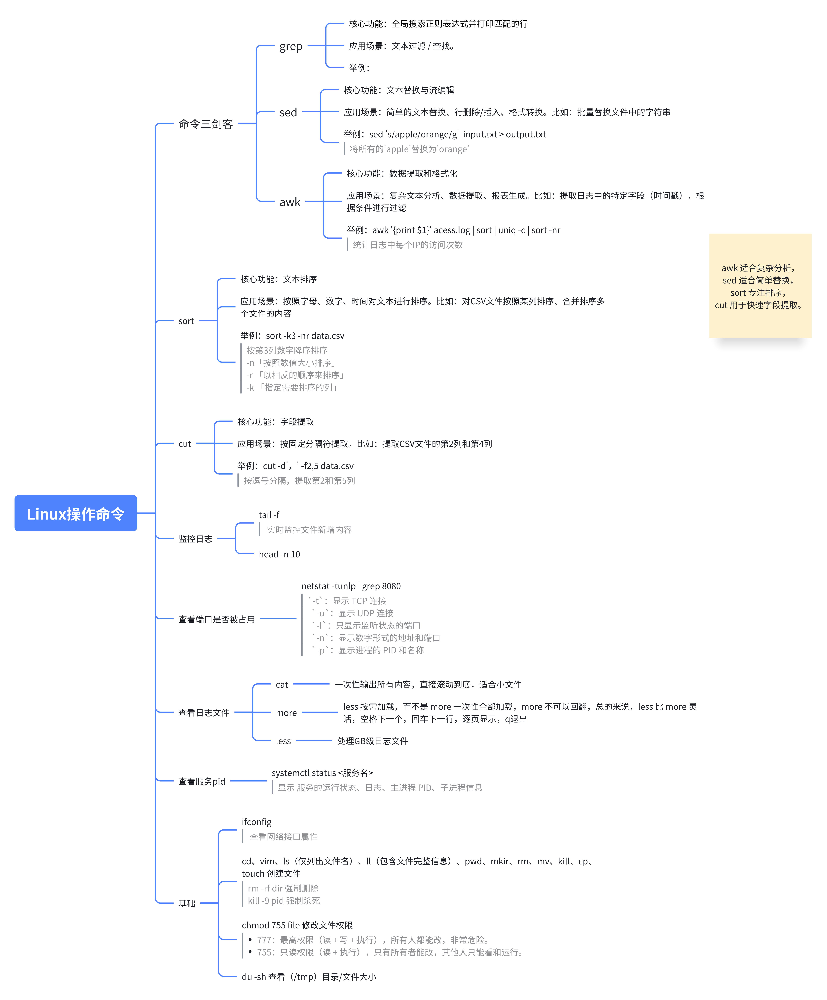
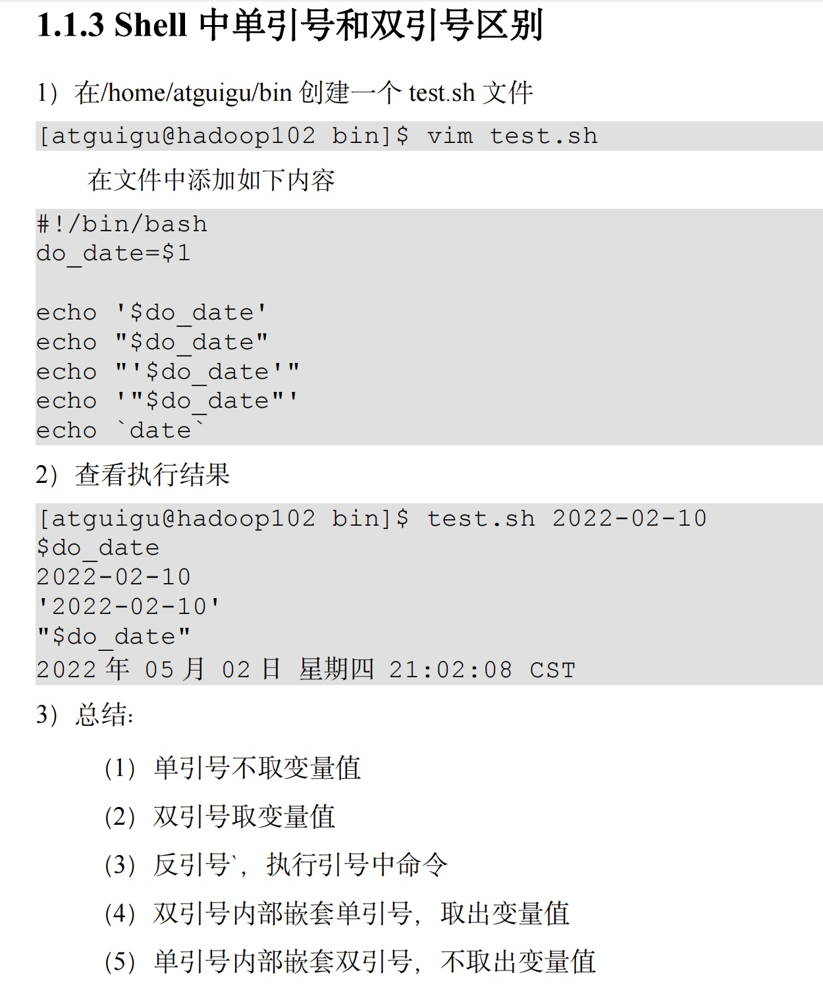

# 常用命令
  - [linux查看进程占用cpu多少，怎么查到哪个线程呢](#linux查看进程占用cpu多少，怎么查到哪个线程呢)

## linux查看进程占用cpu多少，怎么查到哪个线程呢
* 先用 top 找到CPU 高的进程 PID
* 再用 top -H -p 进程PID 找到该进程下CPU 最高的线程 TID
* 把线程 TID 转成十六进制（Java 线程栈用十六进制）
* 用 jstack 进程PID 导出线程栈，搜索十六进制 TID，定位到代码行