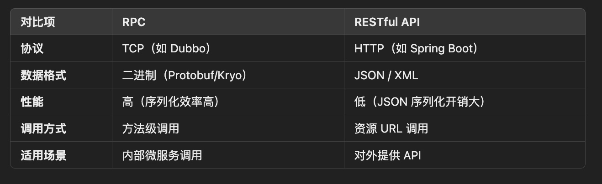
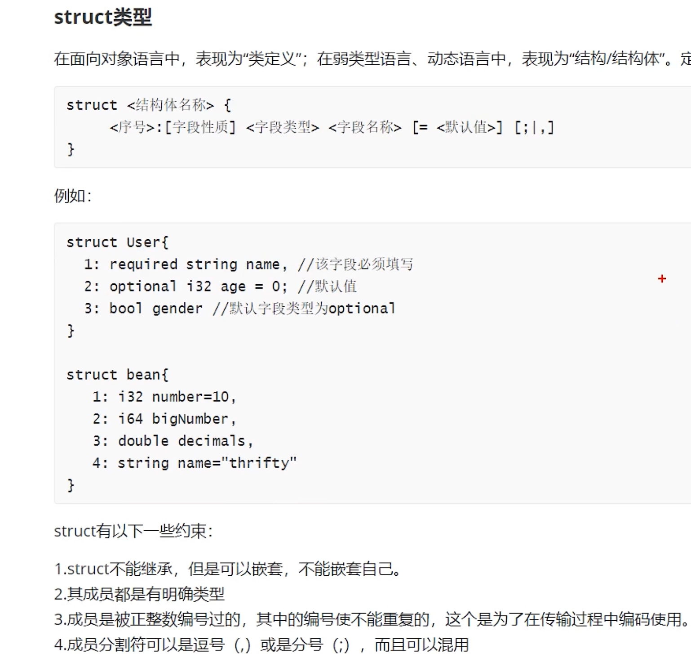
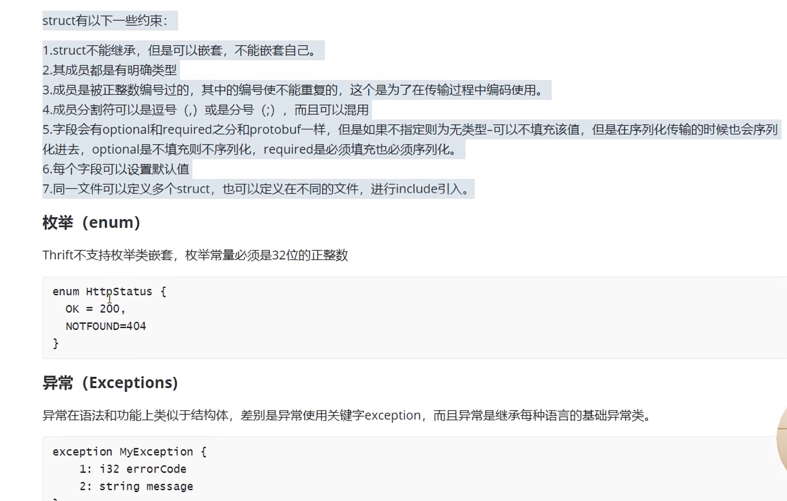
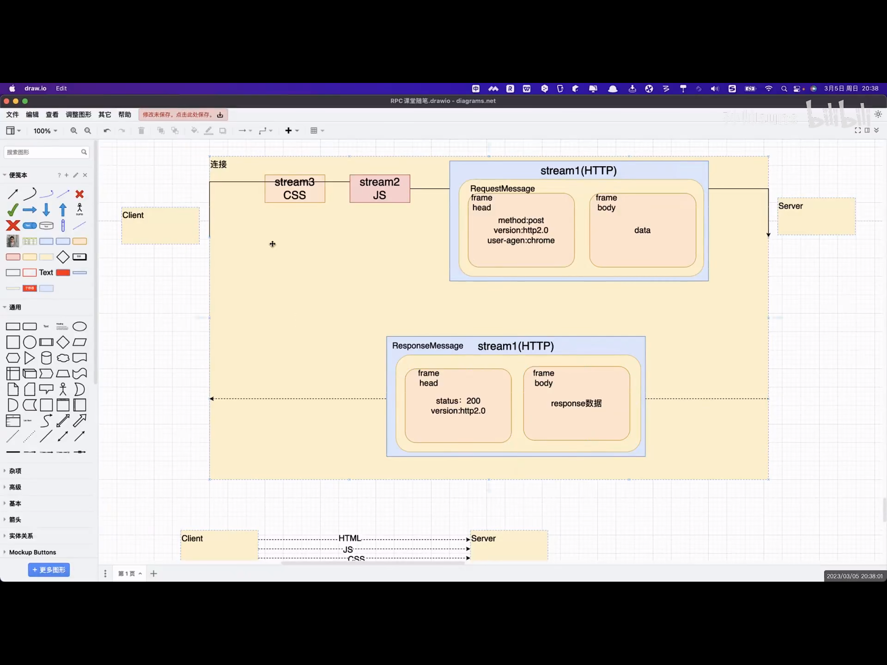

# RPC框架
  - [RPC的理解](#rpc的理解)
  - [**rpc实现原理**](#rpc实现原理)
  - [RPC 和 RESTful API区别](#rpc和-restful-api区别)
  - [RPC为什么使用TCP协议，不使用UDP协议](#rpc为什么使用tcp协议，不使用udp协议)
    - [什么时候会使用 UDP 进行 RPC 通信？](#什么时候会使用udp进行-rpc通信？)
  - [**RPC和HTTP区别**](#rpc和http区别)
  - [RPC多个请求是在一个连接完成的吗？](#rpc多个请求是在一个连接完成的吗？)
  - [**RPC优缺点**](#rpc优缺点)
  - [**设计一个RPC框架**](#设计一个rpc框架)
- [**Thrift**](#thrift)
  - [**Thrift各层的功能**](#thrift各层的功能)
  - [Thrift通信配置（客户端&服务端）](#thrift通信配置（客户端服务端）)
  - [**Thrift支持哪些传输协议**](#thrift支持哪些传输协议)
  - [**如何提高Thrift性能**](#如何提高thrift性能)
  - [**Thrift和gRPC对比**](#thrift和grpc对比)
  - [Thrift接口定义文件中变量位置调换的影响](#thrift接口定义文件中变量位置调换的影响)
- [**gRPC**](#grpc)
  - [gPRC核心设计思路](#gprc核心设计思路)
  - [**gRPC的好处**](#grpc的好处)
  - [与HTTP1.0区别](#与http1-0区别)
  - [HTTP2.X](#http2-x)
  - [Protobuf](#protobuf)
  - [**gRPC的工作原理**](#grpc的工作原理)
  - [**多种通信模式**：](#多种通信模式：)
- [Dubbo](#dubbo)
  - [Dubbo是如何做系统交互的？](#dubbo是如何做系统交互的？)
- [Netty实现RPC长连接](#netty实现rpc长连接)
      - [结合 Dubbo 构建分布式服务间调用](#结合dubbo构建分布式服务间调用)
      - [步骤 1：使用 Dubbo 的 Netty 实现](#步骤1：使用-dubbo的-netty实现)
      - [配置 Dubbo 服务端](#配置dubbo服务端)
      - [配置 Dubbo 客户端](#配置dubbo客户端)
  - [常用负载均衡策略](#常用负载均衡策略)


## RPC的理解
RPC核心思想：透明化远程调用，也就是说，客户端​​调用远程服务时，感觉就像调用本地函数一样简单，服务端​​接收请求并执行相应的逻辑，返回结果给客户端。相比较于传统的HTTP协议，RPC不需要去关心他的服务地址是什么，直接通过调用跟本地方法一样的代码，比如UserService.getUserMessage，其实就是在调用远程的服务。
go --> gRPC
java --> Dubbo / Thrift
c++ --> Thrift

## **rpc实现原理**
**RPC基本流程**：
（1）服务注册与发现
服务提供者（Provider） 将自己注册到 注册中心（Registry），供消费者查找。
服务消费者（Consumer） 从注册中心订阅服务列表，获取可用服务实例的地址。
> 注册中心可以使用 Zookeeper来管理服务。

（2）客户端调用（Stub 代理）
Consumer 端调用服务接口时，实际上是调用了一个 本地 Stub 代理（动态代理对象）。
Stub 负责封装调用信息，如方法名称、参数、返回值等，并序列化请求。
（3）网络通信
Stub 将序列化后的数据发送到远程服务器（Provider），通常使用 Netty、HTTP、TCP、UDP 进行传输。
Provider 接收到请求后，进行 反序列化 并执行相应的业务逻辑。
（4）服务器执行并返回结果
服务器调用目标方法，执行具体的业务逻辑。
执行完毕后，将返回值序列化，并通过网络返回给 Consumer。
（5）客户端解析响应
Consumer 端接收到响应数据，反序列化成 Java 对象，并返回给调用方。
远程调用完成，调用方可以像本地方法一样获取返回结果。

## RPC 和 RESTful API区别


**适用场景对比**：
- **RPC**：适合 **微服务内部通信**（如订单服务调用库存服务），追求高性能。
- **RESTful API**：适合 **对外暴露的 API**（如 Web 前端调用后端），兼容性好。

## RPC为什么使用TCP协议，不使用UDP协议
1. 可靠性
* TCP 是 面向连接 的协议，提供 可靠 的数据传输，保证数据包的顺序和完整性，并具备丢包重传、流量控制、拥塞控制等机制。
* UDP 是 无连接 的，数据包可能会丢失、乱序或重复传输，RPC 需要额外的逻辑来处理这些情况，否则会影响调用的正确性。
2. 有序性
* TCP 保证数据按 发送顺序到达，这对于 RPC 这样需要严格按步骤执行的通信至关重要。
* UDP 不保证数据的顺序，需要额外的机制来确保正确的执行顺序。
3. 数据完整性
* TCP 具有内置的 错误检测 和 数据重传 机制，确保 RPC 调用的数据不会丢失或损坏。
* UDP 只是提供简单的校验和，如果数据损坏或丢失，需要应用层自行处理，增加开发复杂度。
4. 连接管理
* TCP 提供了 连接管理（握手和断开机制），能确保请求和响应之间的状态一致性，方便实现 会话管理 和 身份验证。
* UDP 无连接，不适合需要保持会话状态的场景。
5. RPC 的典型应用场景
RPC 经常用于 分布式系统、微服务 通信，例如 gRPC、Dubbo、Thrift 等，通常需要保证 数据可靠传输 和 调用的幂等性，这与 TCP 的特性更匹配。

### 什么时候会使用 UDP 进行 RPC 通信？
1、低延迟需求：某些 实时系统（如游戏、视频流、VoIP），对速度要求更高，可靠性可以由应用层处理，如 Google 的 QUIC 协议（基于 UDP）。
2、高并发场景：如 DNS 查询，每个请求都是独立的，丢失部分请求不会影响整体系统。
3、无状态短连接：如某些 广播 或 多播 场景，UDP 可能是更好的选择。

## **RPC和HTTP区别**

整体上看，HTTP和RPC的主要区别5点：
1、基于的通信协议不同，HTTP只能基于HTTP协议，而RPC可以基于HTTP、TCP和UDP协议。
2、调用方式不同，HTTP 接口通过 URL 进行调用，RPC 接口通过函数调用进行调用。
3、使用场景上不同，HTTP主要用于 B/S 架构，是万维网数据通信的基础，服务在网页端和服务端的数据传输上 。而 RPC 更多用于 C/S 架构，多用于分布式系统内部集群里，例如云计算、微服务架构、分布式数据库等，它可以在不同的服务之间进行远程调用，从而实现分布式系统的协作。
4、传输效率上，RPC使用自定义的TCP协议，请求报文体积更小，可以很好地减少报文体积，提高传输效率。而HTTP请求中会包含很多无用的内容。
5、性能上，RPC协议通常使用二进制编码来传输数据，相对于HTTP协议的文本传输，RPC具有更高的性能和效率。RPC协议通常采用高效的序列化和反序列化技术，减少了数据传输的大小和开销，提高了通信的速度和响应时间。
总的来说对于大型系统：RPC框架一般都有注册中心，有丰富的监控管理；发布、下线接口、动态扩展等，对调用方来说是无感知、统一化的操作，RPC 还提供的多种调用方式（例如同步、异步、流式调用）会更加灵活，可以实现服务之间高效、低延迟的通信，可以显著提高服务间通信的效率。但是如果系统比较简单直接用http请求也是可以的。


HTTP协议（Hyper Text Transfer Protocol），又叫做超文本传输协议。是一种用于在Web浏览器和Web服务器之间交换数据的应用层协议。通过HTTP，Web浏览器可以向Web服务器发送请求并获取响应，从而实现Web页面的访问和传输。HTTP使用TCP作为传输层协议，并采用请求-响应模型来进行通信。
RPC（Remote Procedure Call），又叫做远程过程调用，它允许客户端在不知道调用细节的情况下，调用存在于远程计算机上的某个对象，就像调用本地应用程序中的对象一样。RPC的调用协议通常包含传输协议和序列化协议。
RPC并不是一个具体的协议，而是一种调用方式，它并没有具体实现，只要按照 RPC 通信协议规范实现的框架，都属于RPC，比如 Dubbo、gRPC 等。
整体上看，HTTP和RPC的主要区别5点：
1、**基于的通信协议不同**，HTTP只能基于HTTP协议，而RPC可以基于HTTP、TCP和UDP协议。
2、**调用方式不同**，HTTP 接口通过 URL 进行调用，RPC 接口通过函数调用进行调用。
3、**使用场景上不同**，HTTP主要用于 B/S 架构，是万维网数据通信的基础，服务在网页端和服务端的数据传输上 。而 RPC 更多用于 C/S 架构，多用于分布式系统内部集群里，例如云计算、微服务架构、分布式数据库等，它可以在不同的服务之间进行远程调用，从而实现分布式系统的协作。
4、**传输效率上**，RPC使用自定义的TCP协议，请求报文体积更小，可以很好地减少报文体积，提高传输效率。而HTTP请求中会包含很多无用的内容。
5、**性能上**，RPC协议通常使用二进制编码来传输数据，相对于HTTP协议的文本传输，RPC具有更高的性能和效率。RPC协议通常采用高效的序列化和反序列化技术，减少了数据传输的大小和开销，提高了通信的速度和响应时间。

总的来说对于大型系统：RPC框架一般都有注册中心，有丰富的监控管理；发布、下线接口、动态扩展等，对调用方来说是无感知、统一化的操作，RPC 还提供的多种调用方式（例如同步、异步、流式调用）会更加灵活，可以实现服务之间高效、低延迟的通信，可以显著提高服务间通信的效率。但是如果系统比较简单直接用http请求也是可以的。

## RPC多个请求是在一个连接完成的吗？
是否复用同一个连接取决于**连接模式​​**和​​**框架设计**，主要分为**短连接**和**长连接**两种模式

| 场景              | 连接模式           | 框架            | 特点                              |
|-------------------|:-------------------|-----------------|-----------------------------------|
| 短连接            | 每次请求新建立连接 | Thrift（TSocket） | 简单但性能低，适合低频调用         |
| 长连接 + 多路复用 | 复用单个连接       | gRPC（HTTP/2）    | 高性能，适合微服务内部通信         |
| 长连接 + 连接池   | 复用多个连接       | Dubbo（Netty）    | 平衡性能和资源占用，适合高并发场景 |

## **RPC优缺点**
**优点​​**：
1、​​高性能​​：二进制协议（如 Thrift、gRPC）比 HTTP + JSON 更高效。
2、​​开发简单​​：开发者只需关注业务逻辑，无需处理底层网络细节。
3、​​强类型​​：通过 IDL（如 Thrift、Protobuf）定义接口，编译时检查类型安全。
4、​​跨语言支持​​：主流 RPC 框架（如 gRPC、Thrift）支持多种语言。
**缺点**​​：
1、​​耦合性较高​​：客户端和服务端必须使用相同的接口定义（IDL）。
2、​​调试困难​​：相比 RESTful API（可读性好），RPC 调用难以直接调试。

## **设计一个RPC框架**
* 上来我们的服务就得去注册中心注册吧，得有个注册中心，保留各个服务的信息，可以用 zookeeper 来做。
* 然后我们的消费者需要去注册中心拿对应的服务信息吧，而且每个服务可能会存在于多台机器上。
* 接着我们就该发起一次请求了，咋发起？当然是基于动态代理了，我们面向接口获取到一个动态代理，这个动态代理就是接口在本地的一个代理，然后这个代理会找到服务对应的机器地址。
* 然后找哪个机器发送请求？那肯定得有个负载均衡算法了，比如最简单的可以随机轮询是不是。
* 接着找到一台机器，就可以跟它发送请求了，第一个问题咋发送？我们可以用 netty 了，nio 方式；第二个问题发送啥格式数据？我们可以说用 hessian 序列化协议了，或者是别的，对吧。然后请求过去了。
* 服务器那边一样的，需要针对我们的服务生成一个动态代理，监听某个网络端口了，然后代理我们本地的服务代码。接收到请求的时候，就调用对应的服务代码。

# **Thrift**
特点：跨语言RPC框架、IDL语言（关联语言）
**IDL语法**：

| type   | java    | go      |
|:-------|---------|---------|
| i8     | byte    | int8    |
| i16    | float   | int16   |
| i32    | int     | int32   |
| i63    | long    | int64   |
| double | double  | float64 |
| bool   | boolean | bool    |
| string | String  | string  |

**集合容器**：

| type     | java | go      |
|----------|------|---------|
| list<T> | List | []T     |
| set<T>   | Set  | []T     |
| map<k,v> | Map  | map[k]v |

**编译命令**：
```
thrift -gen java/cpp/py user.thrift
```
**模型**：主从Reactor、多Reactor模型
**阻塞**：TSimpleServer（单线程）、TThreadPoolServer（多）
**非阻塞**：TNOblockingServer（单）、THsHaServer（多）和TThreadedSelectorServer（多Reactor）




## **Thrift各层的功能**
* Thrift 各层功能​​：
    * ​​IDL 层​​：定义服务接口和数据结构，生成跨语言代码。
    * ​​传输层​​：负责数据传输，支持多种协议（TCP/HTTP）。
    * ​​协议层​​：负责数据序列化和反序列化，支持多种格式（二进制/JSON）。
    * ​​处理器层​​：处理客户端请求，调用服务方法。
    * ​​服务器层​​：监听请求并分发处理，管理连接和线程。

* Thrift 分布式架构​​：需结合注册中心（ZooKeeper）、负载均衡器（Nginx/Envoy）和容错机制（Hystrix/Sentinel）实现完整的分布式系统。
* ​​适用场景​​：高性能 RPC 通信、微服务内部通信、跨语言服务调用。

如果项目需要 ​​高吞吐、低延迟​​，并且能接受手动集成分布式组件，​​Thrift 是不错的选择​​

## Thrift通信配置（客户端&服务端）
**完整流程**：
服务端：启动Thrift服务，监听9090端口，在业务逻辑前检查APPKEY
客户端：连接服务端，并在请求中携带APPKEY，调用远程方法

**配置**：
1. 服务端配置
```
// 1. 定义 TProcessor（处理业务逻辑）
TProcessor processor = new UserService.Processor<>(new UserServiceImpl());

// 2. 配置传输层（TServerSocket 或 TNonblockingServerSocket）
TServerTransport serverTransport = new TServerSocket(9090); // 监听 9090 端口

// 3. 配置协议工厂（TBinaryProtocol 或 TJSONProtocol）
TProtocolFactory protocolFactory = new TBinaryProtocol.Factory();

// 4. 选择服务器类型（TThreadPoolServer 是常用阻塞式服务器）
TServer server = new TThreadPoolServer(
    new TThreadPoolServer.Args(serverTransport)
        .processor(processor)
        .protocolFactory(protocolFactory)
);

// 5. 启动服务
server.serve();
```

2. 客户端配置
```
// 1. 创建 TTransport（Socket 或 HTTP）
TTransport transport = new TSocket("localhost", 9090);

// 2. 配置协议工厂
TProtocol protocol = new TBinaryProtocol(transport);

// 3. 创建客户端 Stub
UserService.Client client = new UserService.Client(protocol);

// 4. 打开连接
transport.open();

// 5. 调用远程方法
String userInfo = client.getUserInfo(123);
System.out.println(userInfo);

// 6. 关闭连接
transport.close();
```

3. APPKEY
自定义协议
```
// 客户端发送时携带 APPKEY
TTransport transport = new THttpClient("http://localhost:9090");
transport.open();
// 在请求头中添加 APPKEY（如果是 HTTP）
((THttpClient) transport).setCustomHeader("APPKEY", "your_app_key");

// 服务端解析 APPKEY
public class AuthInterceptor implements TProcessor {
    private final TProcessor processor;
    
    public AuthInterceptor(TProcessor processor) {
        this.processor = processor;
    }
    
    @Override
    public boolean process(TProtocol in, TProtocol out) throws TException {
        // 从请求中读取 APPKEY 并验证
        String appKey = in.readFieldBegin().name; // 假设 APPKEY 在某个字段
        if (!"valid_app_key".equals(appKey)) {
            throw new TException("Invalid APPKEY");
        }
        return processor.process(in, out); // 验证通过后继续处理
    }
}
```

## **Thrift支持哪些传输协议**

|          协议          |       适用场景       | 性能  |     安全性      | 复杂度 |
| :--------------------: | :------------------: | :---: | :-------------: | :----: |
|       `TSocket`        |   单机/小规模集群    | ⭐⭐⭐⭐  |        ❌        |   ⭐    |
|  `TNonblockingSocket`  |     高并发服务端     | ⭐⭐⭐⭐⭐ |        ❌        |   ⭐⭐   |
|   `TFramedTransport`   |   流式数据/大文件    |  ⭐⭐⭐  |        ❌        |   ⭐⭐   |
|    `TZlibTransport`    |     带压缩的传输     |  ⭐⭐   |        ❌        |   ⭐⭐   |
|     `THttpClient`      | HTTP 兼容/Web 客户端 |  ⭐⭐   | ⚠️（依赖 HTTPS） |   ⭐⭐   |
| `TSSLTransportFactory` |       加密通信       |  ⭐⭐⭐  |      ⭐⭐⭐⭐       |   ⭐⭐   |
|    `TMemoryBuffer`     |    测试/内存通信     | ⭐⭐⭐⭐  |        ❌        |   ⭐    |

* ​​默认选择​​：TSocket（简单 TCP）或 TNonblockingSocket（高并发）。
* ​​HTTP 兼容​​：THttpClient（适用于 Web 客户端）。
* ​​加密通信​​：TSSLTransportFactory（SSL/TLS 加密）。
* ​​流式数据​​：TFramedTransport + TZlibTransport（压缩+分块）。
* ​​测试/内存通信​​：TMemoryBuffer。

## **如何提高Thrift性能**
**1、选择高性能的序列化协议**
Thrift默认使用`TBinaryProtocol（二进制协议）`

| 协议             | 特点                          | 使用场景                |
|------------------|:------------------------------|-------------------------|
| TBinaryProtocol（二进制协议）  | 二进制编码，紧凑高效           | 默认，适合大多数场景
| TCompactProtocol（紧凑协议） | 压缩二进制协议，减少传输数据量 | 高带宽限制或大数据传输  |
| TJSONProtocol    | JSON格式，可读性好             | 调试/需要可读性高的场景 |

* 默认使用`TBinaryProtocol`，除非数据量大，改用`TCompactProtocol`减少网络开销。
* 避免使用`TJSONProtocol`，除非需要调试或者兼容Web前端

**2、优化传输层**

| 传输方式                     | 特点             | 适用场景        |
|:-----------------------------|------------------|-----------------|
| TSocket                      | 阻塞式TCP        | 单机/小规模集群 |
| TNoblockingSocket            | 非阻塞式TCP（NIO） | 高并发服务端    |
| TFramedTransport             | 帧传输（分块传输） | 流式数据/大文件 |
| ​​TZlibTransport​​（谨慎使用，会增加CPU开销） | 压缩传输         | 网络带宽有限	   |

* 服务端：使用`TNoblockingServer` + `TNoblockingSocket`提高并发
* 大数据传输：使用`TFramedTransport`分块传输，避免内存溢出

**3、优化线程模型**
Thrift默认使用`TThreadPoolServer`（线程池模型），但在高并发场景下会成为瓶颈

| 线程模型          | 特点               | 适用场景        |
|:------------------|--------------------|-----------------|
| TThreadPoolServer | 阻塞式线程池       | 低并发场景      |
| TNoblockingServer | NIO非阻塞          | 高并发服务端    |
| THsHaServer       | 半同步半异步（推荐） | 高并发 + 低延迟 |

* 默认使用`THsHaServer`（半同步半异步），平衡性能和资源占用
* 超高并发场景：使用`TNoblockingServer`（纯异步）

**4、连接复用（连池）**
Thrift默认每次调用都会建立新连接，频繁创建/销毁连接会影响性能
优化：客户端使用连接池（Apache Commons Pool）；服务端启用Keep-Alive减少TCP握手开销

**5、监控和优化**
监控RPC调用耗时（如 Prometheus + Grafana），分析日志调整

推荐组合方案​​：
* ​​服务端​​：THsHaServer + TCompactProtocol + TFramedTransport + G1GC
* ​​客户端​​：连接池 + TCompactProtocol
通过以上优化，Thrift 性能可提升 ​​30%~50%​​，适用于高并发、低延迟场景。 


## **Thrift和gRPC对比**
 
| 特性     | Thrift                                   | gRPC                             |
|----------|------------------------------------------|----------------------------------|
| 协议     | 自定义IDL（.thrift）                       | Protocol Buffers（.proto）         |
| 传输协议 | TCP/HTTP                                 | HTTP2                            |
| 序列化   | 二进制（TBinaryProtocol/TCompactProtocol） | Protocol Buffers（二进制）序列化后体积更小，解析更快,适合移动端或高并发场景        |
| 流式支持 | 手动实现                                 | 原生支持（客户端/服务端流、双向流） |

**应用场景**

| 场景                     | 框架   | 原因                      |
|--------------------------|--------|---------------------------|
| 高吞吐、低延迟            | Thrift | 二进制协议+高性能线程模型 |
| 微服务架构（K8S、服务发现、负载均衡、熔断机制、云原生友好） | gRPC   | 原生支持HTTP/2、多路复用   |
| 流式通信                 | gRPC   | 原生支持客户端/服务端流   |
| 传统企业级应用           | Thrift | 成熟稳定，适合内部系统     |

* 如果你的项目需要 ​​高性能 + 流式通信 + 云原生支持​​，​​gRPC 是更好的选择​​；
* 如果你的项目更注重 ​​传统 RPC + 高吞吐 + 稳定性​​，​​Thrift 更合适​​。 

## Thrift接口定义文件中变量位置调换的影响
Thrift变量（struct字段）位置调换的影响
**1、对序列化/反序列化的影响**
Thrift 默认使用 ​​二进制协议（TBinaryProtocol）​​ 或 ​​紧凑协议（TCompactProtocol）​​ 进行序列化，这些协议的特点是：
* ​​字段按 ID 编号存储​​，而不是按变量定义顺序存储。
* ​​序列化后的数据格式​​：
[字段ID (1字节)] [字段类型 (1字节)] [字段值]
```
struct User {
    1: i32 id,
    2: string name,
    3: string email
}
```
**结论**：变量位置调换不会影响序列化结果​​，因为 Thrift 只依赖字段 ID 和类型，不关心定义顺序。

**2、对兼容性的影响**
如果 ​​客户端和服务端的`.thrift`文件版本不一致​​，变量位置调换可能会影响兼容性：
（1）仅调整变量顺序，不修改字段 ID 或类型​，客户端和服务端仍然能互相兼容。
```
// 旧版本
struct User {
    1: i32 id,
    2: string name,
    3: string email
}

// 新版本（仅调整顺序）
struct User {
    1: i32 id,
    3: string email,  // 调整顺序
    2: string name    // 调整顺序
}
```
（2）修改字段 ID 或类型​，可能导致反序列化失败或数据丢失。
```
// 旧版本
struct User {
    1: i32 id,
    2: string name
}

// 新版本（修改字段 ID）
struct User {
    1: i32 id,
    3: string name  // 字段 ID 从 2 改为 3
}
```

**避免兼容性问题**：
1、保持字段ID不变：新增字段时使用新的ID，避免修改已有字段的ID
2、新增资源设置为可选（optional）：避免强制客户端必须提供新字段
3、删除字段前先标记为废弃（deprecated）：为客户端足够的时间迁移

# **gRPC**
> https://github.com/grpc/grpc-java
gRPC 就是一种 RPC 框架，在你定义好消息格式后，针对你选择的编程语言，gRPC 为客 户端生成发起 RPC 请求的 Stub 类，以及为服务器生成处理 RPC 请求的 Service 类（服务器只需要继承、实现类中处理请求的函数即可）。

## gPRC核心设计思路
* 网络通信 --> gRPC自己封装网络通信的部分，提供多种语言的网络通信的封装（C、Java「Netty」、Go）
* 协议 --> HTTP2传输数据，支持双向流（双工）连接的多路复用
* 序列化 --> PB「protobuf」（Protocol Buffers）和JSON
> PB的时间效率和空间效率时JSON的3～5倍
* IDL语言（方便检索全公司API）
* 代理的创建（stub） --> 让调用者像调用本地方法那样，去调用远端的服务方法

## **gRPC的好处**
1、高效的进行进程间通信
2、支持多语言，原声支持 C GO Java。Ç语言版本上拓展 C++ C#、Python
3、支持多平台运行 Linux、Android、IOS、MacOS、Windows
4、gRPC序列化方式采用Protobuf，效率高
5、使用HTTP2协议
6、大厂背书（k8s也是google开发的，云原生支持好）

## 与HTTP1.0区别
HTTP1.0特点：短连接协议（无状态） C --> S（单工，无法实现服务端推送数据），采用客户端轮询的方式（每隔Xs查看S端是否更新）
> 如果产生大量连接，S端的压力就会大大增加，同时影响吞吐量

HTTP的底层是TCP（长连接），为什么HTTP1.0是短连接，因为以前服务器资源不够，不支持长时间连接

HTTP1.1特点：有限的长连接（keepalived升级为webSocket C <--> S）

HTTP1.X的共性：
1、传输数为据文本格式，可读性好但是传输效果差
2、本质上HTTP1.X协议无法实现双工通信
3、资源请求需要发送多次请求，建立多个连接才可以完成

> n个客户端同时连接，影响服务器带宽、吞吐（一个Client拿到页面（JS异步、HTML、CSS异步）建立3次连接） 解决：CDN

## HTTP2.X
特点：
1、本身是一个二进制协议，效率高于HTTP1.X协议，但是可读性差
2、可实现双工通信
3、多路复用：一次连接，可以请求多个数据（Stream1「HTML」 --> Stream2「JS」）

三个概念：1、数据流Stream；2、消息Message；3、帧frame


## Protobuf
1、与编程语言、系统无关（IDL语言），用于C --> S的RPC传输
2、protobuf编译器：将IDL语言编译成某一个开发语言（C、Java、GO）

与Java语言相关的语法
```
# 后续protobuf生成的java代码，一个源文件还是多个源文件 xx.java
option java_multiple_files = false;

# 指定protobuf生成的类，放置在哪个包中
option java_package = "com.sums";

# 指定的protobuf生成的外部累的名字（管理内部类）
option java_outer_classname = "UserService";
```

## **gRPC的工作原理**
gRPC基于HTTP2通信，集合Protobuf来实现数据的高效序列化和反序列化。
步骤：
* **接口定义**：开发者首先使用.proto文件定义服务接口和消息格式，这个过程明确了服务方法、输入参数、返回数据的类型
* **代码生成**：通过gRPC的代码生成工具，自动生成客户端和服务端的代码框架，生成的代码包含了所有必要的通信细节，我们只需在此基础上实现具体的业务逻辑。
* **建立连接**：客户端和服务端之间建立基于HTTP2的连接，由于HTTP2支持长连接和多路复用，同一连接上可以同时处理多个RPC调用
* **数据传输**：客户端调用方法时，将消息按照Protobuf格式序列化后，通过HTTP2协议发送到服务器，服务器接收到请求后进行反序列化，处理完成后再将结果序列化返回给客户端

## **多种通信模式**：
* **简单RPC：一元RPC**
* **服务器流式RPC**：一个请求对象，服务端可以回传多个结果对象，适用于需要连续更新数据的场景
* **客户端流式RPC**：客户端发送多个请求对象，服务端只返回一个结果，适用于数据批量上传、IOT(物联网 【传感器】) 向服务端 发送数据
* **双向流式RPC**：客户端和服务器双方可以同时发送和接收消息，适用于实时通讯、在线协作等复杂交互场景

# Dubbo

## Dubbo是如何做系统交互的？
Dubbo底层是通过RPC来完成服务和服务之间的调⽤的，Dubbo⽀持很多协议，⽐如默认的dubbo协议， ⽐如http协议、⽐如rest等都是⽀持的，他们的底层所使⽤的技术是不太⼀样的，⽐如dubbo协议底层使⽤的是netty，也可以使⽤mina，http协议底层使⽤的tomcat或jetty。

服务消费者在调⽤某个服务时，会将当前所调⽤的服务接⼝信息、当前⽅法信息、执⾏⽅法所传⼊的⼊参信息等组装为⼀个Invocation对象，然后不同的协议通过不同的数据组织⽅式和传输⽅式将这个对象传送给服务提供者，提供者接收到这个对象后，找到对应的服务实现，利⽤反射执⾏对应的⽅法，得到⽅法结果后再通过⽹络响应给服务消费者。

当然，Dubbo在这个调⽤过程中还做很多其他的设计，比如服务容错、负载均衡、Filter机制、动态路由机制等等，让Dubbo能处理更多企业中的需求。

Dubbo⽬前⽀持：

1. 平衡加权轮询算法 
2. 加权随机算法
3. ⼀致性哈希算法
4. 最⼩活跃数算法

# Netty实现RPC长连接

通过 Netty 可以建立高效的 **RPC 长连接**，从而实现持续的双向通信。

**建立服务器端**：

1. 创建 **Netty 服务端**，通过 `ServerBootstrap` 配置并启动 Netty 服务器。
2. 监听指定端口，等待客户端连接。
3. 在 `ChannelInitializer` 中配置编解码器（使`JSON` 编解码）。
4. 处理客户端请求的 **ChannelHandler** 逻辑，例如接收请求、调用本地方法并返回响应。

```java
ServerBootstrap bootstrap = new ServerBootstrap();
bootstrap.group(bossGroup, workerGroup)
    .channel(NioServerSocketChannel.class)
    .childHandler(new ChannelInitializer<SocketChannel>() {
        @Override
        protected void initChannel(SocketChannel ch) {
            ch.pipeline().addLast(new MyDecoder(), new MyEncoder(), new MyRpcHandler());
        }
    });
bootstrap.bind(port).sync().channel();
```

**建立客户端**：

1. 创建 **Netty 客户端**，通过 `Bootstrap` 配置并连接到服务器。
2. 同样配置编解码器，发送请求到服务端。
3. 通过 **ChannelHandler** 处理响应并返回给调用者

```java
Bootstrap bootstrap = new Bootstrap();
bootstrap.group(workerGroup)
    .channel(NioSocketChannel.class)
    .handler(new ChannelInitializer<SocketChannel>() {
        @Override
        protected void initChannel(SocketChannel ch) {
            ch.pipeline().addLast(new MyDecoder(), new MyEncoder(), new MyRpcClientHandler());
        }
    });
bootstrap.connect(host, port).sync().channel();
```

#### 结合 Dubbo 构建分布式服务间调用

Dubbo 本身已经封装了 RPC 调用的过程，但可以与 Netty 相结合，优化底层通信层。以下是如何整合 Dubbo 与 Netty 进行高效的服务调用。

#### 步骤 1：使用 Dubbo 的 Netty 实现

Dubbo 支持多种通信协议，其中包括 **Netty** 协议。通过配置 Dubbo 的协议为 Netty，您可以实现基于 Netty 的高效 RPC 调用。

- **Dubbo 配置**： 在 Dubbo 中，您可以通过配置 XML 或注解来指定协议。使用 `dubbo` 协议（即默认协议）或 `netty` 协议来配置通信协议。

```xml
<dubbo:protocol name="netty" port="20880" />
```

#### 配置 Dubbo 服务端

- **发布服务**： 使用 Dubbo 的注解或 XML 配置将服务暴露给客户端。Dubbo 会自动将服务通过指定的协议（如 Netty）暴露出来。

```xml
<dubbo:service interface="com.example.MyService" ref="myService" protocol="netty" />
```

#### 配置 Dubbo 客户端

- **调用服务**： 客户端通过 Dubbo 的代理机制来调用远程服务，底层通信将通过 Netty 协议进行。

```java
@Reference(protocol = "netty")
private MyService myService;
public void callService() {
    String result = myService.someMethod();
}
```

**Dubbo默认是dubbo协议，考虑到高性能传输位置信息、分布式实时计算、低延迟、长连接管理的需求。采用netty**


## 常用负载均衡策略
常见的负载均衡策略：
* 随机（Random）：随机选择一个可用 Provider。
* 轮询（Round Robin）：请求依次分配给不同的 Provider。
* 一致性哈希（Consistent Hash）：保证相同请求分配到相同的 Provider，适用于缓存场景。
