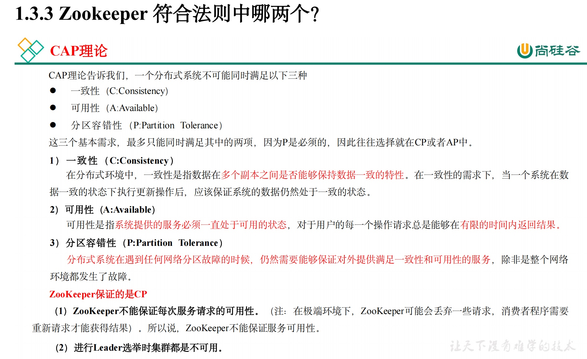
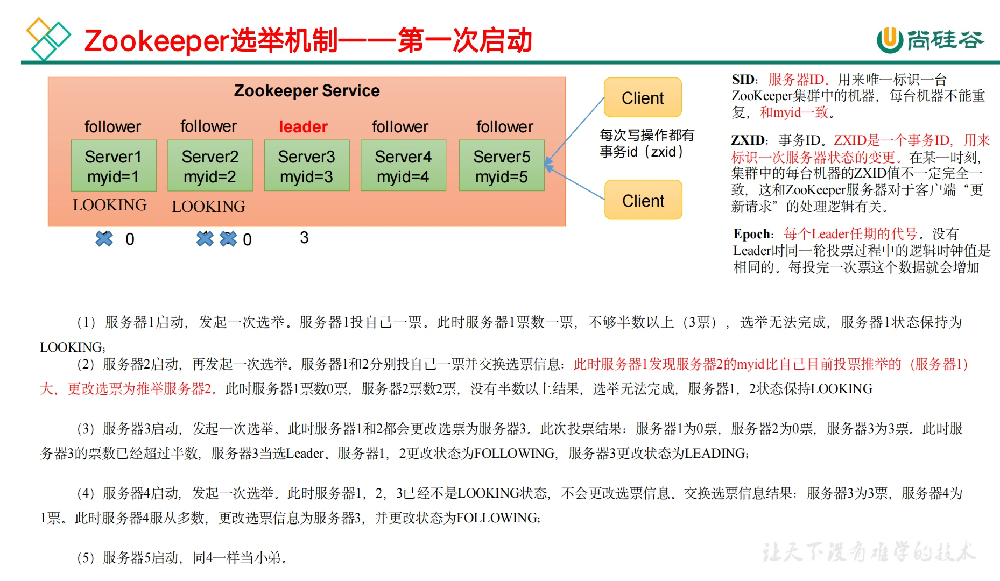
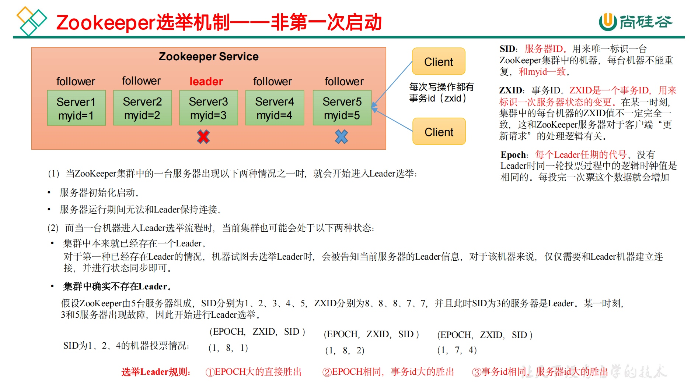
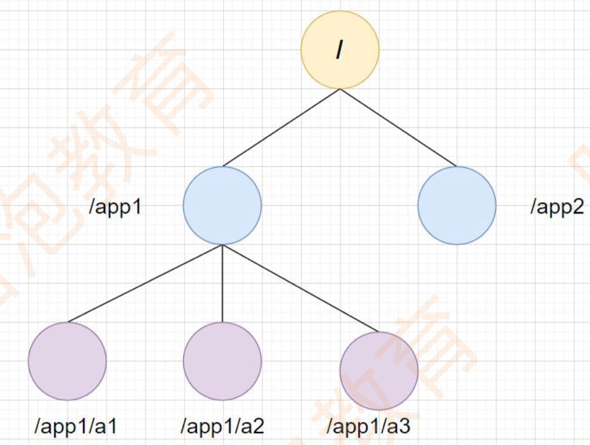

# Zookeeper面试题
  - [**Zookeeper的理解**](#zookeeper的理解)
  - [**集群管理配置信息**](#集群管理配置信息)
  - [zookeeper特性](#zookeeper特性)
  - [Zookeeper应用场景](#zookeeper应用场景)
  - [说一说 Zookeeper 工作原理？](#说一说zookeeper工作原理？)
  - [**Zookeeper 中如何选取主 leader 的？**](#zookeeper中如何选取主-leader的？)
- [Znode](#znode)
  - [znode数据模型](#znode数据模型)
  - [**znode节点数据类型**](#znode节点数据类型)
  - [Znode存储了什么信息](#znode存储了什么信息)
  - [**临时节点特性**](#临时节点特性)
- [Leader挂了，进入崩溃恢复，如何选举Leader，**选举机制**](#leader挂了，进入崩溃恢复，如何选举leader，选举机制)
  - [Zookeeper选举机制的核心特点](#zookeeper选举机制的核心特点)
  - [Zookeeper选举机制的应用场景](#zookeeper选举机制的应用场景)
- [**心跳机制**](#心跳机制)
- [**一致性算法**](#一致性算法)
  - [**Paxos算法**](#paxos算法)
    - [Paxos算法的三大步骤：](#paxos算法的三大步骤：)
    - [Paxos算法的特点：](#paxos算法的特点：)
  - [**Raft算法**](#raft算法)
  - [**ZAB协议**](#zab协议)
    - [Zookeeper 中什么是 ZAB 协议？](#zookeeper中什么是-zab协议？)
    - [ZAB 和 Paxos算法的联系与区别](#zab和-paxos算法的联系与区别)
- [**Watcher监听机制（Znode节点上的）**](#watcher监听机制（znode节点上的）)
  - [ZooKeeper 客户端如何注册 Watcher 实现？](#zookeeper客户端如何注册-watcher实现？)
  - [ZooKeeper 服务端如何处理 Watcher 实现？](#zookeeper服务端如何处理-watcher实现？)
  - [Zookeeper 中 Watcher 工作机制和特性？](#zookeeper中-watcher工作机制和特性？)
- [服务器角色](#服务器角色)
  - [Server都有哪些工作状态？](#server都有哪些工作状态？)
  - [Zookeeper节点宕机如何处理？](#zookeeper节点宕机如何处理？)
  - [**Zookeeper如何保证主从节点数据一致性**](#zookeeper如何保证主从节点数据一致性)
  - [Zookeeper 常用命令都有哪些？](#zookeeper常用命令都有哪些？)


## Zookeeper是用来干什么的
（1）作为 HA（高可用） 的协调者：如 HDFS 的 HA、YARN 的 HA。
（2）被组件依赖：如 Kafka、HBase、CK。

## **Zookeeper的理解**


1、集群管理
Zookeeper提供了CP的模型，来保证集群中的每个节点的数据一致性，当然Zk本身的集群并不是CP模型，而是顺序一致性模型，如果要保证CP特性，需要调用sync同步方法。

2、分布式锁
分布式系统中，为了保证垮进程的共享资源的并发安全性，Zookeeper提供了多种不同的节点类型，如持久化节点、临时节点、有序节点、容器节点等，其中 对于分布式锁这个场景来说，Zookeeper可以利用有序节点的特性来实现。除此之外，还可以利用同一级节点的唯一性特性来实现分布式锁。

3、Master选举
Zookeeper可以利用持久化节点来存储和管理其他集群节点的信息，从而进行Master选举机制。或者还可以利用集群中的有序节点特性，来实现Master选举。
目前主流的Kafka、Hbase、Hadoop都是通过Zookeeper来实现集群节点的主从选举。

Zookeeper就是经典的分布式数据一致性解决方案，致力于为分布式应用提供高性能、 高可用，并且具有严格顺序访问控制能力的分布式协调服务。它底层通过基于`Paxos`算法演化而来的`ZAB`协议实现。

## **集群管理配置信息**
* 命名服务
通过指定名字来获取资源或服务地址。
* 配置管理
使用.properties或者xml配置信息，比如数据库信息、地址接口等，如果把程序这些配置信息保存在zk的znode节点下，当znode发生变化时，可以通过改变zk中某个目录节点内容，录用watcher通知给哥哥客户端，从而改变配置。
* 集群管理
包括集群监控和集群控制，监控集群机器状态，剔除机器和加入机器，zk实时监控znode节点变化，一旦发现有机器挂了，该机器就会与zk断开连接，对用临时目录节点会被删除，其他所有机器都收到通知。

## zookeeper特性
* 顺序一致性：从同一客户端发起事务请求，最终将会严格地按照顺序被应用到ZooKeeper中去。 
* 原子性：所有事务请求处理结果在整个集群中所有机器上应用情况一致， 也就说，要么整个集群中所有机器都成功应用了某一个事务，要么都没有应用。 
* 单一视图：无论客户端连到哪一个 ZooKeeper 服务器上，其看到服务端数据模型都一致。 
* 可靠性： 一旦服务端成功地应用了一个事务，并完成对客户端响应，那么该事务所引起服务端状态变更将会被一直保留下来。 
* 实时性（最终一致性）： Zookeeper仅仅能保证在一定时间段内，客户端最终一定能够从服务端上读取到最新数据状态。

## Zookeeper应用场景
Zookeeper是一个典型的发布/订阅模式的分布式数据管理与协调框架，开发者可以使用它来进行分布式数据的发布和订阅。
通过对Zookeeper中丰富的数据节点进行交叉使用，配合Watcher事件通知机制，可以非常方便的构建一系列分布式应用。
核心功能：
1、数据发布/订阅
2、负载均衡
3、命名服务
4、分布式协调/通知
5、集群管理
6、Master选举
7、分布式锁分布式队列

## 说一说 Zookeeper 工作原理？
Zookeeper的核心是原子广播，这个机制保证了各个Server之间的同步。

实现这个机制的协议叫做Zab协议。

Zab协议有两种模式，它们分别是恢复模式（选主）和广播模式（同步）。

当服务启动或者在领导者崩溃后，Zab就进入了恢复模式，当领导者被选举出来，且大多数Server完成了和 leader的状态同步以后，恢复模式就结束了。

状态同步保证了leader和Server具有相同的系统状态。

为了保证事务的顺序一致性，zookeeper采用了递增的事务id号（zxid）来标识事务。

所有的提议（proposal）都在被提出的时候加上了zxid。

实现中zxid是一个64位的数字，它高32位是epoch用来标识leader关系是否改变，每次一个leader被选出来，它都会有一个新的epoch，标识当前属于那个leader的统治时期。低32位用于递增计数。

## **Zookeeper 中如何选取主 leader 的？**




当leader崩溃或者leader失去大多数的follower，这时zk进入恢复模式，恢复模式需要重新选举出一个新的leader，让所有的Server都恢复到一个正确的状态。

Zk的选举算法有两种：一种是基于basic paxos实现的，另外一种是基于fast paxos算法实现的。系统默认的选举算法为fast paxos。

1、Zookeeper选主流程(basic paxos)

1）选举线程由当前Server发起选举的线程担任，其主要功能是对投票结果进行统计，并选出推荐的Server；

2）选举线程首先向所有Server发起一次询问(包括自己)；

3）选举线程收到回复后，验证是否是自己发起的询问(验证zxid是否一致)，然后获取对方的id(myid)，并存储到当前询问对象列表中，最后获取对方提议的leader相关信息(id,zxid)，并将这些信息存储到当次选举的投票记录表中；

4）收到所有Server回复以后，就计算出zxid最大的那个Server，并将这个Server相关信息设置成下一次要投票的Server；

5）线程将当前zxid最大的Server设置为当前Server要推荐的Leader，如果此时获胜的Server获得n/2 + 1的Server票数，设置当前推荐的leader为获胜的Server，将根据获胜的Server相关信息设置自己的状态，否则，继续这个过程，直到leader被选举出来。 通过流程分析我们可以得出：要使Leader获得多数Server的支持，则Server总数必须是奇数2n+1，且存活的Server的数目不得少于n+1. 每个Server启动后都会重复以上流程。在恢复模式下，如果是刚从崩溃状态恢复的或者刚启动的server还会从磁盘快照中恢复数据和会话信息，zk会记录事务日志并定期进行快照，方便在恢复时进行状态恢复。


# Znode
## znode数据模型
znode的数据模型很像Unix文件系统（树状），这样可以确定每个路径都唯一，zookeeper节点统一叫做znode，它可以通多路径来标识。



## **znode节点数据类型**
1）**persistent-持久节点**：除非手动删除，否则节点一直存在于Zookeeper上。

2）**ephemeral-临时节点**：临时节点的生命周期与客户端会话绑定，一旦客户端会话失效（客户端与zookeeper连接断开不一定会话失效），那么这个客户端创建的所有临时节点都会被移除。

3）**persistent_sequential-持久顺序节点**：基本特性同持久节点，只是增加了顺序属性，节点名后边会追加一个由父节点维护的自增整型数字。

4）**ephemeral_sequential-临时顺序节点**：基本特性同临时节点，增加了顺序属性，节点名后边会追加一个由父节点维护的自增整型数字。

## Znode存储了什么信息
* data: znode 存储业务数据信息
* ACL: 记录客户端对 znode 节点访问权限，如 IP 等。
* child: 当前节点子节点引用
* stat: 包含 Znode 节点状态信息，比如事务 id、版本号、时间戳等等。
> 每个节点数据最大不超过1M，最好都小于1K

## **临时节点特性**
临时节点（Ephemeral Nodes）是ZooKeeper中一种特殊类型的节点，具有以下特性：

* ​​生命周期与会话绑定​​：临时节点的生命周期与创建该节点的客户端会话直接相关。一旦创建该节点的客户端与ZooKeeper集群的会话结束（例如，客户端断开连接或崩溃），该临时节点将被自动删除。例如，客户端在某个路径下创建了一个临时节点/tempNode，当客户端断开连接时，/tempNode节点会自动消失。
* ​​不可创建子节点​​：临时节点不能拥有子节点。尝试在临时节点下创建子节点将会失败。这一特性保证了临时节点的简单性和纯粹性，使其更适合用于表示临时状态或会话相关的数据。
* ​​瞬时性​​：由于其短暂的生命周期特性，临时节点非常适合于表示短暂状态或会话相关的数据。例如，在分布式环境中标识客户端的临时状态或会话存在。当客户端完成任务或会话结束时，相关的临时节点可以自动清理，无需手动干预。

* **​​应用场景广泛​​**
    * ​​分布式锁​​：客户端可以在某个路径下创建临时节点作为锁的存在标志，当客户端退出或连接断开时，锁自动释放。其他客户端可以通过检查该节点是否存在来判断是否可以获取锁。
    * ​​服务发现与注册​​：服务实例启动时创建临时节点注册自身，客户端通过查询这些临时节点列表来发现可用服务。当服务下线时，节点自动删除，实现服务列表的自动更新，提高了服务发现的实时性和准确性。
    * ​​领导选举​​：参与者在特定路径下创建临时节点参与选举，当领导者挂掉或失去连接，其对应的临时节点消失，触发重新选举。这种方式可以确保在分布式系统中快速、准确地选出新的领导者。

​​类型组合​​：临时节点还可以与顺序节点（Sequential）特性结合，形成临时顺序节点（Ephemeral Sequential Node）。在原有的临时节点基础上增加了一个单调递增的编号，有助于实现更复杂的同步和排序逻辑。例如，在多个客户端竞争锁时，可以使用临时顺序节点来保证公平性，多个客户端按顺序依次获取锁，避免“饥饿”现象。
​​
# Leader挂了，进入崩溃恢复，如何选举Leader，**选举机制**
zookeeper的选举机制主要是基于**ZAB协议**来实现的，为了保证在Zookeeper集群中选举出一个**Leader节点**，并且确保集群中的数据一致性和高可用性。Zookeeper采用**Leader-Follower模式**，所有的写操作都必须由Leader节点来处理，Follower节点仅处理读取请求。

**Zookeeper选举机制的核心流程**：
Zookeeper的选举机制主要是通过集群中各个节点之间的投票和协调来选举出一个Leader节点。

1. **初始化阶段**
- 当Zookeeper集群启动时，所有节点都是“观察者”状态，并开始与其他节点进行通信。
- 每个节点都有一个**唯一的ID**，这个ID是由Zookeeper在启动时生成的。
- 各个节点开始进行Leader选举。

2. **选举过程**
- **节点间信息交换**：每个节点通过发送心跳包和投票信息给其他节点，节点互相传递自己认为的“最佳候选Leader”。
- **节点比较：** 每个节点会根据收到的投票信息比较自己和其他节点的状态，最终选出一个节点作为Leader。

3. **投票规则**
- 每个节点向集群中其他节点广播其自己的**事务日志ID（ZXID）**，以及当前的**节点ID**。
- 如果某个节点收到其他节点的投票，并且它认为自己拥有**最大事务ID**或**最大节点ID**，它会向其他节点发起投票请求，尝试成为Leader。
- 如果多个节点同时尝试成为Leader，最终选举会根据**事务ID**（ZXID）和**节点ID**大小来选出最大者作为Leader。

4. **达成共识**
- 选举成功的Leader会开始接受客户端的请求，特别是所有的写请求都交给Leader处理。
- 其他节点成为Follower节点，负责同步Leader节点的日志信息，并接受读请求。
- 在Leader节点失效或宕机时，Zookeeper会触发重新选举，确保系统的高可用性。

5. **Leader选举的触发条件**
- 选举触发的常见情况包括：**Leader节点宕机**、**网络分区**或**连接断开**等。

## Zookeeper选举机制的核心特点
1. **高可用性：** Zookeeper的选举机制保证了在Leader节点宕机时，系统能快速地选举出新的Leader节点，确保系统高可用，不会因单点故障影响系统稳定性。
2. **一致性：** 选举过程确保在Zookeeper集群中始终只有一个Leader节点，避免了多个节点同时处理写操作的冲突，确保了数据的一致性。
3. **容错性：** 即使部分节点发生故障，选举机制依然能够保证大多数节点达成一致，确保系统能够继续工作。
4. **顺序一致性：** 选举过程中的投票和决策保证了系统中所有节点对“Leader”的选举顺序是一致的。即使发生网络延迟或分区，最终所有节点都会统一视图。

## Zookeeper选举机制的应用场景
1. **分布式协调：** Zookeeper的选举机制通常用于分布式系统中的协调任务，比如在多个服务节点之间选举出一个节点作为主节点（Leader），来处理所有的写请求和控制任务。
2. **分布式锁：** 在Zookeeper中，Leader选举可以被用作分布式锁的机制。通过选举Leader，确保集群中只有一个节点能操作某些资源，防止并发访问。
3. **配置管理：** Zookeeper的选举机制可以用于管理和协调分布式系统中的配置更新。选举出的Leader节点负责同步更新，确保所有节点的配置一致。
4. **分布式任务调度：** Zookeeper通过选举机制确保任务调度的唯一性，确保同一时刻只有一个节点执行某个任务。

# **心跳机制**
ZooKeeper（简称ZK）的心跳机制是保障其集群稳定运行的关键机制，主要涉及服务器之间、客户端与服务器之间的心跳交互：

* **服务器之间的心跳机制**
在ZooKeeper集群中，服务器之间（Leader与Follower）的心跳机制主要用于检测彼此的状态，以维持集群的正常运转。相关参数在配置文件zoo.cfg中有定义，以下是具体过程：

​​1、Follower发起心跳请求​​：Follower服务器会定期向Leader服务器发送心跳请求消息，用于告知Leader自己的状态。心跳请求消息包含Follower的ID和当前的zxid（事务ID），用于标识Follower的状态。
2、​​Leader响应心跳请求​​：Leader服务器收到Follower的心跳请求后，会向Follower发送心跳响应消息，以告知自己的状态。心跳响应消息中包含Leader的ID、当前的zxid等信息。
3、​​Follower处理心跳响应​​：Follower服务器收到Leader的心跳响应后，会根据Leader的状态更新自己的集群状态。如果Leader正常响应，那么Follower会继续与Leader保持连接；如果Leader未响应或响应异常，Follower可能会触发重新选举等操作。
4、​​Leader检测Follower状态​​：Leader服务器也会通过心跳机制检测Follower的状态。如果在一定时间内（syncLimit * tickTime）没有收到Follower的响应，Leader会认为该Follower已经失效，并将其从集群中移除。

* **客户端与服务器之间的心跳机制**
客户端与服务器之间的心跳机制主要用于维持客户端与服务器的会话连接，确保客户端的状态能被服务器及时感知。具体过程如下：
​​1、客户端发送心跳请求​​：客户端会定期向服务器发送心跳请求消息，以告知服务器自己还处于活跃状态。心跳请求消息通常包含客户端的会话信息和心跳间隔信息。在ZooKeeper中，客户端发送的是ping请求，它是应用层协议，下层直接使用网络层协议ICMP，不依赖TCP或UDP，即使TCP连接出现问题，也不影响心跳消息的收发。客户端发送ping请求的时间间隔并非固定为10秒，而是由服务器配置的tickTime决定，默认情况下，客户端每秒发送一次心跳，这个频率可以根据实际需求进行调整。心跳频率的设置需要平衡会话的稳定性和系统资源的消耗，过快的心跳频率会增加网络和服务器负载，而过慢的心跳频率则可能导致客户端会话超时。
2、​​服务器响应心跳请求​​：服务器收到客户端的心跳请求后，会向客户端发送心跳响应消息，以确认收到客户端的心跳。同时，服务器会根据客户端的心跳信息更新会话状态。
3、​​客户端处理心跳响应​​：客户端收到服务器的心跳响应后，会更新自己的会话状态。如果客户端在一定时间内没有收到服务器的响应，会认为与服务器的连接已经断开，并尝试重新连接。
* **心跳机制的作用**
    * 检测节点状态​​：及时发现集群中节点的异常情况，如节点故障、网络中断等，并采取相应的措施保障集群的可用性。例如，当Leader检测到某个Follower失效时，会触发重新选举机制，选举出新的Leader。
    * ​​会话管理​​：是实现客户端会话管理的基础，确保客户端与服务器之间的连接持续有效。通过心跳机制，服务器可以知道客户端的状态，并在客户端失效时及时清理相关的会话信息。
    * ​​负载均衡​​：服务器可以通过心跳机制监控客户端的负载情况，从而实现负载均衡，将请求合理地分配到各个客户端上

# **一致性算法**
## **Paxos算法**
Paxos算法基于以下几个角色：
1. **提议者（Proposers）**
   提议者是提出值的节点，它们向集群中的其他节点（接受者）提交提议。提议者希望集群中的大多数节点接受它们的提议，达成一致。
2. **接受者（Acceptors）**
   接受者负责接收提议并根据某些规则决定是否接受提议。接受者通过投票来决定是否接受某个提议，并将接受结果告诉提议者。
3. **学习者（Learners）**
   学习者只是被动接收达成一致的值，而不参与提议和投票的过程。

### Paxos算法的三大步骤：
1. **准备阶段（Prepare Phase）**
   - 提议者选择一个编号`n`并向所有接受者发送准备请求（Prepare request），请求所有节点承诺不会接受编号小于`n`的提议。
   - 如果接受者尚未承诺过编号大于`n`的提议，它将承诺并返回给提议者。返回的内容包括它之前接受过的提议的编号和相应的值（如果有的话）。
2. **提议阶段（Propose Phase）**
   - 如果提议者从大多数接受者那里收到响应，它将向大多数接受者提交一个具体的提议。提议包括一个编号`n`和一个值。
   - 如果接受者没有接收到编号更大的提议，并且它没有已承诺其他提议，它会接受这个新的提议。
3. **确认阶段（Accept Phase）**
   - 如果大多数接受者接受了某个提议，那么该提议就被认为是“达成一致”的。这时，提议的值就会被系统所接受，成为正式的决定。

### Paxos算法的特点：
- **一致性（Consistency）：** 任何时候系统中只有一个值被认为是已经达成一致的。
- **容错性（Fault tolerance）：** 即使一些节点宕机，算法也能继续进行并保证一致性，只要大多数节点可用。
- **去中心化（Decentralization）：** Paxos没有单点故障，所有节点在算法中是平等的。

## **Raft算法和Paxos算法区别**
**1. Paxos 算法**
**角色分工**
- **Proposer（提议者）**：提出提案（value），类似法律诉讼中的"原告/被告"。
- **Acceptor（接受者）**：对提案进行投票，类似陪审团成员。
- **Learner（学习者）**：被动接收最终达成一致的提案结果，类似法庭公告的受众。

**执行流程**
1. Proposer 提出提案（附提案编号）。
2. Acceptor 根据规则（如多数派原则）接受提案并投票。
3. 获得多数派投票的提案胜出，Learner 学习该提案值。
4. **平票处理**：若多个提案获得相同票数，则选择提案编号最大的值。

**缺点**
- **复杂性高**：角色间交互逻辑复杂（如 Prepare/Promise/Accept 请求阶段）。
- **效率问题**：需多轮通信（提案→投票→汇总→学习），实现难度大。

**2. Raft 算法**
**角色分工**
- **Leader（领导者）**：唯一处理客户端请求的角色，负责日志复制，类似"法官"。
- **Candidate（候选者）**：在 Leader 宕机时参与选举，类似"临时法官候选人"。
- **Follower（跟随者）**：被动接收 Leader 的日志并投票，类似"陪审团成员"。

**执行流程**
1. 选举阶段：
   - Follower 超时未收到 Leader 心跳后转为 Candidate，发起选举。
   - 通过随机超时机制避免选票分裂（如 A 和 B 同时竞选时，随机超时时间确保先发起的一方大概率胜出）。
2. 日志复制阶段：
   - Leader 将客户端请求追加到本地日志，并通过心跳同步给 Followers。
   - 多数派 Followers 确认后，日志被提交（committed），保证一致性。

**优势**
- **易理解性**：角色职责明确，选举和日志复制流程解耦。
- **高效性**：通过 Leader 集中处理请求减少通信开销。**

**总的来说**：
* 理论上
    * Paxos算法理论基础复杂，实现起来相对困难
    * Raft算法实现简单
* 执行方式
    * Paxos通过多回合制的投票来确定最终的一致性达成（团体投票）
    * Raft则是领导者选举和日志通过来实现一致性，领导者在其中起着关键的协调作用（一个人说了算）
    * 正常情况下（Leader没挂的时候）Raft算法是强于Paxos算法的，如果Leader挂了，那么Raft会有选举Leader过程，可能会导致系统停顿
>需要强理论保证或特殊场景 → Paxos。需要快速落地和高可维护性 → Raft。

## **ZAB协议**
### Zookeeper 中什么是 ZAB 协议？
ZAB协议是为分布式协调服务Zookeeper专门设计的一种支持崩溃恢复的原子广播协议。

ZAB协议包括两种基本的模式：崩溃恢复和消息广播。

崩溃恢复：在正常情况下运行非常良好，一旦Leader出现崩溃或者由于网络原因导致Leader服务器失去了与过半Follower的联系，那么就会进入崩溃恢复模式。为了程序的正确运行，整个恢复过程后需要选举出一个新的Leader,因此需要一个高效可靠的选举方法快速选举出一个Leader。

消息广播：类似一个两阶段提交过程，针对客户端的事务请求， Leader服务器会为其生成对应的事务Proposal,并将其发送给集群中的其余所有机器，再分别收集各自的选票，最后进行事务提交。

当整个zookeeper集群刚刚启动或者Leader服务器宕机、重启或者网络故障导致不存在过半的服务器与Leader服务器保持正常通信时，所有进程（服务器）进入崩溃恢复模式，首先选举产生新的Leader服务器，然后集群中Follower服务器开始与新的Leader服务器进行数据同步，当集群中超过半数机器与该Leader服务器完成数据同步之后，退出恢复模式进入消息广播模式，Leader服务器开始接收客户端的事务请求生成事物提案来进行事务请求处理。

### ZAB 和 Paxos算法的联系与区别
* 相同点：
    * 1、两者都存在一个类似于Leader进程的角色，由其负责协调多个Follower进程的运行
    * 2、Leader进程都会等待超过半数的Follower做出正确的反馈后，才会将一个提案进行提交
    * 3、ZAB协议中，每个Proposal中都包含一个epoch值来代表当前的Leader周期，Paxos中名字为Ballot
* 不同点：
* ZAB用来构建高可用的分布式数据主备系统（Zookeeper），Paxos是用来构建分布式一致性状态机系统


# **Watcher监听机制（Znode节点上的）**
## ZooKeeper 客户端如何注册 Watcher 实现？

1）客户端调用getData()、getChildren()、exist()三个接口，传入Watcher对象。

2）标记请求request，封装Watcher到WatchRegistration。

3）封装成Packet对象，发送request至服务端。

4）收到服务端响应后，将Watcher注册到ZKWatcherManager中进行管理。

5）请求返回，完成注册。

## ZooKeeper 服务端如何处理 Watcher 实现？

**服务端接收Watcher并存储**

接收到客户端的请求，判断是否注册Watcher，如果需要注册Watcher就将数据节点路径和ServerCnxn存储到WatcherManager中的WatchTable和watch2Paths。

其中ServerCnxn表示一个客户端和服务端的连接，实现了Watcher的process接口，此时可以看成一个Watcher对象。

**Watcher触发**

假设服务端接收到setData()方法事务请求时触发NodeDataChanged事件。

**封装WatchedEvent**

将通知状态（SyncConnected）、事件类型（NodeDataChanged）以及节点路径封装成一个WatchedEvent对象。

**查询Watcher**

从WatchTable中根据节点路径查找Watcher对象，若果没找到说明没有客户端在该数据节点上注册过Watcher对象，反之找到的话就提取并从WatchTable和Watch2Paths中删除对应Watcher。从这里可以看出Watcher在服务端是触发一次就失效。然后调用process()方法来触发Watcher，process()方法主要通过ServerCnxn对应的TCP连接发送Watcher事件通知。

## Zookeeper 中 Watcher 工作机制和特性？

Zookeeper允许客户端向服务端的某个Znode注册一个Watcher监听，当服务端的一些指定事件触发了这个Watcher，服务端会向指定客户端发送一个事件通知来实现分布式的通知功能，然后客户端根据Watcher通知状态和事件类型做出业务上的改变。

**工作机制**

客户端注册watcher 服务端处理watcher 客户端回调watcher

**Watcher特性**

1）一次性

无论是服务端还是客户端，一旦一个Watcher被触发，Zookeeper都会将其从相应的存储中移除。这样的设计有效的减轻了服务端的压力，不然对于更新非常频繁的节点，服务端会不断的向客户端发送事件通知，无论对于网络还是服务端的压力都非常大。

2）客户端串行执行

客户端Watcher回调的过程是一个串行同步的过程。

3）轻量

Watcher通知非常简单，只会告诉客户端发生了事件，而不会说明事件的具体内容。 客户端向服务端注册Watcher的时候，并不会把客户端真实的Watcher对象实体传递到服务端，仅仅是在客户端请求中使用boolean类型属性进行了标记。

（4）watcher event异步发送watcher的通知事件从server发送到client是异步的，这就存在一个问题，不同的客户端和服务器之间通过socket进行通信，由于网络延迟或其他因素导致客户端在不通的时刻监听到事件，由于Zookeeper本身提供了ordering guarantee，即客户端监听事件后，才会感知它所监视znode发生了变化。所以我们使用Zookeeper不能期望能够监控到节点每次的变化。Zookeeper只能保证最终的一致性，而无法保证强一致性。

（5）注册watcher getData、exists、getChildren

（6）触发watcher create、delete、setData：当一个客户端连接到一个新的服务器上时，watch将会被以任意会话事件触发。当与一个服务器失去连接的时候，是无法接收到watch的。而当client重新连接时，如果需要的话，所有先前注册过的watch，都会被重新注册。通常这是完全透明的。只有在一个特殊情况下，watch可能会丢失：对于一个未创建的znode的exist watch，如果在客户端断开连接期间被创建了，并且随后在客户端连接上之前又删除了，这种情况下，这个watch事件可能会被丢失。

# 服务器角色
* Leader
    * 1、事务请求的唯一调度和处理者，保证集群事务处理的顺序性
    * 2、集群内部各服务的调度者
* Follower
    * 1、处理客户端的非事务请求，转发事务请求给Leader服务器
    * 2、参与事务请求Proposal的投票
    * 3、参与Leader选举投票
* Observer
    * 1、处理客户端的非事务请求，转发事务请求给Leader服务器
    * 2、不参与任务形式的投票

## Server都有哪些工作状态？

Zookeeper服务器具有四种状态，分别是LOOKING、FOLLOWING、LEADING、OBSERVING。

**1、LOOKING：寻找Leader状态**：当服务器处于该状态时，它会认为当前集群中没有Leader，因此需要进入Leader选举状态，也就是正在进行选举Leader的过程的server所处状态

**2、LEADING：领导者状态**：表示当前Zookeeper服务器角色是Leader，已被选举为Leader后的server所处状态。

**3、FOLLOWING：跟随者状态**：表示当前Zookeeper服务器角色是Follower，成为Follower后的server所处状态。

**4、OBSERVING：观察者状态**：表示当前Zookeeper服务器角色是Observer，在一个很大的集群中没有投票权的server所处状态。

## Zookeeper节点宕机如何处理？
Zookeeper本身是集群模式，官方推荐不少于3台服务器配置。Zookeeper自身保证当一个节点宕机时，其他节点会继续提供服务。

假设其中一个Follower宕机，还有2台服务器提供访问，因为Zookeeper上的数据是有多个副本的，并不会丢失数据；

如果是一个Leader宕机，Zookeeper会选举出新的Leader。

Zookeeper集群的机制是只要超过半数的节点正常，集群就可以正常提供服务。只有Zookeeper节点挂得太多，只剩不到一半节点提供服务，才会导致Zookeeper集群失效。

**Zookeeper集群节点配置原则**
3个节点的cluster可以挂掉1个节点（leader可以得到2节 > 1.5）。
2个节点的cluster需保证不能挂掉任何1个节点（leader可以得到 1节 <=1）。

## **Zookeeper如何保证主从节点数据一致性**
集群主从部署结构，要保证主从节点一致性问题无非就两个：
* 主服务器挂了，或者重启了
* 主从服务器之间同步数据

Zookeeper采用ZAB协议来保证主从节点数据一致性，ZAB协议支持崩溃恢复和消息广播两种模式，很好解决了这两个问题：

* 崩溃恢复：Leader 挂了，进入该模式，选一个新leader出来
* 消息广播：把更新数据，从 Leader 同步到所有Follower

Leader 服务器挂了，所有集群中服务器进入 LOOKING 状态，首先，它们会 选举产生新Leader 服务器；接着，新 Leader 服务器与集群中Follower 服务进行数据同步，当集群中超过半数机器与该 Leader 服务器完成数据同步 之后，退出恢复模式进入消息广播模式。Leader服务器开始接收客户端事务请求生成事务 Proposal 进行事务请求处理。


## Zookeeper 常用命令都有哪些？

**1、ZooKeeper服务命令**

1）启动ZK服务: bin/zkServer.sh start

2）查看ZK服务状态: bin/zkServer.sh status

3）停止ZK服务: bin/zkServer.sh stop

4）重启ZK服务: bin/zkServer.sh restart

5）连接服务器: [zkCli.shopen in new window](http://zkcli.sh/) -server 127.0.0.1:2181

**2、连接ZooKeeper**

启动ZooKeeper服务后可以使用命令连接到ZooKeeper服务：

```bash
zkCli.sh -server 127.0.0.1:2181
```

**3、ZooKeeper客户端命令**

1）ls -- 查看某个目录包含的所有文件：

```bash
[zk: 127.0.0.1:2181(CONNECTED) 1] ls /
```

2）ls2 -- 查看某个目录包含的所有文件，与ls不同的是它查看到time、version等信息：

```bash
[zk: 127.0.0.1:2181(CONNECTED) 1] ls2 /
```

3）create -- 创建znode，并设置初始内容：

```bash
[zk: 127.0.0.1:2181(CONNECTED) 1] create /test "test"
Created /test
```

创建一个新的znode节点“test”以及与它关联的字符串

4）get -- 获取znode的数据：

```bash
[zk: 127.0.0.1:2181(CONNECTED) 1] get /test
```

5）set -- 修改znode内容：

```bash
[zk: 127.0.0.1:2181(CONNECTED) 1] set /test "ricky"
```

6）delete -- 删除znode：

```bash
[zk: 127.0.0.1:2181(CONNECTED) 1] delete /test
```

7）quit -- 退出客户端

8）help -- 帮助命令
