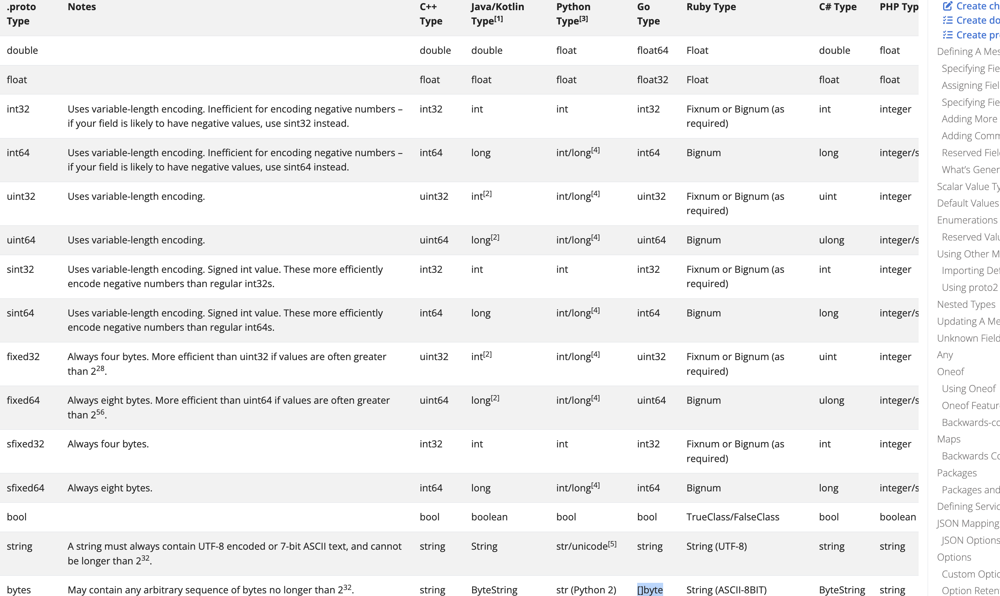
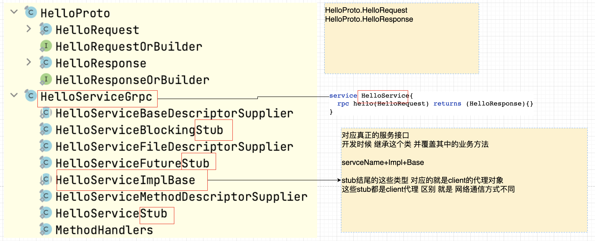
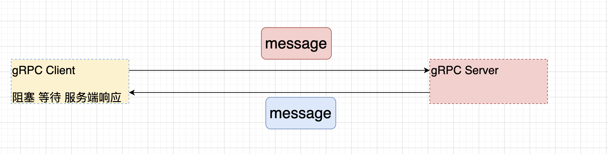
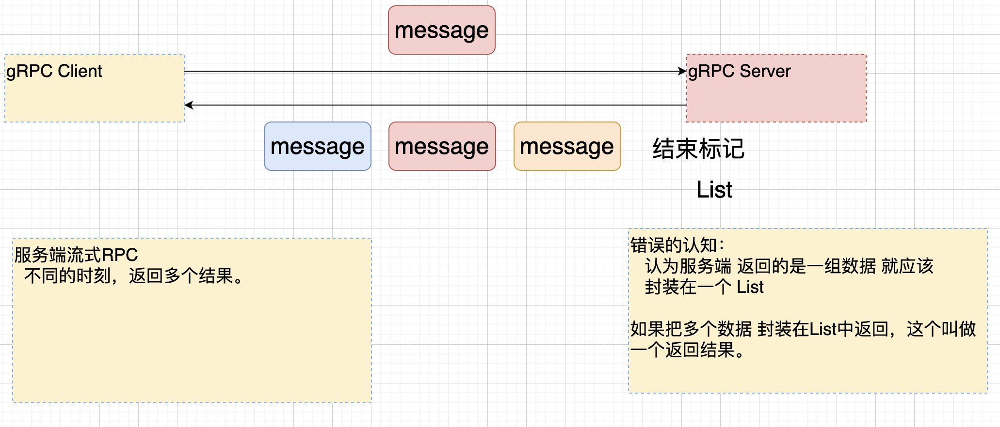
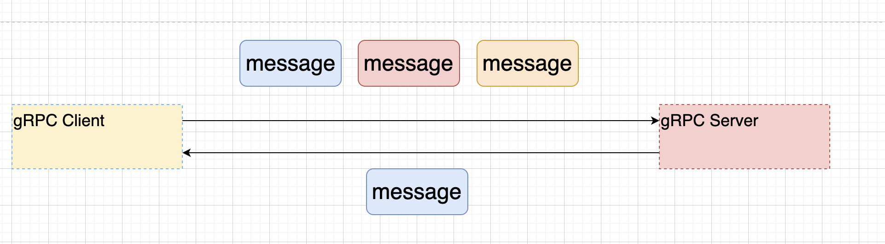
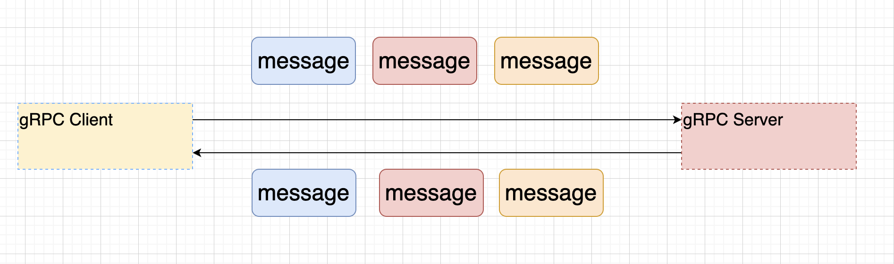

# gRPC学习
  - [gRPC 核心的设计思路](#grpc核心的设计思路)
  - [gRPC 与 ThriftRPC 区别](#grpc与-thriftrpc区别)
  - [gRPC的好处](#grpc的好处)
  - [Http2.0协议](#http2-0协议)
- [Protocol Buffers[protobuf]](#protocol-buffers-protobuf)
  - [protobuf的语法详解](#protobuf的语法详解)
  - [gPRC的开发](#gprc的开发)
  - [**gRpc的四种通信方式**](#grpc的四种通信方式)
  - [gPRC代理方式](#gprc代理方式)
  - [Springboot + RPC](#springboot-rpc)


## gRPC 核心的设计思路 
1. 网络通信 ---> gRPC自己封装网络通信的部分 提供多种语言的 网络通信的封装 （C Java[Netty] GO)
2. 协议    ---> HTTP2 传输数据的时候 二进制数据内容。 支持双向流（双工）连接的多路复用。
3. 序列化   ---> 基本文本 JSON  基于二进制 Java原生序列化方式Thrift二进制的序列化 压缩二级制序列化。
4. 代理的创建 --->让调用者像调用本地方法那样 去调用远端的服务方法。

## gRPC 与 ThriftRPC 区别
   共性：支持异构语言的RPC。
   区别：
    1. 网络通信 Thrift TCP   专属协议
                   GRPC   HTTP2
    2. 性能角度 ThriftRPC 性能 高于 gRPC
    3. gRPC 大厂背书（Google),云原生时代 与其他组件合作的顺利。所以gRPC应用更广泛。
        
## gRPC的好处 
   1. 高效的进行进程间通信。
   2. 支持多种语言 原生支持 C  Go Java实现。C语言版本上扩展 C++ C# NodeJS Python Ruby PHP..
   4. gPRC序列化方式采用protobuf，效率高。
   5. 使用Http2协议
   6. 针对于云原生的生态比较友好

## Http2.0协议

~~~markdown
1. 回顾 Http1.x协议 
   Http1.0协议  请求响应的模式 短连接协议（无状态协议）  传输数据文本结构     单工 无法实现服务端推送 变相实现推动（客户端轮训的方式） 
   Http1.1协议  请求响应的模式 有限的长连接            升级的方式WebSocket 双工 实现服务器向客户端推送。
   总结Http1.x协议 共性
     1. 传输数据文本格式 可读性好的但是效率差。
     2. 本质上Http1.x协议无法实现双工通信。
     3. 资源的请求。需要发送多次请求，建立多个连接才可以完成。 
2. HTTP2.0协议 
     1. Http2.0协议是一个二进制协议，效率高于Http1.x协议，可读性差。
     2. 可以实现双工通信。
     3. 一个请求 一个连接 可以请求多个数据。【多路复用】
3. Http2.0协议的三个概念
     1. 数据流 stream
     2. 消息   message
     3. 帧    frame    参看图
4. 其他的相关概念
     1. 数据流的优先级，可以通过为不同的stream设置权重，来限制不同流的传输顺序。
     2. 流控 client发送的数据太快了，server处理不过来，通知client暂停数据的发送。
~~~

# Protocol Buffers[protobuf]
~~~
protobuf 是一种与编程语言无关【IDL】,与具体的平台无关【OS】。他定义的中间语言，可以方便的在client 于 server中进行RPC的数据传输。
~~~


## protobuf的语法详解
- 基本类型
  

- 消息 Message 

  ~~~protobuf
  message LoginRequest {
     string username = 1;
     singular string password = 2;
     int32  age = 3;
  }
  
  编号 从1开始 到2^29-1  注意：19000 - 19999 不能用这个区间内的编号，因为他是protobuf自己保留的。
  ~~~

## gPRC的开发

- 项目结构

  ~~~markdown
  1. xxxx-api 模块 
     定义 protobuf idl语言 
     并且通过命令创建对应的代码
  2. xxxx-server模块
     1. 实现api模块中定义的服务接口
     2. 发布gRPC服务 (创建服务端程序)
  3. xxxx-clien模块
     1. 创建服务端stub(代理)
     2. 基于代理（stub) RPC调用。
  ~~~

- api模块

  

- xxxx-server 服务端模块的开发

  ~~~java
  1. 实现业务接口 添加具体的功能 （MyBatis+MySQL)
     public class HelloServiceImpl extends HelloServiceGrpc.HelloServiceImplBase {
      /*
        1. 接受client提交的参数  request.getParameter()
        2. 业务处理 service+dao 调用对应的业务功能。
        3. 提供返回值
       */
      @Override
      public void hello(HelloProto.HelloRequest request, StreamObserver<HelloProto.HelloResponse> responseObserver) {
          //1.接受client的请求参数
          String name = request.getName();
          //2.业务处理
          System.out.println("name parameter "+name);
          //3.封装响应
          //3.1 创建相应对象的构造者
          HelloProto.HelloResponse.Builder builder = HelloProto.HelloResponse.newBuilder();
          //3.2 填充数据
          builder.setResult("hello method invoke ok");
          //3.3 封装响应
          HelloProto.HelloResponse helloResponse = builder.build();
  
          responseObserver.onNext(helloResponse);
          responseObserver.onCompleted();;
      }
  }
  2. 创建服务端 （Netty)
  public class GprcServer1 {
      public static void main(String[] args) throws IOException, InterruptedException {
          //1. 绑定端口 
          ServerBuilder serverBuilder = ServerBuilder.forPort(9000);
          //2. 发布服务
          serverBuilder.addService(new HelloServiceImpl());
          //serverBuilder.addService(new UserServiceImpl());
          //3. 创建服务对象
          Server server = serverBuilder.build();
          
          server.start();
          server.awaitTermination();;
      }
  }
  ~~~

- xxx-client 模块

  ~~~java
  1. client通过代理对象完成远端对象的调用
  
  public class GprcClient1 {
      public static void main(String[] args) {
          //1 创建通信的管道
          ManagedChannel managedChannel = ManagedChannelBuilder.forAddress("localhost", 9000).usePlaintext().build();
          //2 获得代理对象 stub
          try {
              HelloServiceGrpc.HelloServiceBlockingStub helloService = HelloServiceGrpc.newBlockingStub(managedChannel);
              //3. 完成RPC调用
              //3.1 准备参数
              HelloProto.HelloRequest.Builder builder = HelloProto.HelloRequest.newBuilder();
              builder.setName("sunshuai");
              HelloProto.HelloRequest helloRequest = builder.build();
              //3.1 进行功能rpc调用，获取相应的内容
              HelloProto.HelloResponse helloResponse = helloService.hello(helloRequest);
              String result = helloResponse.getResult();
              System.out.println("result = " + result);
          } catch (Exception e) {
              throw new RuntimeException(e);
          }finally {
              managedChannel.shutdown();
          }
      }
  }
  ~~~

- 注意事项

  ~~~markdown
  服务端 处理返回值时
  responseObserver.onNext(helloResponse1);  //通过这个方法 把响应的消息 回传client
  responseObserver.onCompleted();           //通知client 整个服务结束。底层返回标记 
                                            // client就会监听标记 【grpc做的】

## **gRpc的四种通信方式**

- 四种通信方式

  ~~~markdown
  1. 简单rpc 一元rpc (Unary RPC)
  2. 服务端流式RPC   (Server Streaming RPC)
  3. 客户端流式RPC   (Client Streaming RPC)
  4. 双向流RPC (Bi-directional Stream RPC)
  ~~~

- **简单RPC(一元RPC)**
  - 特点

    ~~~markdown
    当client发起调用后，提交数据，并且等待 服务端响应。
    开发过程中，主要采用就是一元RPC的这种通信方式
    ~~~

    

  - 语法

    ~~~protobuf
    service HelloService{
      rpc hello(HelloRequest) returns (HelloResponse){}
      rpc hello1(HelloRequest1) returns (HelloResponse1){}
    }
    ~~~

- **服务端流式RPC** 

  ~~~markdown
  一个请求对象，服务端可以回传多个结果对象。
  ~~~

  - 特点

    

  - 语法

    ~~~markdown
    service HelloService{
      rpc hello(HelloRequest) returns (stream HelloResponse){}
      rpc hello1(HelloRequest1) returns (HelloResponse1){}
    }
    ~~~

  - 关键代码

    ~~~java
    服务端
    public void c2ss(HelloProto.HelloRequest request, StreamObserver<HelloProto.HelloResponse> responseObserver) {
            //1 接受client的请求参数
            String name = request.getName();
            //2 做业务处理
            System.out.println("name = " + name);
            //3 根据业务处理的结果，提供响应
            for (int i = 0; i < 9; i++) {
                HelloProto.HelloResponse.Builder builder = HelloProto.HelloResponse.newBuilder();
                builder.setResult("处理的结果 " + i);
                HelloProto.HelloResponse helloResponse = builder.build();
    
                responseObserver.onNext(helloResponse);
                try {
                    Thread.sleep(1000);
                } catch (InterruptedException e) {
                    throw new RuntimeException(e);
                }
            }
            responseObserver.onCompleted();
        }
    客户端
    public class GprcClient3 {
        public static void main(String[] args) {
            ManagedChannel managedChannel = ManagedChannelBuilder.forAddress("localhost", 9000).usePlaintext().build();
            try {
                HelloServiceGrpc.HelloServiceBlockingStub helloService = HelloServiceGrpc.newBlockingStub(managedChannel);
    
                HelloProto.HelloRequest.Builder builder = HelloProto.HelloRequest.newBuilder();
                builder.setName("sunshuai");
                HelloProto.HelloRequest helloRequest = builder.build();
                Iterator<HelloProto.HelloResponse> helloResponseIterator = helloService.c2ss(helloRequest);
                while (helloResponseIterator.hasNext()) {
                    HelloProto.HelloResponse helloResponse = helloResponseIterator.next();
                    System.out.println("helloResponse.getResult() = " + helloResponse.getResult());
                }
            } catch (Exception e) {
                e.printStackTrace();
            }
            finally {
                managedChannel.shutdown();
            }
        }
    }
    
    监听 异步方式 处理服务端流式RPC的开发
    1. api
    2. 服务端 
    3. 客户端 
       public class GrpcClient4 {
        public static void main(String[] args) {
            ManagedChannel managedChannel = ManagedChannelBuilder.forAddress("localhost", 9000).usePlaintext().build();
    
            try {
    
                HelloServiceGrpc.HelloServiceStub helloService = HelloServiceGrpc.newStub(managedChannel);
    
                HelloProto.HelloRequest.Builder builder = HelloProto.HelloRequest.newBuilder();
                builder.setName("xiaohei");
                HelloProto.HelloRequest helloRequest = builder.build();
    
                helloService.c2ss(helloRequest, new StreamObserver<HelloProto.HelloResponse>() {
                    @Override
                    public void onNext(HelloProto.HelloResponse value) {
                        //服务端 响应了 一个消息后，需要立即处理的话。把代码写在这个方法中。
                        System.out.println("服务端每一次响应的信息 " + value.getResult());
                    }
    
                    @Override
                    public void onError(Throwable t) {
    
                    }
    
                    @Override
                    public void onCompleted() {
                        //需要把服务端 响应的所有数据 拿到后，在进行业务处理。
                        System.out.println("服务端响应结束 后续可以根据需要 在这里统一处理服务端响应的所有内容");
                    }
                });
    
                managedChannel.awaitTermination(12, TimeUnit.SECONDS);
    
            } catch (Exception e) {
                e.printStackTrace();
            } finally {
                managedChannel.shutdown();
            }
        }
    }
    ~~~

- **客户端流式RPC**

  ~~~markdown
  客户端发送多个请求对象，服务端只返回一个结果
  ~~~

  

  - 应用场景

    ~~~markdown
    IOT(物联网 【传感器】) 向服务端 发送数据
    ~~~

  - proto

    ~~~protobuf
    rpc cs2s(stream HelloRequest) returns (HelloResponse){}
    ~~~

  - 开发

    ~~~java
    1. api
       rpc cs2s(stream HelloRequest) returns (HelloResponse){}
    2. 服务端开发
       public StreamObserver<HelloProto.HelloRequest> cs2s(StreamObserver<HelloProto.HelloResponse> responseObserver) {
            return new StreamObserver<HelloProto.HelloRequest>() {
                @Override
                public void onNext(HelloProto.HelloRequest value) {
                    System.out.println("接受到了client发送一条消息 " + value.getName());
                }
    
                @Override
                public void onError(Throwable t) {
    
                }
    
                @Override
                public void onCompleted() {
                    System.out.println("client的所有消息 都发送到了 服务端 ....");
    
                    //提供响应：响应的目的：当接受了全部client提交的信息，并处理后，提供相应
                    HelloProto.HelloResponse.Builder builder = HelloProto.HelloResponse.newBuilder();
                    builder.setResult("this is result");
                    HelloProto.HelloResponse helloResponse = builder.build();
    
                    responseObserver.onNext(helloResponse);
                    responseObserver.onCompleted();
                }
            };
        }
    3. 客户端开发
       public class GrpcClient5 {
        public static void main(String[] args) {
            ManagedChannel managedChannel = ManagedChannelBuilder.forAddress("localhost", 9000).usePlaintext().build();
            try {
                HelloServiceGrpc.HelloServiceStub helloService = HelloServiceGrpc.newStub(managedChannel);
    
                StreamObserver<HelloProto.HelloRequest> helloRequestStreamObserver = helloService.cs2s(new StreamObserver<HelloProto.HelloResponse>() {
                    @Override
                    public void onNext(HelloProto.HelloResponse value) {
                        // 监控响应
                        System.out.println("服务端 响应 数据内容为 " + value.getResult());
    
                    }
    
                    @Override
                    public void onError(Throwable t) {
    
                    }
    
                    @Override
                    public void onCompleted() {
                        System.out.println("服务端响应结束 ... ");
                    }
                });
    
                //客户端 发送数据 到服务端  多条数据 ，不定时...
                for (int i = 0; i < 10; i++) {
                    HelloProto.HelloRequest.Builder builder = HelloProto.HelloRequest.newBuilder();
                    builder.setName("sunshuai " + i);
                    HelloProto.HelloRequest helloRequest = builder.build();
    
                    helloRequestStreamObserver.onNext(helloRequest);
                    Thread.sleep(1000);
                }
    
                helloRequestStreamObserver.onCompleted();
    
                managedChannel.awaitTermination(12, TimeUnit.SECONDS);
    
            } catch (Exception e) {
                e.printStackTrace();
            } finally {
                managedChannel.shutdown();
            }
        }
    }
    ~~~

- **双向流式RPC**

  ~~~markdown
  客户端可以发送多个请求消息，服务端响应多个响应消息
  ~~~

  

  - 应用场景

    ~~~markdown
    聊天室
    ~~~

  - 编码

    ~~~java
    1. api
        rpc cs2ss(stream HelloRequest) returns (stream HelloResponse){}
    2. 服务端
        public StreamObserver<HelloProto.HelloRequest> cs2ss(StreamObserver<HelloProto.HelloResponse> responseObserver) {
             return new StreamObserver<HelloProto.HelloRequest>() {
                 @Override
                 public void onNext(HelloProto.HelloRequest value) {
                     System.out.println("接受到client 提交的消息 "+value.getName());
                     responseObserver.onNext(HelloProto.HelloResponse.newBuilder().setResult("response "+value.getName()+" result ").build());
                 }
    
                 @Override
                 public void onError(Throwable t) {
    
                 }
    
                 @Override
                 public void onCompleted() {
                     System.out.println("接受到了所有的请求消息 ... ");
                     responseObserver.onCompleted();
                 }
             };
        }
    3. 客户端
      public class GrpcClient6 {
        public static void main(String[] args) {
            ManagedChannel managedChannel = ManagedChannelBuilder.forAddress("localhost", 9000).usePlaintext().build();
            try {
                HelloServiceGrpc.HelloServiceStub helloService = HelloServiceGrpc.newStub(managedChannel);
    
                StreamObserver<HelloProto.HelloRequest> helloRequestStreamObserver = helloService.cs2ss(new StreamObserver<HelloProto.HelloResponse>() {
                    @Override
                    public void onNext(HelloProto.HelloResponse value) {
                        System.out.println("响应的结果 "+value.getResult());
                    }
    
                    @Override
                    public void onError(Throwable t) {
    
                    }
    
                    @Override
                    public void onCompleted() {
                        System.out.println("响应全部结束...");
                    }
                });
    
    
                for (int i = 0; i < 10; i++) {
                    helloRequestStreamObserver.onNext(HelloProto.HelloRequest.newBuilder().setName("sunshuai " + i).build());
                }
                helloRequestStreamObserver.onCompleted();
    
                managedChannel.awaitTermination(12, TimeUnit.SECONDS);
    
            } catch (Exception e) {
                e.printStackTrace();
            } finally {
                managedChannel.shutdown();
            }
        }
    }
    ~~~

## gPRC代理方式

~~~markdown
1. BlockingStub
   阻塞 通信方式 
2. Stub（常用）
   异步 通过监听处理的
3. FutureStub 适用于需要异步调用但代码仍需同步风格的场景（如旧系统改造）
   同步 异步 NettyFuture
   1. FutureStub只能应用 一元RPC 
~~~

~~~java
public class GrpcClient7 {
    public static void main(String[] args) {
        ManagedChannel managedChannel = ManagedChannelBuilder.forAddress("localhost", 9000).usePlaintext().build();
        try {
            TestServiceGrpc.TestServiceFutureStub testServiceFutureStub = TestServiceGrpc.newFutureStub(managedChannel);
            ListenableFuture<TestProto.TestResponse> responseListenableFuture = testServiceFutureStub.testSuns(TestProto.TestRequest.newBuilder().setName("xiaojren").build());


            /* 同步操作
            TestProto.TestResponse testResponse = responseListenableFuture.get();
            System.out.println(testResponse.getResult());*/

          /*  responseListenableFuture.addListener(() -> {
                System.out.println("异步的rpc响应 回来了....");
            }, Executors.newCachedThreadPool());*/

            Futures.addCallback(responseListenableFuture, new FutureCallback<TestProto.TestResponse>() {
                @Override
                public void onSuccess(TestProto.TestResponse result) {
                    System.out.println("result.getResult() = " + result.getResult());
                }

                @Override
                public void onFailure(Throwable t) {

                }
            }, Executors.newCachedThreadPool());


            System.out.println("后续的操作....");

            managedChannel.awaitTermination(12, TimeUnit.SECONDS);
        } catch (Exception e) {
            e.printStackTrace();
        } finally {
            managedChannel.shutdown();
        }
    }
}
~~~

## Springboot + RPC
```java  
  // 注入一个gRPC客户端代理（Stub）
  @GrpcClient("grpc-server")  
```

# Health cheek
