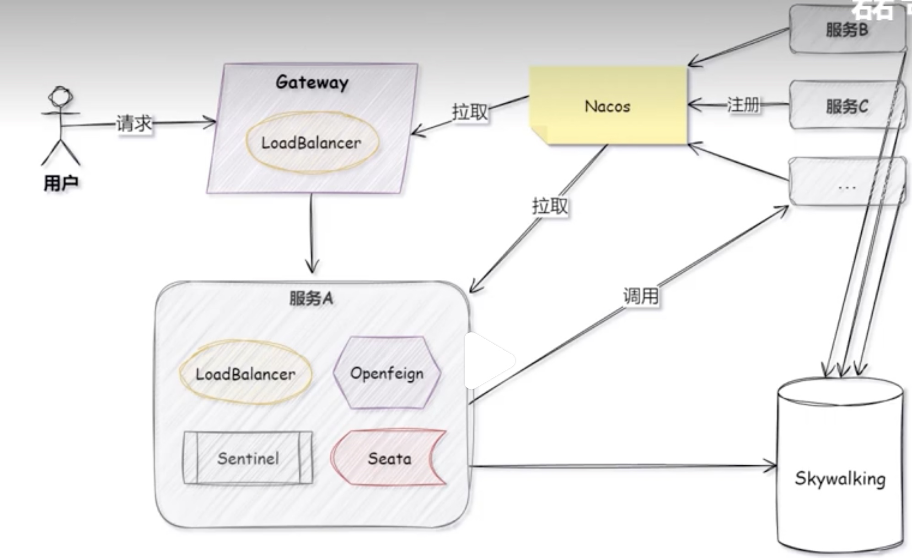

# 分布式&&微服务
  - [如何理解分布式？](#如何理解分布式？)
  - [单体项目和微服务的主要区别：](#单体项目和微服务的主要区别：)
  - [哪个更好？](#哪个更好？)
  - [微服务系统设计](#微服务系统设计)
  - [微服务](#微服务)
  - [**微服务执行流程**](#微服务执行流程)
  - [实战经验](#实战经验)
  - [可用性](#可用性)
- [Nacos](#nacos)
  - [Nacos干啥用的？](#nacos干啥用的？)
  - [nacos怎么对配置分级管理？](#nacos怎么对配置分级管理？)

## 如何理解分布式？

**概念**：通过多个计算节点协同工作来完成任务的系统架构。在这个系统中，计算资源、存储资源或数据不在一个节点上，而是分布在多个物理或虚拟的节点中，每个节点可以彼此通信，共同完成系统的功能。

**核心思想**：分散资源来提高系统的性能、可扩展性、容错能力和可靠性。

**资源分布**：计算任务、数据存储或其他资源分布在多个节点上，这些节点分布在不同的物理位置，比如：独立的服务器、虚拟机或容器。==--->Mysql主从集群、Dubbo==

## 单体项目和微服务的主要区别：
为实现业务灵活扩展、快速迭代、互不影响的特性，因此设计上采用微服务来实现，不同业务场景通过不同的微服务实现。

| 特性           | 单体项目                                                     | 微服务                                                       |
| -------------- | ------------------------------------------------------------ | ------------------------------------------------------------ |
| **架构方式**   | 所有功能模块在一个应用中运行，紧密耦合。                     | 将应用拆分成多个独立的服务，每个服务都可以独立部署和扩展。   |
| **代码库管理** | 一个单一的代码库。                                           | 每个服务通常有自己的代码库。                                 |
| **部署**       | 所有功能部署为一个单一的应用程序，重新部署时需要更新整个系统。 | 每个服务独立部署，可以单独更新和扩展，支持持续部署。         |
| **扩展性**     | 随着应用增长，扩展变得困难，通常需要垂直扩展。               | 支持水平扩展，可以单独扩展某个服务，灵活性更高。             |
| **技术栈**     | 通常使用相同的技术栈，更新技术栈困难。                       | 每个服务可以选择不同的技术栈，技术栈自由度较大。             |
| **模块间通信** | 直接调用本地方法，通信开销小。                               | 服务之间通过网络通信（通常是 REST API、消息队列等），存在网络延迟。 |
| **团队协作**   | 适合小团队，代码集中在一个地方，协作较简单。                 | 团队分散，服务之间需要较强的协作和接口契约管理。             |
| **测试与部署** | 测试相对简单，但需要重新部署整个应用，风险较大。             | 每个服务独立部署，减少了整个系统的测试和部署风险，支持小范围变更。 |
| **维护和演化** | 随着代码量增加，维护和演化变得复杂。                         | 更易于维护和演化，因为每个服务可以独立升级和优化。           |

## 哪个更好？

只能说没有更好，只能说哪个模式更匹配我们团队的实际应用场景，这取决于项目的规模、需求和资源：

- **小型项目或初创阶段**：单体项目通常更合适，因为它简单、易于管理、可以快速开发。
- **大型、复杂应用或长远发展**：微服务架构更为合适，它能提供更好的扩展性、灵活性和容错性，适用于复杂的业务需求和团队合作。

总的来说，两者没有绝对的优劣，选择哪种架构要根据具体项目的特点、团队规模、未来需求和技术栈来做决定。

## 微服务系统设计
防止雪崩、跨功能需求、功能降级、超时、熔断、幂等、缓存、服务隔离、可伸缩、可拓展、数据库拆分

## 微服务
**核心：分而治之**
微服务：通过业务拆分来实现组件服务化，通过组件之间的组合完成一个面向业务场景的一组功能模块（从一个巨石应用拆分为多个小应用）

* 优点：
    * 灵活
    * 去中心化服务：比如A -- RPC --> B
    * 可拓展-扩缩容
    * 隔离部署：一共有两三台Node，如果一台Node Crash了，可能1/3的流量就会被剩下两台机器去完全承载，也就是说，多台物理机相对于单台物理机（Node）对单个服务的影响会变小。
* 缺点：基础设施建设复杂度高（管理复杂度高）：需要集中式log查看、监控平台的查找、data一致性问题

## **微服务执行流程**

用户从前端访问微服务，首先到达网关，网关从Nacos拿到所有的服务列表，之后网关通过LoadBalance转发到某一个服务上，在调用服务A的时候，可能会调用Sentinel的限流和熔断，使用Openfeign获取Nacos中的服务，进行与其他微服务之间调用，通过LoadBanlance负载均衡策略再去请求某一个服务，在调用这些服务中的链条中，可能会涉及Seata分布式事务调用，这些服务在执行的时候，会将日志存储到Skywalking中，这样我们如果出现问题的时候，就可以通过Skywalking的监控中心，来监控到对应的日志和问题

## 实战经验
以前做测试的时候，可能我们测试小姐姐需要去围绕我们一个单体应用，去让我交付一个分支、构建，然后上线测试，但是，现在说如果我在微服务架构上，完成一个复杂的功能，比方说会员功能，这个模块可能会联动了七八个服务，比如说用户、产品等等。都要去同时同步的上线，并且每一个服务都必须保证交付完成，然后才能进行一个完成的测试，但是如果中间有一个服务没有构建好，那么我们的测试同学，可能认为是有bug，单实际上是我们构建过程中出现了一些问题，这使我们的复杂度变的很高。

## 可用性
* 隔离
* 超时控制
* 负载保护
* 限流
* 降级
* 熔断
* 负载均衡（7层）

CICD：Gitlab + Gitlab Hooks + hubernetes
测试：测试黄精、单元测试、API测试
在线运行时：kubernetes、Prometheus，ELK、Control Panle

# Nacos
## Nacos干啥用的？
* Nacos 核心：一站式微服务组件，同时做配置中心（动态配置、集中管理）和服务注册中心（服务发现、负载均衡）
* 项目使用：SpringCloud Alibaba 项目中引入对应依赖，配置 Nacos 地址，配置中心用 bootstrap.yml 指定服务名 / Namespace/Group，加 @RefreshScope 实现动态刷新；服务注册加 @EnableDiscoveryClient，微服务通过服务名调用；

## nacos怎么对配置分级管理？
* 配置分级：核心三级维度（Namespace→Group→Data ID），分别对应环境 / 集群→业务 / 模块→具体服务，高优先级覆盖低优先级，项目中通过分级实现配置隔离和复用，解决多环境、多模块的配置管理痛点。
