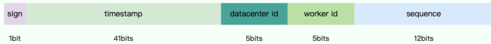

# 分布式ID
  - [自增ID](#自增id)
  - [UUID](#uuid)
  - [Snowflake（雪花算法）](#snowflake（雪花算法）)
  - [雪花算法存在时钟回拨问题，如何解决](#雪花算法存在时钟回拨问题，如何解决)

## 自增ID
优点：实现起来比较简单、ID 有序递增、存储消耗空间小
缺点：支持的并发量不大、存在数据库单点问题（可以使用数据库集群解决，不过增加了复杂度）、ID 没有具体业务含义、安全问题（比如根据订单 ID 的递增规律就能推算出每天的订单量，商业机密啊！ ）、每次获取 ID 都要访问一次数据库（增加了对数据库的压力，获取速度也慢）

## UUID
优点：生成速度通常比较快、简单易用
缺点：存储消耗空间大（32 个字符串，128 位）、不安全（基于 MAC 地址生成 UUID 的算法会造成 MAC 地址泄露)、无序（非自增）、没有具体业务含义、需要解决重复 ID 问题（当机器时间不对的情况下，可能导致会产生重复 ID）

## Snowflake（雪花算法）
原理：
Snowflake 由 64 bit 的二进制数字组成，这 64bit 的二进制被分成了几部分，每一部分存储的数据都有特定的含义：

* sign(1bit):符号位（标识正负），始终为 0，代表生成的 ID 为正数。
* timestamp (41 bits):一共 41 位，用来表示时间戳，单位是毫秒，可以支撑 2 ^41 毫秒（约 69 年）
* datacenter id + worker id (10 bits):一般来说，前 5 位表示机房 ID，后 5 位表示机器 ID（实际项目中可以根据实际情况调整）。这样就可以区分不同集群/机房的节点。
* sequence (12 bits):一共 12 位，用来表示序列号。 序列号为自增值，代表单台机器每毫秒能够产生的最大 ID 数(2^12 = 4096),也就是说单台机器每毫秒最多可以生成 4096 个 唯一 ID。

优点：生成速度比较快、生成的 ID 有序递增、比较灵活（可以对 Snowflake 算法进行简单的改造比如加入业务 ID）
缺点：需要解决重复 ID 问题（ID 生成依赖时间，在获取时间的时候，可能会出现时间回拨的问题，也就是服务器上的时间突然倒退到之前的时间，进而导致会产生重复 ID）、依赖机器 ID 对分布式环境不友好（当需要自动启停或增减机器时，固定的机器 ID 可能不够灵活）。

## 雪花算法存在时钟回拨问题，如何解决
**什么是时钟回拨问题**
在生成分布式ID方案中，时钟回拨问题是指系统时间出现回退现象时，可能导致分布式ID生成过程中的冲突和重复。

**美团Leaf在分布式ID的过程中是如何解决时钟回拨问题的？**
Leaf提供两种模式生成分布式ID：
* Leaf-Snowflake模式：基于改进的Snowflake算法，使用时间戳 + 工作节点ID + 序列号的组合生成唯一的ID
* Leaf-Segment模式：基于数据库号段的方式，通过预生成号段分配到接待您进行ID生成。
> 时钟回拨问题主要影响SnowFlake模式，因为它强依赖时间戳

**时钟回拨检测**：
* Leaf在每次生成ID时记录上一次生成的时间戳
* 当新请求的时间戳小于lastTimestamp时，说明发生了时钟回拨
* 当检测到时钟回拨后，Leaf采取了相应的处理策略

**时钟回拨处理策略**：
**1、微小回拨时（ <=5ms ）**
* 等待机制：当检测到时钟回拨时，直接阻塞请求，等待系统时钟恢复到lastTimestamp。
* 这种策略适用于短时间小幅度回拨（如NTP时间调整），代价较低且容易实现

**2、较大回拨时（ >5ms）**
* 切换逻辑时钟：在时钟回拨幅度较大时，Leaf切换到逻辑时钟（逻辑序列号）生成ID，而不依赖系统时间。
* 告警机制：当时钟回拨超出阈值，系统会触发告警，通知运维团队检查问题。

**为了避免时钟回拨导致ID重复或生成暂定，Leaf措施**：
* 序列号溢出补偿：如果当前毫秒内的序列号达到上限，会优先尝试生成基于逻辑时钟的序列号，确保生成连续性。
* 多节点冗余：Leaf-Snoeflake模式支持多节点协作。即使某个节点因时钟回拨无法生成ID，其他节点仍然可以正常服务。

