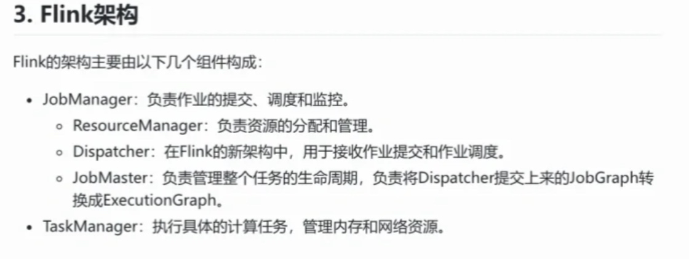
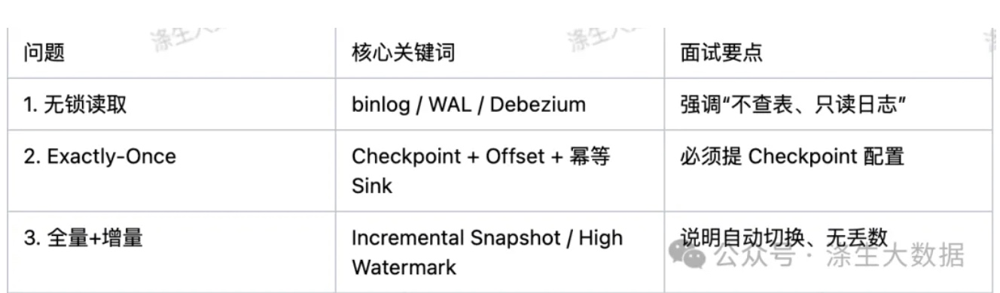

# Flink
- [Flink](#flink)
- [Flink CDC](#flink-cdc)
  - [Flink CDC 如何保证 Exactly-Once 语义？](#flink-cdc如何保证-exactly-once语义？)
  - [全量 + 增量如何无缝衔接？会不会丢数据？](#全量增量如何无缝衔接？会不会丢数据？)
  - [flink CDC和flink CEP](#flink-cdc和flink-cep)
  - [flink是怎么产生的？](#flink是怎么产生的？)
  - [flink的框架是怎么样的？](#flink的框架是怎么样的？)
  - [Flink作业执行流程](#flink作业执行流程)
  - [flink 的内存模型说一说？](#flink的内存模型说一说？)
  - [flink的（Checkpoint）cp ,（Savepoint）sp说一说原理，有什么区别？你们是怎么设置cp的相关参数？](#flink的（checkpoint）cp（-savepoint）sp说一说原理，有什么区别？你们是怎么设置cp的相关参数？)
  - [flink的四个图是什么？分别都是什么环节对应什么图？](#flink的四个图是什么？分别都是什么环节对应什么图？)
  - [flink反压机制，你是如何理解的？你是如何定位、并有什么方案解决？与spark的反压有什么区别？](#flink反压机制，你是如何理解的？你是如何定位、并有什么方案解决？与spark的反压有什么区别？)
  - [**Flink反压机制的工作原理**](#flink反压机制的工作原理)
    - [**一、问题定位**](#一、问题定位)
    - [**二、解决方案**](#二、解决方案)
    - [与spark的反压有什么区别](#与spark的反压有什么区别)
  - [flink的barrier对齐和非对齐是怎么理解的？](#flink的barrier对齐和非对齐是怎么理解的？)
  - [flink的精准一次（Exactly-Once）和至少一次（At-Least-Once）是怎么理解的？](#flink的精准一次（exactly-once）和至少一次（at-least-once）是怎么理解的？)
  - [flink任务消费或者写入kafka时，并行度不一致有什么问题？](#flink任务消费或者写入kafka时，并行度不一致有什么问题？)
  - [**如何在Flink消费Kafka时做到Exactly-Once？**](#如何在flink消费kafka时做到exactly-once？)
  - [flink如何保证数据一致性？](#flink如何保证数据一致性？)
  - [flink对于kafka新增分区时，消费有什么问题吗？](#flink对于kafka新增分区时，消费有什么问题吗？)
  - [flink消费kafka的offset是怎么维护的？自动提交？](#flink消费kafka的offset是怎么维护的？自动提交？)
  - [flink任务做过什么调优？](#flink任务做过什么调优？)
    - [数据积压问题解决](#数据积压问题解决)
  - [你们用flink做过实时数仓吗？你们的上下游的环境都是什么？全链路时效是多少？](#你们用flink做过实时数仓吗？你们的上下游的环境都是什么？全链路时效是多少？)
  - [**广告大搜业务，Flink流处理 - 列表页 checkpoint失败，反压问题解决rebalance 在逻辑处理处添加并行度 提高checkpoint时间**](#广告大搜业务，flink流处理列表页-checkpoint失败，反压问题解决rebalance在逻辑处理处添加并行度提高-checkpoint时间)
  - [Flink三种状态后端](#flink三种状态后端)
    - [为什么在Flink中配置RocksDB作为状态后端](#为什么在flink中配置rocksdb作为状态后端)
  - [Hive SQL优化](#hive-sql优化)
    - [实践案例](#实践案例)




已经将Flink JM/TM的日志已经收集到ES中，可以通过Kibana来查询相关的日志用来排查定位Flink相关的问题
资源监控平台：查看每天CPU内存资源和n天折线趋势图，每天内存资源使用详细情况

# Flink CDC
核心原理 Flink CDC（Change Data Capture）基于 Debezium 引擎，通过 读取数据库底层日志（而非执行 SQL 查询）来捕获数据变更：MySQL：读取 binlog（需开启 ROW 格式）「Mysql前提条件：binlog_format=ROW、binglog_row_image=FULL」

面试话术示例： “我们在生产环境用 Flink CDC 同步核心订单表（日增 5000 万条），DB CPU 使用率波动 <2%，完全满足业务的SLA。”

## Flink CDC 如何保证 Exactly-Once 语义？
✅ 端到端 Exactly-Once 的实现机制 Flink CDC 本身是 Source 算子，其一致性依赖于 Flink 的 Checkpoint 机制：

状态快照：每次 Checkpoint 时，将当前消费的 binlog 位点（如 filename + position ）写入状态后端；
故障恢复：任务重启后，从最近成功的 Checkpoint 中恢复位点，精准重放后续变更；
下游配合：要求 Sink 支持 幂等写入 或 事务提交（如 Kafka 事务、Doris Unique 模型、Hudi MOR）。
[MySQL] → (binlog) → [Flink CDC Source] → [Flink Job] → [Kafka/Doris] ↑ Checkpoint 保存 offset

常见误区：

❌ 仅开启 auto-commit → 只能保证 At-Least-Once ✅ 必须启用 Flink Checkpoint（建议间隔 30s~1min）
配置示例（MySQL CDC）
```bash
MySqlSource.<String>builder()
    .hostname("localhost")
    .port(3306)
    .databaseList("inventory")
    .tableList("inventory.products")
    .username("flinkuser")
    .password("flinkpw")
    .deserializer(new JsonDebeziumDeserializationSchema())
    .build();
 
// 同时在 env 中启用 checkpoint
env.enableCheckpointing(60_000); // 60秒
```
面试话术示例： “我们通过 Flink Checkpoint + Doris Unique 模型，实现了从 MySQL 到数据湖的端到端 Exactly-Once，对账零误差。”

## 全量 + 增量如何无缝衔接？会不会丢数据？
Flink CDC 2.0+ 的“一体化快照”机制 传统 CDC 工具需手动拼接全量和增量，而 Flink CDC 2.0 引入了 Incremental Snapshot，实现自动平滑切换：

启动时：记录当前 binlog 位点（称为 high watermark）；
全量阶段：分 chunk 并行读取表数据（支持断点续传）；
增量阶段：全量完成后，自动从 high watermark 开始消费 binlog；
中间变更处理：全量过程中产生的新变更，会被 binlog 捕获并在增量阶段重放，确保不丢失。
关键配置（MySQL）：
```bash
debeziumProperties(
    PropertiesUtil.propertiesOf(
        "snapshot.mode", "initial",
        "scan.incremental.snapshot.enabled", "true",      // 启用增量快照
        "scan.incremental.snapshot.chunk.size", "8192"    // 分片大小
    )
)
```
数据一致性保障

全量读取使用 MVCC 快照（MySQL InnoDB），避免脏读
增量从 精确位点 开始，与全量无重叠、无间隙
支持 大表同步（亿级）且内存可控
✅ 面试话术示例： “我们用 Flink CDC 同步 2 亿用户的主数据表，全量耗时 1.5 小时，切换瞬间无数据 gap，业务完全无感知。”



## flink CDC和flink CEP

CDC（实时数据集成）聚焦于“数据变更的捕获和同步”解决“数据从哪来、到哪去的问题”
CEP（实时业务决策）聚焦于“实践模式的检测与分析”，解决“从时间流中发现什么规律的问题”


## flink是怎么产生的？

批处理视为 “有限流”，流处理视为 “无限流”
解决传统框架的三大痛点：

* **批流统一**：用同一套引擎处理批数据（有限流）和流数据（无限流），避免用户为两种场景维护两套系统（如同时用 Spark 批处理和 Storm 流处理）。
* **低延迟与高吞吐**：通过基于内存的流水线执行模式和增量计算，在保证高吞吐（百万级 / 秒）的同时实现低延迟（毫秒级）。
* **强一致性**：通过分布式快照（Checkpoint）机制，确保在节点故障时数据处理结果的精确一致性，满足金融、电商等对数据准确性要求极高的场景。


## flink的框架是怎么样的？

一、部署层
1、JobManager（主节点）：负责整个应用的生命周期

* 接收并解析作业：接收用户提交的 Flink 作业（Job），生成执行计划。
* 资源申请与任务调度：向资源管理器申请计算资源，将任务（Task）分配到 TaskManager 执行。
* 容错管理：通过 Checkpoint 机制协调集群做快照，实现故障恢复。
* 一个集群通常有一个主 JobManager（Leader）和多个备用 JobManager（Standby），通过 ZooKeeper 实现高可用（HA）。

2、TaskManager（从节点）：负责实际执行计算任务

* 执行 Task：以线程（Thread）方式运行具体的计算任务（如 map、window 等操作）。
* 资源管理：每个 TaskManager 包含多个 Task Slot（资源槽），Slot 是资源分配的最小单位（包含固定的内存和 CPU 资源），一个 Slot 可运行多个 Task（共享资源）。
* 数据传输：通过网络在 Task 之间传输数据（如流处理中的数据 shuffle）。


## Flink作业执行流程

1、用户通过 API 编写 Flink 作业（如 DataStream 程序），提交到 Flink 集群。
2、JobManager 解析作业，生成数据流 DAG，并优化为物理执行计划（划分 Task、合并算子链）。
3、JobManager 向 ResourceManager 申请资源（Task Slot），ResourceManager 分配 TaskManager 资源。
4、JobManager 将 Task 分发到 TaskManager 的 Slot 中执行，Task 间通过网络传输数据。
5、执行过程中，JobManager 协调 Checkpoint 生成，保证故障时可恢复状态。
6、作业完成后，结果通过 Sink 输出到外部系统（如 Kafka、数据库）。


## flink 的内存模型说一说？

TaskManager总内存（Total Memory）
├─ JVM堆内存（On-Heap Memory）
│  ├─ 框架内存（Framework Heap Memory）
│  ├─ 任务内存（Task Heap Memory）
│  └─ 管理内存（Managed Heap Memory，可选）
│
└─ 堆外内存（Off-Heap Memory）
   ├─ 框架堆外内存（Framework Off-Heap Memory）
   ├─ 任务堆外内存（Task Off-Heap Memory）
   ├─ 网络内存（Network Off-Heap Memory）
   └─ 管理内存（Managed Off-Heap Memory，可选）

## flink的（Checkpoint）cp ,（Savepoint）sp说一说原理，有什么区别？你们是怎么设置cp的相关参数？

Checkpoint（CP） 和Savepoint（SP） 都是实现状态持久化的机制

一、Checkpoint - 自动容错的核心机制
checkpoint 则是为了在job 运行失败的时候能够快速恢复！
原理：Checkpoint 是 Flink 自动触发的**周期性分布式快照**，用于记录作业在某一时刻的所有状态（如算子的中间结果、窗口聚合值等）和数据流的位置，当作业故障（如节点宕机）时，可基于最近的 Checkpoint 恢复到故障前的状态，保证数据处理的一致性（支持 “Exactly-Once” 语义）。
基于**Chandy-Lamport 分布式快照算法**，步骤如下：
1、**触发快照**：JobManager 定期向所有 Source 算子发送 “Checkpoint Barrier”（快照屏障），标记数据流的快照点。
2、**传递屏障**：Barrier 在数据流中传播，当一个算子收到所有输入流的 Barrier 时，触发自身状态的快照（将状态写入HDFS）。
3、**确认完成**：算子完成快照后，向 JobManager 汇报，当所有算子都完成快照，整个 Checkpoint 完成

二、Savepoint - 手动控制的状态快照
原理:Savepoint 是**用户手动触发的状态快照**，本质上与 Checkpoint 基于相同的快照机制（同样使用 Chandy-Lamport 算法），但设计目标是支持有**计划的作业中断与恢复**（如版本升级、集群迁移、逻辑调整等）。

**核心区别**：

* Savepoint 不会被 Flink 自动清理，需用户手动管理（创建、删除），适合长期保存。
* Savepoint 的元数据（如状态的分区信息、算子 ID 映射）会被单独存储，且更详细，确保作业结构变化（如算子增减、并行度调整）时仍可恢复。

**cp核心参数配置**：

* Checkpoint 开启：enableCheckpointing(1000 * 60 * 60l) 表示每 1 小时触发一次 Checkpoint（检查点），用于持久化作业状态。
* Checkpoint 超时：setCheckpointTimeout(1000 * 60 * 10l) 超时时间 10 分钟，超过则放弃该次 Checkpoint。
* 最小间隔：environment.getCheckpointConfig.setMinPauseBetweenCheckpoints(1000 * 2l) 两次 Checkpoint 之间的最小间隔为 2 秒。
* 一致性语义：setCheckpointingMode(CheckpointingMode.EXACTLY_ONCE) 保证数据 "精确一次" 处理（最高一致性级别）。
* 并发控制：setMaxConcurrentCheckpoints(1) 同一时间只允许 1 个 Checkpoint 执行，避免资源竞争。
* 失败容忍度：environment.getCheckpointConfig.setTolerableCheckpointFailureNumber(5)超过 5 次失败后，任务才会终止。
* 失败不终止：environment.getCheckpointConfig.setFailOnCheckpointingErrors(false)  Checkpoint 失败时 不终止任务，仅丢弃该次 CK
* 外部化 Checkpoint：enableExternalizedCheckpoints(...) 配置作业中止后 Checkpoint 的保留策略（RETAIN_ON_CANCELLATION表示取消时保留，用于故障恢复）。
* 状态后端：setStateBackend(new FsStateBackend(...)) 使用文件系统作为状态后端，将状态持久化到 HDFS 路径（viewfs://ss-hadoop/...），适合生产环境


## flink的四个图是什么？分别都是什么环节对应什么图？

1、逻辑计划图
对应环节：当用户通过 DataStream API、SQL、Table API，Flink 首先将代码转换为逻辑计划图。这是对业务逻辑的抽象描述，不涉及具体的执行细节，仅表达 “要做什么”。
一段简单的流处理代码env.addSource(...) .map(...) .keyBy(...) .window(...) .sink(...)会被转换为包含 Source、Map、KeyBy、Window、Sink 的逻辑计划图。

2、优化后的逻辑计划图
对应环节：逻辑计划图生成后，Flink 的优化器（如 Table API/SQL 的 CBO 优化器、DataStream 的基础优化器）会对其进行优化，生成**优化后的逻辑计划图**。
作用：在不改变业务逻辑的前提下，提升执行效率，是 “逻辑层面的优化”。

3、物理计划图
对应环节：优化后的逻辑计划图会被转换为**物理计划图**，此时开始引入物理执行细节，明确 “如何做”，即确定每个算子的并行度、执行方式、数据传输策略等。

4、执行图
对应环节：物理计划图最终会被转换为**执行图**，这是 Flink 作业在集群中实际执行的物理表示，将算子和并行度映射为具体的执行任务（Task）。
作用：是 Flink JobManager 调度任务的直接依据，决定了任务在集群中的分布和执行方式。


## flink反压机制，你是如何理解的？你是如何定位、并有什么方案解决？与spark的反压有什么区别？

反压（上下游处理速度不匹配）的核心目标：当下游算子处理能力不足时，自动减缓上游数据发送速度，避免数据在中间环节堆积导致 OOM 或系统崩溃

## **Flink反压机制的工作原理**

反压的核心逻辑是 “下游阻塞→上游减速→源头限流”，整个过程完全基于数据传输链路的自然阻塞，无需额外的控制信号。以一个简单的流处理链路Source → Map → Sink为例，详细过程如下：

* 1、下游处理能力不足，输入缓冲区填满
  假设Sink算子因业务逻辑复杂（如写入数据库耗时），处理速度慢于上游Map算子的输出速度：
  * Sink的输入缓冲区会持续接收Map发送的数据，逐渐被填满（默认当缓冲区使用率超过 70% 时，触发压力信号）。
  * 当输入缓冲区完全占满时，Sink无法再接收新数据，此时会通过TCP 的流量控制机制（滑动窗口协议）通知上游的Map算子：“停止发送数据”。

* 2、上游输出缓冲区积压，处理速度下降
  Map算子收到Sink的 “停止发送” 信号后：
  * 其输出缓冲区中的数据无法通过通道发送给Sink，导致输出缓冲区逐渐积压（数据越积越多）。
  * Map算子的处理逻辑依赖于 “处理完数据后写入输出缓冲区”，当输出缓冲区满时，Map必须暂停处理新数据（否则无内存可写），因此Map的处理速度会被动下降。

* 3、压力向上传递，最终影响源头
  Map处理速度下降后：
  * 其上游的Source算子仍在持续产生数据并发送给Map，导致Map的输入缓冲区也开始填满（类似Sink的情况）。
  * 压力继续向上传递至Source：Source的输出缓冲区因无法写入Map而积压，最终Source不得不减缓数据读取速度（如从 Kafka 拉取数据的频率降低）。

* 4、达到动态平衡
  当Source的读取速度降至与Sink的处理速度匹配时，整个链路达到平衡：
  * 各算子的缓冲区使用率维持在稳定水平（不再持续增长）。
  * 数据在链路中 “匀速流动”，避免了堆积和溢出。

### **一、问题定位**

1、Flink Web UI监控（最直接）

* 查看 “Backpressure” 页面：每个 Subtask 的反压状态分为High（严重反压）、Medium（轻微反压）、Low（无反压）。反压状态会从下游向上游传递，因此**持续处于 “High” 且最早出现反压的算子即为瓶颈**（如 Window 算子反压，而其上游 Map 算子因被阻塞也显示反压，则 Window 是瓶颈）。
  * 分析 “Metrics” 指标： 
    * 缓冲区使用率： outPoolUsage：算子输出缓冲区的使用率（反压时会接近 100%）；inPoolUsage：算子输入缓冲区的使用率（下游算子inPoolUsage高，说明其处理能力不足）。
    * 输入输出速率（inPoolUsage/outPoolUsage）：下游算子的inPoolUsage（输入缓冲区使用率）长期高于 70%，说明处理不过来。
    * 处理延迟（processDelay）：算子的平均处理延迟持续上升，表明计算逻辑耗时过长。

2、检查日志于警告

* TaskManager日志
  * 检查 TaskManager 日志：是否有 “Buffer pool is full” 等缓冲区满的警告。
  * 自定义指标：为关键算子添加处理耗时、队列长度等指标（如Counter记录每秒处理条数），定位耗时环节。
* 通过 Flink 的 Metrics 系统（集成 Prometheus + Grafana）设置告警阈值，例如：
  * 当算子outPoolUsage > 80%持续 1 分钟时告警；
    * 当processDelay > 100ms持续 30 秒时告警。

3、数据倾斜排查
反压常伴随数据倾斜（部分 Subtask 负载过高），需结合以下工具排查：

* Data Distribution 页面（路径：Job → Data Distribution）：
  查看算子各 Subtask 的输入数据量（Records In），若某几个 Subtask 的数据量是其他的 10 倍以上，说明存在倾斜。

* Key 分布分析：
  对keyBy后的算子，通过自定义指标记录 Top N 高频 Key（如用HashMap统计 Key 出现次数），定位导致倾斜的具体 Key。

### **二、解决方案**

1、优化算子处理逻辑（最根本）

* 减少算子内的复杂计算（如避免在 map 中执行耗时的序列化 / 反序列化），将重计算逻辑异步化或预计算。

2、调整资源配置

* 增加瓶颈算子的并行度：通过setParallelism(n)提高并行处理能力（需确保数据分布均匀，否则可能加剧倾斜）。
* 扩大缓冲区大小：通过taskmanager.network.buffer.max=2048kb增加网络缓冲区（缓解临时峰值，但可能增加内存占用）。 

3、解决数据倾斜

* 使用广播 Join：若为 Join 反压，小表广播到所有节点，避免大表 Shuffle。
* 拆分倾斜 Key：单独处理高频 Key（如将 Top N Key 单独过滤出来用更高并行度处理）。

4、限流源头数据

* 若 Source 是Kafka，可临时降低拉取速率（如kafka.consumer.fetch.max.bytes调小），给下游留缓冲时间。

### 与spark的反压有什么区别

**Flink反压和Spark Streaming反压**

* 处理模型：Flink反压是**连续数据流处理**，Spark Streaming是**将流切分为小批次，本质是批处理的叠加**
* 触发方式：Flink反压是**基于 TCP 背压和缓冲区状态，实时阻塞上游**，Spark Streaming通过**RateController计算允许的接收速率，反馈给 Receiver**
* 响应速度：Flink ---> 低延迟、高吞吐， Spark --> 需等待当前批次处理完后，才能调整下一批次速度，延迟高


## flink的barrier对齐和非对齐是怎么理解的？

Barrier 对齐（Barrier Alignment） 和非对齐（Unaligned Checkpoint）是Checkpoint机制中保证数据一致性的两种策略，核心区别在于**算子如何处理来自不同输入流的 Checkpoint Barrier**，直接影响 Checkpoint 的性能和资源开销。
Barrier的作用：Barrier 是 Flink 在数据流中插入的 “标记”，用于分隔不同 Checkpoint 周期的数据。每个 Barrier 携带唯一的 Checkpoint ID，当 JobManager 触发 Checkpoint 时，Source 算子会向数据流中插入 Barrier，Barrier 随数据向下游传播。
例如：Checkpoint N 的 Barrier 会标记 “此 Barrier 之前的数据属于 Checkpoint N，之后的数据属于 Checkpoint N+1”。算子只有收到所有输入流的 Barrier 后，才能确定 “Checkpoint N 的所有数据已处理完毕”，进而对自身状态做快照。

一、Barrier对其（默认策略，适用于Exactly-Once）
逻辑：算子必须等待所有输入流的 Checkpoint Barrier 到达后，才触发自身的状态快照。

对齐流程（以双输入算子为例）：
1、接收第一个 Barrier：假设算子有两个输入流（A 和 B），先收到流 A 的 Checkpoint N Barrier。此时，算子会暂停处理流 A 中 Barrier 之后的新数据，并将这些数据缓存到 “对齐缓冲区”（Alignment Buffer）中。
2、等待其他 Barrier：继续处理流 B 的数据，直到收到流 B 的 Checkpoint N Barrier。
3、触发快照：当所有输入流的 Barrier 都到达后，算子对当前状态（基于所有 Barrier 之前的数据计算结果）做快照，写入状态后端。
4、恢复处理：快照完成后，算子将对齐缓冲区中缓存的新数据（Barrier 之后的数据）取出，与其他流的后续数据一起继续处理。

优势：严格保证状态一致性，因为快照仅包含所有输入流中Barrier之前的数据，无重复或遗漏
劣势：对其过程中会暂停部分输入流的处理并缓存数据，可能导致Checkpoint 延迟增加、反压加剧（缓存数据会占用缓冲区，可能向上游传递反压）

场景:内存有限、Checkpoint 周期长、流间数据均衡	

二、非对齐流程（以双输入算子为例）
1、接收第一个 Barrier：收到流 A 的 Checkpoint N Barrier 后，不暂停流 A 的处理，而是继续处理流 A 中 Barrier 之后的新数据。
2、缓存 “超前数据”：对于未收到 Barrier 的流 B，其在 Checkpoint N Barrier 之前的数据正常处理，但 Barrier 之后的 “超前数据”（属于 Checkpoint N+1）会被缓存。
3、触发快照：当所有输入流的 Barrier 都到达后，算子对当前状态（基于所有 Barrier 之前的数据）做快照。此时，缓存的 “超前数据”（流 B 的新数据）会被标记为 “属于下一个 Checkpoint 周期”。
4、恢复处理：快照完成后，算子将缓存的 “超前数据” 与其他流的后续数据合并，继续处理。

核心优化：
（1）取消了“等待所有Barrier”的阻塞过程，通过缓存“超前数据”代替“对齐缓冲区”，减少 Checkpoint 的等待时间。
（2）缓存的 “超前数据” 会随快照一起写入状态后端（作为 Checkpoint 的一部分），故障恢复时不仅恢复状态，还会恢复这些超前数据，保证一致性。

优势：降低Checkpoint 延迟、减少对齐导致的反压，提升整体的吞吐量
劣势：内存开销大

场景：高吞吐、Checkpoint 频繁、流间数据不均衡（如数据倾斜）


## flink的精准一次（Exactly-Once）和至少一次（At-Least-Once）是怎么理解的？

核心区别：是否允许数据重复处理

* 至少一次：数据**不会丢失**，但**可能被重复处理**。即每个数据至少被处理一次，故障恢复后可能有部分数据被重新处理，导致结果中出现重复。
* 精确一次：数据既**不丢失也不重复**，每个数据**恰好被处理一次**。

实现原理：
1、至少一次

* 启用 Checkpoint，但不进行 Barrier 对齐（或关闭对齐），允许算子在收到部分 Barrier 时继续处理数据。
* 故障恢复时，从最近的 Checkpoint 恢复状态，但由于缺乏严格的 Barrier 对齐，可能导致部分数据被重新处理（例如，上游重发已处理过的数据）。

适用场景：对重复不敏感的业务（如日志统计、点击量计数，少量重复不影响最终结果）。

2、精确一次
核心逻辑：通过 “Checkpoint + Barrier 对齐 + 状态持久化 + 幂等 Sink” 四重机制，保证数据仅被处理一次。
（1）Checkpoint 与 Barrier 对齐：

* 如前所述，Checkpoint 通过 Barrier 标记数据的快照点，Barrier 对齐确保算子在所有输入流的 Barrier 到达后才做状态快照，保证状态仅包含 “截止到快照点的所有数据”。
  （2）状态持久化：
* 算子状态（如聚合结果、窗口数据）被持久化到可靠存储（如 HDFS、RocksDB），故障恢复时可精确恢复到快照状态。
  （3）Source 的可重放性：
* 数据源（如 Kafka）需支持数据重放，即能根据 Checkpoint 记录的偏移量（Offset）重新发送数据（例如，从上次快照的 Offset 开始消费）。
  （4）Sink 的幂等性或事务性：
* 幂等 Sink：多次写入相同数据的结果与一次写入一致（如写入 Key-Value 数据库，相同 Key 会覆盖旧值）。
* 事务性 Sink：通过两阶段提交（2PC）保证写入的原子性（如写入 HDFS 时，先写临时文件，Checkpoint 完成后再原子性 rename 为正式文件）。

适用场景：对数据准确性要求极高的业务（如金融交易、计费系统、库存管理）。


## flink任务消费或者写入kafka时，并行度不一致有什么问题？

Flink 算子的并行度与 Kafka 主题的分区数不一致 --> 资源浪费、数据倾斜、吞吐量下降

一、Flink消费Kafka时
1、Flink Source并行度 > Kafka分区数 --> 导致多余的并行子任务会空闲，导致资源浪费
2、Flink Source并行度 < Kafka分区数 --> 数据倾斜与反压 / 吞吐量受限 / Checkpoint效率下降
（1）会导致该 Subtask 负载过高（处理延迟增加），进而引发反压，拖累整个任务的吞吐量。
（2）若并行度小于分区数，单个 Subtask 需处理多个分区的流数据，其处理能力可能成为瓶颈（即使分区数据均匀，并行度不足也会限制整体消费速度）
（3）负载高的 Subtask 在 Checkpoint 时需要处理更多数据和状态，可能导致 Checkpoint 超时或失败。

二、Flink写入Kafka时
1、Flink Sink并行度 > Kafka分区数  -->  Kafka分区负载不均 / 数据有序性（不同Subtask的写入顺序无法保证）破坏
2、Flink Sink并行度 < Kafka分区数  --> 额外的shuffle开销，将数据从 Sink Subtask 分配到更多的 Kafka 分区 / 导致数据在 Kafka 分区中分布不均

**解决方案**：
让 **Flink 算子并行度与 Kafka 分区数保持一致或成合理倍数关系**，并通过监控确保数据均匀分布。

## **如何在Flink消费Kafka时做到Exactly-Once？**
核心依靠 Flink 的 Checkpoint 机制 + Kafka 的可重放性 + 下游的幂等或事务。具体分三层：

第一层：源端 Exactly-Once
Flink 的 Kafka Consumer 会在每个 Checkpoint 时，将当前消费到的 Topic、分区、Offset 保存到 Checkpoint 中。任务恢复时，从最近一次 Checkpoint 记录的 Offset 重新消费。只要 Kafka 数据未过期，就能做到“不丢不重”。注意需要设置 enable.auto.commit=false，由 Flink 完全管理 Offset。

第二层：计算端 Exactly-Once
Flink 通过 分布式快照 保证状态一致性。算子中间结果、窗口聚合等状态都会随 Checkpoint 持久化（如 RocksDB + HDFS）。故障时所有算子回滚到上次 Checkpoint 的状态，并从保存的 Offset 开始消费，实现计算端的 Exactly-Once。

第三层：输出端 Exactly-Once
这是最难的部分。Flink 提供了 TwoPhaseCommitSinkFunction 抽象，配合 Kafka 事务 或 下游系统事务 实现两阶段提交：

在 Checkpoint 的 预提交 阶段，Sink 开启事务，写入数据但不提交。

Checkpoint 成功后，Sink 提交 事务，数据对外可见。

Checkpoint 失败则 回滚 事务，恢复时重新写入。

实际生产更常用的是 At-Least-Once + 下游幂等。比如输出到 Doris（支持主键更新）或 Redis，即使重复写入也通过主键覆盖，最终效果等价于 Exactly-Once，而且性能更好、更简单。


## flink如何保证数据一致性？

1、Checkpoint 提供全局快照，记录状态和数据位置；

2、Barrier 对齐 控制状态的时间一致性（Exactly-Once 必需）；

3、幂等 Sink 保证数据输入输出无丢失、无重复。

* 幂等写入（Idempotent Sink）：
  多次写入相同数据的结果与一次写入一致（如写入 Key-Value 数据库，相同 Key 会覆盖旧值）。例如：将结果写入 Redis，SET key value操作天然幂等。
* 事务性写入（Transactional Sink）：
  通过 “两阶段提交（2PC）” 保证写入的原子性，避免 “部分成功、部分失败” 的中间状态：
  * 准备阶段：Sink 将数据写入临时目录 / 临时表（如 HDFS 的.tmp目录、数据库的事务表）。
  * 提交阶段：当 Checkpoint 成功后，JobManager 通知所有 Sink 将临时数据原子性提交（如 HDFS 重命名临时文件、数据库事务提交）。
  * 回滚阶段：若 Checkpoint 失败，删除临时数据，避免脏数据。


## flink对于kafka新增分区时，消费有什么问题吗？

导致的核心问题：新增分区无法被即使消费：
原因：Flink 的FlinkKafkaConsumer在初始化时会获取 Kafka 分区元数据，并根据并行度分配分区（如 1 个 Subtask 对应 1 个分区）。但默认情况下，Flink 不会定期检查 Kafka 分区的变化，因此新增分区无法被已运行的作业发现，数据会在新增分区中堆积。
理论解决方案：Flink 提供了动态分区发现机制，可通过配置让FlinkKafkaConsumer定期检查 Kafka 分区变化，自动感知新增分区并分配消费任务，避免数据堆积。


## flink消费kafka的offset是怎么维护的？自动提交？

核心：是**通过Checkpoint 机制持久化 offset**，而非依赖 Kafka 的自动提交功能

1、不依赖 Kafka 自动提交，而是通过 Checkpoint 将 offset 作为 Source 状态持久化到HDFS；
2、offset 与业务状态强一致，故障恢复时两者同时恢复，保证数据处理的一致性语义；
3、配置上只需合理设置 Checkpoint 参数，无需关心 Kafka 的自动提交配置（Flink 会自动禁用）。

Flink 通过FlinkKafkaConsumer消费 Kafka 时，offset 的维护完全由 Flink 自身管理，而非依赖 Kafka 的消费者组协调器（Coordinator）。具体流程如下：
1、Offset 的记录与持久化

* 实时记录：FlinkKafkaConsumer在消费数据时，会实时跟踪每个 Kafka 分区的当前已处理到哪个位置。
* Checkpoint 持久化：当 Flink 触发 Checkpoint 时，当前所有分区的 offset 会作为Source 算子的状态，被写入HDFS。

2、故障恢复时的 Offset 恢复
当作业因故障重启时：

* Flink 会从最近一次成功的 Checkpoint 中读取 Source 算子的状态，其中包含各分区的 offset。
* FlinkKafkaConsumer根据恢复的 offset，从 Kafka 重新拉取数据（从 offset 位置继续消费），确保数据不丢失、不重复。

**Flink维护Offset和kafka自动提交Offset区别**


## flink任务做过什么调优？

### 数据积压问题解决

数据源消费后的重平衡（Rebalance）处理 --> 通过 rebalance 算子解决数据倾斜风险，确保下游处理算子的子任务能均匀接收数据，避免因负载不均导致的反压或资源浪费，尤其在数据源并行度与下游处理并行度不匹配时，能显著提升作业稳定性和吞吐量。
**优化前：**
1、wjGoodsDataStream 的创建增加了 rebalance 算子
rebalance 算子的作用：将上游数据流均匀地分发到下游算子的所有子任务（Subtask），实现负载均衡。具体效果：

* 当上游 Source 算子的并行度与下游处理算子（如 WjGoodsDataProcess.deal 中的算子）的并行度不一致时，rebalance 通过轮询（Round-Robin）方式分配数据，避免下游部分 Subtask 负载过高（数据倾斜），部分 Subtask 空闲。
* 尤其适合**Source 并行度 < 下游算子并行度**的场景，确保下游每个 Subtask 都能均匀接收数据，提升整体处理吞吐量。

**为什么要这么修改？**
rebalance的核心作用是 “解决数据倾斜”，但并非所有场景都需要：

* 需要保留rebalance的场景：Kafka 分区数据倾斜严重（如部分分区数据量是其他的 5 倍以上），且下游处理并行度与 Source 并行度不匹配（如下游并行度更高）。
* 应该去掉rebalance的场景：Kafka 数据分布均衡，或下游逻辑依赖原始分区特性，或rebalance的 Shuffle 开销显著影响性能。

去掉rebalance，更可能是因为 Kafka 数据分布均衡，且希望减少不必要的性能损耗

**优化后：**
1、批处理优化

* 启用Mini-Batch优化

```scala
tConfiguration.setString("table.exec.mini-batch.enabled", "true")  // 启用Mini-Batch优化
tConfiguration.setString("table.exec.mini-batch.allow-latency", "5s")  // 最大等待延迟
tConfiguration.setString("table.exec.mini-batch.size", "5000")  // 批量处理的最大记录数 
```

Mini-Batch（微批处理）是 Flink Table API 针对高频小批量更新场景的优化机制。其原理是：将多条连续的记录缓存起来，达到一定条件后再批量处理，减少状态更新（如聚合、Join）的次数，从而降低 IO 开销和状态操作的性能损耗。

2、异步维表查询配置（Lookup Join 优化）

```scala
tConfiguration.setBoolean("table.exec.lookup.async", true)  // 启用异步维表查询
tConfiguration.setInteger("table.exec.lookup.async.buffer-capacity", 100)  // 异步查询缓冲区大小
tConfiguration.setInteger("table.exec.lookup.async.max-concurrent-requests", 10)  // 最大并发请求数
```

核心作用：在 Flink Table 中，维表关联（Lookup Join） 是常见操作（如用事实表的 ID 关联维度表获取详细信息）。默认情况下，维表查询是同步的（一条数据查一次维表，等待结果返回后再处理下一条），效率较低。
异步维表查询通过并发发送多个查询请求，无需等待前一个请求返回即可处理下一条数据，大幅提升维表关联的吞吐量。

**适用场景和效果**：

* Mini-Batch 优化：适用于聚合操作多、数据更新频繁的场景（如实时统计 UV/PV）。通过批量处理，可减少状态读写次数（如COUNT、SUM的中间结果更新），提升性能 30%~50%。
* 异步维表查询：适用于维表查询耗时较长的场景（如查询远程数据库）。通过并发请求，可将维表关联的吞吐量提升数倍（取决于并发数配置）。

```scala
package com.qihoo.dsp
import com.alibaba.fastjson.JSONObject
import net.qihoo.operation.QihooJSONKeyValueDeserializationSchema
import org.apache.flink.api.common.serialization.SimpleStringSchema
import org.apache.flink.api.scala.createTypeInformation
import org.apache.flink.runtime.state.filesystem.FsStateBackend
import org.apache.flink.streaming.api.environment.CheckpointConfig.ExternalizedCheckpointCleanup
import org.apache.flink.streaming.api.scala.StreamExecutionEnvironment
import org.apache.flink.table.api.bridge.scala.StreamTableEnvironment
import org.slf4j.LoggerFactory
import org.apache.flink.streaming.api.{CheckpointingMode, TimeCharacteristic}
import org.apache.flink.streaming.connectors.kafka.FlinkKafkaConsumer
import org.apache.flink.streaming.connectors.kafka.FlinkKafkaProducer

import java.util.Properties


/**
 * 将网监数据复用给广告使用
 */
object SelectWjGoodsToAD {

  def main(args: Array[String]): Unit = {
    val LOG = LoggerFactory.getLogger(SelectWjGoodsToAD.getClass)
    val environment = StreamExecutionEnvironment.getExecutionEnvironment

    val tEnv = StreamTableEnvironment.create(environment)
    /**
     * tConfiguration.setString("table.exec.mini-batch.enabled", "true")
     * tConfiguration.setString("table.exec.mini-batch.allow-latency", "5s")
     * tConfiguration.setString("table.exec.mini-batch.size", "5000")
     * tConfiguration.setString("table.exec.non-temporal-sort.enabled","true")
     * tConfiguration.setString("table.exec.async-lookup.buffer-capacity","200")
     */

    val tConfiguration = tEnv.getConfig.getConfiguration

    tConfiguration.setString("pipeline.name", "select_wj_goods_to_ad")
    tConfiguration.setInteger("table.exec.state.ttl",86400000)
    tConfiguration.setInteger("table.exec.source.idle-timeout",60000)
    tConfiguration.setString("table.exec.sink.not-null-enforcer","error")
    tConfiguration.setString("table.exec.mini-batch.enabled", "true")
    tConfiguration.setString("table.exec.mini-batch.allow-latency", "5s")
    tConfiguration.setString("table.exec.mini-batch.size", "5000")
    // 启用异步I/O并配置相关参数// 启用异步I/O并配置相关参数
    tConfiguration.setBoolean("table.exec.lookup.async", true)
    tConfiguration.setInteger("table.exec.lookup.async.buffer-capacity", 100)
    tConfiguration.setInteger("table.exec.lookup.async.max-concurrent-requests", 10)

    /**
     * 设置环境
     * 5s 间隔 checkoutpoint 这个根据流的数据量多少来调
     * 超时设置为 10s 超时 放弃
     * 同一时间只允许一个 checkpoint 进行
     *
     * 测试 MemoryStateBackend 上线改为 Fs
     */
    environment.enableCheckpointing(1000 * 60 * 20)
    environment.getCheckpointConfig.setCheckpointTimeout(1000 * 60 * 60)
    environment.getCheckpointConfig.setMinPauseBetweenCheckpoints(1000 * 60 * 5)
    environment.getCheckpointConfig.setCheckpointingMode(CheckpointingMode.EXACTLY_ONCE)
    //利用资源保证Checkpoint成功
    environment.getCheckpointConfig.setMaxConcurrentCheckpoints(1)
    // 失败容忍度
    environment.getCheckpointConfig.setTolerableCheckpointFailureNumber(20)
    //开启在 job 中止后仍然保留的 externalized checkpoints
    environment.getCheckpointConfig.enableExternalizedCheckpoints(ExternalizedCheckpointCleanup.RETAIN_ON_CANCELLATION)

    // 如果 task 的 checkpoint 发生错误，会阻止 task 失败，checkpoint 仅仅会被抛弃
    environment.getCheckpointConfig.setFailOnCheckpointingErrors(false)

    // 开启实验性的 unaligned checkpoints
    environment.getCheckpointConfig.enableUnalignedCheckpoints()

    // 允许在有更近 savepoint 时回退到 checkpoint
    environment.getCheckpointConfig.setPreferCheckpointForRecovery(true);

    environment.setStateBackend(new FsStateBackend("viewfs://ss-hadoop/user/hdp-ge-wfgg/flink/stateBackend/SelectWjGoodsToAD"))
    //environment.setStateBackend(new MemoryStateBackend())
    /**
     * 水位
     */
    //设置时间属性为
    environment.setStreamTimeCharacteristic(TimeCharacteristic.ProcessingTime);
    // 周期性生成watermark
    environment.getConfig.setAutoWatermarkInterval(500)

    // flink-cdc 设置
    val properties: Properties = new Properties
    properties.setProperty("connect.timeout", "120")
    properties.setProperty("connect.max-retries", "10")
    properties.setProperty("jdbc.properties.useSSL", "false")
    properties.setProperty("jdbc.properties.autoReconnect", "true")

    /**
     * kafka
     *
     */
    val brokerList = "10.220.192.60:39092"
    val topicName = "wj_shop_goods_data"
    val groupId = "select_wj_goods_to_ad"
    LOG.info("brokerList:" + brokerList + " topic: " + topicName + " group_id: " + groupId)
    val SERIALIZER = "org.apache.kafka.common.serialization.StringSerializer"
    val kafkaProperties = new Properties()
    kafkaProperties.setProperty("bootstrap.servers", brokerList)
    kafkaProperties.setProperty("key.serializer", SERIALIZER)
    kafkaProperties.setProperty("value.serializer", SERIALIZER)
    kafkaProperties.setProperty("retries", "3")
    kafkaProperties.setProperty("compression.type", "snappy")
    kafkaProperties.setProperty("max.request.size", "20000000")
    kafkaProperties.setProperty("group.id", groupId)
    kafkaProperties.setProperty("session.timeout.ms", "30000")
    kafkaProperties.setProperty("request.timeout.ms", "80000")
    kafkaProperties.setProperty("auto.offset.reset", "latest")

    // 建立kafka的连接
    val kafkaConsumer = new FlinkKafkaConsumer[JSONObject](topicName, new QihooJSONKeyValueDeserializationSchema(true), kafkaProperties)
    kafkaConsumer.setCommitOffsetsOnCheckpoints(true)

    /**
     * 网监商品数据
     */
    val wjGoodsDataStream = environment.addSource(kafkaConsumer)
    val wjGoodsDataProcess:WjGoodsDataProcess = new WjGoodsDataProcess()
    val dealDataStream = wjGoodsDataProcess.deal(wjGoodsDataStream,tEnv)

    /**
     * sink 数据
     */
    val sinkKafkaProperties:Properties = new Properties()
    // bootstrap.servers
    sinkKafkaProperties.setProperty("bootstrap.servers", "10.220.192.60:39092")
    val kafkaProducer:FlinkKafkaProducer[String] = new FlinkKafkaProducer[String]("wj_ad_screenshot", new SimpleStringSchema(), sinkKafkaProperties)
    dealDataStream.addSink(kafkaProducer)

    environment.execute("select_wj_goods_to_ad")
  }

}

```


## 你们用flink做过实时数仓吗？你们的上下游的环境都是什么？全链路时效是多少？

**一、广告业务实时数仓**
核心：**实时监控投放效果（曝光、点击、转化）、动态调整出价策略、更新用户标签**

1、上游数据源

* 用户行为日志：用户在 APP / 网页的广告曝光、点击、滑动等行为，通过 SDK 采集后经Fluentd实时写入Kafka（topic 按行为类型拆分，如ad_exposure、ad_click，分区数 64，支撑每秒 5 万 + 事件）
* 广告投放系统：广告计划状态（启用 / 暂停）、出价调整、定向条件变更等，通过业务系统直写Kafka（topic：ad_plan_change），并同步至MySQL（核心表：ad_plan、ad_creative）
* 转化数据：用户点击广告后的下单、支付等转化行为，由订单系统通过RocketMQ发送，再同步至 Kafka（topic：ad_conversion）；
* 用户基础数据：用户 ID、设备号、基础标签（年龄、性别），存储在MySQL（分库分表），通过Flink CDC（Debezium）捕获 binlog 实时同步变更。

2、实时计算层（Flink核心处理）
Flink 在广告数仓中承担 “实时指标聚合 + 标签更新 + 规则匹配” 的核心角色，分三层处理：

* ODS 层：清洗上游原始数据（去重、补全字段，如给行为日志补全ad_id、user_id），用 Flink SQL 消费 Kafka/CDC 数据，结果写入 Kafka ODS topic（如ods_ad_exposure）；
* DWD 层：明细关联（如用user_id关联用户基础数据，给行为日志补全用户标签），用 Flink DataStream 做实时 Join（关联 MySQL 用户表，启用异步 Lookup 避免阻塞），结果写入HBase（存储全量行为明细，rowkey 为user_id+ad_id+timestamp）；
* DWS 层：实时计算投放指标（如广告的 “曝光量、点击率（CTR）、转化成本（CPC/CPM）”），用 Flink SQL 的窗口函数（TUMBLE 窗口，5 分钟 / 1 分钟）聚合，结果写入ClickHouse（按ad_id+dt+hour分区，支撑多维下钻查询）和Redis（存储实时 CTR，供投放系统秒级调用）。

3、下游环境（存储与服务）
下游需支撑 “实时投放决策 + 监控看板”，对查询延迟要求极高：
StarRocks：存储DWS层聚合指标（如dws_ad_hourly表），供运营监控大屏（Superset）查询 “实时 GMV、Top10 广告效果”；
Redis：存储实时标签（如 “最近 1 小时点击过美妆广告的用户”）和广告实时 CTR，供投放系统（Java 服务）调用，实现 “高 CTR 广告优先曝光”；
Kafka：DWD 层明细数据写入dwd_ad_behavior topic，供下游模型训练（如实时 CTR 预测模型）消费；
MySQL：核心指标（如当日总曝光、总消耗）通过 Flink Sink 定期同步（5 分钟一次），支撑业务报表。

4、全链路时效

* 数据接入：用户行为产生→写入 Kafka，延迟50~100ms（SDK 采集 + Fluentd 转发）；
* ODS→DWD：Flink 清洗 + 关联用户标签，延迟200~500ms（主要耗时在异步关联 MySQL 用户表）；
* DWD→DWS：指标聚合（如 5 分钟窗口），非窗口指标（如实时 CTR）延迟1~2 秒，窗口指标延迟 “窗口大小 + 1 秒”（如 1 分钟窗口总延迟约 61 秒）；
* 存储→服务：ClickHouse 查询延迟50~200ms（主键查询），Redis 查询延迟10ms 内（支撑投放系统秒级决策）。
  端到端总时效：用户点击广告→投放系统调整出价，总延迟3~5 秒，满足 “实时优化投放” 需求。

**二、违法网监实时数仓**
违法网监的核心是**实时识别违规内容（如虚假信息、不良言论）、追踪传播路径、预警热点事件**，要求 “发现即处理”，避免违规内容扩散。

1、上游数据源
上游数据以 “网络内容 + 行为轨迹” 为主，特点是**数据异构、突发性强**（如某事件短时间内爆发大量讨论）：

* 内容发布流：用户发布的文本、图片、视频（经预处理提取文本），由内容平台通过Kafka实时推送（topic：content_publish，分区数 32，峰值每秒 2 万条）；
* 网络行为日志：用户评论、转发、点赞等交互行为，由网关（Nginx）采集后经Logstash写入 Kafka（topic：user_interaction）；
* 违规样本库：历史违规内容标签（如 “赌博”“色情”），存储在MySQL（表illegal_samples），通过Flink CDC实时同步新增样本；
* 第三方数据：公安 / 网信部门的违规关键词库、黑名单，通过HTTP 接口定时（10 分钟一次）拉取后写入Elasticsearch；
* 流量数据：特定 IP / 域名的访问量、传输内容，通过NetFlow采集后写入 Kafka（topic：network_traffic）

2、实时计算层
Flink 在网监数仓中侧重 “**实时规则匹配 + 复杂事件追踪**”，用 DataStream API 做精细化处理：

* ODS 层：清洗内容数据（过滤乱码、提取文本主体），用 Flink 消费 Kafka/CDC 数据，结果写入 Kafka ODS topic（如ods_content_publish）；
* DWD 层：内容结构化（如提取文本中的关键词、实体），并关联违规样本库（用 Flink CEP 匹配 “文本包含违规关键词” 规则），结果写入HBase（存储全量内容明细，rowkey 为content_id）；
* DWS 层：实时追踪违规内容的传播（如 “某违规文本被转发> 100 次”），用 Flink 的KeyedProcessFunction维护传播链状态，同时计算热点事件指标（如 “某关键词 10 分钟内出现> 1000 次”），结果写入Elasticsearch（供全文检索违规内容）和Kafka（触发告警：illegal_alert topic）。

3、存储与服务
下游需支撑 “快速检索 + 实时告警”，对 “违规内容→告警” 的链路延迟要求极高：

* Elasticsearch：存储 DWD 层结构化内容和违规标签，支撑 “按关键词 / 时间 / 来源” 检索违规内容（查询延迟1~3 秒）；
* 实时告警系统：消费 Kafka 的illegal_alert topic，通过短信 / 钉钉推送告警（如 “某违规文本传播超阈值”），响应延迟500ms 内；
* HBase：存储全量内容明细（保留 30 天），供事后溯源分析；
* 监控大屏：对接 Elasticsearch 和 ClickHouse（存储热点事件指标），实时展示 “今日违规量、TOP 违规类型”。

4、全链路时效
网监业务对 “内容发布→违规识别→告警” 的延迟要求最严格（避免违规内容扩散），全链路时效拆解：

* 据接入：内容发布→写入 Kafka，延迟100~300ms（平台 API 推送 + Kafka 写入）；
* ODS→DWD：Flink 清洗 + CEP 规则匹配（如检测文本中的违规词），延迟500ms~1 秒（主要耗时在正则匹配和样本库关联）；
* DWD→告警：判断传播阈值并触发告警，延迟300~500ms（状态读写 + Kafka 推送）；
* 检索响应：Elasticsearch 查询违规内容，延迟1~2 秒（全文检索 + 过滤）。
  端到端总时效：用户发布违规内容→系统触发告警，总延迟2~3 秒，满足 “快速处置” 需求。

广告业务：上下游以 Kafka/MySQL 为主，全链路端到端延迟 3~5 秒，支撑实时投放优化；
违法网监：上下游以 Kafka/Elasticsearch 为主，全链路端到端延迟 2~3 秒，满足违规快速处置。
两者均通过 Flink 的低延迟计算能力和状态管理优化，平衡了 “高吞吐” 与 “低延迟” 的业务需求。


## **广告大搜业务，Flink流处理 - 列表页 checkpoint失败，反压问题解决rebalance 在逻辑处理处添加并行度 提高checkpoint时间**

主要功能：从Kafka消费“大搜”相关的爬虫数据，经过过滤、处理后将结果写入Mysql

Flink核心配置

* Checkpoint 开启：enableCheckpointing(1000 * 60 * 60l) 表示每 1 小时触发一次 Checkpoint（检查点），用于持久化作业状态。
* Checkpoint 超时：setCheckpointTimeout(1000 * 60 * 10l) 超时时间 10 分钟，超过则放弃该次 Checkpoint。
* 最小间隔：environment.getCheckpointConfig.setMinPauseBetweenCheckpoints(1000 * 2l) 两次 Checkpoint 之间的最小间隔为 2 秒。
* 一致性语义：setCheckpointingMode(CheckpointingMode.EXACTLY_ONCE) 保证数据 "精确一次" 处理（最高一致性级别）。
* 并发控制：setMaxConcurrentCheckpoints(1) 同一时间只允许 1 个 Checkpoint 执行，避免资源竞争。
* 失败容忍度：environment.getCheckpointConfig.setTolerableCheckpointFailureNumber(5)超过 5 次失败后，任务才会终止。
* 失败不终止：environment.getCheckpointConfig.setFailOnCheckpointingErrors(false)  Checkpoint 失败时 不终止任务，仅丢弃该次 CK
* 外部化 Checkpoint：enableExternalizedCheckpoints(...) 配置作业中止后 Checkpoint 的保留策略（RETAIN_ON_CANCELLATION表示取消时保留，用于故障恢复）。
* 状态后端：setStateBackend(new FsStateBackend(...)) 使用文件系统作为状态后端，将状态持久化到 HDFS 路径（viewfs://ss-hadoop/...），适合生产环境

Kafka核心配置

* 从配置文件获取 Kafka 的 broker 地址、消费主题（source.streaming.dasou.spider.topic）和消费组 ID。
* 创建FlinkKafkaConsumer，使用自定义反序列化器QihooJSONKeyValueDeserializationSchema将 Kafka 消息解析为JSONObject。
* 配置消费策略：setStartFromLatest() 表示从最新偏移量开始消费（避免重复消费历史数据）；setCommitOffsetsOnCheckpoints(true) 表示在 Checkpoint 完成时提交 Kafka 偏移量，保证偏移量与状态一致性。

数据处理过程
一、消费Kafka数据并过滤

* 从 Kafka 消费数据，并行度设为 8（setParallelism(8)，根据集群资源调整）。
* 提取消息中的value字段（实际业务数据），过滤出包含百度、搜狗、360 搜索引擎 URL 的数据（只处理这三类搜索引擎的相关数据）。
  二、数据分流与筛选
* 使用SplitDataStreamProcess对数据进行分流（可能根据业务类型拆分为不同子流，如列表页、详情页等），并行度提高到 64（处理密集型步骤，加大并行度提升效率）。
* 筛选出type为search_snapshot的 "列表页数据"（liebiaoDataStream）。
  三、列表页数据处理与写入Mysql
* 通过自定义处理器LiebiaoPageProcess对列表页数据进行业务处理（如字段提取、格式转换、清洗等）。
* 处理后的结果通过MysqlSinkTumblingMonitorSnapshot写入 MySQL，并行度保持 64（与上游处理对齐，避免数据积压）。

**并行度从 Kafka 源的8调整到后续处理阶段的64**
达到相对动态平衡的比例

* Kafka 源并行度（8）：通常与 Kafka 主题的分区数相关。如果该 Kafka 主题的分区数为 8，设置并行度为 8 可以最大化利用每个分区的消费能力（Flink Kafka Consumer 的并行度建议不超过分区数，否则会有空闲线程）。
* 后续处理并行度（64）：经过 Kafka 消费后，数据会被分发到下游算子。如果原始数据量较大（例如每秒数十万条），仅用 8 个并行度可能导致数据积压。提高到 64 可以将数据分散到更多线程中并行处理，提升整体吞吐量。


## Flink三种状态后端

第一开始我们这边是测试 MemoryStateBackend 上线改为 Fs，随着存储规模数据的不断增加，到现在改为RocksDB 

| 状态后端            | 存储位置                           | 最大规模         | 适合场景                         | 缺点                 |
| ------------------- | ---------------------------------- | ---------------- | -------------------------------- | -------------------- |
| MemoryStateBackend  | JVM 堆内存                         | 较小（GB 级）    | 测试、小规模无状态作业           | 易 OOM，状态不持久化 |
| FsStateBackend      | 本地磁盘 / 分布式文件系统          | 中等（依赖内存） | 中小规模状态，需要持久化         | 运行时状态仍占内存   |
| RocksDBStateBackend | 本地磁盘（持久化到分布式文件系统） | 极大（TB 级）    | 大规模状态、长时间窗口、高频更新 | 读写有磁盘 IO 开销   |

在 Flink 中，RocksDB 是一种基于磁盘的嵌入式键值存储数据库，常被用作状态后端（State Backend）来存储流处理作业的状态数据（如窗口聚合结果、算子状态、键值状态等）。

RocksDB特点：

* 磁盘存储：数据主要存储在磁盘上，内存仅作为缓存，适合存储大规模状态。
* LSM 树结构：采用日志结构合并树（LSM Tree），写入性能优异，尤其适合高频写入场景（如流式计算中的状态更新）。
* 嵌入式部署：作为库直接嵌入到 Flink 进程中，无需独立部署服务，减少运维成本。
* 可配置优化：支持针对不同存储介质（如 SSD、HDD）的参数调优，平衡读写性能。


### 为什么在Flink中配置RocksDB作为状态后端

1、支持大规模存储
MemoryStateBackend 将状态存储在 JVM 堆内存中，受限于单节点内存容量（容易 OOM）；FsStateBackend 虽将状态持久化到文件系统，但运行时状态仍需加载到内存，同样受内存限制。
而 RocksDB 将状态存储在磁盘，仅通过内存缓存热点数据，理论上支持TB 级别的大状态（如长时间窗口聚合、大规模维表关联等场景）。

2、增量Checkpoint优化
Flink 的 Checkpoint 机制用于容错，全量 Checkpoint 需要将所有状态数据写入持久化存储，效率低。
RocksDB 支持**增量 Checkpoint**：仅将自上次 Checkpoint 以来修改的状态数据写入存储（通过 RocksDB 的快照和日志机制实现），大幅减少 Checkpoint 的 IO 开销和时间，尤其适合大状态场景

3、流式计算的高频状态更新
流处理中，状态（如计数器、窗口结果）会被高频更新（每秒数千次）。RocksDB 的 LSM 树结构通过批量写入和异步 Compaction 优化写入性能，比传统 B + 树数据库更适合高频写场景。

4、针对硬件优化
代码中通过 setPredefinedOptions(PredefinedOptions.FLASH_SSD_OPTIMIZED) 配置，针对 SSD（固态） 存储优化了 RocksDB 的参数（如 Compaction 策略、缓存大小），进一步提升读写效率。若使用 HDD(机械)，也可选择对应的优化选项。

> SSD 是 “性能优先” 的选择，HDD 是 “容量和成本优先” 的选择

5、状态一致性保障
RocksDB 支持事务和快照机制，配合 Flink 的 CheckpointingMode.EXACTLY_ONCE，可保证状态更新的原子性和一致性，确保故障恢复后数据准确性。

配置 RocksDB 作为状态后端，是 Flink 应对**大规模状态、高频更新、持久化存储**需求的最优选择，尤其适合生产环境中需要 7x24 小时连续运行的复杂流处理作业（如代码中的广告数据宽表统计，涉及多表关联和大状态存储）。通过合理调优，可在性能与可靠性之间取得平衡。


## Hive SQL优化
1、使用数据分区（数据分区：将数据按照某个字段进行分组存储的技术，减少查询时的数据扫描量）
日期不要写死，通过partition_data和partition_region分区
2、加索引
3、查询重写
优化前：SELECT * FROM table1 WHERE id IN (SELECT id FROM table2 WHERE region = 'A');
优化后：SELECT * FROM table1 t1 JOIN (SELECT id FROM table2 WHERE region = 'A') t2 ON t1.id = t2.id;
4、谓词下推（将过滤条件尽早应用于查询计划中的技术（即SQL语句中的WHERE谓词逻辑都尽可能提前执行），减少下游处理的数据量）
5、不要使用count distinct，COUNT DISTINCT操作需要用一个Reduce Task来完成，这一个Reduce需要处理的数据量太大，就会导致整个Job很难完成，一般COUNT DISTINCT使用先GROUP BY再COUNT的方式替换，虽然会多用一个Job来完成，但在数据量大的情况下，这个绝对是值得的。
优化前：select count(distinct uid) from test where ds='2020-08-10' and uid is not null
优化后：select count(a.uid) from (select uid from test where uid is not null and ds = '2020-08-10' group by uid) a
6、使用with as：拖慢hive查询效率出了join产生的shuffle以外，还有一个就是子查询，在SQL语句里面尽量减少子查询。with as是将语句中用到的子查询事先提取出来（类似临时表），使整个查询当中的所有模块都可以调用该查询结果。使用with as可以避免Hive对不同部分的相同子查询进行重复计算。
7、小表驱动大表：如果未指定MapJoin，或者不符合MapJoin的条件，Hive解析器将会将Join操作转换成Common Join。这意味着Join操作将在Reduce阶段完成，由此可能导致数据倾斜的问题。为了避免这种情况，可以通过使用MapJoin将小表完全加载到内存中，并在Map端执行Join操作，从而避免将Join操作留给Reducer阶段处理。这种策略有效地减少了数据倾斜的风险。
8、数据压缩（使用Parquet或ORC列式存储格式，对于非结构化数据，选择TextFile或SequenceFile等格式）
9、数据转换和过滤：在数据加载之前，对数据进行转换和过滤可以减小数据量，并加快查询速度。例如，可以使用Hive内置函数对数据进行清洗和转换，以满足特定的查询需求。
10、多次Insert单次扫描表：
优化前：
INSERT INTO temp_table_20201115 SELECT * FROM my_table WHERE dt ='2020-11-15';
INSERT INTO temp_table_20201116 SELECT * FROM my_table WHERE dt ='2020-11-16';
优化后:
FROM my_table
INSERT INTO temp_table_20201115 SELECT * WHERE dt ='2020-11-15'
INSERT INTO temp_table_20201116 SELECT * WHERE dt ='2020-11-16'
11、性能评估和优化：
（1）Explain查询资源消耗情况
（2）调整并行度和资源配置：SET hive.exec.parallel=false; SET hive.exec.reducers.max=10;
12、数据倾斜：
（1）在数据仓库中存在大量空值（NULL）的情况下，导致数据分布不均匀的现象。数据倾斜会导致部分reduce子任务负载过重，而其他reduce子任务负载较轻，从而影响任务的整体性能。这可能导致任务进度长时间维持在99%（或100%），但仍有少量reduce子任务未完成的情况。
解决方案：直接不让null值参与join操作，即不让null值有shuffle阶段。
（2）表连接引发的数据倾斜
在数据仓库中，表连接是常用的操作，用于将不同表中的数据进行关联和合并。然而，当连接键在不同表中的数据分布不均匀时，就会导致连接结果中某些连接键对应的数据量远大于其他连接键的数据量。这会导致部分reduce任务负载过重，而其他任务负载较轻，从而影响任务的整体性能。
解决方案：将倾斜的数据存到分布式缓存中，分发到各个Map任务所在节点。在Map阶段完成join操作，即MapJoin，这避免了 Shuffle，从而避免了数据倾斜。
（3）针对无法减少数据量引发的数据倾斜
在某些情况下，数据的数量本身就非常庞大，例如某些业务场景中的大数据集，或者历史数据的积累等。在这种情况下，即使采取了数据预处理、数据分区等措施，也无法减少数据的数量。
解决方案：这类问题最直接的方式就是调整reduce所执行的内存大小。调整reduce的内存大小使用mapreduce.reduce.memory.mb这个配置。
### 实践案例
背景：公司的线上平台每天产生大量的广告采集数据，包括电商、外卖各大平台等。为了更好地分析广告覆盖率和数据质量，我们需要对数据进行复杂的查询操作。原始的Hive SQL语句在执行时存在性能瓶颈，因此我们决定对其进行优化。
原始SQL：SELECT * FROM user_data WHERE user_id IN (SELECT user_id FROM order_data WHERE order_date >= '2022-01-01')
这个查询语句的目的是从user_data表中选取所有在order_data表中最近一个月有订单的用户数据。由于user_data表和order_data表的数据量都很大，这个查询语句执行时间较长，存在性能瓶颈。
针对原始SQL语句的性能平静，我采取了几个优化策略：
（1）使用Spark计算
（2）使用Join操作，将两个表通过Join连接起来，减少数据传输和计算开销，使用JOIN操作来连接user_data表和order_data表
（3）使用过滤条件：将使用过滤条件来筛选出符合条件的用户数据。
优化后的SQL：SELECT u.* FROM user_data u JOIN (SELECT user_id FROM order_data WHERE order_date >= '2022-01-01') o ON u.user_id = o.user_id