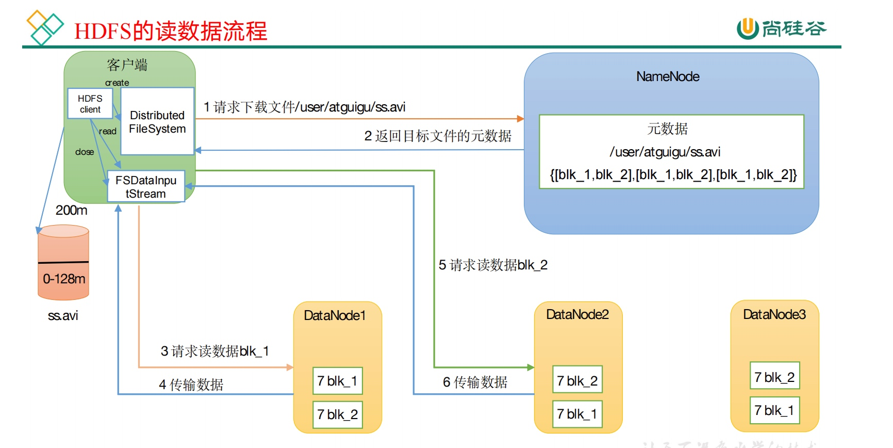
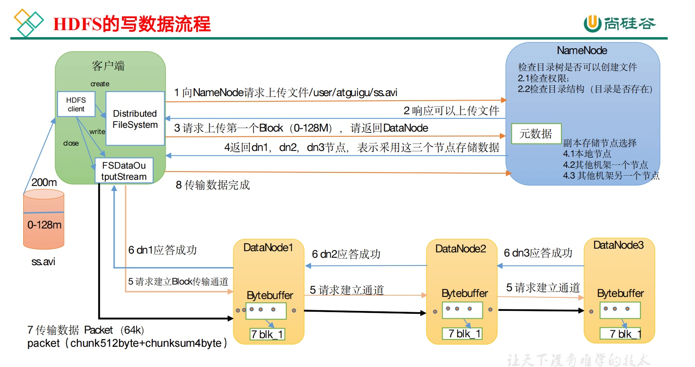
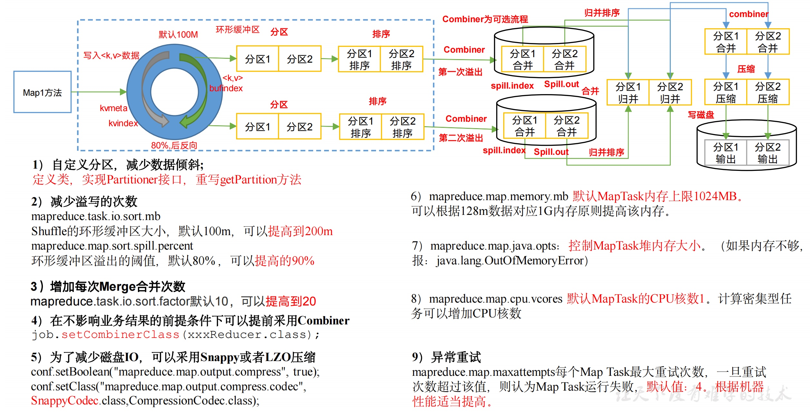
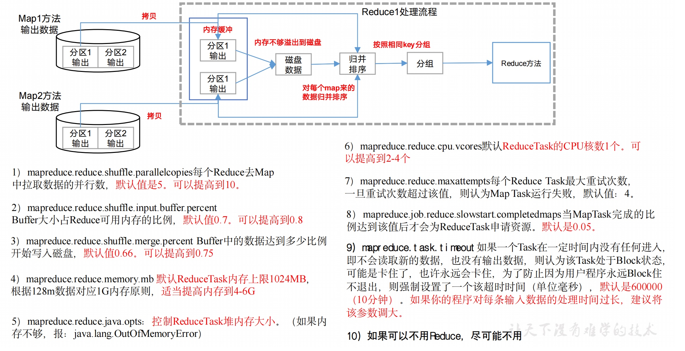
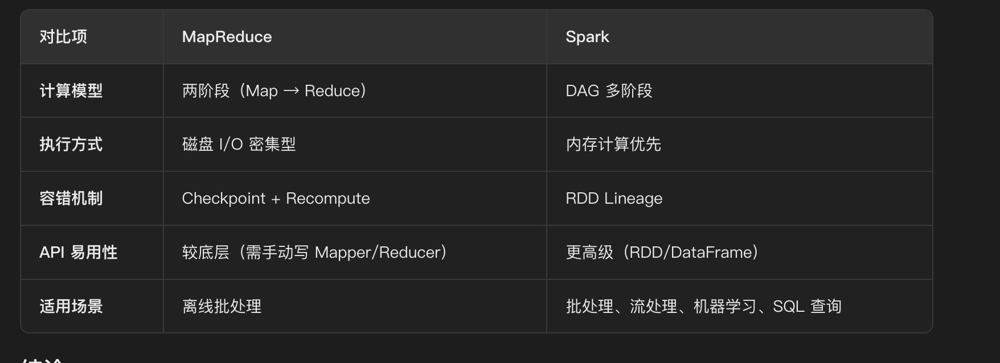
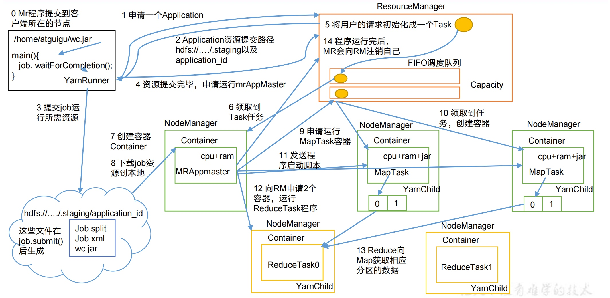
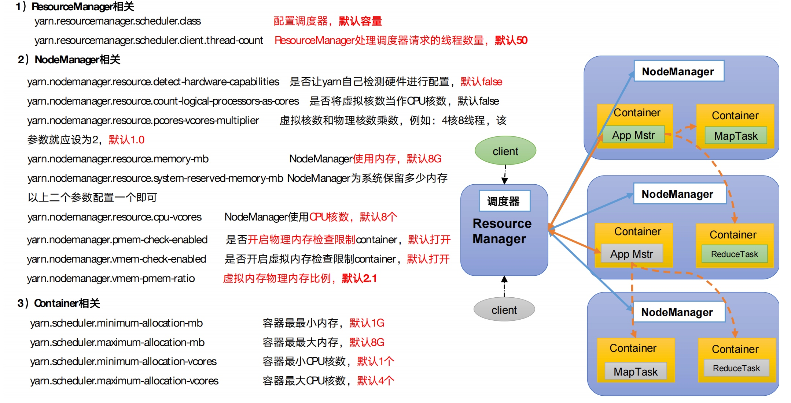

# Hadoop
- [Hadoop](#hadoop)
  - [介绍一下Hadoop的文件系统（**HDFS特点**）](#介绍一下hadoop的文件系统（-hdfs特点）)
  - [HDFS和Mysql的使用场景](#hdfs和mysql的使用场景)
- [**HDFS - 分布式存储，特点：一次写入，多次读取**](#hdfs分布式存储，特点：一次写入，多次读取)
  - [**原理**：](#原理：)
  - [**HDFS架构**](#hdfs架构)
  - [HDFS的读写流程](#hdfs的读写流程)
    - [**读流程**](#读流程)
    - [**写流程**](#写流程)
  - [**HDFS 写入流程时候，某台 dataNode 挂掉如何运行？**](#hdfs写入流程时候，某台-datanode挂掉如何运行？)
  - [NameNode在启动的时候，会做哪些操作](#namenode在启动的时候，会做哪些操作)
  - [**HDFS中的数据倾斜**](#hdfs中的数据倾斜)
  - [**常用HDFS命令**](#常用hdfs命令)
  - [**HDFS小文件**](#hdfs小文件)
    - [小文件合并时如何保证数据一致性？如果合并过程中集群宕机怎么办？](#小文件合并时如何保证数据一致性？如果合并过程中集群宕机怎么办？)
  - [HDFS配置信息](#hdfs配置信息)
- [**MapReduce - 分布式计算**](#mapreduce分布式计算)
  - [**执行过程/与原理**](#执行过程与原理)
  - [**优化**](#优化)
  - [mapReduce一定要有shuffle阶段吗](#mapreduce一定要有shuffle阶段吗)
  - [**MR的shuffle过程？有几次排序，分别对应哪些算法**？](#mr的shuffle过程？有几次排序，分别对应哪些算法？)
    - [这些排序可以避免吗](#这些排序可以避免吗)
  - [**MapReduce中的数据倾斜**](#mapreduce中的数据倾斜)
  - [mapreduce 怎么对数据进行切片](#mapreduce怎么对数据进行切片)
  - [select...from t1 join t2 group by... 这个SQL执行，要运行几个MR](#select-from-t1-join-t2-group-by这个-sql执行，要运行几个mr)
  - [Map JOIN 和 JOIN区别](#map-join和-join区别)
  - [**Spark 和 MapReduce有什么区别**](#spark和-mapreduce有什么区别)
- [Yarn - 资源管理器](#yarn资源管理器)
  - [工作机制](#工作机制)
  - [Yarn工作流程](#yarn工作流程)
  - [核心组件](#核心组件)
  - [核心参数](#核心参数)
  - [调度器](#调度器)
    - [生产环境下怎么选择？](#生产环境下怎么选择？)
    - [在生产环境怎么创建队列](#在生产环境怎么创建队列)
    - [创建多队列的好处](#创建多队列的好处)
- [案例](#案例)
  - [给你200G数据，Hadoop怎么实现分布式存储](#给你200g数据，hadoop怎么实现分布式存储)
  - [10亿个文件在内存中如何快速读取](#10亿个文件在内存中如何快速读取)

**Hadoop思想和原理：“分而治之”**

## 介绍一下Hadoop的文件系统（**HDFS特点**）
1、高容错性
* ​​数据冗余存储​​：默认每个数据块存储3个副本(可配置)
* ​​自动故障恢复​​：当DataNode宕机时，NameNode会自动从其他副本恢复数据
* 机架感知​​：优先将副本存储在不同机架的节点上，提高容灾能力

2. 高吞吐量(High Throughput)
* 流式数据访问​​：设计用于一次写入多次读取的场景
* 顺序读写优化​​：适合批量数据处理而非随机访问
* ​​大文件处理​​：优化大文件(GB/TB级)的存储和访问

3. 可扩展性(Scalability)
* ​​PB级支持​​：可轻松管理PB级别的数据量
* ​​分布式架构​​：无单点瓶颈
* 水平扩展​​：可通过增加DataNode线性扩展存储容量

## HDFS和Mysql的使用场景
**HDFS 优势**：
* 在读写方面：一次写入，多次读取，适合批量数据写入和流式读取。
* 写入时，数据块被并行传输到多个节点（默认 3 个副本），来保证我们的吞吐量，
* 读取时可以从多个节点并行读取不同数据块，支持 TB 级数据的快速扫描。

**Mysql 的局限**：
* 单表存储容量通常在数 10GB 到数 TB 级别，受限于单节点磁盘和性能。虽然可以通过分库分表进行拓展，抛开复杂度高不说，其实它的本质上仍然是集中式存储机构的一个延伸，难以支撑高效 PB 级数据存储，还可能引入数据一致性问题。

# **HDFS - 分布式存储，特点：一次写入，多次读取**
## **原理**：
* 将大文件（如 1GB 以上）分割成固定大小的 “块”（默认 128MB），每个块在集群中存储多个副本（默认 3 个），分布在不同节点上。
* 例如：一个 300MB 的文件会被分成 3 个块（128MB+128MB+44MB），每个块存储 3 个副本，分散在不同服务器。

## **HDFS架构**
* NameNode（主节点）：存储文件的元数据，文件名、文件目录结构、文件属性（生成时间、副本数、文件权限），以及每个文件的块列表和块所在的DateNode等
* DataNode（数据节点）：存储文件块(Block)的实际数据、定期向NameNode发送心跳报告状态、定期报告存储的块列表、处理客户端的读写请求
* Secondary NameNode（辅助节点）：用来监控HDFS状态的辅助后台程序，每隔一段时间获取HDFS元数据的快照
* ResourceManager，负责整个系统的资源管理和作业调度
* NodeManager，运行在集群的每一个节点上，负责监控节点上的资源情况，并汇报给ResourceManager，管理用户任务的生命周期

**Secondary NameNode是HA的吗？**
SecondaryNameNode（SNN）不是 HDFS 的高可用架构，它的核心作用是辅助 NameNode 做元数据的快照备份与日志合并，无法替代 NameNode 提供服务，NameNode 宕机后 SNN 不能直接接管，集群会彻底不可用。

## HDFS的读写流程
### **读流程**
* 读流程：
    * 客户端向NameNode请求访问某个文件的数据
    * NameNode向客户端返回目标文件的元数据
    * 客户端向DataNode请求数据，请求建立输入流，传输数据

### **写流程**
1、客户端请求写入文件
客户端通过FileSystem.create()方法向 NameNode 发起写文件请求（如/user/data/log.txt），并指定文件副本数（如默认 3）。

* NameNode 校验：
  * 检查文件是否已存在（避免覆盖）；
  * 检查客户端是否有写入权限；
  * 确认集群有足够空间存储文件及副本。
* 校验通过后，NameNode 返回 “允许写入” 的响应。

2、客户端切分数据为块（Block）
客户端将待写入数据按 HDFS 块大小（默认 128MB）切分，每块会生成唯一标识（Block ID）。 

3、NameNode 分配 DataNode 存储节点
客户端向 NameNode 请求分配存储第一块数据的 DataNode 节点，NameNode 基于 “机架感知” 策略选择 3 个 DataNode，并返回节点列表。

4、客户端与 DataNode 建立流水线（Pipeline）
客户端与第一个 DataNode（dn1）建立 TCP 连接，然后 dn1 与第二个 DataNode（dn2）建立连接，dn2 再与第三个 DataNode（dn3）建立连接，形成 “客户端→dn1→dn2→dn3” 的数据传输流水线。

* 连接建立后，客户端会收到 DataNode 返回的 “准备就绪” 确认。

5、客户端向流水线写入数据
客户端将第一块数据按 “数据包（Packet，默认 64KB）” 拆分，通过流水线依次传输：

* 客户端先将数据包发送给 dn1；
* dn1 接收后，先写入本地缓存，再转发给 dn2；
* dn2 接收后，写入本地缓存，再转发给 dn3；
* dn3 接收后，写入本地缓存。
* 每个 DataNode 接收数据包后，会向客户端发送 “确认包（ACK）”，确保数据传输无误。

6、数据持久化到磁盘
当一个块的所有数据包传输完成后，DataNode 将缓存中的数据刷盘到本地磁盘，生成完整数据块。

7、重复与收尾
* 第一块写入完成后，客户端向 NameNode 汇报 “块 1 已写入 dn1、dn2、dn3”，NameNode 更新元数据；
* 客户端重复步骤 3~6，写入后续块（直到所有块写完）；
* 所有块写入完成后，客户端调用close()方法，NameNode 标记文件为 “已完成”，写入流程结束。

## **HDFS 写入流程时候，某台 dataNode 挂掉如何运行？**
“HDFS 在写入过程中遇到 DataNode 挂掉，主要依靠**客户端的流水线恢复机制**和**NameNode 的后台副本管理**来保证数据不丢失。具体流程如下：

1. **感知故障：**
   客户端在向 DataNode 发送数据包时，如果某个节点挂掉（超时或连接重置），客户端的 `DFSOutputStream` 会立刻感知到这个异常。

2. **客户端本地恢复（核心）（客户端在写入时，发现 DataNode 挂了，它是如何恢复写入流程的？（考察 Pipeline Recovery））：**
   - **切断连接：** 客户端会立即关闭当前的 pipeline。
   - **数据回退：** 客户端会将 数据队列（Data Queue） 中所有未收到 ack 的数据包，以及 确认队列（Ack Queue） 中未被 NameNode 确认的数据包，重新放入数据队列的头部，准备重发。
   - **重建 Pipeline：** 客户端会向 NameNode 申请新的 DataNode 列表（或者复用剩下的健康节点），重新建立 pipeline，继续传输数据。

3. **处理脏数据：（挂掉的那个节点上的数据怎么办？（考察 Block Recovery））**
   挂掉的那个 DataNode 上可能已经写入了一部分数据，但这些数据是不完整的（因为后续的包没发过来）。当该节点恢复后，NameNode 会发现这些块的状态是无效的，会指令该节点删除这些不完整的副本，重新复制。

4. **NameNode 后台补齐：（NameNode 是怎么知道 DataNode 挂掉的？ - 考察 心跳机制）**
   虽然客户端已经通过新的 pipeline 继续写了，但挂掉的节点导致副本数暂时不足。NameNode 会通过心跳机制发现该节点死亡，将其移出可用节点列表，并异步调度其他 DataNode 来复制该块，直到副本数达到配置要求。

## NameNode在启动的时候，会做哪些操作
1、首先是元数据的加载和恢复。NameNode 会先从磁盘读取最新的 FsImage 文件，这是元数据的一个快照，包含了文件系统的目录结构、文件与块的映射。然后它会读取 EditsLog 编辑日志，把从 FsImage 生成后所有的元数据操作（比如创建文件、删除目录这些）应用到内存里，这样就能恢复到最新的元数据状态。

2、接下来是元数据的一致性检查。加载完成后，NameNode 会校验内存中的元数据是否合法，比如检查块的副本数是否符合配置，块和 DataNode 的映射有没有问题，确保数据结构是完整的。

3、然后会进入安全模式。这时候 NameNode 只允许读操作，不接受写请求。它会等待所有 DataNode 发送心跳和块报告，通过块报告统计每个数据块的实际副本数量。当足够多的块满足了最小副本数要求，就会自动退出安全模式，开始正常提供服务。

## **HDFS中的数据倾斜**
HDFS本身不直接处理计算，但存储不均会影响计算性能：
- **存储不均衡**：某些DataNode存储的数据量远超其他节点
- **小文件问题**：大量小文件占用NameNode内存

**解决方案**：
- **HDFS Balancer**：平衡各节点存储
- **合并小文件**：使用HAR、SequenceFile等格式
- **合理规划存储策略**：按业务维度分区存储

## **常用HDFS命令**
集群中一般有权限问题，将本地文件上传到堡垒机/tmp/目录下
**1.将本地文件系统中的文件上传到 HDFS**
hadoop fs -put /data/users/hujianwei/rengong_collect_app_data.csv /user/hdp-ge-wfgg/data-lake/ad_data/

**2.下载文件到本地**
hdfs -getmerge /home/hdp-ge-wfgg/data/ad/wechat/result/beijing_2025-07_1754462797356 /tmp/merged_wechat_result.txt

**3.查看 HDFS（Hadoop 分布式文件系统）指定路径下所有文件的内容**
hadoop fs -text /user/hdp-ge-wfgg/data-lake/ad_data/beijing/20250805/* 

**4.列出 HDFS 指定路径下所有文件和子目录的详细信息**
hadoop fs -ls /user/hdp-ge-wfgg/data-lake/ad_data/beijing/20250805/*

**5.查看文件内容**
hdfs fs - cat path 

## **HDFS小文件**
* 产生的问题：
    * 1、NameNode内存压力过大：HDFS 中所有文件的元数据（文件名、路径、块信息等）都存储在 NameNode 的内存中。每个小文件（即使只有 1KB）也会占用一条元数据记录（约 150KB 内存）。若存在数百万甚至数千万个小文件，会耗尽 NameNode 的内存，导致其性能下降甚至崩溃，同时限制集群可存储的文件总数。
    * 2、MapReduce/Spark计算效率低：需要启动大量 Map 任务（每个小文件对应一个或多个 Map 任务），任务调度和初始化开销远大于实际计算时间。
    * 3、HDFS读写性能下降：读取大量小文件时，需要频繁切换数据节点（每个小文件可能存储在不同节点），增加网络 IO 开销和寻址时间。
    * 4、存储空间利用率低：HDFS 的块大小默认是 128MB 或 256MB，即使文件远小于块大小，也会占用整个块的元数据空间，造成存储空间浪费。
* 解决：
    * 先通过**定时合并小文件**解决存量问题，再通过**ORC 格式 + 文件滚动写入**解决增量问题
    * 引入：Hudi：支持自动合并小文件（Compaction 机制），同时支持增量更新、ACID 事务，适配实时 + 离线场景
复盘：
* 合并文件时未考虑文件锁，导致并发执行脚本时文件损坏 → 解决：加分布式锁（ZooKeeper），确保同一目录同一时间只有一个合并任务执行。
* ORC 格式转换后，Hive 查询时字段类型不兼容 → 解决：提前做数据类型校验，编写数据迁移工具，批量修正字段类型。
* 重来一次的优化：提前在数据采集层做文件合并，而非等到数仓层再处理，减少数据流转中的小文件问题。

### 小文件合并时如何保证数据一致性？如果合并过程中集群宕机怎么办？
数据一致性保障：
1. 先写后删：合并文件时，先将小文件合并到临时目录（如 `/tmp/merge`），确认合并成功后，再删除原小文件，最后将合并后的文件移动到目标目录；
2. 校验机制：合并完成后，校验合并文件的 MD5 值与原小文件 MD5 总和是否一致，确保数据无丢失 / 篡改；
3. 日志记录：记录每一次合并的文件列表、执行时间、状态，便于追溯。

集群宕机应对：
1. 幂等设计：合并脚本做幂等处理，即使宕机后重新执行，也不会重复合并 / 删除文件；
2. 断点续传：Spark 合并小文件时，开启 Checkpoint，宕机后从断点继续执行，无需重新合并所有文件；
3. 备份机制：合并前自动备份原小文件到备份目录，若合并失败，可从备份目录恢复。

## HDFS配置信息
* 10 个 DataNode 节点；
* 每个节点有 10 块 10TB 硬盘；
* 副本系数为 3。
则该 HDFS 集群的可用容量约为 1000TB ÷ 3 ≈ 333TB（实际会略低，需扣除系统预留空间）。

# **MapReduce - 分布式计算**

## **执行过程/与原理**
主要分为3个阶段，map阶段、shuffle阶段、reduce阶段
1. map阶段：读取数据，InputFormat会将数据切成多个文件，每个文件由1个map来处理，map将数据按照指定逻辑处理成<key,value>格式
2. shuffle阶段：将map输出的结果按照key分组，相同的key会被分到一起，并按照key排序，输出给reduce
3. reduce阶段：reduce收到数据后，按照指定聚类逻辑处理数据，输出结果

## **优化**

## mapReduce一定要有shuffle阶段吗
Shuffle不是MR必须的阶段：当只有 Map 任务（无 Reduce），或无需跨节点数据重组时，Shuffle 会被跳过，比如：
* 日志清洗（仅过滤、格式化数据，无需聚合）、数据格式转换（如 JSON 转 Parquet）。
Shuffle 的核心作用是数据重组：只有当 Reduce 阶段需要跨节点聚合 Map 输出时，Shuffle 才是必需的，比如：
* Map输出KV，需要通过Shuffle将相同Key的KV汇总到同一个Reduce，计算总数
* 按Key分组总计：需要通过Shuffle将同一平台类型的广告数据集汇总到一个Reduce

## **MR的shuffle过程？有几次排序，分别对应哪些算法**？
一共2次
第一次排序：Map 端排序（Map-side Sort）​​
* ​​发生阶段​​
在 ​​Map Task​​ 执行期间，当数据写入内存缓冲区（环形缓冲区）并触发溢写（Spill）到磁盘时，会对数据进行排序。

* ​​排序目的​​
    * 按分区（Partition）排序​​：确保相同 key 的数据进入同一个分区，便于后续 Reduce Task 处理。
    * ​​按 key 排序​​：同一分区内的数据按键（key）升序排列，为后续的 Reduce 阶段提供有序输入。
* ​​排序算法
* 对内存缓冲区中的数据按 key 进行**快速排序**（默认实现）。
* 如果启用了 ​​Combiner​​，则先对数据进行局部聚合（类似 Reduce 的逻辑），再排序。

第二次排序：Reduce 端排序（Reduce-side Sort）​​
* ​​发生阶段​​
    * 在 ​​Reduce Task​​ 执行期间，当从多个 Map Task 拉取（Fetch）数据并合并（Merge）时，会对所有分区的数据进行全局排序。
* ​​排序目的​​
    * ​​全局按键排序​​：确保所有 key 按升序排列，便于 Reduce 函数按顺序处理相同 key 的数据。
* ​​排序算法​​
    * 对多个溢写文件（Map 端生成的有序文件）进行**多路归并排序**。
    * 如果启用了 ​​Combiner​​，则先对每个 Map Task 的数据进行局部聚合，再归并排序。

### ​​​这些排序可以避免吗
通常无法完全避免
1. Map 端排序（按分区 + Key 排序）​​
​​不能完全避免​​，因为：
* ​​分区排序​​ 是 Reduce Task 正确接收数据的前提（相同 key 必须进入同一分区）。
* ​​Key 排序​​ 是 Reduce 阶段按顺序处理数据的必要条件（如 GROUP BY、JOIN 等操作依赖有序输入）。
​​但可以优化​​：
* ​​减少排序数据量​​：通过 Combiner 提前聚合数据，降低溢写到磁盘的文件大小。
* ​​调整内存缓冲区​​：增大 mapreduce.map.sort.spill.percent（默认 80%），减少溢写次数。
2. Reduce 端排序（全局 Key 排序）​​
​​取决于业务需求​​：
（）​​如果业务需要全局有序结果​​（如 ORDER BY），则必须排序。
（2）如果仅需分组（GROUP BY）而不关心全局顺序​​，可以通过以下方式优化：
* ​​禁用全局排序​​（需自定义分区器和分组逻辑）。
* ​​使用 ReduceSinkOperator 的 ORDER BY 标志位​​（Hive 中可配置）。

## **MapReduce中的数据倾斜**
在MapReduce框架中，数据倾斜主要表现为：
- **Map阶段倾斜**：某些Map Task处理的数据量远大于其他Task
- **Reduce阶段倾斜**：某些Reduce Task接收的数据量远大于其他Task

**常见原因**：

- **Key分布不均匀**：如按用户ID分组时，少数热门用户的数据量远超其他用户
- **分区策略不合理**：默认Hash分区可能导致数据分布不均
- **输入数据本身不均匀**：如日志文件中某些时间段的数据量特别大

**解决方案**：

- **自定义分区器**：实现更合理的分区逻辑
- **两阶段聚合**：先局部聚合再全局聚合(Map端Combiner)
- **加盐/去盐技术**：对倾斜Key添加随机前缀分散数据
- **采样分析**：先采样分析数据分布，针对性优化

## mapreduce 怎么对数据进行切片
默认由 InputFormat 自动切片，可通过配置参数调整大小或自定义`InputFormat`
应用场景​​：大文件处理、小文件合并
​​
## select...from t1 join t2 group by... 这个SQL执行，要运行几个MR
两个MR作业：
1、JOIN阶段：完成表t1和t2的连接操作，生成中间结果。
（1）Map阶段：读取t1和t2的数据，为每条记录标记来源，并根据连接键生成分区键（Partition Key）
（2）Shuffle阶段：将相同连接键的数据发送到同一个Reducer
（3）Reduce阶段：对同一连接键的t1和t2记录进行匹配，生成JOIN后的中间结果

2、GROUP BY阶段：对JOIN后的中间结果按指定字段分组聚合。
（1）Map阶段：读取JOIN的中间结果，按GROUP BY键生成分区键，并对每组数组预聚合
（2）Shuffle阶段：将相同Group BY键的数据发送到同一个Reducer
（3）Reduce阶段：对每组数据执行最终聚合，输出结果

**是否可能合并为一个MR作业**
如果JOIN和GROUP BY键相同，且数据分布允许（数据无倾斜），可能通过单次Shuffle同时完成JOIN和GROUP BY

## Map JOIN 和 JOIN区别
Map JOIN核心逻辑：无Shuffle
将小表全量加载到每个Mapper的内存中，使大表的每条记录在Map阶段直接与内存中的小表数据完成JOIN，无需跨节点传输数据（即无需Shuffle）

**为什么Map Join不需要Shuffle？**
Shuffle本质是：跨界点的数据重分布（基于分区键将数据发送到目标节点），而Map Join的核心优化点是**避免这种跨节点的数据移动**

**如果是Map JOIN执行select...from t1 join t2 group by...**
* 若JOIN结果极小（可内存/本地处理）：仅需1个MR作业（Map Join的Map阶段直接完成GROUP BY）。
* 若JOIN结果较大（超过内存或需分布式处理）：需2个MR作业（第1个完成Map Join，第2个完成GROUP BY）。

## **Spark 和 MapReduce有什么区别**
简单易懂版本-为什么需要使用hive on spark
1. 存储计算方式：Mapreduce基于磁盘，Spark基于内存，后者速度更快。
2. 并发模式：Spark用多线程，低延迟，并且降低开销；Mapreduce用多进程，资源隔离好但成本高。
3. 排序特性：Mapreduce的reduce阶段必定排序，Spark则按需决定。
4. 内存管理：Spark有灵活的内存管理策略，能高效利用资源。
5. 稳定性问题：Spark的execute过程容易中断，影响作业进度 。

MapReduce​​：适合简单的离线批处理，但性能较低，不适合迭代计算。
​​Spark​​：更高效、更灵活，适用于批处理、流处理、机器学习等多种场景。

# Yarn - 资源管理器
* 作用：负责集群资源（CPU、内存）的统一调度和任务管理，协调 MapReduce 等计算框架的资源分配，提高集群利用率。
* 架构：包含 ResourceManager（主节点，全局资源调度）和 NodeManager（从节点，单节点资源管理）。

## 工作机制

## Yarn工作流程
整个流程可分为 “任务提交→资源申请→任务执行→完成退出” 四大阶段，共 8 个关键步骤：

1、客户端提交任务

* 客户端（如hadoop jar命令）将任务（含 jar 包、配置文件）提交给 ResourceManager，并请求启动 ApplicationMaster。

2、ResourceManager 分配第一个容器，启动 ApplicationMaster

* ResourceManager 接收请求后，在某个 NodeManager 上分配一个 “启动容器”（仅用于启动 AM，资源较小）；
* NodeManager 在该容器中启动 ApplicationMaster 进程（如 MapReduce 的 MRAppMaster）。

3、ApplicationMaster 注册并申请资源

* ApplicationMaster 启动后，向 ResourceManager 注册（汇报 “我是 XX 任务的 AM，负责管理该任务”）；
* AM 根据任务需求（如 MapReduce 的 Map 数、Reduce 数），计算所需资源（如 “10 个 Map 容器，每个 1 核 2GB；2 个 Reduce 容器，每个 2 核 4GB”），并向 ResourceManager 发送资源申请。

4、ResourceManager 调度并分配资源

* ResourceManager 的调度器（Scheduler）根据集群资源情况（如节点空闲资源、队列配额），为 AM 分配符合要求的容器（指定节点、CPU、内存），并将分配结果返回给 AM。

5、ApplicationMaster 启动任务容器

* AM 收到资源分配结果后，与目标节点的 NodeManager 通信，要求在分配的容器中启动具体任务（如 MapTask、ReduceTask）；
* NodeManager 在容器中启动任务进程，并监控其运行状态。

6、任务执行与状态汇报

* 任务进程（如 MapTask）在容器中执行，定期向 AM 汇报进度（如 “已处理 30% 数据”）；
* AM 汇总所有任务进度，向 ResourceManager 汇报整体状态。

7、任务完成

* 所有任务执行完毕后，ApplicationMaster 向 ResourceManager 汇报 “任务完成”，并释放所有容器资源。

8、清理与退出

* ResourceManager 通知 NodeManager 销毁相关容器；
* ApplicationMaster 退出，客户端收到 “任务完成” 通知，流程结束。

## 核心组件

1、ResourceManager（RM）：主节点，全局资源管理器

* 集群唯一的 “总调度者”，负责：
  * 管理集群所有资源（CPU 核数、内存大小）；
  * 接收客户端提交的任务，分配资源并调度执行；
  * 监控 NodeManager 的健康状态。

2、NodeManager（NM）：从节点，单节点资源管理器

* 运行在集群的每个节点上，负责：
  * 管理本节点的资源（如汇报 “该节点有 8 核 CPU、32GB 内存”）；
  * 启动和监控容器（Container）—— 容器是 YARN 中资源分配的最小单位（如一个容器包含 1 核 CPU、2GB 内存）；
  * 向 ResourceManager 汇报节点状态和容器运行情况。 、

3、ApplicationMaster（AM）：单任务的 “管理者”

* 每个提交到 YARN 的任务（如一个 Spark 作业、Flink 任务）会对应一个 ApplicationMaster，负责：
  * 向 ResourceManager 申请任务所需的资源（如 “需要 10 个容器，每个 1 核 2GB”）；
  * 与 NodeManager 通信，启动 / 停止容器中的任务进程（如 MapTask、ReduceTask）；
  * 监控任务执行进度，处理失败（如容器崩溃后重新申请资源）。

4、Container：资源分配的最小单位

* 封装了节点上的 CPU、内存等资源，是任务运行的 “独立环境”；
* 一个容器只能运行一个任务实例（如一个 MapTask、一个 Spark Executor）。

## 核心参数

## 调度器
YARN 的资源调度核心是**调度器**，负责决定 “如何将集群资源分配给不同任务”，常用调度策略有 3 种：
1、FIFO Scheduler（先进先出调度器）
* 按任务提交顺序排队，先提交的任务优先获取资源；
* 优点：简单；缺点：大任务可能阻塞小任务，生产环境不会用。

2、Capacity Scheduler（容量调度器）
* 为不同队列（如 “生产队列”“测试队列”）分配固定资源比例（如生产队列占 70%，测试队列占 30%）；
* 队列内按 FIFO 调度，空闲资源可临时借给其他队列（如生产队列空闲时，测试队列可使用其资源）；
* 适用场景：多团队共享集群（如公司内多个业务线共用一个 Hadoop 集群）。

3、Fair Scheduler（公平调度器）
* 不预先分配资源比例，而是保证所有任务 “最终获得公平的资源”（如两个任务同时运行，各占 50% 资源）；
* 支持 “优先级” 和 “资源抢占”（低优先级任务可被高优先级任务抢占资源）；
* 适用场景：任务优先级动态变化的场景（如实时任务优先于离线任务）。

### 生产环境下怎么选择？
* 大厂：如果对并发度要求比较高，选择公平，要求服务器性能必须OK
* 中小厂：集群服务器资源不太充裕选择容量

### 在生产环境怎么创建队列
* 调度器默认就是1个default队列，不能满足生产要求
* 按照业务部门：业务部门1、业务部门2
* 按照业务模块：登陆注册、购物车、下单

### 创建多队列的好处
* 担心组内成员不小心，写递归死循环代码，把所有资源全部耗尽
* 实现任务的降级使用，特殊时期保证重要任务的队列资源充足
* 业务部门1（重要）--> 业务部门2（比较重要）--> 业务部门3（一般）

# 案例
## 给你200G数据，Hadoop怎么实现分布式存储
**核心思想**：通过将大任务拆解为小任务并并行执行，实现高效的分布式计算。

**一、HDFS分布式存储**
1、数据切块：HDFS 默认将文件分割为 128MB 的 “块”（可配置），200G 数据会被分成约 1600 个块（200*1024/128 ≈ 1600）。
2、多副本存储：每个块默认存储 3 个副本，分布在集群不同节点（避免单点故障）。
3、元数据管理：namenode 记录每个块的位置信息，确保计算时能找到数据所在节点。

**二、MapReduce分布式计算**
MapReduce 将计算任务拆分为Map（映射）和Reduce（归约）两个阶段
1、Map阶段：并行处理本地数据
（1）任务拆分：YARN 的 ResourceManager会根据数据块数量，启动对应数量的 Map 任务（约 1600 个），每个 Map 任务处理 1 个数据块。
（2）本地化计算：每个 Map 任务被分配到数据块所在的节点，直接读取本地存储的数据（避免跨节点传输 200G 原始数据）。
（3）中间结果输出：Map 任务对本地数据进行处理（如过滤、转换），输出以键值对（Key-Value）形式存在的中间结果，临时存储在节点本地磁盘。

2、Shuffle阶段：数据聚合与分发
（1）分区与排序：Map 任务完成后，中间结果会按 Key 分区（确保相同 Key 的数据进入同一个 Reduce 任务），并在每个分区内排序。
（2）数据拉取：Reduce 任务启动后，会从所有 Map 节点拉取属于自己分区的中间结果（此时传输的是少量中间数据，而非 200G 原始数据）。

3、Reduce阶段：汇总计算最终结果
（1）合并计算：Reduce 任务对拉取的中间结果按 Key 聚合。
（2）输出结果：计算完成后，结果写入 HDFS。

**核心优势**
1、并行计算：1600 个 Map 任务同时运行，200G 数据被 “分片” 并行处理，效率远高于单节点。
2、数据本地化：计算逻辑移动到数据所在节点，避免 200G 数据在网络中传输，减少 IO 开销。
3、容错性：若某节点的 Map/Reduce 任务失败，Hadoop 会自动在其他节点重启任务（基于 HDFS 的副本数据），不影响整体进度。

## 10亿个文件在内存中如何快速读取
基于 **“分治思想 + 内存缓存分级 + 批量并行 IO + 全局索引”**，先对 10 亿文件做统一治理（合并 / 分区），再用内存缓存高频访问文件，通过多线程 / 多进程异步批量读取，结合全局索引快速定位文件位置，避免全量加载，同时利用大数据分布式框架实现集群化内存 + 磁盘协同读取，最大化提升效率。
