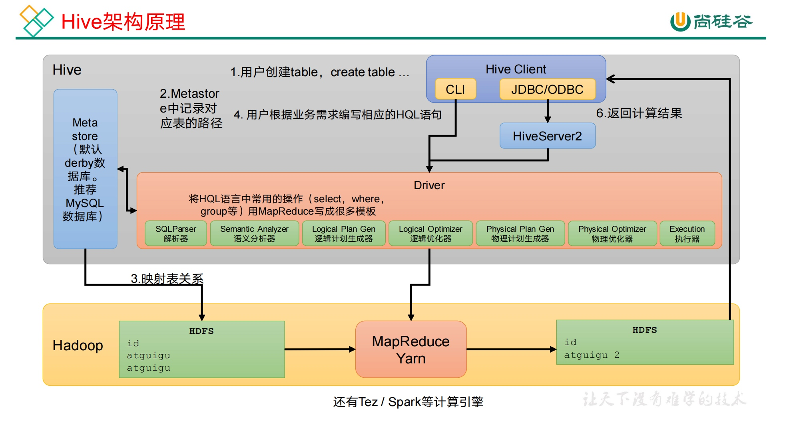
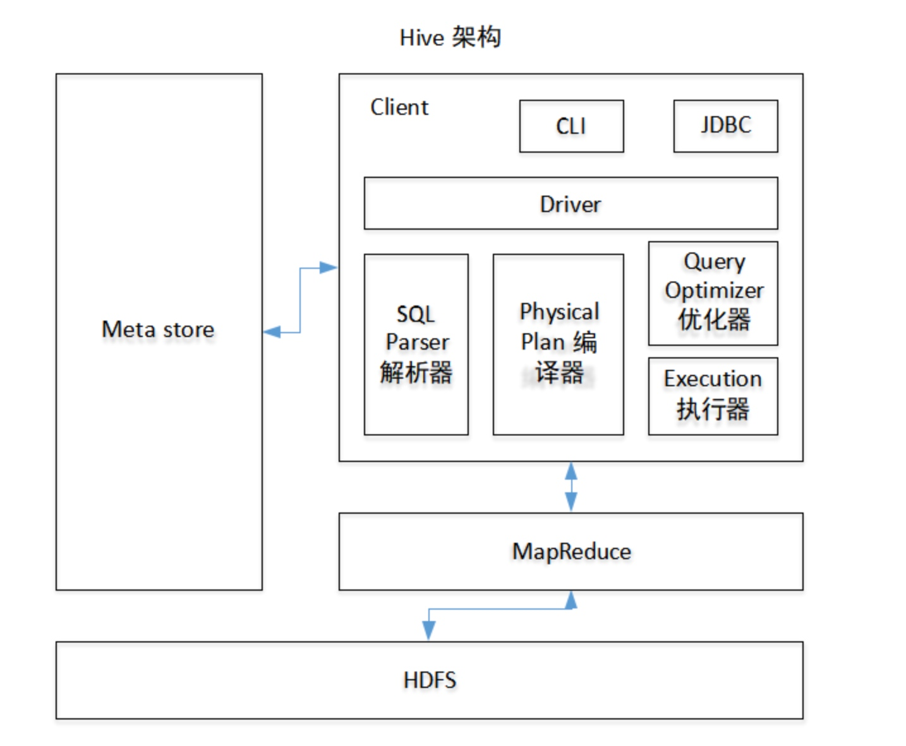
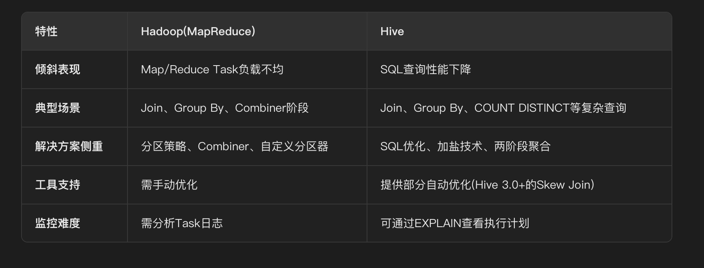
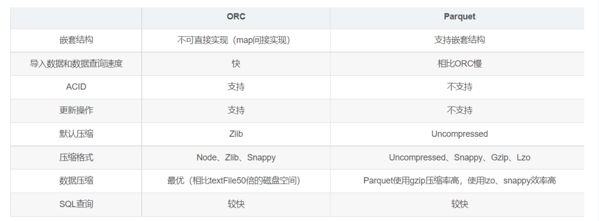
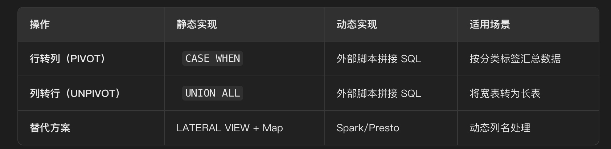
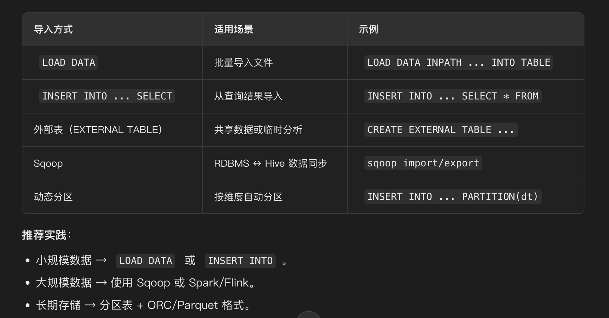

# Hive
- [简历内容](#简历内容)
- [基础](#基础)
  - [Hive架构原理](#hive架构原理)
  - [MR和Spark引擎对比](#mr和spark引擎对比)
  - [hive的**框架**是怎么样的？](#hive的框架是怎么样的？)
  - [**元数据**](#元数据)
  - [hive与Mysql异同](#hive与mysql异同)
  - [**Hive分区分桶**](#hive分区分桶)
  - [**Hive内部表和外部表的区别**](#hive内部表和外部表的区别)
  - [**hive的排序关键字4个By（cluster by、sort by、distribute by、order by）**](#hive的排序关键字4个by（cluster-by、sort-by、distribute-by、order-by）)
  - [小文件问题及解决方案](#小文件问题及解决方案)
  - [SQL优化](#sql优化)
- [**数据倾斜**](#数据倾斜)
  - [**Hive解决数据倾斜方法**](#hive解决数据倾斜方法)
  - [Hive动态分区](#hive动态分区)
  - [分区和分桶区别](#分区和分桶区别)
  - [两个大表 join 如何优化](#两个大表join如何优化)
  - [Hive常用调优参数](#hive常用调优参数)
  - [引起Shuffle的sql操作](#引起shuffle的sql操作)
  - [**Hive分区裁剪**](#hive分区裁剪)
  - [**Hadoop和Hive数据倾斜对比**](#hadoop和hive数据倾斜对比)
- [**Hive存储格式**](#hive存储格式)
- [**Hive压缩格式**](#hive压缩格式)
  - [SNAPPY（温数据、快速查询，速度第一，存储次优）](#snappy（温数据、快速查询，速度第一，存储次优）)
  - [ZLIB（冷数据、极致缩、存储优先，性能可让步）](#zlib（冷数据、极致缩、存储优先，性能可让步）)
  - [LZ4（冷数据、兼容空间与时间，正逐步成为Hadoop生态默认选择）](#lz4（冷数据、兼容空间与时间，正逐步成为hadoop生态默认选择）)
- [**Hive SQL**](#hive-sql)
  - [**常用命令**](#常用命令)
  - [**hive sql是如何把sql语句一步一步到最后执行的/HQL转化为MR**](#hive-sql是如何把sql语句一步一步到最后执行的hql转化为mr)
  - [hive  sql任务常用**参数调优**做过什么？](#hive-sql任务常用参数调优做过什么？)
  - [HQL的任务执行顺序](#hql的任务执行顺序)
  - [连接与查询inner join和left join区别](#连接与查询inner-join和left-join区别)
  - [Hive优化](#hive优化)
  - [HiveSql行转列(Pivot)](#hivesql行转列-pivot)
  - [HiveSql列转行（Unpivot）](#hivesql列转行（unpivot）)
  - [进行一个类型的**函数转换**，怎么做？](#进行一个类型的函数转换，怎么做？)
  - [在create table的时候，Hive的**数据导入**方式](#在create-table的时候，hive的数据导入方式)
- [自定义函数](#自定义函数)
  - [**Hive有自带的解析Json函数，为什么要自定义UDF/UDTF？？**](#hive有自带的解析json函数，为什么要自定义udfudtf？？)
  - [**UDF、UDTF、UDAF区别**](#udf、udtf、udaf区别)
  - [用UDF、UDTF函数、处理过什么问题，及自定义步骤](#用udf、udtf函数、处理过什么问题，及自定义步骤)
- [系统函数](#系统函数)
  - [**窗口函数**](#窗口函数)
  - [Union与Union all区别](#union与union-all区别)


# 简历内容
**掌握 Hive 的工作原理，数据仓库的建立，以及使用 HQL 完成对数据主题抽取、多维分析、调优**  


# 基础
## Hive架构原理


1、用户建表：用户通过 Hive Client 执行 create table 语句。
2、元数据记录：MetaStore 会在自己的数据库中记录这张表的元数据，包括它在 HDFS 上的存储路径。
3、映射表关系：MetaStore 把表的元数据和 HDFS 上的实际存储路径关联起来。
4、编写 HQL：用户根据业务需求，编写 HQL 查询语句（比如 select、group by）。
5、HQL 解析与执行：Driver 接收 HQL 后，经过解析、优化，生成对应的 MapReduce（或其他引擎）任务，并提交给 YARN 去执行。
6、返回结果：计算完成后，结果会从 HDFS 中读取，再通过 Hive Client 返回给用户。


## MR和Spark引擎对比
Mr引擎：多job串联，基于磁盘，落盘的地方比较多。虽然慢，但一定能跑出结果。一般处理，周、月、年指标。
Spark引擎：虽然在Shuffle过程中也落盘，但是并不是所有算子都需要Shuffle，尤其是多算子过程，中间过程不落盘  DAG有向无环图。 兼顾了可靠性和效率。一般处理天指标。


## hive的**框架**是怎么样的？ 
**架构原理/Hive产生原因**
Hive核心设计目标是将 SQL 查询语句转换为MapReduce计算任务执行，从而简化大数据分析。
 
1）用户接口：Client
CLI（command-line interface）、JDBC/ODBC(jdbc 访问 hive)、WEBUI（浏览器访问 hive）

2）元数据：Metastore
元数据包括：表名、表所属的数据库（默认是 default）、表的拥有者、列/分区字段、表的类型（是否是外部表）、表的数据所在目录等；
默认存储在自带的 derby 数据库中，推荐使用 MySQL 存储 Metastore

3）Hadoop
使用 HDFS 进行存储，使用 MapReduce 进行计算。

4）驱动器：Driver

5）解析器（SQL Parser）
将 SQL 字符串转换成抽象语法树 AST，这一步一般都用第三方工具库完成，比如 antlr；
对 AST 进行语法分析，比如表是否存在、字段是否存在、SQL 语义是否有误。

6）编译器（Physical Plan）
将 AST 编译生成逻辑执行计划。

7）优化器（Query Optimizer）
对逻辑执行计划进行优化。

8）执行器（Execution）
把逻辑执行计划转换成可以运行的物理计划。对于 Hive 来说，就是 MR/Spark。


## **元数据**
元数据就是描述数据的 “说明书”，它告诉 Hive 数据存在哪里、怎么读、怎么解析。
元数据存储了 “表在哪里（路径）”、“表长什么样（字段 / 分区）”、“怎么读（格式 / 分隔符）” 以及 “有多大（统计信息）”。


## hive与Mysql异同
Hive和数据库除了拥有类似的查询语言，再无类似之处。
1、数据存储位置：Hive 存储在 HDFS 。数据库将数据保存在块设备或者本地文件系统中。
2、数据更新：Hive中不建议对数据的改写。而数据库中的数据通常是需要经常进行修改的，
3、数据规模：Hive支持很大规模的数据计算（几百G、TB级）；数据库可以支持的数据规模较小。
4、执行延迟：Hive 执行延迟较高。数据库的执行延迟较低。当然，这个是有条件的，即数据规模较小，当数据规模大到超过数据库的处理能力的时候，Hive的并行计算显然能体现出优势。

**分库分表不能解决这个问题吗？**
分库分表只能让 MySQL 勉强撑住 TB 级 的数据和高并发事务，面对 PB 级 的海量数据统计分析，它的架构设计（B + 树、事务 ACID）反而成了累赘
MySQL 存 SSD（固态） 解决了单机 I/O 瓶颈，让事务处理更快，但本质仍是单机架构，面对海量数据需分库分表且成本高；Hive 存 HDFS (HDD) 则通过分布式存储和计算，用低成本解决大数据分析问题。

**SSD和HDD区别**
* 机械硬盘 (HDD)：
    * 原理：像黑胶唱片一样，磁头要旋转找数据。
    * 痛点：随机读写（Random I/O）非常慢。
* 固态硬盘 (SSD)：
    * 原理：基于闪存颗粒，像内存一样通过电路寻址。
    * 效果：随机读写速度是 HDD 的 100 倍以上。

## **Hive分区分桶**
* 分区表：
    * 定义：通过指定分区字段来建立表，常用时间字段作为分区字段
    * 优势：在查询时指定分区字段，加快查询过程
    * 查询优化：分区可以作为查询的过滤条件，减少扫描的数据量
    * 数据管理：方便数据维护，可以按照分区删除旧数据
* 分桶表：
    * 定义：通过指定分桶字段来建表，对分桶字段进行Hash并按照桶的个数进行数据分配
    * 优势：可以加快JOIN操作，并方便进行数据抽样
    * 数据散列：通过Hash算法将数据分散到不同的桶中，使得数据分布更均匀
    * 抽样便捷：通过对桶进行抽样，加快数据分析

## **Hive内部表和外部表的区别**
删除表时：
* 内部表：元数据、原始数据，全删除
* 外部表：只删除元数据
* 应用场景：​​一般建立的内部临时表和ETL或测试表中间表都是内部表，方便清理，我们这边生产环境​​：使用 ​​外部表​​，防止误删数据，基本都是外部表（日志、备份数据）
​​
​​
## **hive的排序关键字4个By（cluster by、sort by、distribute by、order by）**
* order by：全局排序，对所有输出结果进行排序
* sort by：局部排序，只在每个reducer内部进行排序
* distribute by：类似MR中Partition，进行分区，按照指定字段进行分区，结合sort by使用，确保相同的建分配到同一个reducer
* cluster by：同时进行分区和排序（默认升序），等价与distribute by字段 + sort by该字段

在生产环境中Order By用的比较少，容易导致OOM。
在生产环境中Sort By+ Distrbute By用的多。


## 小文件问题及解决方案
**小文件如何产生**：
* 动态分区插入数据，产生大量的小文件，从而导致map数量剧增；
* reduce数量越多，小文件也越多（reduce的个数和输出文件是对应的）
* 数据源本身就包含大量的小文件

**小文件问题的影响**：
* 从Hive的角度，小文件会开启很多map，一个map开一个JVM去执行，所以这些任务的初始化，启动，就会量费大量的资源
* 在HDFS中，每个小文件对象约占用150byte，如果小文件过多，会占用大量的内容，这样NameNode内存容量严重约束了集群的扩展

**解决方案**：
* 数据源头，小文件合并
* 使用Sequencefile作为表存储格式，不要用textfile，在一定程度上可以减少小文件
* 少用动态分区，采用按照distribute by 分区
* 调整map/reduce端的参数
```shell
//每个Map最大输入大小(这个值决定了合并后文件的数量)  
set mapred.max.split.size=256000000;    
//一个节点上split的至少的大小(这个值决定了多个DataNode上的文件是否需要合并)  
set mapred.min.split.size.per.node=100000000;  
//一个交换机下split的至少的大小(这个值决定了多个交换机上的文件是否需要合并)    
set mapred.min.split.size.per.rack=100000000;  
//执行Map前进行小文件合并  
set hive.input.format=org.apache.hadoop.hive.ql.io.CombineHiveInputFormat;   

设置map输出和reduce输出进行合并的相关参数：
[java] view plain copy
//设置map端输出进行合并，默认为true  
set hive.merge.mapfiles = true  
//设置reduce端输出进行合并，默认为false  
set hive.merge.mapredfiles = true  
//设置合并文件的大小  
set hive.merge.size.per.task = 256*1000*1000  
//当输出文件的平均大小小于该值时，启动一个独立的MapReduce任务进行文件merge。  
set hive.merge.smallfiles.avgsize=16000000
```


## SQL优化
* 列裁剪：只读取需要的列
* 分区裁剪：减少不必要的分区
* 不同数据类型关联产生的数据倾斜：
* 多表用Union all优化成一个job，优点：相同表的HDFS只读取一次
* 


# **数据倾斜**
## **Hive解决数据倾斜方法**
怎么产生的数据倾斜？
1、不同类型的数据倾斜
情形：比如用户表中user_id字段为int，log表中user_id字段既有string类型也有int类型。当按照user_id进行两个表的Join操作时。

后果：处理此特殊值的reduce耗时；只有一个reduce任务默认的Hash操作会按int型的id来进行分配，这样会导致所有string类型id的记录都分配到一个Reducer中。

解决方式：把数字类型转换成字符串类型
```sql
select  from users a

left outer join logs b

on a.usr_id = cast(b.user_id as string)
```
2、控制空值分布
在生产环境经常会用大量空值数据进入到一个reduce中去，导致数据倾斜。
解决办法：
自定义分区，将为空的key转变为字符串加随机数或纯随机数，将因空值而造成倾斜的数据分不到多个Reducer。
注意：对于异常值如果不需要的话，最好是提前在where条件里过滤掉，这样可以使计算量大大减少

3、解决数据倾斜
（1）group by
注：group by 优于distinct group
解决方式：采用sum() group by的方式来替换count(distinct)完成计算。

（2）mapjoin

（3）开启数据倾斜时负载均衡

set hive.groupby.skewindata=true;

思想：就是先随机分发并处理，再按照key group by来分发处理。

操作：当选项设定为true，生成的查询计划会有两个MRJob。

第一个MRJob中，Map的输出结果集合会随机分布到Reduce中，每个Reduce做部分聚合操作，并输出结果，这样处理的结果是相同的GroupBy Key有可能被分发到不同的Reduce中，从而达到负载均衡的目的；

第二个MRJob再根据预处理的数据结果按照GroupBy Key分布到Reduce中（这个过程可以保证相同的原始GroupBy Key被分布到同一个Reduce中），最后完成最终的聚合操作。

点评：它使计算变成了两个mapreduce，先在第一个中在shuffle过程partition时随机给 key打标记，使每个key随机均匀分布到各个reduce上计算，但是这样只能完成部分计算，因为相同key没有分配到相同reduce上。

所以需要第二次的mapreduce，这次就回归正常shuffle，但是数据分布不均匀的问题在第一次mapreduce已经有了很大的改善，因此基本解决数据倾斜。因为大量计算已经在第一次mr中随机分布到各个节点完成。


## Hive动态分区
分区是hive存放数据的一种方式。将列值作为目录来存放数据，就是一个分区。这样查询时使用分区列进行过滤，只需根据列值直接扫描对应目录下的数据，不扫描其他不关心的分区，快速定位，提高查询效率。hive中支持两种类型的分区：

静态分区SP（static partition）动态分区DP（dynamic partition）

静态分区与动态分区的主要区别在于静态分区是手动指定，而动态分区是通过数据来进行判断。详细来说，静态分区的列是在编译时期，通过用户传递来决定的；

动态分区只有在SQL执行时才能决定,对分区表Insert数据时候，数据库自动会根据分区字段的值，将数据插入到相应的分区中,可以根据查询得到的数据自动匹配到相应的分区中去。只不过，使用Hive的动态分区，需要进行相应的配置。

```
set hive.exec.dynamic.partition=true;–是否允许动态分区
set hive.exec.dynamic.partition.mode=nonstrict; --分区模式设置
```


## 分区和分桶区别
分区：分区表是指按照数据表的某列或某些列分为多个区，区从形式上可以理解为文件夹。

分桶：相对分区进行更细粒度的划分。指定分桶表的某一列，让该列数据按照哈希取模的方式随机、均匀地分发到各个桶文件中。因为分桶操作需要根据某一列具体数据来进行哈希取模操作，故指定的分桶列必须基于表中的某一列（字段）。因为分桶改变了数据的存储方式，它会把哈希取模相同或者在某一区间的数据行放在同一个桶文件中。如此一来便可提高查询效率，如：我们要对两张在同一列上进行了分桶操作的表进行 JOIN 操作的时候，只需要对保存相同列值的桶进行JOIN操作即可。

区别：

（1）从表现形式上：分区表是一个目录，分桶表是文件

（2）从创建语句上：分区表使用partitioned by 子句指定，以指定字段为伪列，需要指定字段类型分桶表由clustered by 子句指定，指定字段为真实字段，需要指定桶的个数

（3）从数量上：分区表的分区个数可以增长，分桶表一旦指定，不能再增长

（4）从作用上：分区避免全表扫描，根据分区列查询指定目录提高查询速度分桶保存分桶查询结果的分桶结构（数据已经按照分桶字段进行了hash散列）。分桶表数据进行抽样和JOIN时可以提高MR程序效率


## 两个大表 join 如何优化
分桶表 + map join。

对两张在同一列上进行了分桶操作的表进行 JOIN 操作的时候，只需要对保存相同列值的桶进行 JOIN 操作即可。


## Hive常用调优参数
小表大表Join(MapJoin)。

开启 Map 端聚合参数设置，防止数据倾斜。

一般 COUNT DISTINCT 使用先 GROUP BY 再 COUNT 的方式替换。

尽量避免笛卡尔积。

合理设置 Map 及 Reduce 数。

小文件进行合并。

严格模式：where 语句中含有分区字段过滤条件来限制范围，否则不允许执行。

JVM 重用。

压缩。

```set hive.exec.parallel=true;```打开任务并行执行
```hive.exec.dynamic.partition=true；```开启动态分区功能
```hive.exec.dynamic.partition.mode=nostrict```允许所有分区都是动态的
```set hive.map.aggr=true;```默认值是true，当选项设定为true时，开启map端部分聚合```set hive.groupby.skewindata = ture;```默认值是false，当有数据倾斜的时候进行负载均衡
```set hive.exec.parallel=true;```打开任务并行执行set ```hive.exec.parallel.thread.number=16;```同一个sql允许最大并行度，默认值为8。


## 引起Shuffle的sql操作
count distinct/group by/join on/union


## **Hive分区裁剪**
Hive 的 ​​分区裁剪（Partition Pruning）​​ 是一种优化技术，用于减少查询时扫描的数据量，从而提高查询性能。它通过 ​​只读取与查询条件匹配的分区​​，避免全表扫描，显著降低 I/O 和计算开销(在查询数据的是否我不希望拿到所有表中的数据，我们只希望拿到条件匹配的分区数据)
**分区裁剪的核心​​：通过元数据匹配，仅扫描相关分区，减少数据扫描量。**

**实现原理**
​​(1) 查询解析阶段​​
当用户提交 SQL 查询时，Hive 首先解析 SQL 语句，提取分区过滤条件（如 WHERE dt='2024-01-01'）。
```sql
SELECT * FROM sales WHERE dt='2024-01-01' AND region='us-west';
```
(2) 元数据查询阶段​
Hive 向 ​​Hive Metastore​​ 查询哪些分区满足过滤条件：
i.获取表的分区信息​​（如 dt 和 region 的所有可能值）。
ii.​​匹配查询条件​​，筛选出符合条件的分区（如 dt=2024-01-01 和 region=us-west）。
​​(3) 执行计划优化阶段​​
Hive 的 ​​优化器（如 Cost-Based Optimizer, CBO）​​ 生成执行计划，仅扫描匹配的分区目录：
```markdown
/user/hive/warehouse/sales/dt=2024-01-01/region=us-west/
```
（4）数据读取阶段
Hive 只从匹配的分区目录读取数据文件（如 Parquet/ORC），减少 I/O 开销。

**适用场景​​**：
(1) 高效查询​​
​​按时间范围查询​​（如 WHERE dt BETWEEN '2024-01-01' AND '2024-01-31'）。
​​按地区查询​​（如 WHERE region='us-west'）。
​​(2) 减少数据扫描​​
​​避免全表扫描​​，仅读取相关分区，适用于大数据表（TB/PB 级）。
​​(3) 动态分区查询​​
​​动态分区插入​​（如 INSERT INTO TABLE sales PARTITION(dt, region) SELECT ...）时，Hive 会自动优化分区裁剪。
​​

**分区裁剪的优化技巧​​**：
**​​(1) 合理设计分区键​​**
​​高频查询字段​​：如 dt（日期）、region（地区）。
​​避免过多分区​​：单个分区数据量不宜过小（如按小时分区可能导致分区过多，影响元数据管理）。
**​​(2) 使用分区裁剪友好的查询​​**
​​避免函数操作​​（如 WHERE YEAR(dt)=2024），改用直接比较（WHERE dt LIKE '2024%'）。
​​避免 OR 条件​​（如 WHERE dt='2024-01-01' OR region='us-west'），可能导致全表扫描。
**​​(3) 结合其他优化技术​​**
​​分桶（Bucketing）​​：与分区结合使用，进一步减少数据扫描。
​​列式存储（ORC/Parquet）​​：提高分区裁剪后的查询性能。

**配置参数**
```sql
SET hive.optimize.ppd=true;  -- 启用分区裁剪
SET hive.optimize.dynamic.partition.pruning=true;  -- 动态分区优化
```


## **Hadoop和Hive数据倾斜对比**


Hive基于Hadoop运行，因此也会继承Hadoop的数据倾斜问题，同时有其自身特点：
**倾斜场景**：
- **JOIN操作**：小表与大表关联时，大表的倾斜Key导致性能下降
- **GROUP BY操作**：分组字段存在热点数据
- **COUNT DISTINCT操作**：对高基数字段去重计算
- **窗口函数**：PARTITION BY字段分布不均

```sql
-- 示例1：JOIN倾斜
SELECT a.*, b.*
FROM large_table a
JOIN small_table b ON a.user_id = b.user_id;  -- 如果user_id分布不均

-- 示例2：GROUP BY倾斜
SELECT user_id, COUNT(*)
FROM orders
GROUP BY user_id;  -- 如果少数用户订单量极大

-- 示例3：COUNT DISTINCT倾斜
SELECT COUNT(DISTINCT user_id) FROM logs;  -- 对高基数字段去重
```

**问题排查**：
* 分析SQL查询纬度分布
    * join纬度表是否存在重复的key
    * join事实表是否存在key值分布不均匀
    * 使用开窗函数`partition by`时是否倾斜
    * `group by`纬度是否存在倾斜
* 查看执行计划
    * explain + SQL
        * 确定发生倾斜的job对应的stage号
        * 根据执行计划确定当前stage处理的内容
        * 确定产生的倾斜分类（group by导致，join导致）
* 查看执行日志
    * 查看执行比较慢的map任务或者reduce任务

**解决方案**：
(1) JOIN优化
- **小表JOIN大表**：确保小表在左侧
- **MapJOIN**：小表广播到所有节点

```sql
SET hive.auto.convert.join=true;  -- 自动转换小表JOIN为MapJOIN
```

(2) GROUP BY优化
- **增加Reduce Task数量**：
```sql
SET mapreduce.job.reduces=200;  -- 根据数据量调整
```

* 两阶段聚合
```sql
-- 第一阶段：局部聚合(加盐)
SELECT user_id_salt, COUNT(*)
FROM (
    SELECT 
        CASE WHEN user_id IN ('hot1', 'hot2') THEN CONCAT(user_id, '_', FLOOR(RAND()*10))
             ELSE user_id 
        END AS user_id_salt
    FROM orders
) t
GROUP BY user_id_salt;

-- 第二阶段：全局聚合(去盐)
SELECT 
    CASE WHEN user_id_salt LIKE 'hot1_%' THEN 'hot1'
         WHEN user_id_salt LIKE 'hot2_%' THEN 'hot2'
         ELSE user_id_salt 
    END AS user_id,
    SUM(cnt) AS total
FROM (
    SELECT 
        CASE WHEN user_id_salt LIKE '%_%' THEN REGEXP_EXTRACT(user_id_salt, '^(.*)_', 1)
             ELSE user_id_salt 
        END AS user_id_salt,
        COUNT(*) AS cnt
    FROM agg_table
    GROUP BY user_id_salt
) t
GROUP BY user_id;
```

(3) 分区与分桶
- **合理分区**：按业务维度分区减少扫描量
```sql
CREATE TABLE orders (
    order_id STRING,
    user_id STRING,
    amount DOUBLE
)
PARTITIONED BY (dt STRING, region STRING);
```

* **分桶表**：均匀分布数据
```sql
CREATE TABLE bucketed_orders (
    order_id STRING,
    user_id STRING,
    amount DOUBLE
)
CLUSTERED BY(user_id) INTO 32 BUCKETS;
```


# **Hive存储格式**
1、Textfile行式存储，这是hive表的默认存储格式，默认不做数据压缩，磁盘开销大，数据解析开销大，数据不支持分片（即代表着会带来无法对数据进行并行操作）

2、Orc行列式存储，将数据按行分块，每个块按列存储，其中每个块都存储着一个索引，支持none和zlib和snappy这3种压缩方式，默认采用zlib压缩方式，不支持切片，orc存储格式能提高hive表的读取写入和处理的性能。ORC文件也是以二进制方式存储的，所以是不可以直接读取，ORC文件也是自解析的，它包含许多的元数据，这些元数据都是同构ProtoBuffer进行序列化的

3、Parquet列式存储，是一个面向列的二进制文件格式（不可直接读取），文件中包含数据和元数据，所以该存储格式是自解析的，在大型查询时效率很快高效，parquet主要用在存储多层嵌套式数据上提供良好的性能支持，默认采用uncompressed不压缩方式

parquet优点：
* 可以提升其查询性能，查询的时候不需要扫描全部的数据，而只需要读取每次查询涉及的列，这样可以将I/O消耗降低N倍，另外可以保存每一列的统计信息(min、max、sum等)，实现部分的谓词下推。
* 由于每一列的成员都是同构的，可以针对不同的数据类型使用更高效的数据压缩算法，进一步减小I/O。
* 由于每一列的成员的同构性，可以使用更加适合CPU pipeline的编码方式，减小 CPU 的缓存失效。

orc和parquet区别



# **Hive压缩格式**
hive主要支持gzip、zlib、snappy、lzo 这四种压缩方式。压缩不会改变元数据的分割性，即压缩后原来的值不变。

压缩率的话：gzip压缩率最佳，但压缩解压缩速度较慢
压缩速度的话：snappy压缩解压缩速度最佳，但压缩率较低
是否可切片的话：gzip/snappy/zlib是不支持切片，而lzo支持切片


## SNAPPY（温数据、快速查询，速度第一，存储次优）
**实时数据处理**
适用场景：Kafka 消息队列、Flink 流计算中的数据压缩
优势：解压缩速度可达 1GB/s 以上，满足实时解析需求
案例：LinkedIn 使用 SNAPPY 压缩 Kafka 日志，降低网络传输压力
**分布式框架shuffle阶段**  
适用场景：MapReduce/Spark 的 shuffle 数据传输
优势：压缩后数据量减少 50% 以上，同时避免网络 IO 成为瓶颈

## ZLIB（冷数据、极致缩、存储优先，性能可让步）
基于 DEFLATE 算法，压缩比可达 1:10（文本数据），压缩时需消耗更多 CPU 和内存（如 64MB 滑动窗口）
**冷数据归档**
适用场景：Hive 历史表、数据仓库归档层
优势：1TB 数据压缩后可节省 600GB 以上存储，适合低频访问
案例：金融行业用 ZLIB 压缩三年前的交易日志，存储成本降低 60%

## LZ4（冷数据、兼容空间与时间，正逐步成为Hadoop生态默认选择）
* 分为 LZ4 Frame（标准格式）和 LZ4 Block（轻量级）
* 支持多线程并行压缩，解压缩速度可达 5GB/s（多核 CPU）
**大数据存储与计算**
适用场景：Parquet/ORC 文件压缩、HDFS 数据块
优势：压缩比（1:5）接近 ZLIB，同时支持数据块分割（如 ORC 的 striped 压缩）
案例：Cloudera CDP 默认使用 LZ4 压缩，查询性能比 SNAPPY 提升 30%
**内存敏感系统**
使用场景：Spark RDD缓存、Flink转台后端
优势：压缩时内存占用低（如 LZ4 Block 仅需 1KB 缓冲区），避免 OOM

# **Hive SQL**
## **常用命令**
```sql
show tables; -- 显示所有表
describe table_name; -- 查看所有表结构
```


## **hive sql是如何把sql语句一步一步到最后执行的/HQL转化为MR**
以SELECT COUNT(id) FROM 广告 WHERE platform = 1 AND XX IS NOT NULL OR XXX = ''  GROUP BY platform为例：
1、**解析**：HQL→AST（验证语法正确）。
2、**分析**：绑定 Metastore，确认广告表和字段存在→生成未优化逻辑计划（“读表→过滤→分组→计数”）。
3、**优化**：谓词下推（读取时过滤platform = 1 AND XX IS NOT NULL OR XXX = '' ）、列裁剪（只读id）→生成优化逻辑计划。
4、**物理计划**：选择 Spark 引擎，确定 “Map 端预聚合→Shuffle→Reduce 端最终聚合” 的执行步骤。
5、**执行**：Spark 读取 HDFS 上的platform数据→执行过滤和聚合→返回广告统计数量


## hive  sql任务常用**参数调优**做过什么？
1、限制分区扫描，WHERE dt='2023-10-01'，避免全表扫描所有分区。
2、动态分区调整：设置partitions=1000
3、数据倾斜处理
set hive.optimize.skewjoin=true;  # 启用Join倾斜优化（默认false）
set hive.skewjoin.key=100000;  # 当某key出现次数超过此值，视为倾斜

通过EXPLAIN分析执行计划，定位瓶颈后针对性调整。


## HQL的任务执行顺序
from ..on .. join .. where .. group by .. having .. select .. distinct .. order by .. limit

## 连接与查询inner join和left join区别
left join(左联接) 产生表A的完全集，而表B中匹配的则有值，没有匹配的则以null值取代.RIGHT（OUTER）  JOIN 产生表B的完全集，而表A中匹配的则有值，没有匹配的则以null值取代INNER  JOIN 产生的结果是AB的交集

FULL (OUTER)  JOIN  产生A和B的并集，对于没有匹配的记录，以null值做为值


## Hive优化
**1、MapJoin**
如果不指定MapJoin或者不符合MapJoin的条件，那么Hive解析器会将Join操作转换成Common Join，即：在Reduce阶段完成join。容易发生数据倾斜。可以用MapJoin把小表全部加载到内存在map端进行join，避免reducer处理。
**2、行列过滤**
列处理：在SELECT中，只拿需要的列，如果有，尽量使用分区过滤，少用SELECT 。
行处理：在分区剪裁中，当使用外关联时，如果将副表的过滤条件写在Where后面，那么就会先全表关联，之后再过滤。
**3、列式存储**
**4、分区技术**
**5、合理设置Map数**
mapred.min.split.size: 指的是数据的最小分割单元大小；min的默认值是1B
mapred.max.split.size: 指的是数据的最大分割单元大小；max的默认值是256MB
通过调整max可以起到调整map数的作用，减小max可以增加map数，增大max可以减少map数。
> 直接调整mapred.map.tasks这个参数是没有效果的。

**6、合理设置Reduce数**
Reduce个数并不是越多越好
（1）过多的启动和初始化Reduce也会消耗时间和资源；
（2）另外，有多少个Reduce，就会有多少个输出文件，如果生成了很多个小文件，那么如果这些小文件作为下一个任务的输入，则也会出现小文件过多的问题；
在设置Reduce个数的时候也需要考虑这两个原则：处理大数据量利用合适的Reduce数；使单个Reduce任务处理数据量大小要合适；
**7、小文件如何产生？**
（1）动态分区插入数据，产生大量的小文件，从而导致map数量剧增；
（2）reduce数量越多，小文件也越多（reduce的个数和输出文件是对应的）；
（3）数据源本身就包含大量的小文件。
**8、小文件解决方案**
（1）在Map执行前合并小文件，减少Map数：CombineHiveInputFormat具有对小文件进行合并的功能（系统默认的格式）。HiveInputFormat没有对小文件合并功能。
（2）merge
输出合并小文件
```
SET hive.merge.mapfiles = true; -- 默认true，在map-only任务结束时合并小文件

SET hive.merge.mapredfiles = true; -- 默认false，在map-reduce任务结束时合并小文件

SET hive.merge.size.per.task = 268435456; -- 默认256M

SET hive.merge.smallfiles.avgsize = 16777216; -- 当输出文件的平均大小小于16m该值时，启动一个独立的map-reduce任务进行文件merge
```

**9、压缩（选择快的）**
设置map端输出、中间结果压缩。（不完全是解决数据倾斜的问题，但是减少了IO读写和网络传输，能提高很多效率）
```
set hive.exec.compress.intermediate=true --启用中间数据压缩
set mapreduce.map.output.compress=true --启用最终数据压缩
set mapreduce.map.outout.compress.codec=…; --设置压缩方式
```
**10、采用spark引擎**


## HiveSql行转列(Pivot)
作用​​：将多行数据按某个字段的值转换为列（横向扩展）。
* ​​静态查询（已知分类值）：将动态的分类标签（如月份、产品类别）转为列名，便于汇总分析。
CASE WHEN实现统计每月销售额
```
SELECT 
    product,
    SUM(CASE WHEN month = 'Jan' THEN amount ELSE 0 END) AS Jan,
    SUM(CASE WHEN month = 'Feb' THEN amount ELSE 0 END) AS Feb
FROM sales
GROUP BY product;
```

* 动态查询：借助UDF
```
hive -e "
SELECT 
    product,
    ${months//,/},
    SUM(CASE WHEN month = 'Jan' THEN amount ELSE 0 END) AS Jan,
    SUM(CASE WHEN month = 'Feb' THEN amount ELSE 0 END) AS Feb
FROM sales
GROUP BY product;
"
```

## HiveSql列转行（Unpivot）
作用​​：将多列数据按列名转为行（纵向扩展）。
​​典型场景​​：将宽表（如每月销售额）转为长表（月份 + 销售额），便于时间列分析。
* ​​静态列转行：如果列名是固定的（如 Jan/Feb），可以用 UNION ALL 实现；将月度销售额转为长表
​​```
​​SELECT 
    product,
    'Jan' AS month,
    Jan AS amount
FROM sales_pivot  -- 假设已通过 PIVOT 得到宽表
UNION ALL
SELECT 
    product,
    'Feb' AS month,
    Feb AS amount
FROM sales_pivot;
​​```
* ​​动态列转行（未知列名）​
```
hive -e "
SELECT product, 'Jan' AS month, Jan AS amount FROM sales_pivot
UNION ALL
SELECT product, 'Feb' AS month, Feb AS amount FROM sales_pivot
-- 动态追加其他月份...
"
```



## 进行一个类型的**函数转换**，怎么做？
* CAST函数：用于将数据从一种类型显式转换为另一种类型。
```
-- 将字符串转为整数
SELECT CAST('100' AS INT) AS num;

-- 将时间戳转为日期
SELECT CAST('2023-10-01 12:00:00' AS DATE) AS date_only;
SELECT 
    UPPER('hive sql'),  // 大写
    LOWER('HIVE SQL'), // 小写
    TRIM('  hello  '),  // 去除首位空格 trim
    SUBSTR(str, start, len) // 截取子串	DATEDIFF(end_date, start_date)  // 计算天数差
    ROUND(num, precision)	  // 四舍五入
```
​​
## 在create table的时候，Hive的**数据导入**方式
```
-- 从本地文件导入（文件会被复制到 HDFS）
LOAD DATA LOCAL INPATH '/home/user/orders.csv' INTO TABLE orders;

-- 从 HDFS 导入（文件会被移动到表目录）
LOAD DATA INPATH '/data/orders_20231001.csv' INTO TABLE orders;

-- 导入到分区表
LOAD DATA INPATH '/data/orders_20231001.csv' INTO TABLE orders PARTITION(dt='2023-10-01');
```



# 自定义函数
## **Hive有自带的解析Json函数，为什么要自定义UDF/UDTF？？**
有一些复杂的业务逻辑很难用sql实现，比如ip获取城市
因为自定义函数，可以自己埋点Log打印日志，出错或者数据异常，方便调试。


## **UDF、UDTF、UDAF区别**
UDF（用户定义函数）、UDTF（用户定义表生成函数）和 UDAF（用户定义聚合函数）
* UDF：一对一，返回对应值，对每行数据执行相同转化，输出一个值
* UDTF：一对多，返回拆分值，将一行数据展开为多行或多列
* UDAF：多对一，返回聚类值

UDF：适合简单数据转换，如字段清洗、格式转换；
UDTF：适合数据展开与扁平化，如 JSON 解析、数组拆分；
UDAF：适合复杂聚合计算，如自定义统计量、窗口函数扩展。


## 用UDF、UDTF函数、处理过什么问题，及自定义步骤
1、自定义UDF：继承UDF，重写evaluate方法
* 继承org.apache.hadoop.hive.ql.exec.UDF类
* 重写evaluate()方法并实现函数逻辑
* 打jar包上传到集群
* 复制到正确的HDFS路径
* 通过create temporary function创建临时函数，不加temporary就创建了一个永久函数；
* 通过select 语句使用

2、自定义UDTF：
UDTF 需要继承 GenericUDTF 抽象类并实现其中的initialize、process和close 方法。
（1）initialize 方法传入输入的ObjectInspector，返回类型是StructObjectInspector也就是输出数据的Inspector。
（2）process 处理数据，处理完的数据通过forward 方法将处理完的数据发送给其他算子
（3）当所有行都处理完了调用close（）方法
（4）将编写的类打包，放到 user/hive/jars 路径下。之后创建永久函数与开发好的jar包关联。


应用场景：
（1）因为自定义函数，可以将自定函数内部任意计算过程打印输出，方便调试。
（2）引入第三方 jar 包时，也需要。


# 系统函数
1、数值
```sql
round() --四舍五入
ceil() -- 向上取整
floor() -- 向上取整
```

2、字符串
```sql
substring() --截取字符串
replace() --替换
repeat() -- 重复字符串
split() --字符串切割
nvl() --替换 null 值
concat() --拼接字符串
get_json_object() --解析 JSON 字符串
NVL（表达式1，表达式2）-- 如果第一个表达式为NULL，则返回第二个表达式的值
```

3、日期函数
```sql
unix_timestamp() --返回当前或指定时间的时间戳
current_timestamp() --当前的日期加时间，并且精确的毫秒
datediff() --个日期相差的天数（结束日期减去开始日期的天数）
date_format() --将标准日期解析成指定格式字符串
date_add（） -- 日期加天数
date_sub（） --日期减天数
next_day() --（周指标相关），next_day('2023-10-01', 'SU') 返回 2023-10-01 之后的第一个周日
last_day() --求当月最后一天日期
```

4、集合函数
```sql
collect_set函数，将指定列的所有非重复值收集到一个数组中
size() --集合中元素的个数
```

## **窗口函数**
需要手写：分组 TopN、行转列、列转行

1、聚合函数：
```sql
max()、min()、sum()、avg()、count()
```
2、跨行取值函数
```sql
lag(col,n) -- 往前第n行数据
lead(col,n) -- 往后第n行数据
first_value()   -- 获取窗口内某一列的第一个值
last_value()    -- 获取窗口内某一列的最后一个值
```
3、排名函数
```sql
rank()  -- 排序相同时会重复，总数不会变
dense_rank()  -- 排序相同时会重复，总数会减少
row_number() -- 会根据顺序计算
```

## Union与Union all区别
* union：会将联合的结果集去重
* union all：不会将联合的结果集去重