# Spark
- [Spark数据倾斜](#spark数据倾斜)
- [日志查看方法](#日志查看方法)
- [ETL](#etl)
- [相关参数设置](#相关参数设置)
  - [**一个Spark任务某天突然变慢怎么解决**](#一个spark任务某天突然变慢怎么解决)
  - [**数据倾斜**（数据分区）](#数据倾斜（数据分区）)
  - [**有哪些算子会造成数据倾斜，解决数据倾斜的手段有哪些**](#有哪些算子会造成数据倾斜，解决数据倾斜的手段有哪些)
  - [**Spark定位数据倾斜**](#spark定位数据倾斜)
  - [如何确定task数量](#如何确定task数量)
- [重点问题](#重点问题)
  - [**Spark为什么比MR快**](#spark为什么比mr快)
  - [**从2h到3min：Spark SQL多维分析性能优化**](#从2h到3min：spark-sql多维分析性能优化)
  - [**花卉电商业务大数据分析**](#花卉电商业务大数据分析)
  - [**Spark OOM原因**](#spark-oom原因)
  - [**spark的反压原理是什么？主动还是被动？**](#spark的反压原理是什么？主动还是被动？)
- [spark框架](#spark框架)
  - [架构组成](#架构组成)
  - [SparkCore核心组件](#sparkcore核心组件)
  - [**spark 执行流程是什么？**](#spark执行流程是什么？)
  - [**Spark的运行模式**](#spark的运行模式)
  - [**Spark内存管理机制**（executor内存分配）](#spark内存管理机制（-executor内存分配）)
  - [Spark的checkpoint机制（RDD计算失败）](#spark的checkpoint机制（rdd计算失败）)
  - [Spark内存管理分为哪些部分，如何优化内存管理以提高作业性能](#spark内存管理分为哪些部分，如何优化内存管理以提高作业性能)
- [Shuffle](#shuffle)
  - [Shuffle具体过程](#shuffle具体过程)
  - [Spark的shuffle操作是什么，它对性能有什么影响？](#spark的shuffle操作是什么，它对性能有什么影响？)
  - [引起Shuffle的算子](#引起shuffle的算子)
  - [避免shuffle操作](#避免shuffle操作)
  - [性能优化](#性能优化)
  - [MapReduece Shuffle与Spark Shuffle的异同](#mapreduece-shuffle与spark-shuffle的异同)
  - [**Spark的Shuffe过程-跨节点数据重分布过程**](#spark的shuffe过程跨节点数据重分布过程)
  - [spark什么情况下不会进行shuffle](#spark什么情况下不会进行shuffle)
  - [Spark的Shuffle读取阶段是如何优化的？如何减少网络IO和延迟](#spark的shuffle读取阶段是如何优化的？如何减少网络io和延迟)
- [RDD](#rdd)
  - [RDD、DataFrame和DataSet](#rdd、dataframe和dataset)
  - [Spark Streaming、Core、SQL区别](#spark-streaming、core、sql区别)
  - [spark的RDD是什么？与dataframe有什么区别？](#spark的rdd是什么？与dataframe有什么区别？)
  - [**宽/窄依赖(RDD之间的依赖关系)**](#宽窄依赖rdd之间的依赖关系)
  - [**划分Stage原则**](#划分stage原则)
  - [**常用RDD聚合操作**](#常用rdd聚合操作)
- [DAG](#dag)
  - [spark的DAG是什么？](#spark的dag是什么？)
  - [spark中的application，job,stage,task是什么？有什么好处？](#spark中的application，job-stage-task是什么？有什么好处？)
  - [stage和task是并行还是串行的？](#stage和task是并行还是串行的？)
- [Spark SQL](#spark-sql)
  - [**spark sql是如何把sql语句一步一步到最后执行的？**](#spark-sql是如何把sql语句一步一步到最后执行的？)
  - [Spark SQL和Mysql区别](#spark-sql和mysql区别)
  - [spark和 RDD和DA、Spark SQL用的哪个比较多](#spark和-rdd和da、spark-sql用的哪个比较多)
  - [**如果转换算子无法满足业务需求，怎么办 --> 自定义UDF/UDAF/UDTF**](#如果转换算子无法满足业务需求，怎么办自定义udfudafudtf)
  - [**窗口函数**](#窗口函数)
  - [**常用算子-函数**](#常用算子函数)
- [Spark五大关联策略](#spark五大关联策略)
  - [运行原理](#运行原理)
  - [如何选择JOIN策略](#如何选择join策略)
  - [Spark的Join](#spark的join)
- [**实践**](#实践)
  - [AQE优化 - 小文件治理，解决小文件问题](#aqe优化小文件治理，解决小文件问题)
  - [基于Spark的违法网监线索分析](#基于spark的违法网监线索分析)
  - [基于Spark的Flink未匹配数据回复程序](#基于spark的flink未匹配数据回复程序)
  - [基于Spark的数据处理与ES上传程序](#基于spark的数据处理与es上传程序)
  - [识别店铺是否是花卉店铺的job](#识别店铺是否是花卉店铺的job)
  - [基于Bloom Filter算法的Runtime Filter Join 优化机制（https://developer.jdcloud.com/article/2344）](#基于bloom-filter算法的runtime-filter-join优化机制（-https-developer-jdcloud-comarticle2344）)
- [参数](#参数)
  - [Spark 批处理作业清理并处理指定日期的广告相关数据 - bash脚本（**提交作业参数**）](#spark批处理作业清理并处理指定日期的广告相关数据-bash脚本（提交作业参数）)
  - [sparkSession参数](#sparksession参数)
  - [控制Spark reduce缓存 调优shuffle](#控制spark-reduce缓存调优-shuffle)
  - [优化参数配置](#优化参数配置)
  - [Spark Session参数设置](#spark-session参数设置)


# Spark数据倾斜


# 日志查看方法
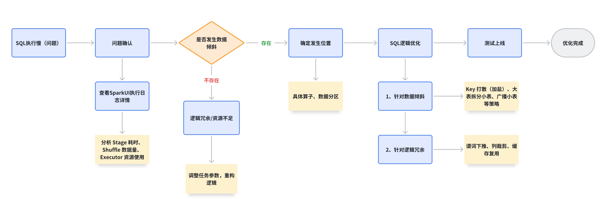

## Spark UI查看
1、日志中寻找Application ID，「点击」后面的Tracking URL进入spark ui查看任务运行详情
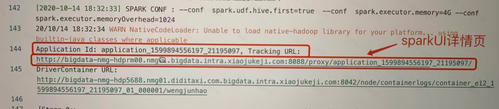
Spark UI界面详情介绍：
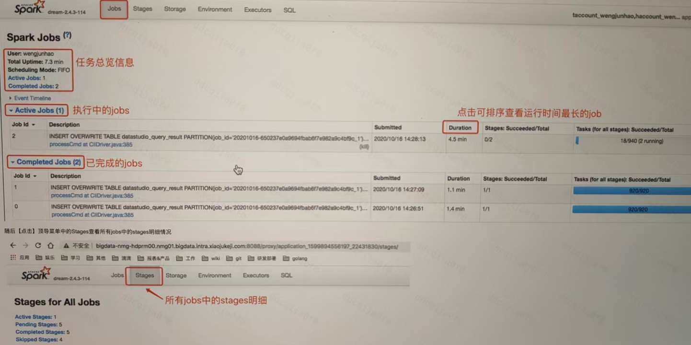

「点击」Stages查看所有jobs中的stages明细情况
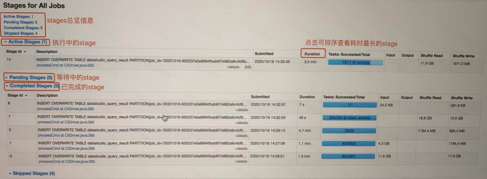

点击Stages中所有stages的Duration进行排序，查看所有stage运行情况，查看运行时间最长的stage，然后「点击」stage对应的processCmd at CliDriver.java：XXX查看单个Stage任务的明细信息
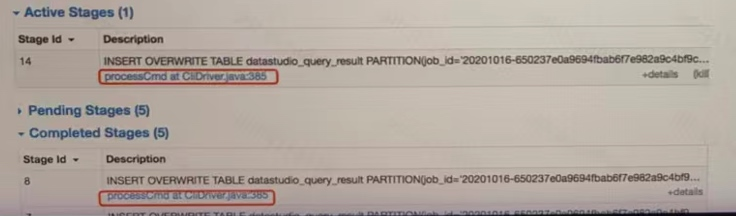

明细信息如下：
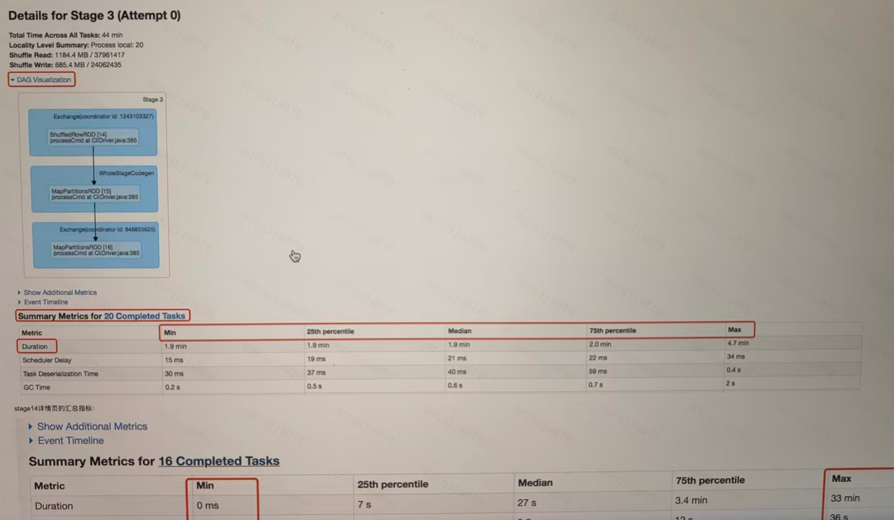
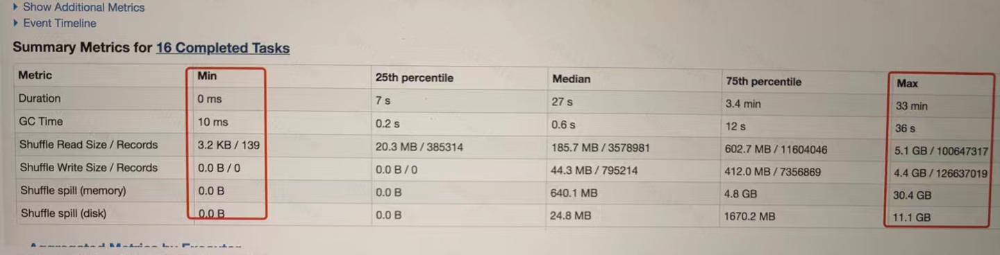

对比运行时间较长的stage14和正常运行完成的stage3的tasks汇总指标可以发现，stage14中各个指标数据量分布十分不均匀，而stage3中分布的比较均匀，因此可以确认stage14中存在数据倾斜


**定位spark数据倾斜的实际位置**
需要定位数据倾斜实际发生在那段代码，Spark UI目前无法直接展示出来，需要通过执行DAG图进行大概的寻找，首先在stage14详情页面中可以查看到归属Exchange（coordinator id：XXX）

然后进入Spark SQL页面查看DAG执行计划


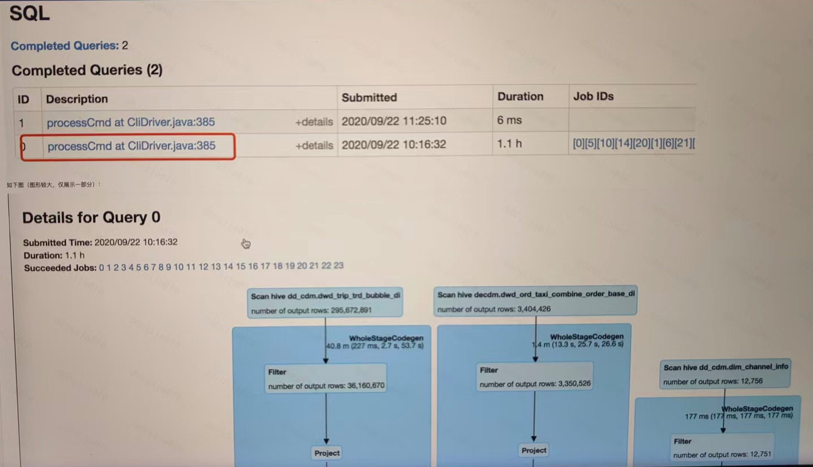

通过搜索stage14详情页的coordinator id：XXX找到具体的执行计划所属链路，定位问题发生在XXX表的链路下，继续向下查看该链路，同样发现在SortMergeJoin之后不同的分区数据分布差异性巨大，因此可以实锤数据倾斜位置发生在bubble表和channel表的关联过程中
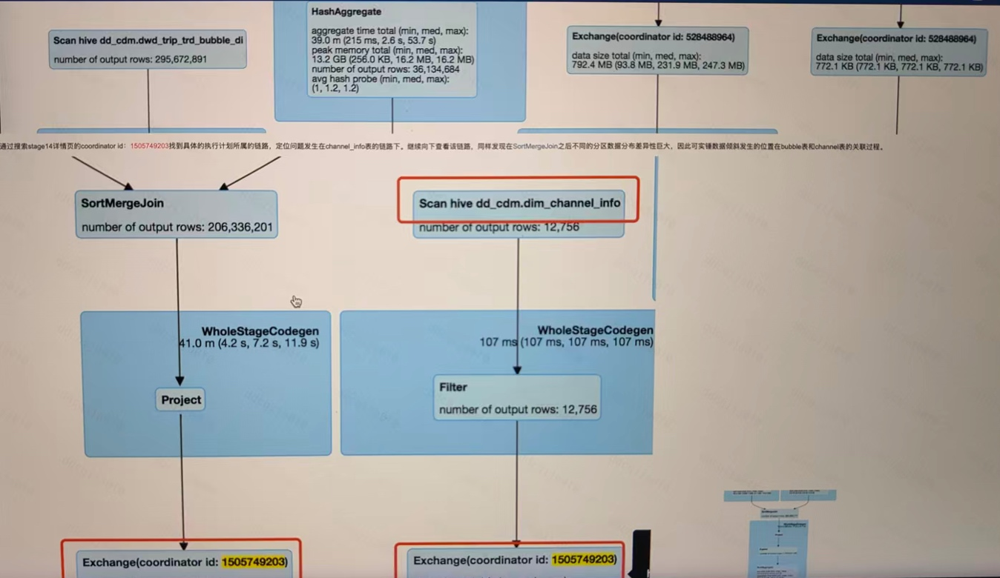


# OOM
OOM 分为Driver OOM和Executor OOM。Driver OOM常见于任务调度、数据拉取等阶段，可通过调整内存、避免大操作解决。Executor OOM多由数据倾斜、Shuffle操作导致，优化分区策略、调整内存比例、使用Kryo序列化可缓解。

# ETL
ETL 就是**把数据从各处搬来、洗干净、整理好，再存进数据仓库**的一整套流程，全称是：
**Extract（抽取）→ Transform（转换）→ Load（加载）**
1. Extract 抽取
从各种数据源把数据拿出来：
- 数据库（MySQL、Oracle）
- 日志、文件、API、第三方系统

2. Transform 转换
**ETL 最核心的一步**，做数据治理：
- 清洗：去重、补全、过滤脏数据
- 规范：统一字段、格式、单位
- 关联：多表合并、关联、聚合
- 计算：指标加工、业务逻辑处理

3. Load 加载
把处理好的数据写入目标库：
- 数据仓库（Hive、ClickHouse、Doris 等）
- 数据湖、数仓集市


# 相关参数设置
（1）AQE:
* 自动分区合并

* 数据倾斜

* Runtime执行计划优化

（2）数据倾斜
* 增加shuffle partition数量`spark.sql.shuffle.partition = 200`
通过调整shuffle partition数量来避免某个partition数量特别大，将该partition数据分散到多个partition中
* 加盐处理倾斜的key
增加 shuffle partition数量的方法，对于同一个海量数据倾斜的key来说，不起作用。不过，我们可以对该数据倾斜的key通过加盐方式来打散数据，然后再借助shuffle partition的功能
* 使用Broadcast hash join
在某些场景下，可以把Sort Merge Join转换成Broadcast hash join，从而避免shuffle产生的数据倾斜，比如：如果两个join的表有一个表是小表，可以优化成Broadcast Hash Join来消除shuffle引起的数据倾斜问题

（3）内存
`spark.executor.memory = 8G  -- 执行内存`
`spark.executor.memoryOverhead = 1156  --堆外内存`
`spark.memory.offHeap.size -- 单个executor堆外内存大小-默认813`
`spark.memory.offHeap.enabled -- 是否开启堆外内存`
堆外内存具备显著优势：内存占用统计更精确，无需经历 JVM 垃圾回收，数据传输时也无需额外的序列化与反序列化操作。其核心通过指针偏移记录数据，但需注意，当处理数据量过大时，可能存在内存泄漏风险。
选择建议上，若待处理数据集的模式较为扁平，且多数字段为定长数据类型，更适合启用堆外内存；若数据中包含大量长字段，优先使用 JVM 堆内内存会更稳妥。

（4）合并小文件
可直接读取 HDFS 上的数据进行合并操作：当插入任务完成后，新启动一个 Job 读取全量数据，再根据预设的文件大小合并后写入 HDFS。这种 "读直写" 的方式能精准评估数据量，从而有效避免 Shuffle 输出比例失衡的问题。
相关配置如下：
`set spark.sql.merge.enabled = true ：开启合并功能`
`set spark.sql.merge.mode = fast ：采用快速模式（默认pretty模式为逐行读写，性能较差）`
需要注意的是，fast模式通过块级操作提升效率，适合对合并速度要求较高的场景；而pretty模式虽性能较慢，但能保证输出文件的可读性（如 JSON 格式的缩进排版），可根据实际需求选择。


`spark.default.parallelism`增加并行度确实能够充分利用闲置的CPU的线程，但是，parallelism数值也不宜过大，过大反而会引入过多的调度开销，得不偿失，parallelism数值过大调度开销会呈指数级增长，需要更多执行节点

* 开发应用原则：
    * 坐享其成：尽可能地充分利用Spark为我们提供的“性能红利”，如钨丝计划、AQE等；
        * 钨丝计划：谓词下推、列裁剪、常量替换
        * AQE可以让Spark在运行时的不同阶段，结合实时的运行时状态，周期性地动态调整前面的逻辑计划，然后再优化逻辑计划，重新选定最优的物理计划，从而调整运行时后续阶段的执行方式
    * 能省则省、能拖则拖
        * 1、尽量把能节省数据扫描量和数据处理量的操作往前推
        * 2、尽量消灭掉shuffle，省区数据落盘和分发的开销
        * 3、如果不能干掉shuffle，尽可能的把涉及shuffle操作做到最后去执行

## **一个Spark任务某天突然变慢怎么解决**
首先来说处理的两个方向大概就是：
看 Spark Web UI，观察每个 Stage 的执行时间和平常是否有区别，执行时间是否超过以前的平均执行时间。看 Spark 日志，看是否有 error，网络、磁盘空间等是否存在异常。

1.**数据倾斜发生的现象**可能有以下两种表现：
Spark作业的大部分 task 都执行迅速，只有有限的几个 task 执行的非常慢，此时可能出现了数据倾斜，作业可以运行，但是运行得非常慢；Spark 作业的大部分 task 都执行迅速，但是有的 task 在运行过程中会突然报出 OOM，反复执行几次都在某一个 task 报出 OOM 错误，此时可能出现了数据倾斜，作业无法正常运行。2.**数据倾斜发生的原理**在进行 shuffle 的时候，必须将各个节点上相同的 key 拉取到某个节点上的一个 task 来进行处理，比如按照 key 进行聚合或 join 等操作。此时如果某个 key 对应的数据量特别大的话，就会发生数据倾斜。

**定位数据倾斜发生的代码**
看 Spark Web UI 的 Jobs，看程序卡在哪里。一般会有好几个 job，分位 Completed Jobs 和 Active Jobs，Active Jobs 下面就是执行较慢的 job。点开正在执行的 job，观察 Stage 下面的 task，有一个 task 执行特别慢。比较每个 task 的数据量，通过 Spark Web UI，我们可以查询到每个任务处理的数据量大小和需要的执行时间。如果这个任务处理的数据量和需要的执行时间都明显多于其他任务，就说明很可能出现了数据倾斜。


## **数据倾斜**（数据分区）
**业务场景**：
（1）**聚合操作倾斜**：按广告ID/用户ID统计曝光 / 点击量时，少数热门 ID 数据量占比超 50%。
（2）**Join 操作倾斜**：点击表（大表）与广告计划表（小表）join 时，某广告 ID 在大表中出现百万次以上。
（3）**UDTF / 窗口函数倾斜**：对高频率广告做明细展开或排序时，单 task 处理数据量过大。

**排查过程**：
通过 Spark UI 查看Stage的Shuffle Read数据分布，若某 task 读取数据量是其他的 10 倍以上，可确认倾斜。

**解决方案**：
1、预聚合 + 局部合并（适合实时场景）：广告场景中，可先按(广告ID, 时间片)预聚合，再全局聚合。
2、Join操作：将点击/曝光表（大表）与广告属性表（小表）join，如果大表中某广告ID高频出现，会导致join。 --> 小表广播，小表放入内存，使用broadcast join避免shuffle
3、提升shuffle并行度、过滤无效字段数据（数据预处理）


## **有哪些算子会造成数据倾斜，解决数据倾斜的手段有哪些**
核心原因是 **Shuffle 操作后，某几个 Key 的对应数据量远超其他 Key**，导致处理这些 Key 的 Task 要处理海量数据，运行时间远长于其他 Task，甚至超时失败。
**触发 Shuffle 的宽依赖算子**，比如 groupByKey、reduceByKey（虽然有预聚合，但仍可能倾斜）、distinct（本质是按 Key 去重）、join（尤其是大表与大表 join 时，某几个关联 Key 数据量大）、repartition；

**解决数据倾斜：**

‘避免倾斜’和‘缓解倾斜’：
**1、预处理数据，从源头减少倾斜**：比如如果是上游数据本身有‘热点 Key’（比如某类用户 ID 对应数据量极大），可以在数据写入时就做拆分，比如把‘热点 Key’加随机后缀分成多个子 Key，后续处理完再合并；或者提前过滤掉无效的重复热点数据，减少数据量。

**2、调整算子或参数，优化 Shuffle 过程**：比如用 reduceByKey 代替 groupByKey（因为 reduceByKey 会先在分区内预聚合，减少 Shuffle 的数据量）；或者开启 Spark 的‘动态分区调整’（spark.sql.adaptive.enabled），让 Spark 自动根据数据量调整 Shuffle 分区数，避免分区过大或过小；还可以手动调大 Shuffle 分区数（spark.default.parallelism），把原本集中在一个分区的热点 Key 分散到多个分区。

**3、特殊场景处理**：比如 join 场景，如果是大表和小表 join，可把小表广播（用 broadcast join），避免 Shuffle；如果是大表和大表 join 且有明确热点 Key，可单独把热点 Key 的数据抽出来，用‘热点 Key + 随机后缀’的方式单独 join，非热点数据正常 join，最后合并结果；如果是聚合场景，可先做局部聚合（比如 map 端预聚合），再做全局聚合，减少聚合时的压力。

**4、资源调优兜底**：如果倾斜暂时无法彻底解决，可临时给处理倾斜 Task 的 Executor 加资源（比如调大 executor.memory、executor.cores），避免 OOM 或超时，但这只是缓解，核心还是要从数据或算子层面解决根本问题。


## **Spark定位数据倾斜**
数据倾斜只会发生在Shuffle过程中,常见的并且可能会出发shuffle操作的算子: distinct、groupByKey、reduceByKey、aggregateByKey、join、repartition等.出现数据倾斜时,很可能就是代码中使用的这些算子中的某一个导致的.
**定位**：
在Spark Web UI上深入看一下当前这个stage各个task分配的数据量，从而进一步确定是不是task分配的数据不均匀导致了数据倾斜。

**通过 Web UI 看是否数据倾斜**
数据倾斜只会发生在shuffle过程中。

通过观察spark UI的界面，定位数据倾斜发生在第几个stage中。

可以在Spark Web UI上看一下当前这个stage各个task分配的数据量，从而进一步确定是不是task分配的数据不均匀导致了数据倾斜。

* 1段提交代码是1个Application。
* 1个action算子是1个job 。
* 1个job中，以宽依赖为分割线，划分成不同stage，stage编号从0开始 。
* 1个stage中，划分出参数指定数量的task，注意观察Locality Level和Duration列 。Duration 就是 task 的执行时间。

## 如何确定task数量
task数量和数据的分区相同，一般就是HDFS上的分区的数量，shuffle后分区数的可以通过shuffle.partitons这个参数调整，调整后reduce task的数量就是这个参数配置的。


# 重点问题
## **Spark为什么比MR快**
**1、内存计算主导，减少磁盘IO开销**
MR核心依赖于**磁盘存储中间结果**，Map阶段的输出会被强制写入本地磁盘，Reduce阶段需要从各个Map节点的磁盘读取数据（Shuffle过程），处理后再写入磁盘。
Spark采用**内存优先的计算模型**：中间结果（比如RDD转换的输出）默认存储在内存中，只有当内存不足时才溢出到磁盘

**2、DAG优化与多阶段合并**

Spark通过**DAG（有向无环图）执行引擎**优化计算流程

>注意：DAG（有向无环图）计算模型减少的是磁盘I/O次数（相比于MR的计算模型来说），而不是Shuffle次数，因为Shuffle是根据数据重组的次数而定的，所以shuffle次数不能减少

DAG相比MR在大多数情况下可以减少磁盘I/O次数：因为mapreduce计算模型只能包含一个map和一个reduce,所以reduce完后必须进行落盘，而DAG可以连续shuffle的，也就是说一个DAG可以完成好几个 mapreduce，dag只需要在最后一个shuffle落盘。

举个例子：
若任务需要 N 次 Shuffle，MapReduce 需拆分为 N 个 Job，产生N 次落盘；
而 Spark 的 DAG 可在一个 Job 中完成 N 次 Shuffle，仅需1 次最终落盘（中间 Shuffle 的临时数据可在内存中传递或仅临时落盘后快速复用）。

>解释：
MR的每个 Job 只能包含一个 Map 阶段和一个 Reduce 阶段，且 Reduce 阶段的输出必须落盘（写入 HDFS 或本地磁盘）。这意味着，若任务需要多轮 Shuffle（如 “分组→聚合→再分组→再聚合”），必须拆分为多个独立的 MapReduce Job，每个 Job 的 Reduce 输出都要作为下一个 Job 的 Map 输入并强制落盘。例如，完成 “数据清洗→分组统计→排序排名” 的任务，需要 3 个 MapReduce Job，对应 3 次 Shuffle 和 3 次落盘。
Spark 的 DAG 模型支持多阶段串联的 Shuffle 操作：一个 DAG 可以包含多个 Shuffle 阶段（如groupByKey→join→reduceByKey），且仅在 Shuffle 阶段之间需要落盘（用于数据重分区），而非每个 Shuffle 后都必须落盘。
Shuffle 次数越多，DAG 相比 MapReduce 减少的落盘次数就越多，磁盘 IO 开销的差距也就越大。

**3、优化的shuffle过程**
mapreduce在shuffle时默认进行排序，spark在shuffle时则只有部分场景才需要排序（bypass机制不需要排序），排序是非常耗时的，这样就可以加快shuffle速度

**4、缓存**
spark支持将需要到的数据进行缓存：对于下次再次使用此rdd时，不需要再次计算，而是直接从缓存中获取，因此可以减少数据加载耗时

**5、任务调度**
任务级别并行度的不同：mapreduce采用多进程模型，而spark采用了多线程模型，多进程模型的好处是便于细粒度控制每个任务占用的资源，但每次任务的启动都会消耗一定的启动时间，即mapreduce的map task 和reduce task是进程级别的，都是jvm进程，每次启动都需要重新申请资源，消耗不必要的时间，而spark task是基于线程模型的，通过复用线程池中的线程来减少启动，关闭task所需要的开销（多线程模型也有缺点，由于同节点上所有任务运行在一个进行中，因此，会出现严重的资源争用，难以细粒度控制每个任务占用资源）


## **从2h到3min：Spark SQL多维分析性能优化**
发现其中一个 Hive 报表任务每天运行 1.5~2h 同事占用大量资源：
```sql
INSERT OVERWRITE TABLE live_room_expo_day
SELECT
'${date}'AS dt,
NVL(country, 'total') AS country,
NVL(platform, 'total') AS platform,
'total'ASversion,
NVL(page, 'total') AS page,
NVL(is_new, 'total') AS is_new,
NVL(content_type, 'total') AS content_type,
NVL(is_visitor, 'total') AS is_visitor,
-- 曝光相关指标
COUNT(DISTINCTIF(eventIN('feed_exposure','banner_exposure'),
lid, NULL)) AS exp_lives,
COUNT(DISTINCTIF(eventIN('feed_exposure','banner_exposure'),
host_uid, NULL)) AS exp_host_uid,
COUNT(DISTINCTIF(eventIN('feed_exposure','banner_exposure'),
uid, NULL)) AS exp_users,
COUNT(DISTINCTIF(eventIN('feed_exposure','banner_exposure'), CONCAT(lid,uid), NU
LL)) AS exp_cnt,
...省略其他 32 个 countdistinct 指标
-- 点击相关指标
COUNT(DISTINCTIF(eventIN('feed_click','banner_click') AND show_type='selective',
lid, NULL)) AS selective_click_lives,
COUNT(DISTINCTIF(eventIN('feed_click','banner_click') AND show_type='selective',
host_uid, NULL)) AS selective_click_host_uid,
COUNT(DISTINCTIF(eventIN('feed_click','banner_click') AND show_type='selective',
uid, NULL)) AS selective_click_users,
COUNT(DISTINCTIF(eventIN('feed_click','banner_click') AND show_type='selective',
CONCAT(lid,uid), NULL)) AS selective_click_cnt
FROM (
SELECT
uid,
event,
version,
NVL(lid, rid) AS lid,
page,
platform,
host_uid,
is_pugc,
name,
live_dur_min,
NVL(is_new, 0) AS is_new,
IF(country IN('SA','AE','QA','KW'), country, 'other') AS country,
NVL(content_type, 'live') AS content_type,
aid,
device_id,
user_tag,
CASE
WHENversion >= '2.0.0'AND extend['show_type'] ISNOTNULLTHEN extend['show
_type']
WHENversion >= '3.0.0'AND extend['page_chanel'] = 'live'THEN'selective'
WHENversion >= '3.0.0'AND extend['page_chanel'] = 'video'THEN'engaging'
WHENversion >= '2.0.0'THEN'other'
ELSE'old version'
ENDAS show_type,
CASE
WHENversion < '2.0.0'THEN'old version'
WHEN is_login = 1THEN'other'
ELSE'visitor'
ENDAS is_visitor
FROM live_room_exposure_detail
WHERE dt = '${dt}'
AND page <> 'test'
AND country <> 'CN'
) a
GROUPBY country, platform, page, is_new, content_type, is_visitor WITHCUBE;
```
排查 Spark 执行计划

用于监控 Spark 作业的执行状态，包括任务进度、Stage/Task 成功数、运行时
长等，方便排查任务卡顿、失败问题。如果 Job 1 长时间未完成，可重点检查
未完成的 Stage/Task 日志，分析是否有资源瓶颈、数据倾斜等问题。

通过监控 Stage 状态（运行 / 等待 / 完成）、Task 成功率、Shuffle 数据量，
可定位 Spark 作业的 性能瓶颈（如 Shuffle 过大、Stage 阻塞）或 失败原因（如
Task 失败导致 Stage 卡主）。若 Active/ Pending Stages 长时间未推进，需检查
依赖、资源分配或数据倾斜问题。


## **花卉电商业务大数据分析**
FlowerShopGroupUDF 是一个结合 “预设关键词” 和 “AI 识别” 的 Spark 自
定义聚合函数，用于在分布式数据中统计每个分组内与鲜花相关的商品数量（最
多 3 个）。其设计兼顾了效率（关键词快速匹配）和准确性（AI 辅助判断），
适用于花卉相关业务的大数据分析场景。
预设/构建 prompt 进行关键词快速匹配和 AI 辅助识别的 Spark 自定义 UDAF（自
定义聚合函数），在亿级分布式数据中统计每个分组内商品广告数量。

**优化**：有一些过滤条件，根据平台 ID，where 地区条件，该加字段的地方加索引，
where 条件过滤的合适，加缓存、服务器资源支持、调用的接口/模型速率能跟上
（有时候为了达到平衡就需要降低接口相应速度）
该 UDF 的作用是：在数据分组（如按店铺、区域等分组）时，统计每个分组中
与鲜花直接相关的商品数量（最多统计 3 个）。判断 “是否与鲜花相关” 的
逻辑结合了预设关键词匹配和 AI 模型识别，确保结果准确性。
1 亿 6 千万店铺内花卉商品 join4 千万店铺数据
模型处理速度：150~180 条/s（模型处理速度慢）
流程：

1、继承自定义聚合抽象类，重写抽象方法以实现聚合逻辑（输入输出结构、数
据处理、结果合并）

2、预设花卉品种关键词列表 flowerWords（杂交百合、铁炮百合、玫瑰、满天
星）覆盖常见鲜花品种，用于**初步快速判断**商品是否与鲜花相关。

3、UDAF 核心方法：
（1）inputSchema：定义输入数据结构：函数需要接收“商品名称”作为判断依
据

（2）bufferSchema：定义聚合缓冲区结构：临时存储中间结果，用于累计每个分
组中符合条件的鲜花商品数量。

（3）dataType：定义聚合结果类型：返回最终结果是一个 Long 类型，即每个分
组中符合条件的鲜花商品数量

（4）Deterministic：是否确定性函数，输出相同，结果一定相同

（5）Initialize：聚合开始之前，初始化缓冲区，初始化统计数量为 0L

（6）Update：对每条输入的商品名称进行判断并更新缓冲区，若当前缓冲区的
计数（flower_count）小于 3，且商品被判定为鲜花，则将计数加 1（buffer(0) +=
1）；限制 “最多统计 3 个”：业务逻辑中可能只需要每个分组的前 3 个相关
商品，因此超过 3 个后不再累加。

（7）Merge 合并分布式计算的缓冲区：Spark 是分布式计算框架，数据会被分
成多个分区并行处理。merge 方法用于将不同分区的缓冲区结果合并

（8）evaluate 返回最终聚合结果，即该分组中符合条件的鲜花商品数量。
4、商品与鲜花相关性判断：先通过预设关键词匹配，关键词匹配失败时，调用
AI 模型判断，若 AI 返回“是”且置信度>80，则判定为相关
val systemRrompt = "【任务指令】\n 请判断用户提供的商品是否与“花”相关。
必须是鲜花，花卉，花的周边产品不算，比如花盆，用花做的食品，干花等，并
按照指定的 JSON 格式返回结果。\n【输出要求】\n 请以 JSON 格式返回识别结
果：\n{\n \"is_related_to_flower\": \"是/不是\",\n \"confidence\": 置信度百
分比(0-100),\n \"reason\": \"判断依据说明\"\n}"


## **Spark OOM原因**
spark oom -- driver / executor 10 -14G

概括
1、map执行内存溢出

2、shuffle后内存溢出

3、driver内存溢出

map执行中内存溢出代表了所有map类型的操作。包括：flatMap，filter，mapPatitions等。shuffle后内存溢出的shuffle操作包括join，reduceByKey，repartition等操作

具体原因
**1.map过程产生大量对象导致内存溢出**
例如：rdd.map(x=>for(i <- 1 to 10000) yield i.toString)，这个操作下，每个对象产生了一千个对象，肯定容易造成内存溢出。针对这种问题，在不增加内存的情况下，可以通过减少每个Task的大小，以便达到每个Task即便产生大量对象，也能装得下。具体做法，在map之前调用repartition，增加分区数

**2.数据不平衡导致内存溢出**
数据不平衡除了有可能导致内存溢出外，也可能导致性能问题，解决办法同上，调用repartition方法，重分区

**3.coalesce调用导致内存溢出**
HDFS不适合存储小文件，所以spark计算后如果产生的文件太小，会先调用coalesce合并文件，再存入HDFS。这会导致一个问题，假使调用之前有一百个文件，就需要一百个task，调用coalesce之后，产生10个文件，由于coalesce默认shuffle为false，窄依赖，reduce阶段的task数据量是map阶段的10倍，也就是说并不是先100个task执行，而是从头到尾都是10个task再执行，容易OOM，可以将coalesce的shuffle设置成true，这样就会有shuffle，数据中间落盘，不会OOM

**4.shuffle后内存溢出**
内存溢出可以说都是shuffle后，单个文件过大导致的，在spark中，join，reduceByKey这一类型的过程，都会有shuffle，shuffle使用需要传入一个partitioner，大部分Spark中的shuffle操作，默认是HashPartitioner，默认值是父RDD中最大的分区数，这个参数通过spark.default.parallelism控制，该参数只对HashPartitioner有效，如果是别的partitioner导致OOM就需要在partitioner代码中增加partitions的数量


~~## 如何解决大表join大表的数据倾斜
首先会通过查看任务日志或者抽样统计定位原因，看看是因为存在大量 null 值、异常值，还是有少数热点 key 导致的。比如有些 key 的数量占比特别高，或者 null 值都被 hash 到同一个 task，这些都会造成某个 task 处理数据量过大，拖慢整个任务。

1、如果是 null 值或异常值导致的，比较简单。可以直接过滤掉不需要的 null 值；如果需要保留，就把 null 值替换成随机字符串，比如 concat ('null_', rand ())，让它们分散到不同 task；或者把数据拆成正常数据和异常数据两部分，正常的正常 join，异常的单独处理，最后再合并。

2、如果是热点 key 导致的，这是最常见的情况。我会用 "拆分热点" 的方法：先找出那些热点 key，然后把大表中这些热点 key 的数据拆成多份，比如给每个 key 加个随机后缀（0 到 n），同时把小表中对应的 key 也扩展成 n 份，同样加上后缀，这样原本集中的热点就分散到 n 个 task 去处理了，最后再把结果合并。

3、比如如果是 spark 环境，可以调大 spark.sql.shuffle.partitions 增加分区数，让数据分布更均匀；或者尝试用 map join（如果其中一个表能放进内存），避免 shuffle；如果是 hive，也可以开启倾斜 join 优化，让系统自动处理。~~


## **spark的反压原理是什么？主动还是被动？**
解决流处理中“生产者速度远快于消费者”问题，核心原理：**动态调整上游数据的处理速率，避免下游 Executor 因过载而崩溃，确保流处理的稳定性**。

**反压机制的核心原理**：在 Spark Streaming（或 Structured Streaming）中，数据以 “微批”（Micro-Batch）形式处理：上游数据源（如 Kafka）不断产生数据，Spark 将数据切分成小批次（Batch）并分配给 Executor 处理。当数据流入速度超过 Executor 的处理能力时，未处理的数据会不断堆积，可能导致内存溢出（OOM）或任务超时。

调整流量方式:
1、**监控处理延迟**：Driver 实时跟踪每个批次的处理时间和未处理数据量（如 Executor 中等待处理的 Task 队列长度）。
2、**计算瓶颈节点**：分析哪些 Executor 或 Task 处理速度较慢（存在积压），识别系统瓶颈。
3、**动态调整接收速率**：根据瓶颈节点的处理能力，反向限制上游数据源的数据接收速率（如减少从 Kafka 拉取数据的速度），或调整批次大小（Batch Interval），确保下游能及时处理数据。

反压机制是**主动的**，原因如下：

* 主动监测：系统会持续主动监控各环节的处理状态（如批次处理时间、Task 积压量），而非被动等待错误发生。
* 主动调节：一旦发现下游处理能力不足，会主动触发调节策略（如限制数据源拉取速度、调整批次大小），提前避免过载，而不是在发生故障后被动恢复。
* 动态自适应：调节策略会根据实时负载动态调整（如处理能力恢复后，自动提高接收速率），无需人工干预。

“被动机制” 通常是指系统在发生故障后（如 OOM）才进行恢复（如重试 Task），而反压机制的核心是 “提前预防”，因此属于主动控制。


#  spark框架
## 架构组成
* Master 节点、Worker 节点、Driver驱动器，Executor 执行器、Task 计算任务
* Master 节点上常驻Master 进程，该进程负责管理所有的Worker 节点。（分配任务、收集运行信息、监控worker的存活状态）
* Worker 节点常驻Worker进程，该进程与Master 节点通信，还管理Spark 任务的执行。（启动Executor，监控任务运行状态）
* Driver：Spark中的Driver即运行上述Application的main函数并创建SparkContext，创建SparkContext的目的是为了准备Spark应用程序的运行环境，在Spark中有SparkContext负责与ClusterManager通信，进行资源申请、任务的分配和监控等，当Executor部分运行完毕后，Driver同时负责将SparkContext关闭。
* Executor 执行器。Executor 是一个JVM 进程，是Spark 计算资源的单位。可以运行多个计算任务。
* Task Spark 应用会被拆分为多个计算任务，分配给Executor 执行。Task 以线程的方式运行在Executor 中。


## SparkCore核心组件
核心组件：

* RDD（弹性分布式数据集）：Spark 的基础数据结构，是分布式内存中的不可变集合，支持并行操作和容错（通过血缘关系重建数据）。
* DAG 调度器（DAG Scheduler）：将用户代码解析为 DAG（有向无环图），并划分成多个 Stage（阶段），每个 Stage 包含一组可并行执行的 Task。
* Task 调度器（Task Scheduler）：将 Stage 中的 Task 分配到 Executor 上执行，根据集群管理器类型（如 YARN、Standalone）适配不同的调度逻辑。
* 内存管理：负责数据在内存中的存储、缓存和溢出（当内存不足时写入磁盘），优化计算效率。


## **spark 执行流程是什么？**
1、提交Spark Application：JAR包、python脚本，指定运行模式（Local、YARN、K8S）、内存和CPU核数
2、初始化Driver进程：解析用户代码，创建SparkContext，定义 RDD/DataFrame 的转换操作（Transformation），记录依赖关系。
3、申请资源与启动Executor： Driver 向集群管理器申请计算资源（CPU、内存），请求启动Executor 进程。集群管理器在 Worker 节点上分配资源，启动 Executor，并向 Driver 注册。 Executor 一旦启动，将长期驻留（直到应用结束），负责执行 Driver 分配的任务（Task）和缓存中间数据（如 RDD 持久化）。
4、触发Job并构建DAG：针对“行动操作”（如collect()、count()、saveAsTextFile()）时，触发Job，Driver将Job对应的计算流程转化为DAG
5、DAG调度与Stage划分：DAG Scheduler将DAG划分为多个Stage（阶段），每个 Stage 包含一组连续的窄依赖操作（如map、filter），可并行执行。
6、Task调度与分发：将每个Stage拆分为多个Task，每个 Task 对应一个数据分区（Partition），处理该分区的数据。
7、执行Task与返回结果：Executor 以线程方式并行执行 Task，每个 Task 执行完成后，将结果返回给 Driver
8、任务结束，集群管理器回收资源
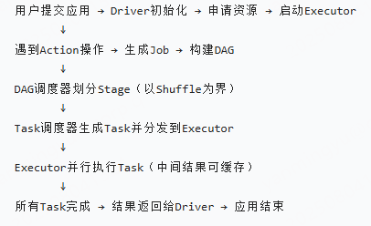


## **Spark的运行模式**
1、Local本地模式（单机） --> 开发测试使用
2、Standalone独立集群模式 --> 开发测试使用
3、standalone-HA高可用模式 --> 生产环境使用，国内很少使用。
4、Yarn集群模式（最常用） --> 生产环境使用
5、K8S集群模式 --> 生产环境使用


## **Spark内存管理机制**（executor内存分配）
在执行Spark 的应用程序时，Spark 集群会启动 Driver 和 Executor 两种 JVM 进程，前者为主控进程，负责创建 Spark 上下文，提交 Spark 作业（Job），并将作业转化为计算任务（Task），在各个 Executor 进程间协调任务的调度，负责在工作节点上执行具体的计算任务，并将结果返回给 Driver，同时为需要持久化的 RDD 提供存储功能。

作为一个 JVM 进程，Executor 的内存管理建立在 JVM 的内存管理之上，Spark 对 JVM 的堆内（On-heap）空间进行了更为详细的分配，以充分利用内存。同时，Spark 引入了堆外（Off-heap）内存，使之可以直接在工作节点的系统内存中开辟空间，进一步优化了内存的使用。

堆内内存受到JVM统一管理，堆外内存是直接向操作系统进行内存的申请和释放。

## **内存模型**
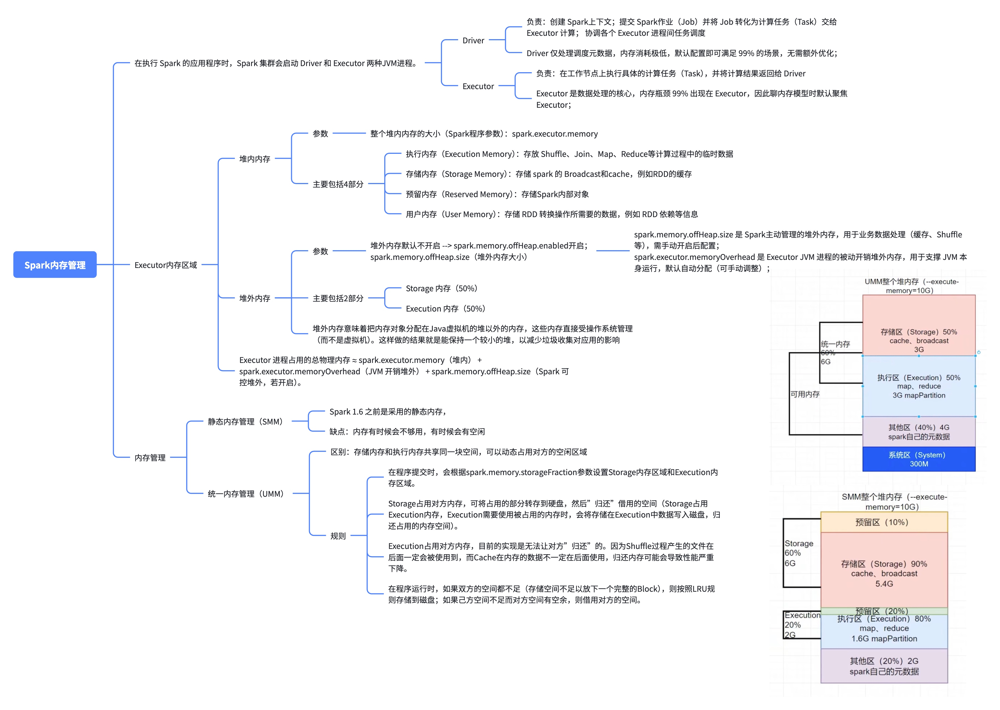


## Spark的checkpoint机制（RDD计算失败）
**应用场景**：
分布式计算中难免因为网络，存储等原因出现计算失败的情况，RDD中的lineage信息常用来在task失败后重计算使用，为了防止计算失败后从头开始计算造成的大量开销，RDD会checkpoint计算过程的信息，这样作业失败后从checkpoing点重新计算即可，提高效率。

**checkPoint条件**：
* DAG中的Lineage过长，如果重算，则开销太大（如在PageRank中）。
* 在宽依赖上做Checkpoint获得的收益更大。

**CheckPoint写流程**
* 当RDD的action算子触发计算结束后会执行checkpoint。
* 在spark streaming中每生成一个batch的RDD也会触发checkpoint操作。
* 首先 driver 程序 需要使用 rdd.checkpoint() 去设定哪些 rdd 需要 checkpoint，设定后，该 rdd 就接受 RDDCheckpointData 管理。用户还要设定 checkpoint 的存储路径，一般在 HDFS 上。
* marked for checkpointing：初始化后，RDDCheckpointData 会将 rdd 标记为 MarkedForCheckpoint。
* checkpointing in progress：每个 job 运行结束后会调用 finalRdd.doCheckpoint()，finalRdd 会顺着 computing chain 回溯扫描，碰到要 checkpoint 的 RDD 就将其标记为 CheckpointingInProgress，然后将写磁盘（比如写 HDFS）需要的配置文件（如 core-site.xml 等）broadcast 到其他 worker 节点上的 blockManager。完成以后，启动一个 job 来完成 checkpoint（使用 rdd.context.runJob(rdd, CheckpointRDD.writeToFile(path.toString, broadcastedConf))）。
* checkpointed：job 完成 checkpoint 后，将该 rdd 的 dependency 全部清掉，并设定该 rdd 状态为 checkpointed。然后，为该 rdd 强加一个依赖，设置该 rdd 的 parent rdd 为 CheckpointRDD，该 CheckpointRDD 负责以后读取在文件系统上的 checkpoint 文件，生成该 rdd 的 partition。

**读CheckPoint数据**
task计算失败的时候会从checkpoint读取数据进行计算

如果一个RDD被checkpoint了，那么这个 RDD 中对分区和依赖的处理都是使用的RDD内部的checkpointRDD变量，具体实现是 ReliableCheckpointRDD 类型。这个是在 checkpoint 写流程中创建的。依赖和获取分区方法中先判断是否已经checkpoint，如果已经checkpoint了，就斩断依赖，使用ReliableCheckpointRDD，来处理依赖和获取分区。

*如果没有，才往前回溯依赖。依赖就是没有依赖，因为已经斩断了依赖，获取分区数据就是读取 checkpoint 到 hdfs目录中不同分区保存下来的文件。

整个 checkpoint 读流程就完了。


## Spark内存管理分为哪些部分，如何优化内存管理以提高作业性能
主要分为两部分：执行内存（Execution Memory）和存储内存（Storage Memory），执行内存用于存放中间结果和Task级数据结构，而存储内存则用于缓存RDD和共享变量。

**优化内存管理的方法：**
1、调整`spark executor.memory`参数：适当增加Executor内存的大小，确保足够的内存来处理任务。
2、调整`spark.memory.fraction`参数：该参数控制了用于存储和执行的内存比例。
3、使用合理的持久化级别：根据数据的重要性和使用频率选择合适的持久化级别（如：`MEMORY_ONLY`、`MEMORY_AND_DISK`），防止不必要的高内存占用。
4、适时清理缓存数据：使用`unpersist()`方法是放不需要的缓存数据，以腾出内存空间
6、优化并行度：`spark.default.parallelism`防止单个Task占用过多内存


# Shuffle
## Shuffle具体过程
1、各个分区处理数据并产生中间结果；
2、中间结果被序列化并写入磁盘；
3、中间结果通过网络传输到目标分区所在的节点；
4、目标分区读取数据并进行反序列化，执行后续计算任务。

**Shuffle的计算过程分为Map和Reduce两个阶段，其中，Map阶段执行映射逻辑，并按照Reducer的分区规则，将中间数据写入到本地磁盘；Reduce阶段从各个节点下载数据分片，并根据需要实现聚合计算**

## Spark的shuffle操作是什么，它对性能有什么影响？
shuffle本质是跨节点的数据重新分区。简而言之，它是在stages之间重新分配数据，使得一个阶段的输出成为下一个阶段的输入。Shuffle操作会涉及大量的数据序列化、网络传输和磁盘I/O，因此对性能影响比较大。

Shuffle分为两种：宽依赖和窄依赖。宽依赖需要跨节点传输数据，而窄依赖只在一个节点内部进行，不涉及网络传输和磁盘I/O，性能友好。典型的Shuffle操作包括`reduceByKey、groupByKey、join`


## 引起Shuffle的算子
1、repartition类的操作：比如repartition、repartitionAndSortWithinPartitions等
2、byKey类的操作：比如group by、reduceByKey、groupByKey、sortByKey等
3、join类的操作：比如join、cogroup等


## 避免shuffle操作
1、避免使用引起shuffle的算子，优先选择窄依赖（`map、filter、flatMap、mapPartitions、union、coalesce`）

2、预聚合、尽早过滤，在shuffle前通过filter移除无用数据，减少参与shuffle的数据量

3、使用coalesce代替repartition减少分区
repartition会强制shuffle并重分区，触发完整的shuffle操作，而coalesce通过减少分区数目，可以有效避免shuffle

4、利用broadcast变量来减少数据传输
在join操作中，如果右表非常小，可以使用broadcast变量将其广播到所有节点中，然后进行广播join以避免shuffle

## 性能优化
1、调整并行度（parallelism）：通过增加task并行度，减小单个task的数据量，提高执行效率；
2、避免宽依赖：尽量使用类似`map、filter`等窄依赖，减少shuffle发生的频次；
3、使用适当的操作：`reduceByKey`比`groupByKey`更高效，因为它在shuffle之前进行局部合并，减少了数据传输。
4、数据预聚合：使用分区器（Partitioner）控制数据分布，提前进行数据预聚合，减少数据重组开销
5、优化序列化机制：Kryo序列化
6、缓存和持久化：当一个RDD或者DataFrame被多次使用时，可以使用cache()或persist()方法将他们缓存到内存中，避免重复计算，减少shuffle的触发次数。


## MapReduece Shuffle与Spark Shuffle的异同
1、功能上，MR的shuffle和Spark的shuffle是没啥区别的，都是对Map端的数据进行分区，要么聚合排序，要么不聚合排序，然后Reduce端或者下一个调度阶段进行拉取数据，完成map端到reduce端的数据传输功能。
2、方案上，有很大的区别，MR的shuffle是基于合并排序的思想，在数据进入reduce端之前，都会进行sort，为了方便后续的reduce端的全局排序，而Spark的shuffle是可选择的聚合，需要通过调用特定的算子才会触发排序聚合的功能。
3、流程上，MR的Map端和Reduce区分非常明显，两块涉及到操作也是各司其职，而Spark的RDD是内存级的数据转换，不落盘，所以没有明确的划分，只是区分不同的调度阶段，不同的算子模型。
4、数据拉取，MR的reduce是直接拉去Map端的分区数据，而Spark是根据索引读取，而且是在action触发的时候才会拉去数据。
5、HashShuffle，虽然MR和shuffle读都会进行HashShuffle，但是如果在shuffle读没有combine操作的时候同时分区数少于设定的阈值bypass，则不会在HashMap的时候预先对分区中所有的健值对进行merge和sort，从而省下了排序过程。


## **Spark的Shuffe过程-跨节点数据重分布过程**
若下一个阶段需要依赖前面阶段的所有计算结果时，则需要对前面阶段的所有计算结果进行重新整合和分类，这就需要经历shuffle过程。

shuffle操作需要将数据进行重新聚合和划分，然后分配到集群的各个节点上进行下一个stage操作，这里会涉及集群不同节点间的大量数据交换。由于不同节点间的数据通过网络进行传输时需要先将数据写入磁盘，因此集群中每个节点均有大量的文件读写操作，从而导致shuffle操作十分耗时（相对于map操作）。Spark程序中的Shuffle操作是通过shuffleManage对象进行管理。Spark目前支持的ShuffleMange模式主要有两种：HashShuffleMagnage 和SortShuffleManageShuffle操作包含当前阶段的Shuffle Write（存盘）和下一阶段的Shuffle Read（fetch）,两种模式的主要差异是在Shuffle Write阶段

**1、HashShuffleManager**
shuffle write阶段，主要就是在一个stage结束计算之后，为了下一个 stage可以执行shuffle类的算子(比如reduceByKey)，而将每个task处理的数据按key进行“分类”。所 谓“分类”，就是对相同的key执行hash算法，从而将相同key都写入同一个磁盘文件中，而每一个磁盘文件都只属于下游stage的一个task。在将数据写入磁盘之前，会先将数据写入buffer中，当buffer填满之后，才会溢写到磁盘文件中去。

那么每个执行shuffle write的task，下一个stage的 task有多少个，当前stage的每个task就要创建多少份磁盘文件。比如下一个stage总共有100个task， 那么当前stage的每个task都要创建100份磁盘文件。如果当前stage有50个task，总共有10个 Executor，每个Executor执行5个Task，那么每个Executor上总共就要创建500个磁盘文件

shuffle read，通常就是一个stage刚开始时要做的事情。此时该stage的 每一个task就需要将上一个stage的计算结果中的所有相同key，从各个节点上通过网络都拉取到自己所在的节点上，然后进行key的聚合或连接等操作。由于shuffle write的过程中，task给下游stage的每个task都创建了一个磁盘文件，因此shuffle read的过程中，每个task只要从上游stage的所有task所在节点上，拉取属于自己的那一个磁盘文件即可。

shuffle read的拉取过程是一边拉取一边进行聚合的。每个shuffle read task都会有一个自己buffer缓冲，每次都只能拉取与buffer缓冲相同大小的数据，然后通过内存中的一个Map进行聚合等操作。聚合 完一批数据后，再拉取下一批数据，并放到buffer缓冲中进行聚合操作。以此类推，直到最后将所有数据到拉取完，并得到最终的结果

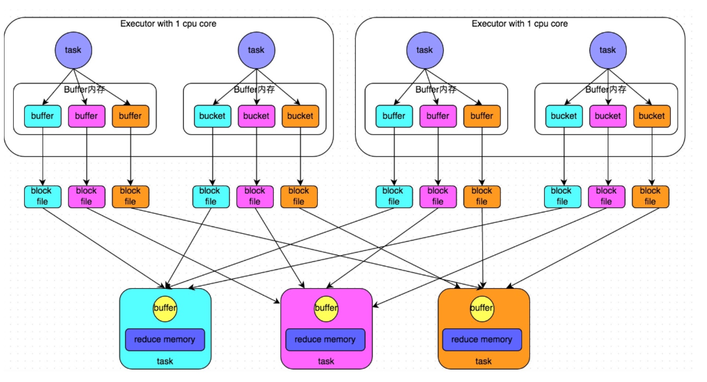

**2、优化HashShuffleManager**

spark.shuffle.consolidateFiles=true

开启consolidate机制之后，在shuffle write过程中，task就不是为下游stage的每个task创建一个磁盘 文件了。此时会出现shuffleFileGroup的概念，每个shuffleFileGroup会对应一批磁盘文件，磁盘文件 的数量与下游stage的task数量是相同的。一个Executor上有多少个CPU core，就可以并行执行多少个 task。而第一批并行执行的每个task都会创建一个shuffleFileGroup，并将数据写入对应的磁盘文件 内。

当Executor的CPU core执行完一批task，接着执行下一批task时，下一批task就会复用之前已有的 shuffleFileGroup，包括其中的磁盘文件。也就是说，此时task会将数据写入已有的磁盘文件中，而不 会写入新的磁盘文件中。因此，consolidate机制允许不同的task复用同一批磁盘文件，这样就可以有效 将多个task的磁盘文件进行一定程度上的合并，从而大幅度减少磁盘文件的数量，进而提升shuffle write的性能。

3、SortShuffleManager
在该模式下，数据会先写入一个内存数据结构中，此 时根据不同的shuffle算子，可能选用不同的数据结构。如果是reduceByKey这种聚合类的shuffle算 子，那么会选用Map数据结构，一边通过Map进行聚合，一边写入内存;如果是join这种普通的shuffle 算子，那么会选用Array数据结构，直接写入内存。接着，每写一条数据进入内存数据结构之后，就会 判断一下，是否达到了某个临界阈值。如果达到临界阈值的话，那么就会尝试将内存数据结构中的数据溢写到磁盘，然后清空内存数据结构。

在溢写到磁盘文件之前，会先根据key对内存数据结构中已有的数据进行排序。排序过后，会分批将数 据写入磁盘文件。默认的batch数量是10000条，也就是说，排序好的数据，会以每批1万条数据的形式 分批写入磁盘文件。写入磁盘文件是通过Java的BufferedOutputStream实现的。 BufferedOutputStream是Java的缓冲输出流，首先会将数据缓冲在内存中，当内存缓冲满溢之后再一 次写入磁盘文件中，这样可以减少磁盘IO次数，提升性能。

一个task将所有数据写入内存数据结构的过程中，会发生多次磁盘溢写操作，也就会产生多个临时文 件。最后会将之前所有的临时磁盘文件都进行合并，这就是merge过程，此时会将之前所有临时磁盘文 件中的数据读取出来，然后依次写入最终的磁盘文件之中。此外，由于一个task就只对应一个磁盘文 件，也就意味着该task为下游stage的task准备的数据都在这一个文件中，因此还会单独写一份索引文 件，其中标识了下游各个task的数据在文件中的start offset与end offset。

SortShuffleManager由于有一个磁盘文件merge的过程，因此大大减少了文件数量。比如第一个stage 有50个task，总共有10个Executor，每个Executor执行5个task，而第二个stage有100个task。由于每 个task最终只有一个磁盘文件，因此此时每个Executor上只有5个磁盘文件，所有Executor只有50个磁 盘文件。
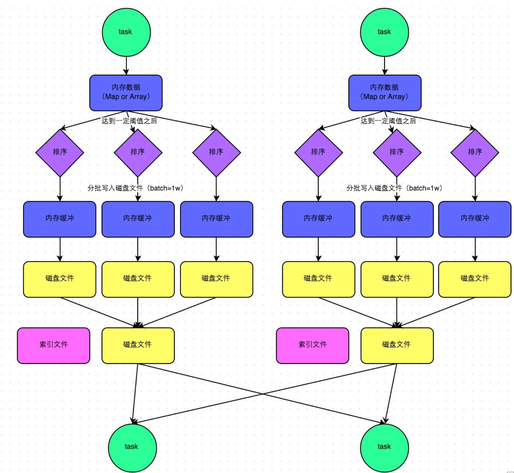

**4.bypass机制**
bypass运行机制的触发条件如下:

```text
shuffle map task数量小于spark.shuffle.sort.bypassMergeThreshold参数的值。默认200
不是聚合类的shuffle算子（比如reduceByKey）
```
此时task会为每个下游task都创建一个临时磁盘文件，并将数据按key进行hash然后根据key的hash 值，将key写入对应的磁盘文件之中。当然，写入磁盘文件时也是先写入内存缓冲，缓冲写满之后再溢 写到磁盘文件的。最后，同样会将所有临时磁盘文件都合并成一个磁盘文件，并创建一个单独的索引文件。

该过程的磁盘写机制其实跟未经优化的HashShuffleManager是一模一样的，因为都要创建数量惊人的 磁盘文件，只是在最后会做一个磁盘文件的合并而已。因此少量的最终磁盘文件，也让该机制相对未经 优化的HashShuffleManager来说，shuffle read的性能会更好。

而该机制与普通SortShuffleManager运行机制的不同在于:第一，磁盘写机制不同;第二，不会进行 排序。也就是说，启用该机制的最大好处在于，shuffle write过程中，不需要进行数据的排序操作，也就节省掉了这部分的性能开销。


## spark什么情况下不会进行shuffle
Shuffle作用：跨分区数据重组（如：按 Key 重新分配数据到不同分区），只有当算子需要跨分区交换数据时才会触发 Shuffle，反之则不会。
目的：避免不必要的 Shuffle 可大幅减少网络传输和磁盘 IO 开销。
1、使用“无状态转换算子”（单分区内处理）

* map(func)：对 RDD 中每个元素应用函数 func（如字段转换、值计算），仅在当前分区内处理；
* filter(func)：按条件 func 过滤元素（如保留满足条件的记录），不改变数据分布；
* flatMap(func)：类似 map，但可将一个元素拆分为多个元素（如将句子拆分为单词），仍在当前分区内；
* mapPartitions(func)：按分区批量处理数据（如对整个分区的数据做聚合统计），不涉及跨分区操作；
* sample(withReplacement, fraction)：对 RDD 进行抽样，仅在当前分区内随机选择元素；
  这些算子仅对单个分区内的数据进行转换或过滤，不涉及同步分区之间的数据交互

2、不依赖Key分组或关联
Shuffle 通常由 “按 Key 聚合、关联、重分区” 等逻辑触发（如 groupByKey、join）。若算子逻辑不涉及这些操作，则无 Shuffle：

* 不按 Key 聚合：如 reduce（对整个 RDD 全局聚合，但仅在 Driver 端完成，不涉及分区间数据交换）、collect（将数据拉取到 Driver）；
* 不跨 RDD 关联：如 union（合并两个 RDD，仅简单拼接分区，不重组数据）；
* 不改变分区规则：如 cache（缓存 RDD，仅保留数据分布）。

3、分区策略一致的操作
某些算子虽然涉及多 RDD 交互，但如果两个 RDD 的**分区策略完全一致**（如相同的 Partitioner），则可避免 Shuffle：

* join 操作：若两个 RDD 按相同 Key 分区（如都用 HashPartitioner 且分区数相同），则相同 Key 已在同一分区，可直接本地关联，无需跨分区传输；


## Spark的Shuffle读取阶段是如何优化的？如何减少网络IO和延迟
1、数据合并和压缩：通过数据合并、压缩（LZ4、Snappy）减少文件的数量和大小
2、利用本地数据：利用已存储在本地的中间结果，减少跨节点的数据传输
3、管道化操作（Pipelining）：将数据的读取和写入操作串联起来，形成管道，使得数据处理不需要等待所有数据都读取完毕后才开始写入
4、批量读取：一次性批量读取很大的数据块，而不是小块多次读取


# RDD
## RDD、DataFrame和DataSet
共性：
1.RDD、 DataFrame、DataSet都是spark平台下的分布式数据集，为处理超大型数据提供便利；
2.三者都有惰性机制，在进行创建、转换时，不会立即执行，只有在遇到行动算子的时候才会开始计算；
3.在对DataFrame和DataSet进行操作时，许多操作都需要导入：import spark.implicits._ 包；
4.三者都会根据Spark的内存情况进行自动缓存计算，这样即使数据量很大，也不会担心内存溢出；

区别：
1.RDD1.RDD 一般和spark mllib（后面解释）同时使用2.RDD不支持spark sql操作
2.DataFrame1.DataFrame每一行的类型固定为Row，每一列的值无法直接访问，只有通过解析才能获取各个字段的值；2.DataFrame和DataSet一般不与spark mllib同时使用3.DataFrame和DataSet均支持sparksql操作

3.DataSet1.DataFrame和DataSet拥有完全相同的成员函数，区别只是每一行的数据类型不同，DataFrame其实就是DataSet的一个特例，type DataFrame = DataSet[Row]2.DataFrame也可以叫DataSet[Row],每一行的类型为Row，每一行究竟有哪些字段，各个字段的类型是什么无从得知；而DataSet每一行是什么类型是不一定的，自定义case class之后可以很自由的获得每一行中的信息。


## Spark Streaming、Core、SQL区别
Spark Core ：
Spark的基础，底层的最小数据单位是：RDD ; 主要是处理一些离线(可以通过结合Spark Streaming来处理实时的数据流)、非格式化数据。它与Hadoop的MapReduce的区别就是，spark core基于内存计算，在速度方面有优势，尤其是机器学习的迭代过程。

Spark SQL：
Spark SQL 底层的数据处理单位是：DataFrame(新版本为DataSet<Row>) ; 主要是通过执行标准 SQL 来处理一些离线(可以通过结合Spark Streaming来处理实时的数据流)、格式化数据。就是Spark生态系统中一个开源的数据仓库组件，可以认为是Hive在Spark的实现，用来存储历史数据，做OLAP、日志分析、数据挖掘、机器学习等等

Spark Streaming：
Spark Streaming底层的数据处理单位是：DStream ; 主要是处理流式数据(数据一直不停的在向Spark程序发送)，这里可以结合 Spark Core 和 Spark SQL 来处理数据，如果来源数据是非结构化的数据，那么我们这里就可以结合 Spark Core 来处理，如果数据为结构化的数据，那么我们这里就可以结合Spark SQL 来进行处理。

联系：Spark SQL构建在Spark Core之上，专门用来处理结构化数据(不仅仅是SQL)。即Spark SQL是Spark Core封装而来的！Spark SQL在Spark Core的基础上针对结构化数据处理进行很多优化和改进，


## spark的RDD是什么？与dataframe有什么区别？
1、RDD
（1）分布式存储：数据被划分为多个分区（Partition），分布在集群的不同节点上，支持并行计算。
（2）不可变性：一旦创建无法修改，只能通过转换操作（如map、filter）生成新的 RDD。
（3）惰性计算：转换操作不会立即执行，只有遇到行动操作（如count、collect）时才触发计算。
（4）容错性：通过 “血缘关系（Lineage）” 记录依赖关系，当数据丢失时可重新计算恢复，无需复制数据。
（5）无 schema 约束：RDD 中的数据可以是任意类型（如字符串、元组、自定义对象），不要求数据有固定结构。
典型操作：
转换操作：map()、filter()、flatMap()、groupByKey()、reduceByKey()等。
行动操作：collect()、count()、saveAsTextFile()等。
应用场景：处理非结构化数据（如文本、图像）、需要复杂自定义逻辑（如迭代机器学习算法）、依赖强类型检查时。

2、DataFrame
Spark SQL引入的，可以理解为“分布式的表”，类似关系型数据库中的表
（1）结构化数据：每个 DataFrame 包含行和列，有明确的schema（表结构），即列名和数据类型（如整数、字符串），类似数据库表的元数据。
（2）优化执行：基于 Catalyst 优化器自动优化执行计划，比 RDD 的低级操作更高效（如合并过滤步骤、选择最优 Join 策略）。
（3）多数据源兼容：支持直接读取 CSV、JSON、Parquet、JDBC 等结构化数据格式，无需手动解析。
应用场景：处理结构化数据（如 CSV、数据库表）、需要 SQL 查询、追求更高性能（如大数据量聚合）、简化数据清洗和转换逻辑时。

总结：
RDD 是 Spark 的基础数据结构，灵活但缺乏优化；DataFrame 是结构化数据的高级抽象，性能更优且易用性强。可通过rdd()方法（DataFrame→RDD）和toDF()方法（RDD→DataFrame）相互转换


## **宽/窄依赖(RDD之间的依赖关系)**
**窄依赖**
窄依赖（**一对一/多对一，不会触发shuffle**）：每个父RDD的分区最多对应一个子RDD分区，也就是说，父RDD的每一个分区的数据智能被一个子RDD的分区所使用，数据移动量较少。

常见操作：**map**（父 RDD 一个分区的数据，经过 map 后全到子 RDD 一个分区）、**filter**（过滤不改变分区依赖，还是一个父分区对应一个子分区）、**union**（两个父 RDD 分区，对应子 RDD 一个分区，属于 “少数几个” 的依赖）、**mapPartitions**（按分区处理，依赖关系还是 1 对 1）。

特点：可以在同一个节点上以pipeline（管道）方式执行，无需跨界点shuffle

**宽依赖**
宽依赖（**一对多，会触发shuffle**）：每个父RDD的一个分区可能会对应多个子RDD的分区，通常涉及到数据的重新分布，需要进行shuffle操作。

常见操作：**groupByKey**（子 RDD 的一个分区要聚合父 RDD 所有分区中相同 Key 的数据，所以依赖所有父分区）、**reduceByKey**（虽然有分区内预聚合，但最终聚合仍需跨分区拉取数据，还是宽依赖）、**join**（尤其是两个大表 join，子 RDD 的一个分区要关联父 RDD 多个分区的匹配数据）、**repartition**（重分区时数据会跨节点分配，依赖多个父分区）。
例如：groupByKey中，子 RDD 的一个分区需要聚合父 RDD 中所有分区的相同 Key 数据（N:1 依赖），必须通过 Shuffle 将相同 Key 的数据汇总到同一节点。

特点：需要shuffle操作，即数据需要跨节点重新分布，必须等待所有父分区计算完成（因为宽依赖需要 Shuffle，必须等待上一个 Stage 完成才能开始）

**二者区别**
二者区别主要在“数据传输方式”和“对资源消耗”的影响。窄依赖操作通常只需要局部计算，因为没有shuffle，数据不需要跨节点传输，只发生在本地节点内，所以内存、网络开销小，执行速度快，如果出现故障恢复相对来说简单快速；而宽依赖操作需要全局Shuffle操作，需要将数据重新分区、传输到不同的节点，网络资源消耗高，处理速度相对较慢，出现故障，因为涉及多个分区的数据交换，故障恢复需要重新计算Shuffle前的所有父RDD，恢复过程比较复杂

应用场景
窄依赖适用于局部计算、简单数据过滤、映射等场景
宽依赖适用于需要全局组合、数据重分布的场景，比如聚合、连接操作

优化策略：
窄依赖 --> 利用操作链（operation chain），将多个顺序的窄依赖操作合并为一个阶段，减少中间数据写入磁盘的次数；
宽依赖 --> 通过合理的分区策略、减少Shuffle的数据量，优化物理执行计划等方式减少资源的消耗


## **划分Stage原则**
Spark的DAGScheduler负责Stage的划分，核心原则是：从后向前遍历RDD依赖链，遇到宽依赖就断开，行程新的Stage；窄依赖则合并到同一个Stage中。
换句话说：
* 宽依赖是Stage的分界线，连续的窄依赖都属于同一Stage
* 同一个Stage内的多个算子会被Pipline合并，形成一个大的计算任务（Task）
* 每个Stage包含一组可以并行执行的Task（数量 = 该Stage最后一个RDD的分区数）

**Stage的类型**
Spark中的Stage分为两类：
* ShuffleMapStage：
    * 所有非最终的Stage
    * 负责执行Shuffle前的计算，并将中间结果写入磁盘（供下一个Stage读取）
    * 对应的Task类型是ShuffleMapTask
* ResultStage：
    * 最后一个Stage，对应用户代码中的Action算子（如：collect、count、saveAsTextFile等）
    * 负责生成最终的结果
    * 对应的Task类型是ResultTask

**Stage划分过程（源码逻辑）**
1、用户调用Action算子 --> 出发Job提交
2、DAGScheduler.submitJob() --> 创建ResultStage
3、通过getShuffleDependencies()递归向上查找所有ShuffleDependency
4、对每个ShuffleDependency创建对应的ShuffleMapStage。
5、最终形成一个由多个Stage组成的DAG（有向无环图），按依赖顺序调度执行

**源码剖析**
* Stage的划分
进入submitJob方法，首先会去检查rdd的分区信息，在确保rdd分区信息正确的情况下，给当前job生成一个jobId，从0开始编号，在同一个SparkContext中，jobId会逐渐顺延。然后构造出一个JobWaiter对象返回给上一级调用函数。通过eventProcessLoop提交该任务，最终会调用到DAGScheduler.handleJobSubmitted来处理这次提交的Job。
```javascript
DAGScheduler.eventProcessLoop.post( JobSubmitted(...) )
DAGScheduler.handleJobSubmitted
```
在DAGScheduler内部通过post一个JobSubmitted事件来触发Job的提交。EventProcessLoop类继承自EventLoop类，其中的post方法也是在EventLoop中定义的。在EventLoop中维持了一个LinkedBlockingDeque类型的事件队列，将该Job提交事件存入该队列后，事件线程会从队列中取出事件并进行处理。
  提交的JobSubmitted事件，实际上调用了DAGScheduler的handleJobSubmitted方法。DAGScheduler.handleJobSubmitted通过调用newResultStage函数来创建finalStage。调用newResultStage时，传入了finalRDD、partitions.size等参数。
```javascript
finalStage = newResultStage(finalRDD, partitions.size, jobId, callSite)
```
在DAGScheduler.newResultStage首先调用getParentStagesAndId(rdd, jobId)。这个方法主要是为当前的RDD向前探索，找到宽依赖处划分出parentStage，并为当前RDD所属Stage生成一个stageId。在这个方法中，getParentStages的调用链最终递归调用到了这个方法，所以，最后一个Stage的stageId最大，越往前的stageId就越小，stageId小的Stage先执行。
  跟到getParentStages里。在函数getParentStages中，遍历整个RDD依赖图的finalRDD的List[dependency] ，若遇到ShuffleDependency（即宽依赖），则调用getShuffleMapStage(shufDep, jobId)返回一个ShuffleMapStage类型对象，添加到父stage列表中。而窄依赖的RDD，继续压入栈中，直到遇到ShuffleDependency或无依赖的RDD。
  跟进到函数getShuffleMapStage的实现。getShuffleMapStage为当前宽依赖的Map端生成一个新的ShuffleMapStage类型的Stage。同时也为当前Shuffle的父Shuffle生成一个Stage。通过DAGScheduler.getAncestorShuffleDependencies获取当前Shuffle的父Shuffle，这个方法的实现与getParentStages基本一致，不同的是这里是将宽依赖加入到parents中并返回。
  registerShuffleDependencies拿到各个“依赖路线”最近的所有宽依赖后。对每个宽依赖调用newOrUsedShuffleStage，该函数用来创建新ShuffleMapStage或获得已经存在的ShuffleMapStage。
  函数newOrUsedShuffleStage首先调用newShuffleMapStage来创建新的ShuffleMapStage。newShuffleMapStage调用getParentStagesAndId来获取它的parentStages。那么，整个函数调用流程又会继续走一遍，不同的是起点rdd不是原来的finalRDD而是变成了这里的宽依赖的rdd。

* Stage的提交
任务的提交和生成入口在DAGScheduler.handleJobSubmitted方法中。

DAGScheduler.handleJobSubmitted
  生成了finalStage后，就会为该Job生成一个ActiveJob对象了，并准备计算这个finalStage。在DAGScheduler.handleJobSubmitted方法的最后，调用了DAGScheduler.submitStage方法，在提交finalStage的前面，会通过listenerBus的post方法，把Job开始的事件提交到Listener中。

DAGScheduler#submitStage
  Job的提交，是从最后那个Stage开始的。如果当前stage已经被提交过，处于waiting状态或者当前stage已经处于failed状态则不作任何处理，否则继续提交该stage。
  在提交时，需要当前Stage需要满足依赖关系，其前置的Parent Stage都运行完成后才能轮得到当前Stage运行。如果还有Parent Stage未运行完成，则优先提交Parent Stage。通过调用方法DAGScheduler.getMissingParentStages方法获取未执行的Parent Stage。如果当前Stage满足上述两个条件后，调用DAGScheduler.submitMissingTasks方法，提交当前Stage。

DAGScheduler.getMissingParentStage
  这个方法用于获取stage未执行的Parent Stage。在上面方法中，获取到Parent Stage后，递归调用上面那个方法按照StageId小的先提交的原则，这个方法的逻辑和DAGScheduler.getParentStages方法类似。总之就是根据当前Stage，递归调用其中的visit方法，依次对每一个Stage追溯其未运行的Parent Stage。

DAGScheduler.submitMissingTasks
  当Stage的Parent Stage都运行完毕，才能调用这个方法真正的提交当前Stage中包含的Task。

**DAG的生成**
DAG是有向无环图，原始的RDD通过一系列的转换就形成了DAG，根据RDD之间依赖关系的不同将DAG划分成不同的Stage(调度阶段)。对于窄依赖，partition的转换处理在一个Stage中完成计算。对于宽依赖，由于有Shuffle的存在，只能在parent RDD处理完成后，才能开始接下来的计算，因此宽依赖是划分Stage的依据。一个Spark的Application应用中一个或者多个DAG(也就是一个Job)，取决于触发了多少次Action。一个DAG中会有不同的阶段/stage，划分阶段/stage的依据就是宽依赖。一个阶段/stage中可以有多个Task，一个分区对应一个Task。

DAG的边界：
开始:通过SparkContext创建的RDD
触发Action，一旦触发Action就形成了一个完整的DAG


**为什么这么设计？**
* 窄依赖：可pipline执行，高效、容错简单（只需重算丢失分区）
* 宽依赖：必须等待所有父分区完成，并进行Shuffle，天然形成执行边界
* 将Shuffle作为Stage边界，可以
    * 控制数据流动节奏
    * 优化资源调度
    * 提高容错能力（每个Stage可独立重试）

窄依赖会被划分到同一个Stage中，这样就能以管道的方式迭代执行。
宽依赖由于依赖的上游RDD，需要首先计算好所有父分区数据，然后在节点间进行shuffle。从容灾角度讲，它们恢复计算结果的方式不同。窄依赖只需要重新执行父RDD的丢失分区的计算即可恢复。而宽依赖则需要考虑恢复所有父RDD的丢失分区并且同一RDD下的其他分区数据也重新计算了一次。

**提交stage的方法（stage划分算法入口）**：
  调用 getMissingParentStage() 获取当前这个 stage 的父 stage；往栈中推入stage的最后一个RDD；while循环对stage的最后一个RDD，调用visit()方法：如果是窄依赖，将RDD放入栈中，如果是宽依赖，使用宽依赖的那个RDD创建一个stage，将isShuffleMap设为true；提交stage，为stage创建一批task，task数量与Partition数量相同；计算每个task对应的Partition的最佳位置（从stage最后一个RDD开始，去找被cache或checkpoint的RDD的Partition，task的最佳位置，就是该Partition的位置，这样task就在那个节点上执行，不需要计算之前的RDD；如果从最后一个RDD到最开始的RDD，都没有被cache或checkpoint，那么最佳位置就是Nil，即没有最佳位置）。针对stage的task，创建TaskSet对象，调用TaskScheduler的submitTask方法，提交TaskSet，提交到Excutor上去执行

即：
```text
1、从finalstage倒推，
2、通过宽依赖进行新的stage划分
3、使用递归，优先提交父stage
```
**总结**
理解Stage划分，是优化Spark作业（如减少Shuffle、合并小文件、调整并行度）的关键基础


## **常用RDD聚合操作**
1、roupByKey()：按 Key 分组，将同一 Key 的所有 Value 收集到一个迭代器（Iterator）中，性能较差（所有 Value 会被拉取到内存，可能导致 OOM，且无预聚合），适用于数据量小场景。

2、reduceByKey：按 Key 分组，对同一 Key 的 Value 应用 func（二元函数） 进行归约（如求和、求积），返回 RDD[(K, V)]。
特点：支持分区内预聚合（先在每个分区内归约，再跨分区合并），减少网络传输数据量，性能优于 groupByKey。
适用场景：需要对同一 Key 的 Value 进行计算（如求和、求最大值）。

3、aggregateByKey
功能：按 Key 分组，通过初始值（zeroValue）和两个函数（seqOp 分区内聚合、combOp 跨分区聚合）自定义聚合逻辑，支持 Value 类型转换。
示例：计算每个 Key 的 Value 总和与个数（返回元组(总和, 个数)）
特点：灵活性高，可自定义聚合状态（如元组、对象），支持分区内和跨分区不同逻辑。
适用场景：复杂聚合（如同时计算总和、平均值、个数）。

4、combineByKey
功能：最灵活的聚合算子，通过三个函数完全自定义聚合过程：createCombiner：将首个 Value 转换为聚合状态（如 ArrayBuffer）。 mergeValue：将新 Value 合并到已有聚合状态。
mergeCombiners：合并两个聚合状态。
示例：如之前代码中，将同一 Key 的 Value 收集到 ArrayBuffer。
特点：支持聚合状态类型与原始 Value 类型不同，性能优化空间大（分区内预聚合）。
适用场景：复杂聚合（如收集明细、自定义数据结构聚合）。

**优化：**
（1）预聚合算子
reduceByKey、aggregateByKey、combineByKey 会先在每个分区内进行本地聚合，（减少跨节点传输的数据量），而 groupByKey 会将所有数据直接 shuffle 到目
标节点后再聚合，效率低。
避免使用 countByKey、collectAsMap 等本地聚合算子处理大数据：这些算子会将结果收集到 Driver 节点的内存中，可能导致 OOM（内存溢出），仅适合小数据量场景。

（2）优化 Shuffle
调整 Shuffle 分区数（spark.sql.shuffle.partitions）
分区太少：单个分区数据量过大，易导致内存不足、GC 频繁。
分区太多：任务数过多，调度开销增大，且每个分区可能存在数据倾斜。

（3）解决数据倾斜问题
数据倾斜：某几个 Key 对应的数据量远超其他 Key，导致少数任务卡慢
检测：监控 UI 查看任务运行时间差异
解决方案：
（1）Key 打散：对倾斜 Key 添加随机前缀（如 (key + "_" + random.nextInt(10), value)），聚合后再合并。
（2）过滤 / 拆分倾斜 Key：单独处理倾斜 Key（如拆分成多个子任务），非倾斜 Key 正常聚合。
（3）使用 sample 抽样定位倾斜 Key：针对性优化
1、聚合前若需对每个分区的数据预处理（如解析 JSON），mapPartitions 可减少函数调用次数（按分区而非按元素调用），提升效率。
2、聚合前通过 filter 过滤无效数据，避免无用数据参与 Shuffle。
3、对聚合结果或中间 RDD 使用 cache() 或 persist() 缓存，避免重复执行相同的转换逻辑（尤其适合迭代式聚合场景）。


# DAG
## spark的DAG是什么？
DAG：描述计算任务执行流程，记录所有操作的依赖关系
1、有向：每个节点（代表一个计算步骤）之间通过箭头连接，明确表示数据的流转方向和依赖关系（例如，A→B 表示 B 的计算依赖 A 的结果）
2、无环：整个图中不存在循环依赖（如 A→B→A），确保计算可以按顺序执行到底，不会陷入无限循环。

生成逻辑：
1、解析操作序列：解析代码中的转换操作（如map、filter、groupByKey等）
2、记录依赖关系：每个转换操作会生成新的 RDD，同时记录与父 RDD 的依赖关系，分为两种类型：

* 窄依赖：子 RDD 的每个分区仅依赖父 RDD 的少数几个分区（如map、filter），可并行计算，无需跨节点传输数据。
* 宽依赖：子 RDD 的一个分区依赖父 RDD 的多个分区（如shuffle、groupByKey），需要跨节点传输数据（shuffle 过程）。

核心作用：优化Spark计算流程

* 划分执行阶段（Stage）：Spark 的DAG 调度器会以 “宽依赖” 为边界，将 DAG 划分为多个Stage（阶段）。每个 Stage 包含一组连续的窄依赖操作，可在集群中并行执行。
* 生成并行任务（Task）：每个 Stage 会根据数据分区数量，拆分为多个Task（任务），每个 Task 处理一个分区的数据。这些 Task 会被分发到 Executor 中并行执行，充分利用集群资源。
* 优化执行计划：例如合并连续的过滤操作、选择最优的 Join 策略等，减少不必要的计算和数据传输。


## spark中的application，job,stage,task是什么？有什么好处？
（1）application（应用）：完整的spark程序，包含一个Driver进程和多个Executor进程，jar包或python脚本，一个app中可以包含多个Job
（2）Job（作业）：Spark 中 “转换操作（Transformation）” 是惰性执行的，只有遇到 “行动操作”（如count()、collect()、saveAsTextFile()）时，才会触发一个 Job。，每个Job对应一个DAG，描述该Job的计算依赖关系
（3）Stage（阶段）：Job被DAG调度器拆分为若干个“执行阶段”，以**宽依赖**（Shuffle 依赖） 为边界，每个宽依赖会将 Job 拆分为新的 Stage，每个 Stage 包含一组连续的**窄依赖**操作（如map、filter），这些操作可并行执行且无需跨节点数据传输。
（4）Task（任务）：Stage被拆分成的最小执行单元，每个 Task 处理一个数据分区（Partition）；一个 Stage 中 Task 的数量 = 该 Stage 处理的数据分区数。
（5）Executor：Spark应用程序运行时的计算单元，多个executor运行在集群的不同节点上


## stage和task是并行还是串行的？
**Stage 之间是串行执行的，而同一个 Stage 内的 Task 是并行执行的**。这背后是 Spark 的 DAG 调度逻辑：Spark 会根据算子是否触发‘宽依赖’（比如 Shuffle 操作），把整个任务拆分成多个 Stage，前一个 Stage 的所有 Task 执行完、完成数据 Shuffle 后，后一个 Stage 才能开始；但同一个 Stage 里，所有 Task 处理的是不同分区的数据（比如读 HDFS 不同 Block、处理 Shuffle 后不同 Key 的分区），这些 Task 会被分发到集群不同节点上并行跑，这样能最大化利用集群资源。


# Spark SQL
## **spark sql是如何把sql语句一步一步到最后执行的？**
示例：一条 SQL 的完整执行流程
以SELECT name FROM users WHERE age > 18 GROUP BY name为例：

1、解析：SQL → AST（包含SELECT、FROM users、WHERE age>18、GROUP BY name节点）。
2、分析：通过 Catalog 验证users表存在，age和name是其字段且age为 int 类型 → 生成未优化逻辑计划（“读 users → 过滤 age>18 → 按 name 分组 → 选 name”）。
3、优化：

* 谓词下推：将age>18推到读取阶段；
* 列裁剪：只读取name和age列；
  → 生成优化逻辑计划。
  4、物理计划：确定 “读取时过滤 → 按 name 分区（Shuffle）→ 本地聚合 → 选 name” 的执行步骤，选择适合的 Shuffle 和聚合算法。
  5、执行：物理计划→DAG→划分 2 个 Stage（Stage1：读取 + 过滤；Stage2：Shuffle + 分组 + 选 name）→ 每个 Stage 生成对应 Task→Executor 执行→返回结果。

注意：Catalyst是Spark SQL的核心，基于规则（RBO）和成本（CBO）进行优化：

* 规则优化，常见规则：
  （1）谓词下推：将过滤条件（如WHERE age > 18）尽可能推到数据源附近执行，减少读取的数据量（例如，若users表存储在 Parquet 文件中，可直接在读取时过滤不符合条件的行）。
  （2）列裁剪：只读取SELECT子句中需要的列（如只读取name和age，忽略表中其他列），减少数据传输和内存占用。
  （3）合并连续过滤：将多个连续的filter或select操作合并为一个

* 成本优化：小表与大表 Join 时，CBO 会优先选择 Broadcast Join（将小表广播到所有节点，避免大表 Shuffle）。


## Spark SQL和Mysql区别
1、Mysql：适用于实时性的查询,一般使用场景都是通过走B+树索引,来让查询效率维持在毫秒级。但是缺点也很明显,举个例子查询的量过大,有百万级别,Mysql直接OOM了。存在性能的瓶颈。而hiveSQL和sparkSQL的查询不存在这种问题，计算完成后的数据都是分布式存储的。

2、Spark SQL是一个用于结构化数据处理的Spark模块。与基本的Spark RDD API不同，Spark SQL提供的接口为Spark提供了关于数据结构和正在执行的计算的更多信息。在内部，Spark SQL使用这些额外的信息来执行额外的优化。


## spark和 RDD和DA、Spark SQL用的哪个比较多
Spark SQL 和 DataFrame/Dataset 是主要使用的 API，因为它们更适合数仓的结构化数据处理，开发效率高且性能有保障；
RDD 仅在处理非结构化数据或需要深度定制计算逻辑时才会用到，占比较低。这种选择既符合 Spark 的发展趋势（从 RDD 向更高层 API 演进），也能平衡开发效率和性能需求。”

## **如果转换算子无法满足业务需求，怎么办 --> 自定义UDF/UDAF/UDTF**
UDF、UDTF、UDAF区别

UDF（用户定义函数）、UDTF（用户定义表生成函数）和 UDAF（用户定义聚合函数）

UDF：一对一映射，对每行数据执行相同转化，输出一个值
UDTF：一对多映射，将一行数据展开为多行或多列
UDAF：多对一映射，计算聚合数据
UDF：适合简单数据转换，如字段清洗、格式转换；
UDTF：适合数据展开与扁平化，如 JSON 解析、数组拆分；
UDAF：适合复杂聚合计算，如自定义统计量、窗口函数扩展。

三者常结合使用：先用 UDF 清洗数据，再用 UDTF 展开，最后用 UDAF 聚合。例如，在用户行为分析中，先用 UDF 解析日志中的 JSON 字段，再用 UDTF 展开用户事件数组，最后用 UDAF 计算每个用户的平均停留时间。


## **窗口函数**
* 排序类：
    * 对违规账号按情节严重程度（如发布频次、内容危害性）排序，优先处理高危账号。
    * rank：功能：生成排名，值相同则排名相同，后续排名会跳过（如 1,2,2,4...）。
    * dense_rank：：生成排名，值相同则排名相同，后续排名不跳过（如1,2,2,3...）。
* 偏移类
    * lag(col, n)：获取当前行之前的第n行的col值，无数据则返回NULL，行数不变，列数 + 1 --> 获取某违法广告（按内容特征匹配）的首次发布记录
    * lead(col, n)：获取当前行之后的第n行的col值，与lag方向相反，行数不变， 列数 + 1
* 聚合类
    * SUM(col) OVER (...)：计算窗口内 col 的累计和
    * AVG(col) OVER (...)
    * MAX(col) OVER (...) --> 识别 “惯犯” 账号（多次发布违法广告），重点监控。
```sql
LAG(publish_account) OVER (
  PARTITION BY illegal_ad特征  -- 如关键词+内容结构
  ORDER BY publish_time
) AS prev_publish_account
-- 当 prev_publish_account 为 NULL 时，当前行为首次发布
```

## **常用算子-函数**
对数据集合（RDD、DataFrame、Dataset）进行转换、处理或计算的函数操作，用于定义数据的处理流程（过滤、映射、聚合、排序）
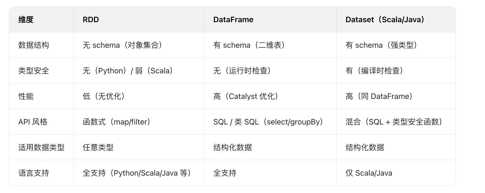

**核心特点**：
1、算子主要作用于 RDD、DataFrame 等分布式数据结构，对集群中的数据进行并行处理。
2、算子本质是 “函数”，接收数据集合作为输入，返回新的处理结果（通常是新的 RDD/DataSet），不修改原始数据（Spark 中的数据集合是不可变的）。
3、分为 “转换算子” 和 “行动算子”：这是 Spark 算子最核心的分类，决 定了代码的执行逻辑

**算子的分类**：
**1、转换算子**
功能：对输入的 RDD 进行处理，生成一个新的 RDD（不触发实际计算，只记录转换逻辑）。
特点：懒执行（Lazy Evaluation）—— 仅在遇到 “行动算子” 时才会真正运行，中间不会产生输出结果。
**常见示例**：
1、map(f)：对 RDD 中的每个元素应用函数 f，返回新的 RDD（如将(key, value)中的 value 加 1）。
2、filter(f)：保留满足函数 f（返回 true）的元素（如过滤出值大于 10 的元素）。
3、groupByKey()/reduceByKey(f)：按 Key 分组或聚合（如按 Key 求和）。
4、join(otherRDD)：关联两个 RDD（类似数据库的 Join 操作）。

**2、行动算子**
**功能**：触发 Spark 作业的实际执行（执行之前定义的所有转换算子），并返回结果（可能是本地数据或输出到外部存储）。
**特点**：立即执行，是 Spark 作业的 “触发点”。
**常见示例**：
1、collect()：将 RDD 中的所有元素收集到 Driver 节点，返回一个本地数组（适合小数据），避免使用 collect 处理大数据，使用预聚合的转换算子减少开销。
2、count()：返回 RDD 中元素的总个数。
3、take(n)：返回 RDD 中前 n 个元素。
4、saveAsTextFile(path)：将 RDD 内容写入文件系统（如 HDFS）。

## Spark SQL优化
* 内存列式存储与内存缓存表
  Spark SQL可以通过cacheTable将数据存储转换为列式存储，同时将数据加载到内存缓存。cacheTable相当于在分布式集群的内存物化视图，将数据缓存，这样迭代的或者交互式的查询不用再从HDFS读数据，直接从内存读取数据大大减少了I/O开销。列式存储的优势在于Spark SQL只需要读出用户需要的列，而不需要像行存储那样每次都将所有列读出，从而大大减少内存缓存数据量，更高效地利用内存数据缓存，同时减少网络传输和I/O开销。数据按照列式存储，由于是数据类型相同的数据连续存储，所以能够利用序列化和压缩减少内存空间的占用。

* 逻辑查询优化
  SparkSQL在逻辑查询优化上支持列剪枝、谓词下压、属性合并等逻辑查询优化方法。列剪枝为了减少读取不必要的属性列、减少数据传输和计算开销，在查询优化器进行转换的过程中会优化列剪枝。

* Join优化
  Spark SQL对Join进行了优化，支持多种连接算法，如BroadcastHashJoin、BroadcastNestedLoopJoin、HashJoin、LeftSemiJoin等等。
  BroadcastHashJoin将小表转化为广播变量进行广播，这样避免Shuffle开销，最后在分区内做Hash连接。这里使用的就是Hive中Map Side Join的思想，同时使用DBMS中的Hash连接算法做连接。


# Spark五大关联策略
选择连接策略的核心原则是尽量避免shuffle和sort的操作，因为这些操作性能开销很大，比较吃资源且耗时，所以首选的连接策略是不需要shuffle和sort的hash连接策略。
* Broadcast Hash Join（BHJ）：广播散列连接
* Shuffle Hash Join（SHJ）：洗牌散列连接
* Shuffle Sort Merge Join（SMJ）：洗牌排列合并联系
* Cartesian Product Join（CPJ）：笛卡尔积连接
* Broadcast Nested Loop Join（BNLJ）：广播嵌套循环连接

连接影响因素：数据集大小

## 运行原理
* 1、Broadcast Hash Join（BHJ）：广播散列连接
* 也称之为Map端JOIN。当有一张表较小时，我们通常选择Broadcast Hash Join，这样可以避免Shuffle带来的开销，从而提高性能。比如事实表与维表进行JOIN时，由于维表的数据通常会很小，所以可以使用Broadcast Hash Join将维表进行Broadcast。这样可以避免数据的Shuffle(在Spark中Shuffle操作是很耗时的)，从而提高JOIN的效率。在进行 Broadcast Join 之前，Spark 需要把处于 Executor 端的数据先发送到 Driver 端，然后 Driver 端再把数据广播到 Executor 端。如果我们需要广播的数据比较多，会造成 Driver 端出现 OOM。
  * 主要分为两个阶段：
    * 广播阶段：通过collect算子将小表数据拉到Driver端，再把整体的小表广播致每个Executor端一份。
    * 关联阶段：在每个Executor上进行hash join，为较小的表通过join key创建hashedRelation作为build table，循环大表stream table通过join key关联build table。
  * 限制条件：
    * 1、被广播的小表大小必须小于参数：spark.sql.autoBroadcaseJoinThreshold，默认为10M。
    * 2、基表不能被广播，比如left join时，只能广播右表。
    * 3、数据集的总行数小于MAX_BROADCAST_TABLE_ROWS阈值，阈值被设置为3.41亿行。
* 2、Shuffle Hash Join（SHJ）：洗牌散列连接
    * 当要JOIN的表数据量比较大时，可以选择Shuffle Hash Join。这样可以将大表进行按照JOIN的key进行重分区，保证每个相同的JOIN key都发送到同一个分区中。
  * 主要分为两个阶段：
    * 洗牌阶段：通过对两张表分别按照join key分区洗牌，为了让相同join key的数据分配到同一Executor中。
    * 关联阶段：在每个Executor上进行hash join，为较小的表通过join key创建hashedRelation作为build table，循环大表stream table通过join key关联build table。
  * 限制条件：
    * 1、小表大小必须小于参数：spark.sql.autoBroadcaseJoinThreshold（默认为10M） * shuffle分区数。
    * 2、基表不能被广播，比如left join时，只能广播右表。
    * 3、较小表至少比较大表小3倍以上，否则性能收益未必大于Shuffle Sort Merge Join。
* 3、Sort Merge Join（SMJ）：洗牌排列合并联系
    * 该JOIN机制是Spark默认的，可以通过参数spark.sql.join.preferSortMergeJoin进行配置，默认是true，即优先使用Sort Merge Join。一般在两张大表进行JOIN时，使用该方式。Sort Merge Join可以减少集群中的数据传输，该方式不会先加载所有数据的到内存，然后进行hashjoin，但是在JOIN之前需要对join key进行排序
  * 主要分为两个阶段：
    * 洗牌阶段：将两张大表分别按照join key分区洗牌，为了让相同join key的数据分配到同一分区中。
    * 排序阶段：对单个分区的两张表分别进行升序排序。
    * 关联阶段：两张有序表都可以作为stream table或build table，顺序迭代stream table行，在build table顺序逐行搜索，相同键关联，由于stream table或build table都是按连接键排序的，当连接过程转移到下一个stream table行时，在build table中不必从第一个行搜索，只需从与最后一个stream table匹配行继续搜索即可。
  * 限制条件：连接键必须是可排序的。
* 4、Cartesian Product Join（CPJ）：笛卡尔积连接
    * 如果 Spark 中两张参与 Join 的表没指定join key（ON 条件）那么会产生 Cartesian product join，这个 Join 得到的结果其实就是两张行数的乘积。
  * 主要分为两个阶段：
    * 分区阶段：将两张大表分别进行分片，再将两个父分片a，b进行笛卡尔积组装子分片，子分片数量：a*b。
    * 关联阶段：会对stream table和build table两个表使用内、外两个嵌套的for循环依次扫描，通过关联键进行关联。
  * 限制条件：
    * left join广播右表，right join广播左表，inner join广播两张表。
* 5、Broadcast Nested Loop Join（BNLJ）：广播嵌套循环连接
  * 主要分为两个阶段：
    * 广播阶段：通过collect算子将小表数据拉到Driver端，再把整体的小表广播致每个Executor端一份。
    * 关联阶段：会对stream table和build table两个表使用内、外两个嵌套的for循环依次扫描，通过关联键进行关联。
  * 限制条件：
    * 仅支持内连接。
    * 开启参数：spark.sql.crossJoin.enabled=true。


## 如何选择JOIN策略
**有等值连接的情况**
有join提示（hints）的情况，按照下面的顺序
* 1.Broadcast Hint：如果join类型支持，则选择broadcast hash join
* 2.Sort merge hint：如果join key是排序的，则选择 sort-merge join
* 3.shuffle hash hint：如果join类型支持， 选择 shuffle hash join
* 4.shuffle replicate NL hint： 如果是内连接，选择笛卡尔积方式

没有join提示(hints)的情况，则逐个对照下面的规则
* 1.如果join类型支持，并且其中一张表能够被广播(值，默认是10MB)，则选择 broadcast hash join
* 2.如果参数spark.sql.join.preferSortMergeJoin设定为false，且一张表足够小(可以构建一个hash map) ，则选择shuffle hash join
* 3.如果join keys 是排序的，则选择sort-merge join
* 4.如果是内连接，选择 cartesian join
* 5.如果可能会发生OOM或者没有可以选择的执行策略，则最终选择broadcast nested loop join

**非等值连接情况**
有join提示(hints)，按照下面的顺序
* 1.broadcast hint：选择bradcast nested loop join.
* 2.shuffle replicate NL hint: 如果是内连接，则选择cartesian product join

没有join提示(hints)，则逐个对照下面的规则
* 1.如果一张表足够小(可以被广播)，则选择 broadcast nested loop join
* 2.如果是内连接，则选择cartesian product join
* 3.如果可能会发生OOM或者没有可以选择的执行策略，则最终选择broadcast nested loop join


## Spark的Join
影响JOIN操作的因素
（1）数据集的大小

参与JOIN的数据集的大小会直接影响Join操作的执行效率。同样，也会影响JOIN机制的选择和JOIN的执行效率。

（2）JOIN的条件

JOIN的条件会涉及字段之间的逻辑比较。根据JOIN的条件，JOIN可分为两大类：等值连接和非等值连接。等值连接会涉及一个或多个需要同时满足的相等条件。在两个输入数据集的属性之间应用每个等值条件。当使用其他运算符(运算连接符不为**=**)时，称之为非等值连接。

JOIN的类型
内连接(Inner Join)：仅从输入数据集中输出匹配连接条件的记录。
外连接(Outer Join)：又分为左外连接、右外链接和全外连接。
半连接(Semi Join)：右表只用于过滤左表的数据而不出现在结果集中。
交叉连接(Cross Join)：交叉联接返回左表中的所有行，左表中的每一行与右表中的所有行组合。交叉联接也称作笛卡尔积，不需要关联条件


# **实践**
## AQE优化 - 小文件治理，解决小文件问题
AQE：自适应查询执行，使Spark计划器在运行时统计信息动态优化和调整查询计划，从而提高Spark SQL的性能。

**一条SQL语句在执行过程中会经历如下阶段**：
通过解析器把SQL语句解析为语法树；通过分析器把语法树解析为分析后的逻辑计划；通过优化器对执行计划进行优化，得到优化后的逻辑计划；逻辑计划通过计划器被转换为物理计划；物理计划在通过查询成本模型评估后，最优的那个将被执行

**AQE实现原理**：
当查询任务提交后，Spark就会根据Shuffle操作将任务划分为多个查询阶段。在执行过程中，上一个查询执行完之后，系统会将查询结果保存下来，这样下一个查询就可以基于上一个查询的结果继续进行计算了。血缘lineger

SQL语句“select x, avg（y）from t group by x order by avg（y）”的执行在两个Shuffle处被划分为两个查询阶段，第一个查询阶段包括扫描（scan）、聚合（aggregate）和Shuffle操作，第二个查询阶段包括聚合和Shuffle操作，最后对数据进行排序（sort）。

查询阶段的边界是进行运行时优化的最佳时机。在查询阶段的边界处，执行间歇、分区大小、数据大小等统计信息均已产生。Spark AQE主要就是通过这些统计信息对执行计划进行优化的，流程如下。

（1）运行没有依赖的查询阶段。
（2）根据新的统计信息优化剩余的查询阶段。
（3）执行其他已经过优化且满足依赖的查询阶段。
（4）重复步骤（2）和（3），不断执行，优化再执行，直到所有查询阶段执行完。


特点：
（1）动态合并 Shuffle 分区：AQE 可以根据实际处理的数据量，在运行时减少 Shuffle 分区的数量。这有助于降低管理过多小分区的开销，从而提升整体查询性能。
（2）处理数据倾斜：AQE 能够检测并处理数据倾斜问题，通过将大的分区拆分成更小的分区，避免某个任务执行时间过长，从而实现负载均衡并缩短查询执行时间。
（3）优化 Join 策略：根据运行时的统计信息，AQE 可以动态调整 Join 的执行策略。例如，当某一张表的数据量足够小可以放入内存时，AQE 会将原本的 Sort-Merge Join 改为 Broadcast Join，以提高执行效率。
AQE参数：

**AQE主要解决**：
（1）统计信息过期或缺失导致估计错误。
（2）收集统计信息的代价较大。
（3）因某些谓词使用自定义UDF导致无法预估。
（4）开发人员在SQL上手动指定hints跟不上数据的变化


## 基于Spark的违法网监线索分析
主要功能是从外卖平台数据中识别食品和药品相关的违法线索。
数据从 StatRocks 按分区读取外卖平台的大数据集，然后根据指定店铺 ID 唯一
的范围进行分区，实现并行处理，再通过店铺标签，将数据分为食品店铺和药品
店铺两类进行处理，分析相关违法线索，然后合并视频和药品线索，区分合法数
据和线索数据，然后输出到本地文件

## 基于Spark的Flink未匹配数据回复程序
主要功能是处理那些 Flink 程序未能正常处理的数据，将有效数据重新发送到Kafka，过期数据则归档保存

程序的核心目标是恢复 Flink 处理失败的未匹配数据：

1、从 HDFS 读取指定路径下的未匹配数据文件

2、检查数据是否在有效期内（15 天）

3、有效数据重新发送到 Kafka 队列，供后续处理

4、过期数据归档到历史路径

5、处理完成后删除原始数据文件

指定 Snappy 压缩算法，减少存储占用和 IO 传输量
读取所有待处理文件的数据到 RDD 

deleteFileOnJobCompletion 方法注册了一个 Spark 监听器，确保作业完成后删除
原始数据文件，避免重复处理

按分区处理数据，每个分区创建一个 Kafka 生产者实例（提高效率）

（1）解析每条数据的创建时间

（2）计算数据是否在 15 天有效期内

（3）有效数据发送到 Kafka 指定主题，等待重新处理

（4）过期数据收集到缓冲区，合并为一个文件，保存到历史路径

（5）通过 Spark 监听器机制，在作业完成时（onJobEnd）删除原始数据文件

（6）确保数据处理完成后清理源文件，避免重复处理

**核心设计思路**

1、数据恢复机制：针对 Flink 处理失败的数据，提供二次处理机会

2、有效期控制：只处理 15 天内的数据，避免无效处理过期数据

3、资源优化：
（1）按分区创建 Kafka 生产者，减少连接开销
（2）启用数据压缩，降低存储和传输成本
（3）处理完成自动清理源文件，避免磁盘空间浪费
4、容错设计：通过 Spark 监听器确保文件删除操作的可靠性

## 基于Spark的数据处理与ES上传程序
流程：主要功能是从 HDFS 读取 CSV 格式的第三方平台数据，补充 MySQL
中的公司信息后，转换为符合 ES 索引要求的格式并上传到 ES。

核心流程：

1、从 HDFS 读取第三方平台（如电商、商户平台）的 CSV 数据；

2、结合 MySQL 数据库补充公司详细信息（如 company_id、province_id 等）；

3、通过 Spark SQL 和 UDF（用户自定义函数）转换数据格式，补充 ES 所需字段；

4、将处理完成的数据上传到指定的 Elasticsearch 索引。

**详细步骤**

1、HikariCP 高效管理连接配置连接池（最小空闲连接、超时时间）

2、调用外部模型输入从 CSV 中获取的公司名称、店铺名称、店铺 URL、平台
名称，然后将公司名称发送模型反馈给公司详细信息

3、与 Mysql 交互返回 company_id 以及 companyjson 的详细信息（经营范围、地
区 ID）添加到 row 中
对每个数据分区创建一个 MySQL 连接池（而非每行创建连接），减少连接开
销；
通过 CompanyWanjianUtils 工具类与 MySQL 交互，实现 “查询 - 插入 - 更新” 公司信息的逻辑；
从 MySQL 获取 company_id，从 companyjson（可能来自外部接口）补充公司经
营范围、地区 ID 等详细字段，丰富数据维度。

4、转换为 DataFrame 并补充 ES 所需字段
（1）定义新的 Schema
（2）创建 DataFrame 并主色临时视图（注册为临时视图，方便于 SQL 查询）
（3）定义用户自定义函数（UDF），生成 ES 索引必要的字段
（4）通过 SQL 组装 ES 数据，然后上传到 ES

**核心设计亮点**

高效连接管理：使用 HikariCP 连接池管理 MySQL 连接，避免频繁创建 / 关
闭连接的开销；

分区级处理：mapPartitions 按分区处理数据，减少分布式环境下的资源消耗；

数据丰富化：结合 MySQL 和外部接口补充公司详细信息，提升数据价值；

灵活转换：通过 UDF 动态生成 ES 所需字段（如平台编号、时间、唯一 ID），
适配 ES 索引结构。

## 识别店铺是否是花卉店铺的job
提交 Spark 应用程序到 YARN 集群的 bash 脚本，主要功能是定义并执行
spark-submit 命令，将指定的 Spark 应用程序部署到集群运行。

将筛选后的 DataFrame 注册为 Spark 中的临时视图，临时视图允许后续通过
SQL 语句直接查询该数据集

按店铺聚合商品→识别商品是否为花卉→筛选出至少有 2 个花卉商品的店铺→保存结果
1-淘宝、2-1688、3=天猫

1、根据命令行获取 platformId，先筛选出特定平台的数据。

2、根据平台 ID，查询 StarRocks 获取呈贡区状态正常的店铺数据，并创建视图。

3、读取电商商品数据，并创建视图。

4、两个视图，根据 shop_id 和 platform 关联聚合，得到每个店铺的商品信息。

5、识别花卉商品，判断商品是否为花卉。

6、从筛选结果中提取店铺信息，保存到 HDFS。

wj_dianshang_shop_goods 网监电商店铺商品 1 亿 6 千万
wj_shop_dianshang 网监电商店铺 4 千万


## 基于Bloom Filter算法的Runtime Filter Join 优化机制（https://developer.jdcloud.com/article/2344）
问题及现状：
Spark SQL的任务量占比较高（90%+），在生产场景中，我们发现有很多SQL业务场景需要一张小表(相对小)Inner / Left Outer Join 一张大表。这里的小表是指不会触发BroadcastHashJoin，默认走SortMergeJoin，SortMergeJoin 的实现逻辑：首先，两张表会分别根据join条件确定每条记录的key，基于该key做shuffle write将可能join到一起的记录分到同一个分区中；其次，在shuffle read阶段将两个表中相同分区的数据进行拉取并进行sort merge；最终，将满足join条件的数据进行join输出，其中满足join条件与具体SQL join策略相关，对于上面提及的场景，满足join条件是以左侧小表为基准的，即在两表join时只会将大表侧满足与小表侧数据相等条件的数据保留，对于大表侧不符合join条件的数据，我们认为是无效数据，由于无效数据参与shuffle、sort merge计算，一方面影响任务时效，另一方面无效的shuffle数据会增加集群磁盘IO、网络IO等负载，同时浪费大量的计算资源。

某商品SKU表(小表)与右侧某商品SKU类目表(大表)进行Inner Join，通过Spark DAQ执行计划我们可以看出，二者走的是SortMergeJoin，其中左侧小表过滤后参与计算的数据量大概15亿条、shuffle量大概是168MB；而右侧大表的数据量大概是1558亿条、shuffle量高达2.5TB，通过最终join输出，可以看到满足join条件的数据仅7000多万，结合上面的分析， 说明大表侧有大部分数据是不满足join条件的，但这些无效数据都参与shuffle和sort merge环节，不但影响任务时效，还会增加集群负载等。


# 参数
## Spark 批处理作业清理并处理指定日期的广告相关数据 - bash脚本（**提交作业参数**）
```bash
# 定位根目录：通过脚本所在位置向上两级目录（../../）获取项目根目录的绝对路径
base_dir="$(cd `dirname ../../`; pwd)"
echo "根目录：${base_dir}"  # 打印根目录路径，用于确认路径正确性

# 引入外部配置文件（日期参数配置）
source ${base_dir}/bin/config/date_param.sh

# 打印当前处理的任务名（包含日期变量day）
echo "deal_cover_data_by_media_$day"

# 将day变量转换为"YYYYMMDD"格式的日期（如20240812），赋值给today
today=`date -d"${day}" +%Y%m%d`

main(){
  # 1. 清理HDFS上指定日期的旧数据（如果存在）
  hadoop fs -rm -r viewfs://ss-hadoop/user/hdp-ge-wfgg/data-lake/monitor_tiao_ci_data/${today}
  hadoop fs -rm -r viewfs://ss-hadoop/user/hdp-ge-wfgg/data-lake/monitor_tiao_shu_data/${today}

  # 2. 提交Spark作业处理数据
  spark-submit \
  --class com.qihoo.ad.cover.DealCoverDataByMedia\  # Spark主类全路径
  --master yarn \  # 运行模式：YARN集群
  --deploy-mode cluster  \  # 部署模式：集群模式（Driver在YARN节点上运行）
  --executor-memory 6g  \  # 每个Executor的内存
  --conf spark.executor.memoryOverhead=1g \  # Executor的堆外内存
  --conf spark.memory.fraction=0.8 \  # 用于执行和存储的内存比例
  --conf spark.memory.storageFraction=0.2 \  # 存储内存占总内存的比例
  --conf spark.memory.offHeap.enabled=true \  # 启用堆外内存
  --num-executors 20  \  # Executor数量
  --executor-cores 2 \  # 每个Executor的CPU核心数
  --queue hdp-ge-wfgg \  # YARN队列名（指定资源队列）
  --name deal_cover_data_by_media \  # Spark作业名称（YARN上显示）
  ${base_dir}/ultron-spark-hdp-ge-wfgg-2.0-SNAPSHOT.jar ${today}  # 作业JAR包路径和参数（today）
  #>/dev/null 2>&1 &  # 注释掉的后台运行配置（当前为前台运行）
}
```

## sparkSession参数
```scala
// 创建SparkSession构建器，用于配置和实例化SparkSession
// SparkSession是Spark 2.0+引入的统一入口，用于处理DataFrame、Dataset和SQL操作
val sparkSession = SparkSession.builder()
      // 配置SQL操作中shuffle的分区数量为100
      // 影响join、groupBy等会产生shuffle操作的并行度，默认值为200
      // 调整此值可根据集群规模和数据量优化性能
      .config("spark.sql.shuffle.partitions", 100)
      
      // 配置内存中用于缓存数据的比例为50%
      // Spark内存分为存储区(缓存RDD、DataFrame等)和执行区(计算时使用)
      // 0.5表示存储区占总可用内存的50%，执行区占剩余部分
      .config("spark.memory.storageFraction", 0.5)
      
      // 配置Spark可用于执行和存储的内存占JVM堆内存的比例为80%
      // 剩余20%内存用于其他开销(如对象创建、元数据等)
      // 该配置影响Spark能使用的总内存上限
      .config("spark.memory.fraction", 0.8)
      
      // 启用基于HDFS的shuffle功能
      // 开启后shuffle中间数据会存储在HDFS上，而不是本地磁盘
      // 适用于需要数据持久化或跨节点共享shuffle数据的场景
      .config("spark.shuffle.hdfs.enabled", true)
      
      // 设置应用程序名称为"beijing_ad_cover"
      // 名称会显示在Spark UI和日志中，便于识别和监控
      .appName("beijing_ad_cover")
      
      // 创建或获取已存在的SparkSession实例
      // 如果当前环境中已有SparkSession，则获取它；否则根据上述配置创建新实例
      .getOrCreate()
```

区别：
| **维度**     | `SparkSession` 中配置的参数                                | `spark-submit` 中指定的参数                          |
| ------------ | ---------------------------------------------------------- | ---------------------------------------------------- |
| **作用时机** | 应用程序代码运行时生效（动态配置）                         | 应用程序启动前生效（静态配置，启动时初始化）         |
| **配置范围** | 仅对当前 `SparkSession` 实例生效                           | 对整个 Spark 应用（包括 Driver 和 Executor）全局生效 |
| **配置类型** | 主要是**应用级参数**（如 SQL 引擎、数据处理相关配置）      | 主要是**集群资源参数**（如内存、CPU、部署模式等）    |
| **优先级**   | 低于 `spark-submit` 参数（若冲突，以 `spark-submit` 为准） | 最高优先级（覆盖配置文件和代码中的同名参数）         |


## 控制Spark reduce缓存 调优shuffle
参数spark.sql.shuffle.partitions 决定 默认并行度200

spark.reducer.maxSizeInFilght  此参数为reduce task能够拉取多少数据量的一个参数默认48MB，当集群资源足够时，增大此参数可减少reduce拉取数据量的次数，从而达到优化shuffle的效果，一般调大为96MB,，资源够大可继续往上调。

spark.shuffle.file.buffer  此参数为每个shuffle文件输出流的内存缓冲区大小，调大此参数可以减少在创建shuffle文件时进行磁盘搜索和系统调用的次数，默认参数为32k 一般调大为64k。


## 优化参数配置
**spark.sql.shuffle.partitions**

spark.default.parallelism只有在处理RDD时有效.spark.sql.shuffle.partitions则是只对SparkSQL有效.

shuffle partitions的数量默认为200，,这个参数是需要进行调整的而且Spark中并不会根据数据量进行动态的设置，需要我们基于数据规模进行调整。> 小数据集，200数值显然有些大，大部分时间都花费在调度，任务执行本身花费时间较小> 大数据集，200数值有些小，不能充分利用集群资源建议：建议设置初始分区的1.5-2倍之间

**spark.sql.parquet.compression.codec**
park.sql.parquet.compression.codec 默认是snappy。当写parquet文件的时候设置压缩格式。如果在option或者properties里配置了compression或者parquet.compression优先级依次是：compression，parquet.compression，spark.sql.parquet.compression.codec。

**spark.reducer.maxReqsInFligh**
此配置限制在任何给定点获取块的远程请求数。当集群中的主机数量增加时，可能会导致到一个或多个节点的大量入站连接，从而导致worker在负载下失败。通过允许它限制fetch请求的数量，可以缓解这种情况。

**spark.dynamicAllocation.minExecutors**
如果启用动态分配，在executor空闲spark.dynamicAllocation.executorIdleTimeout(默认60s)之后将被释放。

spark.dynamicAllocation.minExecutors和spark.dynamicAllocation.maxExecutors分别为分配的最小及最大值，spark.dynamicAllocation.initialExecutors为初始分配的值，默认取值为minExecutors。在--num-executors参数设置后，将使用此设置的值作为动态分配executor数的初始值。

**spark.default.parallelism**
参数说明：该参数用于设置每个stage的默认task数量。这个参数极为重要，如果不设置可能会直接影响你的Spark作业性能。参数调优建议：Spark作业的默认task数量为500~1000个较为合适。很多同学常犯的一个错误就是不去设置这个参数，那么此时就会导致Spark自己根据底层HDFS的block数量来设置task的数量，默认是一个HDFS block对应一个task。通常来说，Spark默认设置的数量是偏少的（比如就几十个task），如果task数量偏少的话，就会导致你前面设置好的Executor的参数都前功尽弃。试想一下，无论你的Executor进程有多少个，内存和CPU有多大，但是task只有1个或者10个，那么90%的Executor进程可能根本就没有task执行，也就是白白浪费了资源！因此Spark官网建议的设置原则是，设置该参数为num-executors * executor-cores的2~3倍较为合适，比如Executor的总CPU core数量为300个，那么设置1000个task是可以的，此时可以充分地利用Spark集群的资源


## Spark Session参数设置
1、Config（"spark.sql.shuffle.partitions", 100）：设置 SQL shuffle 操作（join、group
by）分区数据量，默认值是 200，但是为避免分区过多导致的任务调度开销或分
区过少导致的负载不均衡，我们生产设置的是 100。

2、Config（"spark.memory.storageFraction", 0.5）：缓存数据（RDD 缓存、DataFrame
缓存）的内存占总内存的比例，设置 0.5（50%）的原因就是：一半用于缓存数
据，一半用于执行计算（shuffle、聚合等到操作），达到一个平衡的配置。

3、config("spark.memory.fraction", 0.8)：用于执行和存储的内存占 JVM 堆内存的
比例。设置 0.8（80%）的原因：保留 20%的堆内存给系统和其它操作使用，避
免 OOM（内存溢出），同时让 Spark 能使用大部分内存提高性能

4、config("spark.shuffle.hdfs.enabled", true)，启用 HDFS 作为 shuffle 数据的存
储系统，local 的时候一般关闭。

5、appName("chenggong_flower_shop_filter")，设置 appName，后续在 Spark UI
中识别和监控作业（applicationId 任务 id）
实际应用中根据具体的集群配置、数量大小和作业特性来调整和优化。
