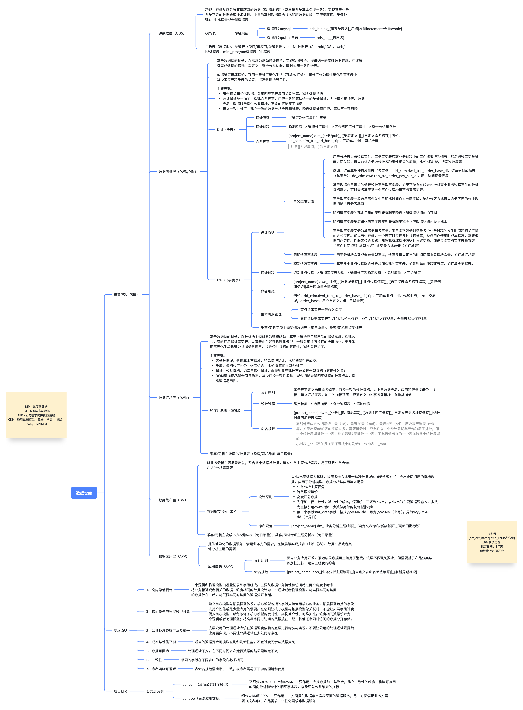
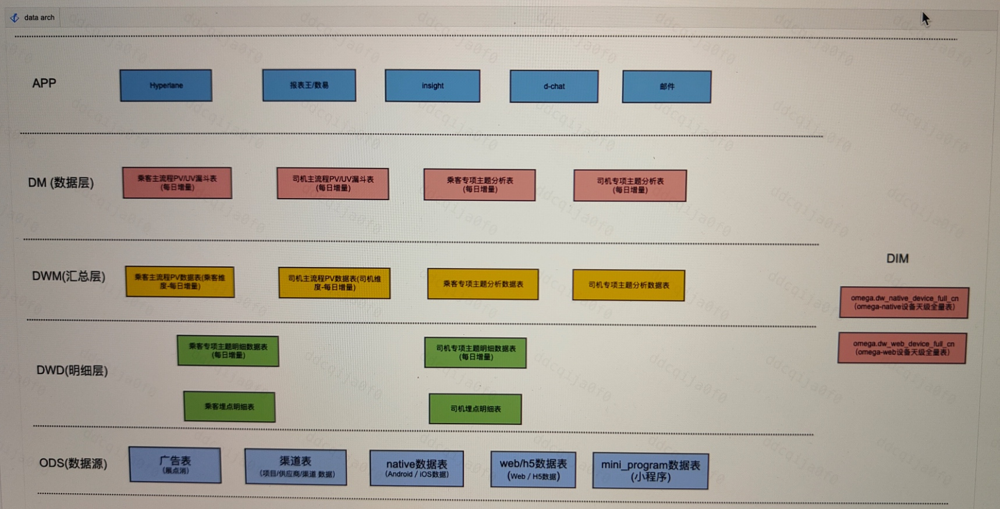
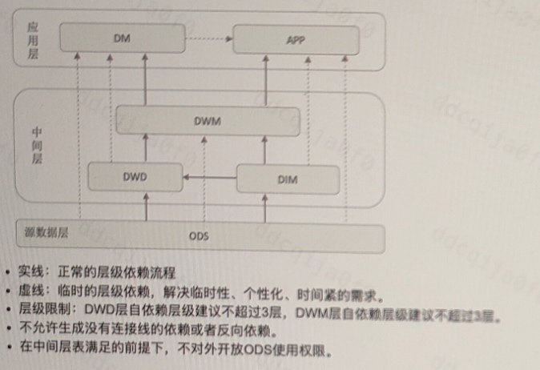
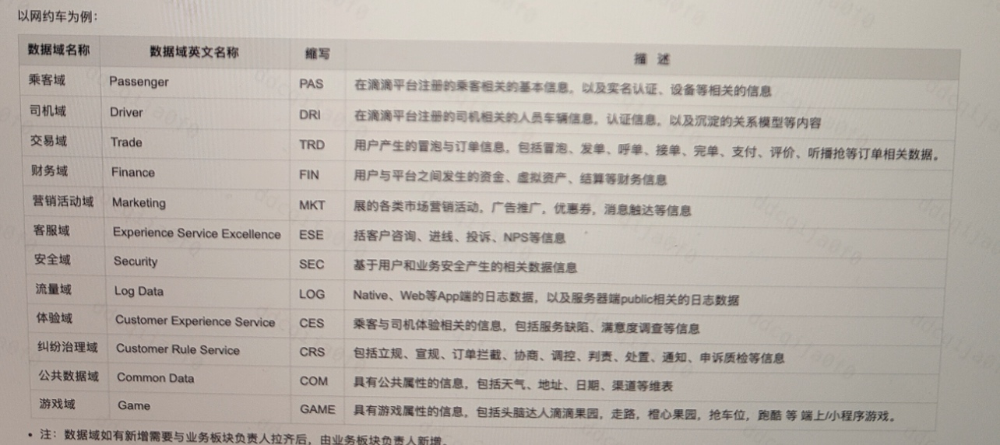

# 数据仓库
- [数据建模](#数据建模)
  - [为什么要数据建模](#为什么要数据建模)
  - [主题域划分](#主题域划分)
  - [数仓建模的流程（维度建模的理论）](#数仓建模的流程（维度建模的理论）)
- [Kimball模型](#kimball模型)
  - [**事实表和维度表**](#事实表和维度表)
  - [假设设计一个电商的“订单分析”数据集市，请用Kimball理论说明你的设计思路，包含哪些表？](#假设设计一个电商的“订单分析”数据集市，请用kimball理论说明你的设计思路，包含哪些表？)
  - [**数仓建模常用的分区表、全量表、快照表、增量表、拉链表的区别**](#数仓建模常用的分区表、全量表、快照表、增量表、拉链表的区别)
- [数仓](#数仓)
  - [**讲一下数据仓库核心范式（维度建模/星型模型/雪花模型）**](#讲一下数据仓库核心范式（维度建模星型模型雪花模型）)
  - [为什么有了Mysql，还需要数据仓库（Hive）呢？](#为什么有了mysql，还需要数据仓库（hive）呢？)
  - [**数仓分层**](#数仓分层)
  - [数仓分层架构](#数仓分层架构)
  - [层级依赖](#层级依赖)
  - [数据域划分](#数据域划分)
  - [**数仓为什么要分层**](#数仓为什么要分层)
  - [Onedata和kimball模型区别](#onedata和kimball模型区别)
  - [如何判断一个数仓模型的好坏？](#如何判断一个数仓模型的好坏？)
  - [为什么要用Iceberg](#为什么要用iceberg)
  - [**广告业务的数仓分层**](#广告业务的数仓分层)
  - [违法网监 - 北京局广告数据处理](#违法网监北京局广告数据处理)
  - [广告 - 电商](#广告电商)
  - [在数据的展示层，每个展示层，如何保证写数据不会出错，或者是ODS中原始数据，提供给BI的数据是准确的，如何测试](#在数据的展示层，每个展示层，如何保证写数据不会出错，或者是ods中原始数据，提供给bi的数据是准确的，如何测试)
  - [监控有各个平台的埋点，如何拿到各个平台的数据](#监控有各个平台的埋点，如何拿到各个平台的数据)
  - [**StarkRock和Mysql的区别**](#starkrock和mysql的区别)
  - [OLAP（分析处理）和OLTP（事务处理）的区别](#olap（分析处理）和oltp（事务处理）的区别)
  - [技术选型](#技术选型)
  - [Druid、ClickHouse、Doris、StarRocks的区别与分析](#druid、clickhouse、doris、starrocks的区别与分析)
    - [广告业务的核心OLAP需求](#广告业务的核心olap需求)
    - [StarRocks在广告场景的优势](#starrocks在广告场景的优势)
- [StarRocks](#starrocks)
  - [基础组成](#基础组成)
  - [架构组成](#架构组成)
  - [应用场景](#应用场景)
  - [OLAP架构](#olap架构)
  - [向量化引擎](#向量化引擎)
  - [CBO：基于代价的优化器](#cbo：基于代价的优化器)
  - [分布式Join](#分布式join)
  - [实际问题](#实际问题)
  - [倒排索引](#倒排索引)

# 数据建模
目的：有序、有结构地分类组织和存储我们的数据

## 为什么要数据建模
更好的去组织和存储我们的业务数据，以便能够在存储和计算的，性能、成本、效率方面，以及数据质量之间取得
最佳的一个平衡状态。

## 主题域划分
主要是基于业务划分，一级主题域和二级主题域，涉及内容很多

1、监测对象主题域
（1）商品
（2）店铺
（3）商家
（4）平台
（5）公司

2、数据采集主题域

3、违法识别主题域

4、线索审核主题域

5、处置反馈主题域

## 数仓建模的流程（维度建模的理论）
首先是**业务需求调研**。得先明确平台的核心分析场景，比如 “查询近 7 天哪些类型的违法广告线索增长最快”“某平台的虚假宣传类线索占比多少”“不同地区的违法广告分布情况”。这一步要提炼出关键指标，像违法线索数、确认违法数、线索处理时效，还有核心分析维度，比如时间、广告类型、发布平台、违法类别、地区等。

第二步是**主题域划分**。根据广告监测的业务流程，拆成几个核心主题域：比如 “广告资源主题域”（存储被监测的广告基础信息）、“违法识别主题域”（记录识别出的违法线索）、“线索处置主题域”（跟进线索的处理过程）。这样每个域聚焦一块业务，边界清晰。

第三步是**设计事实表**。核心事实表应该是 “违法广告线索事实表”，对应 “识别出违法线索” 这个业务动作。里面会包含度量值，比如线索数量（每条记录对应 1 条线索）、线索风险评分；然后关联各维度的外键，像广告 ID、平台 ID、违法类型 ID、识别时间 ID、地区 ID 等。因为线索是实时产生的，所以这是一个事务型事实表，每条线索生成时就记录一行。

第四步是**设计维度表**。围绕事实表的分析角度来建：
* 时间维度表：包含年月日、周、季度，方便按不同时间粒度查询（比如 “每日违法线索趋势”）；
* 广告维度表：存储广告的内容摘要、形式（图文 / 视频 / 直播）、涉及商品等属性；
* 发布平台维度表：记录平台名称、类型（网站 / APP / 短视频）、所属公司等；
* 违法类型维度表：按法规分类（比如虚假宣传、违禁内容、不正当竞争），关联具体法规条款；
* 地区维度表：广告投放的地域范围（省 / 市 / 区）。
* 这里要注意处理缓慢变化维度，比如平台信息更新了，用 SCD2 保留历史，方便追溯 “某平台整改前后的违法线索变化”。

第五步**是物理实现优化**。考虑到广告数据量大，事实表按 “识别时间” 分区（比如按天），查询时能快速定位到某时间段的线索；对维度表的主键（如平台 ID、违法类型 ID）建索引，提升关联效率；存储格式用 Parquet，配合压缩，节省空间的同时加快分析速度。

最后是**验证与迭代**。用实际业务场景测试，比如 “查 3 月份短视频平台中，涉及食品的虚假宣传线索有多少”，看模型能否快速响应；如果业务新增 “广告发布者资质” 这个分析维度，就扩展广告维度表，保证模型能适配新需求。

整个流程核心是让 “违法广告线索” 这个业务核心，通过事实表 + 多维度的组合，支持灵活的查询分析，帮监管人员快速定位问题广告的特征和趋势。

# Kimball模型
Kimball 模型也叫 “维度建模”，核心只有两类表，所有分析都围绕这两类表展开，结构非常清晰。

## **事实表和维度表**
简单说，事实表存 “业务事件的度量”，比如一笔订单的金额、数量；维度表存 “描述性信息”，比如订单对应的客户、商品、时间信息。

* 事实表特点：行多列少，通常有外键关联维度表，字段以数值型度量为主（如销售额、订单数），还会包含退化维度（如订单号，没必要单独建维度表）。作用是承载分析的 “数据核心”，所有指标计算都围绕它展开。
* 维度表特点：行少列多，字段多为文本或分类值（如客户姓名、商品类别），会有层级结构（如时间维度的年 - 季 - 月 - 日）。作用是提供 “分析的视角”，比如按客户维度看销售、按时间维度看趋势。

区别：
事实表：核心是“**度量**”，也就是业务中可量化的数据，行多列少，无主键，通过外键关联维度表，变化频率高
维度表：核心是“**描述**”，来解释事实表中度量的上下文信息，行少列多，有唯一主键，被事实表关联，变化频率低

## 假设设计一个电商的“订单分析”数据集市，请用Kimball理论说明你的设计思路，包含哪些表？
首先会先明确业务过程是 “订单创建”，然后按 “选事实表→定维度→处理度量” 的步骤来设计：
* 确定事实表：核心是订单事实表，存每一笔订单的原子数据（比如订单 ID、下单时间、客户 ID、商品 ID、支付金额、订单数量）。这里会用事务型事实表，因为订单是一次性事件，每笔订单一条记录。
* 设计维度表：至少包含 4 个核心维度，
    * 时间维度表：按天粒度，存年、季、月、周、是否节假日等，关联订单的 “下单时间”；
    * 客户维度表：存客户 ID、姓名、注册时间、所属区域、会员等级等；
    * 商品维度表：存商品 ID、名称、类别（一级 / 二级）、品牌、单价、库存状态等；
    * 支付维度表：存支付 ID、支付方式（微信 / 支付宝）、支付状态、支付渠道等；
* 处理度量和指标：事实表里的度量选 “原子级” 的，比如 “支付金额”“订单数量”，不提前算汇总值（比如 “今日总销售额”），汇总交给后续的 OLAP 工具或报表，这样模型更灵活。

最后整体是星型结构，订单事实表在中间，四个维度表围绕它，关联查询很方便，比如 “查 2024 年 Q3，北京地区会员客户用微信支付的手机类商品订单总额”，直接关联四个维度就能算出来。

## **数仓建模常用的分区表、全量表、快照表、增量表、拉链表的区别**
全量表：记录每天的所有的最新状态的数据（日期分区）
增量表：记录每天的新增数据，增量数据是自上一次以来发生变化的新数据。
快照表：按日分区，记录截止数据日期的全量数据
切片表：切片表根据基础表，往往只反映某一个维度的相应数据。其表结构与基础表结构相同，但数据往往只有某一维度，或者某一个事实条件的数据
拉链表：记录每条信息的生命周期，当一条记录的生命周期结束，就会重新开始一条新的记录，并把当前日期放入生效开始日期。如果当前信息至今有效，则在生效结束日期中填入一个极大值（如9999-99-99），一般在数仓中通过增加start_date ,end_date 两列来表示。

**为什么要做拉链表？**

| 表类型 | 核心特征                        | 数据范围               | 更新方式                | 历史追溯能力         | 典型场景                   |
| ------ | ---------------------    ---------- | ---------------------- | ----------------------- | -------------------- | -------------------------- |
| 分区表 | 按分区键拆分存储（物理优化）    | 取决于关联的逻辑表类型 | 随逻辑表类型变化        | 无（仅优化存储）     | 时序数据按天分区，按照dt、region分区           |
| 全量表 | 只保留最新全量数据              | 当前所有有效数据       | 全量覆盖历史数据，只保留最新全量                | 无（仅最新）         | 字典表、小体量基础表       |
| 快照表 | 保留多个时间点的全量副本        | 每个时间点的全量数据   | 周期性新增快照（如每日凌晨）          | 有限（仅快照时间点） | 每日商品库存快照           |
| 增量表 | 只存储新增 / 变更数据，不包含完整历史           | 周期内的变化数据       | 追加变更数据            | 无（需合并全量）     | 订单新增记录、用户行为增量 |
| 拉链表 | 记录生命周期（生效 / 失效时间） | 全量历史 + 当前数据    | 更新旧记录 + 插入新记录 | 完整（任意时间点）   | 用户状态变更、订单生命周期 |

- 需优化查询性能：用**分区表**（结合其他表类型）。
- 仅需最新全量且数据量小：用**全量表**。
- 需固定时间点历史快照：用**快照表**。
- 数据量大且变化频繁：用**增量表**（需配套全量存储）。
- 需完整历史追溯且平衡成本：用**拉链表**。

# 数仓

## **讲一下数据仓库核心范式（维度建模/星型模型/雪花模型）**
维度建模：数据仓库的核心思想

核心是将数据划分为 “事实表” 和 “维度表”，通过关联这两类表实现灵活的数据分析。
* 事实表：存储业务过程的度量数据（如销售额、点击量、曝光量），是分析的核心指标。
    * 特点：数据量大、更新频繁，通常包含与维度表关联的外键（如用户 ID、时间 ID）和可聚合的度量字段（如金额、次数）。
* 维度表：存储描述性信息（如用户属性、商品分类、时间周期），用于对事实表的度量进行 “切片、切块” 分析。
    * 特点：数据量小、更新频率低，包含主键（与事实表外键关联）和多个描述字段（如用户的年龄、性别、地域）。

核心目标：让业务人员能直观理解数据关系，同时通过减少表关联提升查询效率（尤其适合复杂的聚合分析）。

1、星型模型（广告业务最常用）
* 事实表：广告投放事实表（核心），存储 “媒体覆盖量、违法级别、违法次数” 等度量，包含外键：
  * 广告计划 ID、用户 ID、媒体 ID、时间 ID；
  * 度量字段：违法次数、各个平台覆盖率、违法率。
* 维度表（直接关联事实表，扁平化设计）：
  * 广告计划维度表（计划 ID、广告主 ID、预算、定向条件、创意ID）；
  * 用户维度表（用户 ID、设备类型、地域、兴趣标签）；
  * 媒体维度表（媒体 ID、媒体名称、广告位类型、定价方式）；
  * 时间维度表（时间戳、日期、小时、周、月）。
* 优势：适合快速计算 “某广告计划在某媒体的覆盖率” 等场景，查询效率高，符合广告实时优化需求。
使用简单、查询速度快

2、雪花模型（广告业务中少用，仅特定场景）
我们没有这种场景
维度表按业务层级拆分，需跨多层维度表关联（如事实表→城市表→省份表→国家表），IO 开销大，查询速度慢。
仅在存储成本极高、维度层级固定且复杂的场景（如部分金融、政务数据），以牺牲性能换取低冗余和数据一致性。

## 为什么有了Mysql，还需要数据仓库（Hive）呢？
MySQL 管 “监测链路中的单点业务记录”，数据仓库管 “监测全局的数据分析与决策” 
Mysql缺点：
* 无法承载 “多源异构 + 海量数据” 的存储
* 无法支撑 “实时流数据处理” 与 “低延迟预警”：若强行用 MySQL 处理流数据，会导致 “写入阻塞、预警延迟”，错过违法广告的最佳拦截时机。
* MySQL 的关联能力局限于 “2-3 张表的简单 Join”，且不支持 “非结构化数据的索引与检索”（如无法快速匹配 “某张广告图片是否与历史违禁图片相似”）；同时，MySQL 不支持数据版本管理，若广告数据被篡改（如投放方删除违规记录），无法回溯原始状态，导致 “证据失效”。

## **数仓分层**
通常是根据业务类别、数据来源、数据用途等多个维度，对我们的业务数据进行的区域划分，我们将同类型数据存放在一起，便于后续数据分析。不同使用目的数据，分类标准不同。例如，电商行业通常分为广告违法内容域、违法线索处置域等。

阿里的onedata模型，对数据进行分层，分别为ODS/DWD/DIM/DWT/DWA/APP等层。
数仓的底层存储引擎为Kafka，分区数、副本数、

1、ODS（原始数据层） --> 从业务系统Mysql抽取的未加工增量原始数据（埋点数据），用HDFS存储，在Hive中简历外部表映射，不做任何映射
2、DWD（明细数据层） --> 处理ODS层的脏数据据(填充缺失值、纠正错误格式)，补全确实值，过滤无效数据、统一字段格式（如unix时间戳转化为标准时间），通过维度建模（星型模型）整合多源数据，避免重复存储
3、DWS（轻度汇总层） --> 将高频使用的聚合逻辑**提前计算**；通过宽表整合多维度数据（如将用户、商品、时间维度合并为dws_user_goods_day），减少JOIN次数，按照时间和地区进行业务系统的实时报表需求
4、ADS（数据应用层） --> BI报表、算法模型定制数据

## 数仓分层架构

## 层级依赖

## 数据域划分

## **数仓为什么要分层**
**数仓的本质**：通过空间换时间、通过分层解耦、通过规范统一口径，解决原始数据直接使用的重复计算、口径混乱、耦合度高、维护困难、查询低效等问题，最终实现数据可复用、可治理、可追溯、高效稳定、业务快速响应
1. 解耦：隔离源与应用，业务变更不影响上层
2. 复用：统一计算，避免重复造轮子。把公共的清洗逻辑、公共的指标、公共的宽表沉淀在中间层，全公司所有业务、报表、算法都复用这一层数据。
3. 规范：统一数据口径，保障数据一致性。分层后建立统一的数仓规范：命名规范、字段规范、主键规范、指标规范、编码规范。
4. 高效：空间换时间，加速查询与分析。通过分层做预计算、预聚合、宽表化、索引优化
5. 治理：血缘清晰，易监控、易排错、易运维。每一层都有明确职责，数据血缘从 ODS→DWD→DWS→ADS 一目了然；

## Onedata和kimball模型区别
Onedata追求“全局统一”，一份数据，服务所有业务，Kimball追求“业务驱动”，为每个业务场景构建独立数据集市
**分层结构**：
* OneData 模型：严格的 “三层架构”，强制全局统一
1、ODS 层：存储原始数据，保留数据原貌（与 Kimball 类似）。
2、公共层（CDW）：核心层，分为 “维度层（DIM）” 和 “事实层（FACT）”，所有业务共享。
    * 维度层（DIM）：全局统一维度（如 “用户”“商品”，全公司只用一套用户维度表）。
    * 事实层（FACT）：按业务过程整合事实（如 “下单”“支付”，数据粒度、指标定义全公司统一）。

    3、应用层（ADS）：基于公共层，为具体业务场景（如电商促销、用户运营）提供数据服务，不重复存储基础数据。

* Kimball 模型：“四层架构”，灵活适配业务
1、ODS 层：存储原始数据（与 OneData 一致）。
2、整合层（Staging）：对原始数据做轻量清洗，但不做全局整合（仅为后续集市服务）。
3、数据集市层（Data Mart）：按业务域拆分（如 “销售集市”“库存集市”“用户集市”），每个集市独立设计维度和事实表。
4、报表层：直接基于数据集市生成业务报表，无需依赖公共层。

**维度与指标管理**：
OneData 模型：
* 维度 “全局唯一”：同一维度（如 “用户”）只在公共层 DIM 表中定义一次，所有业务场景必须复用，不允许各业务单独建用户表。
* 指标 “统一口径”：建立全局指标库（如 “GMV = 下单金额 - 退款金额”），所有业务用同一公式计算，避免 “同一指标，不同结果”。

Kimball 模型：
* 维度 “业务专属”：不同数据集市可建自己的维度表（如 “销售集市的用户表” 含 “购买偏好”，“运营集市的用户表” 含 “活跃标签”），允许维度冗余。
* 指标 “业务自定义”：同一指标（如 “GMV”），销售集市可能含 “优惠券抵扣”，财务集市可能不含，按业务需求灵活定义。

**使用场景**：
OneData：若企业业务线多、数据孤岛严重、指标打架频繁（如多部门对 “活跃用户” 定义不同），优先选OneData，长期来看能减少数据冗余和维护成本。
Kimball：若企业业务简单、需要快速落地分析需求（如仅需做 “月度销售报表”），能以更低成本快速满足业务需求。

## 如何判断一个数仓模型的好坏？
周期（一天/一周/一个月内）、平台覆盖率、广告高质量条数

**1、高内聚低耦合**：从业务特性和访问特性两个角度：将业务相关、粒度相同的数据设计为一个物理模型；将高概率同时访问的数据放在一起，将低概率同时访问的数据分开存储。

**2、核心模型与拓展模型分离**，比如做宽表，基于业务的数据，是否违法这些标签，要不要与业务域的数据混合在一起，主要是取决于，加入之后，不会对这个模型的时间造成过多的延迟，比如说，我们核心业务这边做出来的业务的标签比较大，大概五六点产出，如果再从其他主题域里面加工出来，放在一张表里面的话，那它的产出时间如果一下子，延迟到了七八点，这部分就不能放了，这会导致我们最核心的那部分标签延迟了，所以说这个就需要根据业务的核心程度，去做核心模型与拓展模型分解。如果说，不会超过20min延迟，并且业务也不是特别边缘，我觉得是可以合并进去的，这样其实也保证了我们核心模型不会过于的混乱，不会破坏我们核心架构的简洁性和可读性
 
**3、公共处理逻辑下沉及单一**：就看我们的公共逻辑是不是散落在很多的模型中间，同样的口径数据存放在一起，如果说有从ODS层捞出来的数据，既放在DWD
 
**4、成本与性能平衡**：适当的数据冗余可换取查询和刷新性能，不宜过度冗余与数据复制，如果说不考虑冗余，那么我们就可以把一张宽表建的很大

**5、命名清晰、可读性强**

## 为什么要用Iceberg
* Iceberg提供事务机制
* Iceberg支持Schema演进：允许添加/删除字段、修改字段类型、重命名字段
* 快照机制追踪数据变更
* HDFS依赖分区dt，Iceberg采用“元数据分区”代替路径分区，分区信息存储在元数据中（而非路径），查询时直接通过元数据过滤，无需扫描路径；
  简单说：直接用 HDFS 存储数据湖，就像 “把文件堆在硬盘里，靠文件名手动管理”；而 Iceberg 相当于 “给硬盘加了一个文件系统 + 数据库管理系统”，让你能高效查找、修改、追溯文件。

## **广告业务的数仓分层**
广告业务的数据特点是 **来源多、实时性要求高、需追踪全链路转化**，分层设计需贴合这些特点：
**1、ODS 层（原始数据层）**

* 存储从各源头同步的原始数据，保留原貌：
  * 广告投放日志（曝光、点击、转化日志，含设备 ID、广告 ID、时间戳等原始字段）；
  * 广告主账户数据（账户信息、预算、余额，从广告平台 API 同步）；
  * 媒体资源数据（媒体位 ID、类型、定价，从媒体平台同步）；
  * 用户行为原始日志（如 APP 内浏览、购买行为，用于后续归因）。

**2、DWD 层（明细数据层）**

* 对 ODS 层清洗、标准化，产出 “干净的广告明细数据”：
  * 曝光 / 点击日志去重（去除无效曝光，如机器人点击）；
  * 补全缺失字段（如通过 IP 解析用户地域）；
  * 统一 ID 映射（将设备 ID、用户 ID 标准化，便于跨平台追踪）；
  * 拆分复合字段（如将 “广告位信息” 拆分为 “媒体类型”“位置”“尺寸”）。

**3、DWS 层（汇总数据层）**

* 按广告业务核心实体（如广告计划、媒体、用户）轻度汇总：
  * 广告计划维度：每日曝光量、点击量、消耗金额、点击率（CTR）；
  * 媒体维度：各媒体 / 广告位的填充率、平均 eCPM（千次曝光收益）；
  * 用户维度：用户对不同广告类型的点击偏好、转化路径。

**4、ADS 层（应用数据层）**

* 直接服务于广告业务场景（报表、优化工具、客户看板）：
  * 广告主日报表（当日消耗、转化量、ROI）；
  * 媒体效果排行榜（按点击率、填充率排序）；
  * 广告优化指标（如计划起量速度、成本偏离度）。

## 违法网监 - 北京局广告数据处理
PC、APP、公众号
媒体名称	媒体类型	粉丝量（人）	粉丝量占比	公众号抽样量（条次）	单个公众号抽样量（条次）
编号、媒体名称、媒体页URL、落地页URL、广告标题、性别、年龄、职业、搜索词、采集时间、公司名称、管辖单位、 违法程度、违法表现、标签、违法辖区、线索处理结果、一级行业、二级行业

## 广告 - 电商
店铺id、店铺名称、店铺url、所属平台、类型、公司经营范围、成立日期

## 在数据的展示层，每个展示层，如何保证写数据不会出错，或者是ODS中原始数据，提供给BI的数据是准确的，如何测试
**背景**
数据展示层（如报表、仪表盘）需基于数仓各层数据生成业务视图，而 ODS 层原始数据经处理后提供给 BI 工具时，常因数据转换逻辑错误、字段映射偏差或测试流程缺失，导致展示数据与业务实际不符，影响决策判断。
**行动**
测试框架：
针对数据流转链路（ODS→数仓各层→展示层→BI 工具），设计 “分层测试 + 全链路校验” 机制。ODS 层重点测试原始数据完整性（如字段是否缺失、格式是否符合规范），通过编写 Python 脚本批量校验每日增量数据的字段非空率、数据类型匹配度；数仓中间层（DWD/DWS）聚焦转换逻辑正确性，梳理 SQL 脚本中的计算规则（如求和、去重、关联条件），抽取典型场景用例（如订单金额汇总、用户去重计数）进行逻辑验证；通过对比 BI 报表数值与数仓源表数据，排查是否存在取数范围偏差或格式转换错误，解决数据的一致性

测试用例设计：
一致性测试：开发自动化比对工具，每日定时抽取 ODS 原始数据与 BI 最终展示数据，通过字段级、指标级双重比对（如订单号一一匹配、总销售额差值计算），生成一致性报告，标记差异项。

## 监控有各个平台的埋点，如何拿到各个平台的数据
**一、背景**
业务需整合 Web、移动端（Android/iOS）、小程序等多平台埋点数据，但各平台数据格式（JSON/CSV/XML）、接口标准（RESTful API / 无 API）、存储方式差异大，且存在数据延迟、重复或丢失风险，直接影响数据整合效率与准确性。

**二、行动**
1、全平台调研与标准：
制定统一数据标准，确定以 JSON 为核心交互格式，规范用户标识、事件类型、时间戳等核心字段的命名与格式，确保不同平台数据可兼容。
2、分层采集方案：
* 对有标准 API 的平台（如主流电商平台、自研 Web 应用），通过 API 网关（Kong）统一管理接口调用，配置定时任务批量拉取数据，同时对接消息队列（Kafka）实现支付、库存等实时性需求高的数据同步。
* 对无 API 的旧系统或封闭平台，采用 RPA 工具模拟人工操作，自动抓取或导出数据（如 CSV 文件），结合 OCR 技术处理图片、扫描件等非结构化数据，转换为标准化文本数据。
* 对移动端、小程序，部署统一 SDK 并配置可视化埋点，支持自动捕获点击、浏览等行为数据，通过本地缓存 + 重试机制避免网络波动导致的数据丢失，同时控制采样率减少性能影响。

3、协作搭建数据流转与校验链路：
* 利用 ETL 工具将各平台采集的数据按统一标准清洗、转换（如格式对齐、字段映射），再同步至数仓 ODS 层。
* 联合测试团队设计校验规则，开发自动化工具实现字段级一致性校验（如数据格式、字段完整性）和指标级校验（如核心事件数比对），每日输出采集质量报告。
* 定期与开发、业务团队同步采集问题（如接口变更、数据异常），快速调整采集策略（如更新 API 调用参数、优化 RPA 脚本）。

4、监控与优化体系建设：
* 搭建实时监控看板，跟踪各平台数据采集成功率、延迟时间、数据完整性等指标，设置异常告警（如采集失败率超 1% 时触发通知）。
* 每周复盘采集效果，针对高频问题优化方案：对重复数据增加唯一 ID 去重机制，对延迟数据调整同步频率，对格式异常数据强化中间层转换规则。

## **StarkRock和Mysql的区别**
* StarRocks采用“列存”，Mysql采用行存
* StarRocks用“向量化执行”代替Mysqk中的“行式循环执行”提高数据读取速度
* StarRocks 通过 “预聚合（物化视图）” 减少查询时的计算量，而 MySQL 依赖实时计算。
* StarRocks 支持大规模并行计算，而 MySQL（单机）性能有上限
> MySQL（即使是主从架构）本质是 “单机为主”，查询只能在单台服务器上执行 —— 如果要处理 100 亿条数据的分析，单台服务器的 CPU、内存、磁盘 IO 都会成为瓶颈，就算优化 SQL，也很难突破硬件上限。
而 StarRocks 是原生的分布式架构：它会把大表按 “分区（比如按时间分月）+ 分桶（比如按省份分桶）” 拆成多个小片段，分散存储在不同的节点上。比如 100 亿条订单数据，拆成 10 个分区、每个分区拆成 20 个分桶，总共 200 个数据片段，分布在 20 个节点上。执行查询时，20 个节点会同时并行扫描自己负责的数据片段，最后把结果汇总 —— 相当于 20 台机器一起干活，比单台 MySQL 的处理速度提升一个数量级。
* 场景：
MySQL（OLTP，在线事务处理） 为了支持事务的 ACID 特性、**高并发短查询**，牺牲了分析场景的效率；而 StarRocks（OLAP，在线分析处理） 从 “列存存储、向量化执行、预聚合、分布式并行” 四个核心层面，专为 OLAP 的 “大规模、复杂分析” 场景设计

## OLAP（分析处理）和OLTP（事务处理）的区别
OLTP系统通常面向的**主要数据操作是随机读写场景**，主要采用满足3NF的实体关系模型存储数据，从而在事务处理中解决数据的冗余和一致性问题；
而OLAP系统面向的**主要数据操作是批量读写场景**，事务处理中的一致性不是OLAP所关注的，其主要关注数据的整合，以及在一次性的复杂大数据查询和处理中的性能，因此它需要采用一些不同的数据建模方法。

> 每个实体只描述一个核心业务对象
> 消除传递依赖：通过外键关联
> 主键单一化：
> 
> 数据库三大范式：
> 1NF：原子性。列不可拆分，数据无重复属性
> 2NF：完全依赖。满足1NF，非主属性完全依赖各自主键
> 3NF：无传递依赖。满足2NF，反例：该表的依赖关系为 “学号→所在系→系主任”，非主属性 “系主任” 通过 “所在系” 间接依赖于主键 “学号”，属于传递依赖，不满足 3NF

## 技术选型
1、对于 T + 1 的报表业务，我们一般将数据放在 Hive 中定时跑批完成
2、对于高并发的分类查询，我们会使用 Druid，缓解高峰时期大量用户集中使用给系统带来的查询压力
3、对于像固定报表业务，我们预先知道了大部分的查询请求，可以将数据打成宽表，放在 ClickHouse 中，充分发挥其在单表查询的性能优势
4、对于明细数据的查询或全文检索的需求，我们可以使用 ElasticSearch，发挥倒排索引的优势
5、对于多表关联的需求，我们可以通过 Presto 跨数据源完成多表的 join 操作
一方面，多种技术栈的堆叠确实能够解决我们的问题，另一方面这样的复杂架构也大大增加了开发与运维的成本。这也是 StarRocks 要解决的痛点问题，我们希望把简单的事情回归到简单，能够使用一种统一 OLAP 数据库完成大数据生态中分析层的构建系统可能有多种查询引擎组成，每一种查询引擎都有自己的 DSL，增大了用户的学习成本，同时需要跨多数据源查询也是一件很不方便的事。异构查询引擎带来的另一个问题是形成了数据孤岛，各系统间的数据之间无法相互关联

## Druid、ClickHouse、Doris、StarRocks的区别与分析
Druid 擅长实时分析与高并发查询；ClickHouse 以超高性能著称，适合复杂查询；Doris 提供易用的 SQL 接口，性能均衡；StarRocks 则以其极速查询和实时更新能力脱颖而出。

**相同之处：**
**1、OLAP引擎：**：Druid、ClickHouse、Doris、StarRocks 都属于 OLAP（Online Analytical Processing）引擎，主要用于海量数据的分析处理，能够快速响应用户的查询请求，支持复杂的数据分析操作。
**2、列式存储**：它们均采用列式存储方式，这种存储方式对于分析型查询具有显著优势，能够有效减少数据扫描量，提高查询性能。在查询时，只需要读取涉及到的列，而不需要像行式存储那样读取整行数据。
**3、分布式架构**：为了应对海量数据的存储和处理需求，这几款引擎都采用了分布式架构。通过将数据分布在多个节点上，可以实现水平扩展，提升系统的存储容量和处理能力，同时提高系统的可用性和容错性。

**不同之处**
1、数据模型：
- Druid：时间序列数据模型，适合处理时间序列相关的数据。它将数据按照时间粒度进行划分和存储，在时间维度的查询上具有极高的性能。
- ClickHouse：支持星型、雪花型等多种数据模型，其数据模型在处理复杂的多维分析场景时表现出色。
- Doris：基于MPP（大规模并行）架构，采用简单易用的星型数据模型。它通过对数据的合理分片和分布式存储，实现高效的查询处理。
- StarRocks：支持星型数据模型，并且在模型优化方面，利用索引和物化视图等技术，加速查询执行。

2、查询性能：
- Druid：擅长低延迟的实时查询，尤其是对时间窗口内的数据查询响应迅速。但在处理复杂的多表关联查询时，性能可能会受到一定影响。
- ClickHouse：在单表查询和简单的多表关联查询中表现出极高的性能，能够快速处理海量数据。但在数据更新操作方面相对较弱，不适合频繁的数据更新场景。
- Doris：查询性能较为均衡，对于实时查询和复杂查询都有不错的表现。它通过优化查询计划和执行引擎，能够在不同场景下提供稳定的查询性能。
- StarRocks：以极速查询性能著称，无论是简单查询还是复杂的多表关联、聚合查询等，都能在极短时间内返回结果。其采用的向量化执行、分布式计算等技术极大地提升了查询效率。

3、数据更新
- Druid：数据更新相对复杂，通常采用 “删除 - 插入” 的方式进行。由于其数据存储结构的特点，大规模的数据更新操作可能会影响系统性能。
- ClickHouse：不支持行级别的实时更新。一般通过批量数据导入和替换的方式进行数据更新。
- Doris：支持较为灵活的数据更新操作，包括插入、删除、更新等。它通过 MVCC（多版本并发控制）机制，保证数据更新的一致性和并发性能。
- StarRocks：支持实时的数据更新操作，能够在不影响查询性能的前提下，快速完成数据的插入、更新和删除。

4、数据存储
- Druid：数据存储分为实时数据和历史数据两部分。实时数据存储在内存中，以支持快速的实时查询；历史数据存储在磁盘上，并按照时间粒度进行分区。
- ClickHouse：数据存储在本地磁盘上，通过数据分片和副本机制实现数据的分布式存储和高可用性。它对磁盘的 I/O 性能要求较高。
- Doris：数据存储在多个节点上，采用分布式文件系统进行管理。通过数据的多副本存储，保证数据的可靠性和可用性。
- StarRocks：同样采用分布式存储方式，将数据分布在多个节点上。

使用场景
1. Druid
- 实时监控与预警：例如对网站流量、服务器性能等进行实时监控，一旦发现异常情况能够及时预警。
- 实时报表生成：在金融、电商等领域，需要实时生成各类报表，如实时销售报表、实时财务报表等。
- 用户行为分析：分析用户在网站或应用上的实时行为，如点击流分析、用户活跃度分析等。
2. ClickHouse
- 数据仓库：作为企业级数据仓库的核心组件，用于存储和分析海量的历史数据，支持复杂的数据分析和报表生成。
- 日志分析：对大量的系统日志、应用日志等进行分析，挖掘有价值的信息，如故障排查、用户行为洞察等。
- 在线广告分析：处理大规模的广告投放数据，分析广告效果、用户点击行为等，为广告优化提供数据支持。
3. Doris
- 企业级数据分析：企业内部的各种数据分析场景，如销售数据分析、市场数据分析、运营数据分析等。
- 报表系统：构建高效的报表系统，为企业管理层和业务人员提供实时、准确的报表数据。
- 数据集市：作为数据集市的存储和分析引擎，为不同部门提供定制化的数据分析服务。
4. StarRocks
- 实时数据分析平台：搭建实时数据分析平台，对实时数据进行快速分析和处理，支持业务决策的实时制定。
- 大数据湖分析：与大数据湖结合，对湖中的海量数据进行快速查询和分析，实现数据的价值最大化。
- 复杂查询场景：在一些需要处理复杂多表关联、聚合查询的场景中，如金融风险评估、供应链数据分析等，发挥其极速查询的优势。

### 广告业务的核心OLAP需求
1、实时性：需实时监控广告投放数据（消耗、点击、转化），支持秒级数据摄入和查询相应（实时调整投放策略）
2、复杂多维分析：需按 “广告主、渠道、地域、时间、用户标签” 等多维度组合聚合（如 “某广告主在华东地区的小时级 CTR/CPC”），涉及多表关联（如广告计划表与投放数据表 join）。
3、高并发：运营、分析师、客户等多角色同时查询（可能每秒数百次查询），需保证查询稳定性（无延迟或崩溃）。
4、高基数维度：广告数据中存在大量高基数维度（如用户 ID、广告 ID、设备 ID，基数可达亿级），需支持高效的高基数聚合查询。
5、SQL 兼容性：业务方常用复杂 SQL（子查询、窗口函数、UDF 等）。

### StarRocks在广告场景的优势
1、复杂多维分析能力满足广告灵活查询
广告分析需频繁进行 “多维度组合 + 多表关联”（例如 “广告主 A 在渠道 B 的近 7 天转化量，关联用户标签表筛选高价值用户”）。StarRocks 基于 MPP 架构，支持高效的多表 join（包括大表 join、维度表 join），且 SQL 兼容性接近 MySQL（支持窗口函数、子查询、UDF），无需业务方修改查询习惯。而 Druid 不支持复杂 join，ClickHouse 多表 join 性能差，难以满足广告场景的灵活分析需求。
2、高并发支持应对多角色查询
广告业务中，运营监控大屏、分析师报表、客户自助查询可能同时发起大量请求（例如每秒数百次）。StarRocks 通过 “查询队列调度 + 内存资源隔离” 机制，可稳定支持千级并发查询，且延迟波动小。而 ClickHouse 在高并发下易出现内存溢出（OOM），需大量定制化优化；Druid 并发过高时查询延迟会显著增加，无法满足多角色同时使用的需求。
3、高基数维度优化适配广告数据特性
广告数据中的 “用户 ID、广告 ID” 等维度基数可达亿级，传统 OLAP 引擎（如 ClickHouse）在高基数维度上的聚合查询（如 count distinct）性能会暴跌（需手动开启字典编码或预聚合）。StarRocks 原生支持 “稀疏索引 + 前缀编码”，对高基数维度的聚合查询（如按用户 ID 统计 UV）性能比 ClickHouse 高 3-5 倍，且无需手动优化，降低运维成本。
4、实时性与稳定性平衡
广告投放需实时监控数据（如 “某计划 5 分钟内消耗突增”），StarRocks 支持 “Kafka 实时摄入 + 秒级查询可见”，且写入过程不阻塞查询（无锁设计）。相比之下，ClickHouse 实时写入时可能因 “合并线程” 导致查询延迟波动；Druid 虽实时性强，但无法支持后续的复杂分析（如需关联广告计划表补充信息）。
5、生态无缝对接广告数据链路
广告数据通常来自多源头：Kafka（实时日志）、Hive（离线明细）、MySQL（广告计划配置）。StarRocks 原生支持 “Routine Load（对接 Kafka）、Broker Load（对接 Hive）、CDC（对接 MySQL）”，可直接构建 “实时 + 离线” 一体化的广告数据中台，无需额外开发集成工具。而 ClickHouse/Druid 与大数据组件（如 Flink）的集成需二次开发，增加维护成本。

广告业务的核心诉求是 **实时性 + 复杂分析 + 高并发 + 高基数兼容**，StarRocks 在这四点上实现了更好的平衡：

相比 Druid，它支持更复杂的 SQL 与 join，满足广告多维分析需求；
相比 ClickHouse，它在高并发和多表 join 上更稳定，无需大量定制化优化；
相比 Doris，它在高基数维度处理和查询延迟控制上更优（实测广告场景下，多维度聚合查询速度快 10%-30%）。

# StarRocks
## 基础组成
数据导入：拉取HDFS、S3、OSS中的数据，或者消费Kafka中的增量数据
数据同步：增量数据可以通过Canal实时同步，如果在同步过程中，需要进行数据清洗或者数据转换操作，使用Flink或Spark
外表联邦查询:拉取Hive、Mysql、ES、Iceberg中的数据与StarRocks中的表进行关联，避免数据孤岛
协议上：兼容Mysql协议，支持标准SQL

## 架构组成
整体有两层，一个是 FrontEnd（FE）节点，一个是 BackEnd（BE）节点
FE 节点主要负责元数据的管理和客户端链接的管理，并且根据元数据信息进行查询的规划和查询的调度。从 MySQL 客户端发起的请求通过 FE 节点转化成分布式的 AST，也就是我们所说的执⾏计划树，推送给对应的 BE 节点。每⼀个 FE 节点都存储全量的元数据，通过类 Paxos 协议进⾏数据同步，这种多数派的数据同步协议也保证了我们可以线上⽔平扩缩容 FE 节点。
BE 节点主要负责数据存储及 SQL 的计算⼯作。FE 节点按照⼀定的策略将数据分配给对应的 BE 节点。在执⾏ SQL 计算时，⼀条 SQL 语句⾸先会按照具体的语义规划成逻辑执⾏单元，然后再按照数据的分布情况拆分成具体的物理执⾏单元在 BE 中进⾏计算。BE 节点是完全对等的，数据通过 Qurom 协议进⾏同步。BE 节点同样也⽀持在线⽔平阔缩容。

StarRocks中的表包括两种类型：
内部表：指数据存储在 StarRocks 中的表。表中的数据类型可以是 StarRocks支持的任意一种类型。
外部表：指在 StarRocks 中不存储数据，只进行字段映射的表。外部表的数据都是只读的，我们在外部表中不能执行 DML 语句或创建索引。我们可以在StarRocks 中创建外部表，加速查询外部数据源的数据，例如查询云原生存算引擎 JCW 的数据。

## 应用场景
帮助企业处理包括实时数仓、实时数据湖、OLAP 分析、实时分析等各种应用场景的数据服务，也支持为业务提供实时数据支撑，为实时业务，例如广告、搜索推荐、影响、风控等即时性业务带来数据支撑，为实时分析，例如决策大屏提供实时数据保障，让企业更加及时的使用数据，充分发挥数据价值。
实时数仓
基于数据处理工具和 StarRocks 构建企业级实时数据仓库，建设企业的实时数据体系，支持实时数据业务应用
数据湖构建
与数据湖引擎打通，提供数据湖表管理，并通过 StarRocks 引擎高效查询数据湖的数据，提供高效的数据湖服务
OLAP 分析
基于 StarRocks 引擎，提供单表多维，多表复杂的查询能力，提供高性能的OLAP服务
实时分析
通过实时同步、实时计算等工具，将实时数据落入 StarRocks 内，并通过StarRocks 引擎提供高性能的实时数据分析服务

## OLAP架构
采用ETL模式，在数据加载到StarRocks之后，利用 StarRocks的物化视图，实时 Join 的能力进行数据建模。
同时借助于 iceberg、hive 外表的功能，打造一套湖仓一体的架构，Iceberg 或者 Hive 中的有价值的数据可以流到 StarRocks 中，在 StarRocks 中进行关联查询；StarRocks 里面的隐藏价值数据，或者是价值不太高的数据，也可以流到Iceberg 或者 Hive 中，以低成本的方式长久保存数据，供未来数据挖掘使用。

## 向量化引擎
作为一个列存储数据库，StarRocks的数据在BackEnd存储层是以列的形式组织的。在没有做向量化引擎之前，数据以列的形式存储，但以⾏的形式被加载到内存中。⽐如说我 们要计算 A 列与 B 列的和，会以⾏的维度不停的调⽤CPU 的加指令，循环迭代 A0 + B0， A1 + B1，A2 + B2。
有了向量化引擎之后，StarRocks 在将数据加载到内存中时，也是按照列的形式进⾏布局。通过调⽤ CPU 的 SIMD 指令集，计算 A 列与 B 列相加，减少了连续的虚函数调⽤，避免 CPU 流⽔线被打断。
通过向量化引擎的加速，过滤操作⼤概有 5 倍左右的性能提升，聚合操作有 15 倍的性能提升，关联操作有⼤概 3-4 倍的性能提升。

## CBO：基于代价的优化器
优化器：将 SQL 语句转换成可执行的抽象语法书（AST）
优化方法：
1、表达式重写、表达式复用、公共谓词提取、谓词推导
2、谓词下推、limit 下推、聚合下推
3、列裁剪、分区裁剪、shuffle 裁剪
4、子查询改写
5、Join 顺序调整、Join 算法自动选择
目前大部分的 MPP 计算引擎都是使用 RBO 的模式，也就意味着我们在写 SQL 的时候，要手动的进行 SQL 的优化，比如说大表与小表谁在前谁在后， WHERE 条件中那些谓词选择性高我们要放在前面， 在比如说，我们在开发中，可能会按照业务的逻辑写一些子查询，在优化的时候，我们可能需要将这些子查询改写为反业务逻辑的多表关联操作。有了 CBO 优化器后，我们可以将繁琐的优化操作交给 StarRocks，更多的精力放在 SQL 的业务逻辑上。
StarRocks CBO 目前实现了表达式重写，表达式复用，谓词下推，limit 下推等功能。我们做了 SSB 10G 的基准性能测试，使用了 CBO 相较于没有使用
CBO，查询大概有三到五倍的性能提升。

## 分布式Join

## 实际问题
问题：在数据库批量更新的时候，遇到too many versions的错误，这是Doris/StarRocks数据库的限制，当向tablet写入数据时版本数超过了限制（1500）
解决解决方案：减少并发线程数以降低写入压力（从10减到6），降低数据库写入压力，增加批量更新数大小,从1000增加到3000，批量查询量为3000，减少写入次数，单线程执行更新操作从而减少版本冲突的可能性
思考：

1、为什么增加批量大小，要降低并发线程数？
实际上他们是相互配合的，目的就是减少数据库版本冲突的同时，保持整体处理效率
问题本质：Doris/StarRocks的版本控制机制，Doris/StarRocks对每个数据分片（tablet）的写入版本有严格限制（我们这边是1500），每次写入都会生成一个新版本，如果短时间内写入太频繁，版本数会迅速累积超过限制
寻求“批量大小”和“并发度”两者的平衡：

## 倒排索引
倒排索引是什么？为什么ES、Hbase、Doris、StarRocks都用倒排索引
倒排索引：“关键词——文档”形式的一种映射结构
用户在使用搜索引擎查找信息时往往只输入信息中的某个属性关键字，如一些用户不记得歌名，会输入歌词来查找歌名；
* 倒排索引组成
  * 词项表：唯一关键词
  * 倒排列表：文档ID、词频、位置信息

* fst构建原理
使用fst算法将词项字段和词项索引存储在内存中，由于压缩倍率大，十亿个词项字典进行fst解析之后，存储在内存中也就1G大小，fst是如何将词项字典和词项索引进行映射的呢？ 由于所有英文，或者中文进行解析之后，最终都是有26个英文字母对应，由于fst算法能复用后缀和前缀，因此极大节约了结构树的长度，使得最终存储在内存中，相比普通tree存储节省了内存