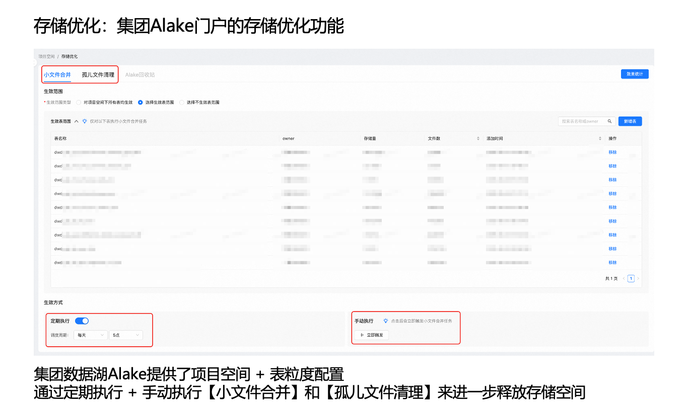
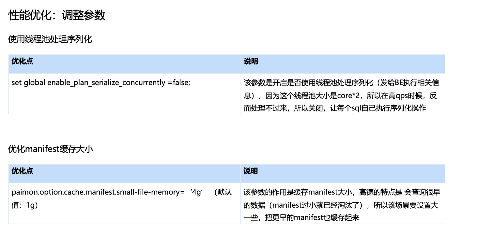
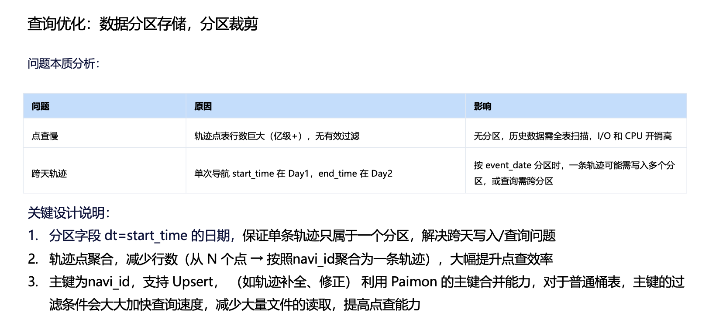

# 数据治理（待整理）

https://mp.weixin.qq.com/s/flEp_qxBqAtgbFibWGt6vw?scene=1&click_id=1
## 存储优化：集团 Alake 门户的存储优化功能

由于本项目使用集团数据湖能力，集团门户提供了存储治理相关的优化功能。在 Flink 写入 Paimon 的过程中，可能会因检查点（Checkpoint）提交失败等原因产生小文件，并在异常场景下形成孤儿文件。

为此，集团数据湖门户支持按“项目空间 + 表”粒度进行配置。我们将目标表纳入治理范围后，可通过定期执行或手动触发的方式开展：
* 小文件合并/整理（文件压实、合并小文件）
* 孤儿文件清理。

上述治理动作能够进一步释放存储空间，同时通过周期性合并/整理作业减少 Paimon 表中的小文件数量，从而保障湖表的高效查询能力。

## 性能优化：调整参数
参数优化

我们也针对 Paimon 表做过一系列参数调优，以进一步优化点查场景下的读取效率与稳定性。
例如：将 file-block-size 从默认的 128MB 下调至 32MB。在轨迹历史数据体量大、以点查为主的场景下，更小的 block/row group 粒度有利于更精细的数据裁剪与下推：
* 粒度更小意味着可以更准确地定位命中范围，从而在读取时跳过更多不相关的 row group；
* 有助于降低 I/O 放大（只读取命中的 group，而非扩大到整文件级别）；
* 更小的 group 也更利于多线程/多任务并行读取。

我们也尝试过开启“使用线程池处理序列化”的相关参数。但由于该线程池默认大小通常为 CPU 核心数的 2 倍，在高 QPS 场景下反而容易形成排队与瓶颈。为此，我们将该参数设置为 false，使序列化由每条 SQL 在执行过程中自行完成。
此外，我们将 manifest 缓存大小从默认的 1GB 调整至 4GB，用于提升 manifest 命中率。高德轨迹查询存在一定比例的“访问更早历史数据”的特征，若 manifest 频繁过期并被淘汰。扩大缓存后，可覆盖更长时间范围的 manifest 元数据。

## 查询优化：数据分区存储，分区裁剪

在读取性能方面，我们从业务访问特征出发对数据进行了分区存储。以千亿级轨迹点查询场景为例，若缺少合理分区，从海量历史数据中定位一条轨迹可能需要触发全表扫描，导致 I/O 与 CPU 开销显著上升。

在轨迹业务中，分区设计会天然遇到“跨天”问题。例如，用户在当日 22:00 开始导航、次日 01:00 结束行程，则该行程对应的轨迹点/轨迹段会跨越多个日期分区。若仍按自然日期分区存储与写入，完整轨迹的查询与写入都会涉及多个分区。

为解决这一问题，我们在历史数据层做了一个关键设计：轨迹点聚合。具体而言，通过轨迹的唯一 ID，将同一条轨迹的多个点聚合为一条完整轨迹，并配合前文介绍的压缩算法，进一步降低存储成本。在分区策略上，我们以轨迹开始日期作为分区键，从而保证单条轨迹只落入一个分区，同时规避跨天写入与跨分区查询的问题。

在表模型设计上，Paimon 表以轨迹 ID 作为主键。由于 Paimon 主键表支持 Upsert，我们可以利用其主键合并能力支持轨迹补全与数据修复等场景；同时，主键过滤条件也能够显著加速查询。