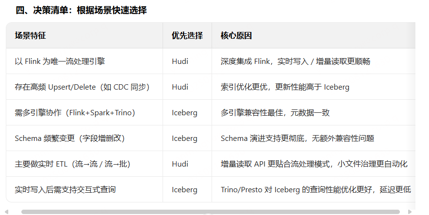
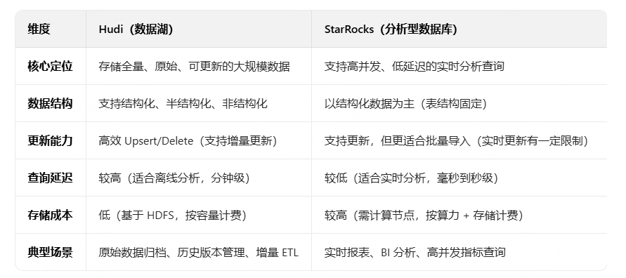
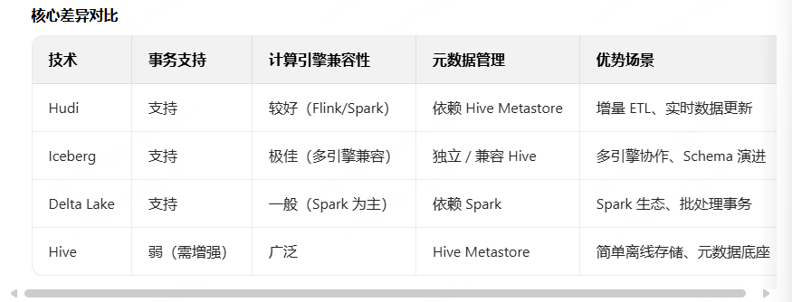

# 数据湖
  - [paimon作业开发](#paimon作业开发)
- [Hudi](#hudi)
  - [技术选型](#技术选型)
  - [Flink实时将数据入湖](#flink实时将数据入湖)
  - [CDC数据（Mysql）入湖](#cdc数据（mysql）入湖)
  - [Spark离线湖上ETL](#spark离线湖上etl)
  - [湖仓架构下ETL流程](#湖仓架构下etl流程)
  - [为数据湖用Hudi不用Iceberg](#为数据湖用hudi不用iceberg)
  - [既然数据能直接存储到HDFS，为什么还要再存到Hudi中，存储到Hudi中的好处是什么？](#既然数据能直接存储到hdfs，为什么还要再存到hudi中，存储到hudi中的好处是什么？)
  - [什么数据存储到Hudi，什么数据存储到StarRocks（**数据湖和数据仓库区别**）](#什么数据存储到hudi，什么数据存储到starrocks（数据湖和数据仓库区别）)
  - [**hudi时间旅行的功能**](#hudi时间旅行的功能)
- [数据湖技术选型](#数据湖技术选型)


## paimon作业开发
* paimon特性
1、PK table, 支持aggregation, partial update等merge enging
2、partial update 可以解决多流join的大state问题
3、流读流写， 批读批写，增量读写， 流批一体存储
4、flink/spark 多种引擎支持, all in sql
5、branch, tag日志多版本多分支管理， 支持日志time travel
6、统一hive catalog元数据管理
6、统一hive catalog元数据管理
* 新建paimon模型
数据仓库 --> 元数据管理 --> 新建模型， 选择一个数仓层次
选择数据源类型（Paimon） --> 字段结构设计 --> 分区字段设计 --> 参数设置
入湖 --> 多表join


# Hudi
## 技术选型
早些时间，我们对iceberg做过一些探索，由于不支持数据行级别的更新，再加上社区进展比较慢，我们也就放弃了，将关注点转向Hudi社区。Apache Hudi 是由 Uber 开发并开源的数据湖框架，它于 2019 年 1 月进入 Apache 孵化器孵化，次年 5 月份顺利毕业晋升为 Apache 顶级项目，是当前最为热门的数据湖框架之一。Hudi是一个支持插入、更新、删除的增量数据湖处理框架；可助力构建高效的企业级数据湖。同时Hudi与Flink/Spark都有很好的集成，方便我们进行实时计算和离线计算。

我们选型Hudi来做我们构建数据湖，由于基于Hudi构建的数据湖支持行级别的更新，数据湖将会作为实时链路和离线链路的存储，从而摒弃了之前的实时数据存放在Kafka，离线数据存放在Hive/HDFS中, 从而解决了离线数据和实时数据割裂，做到了存储层面的统一；而支持批流一体的实时计算引擎Flink也在快递迭代，功能越来越强大，能够与Hudi有很好的集成；同时Hudi和Spark/Presto也有很好的集成，这样情况下，我们ETL流程有一些变化

## Flink实时将数据入湖
对于Hudi数据的来源来说，可以分为两大类，一是**实时增量写入**，比如我们将Kafka 中的数据通过Flink 实时写入Hudi/Mysql 的binlog 同步到Hudi中；二是**离线全量写入**，比如我们将Hive中的数据通过Spark全量写入到Hudi中。
* 通过Flink SQL将TiDB的binlog写入Hudi
商业化的关系型DB基本上由MySQL迁移到TiDB了，而TiDB的binlog 是通过TiCDC收集到Kafka 的Topic中，并且Topic的格式为canal-json，Flink SQL通过Hudi connector将canal-json 格式的topic写入Hudi中，这样就完成了整个入湖的过程
* 通过Flink SQL将Mysql的binlog 写入Hudi
对于MySQL的binlog 入Hudi来说，基于mysql-cdc connector 构建Flink Source Table，直接连接MySQL，Flink SQL 入湖Job每次在启动的时候都会load全量的数据到Hudi

## CDC数据（Mysql）入湖
数据库作为我们存放物料信息地方，每天不定时的都会去做一些增删改操作，下游需要抓取这些最新的操作来做相关应用，在数据团队中最为常见的应用场景就是用来做维表Join，有了Hudi之后，我们可以通过Flink SQL实时将MySQL binlog写入Hudi，供离线计算做纬度表join；这就避免了我们之前每天通过Sqoop Job需要花费上很长时间来做MySQL snapshot 同步，然后再基于这个snapshot做 离线计算Join。

* Flink SQL将MySQL数据同步Hudi表中，然后通过Spark-sql3和MutiCatalog用Hive中的数据来Join Hudi中的数据
1、抽取MySQL数据的Source Table准备好了之后，需要创建创建Flink Sink Table， 但是我们希望由离线部分来主导整个流程，因此，我们先通过Spark-sql3创建Hudi表(在Hive看来是一张拥有特殊InputFormat的管理表)，然后根据Hudi表的HDFS路径创建Flink Sink Table.
2、创建Flink Sink Table
3、有了Flink Source/Sink Table, 我们就可以提交Flink Insert Into Job 实时将数据写入Hudi上，必须开启Flink 的checkpoint功能
4、使用Spark-sql 进行湖上分析，比如和Hive中的数据进行join

## Spark离线湖上ETL
spark3做湖上数据分析

## 湖仓架构下ETL流程
以Flink SQL消费Kafka Topic，经过计算再写回Hudi，下游可以通过Flink SQL/Spark-sql3/Presto进行分析
1、入湖：构建Flink Source Table --> 构建Flink Sink Table，但是我们希望Hudi表的创建以离线Spark-sql3来主导，因此，还是先通过Spark-sql3创建Hudi, 再基于HDFS路径创建Flink Sink Table。
2、通过Spark-sql3创建好Hudi表之后，我们再基于viewfs://ss-hadoop/project/ads/warehouse/test2.db/spark_sql3_etl_hudi创建Flink Sink Table
3、启动Flink Insert Job, 同时开启checkpoint

**湖上分析之ETL流程：**
我们通过Spark-sql3对Hudi进行ETL 处理再写到一张新的Hudi里面，供下游Spark-sql3或者Presto查询，从而完成整个湖仓架构下的ETL流程
1、有了ODS层Hudi表，我们就可以使用Spark-sql3进行ETL处理了，因此，我们需要新建一张DWA层的Hudi表
2、我们只统计今天top10的plain, Spark-sql3计算完再写回Hudi
3、我们通过spark-sql3将ODS层的数据写入DWA层的Hudi表之后，看下写入的数据
4、因为我们统计Top10的数据，重复执行多次spark-sql3 insert job之后, 我们可以看看表的数据有什么变化
5、我们还可以使用Presto来查询DWA层Hudi表


## 为数据湖用Hudi不用Iceberg
选择 Hudi 而非 Iceberg 的核心逻辑是：**业务更依赖实时数据处理、高频变更同步，且以 Flink纯流式 为主**。Hudi 在实时写入、CDC 适配、Flink 集成和更新性能上的优势，能更好地支撑这类场景；而 Iceberg 更适合多引擎协作的批处理或离线分析场景。两者没有绝对优劣，关键是匹配业务需求。

这主要是基于业务场景、技术栈适配和功能特性的综合权衡，我们的业务主要是**广告数据实时更新、增量 ETL 和与 Flink 深度集成**的场景。
首先来说，广告是一个典型的流数据，实时性变动比较频繁的数据

1、主要是通过CDC从Mysql对变更数据捕获、高频更新的业务

* CDC场景天然适配：Hudi能直接解析 CDC 数据中的op_type（操作类型），自动映射为 Hudi 的upsert（更新插入）或delete操作，无需额外处理逻辑。例如之前代码中从 MySQL CDC 同步的数据，可直接通过 Hudi 的write.operation = 'upsert'实现变更同步，而 Iceberg 虽然也支持更新，但需要额外配置（如通过merge into语句），在流处理场景中稍显繁琐。
* 低延迟写入：Hudi 的MERGE_ON_READ表类型（读时合并）支持 “先写日志文件（Log File）、后台异步合并”，写入延迟极低（毫秒级），适合实时流数据（如 Flink 流）的持续写入；而 Iceberg 的更新操作默认需要生成新的数据文件，在高频写入场景下可能产生更多小文件，需依赖额外的压缩（Compaction）机制优化，实时性稍弱。

2、Flink纯流式处理

* **增量读取支持**：Hudi 原生支持通过read.streaming.enabled = 'true'开启 Flink 的增量读取，下游任务可直接消费 Hudi 表的新增 / 变更数据（基于_hoodie_commit_time），无需全量扫描，这对构建增量 ETL pipeline（如 “Hudi → Flink → StarRocks” 的实时分析链路）非常关键。Iceberg 也支持增量读取，但 API 设计更偏向批处理（如通过snapshot-id指定版本），在流处理场景中集成不如 Hudi 自然。

3、索引机制

* **Bloom Filter 索引**：通过哈希快速判断数据是否存在，适合主键查询；
  例如，当处理用户信息表（每天百万级更新）时，Hudi 的 Bloom Filter 索引可将单条更新的定位时间从 “分钟级” 压缩到 “毫秒级”，而 Iceberg 可能需要扫描更多文件。

## 既然数据能直接存储到HDFS，为什么还要再存到Hudi中，存储到Hudi中的好处是什么？
HDFS本质是分布式文件系统，设计初衷是高效存储和读取**大规模静态数据**，但其原生特性在处理动态数据时存在明显不足：

* **支持行级更新/删除**：HDFS 是 “append-only”（仅追加）的文件系统，不支持随机写或行级修改。若直接存储在 HDFS 上，要更新一条记录，需重写整个文件，效率极低（尤其对大文件）；删除一条记录同样需要重写文件，成本极高。
  而Hudi 支持行级更新 / 删除，通过索引（如 Bloom 索引）定位记录所在文件和位置，仅修改必要的数据块，无需重写整个文件。
* **增量同步到下游**：广告效果分析需实时获取 “近 1 小时新增的曝光数据”，Hudi 通过增量读能力，仅处理新变更的数据，避免全量扫描，任务耗时从小时级降至分钟级。
* **数据回溯与审计**：广告投放异常时需回溯 “昨天 18 点的特征数据”，Hudi 的时间线记录了历史版本，可直接查询某一时间点的快照，而 HDFS 需手动备份历史文件，成本高且繁琐。
* **通过事务机制保证原子性**：HDFS在并发写入时无事务机制，若写入过程中断（如任务失败），可能留下脏数据，导致下游读取数据异常


## 什么数据存储到Hudi，什么数据存储到StarRocks（**数据湖和数据仓库区别**）
数据湖：定位为 “全量原始数据的集中存储池”，采用 “Schema-on-Read（读时解析）” 模式，数据写入时保持原始格式（如日志、JSON、图片），不预先定义结构，强调 “先存储后探索”。
数据仓库：定位为 “结构化分析数据中心”，采用 “Schema-on-Write（写时定义）” 模式，数据写入前需通过 ETL 清洗、转换为预定义结构（如星型模型），强调 “先整合后分析”。

**一、Hudi（Hadoop Upserts Deletes and Incrementals）- 数据湖：**管理大规模、多版本、可更新的原始数据**，支持高效的增量读写和历史数据回溯。**

存储数据类型：

* CDC捕获到数据库全量变更数据（INSERT/UPDATE/DELETE）
* 需要长期保存的历史数据：广告投放的全量历史素材数据
* 数据会频繁变更（如用户信息、订单状态），且需要高效更新（避免全量重写），比如：用户的基本信息（姓名、手机号可能频繁修改）

核心原因：

* Hudi 支持Upsert/Delete（基于主键更新或删除），无需全量重写数据，适合动态数据；
* 支持增量读取（只读取新增 / 变更的数据），降低下游处理的计算成本；
* 基于HDFS存储，成本低（按存储容量计费），适合 PB 级大规模数据；
* 支持多版本管理（保留历史快照），便于数据回溯和错误恢复。


**二、StarRocks（分析型数据库）：适合存储结构化、需高频查询的分析数据**
StarRocks 是基于 MPP（大规模并行处理）架构的分析型数据库，核心定位是**支持高并发、低延迟的实时分析查询**，擅长复杂聚合、排序和关联操作。

存储数据类型：
1、经过清洗的结构化指标数据

* 从原始数据中提取的、用于分析的关键指标（如日活、销售额、转化率），结构固定（表结构明确）。
* 例：电商的 “每日各地区销售额表”；广告的 “每小时曝光 / 点击统计表”。
  2、实时监控数据
* 需要实时展示、高频查询的数据（如仪表盘、实时报表），要求查询延迟低（毫秒到秒级）。
* 例：实时监控系统的 “服务器 CPU 使用率”“接口调用成功率”；广告平台的 “实时消耗金额”。
  3、宽表数据（多维度关联结果）
* 整合多源数据后的宽表（如用户属性 + 行为 + 订单的关联结果），用于快速的多维度分析。
* 例：之前代码中构建的广告宽表（整合广告主、媒体、违规规则等多维度信息），用于快速查询 “某行业广告的违规率”。
  4、高并发查询场景的数据
* 需支持大量用户同时查询（如 BI 工具、业务报表平台），要求系统有高吞吐量。
* 例：企业内部的销售报表（数百人同时查看不同区域的业绩）；电商平台的商家经营分析数据。

核心原因

* StarRocks 采用列存 + 索引（如前缀索引、Bitmap 索引），查询速度快，适合复杂聚合和筛选；
* 支持实时导入（从 Kafka/Flink 流实时写入），数据可秒级可见，适合实时分析；
* MPP 架构支持水平扩展，能通过增加节点提升并发查询能力；
* 兼容 SQL 标准，易用性高，适合业务分析师直接通过 SQL 查询。

**核心差异**



**广告系统中，MySQL 的广告变更数据先写入 Hudi 保存全量历史，再通过 Flink 处理为包含多维度的宽表，最终写入 StarRocks 供运营实时查询 “各行业广告平台的覆盖率”。**


## **hudi时间旅行的功能**

**Hudi 的 Upsert 能力支持 “广告状态更新”（如从 “待审核”→“违规”），且保留历史版本 —— 若违规广告被篡改，可通过 Hudi 的 “时间旅行” 功能回溯原始数据，满足 “证据不可篡改” 的合规要求；**


在广告场景中，时间旅行功能的核心价值是 **数据可追溯**—— 无论是恢复错误数据、验证效果趋势，还是审计计费明细，都能通过精准定位历史时间点，解决传统数据湖 “历史数据不可复现” 的痛点，最终提升广告投放的可靠性和优化效率。

可通过 “时间旅行” 功能，查询任意历史时间点的数据状态（如 “查询 3 天前某条订单的状态”）

一、广告数据异常恢复（主要）
广告数据链路长（从曝光到转化可能经过多个系统），易因接口故障、ETL 错误导致数据失真（如点击量重复统计、转化金额计算错误）。
时间旅行的作用：快速回溯到异常发生前的正确版本，恢复数据。

实例：
某电商平台的信息流广告在2024-06-01 10:00因埋点错误，导致 “点击量” 被多统计 30%，下游报表全部异常。

解决步骤：
1、通过 Hudi 时间线获取异常发生前的时间点（如2024-06-01 09:59:59）；
2、用时间旅行查询该时刻的广告点击表数据：
3、将正确数据覆盖写入异常表，或生成修正后的报表，避免错误扩散。

```python
# 读取错误发生前的正确版本
correct_click_df = spark.read.format("hudi") \
    .option("as.of.instant", "2024-06-01 09:59:59") \
    .load("/user/hudi/ad_click_table")
```

二、广告效果跨时段对比分析
时间旅行的作用：精准获取 “历史某一时刻的快照数据”，确保对比的准确性。

示例：分析 “618 大促期间（6.1-6.18）每天 10 点的广告 ROI 变化”，需排除后续延迟数据的干扰。

1、对每天 10 点整的广告效果表（含花费、转化金额）生成时间快照；
2、用时间旅行批量读取各天 10 点的数据：
3、基于固定时间点的数据，得到无干扰的 ROI 趋势，辅助调整投放策略。

```sql
-- 对比6月1日和6月2日10点的ROI
SELECT 
  '2024-06-01' AS dt, 
  SUM(convert_amount)/SUM(spend) AS roi 
FROM ad_effect_table TIMELINE AS OF '2024-06-01 10:00:00'
UNION ALL
SELECT 
  '2024-06-02' AS dt, 
  SUM(convert_amount)/SUM(spend) AS roi 
FROM ad_effect_table TIMELINE AS OF '2024-06-02 10:00:00';
```

但基本不怎么用，因为我们的StarRocks是按照dt每天分区的


# 数据湖技术选型
* Hudi(高频更新、CDC实时数据同步)
* Iceberg（多引擎兼容，多团队协作的大规模数据湖）
* Delta Lake（与spark配合）
* Paimon（实时流批优化，非高频随机更新）
