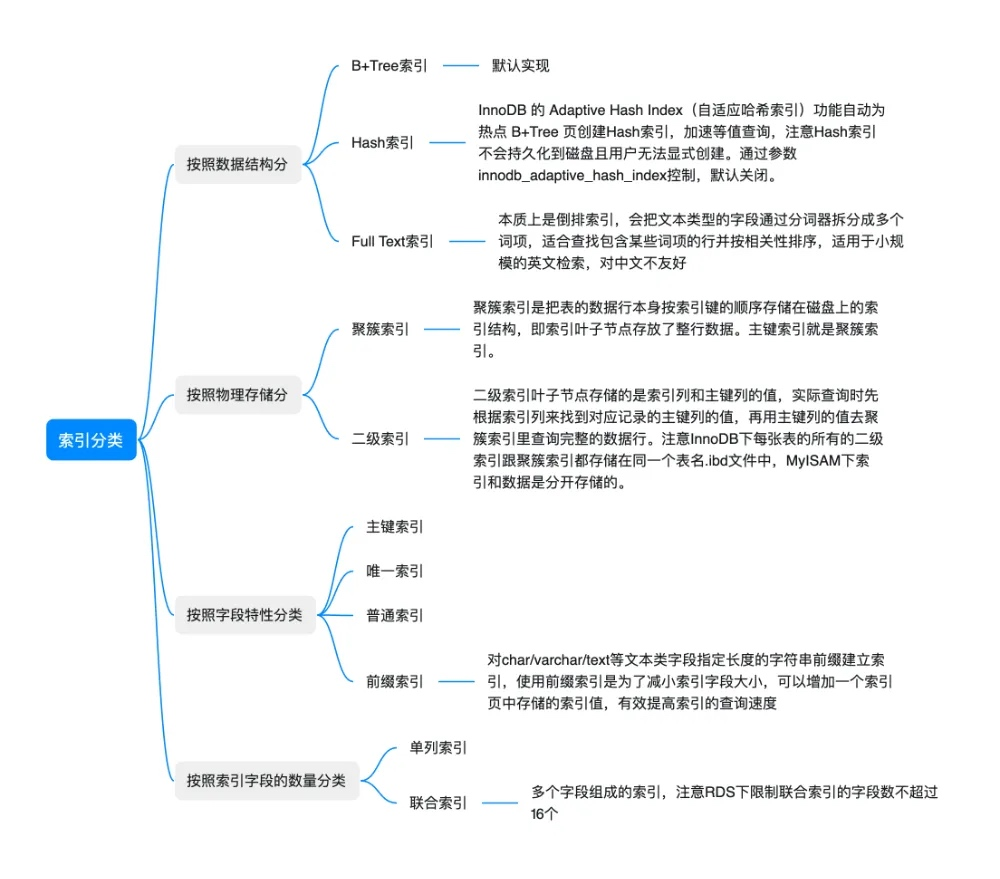
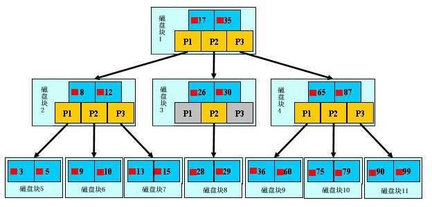
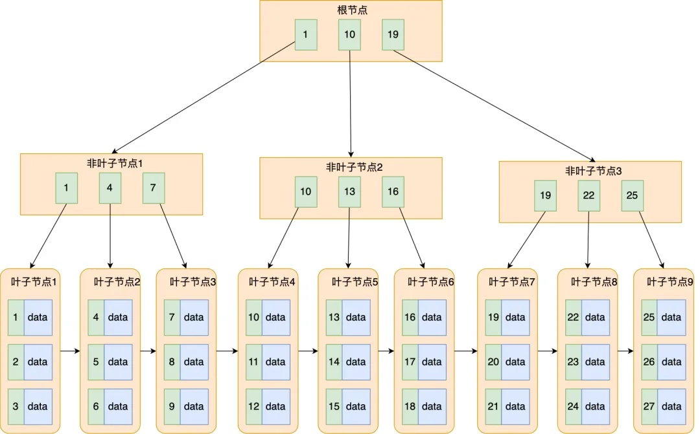
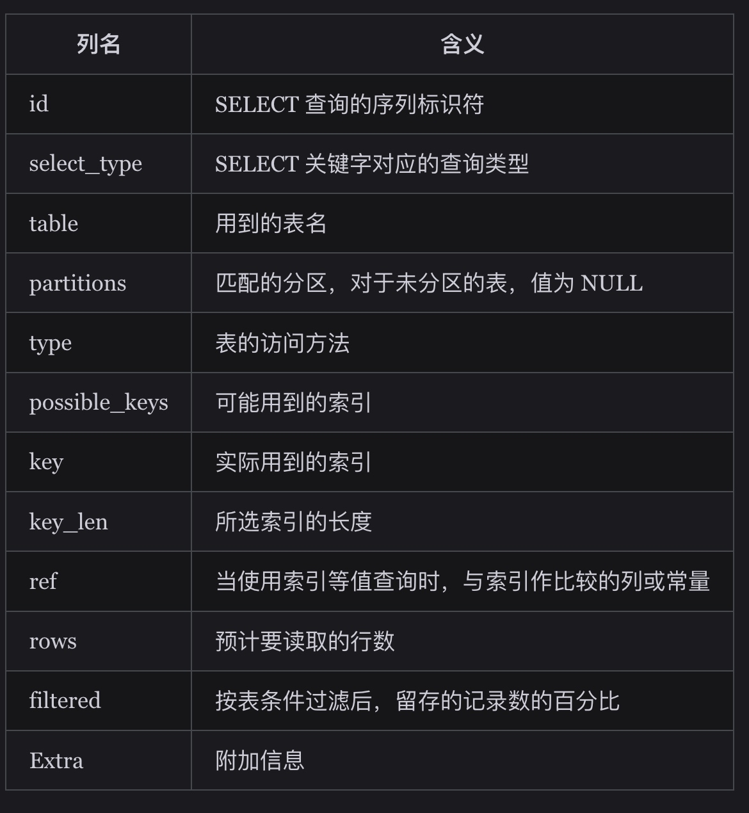
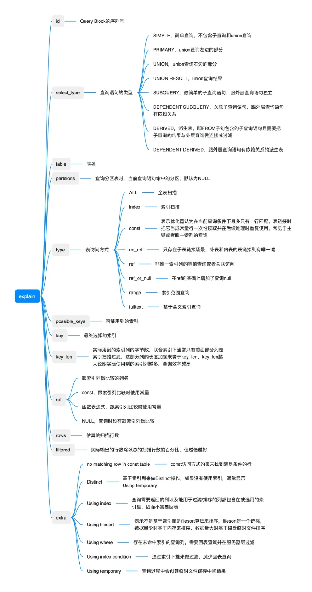

# Mysql
- [**Mysql优化方式**](#mysql优化方式)
- [**慢sql排查思路**](#慢sql排查思路)
  - [**怎么分析一个sql有没有走索引，走到什么程度**](#怎么分析一个sql有没有走索引，走到什么程度)
  - [慢 SQL 中**索引失效**的常见原因有哪些？](#慢sql中索引失效的常见原因有哪些？)
- [Mysql基础](#mysql基础)
  - [三大范式](#三大范式)
  - [Mysql执行一条select查询语句，在Mysql中期间发生了什么？](#mysql执行一条select查询语句，在mysql中期间发生了什么？)
  - [SQL分类](#sql分类)
  - [Mysql不同**存储引擎区别**](#mysql不同存储引擎区别)
  - [全表扫描的场景](#全表扫描的场景)
  - [**临时表**](#临时表)
  - [为什么说mysql性能瓶颈在2千万行左右：](#为什么说mysql性能瓶颈在2千万行左右：)
- [**索引**](#索引)
  - [索引作用/为什么说索引能提高查询速度](#索引作用为什么说索引能提高查询速度)
    - [缺点](#缺点)
  - [索引的使用场景 / **创建索引**](#索引的使用场景创建索引)
  - [创建索引命令](#创建索引命令)
  - [主键索引、唯一索引、普通索引的区别？](#主键索引、唯一索引、普通索引的区别？)
  - [**索引底层实现原理**](#索引底层实现原理)
  - [**为什么索引结构默认是使用B+树，而不是B树，Hash，二叉树，红黑树**](#为什么索引结构默认是使用b树，而不是-b树，hash，二叉树，红黑树)
  - [**不创建索引**](#不创建索引)
  - [**索引失效场景**](#索引失效场景)
  - [**优化索引**](#优化索引)
  - [内连接和外连接的区别](#内连接和外连接的区别)
  - [索引类型](#索引类型)
  - [普通索引和唯一索引的区别](#普通索引和唯一索引的区别)
  - [讲一讲Mysql的**最左前缀原则**](#讲一讲mysql的最左前缀原则)
  - [联合索引是什么？为什么需要注意联合索引中的顺序？](#联合索引是什么？为什么需要注意联合索引中的顺序？)
  - [聚簇索引](#聚簇索引)
  - [非聚簇索引](#非聚簇索引)
  - [索引覆盖](#索引覆盖)
  - [讲讲索引下推](#讲讲索引下推)
  - [**判断索引是否生效**](#判断索引是否生效)
  - [**SQL语句在什么情况下会扫描全表**](#sql语句在什么情况下会扫描全表)
  - [**没走索引，如何排查**](#没走索引，如何排查)
  - [explain执行计划的时候一般怎么看，就是**每一列它的含义**](#explain执行计划的时候一般怎么看，就是每一列它的含义)
- [**事务**](#事务)
  - [什么是数据库事务](#什么是数据库事务)
  - [事务的特性（ACID）](#事务的特性（acid）)
  - [并发场景，数据库存在哪些一致性问题/并行事务会引发什么问题](#并发场景，数据库存在哪些一致性问题并行事务会引发什么问题)
  - [**事务隔离级别**](#事务隔离级别)
  - [为什么大厂选择RC数据库隔离级别](#为什么大厂选择rc数据库隔离级别)
  - [解决幻读问题](#解决幻读问题)
- [**MVCC-事务中查询同一个SQL保持一致性**](#mvcc事务中查询同一个-sql保持一致性)
  - [MVCC是什么](#mvcc是什么)
  - [MVCC在不同隔离级别下的表现](#mvcc在不同隔离级别下的表现)
  - [MVCC工作原理](#mvcc工作原理)
    - [快照读和当前读](#快照读和当前读)
    - [MVCC优势](#mvcc优势)
    - [劣势](#劣势)
  - [应用场景](#应用场景)
- [**Mysql锁**](#mysql锁)
  - [Mysql的锁你了解哪些](#mysql的锁你了解哪些)
  - [Mysql如何实现分布式锁](#mysql如何实现分布式锁)
- [**Mysql日志**](#mysql日志)
  - [undo log、redo log、binlog有什么用](#undo-log、redo-log、binlog有什么用)
  - [binlog三种](#binlog三种)
  - [undo log的作用（保证数据的数据原子性）？](#undo-log的作用（保证数据的数据原子性）？)
  - [什么是redo log？](#什么是redo-log？)
    - [为什么需要 Buffer Pool？](#为什么需要buffer-pool？)
  - [为什么需要redo log](#为什么需要redo-log)
  - [redo log和undo log的区别？](#redo-log和undo-log的区别？)
  - [什么是binlog？](#什么是binlog？)
  - [Binlog作用](#binlog作用)
  - [bin log和redo log的区别](#bin-log和redo-log的区别)
  - [redolog和binlog执行过程](#redolog和binlog执行过程)
- [**高可用**](#高可用)
  - [**主从复制如何实现**](#主从复制如何实现)
  - [为什么选择主从](#为什么选择主从)
  - [搭建过程出现哪些问题](#搭建过程出现哪些问题)
  - [怎么增加从节点](#怎么增加从节点)
- [视图](#视图)
- [SQL语句](#sql语句)
  - [SQL注入](#sql注入)
  - [内连接和外连接区别](#内连接和外连接区别)
  - [**左外连接和右外连接**](#左外连接和右外连接)
  - [drop和truncate的区别](#drop和truncate的区别)
  - [in 和exists区别](#in和-exists区别)
  - [count(1)和count(列)](#count-1和-count列)

[**分库分表**](mweblib://17391945113710)

# **Mysql优化方式**
>在mysql高性能书里面说过mysql单表的数据量大概是2,000万，但是这本书里面也提到过现在的服务器配置和那时候是天壤之别。

首先来说，Mysql优化的话，首先要看我们的数据量，然后这还和我们表中的数据类型和我们的服务器配置有关

以两千万左右数据举例：
如果说我们的表字段设计的比较合理，没有一些text字段这种长字符集的话，再加上我们的服务器的配置本来就比较好，64G内存加上32的核心，我感觉2000w应该是随便连，如果说我们这边有text这种长字段，我感觉就需要分区分表了，就要考虑到不能随便连完之后，随便拿个*上去，这样的话，效率会很慢，但是如果这个表都是一些数据类型或者是统计类型的话，我觉得2000w的话，真的不是很大的问题

最简单的操作就是加索引，然后但是我还碰到过一次，加索引但是它不走索引，我们用explain去分析之后，发现它走不了索，然后最后发现是个配置问题，通过optimazer trace更细的去分析我们的SQL，最后发现是字符集不一样，它走不了索引，后来我发现UTF-8和UTF-8 MB4两个索引不一样的话，它走不了索引，但是我这边的话，基本都是2千万以下的，2千万以上的数据我就没见过了，我就没处理过了。
* 索引优化
    * 看数据量，只有1w或者几千条，创建的意义不是很大
    * 看数据是不是分布均匀，分库分表（从分库分表数据倾斜的怎么解决，角度回复）
    * 业务场景：XXX字段怎么创建，主键还是非主键、聚簇索引、非聚簇索引
* **数据量角度**：根据当前的数据量，来选择是否创建索引，如果说只有1w或者几千条，创建的意义不是很大，如果是创建索引，会通过 explain 执行结果，查看 sql 是否走索引。
* **SQL执行频率**：（7） show global status like 'COM_______' 
* **慢查询日志**：开启Mysql慢查询日志，配置long_query_time = 2s，来记录慢查询日志，进而分析。
* **业务角度**：通过普罗米修斯实时可视化监控查询的SQL耗时情况，对于查询比较慢的字段/表，（标准差，最大和最小查询时间的差异，平均查询时间作为标准）我们会将其进行几方面操作：
    * 看数据是不是分布均匀，分库分表（从分库分表数据倾斜的怎么解决，角度回复），将字段多的表分解成多个表，有些字段使用频率高，有些低，数据量大时，会由于使用频率低的存在而变慢，可以考虑分开。
[分库分表](mweblib://17391945113710)
    * 对于主键自增的表，针对 limit n,y 深分页的查询优化，可以把Limit查询转换成某个位置的查询：select * from tb_sku where id>20000 limit 10;
    * 联表查询通过以小表驱动大表，并且被驱动表的字段要有索引，采用主子表的形式，减少回表请求，或者通过冗余字段的设计，避免联表多次查询。
    * 批量插入/更新，而不是选择单个插入，这样可以节省更多的时间和资源
    * 对于复杂场景的话，我们采用临时表，来辅助我们编写SQL语句，简化我们的逻辑思路
* **架构角度**：用读写分离架构（主从），主库负责写和一些实时性要求比较高的读，从库负责实时性要求不高的读请求，可以降低对主库请求的压力，加快处理速度
* **加缓存**

**多张表关联查询的优化**
left join的时候尽量走索引，查的时候注意一点，基本不会慢
就是2000w以下，不需要去分，因为我们的服务器扛得住
分表，按照日期，月份分表，分完了之后，每次到下一年的时候，再去批量创建一批，上传我们的日期，再用SQL拼接一下日期

# **慢sql排查思路**
MySQL 慢 SQL 排查遵循 **「开启慢日志→定位慢 SQL→分析执行计划→优化→预防」** 的核心思路，分 5 步：
1. **开启慢查询日志**：通过`slow_query_log`开启，设置`long_query_time`阈值，记录未使用索引的 SQL；
2. **定位慢 SQL**：用 MySQL 自带的`mysqldumpslow`按执行时间 / 次数排序，找到 TopN 慢 SQL，或用`show processlist`实时定位正在执行的慢 SQL；
3. **分析根因**：用`explain`执行计划，重点看`type`（表访问方式，避免 ALL）、`key`（是否走索引）、`Extra`（避免 Using filesort/Using temporary），定位全表扫描、索引失效、排序分组性能差等根因；
4. **针对性优化**：优先做**索引优化**（添加 / 修复索引、优化联合索引），再优化 SQL 语法（避免 select *、替换子查询为联查），最后做配置 / 架构优化（读写分离、分库分表、引入缓存）；
5. **长期预防**：建立慢 SQL 监控告警，规范 SQL 开发流程，上线前做 explain 审核，定期分析慢日志、优化表结构。


## 慢SQL问题
慢SQL整体可以分为两类，查询慢SQL和更新慢SQL，更新慢SQL通常是行锁等待导致的，即存在多个大事务同时更新一行记录，其他事务更新时必须等已经抢占到行锁的事务提交完成后才能抢占到行锁，可以借助dbTrace日志快速排查出现并发冲突的两个大事务，通常是调整业务逻辑或者加上全局限流来规避大事务的并发。
查询类慢SQL的主要特征就是处理过程中平均逻辑读和同步物理读比较多，解决慢SQL的核心就是充分利用索引的二分查找特性来降低逻辑读，常见的问题原因和治理措施如下：


1、大多数情况是正常的，只是偶尔会出现很慢的情况
**锁等待类**
数据库中的锁主要分两类：
* 表锁/元数据锁：如 MyISAM 引擎的表锁、DDL 操作（ALTER TABLE）加的表锁，会阻塞整个表的读写；
* 行锁/间隙锁：InnoDB 引擎的行锁，如更新 / 删除某行时加锁，其他操作访问该行会等待。

**快速定位**
1. 查看当前活跃线程（锁等待优先排查）
```sql
-- 8.0 推荐：sys库极简视图，直接显示锁等待详情（含解决方案）
SELECT * FROM sys.innodb_lock_waits;

-- 补充：查看所有长耗时线程（Time>10秒）
-- Info列显示完整SQL，State列看核心状态
SELECT id, user, db, command, time, state, info 
FROM information_schema.processlist 
WHERE time > 10 AND command = 'Query' 
ORDER BY time DESC;
```
关键判断：
* 如果 sys.innodb_lock_waits 有结果 → 锁等待问题，跳到「三、锁等待专项排查」；
* 如果 State 包含 Waiting for innodb buffer pool flush/Writing to net → 资源 / 刷盘问题；
* 如果 State 是 Sending data 且 Time 很长 → SQL 执行计划差（无索引），跳到「四、SQL 执行慢专项排查」。

1. 查看慢查询日志（快速定位历史慢 SQL）--> Mysql8.0
```sql
-- 临时开启（重启失效）
SET GLOBAL slow_query_log = ON;
-- 记录执行时间超过1秒的SQL（可根据业务调整）
SET GLOBAL long_query_time = 1;
-- 记录未使用索引的SQL（重点！无索引是慢查询高频原因）
SET GLOBAL log_queries_not_using_indexes = ON;
-- 慢查询日志路径（8.0默认在数据目录下，如xxx-slow.log）
SHOW VARIABLES LIKE 'slow_query_log_file';
```
快速分析慢查询日志（用 mysqldumpslow 工具）：
```bash
# 查看执行次数最多的慢SQL
mysqldumpslow -s c /var/lib/mysql/xxx-slow.log

# 查看执行时间最长的慢SQL
mysqldumpslow -s t /var/lib/mysql/xxx-slow.log
```

三、第二步：锁等待专项排查（8.0 精准版）
如果第一步判断是锁等待，按以下流程定位根因：
1. 精准定位锁阻塞关系
```sql
-- 8.0 增强版：查看锁等待全量信息（含阻塞者SQL、等待时长）
SELECT
  w.wait_started AS 等待开始时间,
  TIMESTAMPDIFF(SECOND, w.wait_started, NOW()) AS 等待时长_秒,
  wt.processlist_id AS 等待线程ID,
  wt.processlist_user AS 等待用户,
  wt.processlist_host AS 等待主机,
  wt.processlist_info AS 等待执行的SQL,
  bt.processlist_id AS 阻塞线程ID,
  bt.processlist_info AS 阻塞者执行的SQL,
  l.lock_table AS 锁表名,
  l.lock_type AS 锁类型,
  l.lock_mode AS 锁模式,
  -- 一键杀阻塞线程的命令（复制即可执行）
  CONCAT('KILL ', bt.processlist_id, ';') AS 杀阻塞线程命令
FROM
  performance_schema.data_lock_waits w
JOIN
  performance_schema.threads wt ON w.requesting_thread_id = wt.thread_id
JOIN
  performance_schema.threads bt ON w.blocking_thread_id = bt.thread_id
LEFT JOIN
  performance_schema.data_locks l ON w.requested_lock_id = l.lock_id
WHERE
  w.wait_time > 0;
```


紧急处理：复制上面 SQL 的「杀阻塞线程命令」执行（如 KILL 123;）；
长期优化
```sql
-- 8.0 新增：设置行锁等待超时（避免无限等待，单位秒）
SET GLOBAL innodb_lock_wait_timeout = 5; -- 业务侧需捕获超时异常并重试
-- 禁止长事务（8.0 可设置事务超时）
SET GLOBAL innodb_rollback_on_timeout = ON; -- 超时自动回滚
```


2、在数据量不变的情况下，这条SQL语句一直以来都执行的很慢
* SQL执行效率差
* 内存/CPU/IO资源瓶颈

**如果是 SQL 执行效率低 / 资源瓶颈，按以下流程排查：**
1. 分析 SQL 执行计划（核心！）
对慢 SQL 执行 EXPLAIN ANALYZE（8.0 新增，比传统 EXPLAIN 更精准）：
```sql
-- 8.0 推荐：EXPLAIN ANALYZE 显示实际执行时间、行数
EXPLAIN ANALYZE
SELECT * FROM user WHERE age > 20 AND name LIKE '张%';
```
关键字段解读：
* type：需至少达到 range，如果是 ALL（全表扫）→ 无索引，优先加索引；
* key：显示使用的索引，NULL 表示未用索引；
* rows：预估扫描行数，越大越慢；
* Execution Time：实际执行时间（8.0 新增），直接看耗时。


## **怎么分析一个sql有没有走索引，走到什么程度**
分析 SQL 是否走索引、走到什么程度，核心用 MySQL 的`EXPLAIN`执行计划，看 3 个核心字段即可，层层递进：
1. **看`key`字段**：`key`≠NULL 表示走了索引，`key`=NULL 表示未走索引（索引失效 / 无可用索引）；
2. **看`type`字段**：反映走索引的程度，从优到劣为`const/eq_ref/ref > range > index/ALL`，至少要达到`range`，最好是`ref`，`ALL`表示全表扫描，必须优化；
3. **看`Extra`字段**：反映走索引的额外开销，`Using index`（覆盖索引，最优）无开销，`Using filesort/Using temporary`有额外排序 / 临时表开销，`Using join buffer`表示联查索引失效

## 慢 SQL 中**索引失效**的常见原因有哪些？
* 查询条件使用函数（如date(create_time)）；
* 发生隐式类型转换（如字符串字段传数字）；
* like 查询以 % 开头（如like '%test'）
* 查询条件用了or，且其中一个字段无索引；
* 联合索引违反最左匹配原则（如索引(a,b)，查询where b=1）；
* 索引字段值为 NULL（如where age is null，索引不存储 NULL 值）。

# Mysql基础
## 三大范式
* 1、字段原子性
核心：表中每一列的值都是原子性数据，不能拆分、不能一个字段存多个值，即「一列一值，值不可分」。

* 2、消除部分依赖
在满足 1NF 的基础上，所有**非主键字段必须完全依赖于整个主键**，而非仅依赖复合主键的一部分；通俗来说，复合主键（多字段组成的主键）的每一个字段，都要参与非主键字段的依赖关系，不能让非主键字段只和复合主键的一个字段有关。

* 3、消除传递依赖
在满足 2NF 的基础上，**所有非主键字段必须直接依赖主键**，不存在「主键→非主键 A→非主键 B」的传递依赖关系（即非主键字段之间不能有依赖）。通俗来说，非主键字段只能和主键 “直接挂钩”，不能通过其他非主键字段间接依赖主键。


## Mysql执行一条select查询语句，在Mysql中期间发生了什么？
1、**连接器**：建立连接，管理连接、校验用户身份
2、**查询缓存**：如果查询命中缓存
3、**解析SQL**：
* 词法分析和语法分析。语法分析器会根据语法规则，判断你输入的这个SQL语句是否满足MySQL语法，如果没问题就会构建出SQL语法树，方便后面模块获取SQL类型、表名、字段名、where条件

4、**执行SQL**：
* 预处理阶段：检查SQL查询语句中的表或字段是否存在；将`select *`中的`*`字符，拓展为表上的所有列。
* 优化器阶段：负责将SQL查询语句的执行方案确定下来，优化器会基于查询成本的考虑，决定使用哪个索引，选择查询成本最小的执行计划。
* 执行器阶段：根据执行计划执行SQL查询语句，从存储引擎读取记录，返回给客户端。

5、**数据返回**

## SQL分类
（DDL）数据定义语言，用于库表操作 
（DML）数据操纵语言，用于表内记录的操作
（DCL) 数据控制语言，用于登录，权限
（DQL）数据库查询语言，用于数据查询

## Mysql不同**存储引擎区别**
MyISAM‌：
‌优点‌：访问速度快，支持全文搜索。
‌缺点‌：不支持事务处理和外键，仅支持表级锁，数据非结构化存储，容易产生碎片。
场景：适合读操作远多于写操作的场景，插入不频繁，查询非常频繁的场景，如果执行大量的select，选择MyISAM。但是如果针对更新场景，因为它更新一个数据的时候会给表加锁，就是效率很慢，但是InnoDB不会

‌‌InnoDB‌：
‌优点‌：支持事务处理、外键、行级锁，提供数据完整性保护。
‌缺点‌：相比MyISAM，写操作效率较低，占用更多磁盘空间。
场景：可靠性高或者要求事务，表更新和查询都相当频繁的场景，比如大量的Insert、Update

我个人理解来说，就是InnoDB相对于MyISAM来说，功能更为完善一点。
## 全表扫描的场景
0、当表数据量很小或字段选择性很低时，全表扫描可能比索引查找更快。
1、当查询条件字段没有索引时，比如在未建立索引的name字段上做等值查询。
2、使用不等于操作符(!=或<>)的查询，因为索引通常无法有效支持这种操作。
3、对索引列使用函数或表达式，如YEAR(hire_date)=2020，这会使索引失效。
4、使用LIKE以通配符开头的查询，如'%MySQL%'，只有后缀通配符才能利用索引。
5、OR条件中使用无索引字段，或者优化器判断全表扫描更高效的情况。
6、需要返回表中大部分数据的查询，此时随机I/O可能比顺序扫描更慢。
7、识别全表扫描主要通过EXPLAIN分析执行计划，查看type是否为'ALL'。优化方法包括添加合适索引、重写查询语句、使用覆盖索引等。

例如，对于SELECT * FROM users WHERE name = '张三'这样的查询，如果name字段没有索引，就会全表扫描。解决方案是为name字段创建索引，或者如果只需要部分字段，可以创建覆盖索引CREATE INDEX idx_name ON users(name)，然后修改查询为SELECT id, name FROM users WHERE name = '张三'。"


## **临时表**
连接表仅存在于当前数据库连接的生命周期内，当连接关闭后，该表会字段删除，临时表是一张虚拟表，它们的结构和普通表相同，但是存储在内容中或者以临时文件的形式存储在磁盘中。
```sql
## 1.代替子查询，将查询结果建一个临时表，并在查询结束后清除
with t1 as (),
t2 as()

## 2.真正的临时表，将查询结果创建为临时表，当前数据库会话期间有效，在断开连接后清除
CREATE TEMPORARY TABLE

## 3.虚拟的表（将查询语句保存起来，被使用时，执行语句得到内存中的临时结果）
create view 临时表名 as 查询语句
```
**使用场景**：
1、一般主要应用在自查询较多的情况下（嵌套查询）
2、用于查询大量数据，如果要查询一个大量数据的表，可以先将满足条件的数据存储到临时表中，然后对临时表进行查询

## 为什么说mysql性能瓶颈在2千万行左右：
假设B+树的高度为2的话，即有一个根结点和若干个叶子结点。这棵B+树的存放总记录数为=根结点指针数 * 单个叶子节点记录行数。
如果一行记录的数据大小为1k，那么单个叶子节点可以存的记录数  =16k/1k =16.
非叶子节点内存放多少指针呢？我们假设主键ID为bigint类型，长度为8字节(面试官问你int类型，一个int就是32位，4字节)，而指针大小在InnoDB源码中设置为6字节，所以就是 8+6=14 字节，16k/14B =16 * 1024B/14B = 1170
因此，一棵高度为2的B+树，能存放1170 * 16=18720条这样的数据记录。同理一棵高度为3的B+树，能存放1170 *1170 *16 =21902400，大概可以存放两千万左右的记录。B+树高度一般为1-3层，如果B+到了4层，查询的时候会多查磁盘的次数，SQL就会变慢。

# **索引**

## 索引作用/为什么说索引能提高查询速度
* 提高查询速度：索引可以显著减少Mysql需要扫描的行数
* 如果没有用索引的话，我们查询是需要遍历双向链表来定位对应的页，现在通过“目录”就可以很快地定位到对应的页上了！
* 其实底层结构就是B+树，B+树作为树的一种实现，能够让我们很快地查找出对应的记录。

### 缺点
* 数量越多，占用物理空间越大
* 创建索引和维护索引要耗费时间
* 会降低表的增删改效率，每次增删改索引，B+树为了维护索引有序行，都需要进行动态维护。

## 索引的使用场景 / **创建索引**
* **看数据量，只有1w或者几千条，创建的意义不是很大**
* **看数据是不是分布均匀，分库分表（从分库分表数据倾斜的怎么解决，角度回复）**
* **业务场景：XXX字段怎么创建，主键还是非主键、聚簇索引、非聚簇索引**

* 最左匹配原则
* 频繁作为查询条件的的字段才去创建索引（读操作比较多的场景中）
* 频繁更新的字段不适合创建索引，索引不能参与计算，不能有函数操作，区分度低的数据列不适合做索引列（如性别）
* 经常`where`查询条件的字段，如果查询不是一个字段，可以建立联合索引。
* 经常`Group by`和`Order by`的字段，这样在查询的时候就不需要在做一次排序了。
* 多表联查，`JOIN` 中 `ON`里面的字段，必须有索引，否则导致全表扫描

## 创建索引命令
* 建表时直接定义：CREATE TABLE中通过PRIMARY KEY/UNIQUE KEY/KEY定义，结构规范；
* ALTER TABLE 追加：ALTER TABLE 表名 ADD KEY 索引名 (字段)，支持所有索引类型，适合老表；
* CREATE INDEX 专门创建：CREATE INDEX 索引名 ON 表名 (字段)，语法简洁，是老表添加普通 / 唯一索引的首选；

**CREATE INDEX 和 ALTER TABLE 创建索引的区别？**
答：核心是适用范围不同：CREATE INDEX仅能创建普通、唯一、联合、全文索引，无法创建主键索引，语法更简洁，是老表添加非主键索引的首选；ALTER TABLE支持创建所有类型索引（包括主键），功能更全面，还能同时做其他表结构修改（如添加字段）。

## 主键索引、唯一索引、普通索引的区别？
* 主键索引：唯一且非空，一张表仅一个，InnoDB 中主键是聚簇索引，数据按主键存储；
* 唯一索引：字段值唯一，可含 NULL，一张表多个，避免重复数据；
* 普通索引：无唯一性 / 非空要求，一张表多个，仅用于提升查询速度，最常用。

## 索引分类



## **索引底层实现原理**
索引主要采用B+树结构 来存储数据，以减少磁盘 I/O 并提高查询速度。



## **为什么索引结构默认是使用B+树，而不是B树，Hash，二叉树，红黑树**
B+ 树相比 B 树有以下特点：

* 非叶子节点不存储数据，只存储键值，叶子节点存储数据。
* 叶子节点之间使用指针相连，支持区间查询和范围查询。
* 所有查询必须查找到叶子节点，树的高度较低，查询效率更稳定。

**B+树 VS B树**：

* B+ 树的非叶子节点不存放实际的记录数据，仅存放索引，因此数据量相同的情况下，相比存储即存索引又存记录的 B 树，B+树的非叶子节点可以存放更多的索引，因此 B+ 树可以比 B 树更「矮胖」，查询底层节点的磁盘 I/O次数会更少。

* B+ 树有大量的冗余节点（所有非叶子节点都是冗余索引），这些冗余索引让 B+ 树在插入、删除的效率都更高，比如删除根节点的时候，不会像 B 树那样会发生复杂的树的变化；

* B+ 树叶子节点之间用链表连接了起来，有利于范围查询，而 B 树要实现范围查询，因此只能通过树的遍历来完成范围查询，这会涉及多个节点的磁盘 I/O 操作，范围查询效率不如 B+ 树。

**B+树 VS 二叉树**：
随数据量的增加，二叉树的树高会越来越高，磁盘IO次数也越多。B+树在千万级别的数据量下，高度依然维持在3～4层左右，也就是说一次数据查询只需操作3～4次磁盘IO

**B+树 VS Hash**：
Hash表不适合做范围查询，它更适合做等值询

**二叉查找树**：一个节点的左子树的所有节点都小于这个节点，右子树的所有节点都大于这个节点。
当每次插入的元素都是二叉查找树中最大的元素，二叉查找树就会退化成一条链表，查找数据的时间复杂度就从O(logn)变成了O(n)，由于树是存储在磁盘中的，访问每个节点，都对应一个磁盘I/O操作，也就是说树的高度等于每次查询数据时磁盘IO操作的次数，所以树的高度越高，就会影响查询性能，再加上不能用范围查询，所以不适合作为数据库的索引结构。

**自平衡二叉树（AVL树）**：解决二叉查找树在极端情况下退化成链表问题，在二叉查找树的技术上增加了一些条件约束：**每个节点的左子树和右子树的高度差不能超过1**，也就是说节点的左子树和右子树仍然为平衡二叉树，这样查询操作的时间复杂度就会一直维持在O(logn)

不管是平衡二叉查找树还是红黑树，都会随着插入的元素增多，而导致树的高度变高（IO操作次数多，影响数据查询效率）

树的节点越多的时候，并且树的分叉树M越大的时候，M叉树的高度会远小于二叉树的高度

B树不再限制一个节点只能右两个字节点，而是允许M个节点，从而降低树的高度，所以B树比平衡二叉树效率高。但是B树的每个节点都包含数据（索引+记录），而用户的记录数据的大小很有可能远远超过了索引数据，这就需要花费更多的磁盘IO操作次数，来读取到有用的索引数据


## **不创建索引**
* `Where`、`Group by`、`Order by`里面用不到的字段（起不到定位的字段不需要建立索引，因为索引会占用物理空间）
* 字段中大量重复数据（比如性别字段，只有男女，如果男女记录分布均匀，那么无论搜索哪个值都可以得到一半的数据，还不如不要索引，因为Mysql还有一个查询优化器，查询优化器法相出现在表的数据行中的百分比很高，就会忽略索引，进行全表扫描）
* 小表数据（几十、几百行数据）
* 经常需要更新的字段（比如电商：用户余额，因为索引字段频繁修改，就需要维护B+树的有序行，这个过程会影响数据库的性能）

## **索引失效场景**
* 使用模糊匹配（左 like%xx 或者 左右like %xx%）
* 查询条件对索引做了计算、函数、类型转换、对索引进行列运算（+ - * /）
* 联合索引不符合最左匹配原则
* where子句中，or前面的条件列是索引列，or后面的条件不是索引列
* 索引列上使用is null ， is not null，索引可能会失效
* 左右连接，关联的字段编码风格不一致

## **优化索引**
* 前缀索引优化
> 大字符串，引入一个索引页中存储索引值
* 覆盖索引优化
> 查询商品名称、价值，建立联合索引：「商品id、商品名称、商品价值」，减少回表
* 主键索引最好自增
> 如果不采用主键自增，可能会导致
* 防止索引失效

## 内连接和外连接的区别
* 内连接（返回两个中都匹配的数据）：
    * Inner join只有两张表中匹配的数据才会被返回，不会保留任何不匹配的数据，如果某个表没有匹配项，则不会出现在结果集中。
* 外连接(需要保留某个表的所有数据)：
    * Left JOIN 保留左表中的所有数据，即使在右表中找不到匹配的数据，右表也会填充`NULL`
    * Right JOIN 保留右表中的所有数据，即使在左表中找不到匹配的数据，左表也会填充`NULL`。
内连接比外连接更快（不处理NULL）

## 索引类型
**（1）按字段特性分**：1、主键索引（不允许为null）；2、普通索引「NORMAL」（允许空值和重复值）3、唯一索引「UNIQUE」（值必须是唯一的，但允许为null）；4、全文索引「FULLTEXT」（用于在文本类型的列，如char、varchar、text进行全文搜索）；5、联合索引（使用时遵循最左前缀原则）；

**（2）从物理存储角度**：1、聚簇索引（数据存储与索引一起存放，叶子节点会表中的数据，找到索引也就找打了数据）；2、非聚簇索引（数据存储与索引分开存放，叶子节点不存储数据，存储的是主键和索引列，使用非聚集索引查询出数据时，拿到叶子上的主键再去查到想要查找的数据。(拿到主键再查找这个过程叫做回表)）

**（3）索引方法分**：B+树索引（所有数据存储在叶子节点，复杂度为O(logn)，适合范围查找）、hash索引（适合等值查询，但是Hash表不适合做范围查询）

**B+树特点**：一种多叉树，叶子结点才存放数据，非叶子结点值存放索引，而且每个节点里的数据是**按主键顺序**存放的。每一层父节点的索引值都会出现在下层子节点的索引值中，因此在叶子节点中，包括了所有的索引值信息，并且每一个叶子节点都有两个指针，分别指向下一个叶子节点和上一个叶子节点，形成一个双向链表。

**优势**：
B+树存储千万级的数据只需要3-4层高度就可以满足，这意味着从千万级的表查询目标数据最多需要3-4次磁盘I/O，所以B+树相比于B树和二叉树来说，最大的优势在于查询效率很高，因为即使在数据量很大的情况下，查询一个数据的磁盘I/O依然维持在3-4次。

在创建表时，InnDB存储引擎会根据不同的场景选择不同的列作为索引：
* 如果没有主键，默认就会使用主键作为聚簇索引的索引键
* 如果没有主键，就选择第一个不包含NULL值的唯一列作为聚簇索引的索引键
* 在上面两个都没有的情况下，InnDB会自动生成一个隐式自增id作为聚簇索引的索引键

## 普通索引和唯一索引的区别
* 普通索引：允许索引列中存在重复值，同一值可以出现多次。
* 唯一索引：强制索引列的所有值必须唯一，不允许重复值。

## 讲一讲Mysql的**最左前缀原则**
最左前缀原则是指Mysql在复合索引（联合索引）时，会优先匹配索引最左边的列，可以部分内容匹配，从而避免全表扫描的情况。
举个例子，比如你建立了一个abc的联合索引。where后面条件的顺序跟我们建联合索引的顺序有关。从第一个不满足条件开始到后面的条件都不会走索引。比如bc的话，联合索引第一个是a，这里第一个是b，所以bc都不走。比如acb的话，第一个a满足，然后看第二个c不满足，因为联合索引第二个是b，那就从c开始往后的条件都不走，也就是cb不走，只走a那一部分。所以能用这个索引的就只有a，ab，abc，ac（a生效，c不生效），

## 联合索引是什么？为什么需要注意联合索引中的顺序？
联合索引（复合索引）：一个索引包含多个列。作用：加速设计多个列的查询
```
# 索引基于 user_id 和 order_date
CREATE INDEX idx_user_date ON orders(user_id, order_date);
```

## 聚簇索引
特点：
* 数据存储和索引合二为一，叶子节点存储完整数据行
* 主键索引就是聚簇索引
* 查询主键时，查询效率最高，无需额外回表查询

优势：
* 主键查询速度快，因为索引叶子节点直接存数据
* 范围查询高效，因为数据按主键有序存储。

略势：
* 主键变更成本高，因为数据行需要物理移动
* 每张表只能有一个聚簇索引（因为数据只能按照一个顺序存储）

## 非聚簇索引
特点：
* 索引和数据是分离的，叶子节点存储的是主键值，而不是完整数据行。
* 除主键索引之外的其他索引（普通索引、唯一索引）都是非聚簇索引
* 查询时需要“回表查询”。

优势：
* 适用于非主键查询，可以创建多个非聚簇索引。
* 不影响数据存储顺序，索引字段变更时不会影响数据行位置。

略势：
* 查询效率低于聚簇索引，因为需要二次查询（回表）。
* 维护多个索引增加存储开销，影响写入性能。

## 索引覆盖
一个索引包含满足查询条件结果的数据就叫覆盖索引，不需要进行回表操作。覆盖索引是非聚簇索引的一种形式，简要来说就是索引列+主键包含SELECT到From之间查询的列。
MySQL只能使用B+Tree索引做覆盖索引，因为只有B+树存储索引值 

## 讲讲索引下推
使用查询时，如果WHERE条件中有无法直接用索引判断的部分，Mysql必须用索引找到主键，再回表进行过滤，ICP优化思路：尽可能利用索引本身完成过滤，减少回表次数。
**索引下推（ICP）原理**：在使用索引扫描查询中，将查询条件也应用到索引查找过程中，减少需要读取和处理的数据。
**作用**：通过索引遍历时应用过滤条件，减少需要访问的数据页数量，提高查询性能
**使用场景**：复合索引，且Where条件中部分列可以通过索引直接筛选，当索引不能完全满足查询条件，但可以部分过滤数据，索引下推能够发挥作用。
**优势**：优化范围查询：Like '前缀%'，Between、>，<等
**如何确认使用索引下推**：`explain`观察`Extra`字段，如果包含`Using inde condition`，说明启用了索引下推。

## **判断索引是否生效**
使用`explain`
`
EXPLAIN SELECT * FROM users WHERE name = '张三';
`
```
+----+-------------+-------+------+---------------+----------+---------+-------+------+-------------+
| id | select_type | table | type | possible_keys | key      | key_len | rows  | ref  | Extra       |
+----+-------------+-------+------+---------------+----------+---------+-------+------+-------------+
| 1  | SIMPLE      | users | ref  | idx_name      | idx_name | 102     | 1     | const | Using index |
+----+-------------+-------+------+---------------+----------+---------+-------+------+-------------+
```
key = idx_name（使用了 idx_name 索引）
type = ref（索引查找）
Extra = Using index（说明使用了覆盖索引）

## **SQL语句在什么情况下会扫描全表**
1、缺少索引
```
# WHERE 子句中的列没有索引
SELECT * FROM users WHERE age = 25;
```
2、LIKE '%xx'
如果业务允许，后置%
```
SELECT * FROM employees WHERE name LIKE 'John%';
```
3、OR 连接多个查询条件（某些列无索引）
* UNION ALL 代替 OR
```
SELECT * FROM orders WHERE customer_id = 1001
UNION ALL
SELECT * FROM orders WHERE status = 'Pending';
```
4、计算列（函数、运算符）导致索引失效
```
SELECT * FROM employees WHERE YEAR(join_date) = 2023;
```
5、隐式类型转换
```
# phone_number是varchar形式
SELECT * FROM users WHERE phone_number = 13812345678;
```
6、ORDER BY + LIMIT（索引未命中）
```
SELECT * FROM orders ORDER BY created_at DESC LIMIT 10;
```
解决：创建created_at索引
7、统计函数 COUNT(*)
```
SELECT COUNT(*) FROM users;
```
8、分页查询 OFFSET 太大
```
SELECT * FROM products ORDER BY id LIMIT 10 OFFSET 100000;
```

## **没走索引，如何排查**
我们可以使用 EXPLAIN 命令来分析 SQL 的 执行计划 ，这样就知道语句是否命中索引了。执行计划是指一条 SQL 语句在经过 MySQL 查询优化器的优化会后，具体的执行方式。EXPLAIN 并不会真的去执行相关的语句，而是通过查询优化器对语句进行分析，找出最优的查询方案，并显示对应的信息。



## explain执行计划的时候一般怎么看，就是**每一列它的含义**
得先看它走的是ref还是一些const，主要看它会不会走索引，没有走索引，索引他就是一个all，基本不是all就执行挺快的了。
> const：最快类型，查询结果仅一行，如主键查询
> eq_ref：唯一性索引扫描（Join时逐渐或唯一索引匹配）
> ref：非唯一索引扫描（匹配索引的某个值）
> range：索引范围查询（where id between 1 and 10）
> index：全索引扫描（扫描整个索引而非表）
> all：全表扫描（效率最低）




# **事务**
## 什么是数据库事务
对数据库操作的一组集合，这些操作要么全部执行，要没全都不执行。
> 假如A转账给B 100元，先从A的账户中扣除100元，然后在B的账户上加上 100元。如果扣完A的100元后，还没来得及给B加上，银行系统异常了，最后导致A的余额减少了，B的余额却没有增加，所以就需要时事务，将A的钱会滚回去，就是这么简单。

## 事务的特性（ACID）
- 原子性（Atomicity）
  - **原子性是指事务中的所有操作要么全部完成，要么全部不完成，不会出现部分完成的情况。如果在事务执行过程中发生错误，系统会将事务回滚到开始前的状态，就好像事务从未执行过一样**。例如，在上述银行转账事务中，如果在扣除转出账户金额后，存入转入账户时发生错误，系统会将转出账户的金额恢复到转账前的状态。
- 一致性（Consistency）
  - **一致性要求事务在执行前后，数据库的数据必须保持一致状态。例如A账户给B账户转10块钱，不管成功与否，A和B的总金额是不变的**。例如，在一个学生成绩管理系统中，学生的总成绩不能超过规定的满分，如果一个事务试图更新学生成绩使得总成绩超过满分，这个事务应该被回滚，以保证数据的一致性。
- 隔离性（Isolation）
  - **隔离性是指多个事务并发执行时，每个事务都感觉不到其他事务的存在，就好像在单独执行一样。事务之间的操作不会相互干扰，从而避免了并发问题，如脏读、不可重复读和幻读等**。不同的隔离级别提供了不同程度的隔离性。
- 持久性（Durability）
  - **持久性保证一旦事务提交成功，它对数据库所做的修改就会永久保存，即使数据库系统出现故障（如停电、宕机等）也不会丢失。通常，数据库会将事务的修改记录到磁盘上的日志文件中，以便在系统恢复时可以重新应用这些修改**。

> InnoDB引擎通过什么技术来保证事务的这四个特性？
> * 持久性通过 redo log（重做日志）来保证
> * 原子性通过 undo log（回滚日志）来保证
> * 隔离型是通过 MVCC（多版本并发控制）或锁机制来保证的
> * 一致性则是通过持久性 + 原子性 + 隔离性来保证的

## 并发场景，数据库存在哪些一致性问题/并行事务会引发什么问题
- **脏读**：一个事务**读取**到了另一个**未提交事务修改的数据**，而这个修改可能会被回滚。
- **不可重复读**：一个事务在多次读取同一数据时，由于其他事务对该数据进行了修改并提交，导致前后两次读取的数据不一致。
- **幻读**：指在一个事务中多次查询相同的条件，但每次查询的结果集不同的情况。MySQL 的 InnoDB 存储引擎通过使用间隙锁来解决幻读问题。
- **丢失更新**：事务A和事务B都同时对一个数据进行修改，事务A先修改，事务B随后修改，事务B得修改覆盖了事务A的修改。

## **事务隔离级别**
- 读未提交（Read Uncommitted）
  - 这是最低的隔离级别，允许一个事务读取另一个事务尚未提交的数据。这种隔离级别可能会**导致脏读**问题。
- 读已提交（Read Committed）
  - 该隔离级别保证一个事务只能读取另一个事务已经提交的数据，**避免了脏读问题**。但可能会**出现不可重复读问题**。
- 可重复读（Repeatable Read）
  - 可重复读隔离级别确保在一个事务的执行过程中，多次读取同一数据的结果是一致的，**避免了不可重复读问题**。但**可能会出现幻读问题**
- 串行化（Serializable）
  - 会对记录加上读写锁，在多个事务对这条记录进行读写操作时，如果发生了读写冲突的时候，后访问的事务必须等前一个事务执行完成，才能继续执行。

**Mysql默认的事务隔离级别是可重复读（RR）**

## 为什么大厂选择RC数据库隔离级别
互联网大厂和一些传统企业，最明显的特点就是高并发。那么大厂就**更倾向提高系统的并发度**。
RC隔离级别，并发是比RR更好的，因为RC隔离级别，加锁过程中，只需要对修改的记录加行锁。而RR隔离级别，还需要加Gap Lock 和Next-Key Lock，即RR隔离级别下，出现死锁的概率大很多，并且，RC还支持半一致读，可以大大的减少了更新语句时行锁的冲突。如果对于不满足更新条件的记录，就可以提前释放锁，提高并发度。


## 解决幻读问题
幻读：在一个事务中多次查询相同的条件，但每次查询的结果集不同的情况

> 事务 T1 在时间点 A 查询符合条件的记录数量，返回结果为 100
> 事务 T2 在时间点 B 插入了一些符合 T1 查询条件的新记录（比如，增加了 20 条）
> 事务 T1 再次在时间点 C 查询，返回结果为 120，发现数量发生了变化

* 针对**快照读**（普通select语句），通过**MVCC方式解决幻读**，在每次行记录后会添加隐藏的版本号，每次更新的时候都会生成新的版本号，读取操作会根据事务的版本号来读取适当版本行的数据。
* 针对**当前读**（select...for update等语句），通过**next-key lock（记录锁+间隙锁）方式解决了幻读**，因为当执行select... for update语句的时候，会加上next-key lock，如果有其他事务在next-key lock锁范围内插入了一条记录，那么这个插入语句就会被阻塞，无法成功插入，所以就很好地避免了幻读问题。

**备注**：
1. 幻读问题只在可重复读隔离级别下，被看成“问题”。
2. MVCC解决的是在不加读锁和写锁情况下读操作的幻读问题，原理也就是事务开启时维护一个唯一视图贯穿事务始终，不加锁的读操作始终读的是这个视图，也因此解决了幻读问题。
3. MVCC解决不了，加锁读操作的幻读问题，因为加锁读属于当前读，即读取最新快照，此时在InnoDB中使用间隙锁解决。
总的来说MVCC其实就是靠比对版本来实现读写不阻塞而版本的数据存在

# **MVCC-事务中查询同一个SQL保持一致性**
## MVCC是什么
MVCC（多版本并发控制）会在在高并发情况下，保存数据的多个版本，使得读操作可以读取到旧版本的数据，而写操作则生成新版本的数据。这样，读操作不需要等待写操作完成，写操作也不会阻塞读操作，允许读操作和写操作同时进行，大幅提高系统并发问题。

## MVCC在不同隔离级别下的表现
**1、读已提交**：每次读操作都会创建新的事务视图，只能看到已经提交的事务生成的数据版本。
**2、可重复读**：在事务开始时创建事务视图，在整个事务期间，该视图保持不变，确保在同一事务中多次读取数据时结果一致。
**3、序列化**：在可重复读的基础上，通过锁机制进一步防止幻读，确保完全隔离，但这通常依赖于锁机制而非MVCC本身。

## MVCC工作原理
MVCC通过生成数据快照（Snapshot)，并用这个快照来提供一定级别（语句级或事务级）的一致性读取。mvcc主要通过read view和undolog来实现的。undolog回记录修改前的数据，保持事务中的原子性。read view实际上是InnoDb在查询的时候会生成一个一个read view并含有几个字段：
①m_ids：存储当前快照生成时，所有活跃事务id
②max_trx_id：预分配事务id，等于当前最大事务id + 1（事务是自增的）
③min_trx_id：最小活跃事务id
④m_creator_trx_id：ReadView创建者的id
作用：**确定可见性**：存储当前活跃事务的ID可以帮助**数据库引擎确定某个数据版本在特定事务的快照中是否可见**。具体来说，如果一个数据版本的创建事务ID小于快照中的某个活跃事务ID集合中的最小值，并且没有在活跃事务ID集合中，则该数据版本对于当前事务是可见的。这样可以确保读操作不会读取到未提交的事务或未来提交的事务的数据，从而保证一致性。
而且在每行数据有两列隐藏的字段分别是:DB_TRX_ID(**记录当前id**)以及DB_ROLL_PTR(指向**上一个版本数据在undolog里的位置指针**)
MVCC其实就是靠「比对版本」来实现读写不阻塞，而版本的数据存在于undo log中。
	

### 快照读和当前读
**一致性读（快照读）**：快照（当前数据之前的历史版本）。快照读就是使用快照信息显示基于某个时间点的查询结果，而不考虑与此同时运行的其他事务所执行的更改

**当前读**：当前读的规则，就是要能读到所有已经提交的记录的最新值

**半一致读**：一条update语句，如果where条件匹配到的记录已经加锁，那么InnoDB会返回记录最近提交的版本，由Mysql上层判断是否需要真的加锁

### MVCC优势
1. 高并发性能：MVCC允许读操作读取数据的旧版本，而不需要等待写操作完成。每个读操作基于事务视图读取快照数据，避免锁争用 --> 读操作不会被写操作阻塞，适用于高并发读场景；
2. 降低锁的争用：写操作在修改数据时，仅对当前版本加锁，而读操作则读取相应的数据快照，避免了全局加锁 --> 减少锁的争用，提升了事务的并发执行能力

### 劣势
1. 增加了存储空间的消耗：存储多个版本的数据会显著增加数据库的存储需求，尤其是在更新频繁的系统中，随着数据量的不断递增，有可能会导致存储空间不足
2. 撤销日志管理：每次数据修改操作都会生成撤销日志，用于存储修改前的数据快照，以支持事务回滚和读取历史版本数据，在长事务或高频繁更新的场景下，撤销日志的体积会迅速膨胀，影响系统的性能和存储资源的利用。

## 应用场景
* 读多写少的系统：报表查询、博客、电商商品展示
* 高并发OLTP（在线事务处理）系统：银行账户查询系统，订单管理系统、在线支付系统
* 数据仓库（大规模数据查询）：运营人员查询某个时间段的广告点击量（读操作），由于 MVCC 提供了一致性视图，查询结果不会因新的数据插入而变化，从而保证数据的完整性和准确性。
* 主从复制：主库写，从库读，使得主库在并发写入时仍能提供非阻塞读
* 避免间隙锁（Next-Key Lock）：避免`SELECT ... FOR UPDATE`造成的阻塞，比如用户查看某款秒杀商品的库存信息（读操作）。另一个用户正在提交秒杀订单（写操作）。由于 MVCC，读取不会阻塞写入，从而提高了用户体验。

# **Mysql锁**

## Mysql的锁你了解哪些
* 全局锁：数据库中加全局锁，是一个比较重的操作
    * 如果在主库上备份，那么在备份期间都不能执行更新，业务基本上就得停摆；
    * 如果在从库上备份，那么在备份期间从库不能执行主库同步过来的binlog，会导致主从延迟；
* 表级锁：锁整张表，锁粒度最大，并发度低
    * 表锁
        * 1、共享锁（S锁）：就是读锁，一个事务给某行数据加了读锁，其他事务也可以读，但是不能写（读读共享，读写互斥）
        * 2、排它锁（X锁）：就是写锁，一个事务给某行数据加了写锁，其他事务不能读，也不能写（写写互斥，读写互斥）
    * 元数据锁：避免DML和DDL冲突，保证读写的正确性
    * 意向锁（给当前行加锁，再给表中的一列加锁，需要判断当前事物有没有commit）
        * 意向共享锁：与表锁共享锁兼容，与表锁排他锁互斥
        * 意向排他锁：与表锁共享锁及排他锁都互斥，意向锁之间不会互斥
* 行级锁：锁某行数据，锁粒度最小，并发度高
    * Record Lock， 记录锁，仅仅把一条记录上锁，在RC、RR隔离级别下都支持
    * Gap Lock，间隙锁，锁定一个范围（不包含该记录），防止其他事物在这个间隙进行insert，产生幻读，在RR隔离级别下支持
    * Next-Key Lock，临键锁，锁定一个范围，并且锁定记录本身，在RR隔离级别下支持
    
**行锁退化为表锁**
> 默认情况下，InnoDB在RR事物隔离级别运行，InnoDB使用next-key锁进行搜索和扫描，以防止幻读。针对唯一索引进行检索时，对已存在的记录进行等值匹配时，将会自动优化为行锁；InnoDB的行锁是针对于索引加的锁，不会通过索引条件检索数据，那么InnoDB将对表中所有记录加锁，此时就会升级为表锁。

还可以分为：
1、乐观锁：并不会真正的去锁某行数据，而是通过一个版本号来实现
2、悲观锁：行锁、表锁都是悲观锁
在事务的隔离级别实现中，就需要利用锁来解决幻读
[乐观锁和悲观锁区别](mweblib://17391953262651)

## Mysql如何实现分布式锁
Mysql提供了一个内置的函数get_lock，用于请求一个命名锁，如果锁定未被占用的话就立刻返回1标识成功锁定否者函数会等待直到超时或者锁被释放。
	利用唯一索引，利用数据库本身唯一性约束来保证锁的唯一性，当插入相同值来获取锁。
	使用行级锁实现锁机制。

# **Mysql日志**
## undo log、redo log、binlog有什么用
undo log（回滚日志）：是Innodb存储引擎层生成的日志，实现了事务中的**原子性**，主要用于**事务回滚和MVCC**
redo log（重做日志）：是Innodb存储引擎层生成的日志，实现了事务中的**持久性**，主要用于**掉电等故障恢复**
binlog（归档日志）：是Server层生成的日志，主要用于**数据备份和主从赋值**

## binlog三种
* 1. **STATEMENT 格式（基于语句）**
- **记录内容**：日志中记录的是执行的 SQL 语句本身（如 `INSERT`、`UPDATE`、`DELETE` 等）。
- 特点：
  - 日志体积小，节省存储空间和 IO 开销。
  - 可能存在 **数据不一致** 风险：对于依赖系统函数（如 `NOW()`、`UUID()`）、存储过程、触发器等的语句，主从复制时可能因执行环境不同导致结果不一致。
- **适用场景**：简单 SQL 操作，无复杂函数或存储过程的场景，对日志体积敏感时。

* 2. **ROW 格式（基于行）**

- **记录内容**：日志中不记录 SQL 语句，而是记录每行数据的 **变更细节**（如某行数据修改前的值和修改后的值）。
- 特点：
  - 数据一致性高：主从复制时完全基于行数据变更，避免了 STATEMENT 格式的函数依赖问题。
  - 日志体积较大：尤其是批量更新（如 `UPDATE ... WHERE` 匹配多行）时，会记录每一行的变更，可能导致 binlog 激增。
- **适用场景**：复杂 SQL 操作（含函数、存储过程）、对数据一致性要求高的场景（如金融系统），或需要基于 binlog 进行数据恢复（如误删数据后按行恢复）的场景。

* 3. **MIXED 格式（混合模式）**

- 记录逻辑：结合了 STATEMENT 和 ROW 的特点，MySQL 会根据 SQL 语句自动选择合适的格式：
  - 对于简单 SQL 语句（无函数依赖），使用 STATEMENT 格式记录，节省空间。
  - 对于可能导致不一致的复杂语句（如含 `NOW()`、`UUID()` 等），自动切换为 ROW 格式记录，保证一致性。
- **特点**：平衡了日志体积和数据一致性，是默认的 binlog 格式（MySQL 5.7 及以上默认）。

* 总结

- **STATEMENT**：轻量但可能不一致，适合简单场景。
- **ROW**：一致但日志量大，适合复杂场景或数据恢复需求。
- **MIXED**：自动适配，兼顾两者优势，默认推荐。


## undo log的作用（保证数据的数据原子性）？
在事务还没提交之前，Mysql会先记录更新前的数据到undo log日志文件里，当事务回滚时，可以利用undo log来进行回滚。

**undo log两大作用**：
* 实现事务回滚，保证事务的原子性。事务处理过程中，如果出现了错误或者数据执行了 ROLLBACK语句，Mysql可以利用 undo log 中的历史数据将数据恢复到事务开始之前的状态。
* 实现MVCC关键之一。MVCC是通过ReadView + undo log实现的，undo log为每条记录保存多份历史数据，Mysql在执行快照读（普通select语句）的时候，会根据事务中的 Read View里的信息，顺着undo log 的版本链找到满足其可见行的记录。

* 插入记录主键值
* 删除记录记录内容,delete实际上不会立即删除，而是将delete对象打上delete flag，标记为删除，最终删除操作是purge线程完成的
* 更新记录更新的旧值：1、不是主键列：update直接进行；2、主键列：先删该行，然后在插入一行目标行

一条记录的每一次更新操作产生的undo log格式都有一个roll_pointer指针和一个trx_id事务id：
* 通过trx_id可以知道该记录是被哪个事务修改的
* 通过roll_pointer指针可以将这些undo log串成一个链表（版本链）

## 什么是redo log？
为了防止断电导致数据丢失的问题，当有一条记录需要更新的时候，InnoDB引擎就会先更新内存（同时标记为脏页），然后本次对这个页的修改以redo log的是形式记录下来，这个时候更新就算完成了。后续，InnoDB会在合适的时候，由后台线程将缓存在Buffer Pool的脏页刷新到磁盘里（WAL「Write-Ahead Logging」技术），因为redo log是顺序IO，所以写入的速度很快，并且redo log记载的是物理变化（xxxx页做了xxx修改），文件的体积很小，恢复速度很快。

**注意**：如果我们内存的数据已经刷到了磁盘了，那redo log的数据就无效了。所以redo log不会存储着历史所有数据的变更，文件的内容会被覆盖的

**WAL技术**：Mysql的写操作并不是立即写到磁盘上，而是先写日志，然后在合适的时间写到磁盘上。

### 为什么需要 Buffer Pool？
修改完一条记录，我们希望缓存起来，就不需要从磁盘获取据了，因此Innodb设计了一个缓冲池（**Buffer Pool**），来提高数据库的读写性能

有了`Buffer Pool`后：
* 当读数据时，如果数据存在Buffer Pool中，客户端就会直接读取Buffer Pool中的数据，否则再去磁盘中读取。
* 当修改数据时，如果数据存在于Buffer Pool中，那直接修改Buffer Pool中数据所在的页，然后将其设置为脏页，为了减少磁盘IO，不会立即将脏页写入磁盘，后续后台线程选择一个合适的时机将脏页写入到磁盘。

Buffer Pool缓存信息包括：数据页、索引页、插入缓存页、undo页、自适应哈希索引、锁信息。

> 查询一条记录，就只需要缓冲一条记录吗？
> 不是的，当我们查询一条记录时，InnoDB是会把整个页的数据加载到Buffer Pool中，将页加载到Buffer Pool后，再通过页里的「页目录」去定位到某条具体的记录。

## 为什么需要redo log
* 实现事务的持久性，让Mysql有crash-safe（**崩溃恢复**）能力，能够保证Mysql在任何时间段突然崩溃，重启后之前已提交的记录都不会丢失；
* 将写操作从「随机写」变成了「顺序写」，提升Mysql写入磁盘的性能

## redo log和undo log的区别？
* redo log记录了此次事务「**修改后**」的数据状态，记录的是更新**之后**的值，**主要用于事务崩溃恢复，保证事务的持久性**。
* undo log记录了此次事务「**修改前**」的数据状态，记录的是更新**之前**的值，**主要用于事务回滚，保证事务的原子性**。


## 什么是binlog？
binlog文件记录了所有数据库表结构变更和表数据修改的日志，比如`update/delete/insert/truncate/create`，不会记录查询类的操作，比如`SELECT`和`SHOW`操作。

## Binlog作用
主要有两个作用：复制和恢复数据
1、MySQL在公司使用的时候往往都是一主多从结构的，从服务器需要与主服务器的数据保持一致，这就是通过binlog来实现的
2、数据库的数据被干掉了，我们可以通过binlog来对数据进行恢复

## bin log和redo log的区别
1、**存储内容方面**：
* redo log 记录的是数据的物理变化，binlog 记录的是数据的逻辑变化

2、**文件格式不同**：
* binlog有3中格式类型，分别是STATEMENT（默认）、ROW、MIXED
    * STATEMENT：每一条修改数据的 SQL 都会被记录到binlog中
    * ROW：记录行数据最终被修改成什么样子；却带你：每行数据的变化结果都会被记录，update多少行数据就会产生多少条记录，使bin log文件过大，而在STATEMENT模式下只会记录一个update语句
    * MIXED：包含了STATEMENT 和 ROW 模式，会根据不同的情况自动使用ROW模式和STATEMENT模式；
* redo log时物理日志，记录的是在某个数据页做了什么修改，比如对XXX空间表中的YYY数据页ZZZ偏移量的地方做了AAA更新。

3、**写入方式不同**：
* binlog 是追加写，写满一个文件，就创建一个新的文件继续写，不会覆盖以前的日志
* redo log是循环写，日志空间大小是固定的，全部写满就从头开始，保存未被刷入磁盘的脏页日志

4、**用途不同**：
* binlog用于复制和恢复，比如备份恢复（如果整个数据库的数据都被删除了，binlog存储着所有的数据变更情况，那么可以通过binlog来对数据进行恢复）、主从复制保持数据一致性
* redo log用于持久化，比如掉电等故障恢复

## redolog和binlog执行过程
阶段1：InnoDBredo log 写盘，InnoDB 事务进入 prepare 状态
阶段2：binlog 写盘，InooDB 事务进入 commit 状态
每个事务binlog的末尾，会记录一个 XID event，标志着事务是否提交成功，也就是说，恢复过程中，binlog 最后一个 XID event 之后的内容都应该被 purge。

# **高可用**
## **主从复制如何实现**
> 从库不是越多越好，会创建同样多的log dump线程处理复制的请求，对主库消耗比较高，一般**1主2从1备主**（主写从读）

复制的过程就是将binlog中的数据从主库传**异步**输到从库上，也就是主库上执行事务操作不会等待复制binlog的线程同步完成。

集群的主从复制过程三个阶段：
* **写回Binlog**：主库写binlog日志，提交事务，并更新本地存储数据
* **同步Binlog**：把binlog复制到所有从库上，每个从库把binlog写到暂存日志中
* **回放Binlog**：回放binlog，并更新存储引擎中的数据

**具体流程**：
* Mysql主库在收到客户端提交事务的请求后，会先写入binlog，再提交事务，更新数据，事务提交完成后，返回给客户端“操作成功”的响应
* 从库会创建一个专门的IO线程，连接主库的log dump线程，来接收主库的binlog日志，再把binlog信息写入relay log的中继日志里，再返回给主库“复制成功”的响应
* 从库会创建一个用于回放binlog的线程，去读relay log中继日志，然后回放binlog更新数据，最终实现主从数据一致性。

## 为什么选择主从

## 搭建过程出现哪些问题

## 怎么增加从节点

# 视图


# SQL语句
## SQL注入
```sql
SELECT * FROM user WHERE username = 'admin' AND password = '' OR '1'='1'
```
注入语句：密码输入' OR '1'='1，拼接后的 SQL 会变成：

## 内连接和外连接区别
内连接取交集，只留相互匹配的行；
左外连接保留左表所有行，右外连接保留右表所有行，无匹配补 NULL；

## **左外连接和右外连接**
* LEFT JOIN（左连接）
    * 返回​​左表的所有记录​​，即使右表中没有匹配的记录，如果右表中没有匹配的记录，则结果中右表的列显示为 NULL
* RIGHT JOIN（右连接）
    * 返回​​右表的所有记录​​，即使左表中没有匹配的记录，如果左表中没有匹配的记录，则结果中左表的列显示为 NULL

## drop和truncate的区别
1、truncate：清空表数据，保留表结构、索引、约束，InnoDB 事务内可回滚，重置自增列，适用于表结构需保留的全量数据清空；
2、drop：彻底删除表，数据 + 结构 + 索引 + 约束全删，任何场景均不可回滚，适用于表永久不再使用的场景；
3、二者执行效率均远高于 DELETE，均为不可逆操作（非事务场景），生产环境使用前需备份数据。

**truncate 为什么比 delete 快？**
DELETE 是DML（数据操作语言），逐行删除表数据，会记录行级删除日志（用于回滚），删除后自增计数器不重置，执行效率低；
TRUNCATE 是DDL（数据定义语言），批量清空数据，不记录行级日志（仅记录表结构修改日志），且直接释放数据占用的存储空间，执行后重置自增计数器，效率远高于 DELETE。

**InnoDB 中，truncate 能回滚，drop 为什么不能？**
* TRUNCATE 本质是 “先删除表，再重建同名表结构”，整个操作在 InnoDB 中被封装为单个事务，因此在事务内未提交前可回滚；
* DROP 是直接删除表的所有元数据和物理文件，数据库不会为其创建事务上下文，无论是否在事务内，执行即生效，无法回滚。

## in 和exists区别
in先查询内表，再将内外表做笛卡尔积进行匹配（外表大用in）
exists先对外表循环，每次遍历去内保中查询匹配（内表大用exist）

## count(1)和count(列)
* count(1)统计所有行数（含 NULL 行），count(某一列)仅统计该列非 NULL 的行数。
* 在性能上，count(1)通常优于count(某一列)。
* 实际使用中，若需 “总行数” 选count(1)；若需 “某列有效值行数” 选count(某一列)，可避免因逻辑混淆导致的统计错误。