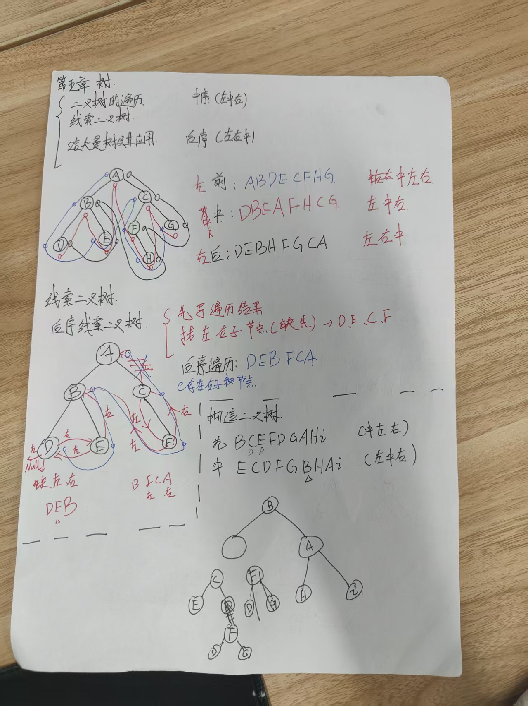

# 红黑树
- [树](#树)
  - [搜索二叉树、平衡二叉树、红黑树](#搜索二叉树、平衡二叉树、红黑树)
  - [红黑树是什么](#红黑树是什么)
  - [为什么需要红黑树](#为什么需要红黑树)
  - [红黑树特性](#红黑树特性)
  - [红树和黑树的区别是什么](#红树和黑树的区别是什么)
  - [红黑树的平衡调整（插入 & 删除）](#红黑树的平衡调整（插入删除）)
  - [红黑树应用场景：](#红黑树应用场景：)

完全二叉树：尽量填满的二叉树，除最后一层不一定满，必须左对齐，不能有空
满二叉树：每个节点，要么有2个节点，要么没有子节点

# 树
1. 二叉树和链表的核心区别
链表是线性结构，仅单 / 双指针遍历，操作 O (n)；二叉树是分层树形结构，每个节点最多两子节点，支持分治遍历，平衡时操作 O (logn)。
2. 平衡树和普通二叉树的核心区别
普通二叉树无高度平衡约束，最坏退化为链表（操作 O (n)）；平衡树强制左右子树高度差≤1，保证操作最坏 O (logn)。
3. 红黑树与平衡树（AVL）的核心区别 + 红黑树优点
红黑树是弱平衡树，高度差允许两倍，旋转次数少；AVL 是强平衡树，高度严格平衡，旋转次数多。红黑树优点：增删时旋转更少，实际并发 / 高频操作性能更优。

## 搜索二叉树、平衡二叉树、红黑树
**搜索二叉树（BST）**：一个节点的左子树的所有节点都小于这个节点，右子树的所有节点都大于这个节点。
当每次插入的元素都是二叉查找树中最大的元素，BST就会退化成一条链表，查找数据的时间复杂度就从O(logn)变成了O(n)，由于树是存储在磁盘中的，访问每个节点，都对应一个磁盘I/O操作，也就是说树的高度等于每次查询数据时磁盘IO操作的次数，所以树的高度越高，就会影响查询性能，再加上不能用范围查询，所以不适合作为数据库的索引结构。
一般很少使用

为解决 BST “易退化” 的问题，就出现了**平衡二叉树（AVL树）**：解决BST在极端情况下退化成链表问题，在BST基础上增加了一些条件约束：每个节点的左子树和右子树的高度差不能超过1，也就是说节点的左子树和右子树仍然为平衡二叉树，这样查询操作的时间复杂度就会一直维持在O(logn)
使用场景：查询操作远多于插入 / 删除操作

AVL树的 “严格平衡” 虽保证了查询效率，但插入 / 删除的旋转开销过高。红黑树通过 “放松平衡约束”，在 “查询效率” 和 “维护成本” 之间找到了更优的平衡点

## 红黑树是什么
在搜索二叉树的基础上，加上5条颜色规则，插入 / 删除时，优先通过 “变色” 调整（成本远低于旋转），仅在变色无法恢复平衡时才触发旋转，且最多只需 2 次旋转（远少于 AVL 树的多次旋转），保证了时间复杂度最坏为O(logn)

## 为什么需要红黑树
二叉查找树（有序二叉树）：特点是左子树节点值都比父节点小，右子树节点值都比父节点大；由于二叉查找树存在极端情况（大部分节点都比父节点值小，然后导致所有的数据偏向左侧，进而退化成链表）

为了解决**二叉树退化成链表**的问题，引入**平衡二叉树**（特点：拥有二叉查找树的全部特性 + 每个节点的左子树和右子树的高度差至多等于1）

由于平衡二叉树通过旋转，解决了节点偏向一边的问题，但是这种高度差为1的要求太严格了，导致每次进行插入/删除节点的时候，几乎都会破坏二叉平衡树的高度1规则，**如果遇到频繁插入/删除的场景，平衡树就会频繁进行调整**，为了解决这个问题，就引入了红黑树

## 红黑树特性
**1、红黑之一**：每个节点只能是红色或黑色
**2、根黑不存**：根节点是黑色
**3、NIL黑**：所有叶子节点（NIL节点）都是黑色的
**4、红色子黑**：红色的节点，它的子节点只能是黑色（不能有连续的红色节点）
**5、黑高相同**：从任何一节点到其每个叶子的所有路径都包含相同数目的黑色节点

它的旋转次数少，插入最多旋转两次，删除最多三次旋转，最坏情况下，也能保证在O(logn)的时间复杂度查找到某个节点

## 红树和黑树的区别是什么
* 红色节点：允许树临时失衡，提高插入和删除的效率。
* 黑色节点：维持平衡，防止树退化成不平衡的链表。
红黑节点的相互作用 让红黑树在平衡性和操作效率之间取得了良好的折中，适用于插入、删除频繁的应用，如操作系统调度、数据库索引等。

## 红黑树的平衡调整（插入 & 删除）
* **插入节点时**：
    * 新插入的节点默认为红色。
    * 如果父节点是红色，可能违反红黑规则，需要旋转（左旋或右旋）和变色（红变黑或黑变红）进行调整。
* **删除节点时**：
    * 若删除的是黑色节点，会破坏黑色平衡，需要调整黑色节点的数量。
    * 通过兄弟节点借黑色或者旋转来恢复平衡。
红黑树的旋转分左旋、右旋，是无数据交换的指针操作，核心调整树形结构解决高度失衡；染色是修改节点颜色，轻量辅助平衡，减少旋转次数；二者配合，以 “先染色后旋转” 的方式，在增删节点后恢复红黑树 5 条核心规则，保证树的弱平衡和 O (logn) 操作效率。

## 红黑树应用场景：
HashMap、Linux的虚拟内存管理、IO多路复用