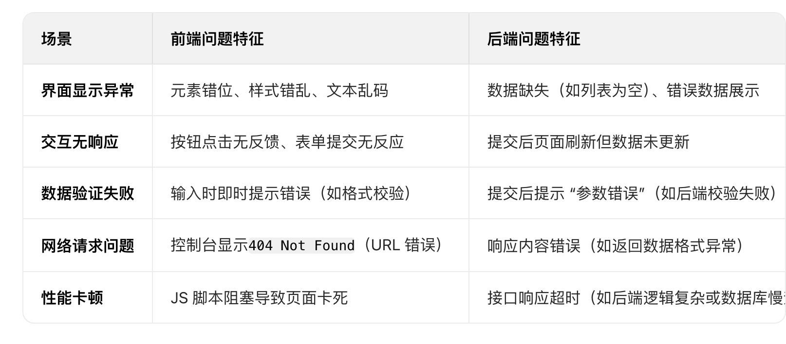
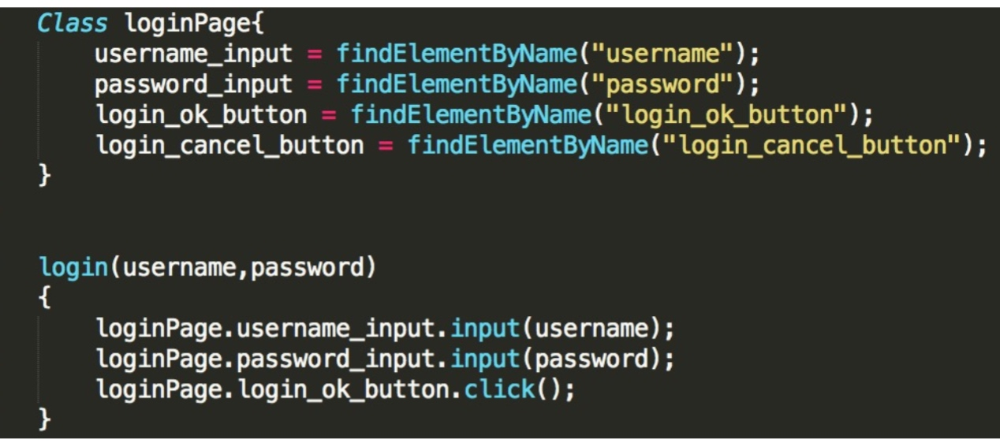
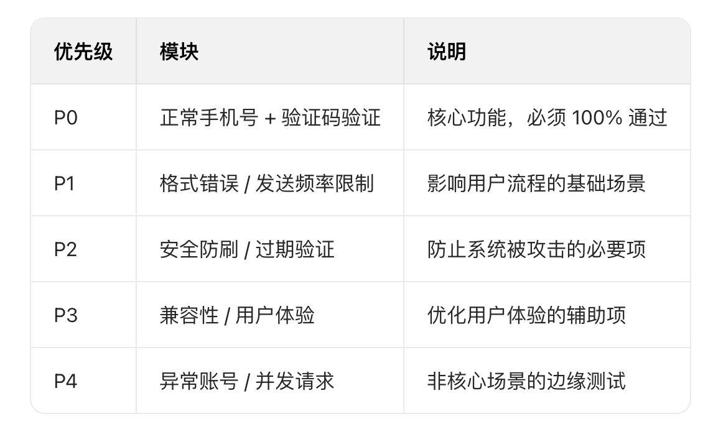
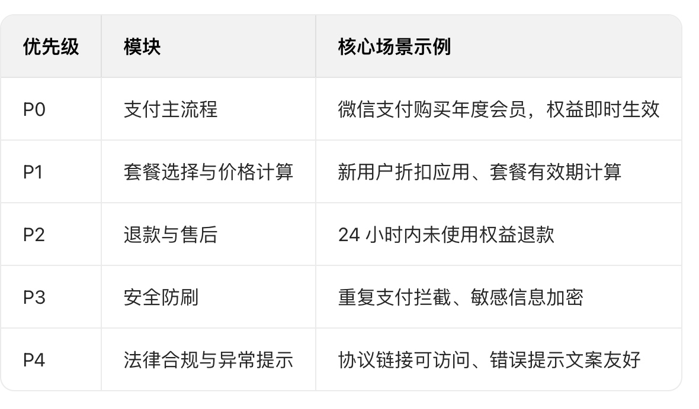
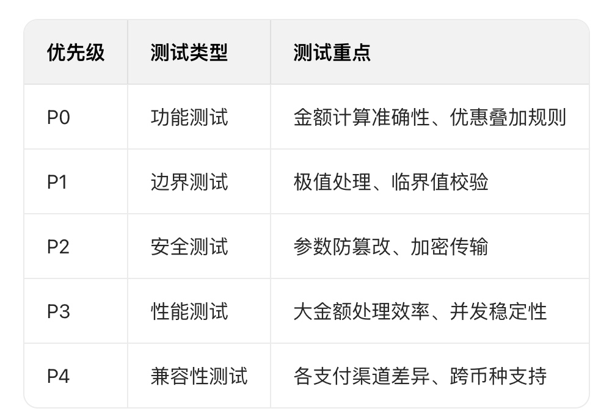

# 测试总结
- [测试总结](#测试总结)
  - [**开发转测试**](#开发转测试)
  - [测试理解](#测试理解)
- [**常见测试方法**](#常见测试方法)
- [**测试的整体流程**](#测试的整体流程)
- [**测试指标**](#测试指标)
- [**CICD**](#cicd)
  - [**怎么判断一个bug 是前端的还是后端的，不用响应码**](#怎么判断一个bug是前端的还是后端的，不用响应码)
  - [**一个接口的组成是什么样的**](#一个接口的组成是什么样的)
- [**软件生命周期**](#软件生命周期)
- [测试内容实践](#测试内容实践)
  - [移动端测试](#移动端测试)
- [APP测试](#app测试)
  - [Web测试和APP测试区别](#web测试和app测试区别)
  - [**ADB**](#adb)
  - [APP兼容性测试](#app兼容性测试)
  - [**Monkey稳定性测试**](#monkey稳定性测试)
  - [**Appium-稳定性测试**](#appium稳定性测试)
    - [**原理**：](#原理：)
    - [**流程**：](#流程：)
  - [录制转代码编写脚本](#录制转代码编写脚本)
- [**PyTest**](#pytest)
  - [Pytest测试用例通过不通过如何判断（标准），assert如何设置的](#pytest测试用例通过不通过如何判断（标准），assert如何设置的)
- [**Selenium**](#selenium)
  - [工作流程](#工作流程)
  - [SeleniumV2.0工作原理](#seleniumv2-0工作原理)
  - [脚本与数据的解耦 + Page Object（页面对象）模型](#脚本与数据的解耦page-object（页面对象）模型)
  - [业务流程封装](#业务流程封装)
  - [页面对象自动生成技术](#页面对象自动生成技术)
  - [GUI测试稳定性技术](#gui测试稳定性技术)
  - [GUI自动化测试报告](#gui自动化测试报告)
  - [常用 Selenium 元素定位方法](#常用selenium元素定位方法)
- [测试用例设计](#测试用例设计)
  - [理解“好的”测试用例](#理解“好的”测试用例)
  - [**登录页面**](#登录页面)
  - [**百度网盘**](#百度网盘)
  - [**微信红包**](#微信红包)
  - [**如何测试一个水杯**](#如何测试一个水杯)
  - [**安装包测试**](#安装包测试)
  - [手机号登陆验证码测试](#手机号登陆验证码测试)
  - [购买大会员](#购买大会员)
  - [支付金额测试](#支付金额测试)
- [**自动化测试**](#自动化测试)
  - [敏捷开发](#敏捷开发)
  - [Postman](#postman)
  - [jmeter](#jmeter)


## **开发转测试**
1、兴趣，测试更看重知识广度，相比技术，我更感兴趣的是业务；

2、也不用完全放弃之前积累的开发能力，反而能把代码、自动化相关的技能用在测试工作中，比如写自动化脚本、搭建测试工具；

最后，很多人觉得测试不如开发，但对我来说，我觉得岗位只有匹配与否，作为应届生，我之前的经历多是横向涉猎，我觉得现在更需要一个能稳定下来纵向深耕的职业方向，这个岗位能发挥我的复合技能，所以这是我想长期做的方向。


## 测试理解
**测试，就是为了发现至今未发现的bug、保证更好的用户体验以及我们的产品质量，其实在实际工作中，测试和开发是“你中有我，我中有你”的关系，对于开发的话，如果我在开发之前就提前预知测试用例或者测试内容，我就会在开发过程中，以测试用例进行驱动开发，从而缩短软件开发生命周期。**
相比纯测试人员，我的开发背景能让我：

* 更精准地理解开发团队的技术实现，降低我们组的沟通成本；
* 在自动化测试中，用 Python 编写脚本时更懂代码可测性设计；
* 在流程优化中，从开发 - 测试协同的角度提出建议（比如我曾主导将单元测试与接口测试集成，减少重复用例编写）。


# **常见测试方法**
* **1、确定测试范围和优先级**：根据需求文档或功能说明书，明确需要测试的功能模块和模块相对于项目的优先级。
* **2、测试用例设计**：
    * **安全测试**：评估软件对非法入侵的防护能力。
        * SQL注入、暴力破解防护（登陆20次）、验证码（危险操作二次验证）、密码加密；考虑系统容灾性，采用数据库主备；外网访问程序，内网访问数据库，不在同一台服务器上
        * 密码加密算法（当前算力很强，md5在10多年前还是个不错的加密算法）SM4，国产化密码
        > SM4 算法主要由密钥扩展算法和轮函数（Round Function）组成。密钥扩展算法将 128 比特的密钥扩展成 32 个 32 比特的轮密钥。轮函数则通过非线性变换和线性变换对输入数据进行多轮迭代，最终输出加密结果。
        * 传输加密：AES加密
    * **黑盒测试**：在不考虑软件内部结构和代码实现的情况下，仅根据软件的功能需求进行测试。
        * **功能实现**: 各功能是否符合需求，尤其是核心业务逻辑。
        * **界面测试**：主要测试软件界面的布局、样式、交互等是否符合设计要求、友好的用户交互信息（错误提示）、用户等待加载时间（缓存）
        * **边界测试**：输入框最大长度、超长字符、选取正好等于、刚刚大于或刚刚小于边界的值作为测试数据
        * **等价类划分**：用少量具有代表性的测试输入，覆盖较大范围的测试用例结果。（有效等价类 & 无效等价类）输入年龄（1-120），测试时选择 0、30、121。
        * **错误推测法**：特殊字符、输入非法字符、输入是否合规（输入数字，限制不能输入字符）
        * **测试范围**：RoleID（角色）、AuthorityID（权限）、在测试中以不同角度去测试对应模块
       - **性能测试**：测试软件处理事务的速度、响应时间等性能指标。
    * **白盒测试**：根据软件内部逻辑结构和代码实现，设计测试用例进行测试。
        * 异常处理测试：检查程序是否能正确捕获和处理异常（如空指针、除零、数组越界等）
    * **单元测试**：对软件中的最小可测试单元（如函数、模块）进行测试。
    * **集成测试**：测试模块件的接口和接口数据传递关系，以及模块组合后的整体功能
    * **冒烟测试**：在软件版本发布前进行的基本功能测试，确保软件主要功能能够正常运行
    * **压力测试**：测试软件在极限负载的条件下的运行情况，找出性能瓶颈
    * **可靠/稳定性测试**：验证软件在特定条件下能够稳定运行的能力。
    * **兼容性测试**：测试软件在不同操作系统、浏览器等环境下的运行情况。
* **3、记录和报告问题**
记录和修复问题：如果发现问题，详细记录问题的代码位置、复现步骤和实际结果，在开发人员修复代码后，重新运行测试用例，验证问题是否解决。

* **4、回归测试**
开发人员修复问题后，再次执行相关测试用例，验证问题是否被完全解决


# **测试的整体流程**
1> 需求评审和分析
2> 制定测试计划
3> 根据需求文档编写测试用例
4> 测试用例评审
5> 提测后执行冒烟测试
6> 执行第一轮测试，找bug
7> 执行回归测试，验证bug
8> 执行第二轮测试
9> 部署项目到预生产环境
10> 预生产环境测试
11> 发测试报告
12> 项目上线

# **测试指标**
* **用户角度**：系统响应时间：单个请求从发出到接收到响应的时间（< 200ms 极佳，< 1s 可接受）（系统处理时间、数据库处理时间、网络传输时间）、前端界面展示速度（首页时间、白屏时间、交互时间、完全加载时间）
* **前端性能测试**
    * 浏览器渲染页面时间、资源加载顺序、请求数量、前端缓存使用情况、资源压缩等
    * 减少http请求次数、减少DNS查询次数、使用内容网络分发（CDN：CDN 本质也是缓存，属于部署在网络服务供应商机房中的缓存）、使用Gzip传输文件
* **开发角度**：
    * **系统吞吐量**：系统单位时间内能处理的请求数（HTTP/业务层面 --> “Requests/Second”“Pages/Second”；网络/系统层面 --> Bytes/Second）（**越高越好，衡量系统处理能力**）
    * **并发用户数**：同一时间发起请求的虚拟用户数量（对于已经上线的系统来说，往往采用系统日志分析法获取用户行为统计和峰值并发量）
    * **错误率**（Error）：请求失败的比例，应该趋近于 0，否则代表接口不稳定
    * **思考时间**：模拟用户操作的停顿时间，更真实的模拟用户行为
    * **资源利用率**（**CPU/GPU占用率、内存使用率、磁盘I/O和网络I/O**）
    * 内存泄漏、并发环境下线程安全问题、不合理的线程同步、不合理的资源竞争；必要时采用buffer机制以提高性能，降低I/O；数据是否压缩传输、对于既要压缩又要加密的场景，是否采用先压缩后加密的顺序；数据库是否引入读写分离机制、是否引入必要索引
* **运维角度**：并发时的负载、系统的可能瓶颈、系统配置层的优化、数据库调优、长时间运行稳定性和可拓展性

# **CICD**

持续集成和持续交付/持续部署

通过自动化工具支持软件开发生命周期的实践，用于加速代码更改的交付、提高软件质量并减少部署的风险。

**工作流程**：

**1、代码提交（Commit）**：开发者将代码提交到版本控制系统（如 Git）。

**2、持续集成**
- 自动触发构建（Compile）：编译代码、运行单元测试。 
- 静态代码检查：代码风格和质量检测。
- 生成构建工件（Artifacts）：打包应用程序（如 .jar 文件、Docker 镜像）。

**3、自动化测试**
- 单元测试、集成测试。
- 端到端测试。

**4、持续交付**
- 部署到测试环境。
- 执行更多测试（UI 测试、验收测试）。
- 部署到准生产环境。

**5、持续部署**
- 自动部署到生产环境。
- 实时监控系统运行状态

## **怎么判断一个bug 是前端的还是后端的，不用响应码**


1. 第一步：检查前端渲染与交互
界面渲染问题
检查 HTML 结构是否正确（F12 开发者工具→Elements 面板）。
查看 CSS 样式是否加载（如404错误可能导致样式丢失）。
示例：按钮点击后样式无变化，可能是前端 JS 事件绑定失败。
数据展示异常
打开控制台（F12→Console），查看是否有 JS 报错（如Uncaught TypeError）。
示例：页面显示 “undefined”，可能是前端未正确解析后端返回的 JSON 数据。
2. 第二步：分析网络请求与响应
请求发送阶段
检查请求 URL 是否正确（F12→Network→Headers→Request URL）。
确认请求方法（GET/POST 等）和参数是否符合接口规范（如 JSON 格式是否正确）。
示例：前端误将/api/users写成/api/user，导致 404（虽用户要求不用响应码，但 URL 错误属于前端问题）。
响应接收阶段
查看响应内容是否符合预期（F12→Network→Response）。
示例：后端返回数据格式正确，但前端未正确遍历数组导致列表为空，属于前端问题。
3. 第三步：验证后端逻辑与数据
数据库与接口测试
直接调用后端接口（如 Postman），绕过前端验证数据处理是否正确。
示例：Postman 调用/api/order返回错误数据，而前端请求参数正确，说明后端接口逻辑错误。
数据一致性检查
对比前端展示数据与数据库存储数据是否一致。
示例：前端显示订单状态为 “已完成”，但数据库中状态为 “处理中”，可能是后端更新数据失败。

三、典型案例：通过流程定位问题
案例 1：用户注册失败
前端操作：输入用户名、密码后点击 “注册”，页面无反应。
检查控制台：发现 JS 报错register is not a function→前端注册函数未定义，属于前端问题。
前端操作：点击注册后跳转到错误页面，提示 “用户名已存在”。
用 Postman 调用注册接口：传入相同用户名，接口正常返回 “用户名已存在”→前端正确展示后端错误，属于后端校验逻辑。

## **一个接口的组成是什么样的**
一、REST API 接口组成（Web 服务）
REST API 是当前主流的 Web 接口风格，其组成包括：
1. URL（统一资源定位符）
作用：标识接口的唯一路径
组成部分：
协议：如 https://
域名：如 api.example.com
路径：如 /users/{id}/orders
查询参数：如 ?status=paid&limit=10
2. HTTP 方法
GET：获取资源
POST：创建资源
PUT：更新资源（全量）
PATCH：更新资源（部分）
DELETE：删除资源
3. 请求头（Headers）
Content-Type：请求体格式（如 application/json）
Authorization：认证信息（如 Token）
User-Agent：客户端标识
自定义头：如 X-Request-ID
4. 请求体（Body）
格式：JSON、XML、表单等

响应状态码
200 OK：成功
201 Created：创建成功
400 Bad Request：参数错误
401 Unauthorized：未认证
403 Forbidden：权限不足
404 Not Found：资源不存在
500 Internal Server Error：服务器错误
6. 响应体
格式：JSON、XML、文本等

# **软件生命周期**
1、需求分析

* 与利益相关者（用户、客户、管理层）沟通，了解软件目标。
* 确定功能性需求和非功能性需求。
* 创建需求文档（如SRS，软件需求规格说明书）。

输出：详细需求文档

2、可行性研究

* 技术可行性：是否有技术支持需求的实现。
* 经济可行性：项目成本是否合理，是否可盈利。
* 时间可行性：是否能在限定时间内完成。

输出：可行性报告

3、系统设计

* 系统架构设计：定义模块和组件之间的交互。
* 数据库设计：设计数据存储和访问方式。
* 用户界面设计：定义用户与系统的交互方式。

输出：系统设计文档（如ER图、架构图、流程图）。

4、实现

* 编写代码（使用符合需求的编程语言和工具）。
* 遵循编码规范和最佳实践。阿里松山版
* 使用版本控制系统（如Git）管理代码。

5、测试

* 单元测试：验证每个模块的功能。
* 集成测试：检查模块之间的交互。
* 系统测试：测试整个系统的功能和性能。
* 用户验收测试（UAT）：确保软件满足用户需求。

输出：测试报告，记录发现的缺陷并修复。
6、部署
7、维护

# 测试内容实践
* 并发集合：要求并发集合数是100，考虑网络延迟等原因，会将其设置为120
* 并发用户高峰期的时间分布规律：由于真实环境下的实际负载，会有高峰和低谷的交替变化（比如，对于企业级应用，白天通常是高峰时段，而晚上则是低峰时段），所以为了尽可能地模拟出真实的负载情况，我们会每 12 小时模拟一个高峰负载，两个高峰负载中间会模拟一个低峰负载，依次循环 3-7 天，形成一个类似于“波浪形”的系统测试负载曲线。
* 并发用户业务操作的分布情况。比如，20% 的用户在做登录操作，30% 的用户在做订单操作，其他 50% 的用户在做搜索操作；
* 单一业务操作的用户行为模式。比如，两个操作之间的典型停留时间，完成同一业务的不同操作路径等；
* 达到最高峰负载的时间长度。比如，并发用户从 0 增长到 10 万花费的总时间；

## 移动端测试
* 流量使用过多；
* 耗电量过大；
* 在某些设备终端上出现崩溃或者闪退的现象；
* 多个移动应用相互切换后，行为异常；
* 在某些设备终端上无法顺利安装或卸载；
* 弱网络环境下，无法正常使用；
* Android 环境下，经常出现 ANR(Application Not Responding)；
* 端到端的相应时间、Crash率、内存使用率、FPS

**1、交叉事件测试（中断测试）** --> 真机测试（手工）
APP执行过程中，有其他事件或者应用中断当前应用程序的执行
比如，App 在前台运行过程中，突然有电话打进来，或者收到短信，再或者是系统闹钟等。
**场景：**
多个 App 同时在后台运行，并交替切换至前台是否影响正常功能；
要求相同系统资源的多个 App 前后台交替切换是否影响正常功能，比如两个 App 都需
要播放音乐，那么两者在交替切换的过程中，播放音乐功能是否正常；
App 运行时接听电话；
App 运行时接收信息；
App 运行时提示系统升级；
App 运行时发生系统闹钟事件；
App 运行时进入低电量模式；
App 运行时第三方安全软件弹出告警；
App 运行时发生网络切换，比如，由 Wifi 切换到移动 4G 网络，或者从 4G 网络切换到
3G 网络等；

**2、兼容性测试** --> 各种真机执行相同或类似的测试用例（自动化）
确保 App 在各种终端设备、各种操作系统版本、各种屏幕分辨率、各种网络环境下，功能的正确性。
**场景：**
不同操作系统的兼容性，包括主流的 Andoird 和 iOS 版本；
主流的设备分辨率下的兼容性；
主流移动终端机型的兼容性；
同一操作系统中，不同语言设置时的兼容性；
不同网络连接下的兼容性，比如 Wifi、GPRS、EDGE、CDMA200 等；
在单一设备上，与主流热门 App 的兼容性，比如微信、抖音、淘宝等；
**工具**：第三方的移动设备云测试平台完成兼容性测试

**3、流量测试**
**场景：**
App 执行业务操作引起的流量；
App 在后台运行时的消耗流量；
App 安装完成后首次启动耗费的流量；
App 安装包本身的大小；
App 内购买或者升级需要的流量
**工具**：Android自带的工具进行流量统计，或者Wireshark网络分析工具，对于 Android 系统，网络流量信息通常存储在 /proc/net/dev 目录下，也可以直接利用ADB 工具获取实时的流量信息。另外，我还推荐一款 Android 的轻量级性能监控小工具
Emmagee，类似于 Windows 系统性能监视器，能够实时显示 App 运行过程中 CPU、内存和流量等信息。
**解决**：
启用数据压缩，尤其是图片；
使用优化的数据格式，比如同样信息量的 JSON 文件就要比 XML 文件小；
遇到既需要加密又需要压缩的场景，一定是先压缩再加密；
减少单次 GUI 操作触发的后台调用数量；
每次回传数据尽可能只包括必要的数据；
启用客户端的缓存机制；

**4、耗电测试**
App 特别耗电、让设备发热比较严重，那么你的用户一定会卸载你的 App 而改用其他 App。最典型的就是地图等导航类的应用，对耗电量特别敏感。
**场景**：
App 运行但没有执行业务操作时的耗电量；
App 运行且密集执行业务操作时的耗电量；
App 后台运行的耗电量。
**工具**：Android 通过 adb 命令“adb shell dumpsys battery”来获取应用的耗电量信息；
iOS 通过 Apple 的官方工具 Sysdiagnose 来收集耗电量信息，然后，可以进一步通过Instrument 工具链中的 Energy Diagnostics 进行耗电量分析。
history batterian

**5、弱网测试**
移动应用的测试需要保证在复杂网络环境下的质量。具体的做法就是：在测试阶段，模拟这些网络环境，在 App 发布前尽可能多地发现并修复问题。
**工具**：Facebook 的 Augmented Traffic Control（ATC）
它能够在移动终端设备上通过 Web 界面随时切换不同的网络环
境，同时多个移动终端设备可以连接到同一个 Wifi，各自模拟不同的网络环境，相互之间不会有任何影响。

**6、边界测试**
**场景**：
系统内存占用大于 90% 的场景；
系统存储占用大于 95% 的场景；
飞行模式来回切换的场景；
App 不具有某些系统访问权限的场景，比如 App 由于隐私设置不能访问相册或者通讯录等；
长时间使用 App，系统资源是否有异常，比如内存泄漏、过多的链接数等；
出现 ANR 的场景；
操作系统时间早于或者晚于标准时间的场景；
时区切换的场景；

# APP测试
## Web测试和APP测试区别
* 相同：功能测试基本都是一样的，（需求分析 --> 提炼测试点 --> 编写测试用例 --> 执行用例 --> 提Bug --> 复测，回归）
* 区别：web端是B/S架构，App是C/S架构，由于架构不同，所以Web端一般服务器更新的时候，客户端不需要更新，因为它是通过浏览器访问的，服务器更新了，客户端也更新了，APP端要更新的话，就需要手动升级更新才算是新的版本。
* 测试指标：APP的性能测试关注的是手机本身的资源的性能问题，比如CPU、GPU、内存、电量、流量、页面加载响应时间，软件启动时间等

## **ADB**
本质就是一个android调试桥，主要用来监控手机设备，实现手机端与电脑端的通信，通过ADB来实现对手机的管控。比如：通过ADB安装、卸载软件、查看手机资源使用情况、查看CPU内存等资源、实现手机端与电脑的文件的传输、查看手机端APP运行的日志，通过日志来分析具体问题。

**ADB命令**
```bash
# 查看所有功能
adb 
# 查看当前有几台设备
adb devices
# 有的时adb后台失去响应,关闭ADB后台进程
adb kill-server 
# 让Android脱离USB线的TCP连接
adb tcpip 
# 连接开启了TCP连接方式的手机
adb connect
# 获取安卓模拟器日志（过滤出日志中包含 "Displayed" 这个词的行）-捕捉APP入口
adb logcat | grep Displayed
# 收集日志数据，用于后续的分析，比如耗电量
adb bugreport
```

adb shell

```bash
# 启动应用
adb shell am start -W -n com.xueqiu.android/.view.WelcomeActivityAlias -S
# 获取一个APP的CPU、GPU、内存、耗电量、网络流量
adb shell dumpsys
# 清理特定包的缓存数据-干净环境（重新设置权限：拍照、通知等）
adb shell pm clear
# 生成UI组件节点生成XML文件 -了解APP整体界面的结构
adb shell uiautomator dump
生成路径
# 查看文件内容
adb shell "uiautomator dump && cat /../../.xml"
# 数据事件（模拟点击事件，x、y轴）
adb shell imput tap x y
```

模拟触摸与输入
```
adb shell input tap x y  # 模拟点击 (x, y) 位置
adb shell input swipe x1 y1 x2 y2  # 模拟滑动
adb shell input text "Hello"  # 模拟输入文本
adb shell input keyevent KEYCODE_HOME  # 模拟按键事件
```

文件操作
```
文件传输：通过 adb push 和 adb pull 将文件从本地机器传输到设备，或者将设备上的文件拉取到本地。
adb push local_file /sdcard/remote_file
adb pull /sdcard/remote_file local_file

设备文件管理：通过 adb shell 进入设备的 shell 环境，使用常规 Linux 文件管理命令（如 ls, cd, rm, cp 等）对设备文件进行操作。
adb shell ls /sdcard/
adb shell rm /sdcard/oldfile.txt
adb shell cp /sdcard/newfile.txt /data/data/com.package.name/
```

查看系统信息
```
# 查看活动和任务管理相关信息。
adb shell dumpsys activity 
# 查看电池的状态。
adb shell dumpsys battery
# 查看CPU
adb shell top
# 查看磁盘
adb shell df
# 查看进程
adb shell ps
```

## APP兼容性测试
兼容性以真机测试为主，机型选择:公司提供7-8款机型华为荣耀两款，小米2款以及 vivo, oppo、三星等。系统版本:系统版本主要覆盖以 6.017.0\8.0 为主 5.0 以下不要求测试，覆盖不到位的测试机型，通过云测覆盖，云测用`testin`云测平台，公司提供账号，登录后把`apk`上传，选择要测试机型，云测试有60款机型，主要覆盖市面上主流机型，每个系列选几款,用真机测过则不在选择,做一些相关配置云测平台主要帮做智能遍历，安装，启动，运行，卸载，初始化，`Monkey`测试相关的测试则通过真机测，云测平台没有测过，配置好了之后，提交测试即可，提交测试后，需要几个小时就会出报告。然后分析报告，主看遍历，安装，启动，运行，卸载，初始化相关哪些机型有出问题，对于出问题的机型，一般会先补测一下，如果还有问题，我们会向公司申请真机再真机进行复测，如果真机复测有问题，就通过利用`adb logcat`查看错误日志，分析具体的问题所在。
兼容性测试主要就是看软件在不同机型，不同系统版本不同分辨率下能不能正常安装,卸载是否能正常启动,运行,初始化，把各个功能都进行运行一遍，主要跑主流程，看有没有问题、还要查看看软件在不同屏幕大小，不同的分辨率的手机下显示是否正常，是否有拉伸，显示不全，或显不清晰的问题。

## **Monkey稳定性测试**
作用：
* 模拟随机操作，检测 APP 长时间运行的稳定性
* 可用于崩溃、ANR（无响应）、异常捕获等测试
* 可以持续运行，长时间监测稳定性
* 可以结合日志分析，定位 BUG

`Monkey`主要通过模拟用户发送伪随机时间去操作软件，通过执行 Monkey 命令，它会自动出报告，执行测试大概在 10万次，每个动作的间隔时间 250ms，主要就是看软件长时间，随机乱操作的情况，是否会出现异常,闪退崩溃等现象    
我都是在下班的时间晚上时间执行 Monkey 命令，结合GT进行监视APP性能数据（CPU、GPU、内存、流量、帧数、），并把生成的报告导出到电脑端，大概需要 6、7 小时，第二天早上看报告，分析报告，如果出现问题，一般利用上次执行的那个种子值，再进行执行命令进行复测一下，像 monkey 命令:
```
adb shell monkey -p com.xy.android.junit -s 12345 --throttle 250 --ignore-crashes --ignore-timeouts --monitor-native-crashes -v -v 100000 > "E:\monkey_log\monkey_log.txt"
```
- -p 指定包名
- -s 随机种子值（通过指定 固定的种子值（比如 12345），可以 复现相同的测试过程，方便 Debug。）
- -throttle 每 250 毫秒 触发一个随机事件（模拟真实用户），如果不加这个参数，monkey运行的速度太快，崩溃太快，无法分析问题
- --ignore-crashes 忽略Crash（崩溃）
- --ignore-timeouts 忽略ANR（应用无响应）
- --monitor-native-crashes 监控native层崩溃
- -v -v 日志更详细，输出更多 调试信息
> // 触发了哪些操作
>// 触发了点击 / 滑动 / 方向键 / Home 键 / 返回键
-  "E:\monkey_log\monkey_log.txt"  控制台的输出 写入到日志文件 monkey_log.txt

主要关注几点:1.指定种子值 2.忽路一些异常，保证能正常执行完成 3.设置间隔时间 4.配置一些时间比例 5.然后就是执行的次数。报告怎么分析，主要看有无CRASH(崩溃)ANR(超时无响应)， Exception(异常)等情况，像有无空指针异常( NullPointException)啊，00M 等现象啊等等，找到CRASH 崩溃 ANR 超时无响应 Exception 异常的位置，看出现错误的上一个动作是什么,什么做了什么动作导致错误出现。异常信息会详细的指出哪个 Activity 出现了问题，甚至于哪个函数出问题了，具体哪个位置。然后把报告中出现的日志信息截图发，查看git提交人，测试报告结果（bug截图、描述问题、改正信息）内网邮件发送给开发，开发修复完成之后，我们会根据种子值在进行复测一下。

**实际操作**
我在运行 monkey 发现过很多的问题我就简单的说几个问题，举个例子在查看 monkey 运行日志中
(1)com.androidserver.am.NativeCrashListener.run(NativeCrashListener.java: 129)
属于本地监听代码导致的崩溃，手机监听代码导致的崩溃他是手机产生的原因，不是代码的原因不做处理
(2)//Short Msg:java.lang.IllegalArgumentException 传参异常需要一个 strng 类型，给我一个 int 类型
(3)//Short Msg:java.lang.NullPointerException 空指针异常
(4)//Short Msg:Native crash 本地代码导致的奔溃
(5)(com.koudaizhekou.tbk/com.uzmap.pkg.EntranceActivity)超时无响应等等等…
[maxim-改进版的monkey，提供预编译包](https://github.com/zhangzhao4444/Maxim?tab=readme-ov-file)

```bash
adb shell CLASSPATH=/sdcard/monkey.jar:/sdcard/framework.jar exec app_process /system/bin tv.panda.test.monkey.Monkey -p com.panda.videoliveplatform --uiautomatormix --running-minutes 60 -v -v
```
* `--uiautomatormix`： 遍历策略-深度遍历（深度点击一个组件，这样相对来说会覆盖更广一点）还是随机遍历
* 比monkey更智能一些


## **Appium-稳定性测试**
### **原理**：
Appium 属于 C/S 架构，Appium Client通过多语言支持的第三方库向 Appium Server 发起请求，基于 Node.js 的Appium Server 会接受 Appium Client 发来的请求，接着和 iOS 或者 Android 平台上的代理工具打交道，代理工具在运行过程中不断接收请求，并根据 WebDriver 协议解析出要执行的操作，最后调用 iOS 或者 Android 平台上的原生测试框架完成测试。
### **流程**：
1、BeforeTest构造 DesiredCapabilities 对象，设置参数（版本、IOS/Android/真机的型号/APP包）、设置Driver的 url
2、Test：Driver.findElementByAccessibilityId(文本元素)、然后进行test assert equals是否符合预期
3、AfterTest退出

连接方式：USB/TCP连接真机/模拟器
功能、回归测试
测试脚本可以记录详细的日志和断言，可以提供精确的结果分析，帮助开发人员定位具体的 bug 或问题。

```bash
# 生成日志（时间）
appium -g /tmp/appium_0118.log

# 查看日志 appium log
appium -g <log file path>

# Get response with status 200 对应的sessionID ，value[{element},...]，响应时间
```

测试用例

1、录制脚本

2、复制到pycharm

3、导入appium库

4、设置caps参数

5、创建一个webdriver

6、各种自动化操作

```python
# 组件定位,Xpath
el2 = driver.find_element_by_id（"com.alibaba/search_input_text"）
el2.send_keys("pdd")
```

7、quit退出

测试框架Pytest + appium-python-client 最后加上一个assert断言对结果预期的一个判断

```python
@pytest.mark.parametrize("keyword, expectd_price" [("pdd",20)])
```

通过Appium的官方文档查询对应API操作，Xpath定位元素（X、Y坐标）

**错误排查和日志分析**

比如说我们的脚本出现了异常信息，可以通过分析log，获取一个完整的一个认识

**调试分析方法**

* Appium Log | Appium service

  * 记录了所有的请求和结果以及底层的错误堆栈

* 分析界面数据

  * 使用getPageSource获取界面的完整DOM结构（元素找不到）

  ```python
  caps["showChromedriverLog"] = True
  caps["printPageSourceOnFindFaiure"] = True
  ```

  * 利用Xpath获取所有匹配的元素


## 录制转代码编写脚本

**录制模式** 适合快速生成简单的测试脚本，适用于快速原型验证或小规模测试。

**代码编写模式** 则提供了更高的灵活性、可维护性和可扩展性，适合大型、复杂和长期维护的测试项目。

# **PyTest**
## Pytest测试用例通过不通过如何判断（标准），assert如何设置的
测试用例是否通过的判断：
1、判断接口的状态（状态码200、响应时间<500ms）
```
def test_task_list(api_client):
    response = api_client.get("/api/task/list")
    assert response.status_code == 200
```

2、判断UI自动化结果（结合selenium，测返回字段）
```
def test_ui_task_list(driver):
    driver.get("http://巡检APP首页")
    task_title = driver.find_element(By.XPATH, "//h1").text
    assert "任务列表" in task_title
```
用例通过的标准：`asssert`断言全部成立同时无异常抛出、UI页面展示正确、接口数据和数据库结果一致、测试日志无错误、pytest测试结果为PASSED

# **Selenium**
应用 Selenium + Xpath
## 工作流程
1、创建WebDriver实例，打开浏览器（Chrome），WebService绑定工作
2、driver.navigate().to(s:"http://XXX")，浏览器打开网页
3、WebElement search_input = driver.findElement(By.name("wx"))，使用driver的findElement方法，通过name属性标签定位到搜索输入框，并将该搜索输入框命名为search_input
4、search_input.sendKeys(...charSequences:"长春理工大学")
5、search_input.submit() // 提交搜索申请
6、Thread.sleep(millis:3000) // 强制等待固定时间
7、Assert.assertEquals(expected:"长春理工大学_百度搜索")，通过junit的assertEquals比较浏览器标题和预期结果，其中标题通过driver.getTitle()得到，如果一致，测试通过，否则测试失败
8、driver.quit() // 关闭浏览器

## SeleniumV2.0工作原理
核心：使用浏览器原生的WebDriver实现操作
1. 当使用 Selenium2.0 启动浏览器 Web Browser 时，后台会同时启动基于 WebDriver Wire 协议的 Web Service 作为 Selenium 的 Remote Server，并将其与浏览器绑定。绑定完成后，Remote Server 就开始监听 Client 端的操作请求。
2. 执行测试时，测试用例会作为 Client 端，将需要执行的页面操作请求以 Http Request的方式发送给 Remote Server。该 HTTP Request 的 body，是以 WebDriver Wire 协议规定的 JSON 格式来描述需要浏览器执行的具体操作。
3. Remote Server 接收到请求后，会对请求进行解析，并将解析结果发给 WebDriver，由 WebDriver 实际执行浏览器的操作。
4. WebDriver 可以看做是直接操作浏览器的原生组件（Native Component），所以搭建测试环境时，通常都需要先下载浏览器对应的 WebDriver。


## 脚本与数据的解耦 + Page Object（页面对象）模型
以页面为单位来只封装页面上的控件，我们这边是把控制操作部分单独封装了，没有和控件一起
控件是页面的更小单元，且一个产品中使用的控件种类有限，但是页面却很多，每个页面控件组合方式又不同，在项目中两种方法多次实践后，将控件单独封装后，页面操作又节约大量的开发和维护成本



## 业务流程封装
实际项目也用了基于业务流程封装的业务关键字，写测试用例过程非常灵活好用，功能变更只需要修改业务关键字内部结构，不改用例; 

## 页面对象自动生成技术
(Katalon Studio)使用场景：需要维护大量页面对象的中大型GUI自动化测试项目
不用手动维护Page Class，只需要提供Web URL，就可以自动帮你自动生成这个页面的所有空间的定位信息，并自动伸出个好难过Page Class（有时候前端开发人员没有严格遵循可测试性的代码要求）

**无头浏览器**：（Headless Chrome、Puppeteer 框架）运行在内存中的浏览器，拥有完整浏览器内核，与普通浏览器最大的不同是，执行过程中看不到运行的界面，但是依然可以用GUI测试框架的截图功能截取到它执行中的页面
**无头浏览器应用场景**：GUI自动化测试、界面监控、网络爬虫
**优点**：1、测试速度快（无需加载CSS渲染界面）；2、减少对测试执行的干扰（其他软件弹出窗口）；3、对于大量测试用例的执行而言，可以减少对大规模Selenium Grid集群的依赖，GUI测试可以直接运行在无界面的无服务器上。
**缺点**：不能完全模拟真实的用户行为，不适用于需要对页面布局进行验证的场景

## GUI测试稳定性技术
GUI 自动化测试稳定性，最典型的表现形式就是，同样的测试用例在同样的环境上，时而测试通过，时而测试失败
**五种测试不稳定因素**：
1. 非预计的弹出对话框；
    * 突然弹出新的对话框，只能通过自动化的方式尝试点击上面的按钮进行处理，每当发现一种潜在会弹出的对话框，我们就会把他的详细信息（包括对象定位信息等）更新到“异常场景恢复”库中，下次再遇到同类对话框，系统就可以自动关闭了
2. 页面控件属性的细微变化；
    * Buttun_login_01 --> Button_login_09，导致元素定位失败 --> 模糊匹配
3. 随机的页面延迟造成控件识别失败 --> 步骤级别、页面级别和业务流程级别的重试机制（对于修改一次性使用数据的场景，不要盲目启动重试）

## GUI自动化测试报告

理想中的 GUI 测试报告应该是由一系列按时间顺序排列的屏幕截图组成，并且这些截图上可以高亮显示所操作的元素，同时按照执行顺序配有相关操作步骤的详细描述

**将异常，截图，标记高亮，携带函数名/页面名 + 时间 --> 测试报告**

发现问题 --> 递交缺陷 --> 实现测试报告和缺陷管理系统的交互


## 常用 Selenium 元素定位方法

| 方法                                      | 示例代码                                         |
| ----------------------------------------- | ------------------------------------------------ |
| `find_element(By.ID, id)`                 | `driver.find_element(By.ID, "username")`         |
| `find_element(By.NAME, name)`             | `driver.find_element(By.NAME, "q")`              |
| `find_element(By.XPATH, xpath)`           | `driver.find_element(By.XPATH, "//input")`       |
| `find_element(By.CSS_SELECTOR, selector)` | `driver.find_element(By.CSS_SELECTOR, ".class")` |
| `find_element(By.TAG_NAME, tag)`          | `driver.find_element(By.TAG_NAME, "button")`     |

# 测试用例设计
## 理解“好的”测试用例
如果把被测试软件看作一个池塘，软件缺陷是池塘中的鱼，建立测试用例集的过程就像是在编织一张捕渔网。“好的”测试用例集就是一张能够覆盖整个池塘的大渔网，只要池塘里有鱼，这个大渔网就一定能把鱼给捞上来。当然了，测试用例如果要精准考虑，很难做到，我们只能尽可能把影响较为严重的，需要最急的优先级最高的优先考虑

## **登录页面**

* 一、功能性测试
    * **1. 正确的用户名和密码**：输入正确的用户名和密码，点击登录按钮，检查是否成功登录 --> 用户成功登录，跳转到登录后的页面。
    * **2.错误的用户名或密码**：输入错误的用户名或密码，点击登录按钮，检查是否显示正确的错误提示 --> 显示错误提示信息，如“用户名或密码错误”，不要是直接跑出异常，对于用户不是很友好的信息等，比如一些“Exception之类的”。
    * **3.非空校验**：用户名或密码字段都为空时，尝试登录，其中一个为空时--> 提示用户输入用户名和密码。
    * **4.登录按钮禁用状态**：在没有输入任何数据时，检查登录按钮是否处于禁用状态（灰色按钮设置），点击登陆后，按钮立刻进入灰度设置，防止用户一直点击登陆，爆破数据库
    * **5.自动重定向到登录页面**：在用户未登录的情况下，访问需要认证的url，系统应该自动重定向到登录页面 --> 页面应该自动跳转到登录页面。
    * **6.大小写是否敏感，是否对空格敏感**
    * **7.忘记密码功能是否可用**
    * **8.权限**：不同roleID、权限ID，判断管理员和普通用户，是否可以查看对应的界面
    * **9.日用户登录操作日志打印**：用户登录过程中log中是否有个人信息明文打印
    * **10.登录用户限制**：比如同时支持10个用户登录，同时9个或者11个用户登录是否正常或者

* 二、边界测试
    * **1.用户名和密码的最大长度**：前端页面是否根据设计要求限制用户名和密码长度，输入最大长度 --> 一般在需求文档，建表第一步，前后端数据库就统一长度（例如50 字符）进行登录 --> 系统应能正确处理最大长度的输入，不发生溢出或错误，应提示用户输入的内容超出长度限制。
    * **2.特殊字符输入**：在用户名和密码字段中输入特殊字符（如 `!@#$%^&*`） --> 系统应允许特殊字符输入，并且不会导致登录失败（如果是合法的字符）。

* 三、安全性测试
    * **1.暴力破解防护**：多次尝试输入错误的用户名和密码（例如 15 次以上） --> 系统应限制连续失败的登录次数，提示用户“多次尝试失败，请稍后再试”或采取验证码验证等安全措施。
    * **2.验证码功能**：输入正确的验证码是否可以正常登录；是否可以点击刷新验证码；点击刷新页面后，验证码是否自动刷新；验证码发送后在2min内有效，超过就失效需要重新发送；是否会在一定阈值时间内连续爆破验证码功能（发送一次验证码需要等1min后再发，连续发送多次，超过指定阈值（10/15）次就判定你为脚本，直接拉黑），因为发送运营商发送短信这个API也是有一定成本的
    * **3.密码加密**：检查密码是否经过加密存储（不明文保存密码），页面的url中是否会加密显示我们的密码，我们对密码进行修改的时候，是否会校验密码的强弱程度（强：特殊字符，大小写、数字），我们这边利用的是SM4国密算法，如果对于安全性要求比较高的场景，可以选择加随机盐，但是会对后端判断密码有一定的性能损耗，结合具体需求，去应用
    * **4.传输加密**：用户名、密码以及一些重要信息（合同信息、用户隐私数据-身份证号码、手机号码、邮箱），是否会在传输的过程中加密传输（不要明文传输）
    * **5.SQL 注入攻击**：在用户名和密码字段中输入 SQL 注入攻击语句（例如 `'; DROP TABLE users; --`） --> 系统应防止 SQL 注入攻击，抛出适当的错误提示，并且不执行恶意 SQL 查询。
    * **6.XSS 跨站脚本攻击**：用户名和密码的输入框中分别输入典型的“XSS 跨站脚本攻击”字符串，验证系统行为是否被篡改

* 四、兼容性测试
    * **1.不同浏览器兼容性**：同一用户在同一终端的多种浏览器（如 Chrome、Firefox、Safari、Edge）上登录，验证登录功能的互斥性是否符合设计预期；
    * **2.不同设备兼容性**：同一用户先后在多台终端（如手机、平板、PC）上登录，验证登录是否具有互斥性。
    * **3.响应式设计**：检查页面在不同屏幕尺寸下是否适配良好，按钮和输入框是否被遮挡 --> 页面布局应该适配不同的屏幕尺寸。

* 五、用户体验测试
    * **1.错误提示信息**：输入错误的用户名或密码，检查系统是否显示合适的错误信息 --> 错误信息应清晰、简洁，并帮助用户纠正问题（如“用户名或密码错误”）。
    * **2.表单字段的聚焦**：测试页面加载后，是否自动聚焦到第一个输入框（通常是用户名框） --> 页面加载时，焦点应自动聚焦到第一个输入框。
    * **3.登录失败后的重试**：登录失败后，检查用户能否快速重试并重新输入正确的凭据 --> 用户能够快速重试，输入框应自动清空并等待用户输入。

* 六、性能测试
    * **1.单用户**：单用户登录的响应时间是否小于3s，单用户登录的时候，后台请求数量是否过多
    * **2.高并发测试**：高并发场景下，用户登录相应时间是否小于5s；高并发下服务端的监控指标是否符合预期；是否存在资源死锁和不合理的资源的等待；长时间大量用户连续登录和登出，服务器是否存在内存泄漏

压力测试

总结，**在绝大多数的测试过程中呢，受限于项目周期和经济成本，我们无法去穷尽所有可能的组合，而是对比风险优先级驱动测试，有所侧重地选择测试范围和测试用例的设计，来寻求缺陷风险和研发测试成本之间的平衡点**。

## **百度网盘**
采用脚本录制的形式，测试包括
流程：1、登录百度网盘 --> 2、逻辑 --> 3、点击按钮 --> 4、生成脚本 --> 5、运行脚本

* 功能测试：
    * 登录（成功登录，预期结果就是成功进入用户页面；账号和密码有一个错误，预期结果就是提示账号或密码错误）
    * 文件上传、文件下载（成功上传（一个文件/多个文件），预期结果就是上传的文件显示在百度网盘的列表中；上传失败，预期结果就是提示异常信息，比如上传的文件超过最大文件的容量限制）
    * 分享文件、取消分享（分享文件：1、登录百度网盘，2、选择一个文件，点击分享按钮，3、设置分享权限，复制分享链接 --> 结果：成功并复制分享链接；取消分享：选择一个分享的文件，点击取消分享 --> 结果：文件分享链接失效，无法访问）
    * 通过文件名搜索：登录百度网盘，输入框输入文件名，点击搜索（成功搜索， 没有找到符合条件的文件）

* 系统性能和压力测试

    * 测试系统在高并发情况下的表现，是否能够承受大量用户同时进行文件上传、下载、查询等操作。

    * 验证大文件上传下载的性能，确保系统不会因为文件过大而崩溃。

    * 测试服务器响应时间，确保在正常使用情况下，用户操作能得到及时响应。

* 异常与错误处理

    - 测试系统如何处理文件上传/下载过程中的网络中断、服务器崩溃等异常情况。
    - 确保系统能够提供合理的错误提示，并恢复用户的操作。
    - 测试系统是否会在出现错误时能保持数据一致性，避免数据丢失或损坏。

**下载文件的时候，如果由于用户的网络波动，下载无法继续，如何存储当前下载进度，等用户网络恢复后，继续原来的进度下载**

**通过 HTTP 请求头中的 Range 字段来实现断点续传**：

**下载过程**：

1. 先检查当前下载路径是否有重复文件，如过没有则客户端发起下载请求，并使用 `Range` 请求头来指定从哪里开始下载。
2. 每下载一定量的字节后，更新本地进度文件，记录最新的下载位置。
3. 如果下载过程中断（例如，网络波动），客户端会记录当前的下载进度。

**恢复下载**：

1. 客户端检查到下载中断时，读取本地保存的JSON进度文件，获取上次下载的位置。
2. 如果网络恢复，客户端发起新的请求，从中断的位置继续下载。

```json
{
  "fileName": "example.zip",
  "totalSize": 1024000,
  "downloadedBytes": 512000
}
```

## **微信红包**

* 一、功能性测试

* **1. 红包发送**

> - 测试用例 1：
> 
>    正常情况下发送红包
> 
>   - 输入正常金额（如 1 元），点击发送。
>   - **预期结果**：红包发送成功，页面提示“红包已发送”。
> 
> - 测试用例 2：
> 
>    发送金额为零或负数的红包
> 
>   - 输入金额为 0 或负数，点击发送。
>   - **预期结果**：提示“金额无效”或“红包金额不能为零”。
> 
> - 测试用例 3：
> 
>    发送超过单笔红包上限的金额
> 
>   - 输入金额超过平台允许的单笔红包上限（如 200 元），点击发送。
>   - **预期结果**：提示“超出红包限额”。
> 
> - 测试用例 4：
> 
>    发送多个红包（大额与小额红包组合）
> 
>   - 输入多个红包金额（如 10 个红包，总金额为 50 元），点击发送。
>   - **预期结果**：红包列表正确显示金额和状态。
> 
> - 测试用例 5：
> 
>    用户余额不足时发送红包
> 
>   - 输入金额大于账户余额，点击发送。
>   - **预期结果**：提示“余额不足，无法发送红包”。

* **2.红包接收**

> 
> - 测试用例 1：
> 
>    正常接收红包
> 
>   - 用户收到红包，点击领取。
>   - **预期结果**：红包成功领取，余额更新，显示“红包已领取”。
> 
> - 测试用例 2：
> 
>    用户余额不足时接收红包
> 
>   - 用户余额为零，尝试领取红包。
>   - **预期结果**：系统应允许领取红包，但显示余额不足。
> 
> - 测试用例 3：
> 
>    已领取过的红包重复领取
> 
>   - 用户尝试再次领取已领取过的红包。
>   - **预期结果**：提示“红包已被领取”。
> 
> - 测试用例 4：
> 
>    红包金额正确性校验
> 
>   - 验证红包领取金额是否与发送金额一致（包括分拆红包的总金额）。
>   - **预期结果**：接收到的红包金额应该与发送金额一致。

* 二、边界条件测试

    * **1.红包金额的最小和最大值**

> - 测试用例 1：
> 
>    发送最小金额红包（如 0.01 元）
> 
>   - 发送金额为 0.01 元的红包。
>   - **预期结果**：红包发送成功，金额正确。
> 
> - 测试用例 2：
> 
>    发送最大金额红包（如 200 元）
> 
>   - 发送最大金额的红包，确保没有超过平台限制。
>   - **预期结果**：红包发送成功，金额符合规则。

* **2.红包个数的最小和最大值**

> - 测试用例 1：
> 
>    发送一个红包和多个红包
> 
>   - 发送单个红包和多个红包（如最多 100 个红包）。
>   - **预期结果**：确保系统能正确处理单个和多个红包的发送。

* 三、安全性测试

* **1.红包的安全性验证**
> 
> - 测试用例 1：
> 
>    防止红包金额篡改
> 
>   - 使用抓包工具修改红包金额，尝试发送修改过的红包。
>   - **预期结果**：红包金额被修改时，系统应该拒绝红包发送，确保金额不能被篡改。

* **2.防止恶意脚本攻击**

> - 测试用例 1：
> 
>    输入特殊字符（如脚本、SQL 注入等）作为红包备注或红包内容
> 
>   - 在红包备注或内容中插入恶意脚本或 SQL 注入代码。
>   - **预期结果**：系统应阻止恶意脚本的执行，确保应用不受攻击。

* 四、性能测试

* **1.高并发测试**
> 
> - 测试用例 1：
> 
>    高并发群发红包
> 
>   - 模拟成百上千的用户同时发送红包。
>   - **预期结果**：系统能够处理并发请求，不会出现崩溃或严重的延迟。

* **2.大规模红包领取**

> - 测试用例 1：
> 
>    大规模用户同时领取红包
> 
>   - 模拟多用户同时领取红包，验证系统性能。
>   - **预期结果**：系统应能平稳处理大量红包领取请求，保持响应速度。

* 五、用户体验测试

* **1.红包发送流程**

> - 测试用例 1：
> 
>    发送红包的用户体验
> 
>   - 测试红包发送过程的流畅性，包括操作步骤、动画效果、响应速度等。
>   - **预期结果**：界面应简洁明了，操作流程顺畅，用户能快速完成红包发送。

* **2.红包领取流程**

> - 测试用例 1：
> 
>    领取红包时界面反馈
> 
>   - 检查红包领取时的界面反馈，确保用户能清楚地知道红包是否领取成功。
>   - **预期结果**：界面清晰、提示准确，红包领取成功后有明显反馈。

**3.红包金额显示**

> - 测试用例 1：
> 
>    红包金额的小数点显示
> 
>   - 测试红包金额的小数点显示，确保正确显示金额（如 0.01 元）并进行四舍五入。
>   - **预期结果**：红包金额正确显示，没有显示不准确的数值。
> 

## **如何测试一个水杯**
功能：用水杯装水看水漏不漏，能不能被喝到
安全性：杯子是不是会产生有害物质（细菌）
可靠性：杯子从不同高度落下的损坏程度
兼容性：果汁、白酒、水、汽油等多种
用户体验：是否烫手、是否有防滑、是否方便饮用
用户文档：使用手册是否有对杯子的用法、限制、使用条件进行详细描述
压力测试：看看杯子最多承受多大的重量、最低和最高的水温阈值

## **安装包测试**
* 需要从哪些方面考虑测试（功能、性能）
    * 1、功能测试
        * 是否能够正常安装（安装操作简单，最好是一直点下一步，一半用户都不思考）
        * 是否能够完整卸载，相关目录，配置等
        * 安装后能否正常启动，是否存在崩溃，报错，UI混乱等情况。
        * 安装之前是否会检测当前电脑是否已经存在安装的软件，是否会覆盖还是选择覆盖安装
        * 安装旧版本，升级为新版本是否顺利，旧数据是否会保持同步，不被删除
    * 2、兼容性测试
        * win、mac、linux系统是否支持
        * 是否影响已有程序的运，与其他软件存在兼容冲突。
    * 3、性能测试
        * 安装包大小是否合理、安装时间是否合理
        * 卸载是否流畅（会不会弹出大量广告，阻止用户删除）
        * 启动是否在预期需求规定内
        * 是否会占用大量资源（CPU、GPU） --> 占用资源分析
    * 5、用户体验
        * 安装失败/成功是否有明确报错提示（是否有用户引导操作）
        * 软件运行时错误是否能被捕获并提示用户。
        * UI界面是否友好
## 手机号登陆验证码测试


1. 正常手机号格式
测试点：验证 11 位中国大陆手机号格式是否正确
输入：13800138000（移动）、15900159000（联通）、19900199000（电信）
预期结果：系统识别为有效手机号，允许发送验证码
2. 异常手机号格式
测试点：验证非 11 位数字、含特殊字符、重复数字等场景
输入：123456789（不足 11 位）、138001380000（超过 11 位）、138-0013-8000（含符号）
输入：11111111111（全重复数字）、01380013800（以 0 开头）
预期结果：系统提示 “手机号格式错误”，不发送验证码
3. 特殊号码段验证
测试点：验证虚拟运营商号段、物联网卡号段等特殊号码
输入：17000000000（虚拟运营商）、14700000000（物联网卡）
预期结果：系统允许发送验证码（若业务支持此类号码），或提示 “号码暂不支持”
二、验证码生成与发送测试
1. 正常发送流程
测试点：验证验证码生成规则（如 6 位数字、有效期）及发送成功
输入：有效手机号，点击 “获取验证码”
预期结果：
系统生成 6 位数字验证码，有效期通常为 5-10 分钟
短信 / 语音验证码发送成功，用户接收内容格式正确（如 “您的验证码是 123456，有效期 5 分钟”）
2. 发送频率限制
测试点：验证重复发送的间隔限制（如 60 秒内不可重复发送）
输入：同一手机号短时间内多次点击 “获取验证码”
预期结果：
首次点击后发送成功，60 秒内再次点击提示 “请稍后再试”
倒计时结束后可重新发送
3. 发送异常场景
测试点：验证网络故障、运营商拦截等情况下的反馈
输入：手机开启飞行模式、所在区域无信号、手机号被运营商标记为垃圾号码
预期结果：
系统提示 “验证码发送失败，请稍后重试”
提供 “语音验证码” 替代方案（如有）
三、验证码验证逻辑测试
1. 正常验证流程
测试点：验证正确验证码输入后的登录成功
输入：有效手机号 + 对应正确验证码（未过期）
预期结果：系统验证通过，跳转至登录成功页面
2. 错误验证码输入
测试点：验证错误码、大小写错误（如纯数字验证码输入字母）、过期码
输入：正确手机号 + 错误验证码（如 123456 输入 123457）
输入：正确验证码但已超过有效期（如 10 分钟后输入）
预期结果：
提示 “验证码错误”，允许重新输入
过期后提示 “验证码已过期，请重新获取”
3. 多次错误尝试限制
测试点：验证防刷机制（如 5 次错误后锁定账号 / 限制发送）
输入：同一手机号连续 5 次输入错误验证码
预期结果：
第 5 次输入后提示 “验证码错误次数过多，账号已锁定 X 分钟”
锁定期间无法获取新验证码，防止暴力破解
四、安全与防刷测试
1. 验证码复杂度验证
测试点：验证验证码是否包含数字 + 字母（如有业务要求）、是否有防识别干扰
输入：查看验证码生成规则（如是否纯数字、是否包含大小写字母）
预期结果：
若业务要求复杂验证码，需生成如 “a1b2c3” 类组合
图片验证码需包含扭曲、噪点等防 OCR 识别设计
2. 防重放攻击
测试点：验证同一验证码不可重复使用
输入：同一手机号获取验证码后，使用该码多次登录
预期结果：首次验证通过，后续提示 “验证码已失效”
3. 隐私保护
测试点：验证验证码在日志、接口中是否加密传输与存储
输入：抓包查看验证码传输过程、查询数据库存储格式
预期结果：
验证码在网络传输中加密（如 HTTPS 协议）
数据库中存储为加密字段，不可明文读取
五、用户体验与兼容性测试
1. 错误提示友好性
测试点：验证不同错误场景下的提示文案是否清晰
输入：无效手机号、过期验证码、频繁发送
预期结果：提示文案明确（如 “手机号需为 11 位数字”“验证码已过期”），无模糊表述
2. 多终端兼容性
测试点：验证不同手机系统（iOS/Android）、运营商、机型的接收情况
输入：使用 iPhone 15（iOS）、华为 Mate 60（Android）、不同运营商手机号
预期结果：各终端均能正常接收验证码，短信显示格式无乱码
3. 无障碍支持
测试点：验证语音验证码、大字体提示等无障碍功能
输入：点击 “语音验证码” 按钮、调整手机字体大小
预期结果：
语音播报清晰（如 “您的验证码是 123456”）
提示文字随系统字体大小同步调整
六、边界条件测试
1. 手机号边界值
输入：13000000000（最小有效手机号段）、19999999999（最大有效手机号段）
预期结果：系统识别为有效号码，正常发送验证码
2. 验证码有效期边界
输入：在有效期结束前 1 秒输入正确验证码、过期后 1 秒输入
预期结果：
有效期内输入验证通过
过期后输入提示 “验证码已失效”
3. 错误次数边界
输入：连续 4 次错误验证码、第 5 次错误验证码
预期结果：
4 次错误时允许继续尝试
5 次错误后触发锁定机制（如锁定 10 分钟）
七、异常场景扩展测试
1. 账号状态异常
输入：已注销手机号、被封禁账号的手机号
预期结果：提示 “该手机号未注册” 或 “账号异常，请联系客服”
2. 并发请求测试
输入：同一手机号通过多设备同时点击 “获取验证码”
预期结果：系统仅发送一次验证码，后续请求提示 “验证码已发送”

## 购买大会员
前置条件测试
1. 用户状态验证
测试点：验证不同用户状态下的购买权限
输入：未登录用户、已登录用户、被封禁账号、未实名认证用户
预期结果：
未登录用户跳转登录页
封禁账号提示 “账户异常，无法购买”
未实名认证用户提示 “请先完成认证”

会员套餐选择测试
1. 套餐类型验证
测试点：不同套餐规格的展示与选择
输入：月度会员（30 天，25 元）、季度会员（90 天，68 元）、年度会员（365 天，198 元）
预期结果：
套餐价格、有效期、权益说明展示正确
选择不同套餐后总价计算正确（如年度套餐折扣生效）
2. 优惠活动验证
测试点：新用户折扣、限时促销、组合优惠的应用
输入：新注册用户购买年度会员（享 8 折）、活动期间购买送额外权益
预期结果：
结算页显示优惠后价格（如 198 元→158 元）
购买后额外权益（如免费观影券）即时到账
三、支付流程测试
1. 正常支付流程
测试点：各支付方式的下单 - 支付 - 回调闭环
支付方式：微信支付、支付宝、银行卡、账户余额、优惠券 + 余额组合支付
输入：选择套餐→确认订单→跳转支付渠道→完成付款
预期结果：
支付成功后跳转 “购买成功” 页
账户余额扣除正确，支付渠道扣款与订单金额一致
支付回调接口触发会员权益发放
2. 支付异常场景
测试点：支付中断、余额不足、支付渠道异常
输入：
支付过程中关闭支付页面（模拟中断）
账户余额不足时使用余额支付
微信支付时网络断开
预期结果：
中断后订单状态为 “待支付”，支持重新支付
余额不足提示 “余额不足，请选择其他支付方式”
网络恢复后支付状态自动同步，无重复扣款
3. 订单状态流转
测试点：订单从创建到完成的状态变化
输入：创建订单→待支付→支付成功→已完成
预期结果：
待支付订单在 30 分钟后自动取消（超时处理）
已完成订单显示正确的购买时间和到期时间
四、会员权益生效测试
1. 权益即时生效验证
测试点：购买后立即验证权益是否可用
输入：购买大会员后，访问会员专属内容（如高清视频、付费文章）
预期结果：
会员标识（如头像角标）即时显示
专属内容可正常访问，无权限限制提示
2. 有效期计算
测试点：不同套餐的到期时间计算
输入：
2025-06-27 购买月度会员
会员到期前 1 天续费年度会员
预期结果：
月度会员到期日为 2025-07-27
续费后到期日自动延长 365 天（如原到期日 2025-07-27→新到期日 2026-07-26）
3. 权益叠加与冲突
测试点：不同会员类型叠加购买的处理
输入：同时拥有大会员和观影券会员（权益重叠）
预期结果：
权益取最高等级（如大会员覆盖观影券会员）
叠加购买时提示 “当前会员未到期，是否延长有效期？”
五、退款与售后测试
1. 退款规则验证
测试点：不同场景下的退款政策
输入：
购买后 24 小时内申请退款（未使用权益）
会员已使用 7 天后申请退款
预期结果：
未使用权益时全额退款，会员权益即时回收
已使用权益时按剩余天数比例退款（如 30 天会员用 7 天，退 23/30 费用）
2. 退款流程测试
测试点：退款申请 - 审核 - 到账闭环
输入：提交退款申请→客服审核通过→等待到账
预期结果：
退款申请页面显示可退金额和原因选项
审核通过后，资金按原支付渠道返回（1-3 个工作日）
退款完成后会员状态变更为 “已失效”
六、安全与防刷测试
1. 防重复支付
测试点：同一订单重复支付的处理
输入：快速点击 “确认支付” 两次，触发重复扣款
预期结果：
系统识别重复支付，自动退款一笔
订单状态仅更新一次，无重复会员权益发放
2. 支付信息加密
测试点：敏感信息传输与存储安全
输入：抓包查看支付请求（如银行卡号、支付密码）
预期结果：
网络传输中敏感信息加密（如 RSA 加密）
数据库不存储完整银行卡号，仅存尾号 + 加密字段
3. 防刷购买
测试点：短时间内高频购买的限制
输入：同一账号 1 分钟内购买 10 次会员
预期结果：
前 3 次购买成功，后续提示 “操作频繁，请稍后再试”
防止恶意刷取会员权益（如批量注册账号购买）
七、异常场景扩展测试
1. 业务规则冲突
输入：会员套餐包含 “禁止转租” 条款，测试账号共享场景
预期结果：检测到多设备异地登录时，提示 “账号异常，已限制使用”
2. 系统升级影响
输入：购买过程中后台服务升级
预期结果：
升级期间提示 “服务维护中，请稍后”
升级完成后未支付订单状态保留，可继续完成购买



## 支付金额测试
1. 金额计算准确性
测试点：验证不同套餐、优惠组合下的金额计算
输入：
单价 100 元商品 ×3 件，无优惠
单价 100 元商品 ×3 件，满 200 减 50
单价 100 元商品 ×3 件，叠加 8 折优惠券
预期结果：
总价 = 300 元
总价 = 300-50=250 元
总价 =(300×0.8)-50=190 元（先折扣后满减）
2. 小数精度处理
测试点：验证金额计算中的小数精度（通常保留 2 位）
输入：
单价 9.99 元商品 ×3 件
单价 1.333 元商品 ×3 件
预期结果：
总价 = 29.97 元（非 29.969）
总价 = 3.99 元（四舍五入保留 2 位）
二、边界条件测试
1. 极值测试
测试点：验证系统对最大 / 最小金额的处理能力
输入：
最小金额：0.01 元（系统允许的最小支付单位）
最大金额：99999999.99 元（系统支持的最大金额）
超出范围：100000000.00 元
预期结果：
0.01 元可正常支付
99999999.99 元支付成功
100000000.00 元提示 “金额超出范围”
2. 临界值测试
测试点：验证满减、折扣等优惠的临界点
输入：
满 100 减 20：支付 99.99 元（不触发）、100.00 元（触发）
折扣 8 折：原价 125 元（折后 100 元）、124.99 元（折后 99.99 元）
预期结果：
99.99 元无优惠，100.00 元减 20 元
125 元折后 100 元，124.99 元折后 99.99 元
三、异常场景测试
1. 负数金额
输入：-100 元（手动修改表单或抓包篡改参数）
预期结果：
前端校验：提示 “金额不能为负”
后端校验：拒绝请求并记录异常日志
2. 非数字字符
输入：金额字段输入abc、100.00元、1,000.00
预期结果：
前端校验：提示 “请输入有效数字”
自动过滤符号：1,000.00转换为1000.00（若系统支持）
3. 超长小数位
输入：1.3333333333 元
预期结果：
自动截断为 1.33 元（四舍五入）
或提示 “最多支持 2 位小数”
四、支付渠道差异测试
1. 各支付方式精度
测试点：验证不同支付渠道对金额的处理差异
输入：0.01 元、0.005 元（四舍五入争议值）
预期结果：
微信 / 支付宝：支持 0.01 元起付，0.005 元自动进位为 0.01 元
银行卡：部分银行支持 0.00 元支付（如余额为 0 时）
2. 跨币种支付
测试点：验证汇率转换后的金额准确性
输入：人民币 100 元（汇率 6.9）转换为美元支付
预期结果：
显示美元金额≈14.49 元（100/6.9）
实际扣款按支付时实时汇率计算，可能存在 ±0.01 元差异
五、安全与防篡改测试
1. 参数篡改攻击
测试点：验证客户端修改金额参数的防护机制
输入：
抓包将订单金额从 100 元改为 1 元
修改折扣参数（如将 8 折改为 0.1 折）
预期结果：
后端校验签名失败，拒绝支付请求
提示 “参数异常，请刷新页面”
2. 金额加密传输
测试点：验证敏感金额字段是否加密
输入：抓包分析支付请求
预期结果：
金额字段（如amount=100）在 URL 中不出现
若明文传输，需验证 HTTPS 加密有效性
六、并发与幂等性测试
1. 并发支付
测试点：同一订单多线程重复支付
输入：使用 JMeter 模拟 10 个线程同时支付 100 元订单
预期结果：
仅一次支付成功，其余返回 “订单已支付”
总扣款金额 = 100 元（非 1000 元）
2. 重复提交
测试点：快速连续点击支付按钮
输入：1 秒内点击 5 次 “确认支付”
预期结果：
首次请求成功，后续请求被拦截
前端按钮置灰，防止重复提交
七、与业务系统的集成测试
1. 库存扣减与金额关联
测试点：验证金额与库存操作的原子性
输入：购买库存为 1 的商品，金额 100 元
预期结果：
支付成功→库存减 1
支付失败→库存不变
无超卖（库存为 0 时仍可支付）
2. 财务对账验证
测试点：验证支付系统与财务系统的金额一致性
输入：支付 100 元订单，手续费 2 元
预期结果：
订单系统记录收入 100 元
财务系统记录收入 98 元，手续费支出 2 元
对账系统显示 “收支平衡”
八、性能与容错测试
1. 大金额支付性能
测试点：验证大额支付的处理效率
输入：支付 100 万元订单
预期结果：
响应时间 < 3 秒（含风控审核）
无系统崩溃或超时
2. 系统故障恢复
测试点：支付过程中系统异常的金额处理
输入：支付 100 元时，在扣款成功但未通知业务系统时服务器重启
预期结果：
系统恢复后自动完成业务逻辑（如订单状态更新）
无资金损失（用户扣款 100 元，订单显示已支付）


# **自动化测试**
自动化测试场景：**长期稳定且核心业务**，**抽取重点业务进行压力测试**
短期项目不建议实施自动化，因为千辛万苦开发完成的自动化用例可能执行一两
次，项目就结束了。
对于一些中长期项目，我的建议是：对比较稳定的软件功能进行自动化测试，对变动较大或者需求暂时不明确的功能进行手工测试，最终目标是用 20% 的精力去覆盖 80%的回归测试。

小样本测试用例：excel
大样本测试用例：数据库 --> 内存/缓存中
框架：PyTest / JUnit

Postman也可以集成到cicd，通过Postman+newman+jenkins。在实际项目中使用过，非常方便。平常积累的测试数据，在Postman导出一个json文件，在另一个服务器部署newman(命令行纸执行Postman导出的json文件），然后直接在服务器是用newman工具一行命令就能执行测试并生成测试报告，这样很方便集成的cicd里。

在我之前参与的一个敏捷团队中，自动化测试更多的是被认为是保护已有软件功能的一张安全网，由QA和dev共同开发，和软件系统本身的功能代码一起成长，每当有新功能代码commit进主线的时候就会触发，以检测新代码是否会破坏原有功能。

- **结果评估**
    - **系统量化**：通过分流、日志回放，进行线上服务器容量规划，计算服务器的容量，然后执行压测，找到对应业务曲线的拐点，服务器都是有一定容量的，我们想要发挥其最大利用价值，不浪费资源，以及对压测后标记的数据进行del，不影响线上环境的真实数据
    - **评估指标**：负载、系统响应时间；模拟用户峰值出现时间：上8 - 10，下 14 - 17，晚20 - 22

## 敏捷开发
敏捷对于一些项目而言意味着反复测试和反复验收，颗粒度越细 客户变更需求的返工风险越小 但是每次交付的内容越少 则下次交付时 关联处测试和验收的工作量就增大 这意味着 至少是 测试 产品 客户本可以全流程测试完的 或者同步测试完的多个功能 要按照交付节点分别测试 同一业务流程的内容要反复操作了。都觉得敏捷快 实际上敏捷的时间成本支出并不低哦，而且需要团队高度配合 进行功能拆分 产品要加大时间精力支出 去做各个节点的功能开发管理

## Postman
先访问login接口，拿到对应用户的token，然后再携带login return的对应token去访问test接口
* 是否关注postman的键值？如何设置键值
    * Haders（请求头）
        * 设置内容类型、Token、User-Agent 等：
        * Content-Type: application/json
        * Authorization: Bearer xxxx
    * 请求类型：POST、GET
    * Body：raw -> json
```
{
  "username": "test_user",
  "password": "123456"
}
```

## jmeter
* 使用jmeter主要用来干什么，如何确定测试性能
添加测试计划
* 打开 JMeter，右键 Test Plan → Add → Threads (Users) → Thread Group
    * ​​Thread Group​​：模拟用户数、Ramp-Up 时间（逐步加压）、循环次数
    * 示例：100 用户，10 秒内启动（Ramp-Up=10），循环 10 次

* 配置：URL、Method（GET/POST）、Headers（Content-Type: application/json;charset=UTF-8，接口返回乱码）、Body Data（JSON/XML）
* 添加监听器（Listener）查看结果：
    * ​​View Results Tree​​：查看请求/响应详情
    * ​​Summary Report​​：统计响应时间、吞吐量
    * ​​Aggregate Report​​：聚合性能数据
    * ​​Response Time Graph​​：绘制响应时间曲线
用于模拟大量用户并发访问系统，评估系统在高负载下的表现。
Web 网站或系统的访问压力测试
接口（RESTful API / SOAP）性能验证
登录、查询、下单等接口的响应时间和吞吐量分析

**实例**
利用Jmeter测试，构建200个线程模拟200个虚拟用户，Error Count（出错次数）、Response code、，吞吐量150request/s（请求）

标准偏差低于平均响应时间的 **10%** 被认为是理想的。

标准差为1000多ms，平均响应时间3000ms
