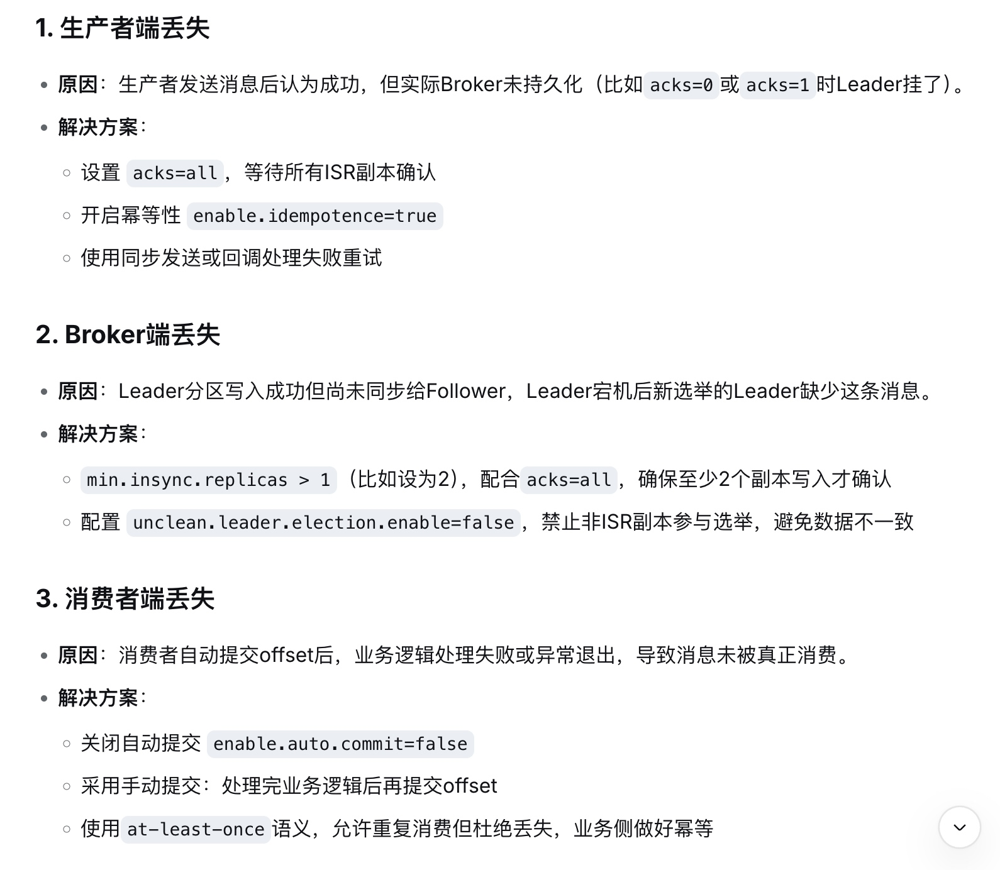
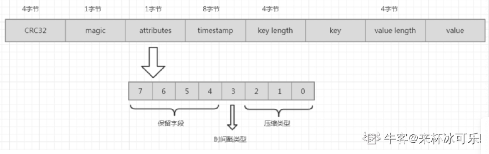

# Kafka
- [Kafka](#kafka)
- [项目消息队列](#项目消息队列)
- [读过源码介绍一下大致流程](#读过源码介绍一下大致流程)
  - [Kafka的核心组件](#kafka的核心组件)
  - [**KafKa如何保证消息的顺序性**](#kafka如何保证消息的顺序性)
  - [**Kafka一定不会丢数据嘛**](#kafka一定不会丢数据嘛)
  - [Kafka中分区消息的有序性](#kafka中分区消息的有序性)
  - [Kafka如何实现高吞吐量，为什么那么快](#kafka如何实现高吞吐量，为什么那么快)
  - [Kafka零拷贝，详细过程，传统IO四部的操作过程](#kafka零拷贝，详细过程，传统io四部的操作过程)
  - [Kafka传输消息体参数配置](#kafka传输消息体参数配置)
  - [Kafka消息的格式](#kafka消息的格式)
  - [Kafka故障处理，如何监控Kafka的健康状态？](#kafka故障处理，如何监控kafka的健康状态？)
- [开放性问题](#开放性问题)
  - [**Kafka vs RabbitMQ vs RocketMQ，如何选择？**](#kafka-vs-rabbitmq-vs-rocketmq，如何选择？)
  - [Kafka消费者有几种模式](#kafka消费者有几种模式)
- [**消息积压怎么处理？**](#消息积压怎么处理？)
  - [**对于不同分区不均衡导致数据倾斜**](#对于不同分区不均衡导致数据倾斜)
    - [生产者端](#生产者端)
    - [消费端](#消费端)
  - [对于数据倾斜如何解决呢](#对于数据倾斜如何解决呢)
    - [生产者端](#生产者端)
    - [消费者](#消费者)
  - [kafka的key一定是需要的吗，是不是可以没有](#kafka的key一定是需要的吗，是不是可以没有)
  - [如果在不同业务字段严重不倾斜的场景下，你还需要实现**并发的顺序消费**，你会如何设计整个架构](#如果在不同业务字段严重不倾斜的场景下，你还需要实现并发的顺序消费，你会如何设计整个架构)
  - [Kafka一般的日志保存时间，默认是保存几天？](#kafka一般的日志保存时间，默认是保存几天？)
  - [**kafka如何保证不丢失数据**](#kafka如何保证不丢失数据)
  - [Kafka 的 offset 存在哪个地方](#kafka的-offset存在哪个地方)
  - [**消息不被重复消费/幂等性？**](#消息不被重复消费幂等性？)
  - [**Kafka一般会有性能瓶颈，调整Kafka吞吐**](#kafka一般会有性能瓶颈，调整kafka吞吐)
    - [生产者端](#生产者端)
    - [消费者端](#消费者端)
    - [分区](#分区)
    - [派单通知司机如何实现](#派单通知司机如何实现)
  - [死信队列](#死信队列)
  - [**大批量消息堆积问题**（百万级/千万级）](#大批量消息堆积问题（百万级千万级）)
  - [**高可用**](#高可用)
  - [Kafka宕机后如何重启](#kafka宕机后如何重启)
  - [Kafka和ZK连接之间有问题如何处理](#kafka和zk连接之间有问题如何处理)


# 项目消息队列
问题：**看你的项目用了消息队列，为什么用消息队列，不用会怎么样**
在我们的项目中消息队列主要是为：
1、解耦：主要是为做到服务之间可以通过消息队列进行通信，如果不用的话，我们的模块之间使得每个模块不太容易做到独立开发、测试和部署，而且还会产生模块间互相调用API、代码量太大，部署困难等问题。
2、异步处理：允许生产者发布消息后，不必等待消费者处理完毕，如果不用的话，我们的系统的响应速度和吞吐量会下降。
3、流量削峰：在高峰流量时，生产者可以将请求消息发送到消息队列，而消费者可以按需消费消息，如果不用消息队列的话，可能会导致系统因流量过大而崩溃。


# 读过源码介绍一下大致流程
1. **Producer 发送消息**

首先，生产者通过创建一个`KafkaProducer`对象并配置相关参数。它将消息序列化成字节流，并决定消息的目标分区。如果消息有`key`，Kafka根据`key`来选择分区；如果没有，则通过轮询选择分区。消息会被发送到目标分区的Leader节点，并通过`acks`策略确认消息是否成功写入。生产者支持成功和失败的回调。

2. **Broker 接收消息**

Kafka的Broker接收到Producer的消息后，将其存储在磁盘上的日志文件中。每个分区都有一个Leader和多个副本，Leader负责处理所有写入请求，副本从Leader同步数据。为了保证消息持久化和高可用，Broker会定期将消息刷新到磁盘，并生成索引文件。

3. **Consumer 消费消息**

消费者通过创建`KafkaConsumer`对象来连接Kafka集群并订阅感兴趣的主题。消费者向Broker发送拉取请求，获取特定分区的消息，并根据偏移量来消费消息。消费者处理完消息后会提交偏移量，确保不会重复消费或丢失消息。

4. **Kafka Streams**

Kafka Streams是Kafka的流式处理库，它支持实时数据处理。应用通过创建`KafkaStreams`实例来定义输入流和输出流，并对流数据进行过滤、聚合等操作。处理结果会写回到Kafka的另一个主题中。


## Kafka的核心组件
* Producer（生产者）、Broker（消息中间件）、Consumer（消费者）
* Topic（主题）、Partition（分区）、Offset（偏移量）

## **KafKa如何保证消息的顺序性**
Kafka 保证消息顺序性的核心是：分区内有序，跨分区无序。

具体来说：

同一个分区内的消息，Kafka 会按照生产者发送的顺序存储，消费者也会按这个顺序拉取。 这是因为每条消息在分区内都有一个唯一递增的 offset，消费者按 offset 从小到大读取。

如果要保证全局有序，就只能让这个 Topic 只有一个分区。 但这样会严重限制吞吐量，生产环境很少这么做。

常见的乱序场景主要发生在生产者端。 如果生产者开启了重试，并且 max.in.flight.requests.per.connection 大于 1（默认是 5），那么当第一条消息发送失败重试时，第二条消息可能先成功写入，导致顺序错乱。解决办法是：设置 enable.idempotence=true（幂等生产者），它会自动将 max.in.flight 降为 1 或最多 5 且保证顺序；或者直接把这个参数设为 1。

消费者端也可能乱序。 如果消费者用多线程处理同一个分区的消息，那处理完成的顺序可能乱。所以通常建议每个分区用单线程消费，或者按主键哈希到同一个分区后再单线程处理。

在实时数仓场景中，我们一般会按用户 ID 或订单 ID 作为 Key 发送到 Kafka，保证同一个实体的事件进入同一个分区，从而支持基于实体的顺序处理。比如统计用户行为序列，就必须依赖分区内有序。

## **Kafka一定不会丢数据嘛**


**Kafka通过acks=all + min.insync.replicas>=2 + 生产者重试 + 消费者手动提交，可以达到接近不丢数据（极端情况如所有副本同时宕机仍可能丢）。没有绝对的不丢，只有根据业务SLA选择合适的可靠性等级。在会员实时数仓中，我们通常会配置成at-least-once + 幂等写入下游（Doris/Redis），既保证数据不丢，又避免重复带来的业务错误。**


## Kafka中分区消息的有序性
单分区内有序；多分区，分区与分区间无序；
1、一个分区，消费者将消息全部写入一个分区中，一个消费者进行消费。

2、自定义分区器Partitioner ，重写partition方法，将消息顺序追加到K个分区，然后在消费者写K个内存队列，相同分区号的数据都存到一个内存Queue中，N个线程分别消费一个内存队列即可

>为什么不用Java的序列化器？
Java序列化器太重，会增加额外的数据来保证安全传输。在大数据场景下，一般不会使用java原生的序列化器。
生产者需要用序列化器(Serializer)把对象转换成字节数组才能通过网络发送给Kafka。而在对侧， 消费者需要用反序列化器(Deserializer)把从Kafka中收到的字节数组转换成相应的对象。
综上所述：生产者和消费者的序列化器必须是相同的，否则可能就会出现乱码的情况


## Kafka如何实现高吞吐量，为什么那么快
1、零拷贝：避免了传统IO四步操作，采用DMA技术，用DMA引擎直接将数据从内核模式传递到网卡设备中 
* Producer 生产的数据持久化到 broker，采用 mmap 文件映射，实现顺序的快速写入
* Customer 从 broker 读取数据，采用 sendfile，将磁盘文件读到 OS 内核缓冲区后，转到 NIO buffer进行网络发送，减少 CPU 消耗
2、页缓存：将磁盘的数据缓存到内存中，将对磁盘的访问变成对内存的访问 
3、顺序追加：消息落到磁盘中，采用顺序追加，不支持随机访问 
4、分区机制：partition ，实现横向扩展，并行处理

## Kafka零拷贝，详细过程，传统IO四部的操作过程
零拷贝会经过JVM堆吗？

将数据直接从磁盘文件复制到网卡设备中，不需要经由应用程序之手。减少了内核和用户模式的上下文切换。底层通过sendfile 方法实现。 

 传统IO需要四步。读两步：磁盘到Read Buffer，读缓冲区到用于程序。写两步：应用程序写数据到写缓冲区Socket Buffer，写缓冲区写到网卡设备中。 

 零拷贝技术通过DMA技术将文件内容复制到内核模式的Read Buffer中，和传统IO不同的是，不需要再到用户态走一圈，不再需要额外的Socket Buffer。DMA engine直接将数据从内核模式中传递到网卡设备中。 
 应用程序空间，用户态。应用程序存放数据就是在堆咯，所以，不会经过JVM堆


## Kafka传输消息体参数配置
kafka对于消息体的大小默认为单条最大值是1M但是在我们应用场景中, 常常会出现一条消息大于1M，如果不对kafka进行配置。则会出现生产者无法将消息推送到kafka或消费者无法去消费kafka里面的数据, 这时我们就要对kafka进行以下配置：server.properties

replica.fetch.max.bytes: 1048576  broker可复制的消息的最大字节数, 默认为1M

message.max.bytes: 1000012  kafka 会接收单个消息size的最大限制， 默认为1M左右

注意：message.max.bytes必须小于等于replica.fetch.max.bytes，否则就会导致replica之间数据同步失败。


## Kafka消息的格式

CRC32：4个字节。消息的CRC校验码。

magic：1个字节。模数标识，与消息格式有关，取值为0或1。当magic为0时，消息的offset使用绝对offset且消息格式中没有timestamp部分；当magic为1时，消息的offset使用相对offset且消息格式中存在timestamp部分。

attributes：1个字节。0~2位表示消息使用的压缩类型，0(000)->无压缩 1(001)->gzip 压缩 2(010)->snappy 压缩 3(011)-> lzo 压缩。第3位表示时间戳类型，0->创建时间 1->追加时间。

timestamp：8个字节，时间戳。

key length：消息key的长度。

key：消息的key。

value length：消息的内容长度。

value：消息的内容。


## Kafka故障处理，如何监控Kafka的健康状态？
* 结合 Prometheus + Grafana 进行可视化
* 监控Lag（消息延迟）
* 监控Broker状态

# 开放性问题
## **Kafka vs RabbitMQ vs RocketMQ，如何选择？**
* Kafka：适合大规模日志 & 流式数据处理（吞吐量高）
* RabbitMQ：适合短周期事务性消息（低延迟）
* RocketMQ：支持事务消息、顺序消息（国产优化）

## Kafka消费者有几种模式
Kafka 消费者核心基于消费组设计，共 3 种核心模式：
* 单消费组多消费者（负载均衡）：最常用，提升消费能力，同一消息组内仅消费一次；
* 多消费组（广播）：同一消息被多个消费组消费，适用于同一消息多业务处理；
* 单消费组单消费者（单例）：适用于严格有序消费的低流量场景；

核心规则：一个分区同一时间只能被一个消费组内的一个消费者消费，消费者数量≤分区数才有效。


# **消息积压怎么处理？**
Kafka 消息积压处理遵循 **「先定位→再应急→后根因→最后预防」** 的核心思路：
1. **定位**：通过`kafka-consumer-groups.sh`或监控平台，定位积压的 Topic、分区、消费组，核心看 LAG 值；
2. **应急**：针对不同场景快速处理（增加消费者、重启服务、批量消费、跳过无效消息），先快速消峰；
3. **根因**：优化消费逻辑（异步 / 批量）、解决热点分区（均匀 key / 轮询分配）、提升服务稳定性（高可用 / 容错）；
4. **预防**：合理规划分区数、匹配消费者数量、开启监控告警、优化生产 / 消费逻辑、高可用部署；
5. 核心：Kafka 消费能力的瓶颈在单分区消费速度，解决积压的关键是提升整体消费能力和避免热点分区。

* 如果是Kafka消费能力不足，则可以考虑增加Topic的分区数，并且同时提升消费组的消费者数量，消费者数=分区数。（两者缺一不可）
* 如果是下游的数据处理不及时：提高每批次拉取的数量。批次拉取数据过少（拉取数据/处理时间<生产速度），使处理的数据小于生产的数据，也会造成数据积压。

## **对于不同分区不均衡导致数据倾斜**
### 生产者端
* 发送数据的分区分配不均衡：生产者在向 Kafka 集群发送数据时，需要决定将数据发送到哪个分区。如果生产者使用的分区策略不合理，或者对数据的键值分布没有正确处理，就可能导致数据在不同分区上分布不均衡。例如，默认的分区策略是根据键的哈希值来确定分区，如果键的分布本身就不均匀，那么就会造成某些分区接收的数据量远远多于其他分区。
* 发送速率不均衡：不同的生产者实例发送数据的速率可能不同。如果某些生产者发送数据的速度过快，而其他生产者发送速度较慢，也会导致数据在分区上的不均衡。比如，在一个分布式系统中，部分节点的性能较好，产生数据的速度快，而部分节点性能较差，产生数据的速度慢，这就会使得 Kafka 中不同分区的数据量增长速度不一致。
### 消费端
* 消费者负载不均衡：Kafka 的消费者是以消费者组的形式工作的，每个消费者组中的消费者负责消费部分分区的数据。如果消费者组中的消费者数量与分区数量不匹配，或者消费者的消费能力不同，就可能出现消费不均衡的情况。例如，消费者组中有 3 个消费者，而主题有 5 个分区，那么必然会有消费者需要处理更多的分区，从而导致消费进度不一致，出现数据倾斜。
* 消费速度差异：即使消费者数量与分区数量匹配，但不同消费者处理消息的速度可能不同。比如，某些消费者可能因为自身逻辑复杂、处理能力有限或者所在服务器资源紧张等原因，导致消费速度远远慢于其他消费者。这样就会使得慢的消费者对应的分区积压大量数据，而快的消费者对应的分区数据能够及时被处理，造成数据在消费端的不均衡。


## 对于数据倾斜如何解决呢
### 生产者端
* 自定义分区
    * 默认的分区策略可能无法满足复杂的数据分布需求，通过自定义分区器可以根据业务规则对数据进行更合理的分区。
* 数据预处理
    * 对数据进行分组和聚合：在发送数据到 Kafka 之前，对数据进行分组和聚合，减少数据的粒度，避免大量相似的数据集中发送到同一个分区。例如，统计一段时间内某个用户的行为次数，然后将统计结果发送到 Kafka，而不是将每一次行为都单独发送。
    * 对键进行散列处理：如果数据的键分布不均匀，可以对键进行散列处理，使得键的分布更加均匀，从而让数据更均匀地分布到各个分区。
* 监控和调整
    * 实时监控生产者的发送速率、各个分区的数据量等指标。一旦发现数据倾斜的情况，及时调整分区策略或者数据处理逻辑。
* 限流
    * 生产者限流：通过设置生产者的发送速率上限，避免某些生产者发送数据过快导致数据倾斜。可以通过调整生产者的配置参数，如max.in.flight.requests.per.connection、linger.ms等，来控制生产者的发送速率。

### 消费者
* 调整消费者组内消费者数量与主题分区数量合理匹配
    * 操作方法：可以通过监控消费者组的状态，动态调整消费者的数量。例如，当发现某个消费者处理的分区数据量过大时，可以增加消费者数量，让新的消费者分担部分分区的消费任务。

* 优化消费者处理能力
    * 如增加 CPU、内存等硬件资源，或者优化消费者的代码逻辑，提高消息处理速度。
    * 找出处理速度慢的消费者，分析原因并进行针对性优化。可能的原因包括消费者代码逻辑复杂、依赖的外部服务响应慢等。可以通过监控消费者的消费进度、处理时间等指标来定位慢消费者。
* 主题拆分
    * 原理：如果某个主题的数据量过大且分布不均衡，可以考虑将该主题拆分成多个主题，每个主题再设置合适的分区数，然后重新分配消费者进行消费。
        * 操作方法：创建新的主题，将原主题的数据迁移到新主题，同时调整消费者组的配置，让消费者消费新主题的数据。


## kafka的key一定是需要的吗，是不是可以没有
* 可以没有 key 的情况 - 消息无需特定分区策略
    * 当你不需要将相关的消息发送到同一个分区时，key 就不是必需的。例如，在日志收集场景中，不同来源的日志消息之间没有明显的关联，你只需要将这些日志消息均匀地分布到各个分区即可。此时，Kafka 的默认分区器会在 key 为 null 时采用轮询的方式将消息依次发送到各个分区，保证消息在分区间相对均匀的分布。
 

* 需要 key 的情况 - 保证消息顺序性
    * 当业务要求相关的消息按照顺序被处理时，就需要使用 key。Kafka 根据 key 的哈希值将消息分配到特定的分区，具有相同 key 的消息会被发送到同一个分区，从而保证了这些消息在分区内的顺序性。例如，在订单处理系统中，同一个订单的所有状态变更消息需要按顺序处理，就可以将订单 ID 作为 key。

## 如果在不同业务字段严重不倾斜的场景下，你还需要实现**并发的顺序消费**，你会如何设计整个架构
**场景**：比如说我们建了一个 topic，有三个 partition。生产者在写的时候，其实可以指定一个 key，比如说我们指定了某个订单 id 作为 key，那么这个订单相关的数据，一定会被分发到同一个 partition 中去，而且这个 partition 中的数据一定是有顺序的。
消费者从 partition 中取出来数据的时候，也一定是有顺序的。到这里，顺序还是 ok 的，没有错乱。接着，我们在消费者里可能会搞**多个线程来并发处理消息**。因为如果消费者是单线程消费处理，而处理比较耗时的话，比如处理一条消息耗时几十 ms，那么 1 秒钟只能处理几十条消息，这吞吐量太低了。而多个线程并发跑的话，顺序可能就乱掉了。

**解决**：
* 一个 topic，一个 partition，一个 consumer，内部单线程消费，单线程吞吐量太低，一般不会用这个。
* 写 N 个内存 queue，具有相同 key 的数据都到同一个内存 queue；然后对于 N 个线程，每个线程分别消费一个内存 queue 即可，这样就能保证顺序性。

整体思路：将不同业务字段作为消息的 key，利用 Kafka 的分区机制，让相同 key 的消息进入同一分区以保证顺序，同时多个分区可以实现并发消费。

## Kafka一般的日志保存时间，默认是保存几天？
默认保存7天；生产环境建议3天
Kafka默认的日志是保存7天（168h），由log.retention.hours参数控制默认是`168`
如果想要调整，可以通过`server.properties`配置文件中修改这个值
```
log.retention.hours=48  # 日志保存 2 天
log.retention.minutes   # 以分钟为单位，默认未设置
log.retention.ms    # 以毫秒为单位，默认未设置
```
## **kafka如何保证不丢失数据**
**情境（Situation）**：Kafka 作为分布式消息系统，需在高并发、节点故障等场景下确保数据可靠传输，避免因网络波动、服务宕机导致数据丢失。
**任务（Task）**：需从生产者、 broker、消费者三个环节设计机制，保障数据从生产到消费的全链路不丢失。
**行动（Action）**：

- 生产者端：
  - 配置`acks=all`，确保消息需被分区所有 ISR（同步副本）确认后才返回成功，避免仅 leader 确认后 leader 宕机导致的数据丢失；
  - 开启重试机制（`retries`设为合理值，如 3），并设置`retry.backoff.ms`控制重试间隔，应对临时网络故障；
  - 使用异步发送时结合回调函数，对失败消息进行日志记录或重试队列缓存，避免客户端发送失败未处理。
- Broker 端：
  - 为主题设置合理的副本数（`replication.factor≥2`），确保 leader 故障后，follower 能快速切换为新 leader，且数据已同步；
  - 关闭`unclean.leader.election.enable`（默认 false），禁止非 ISR 中的副本成为 leader，避免数据不一致；
  - 配置`min.insync.replicas`（如 2），与`acks=all`配合，确保至少指定数量的副本同步成功才确认消息写入。
- 消费者端：
  - 关闭自动提交 offset（`enable.auto.commit=false`），在业务逻辑处理完成后手动提交（`commitSync()`或`commitAsync()`），避免消费未完成但 offset 已提交导致的数据丢失；
  - 处理异常时进行重试或死信队列转发，确保消息被正确消费后再提交 offset。


**1、Producer丢失数据**
为了提高发送数据的效率，可以将数据缓存在Buffer中，一次性发送大量数据，那么如果Buffer中数据没有及时处理Producer就因为某些原因退出（OOM、被Kill等）就可能导致数据丢失。或者生产数据过快，导致Buffer装满了还没有发送，也可能导致丢失。

避免或者缓解方式：
* Producer同步数据发送，或者采用阻塞的带一定容量上限的线程池
* 扩大Buffer大小，防止Buffer装满，但是如果程序被异常退出，则数据会丢失
* 生产的数据在Producer本地落盘，然后再使用另一个程序来发送到Kafka,例如Filebeat、Logstash等

**2、Broker丢失数据**
如果主分片在第一个步骤断电，数据在内存中，Producer收不到ACK会重试，直到达到重试阈值。

这个过程需要权衡配置acks的要求，如果为0，则表示Producer直接写入不等待ACK，数据很可能丢失；如果为1，则表示Producer写入数据到系统Cache，数据在Producer可能丢失，如果为-1，表示要等待所有从分片确认信息，数据则不回丢失

**3、Consumer丢失数据**
Consumer会从Kafka中接收并处理消息，然后记录offset，提交offset有两种方式，分为手动提交和自动提交，如果是自动提交，就可能存在数据丢失的情况，就是在数据还没有消费成功就已经提交了offset，如果这时Consumer被退出，数据就丢失了。

避免方法：
* 采用手动提交方式可以避免出现上述问题，但会造成数据被重复消费

## Kafka 的 offset 存在哪个地方
kafka 消费者需记录已消费的消息位置（offset），以支持断点续传，避免重复消费或漏消费
默认存储在 Kafka 内置的`__consumer_offsets`主题中，该主题为 compacted 类型（日志压缩），确保 offset 数据持久化且不占用过多空间；
- 消费者提交 offset 时，实际上是向`__consumer_offsets`发送消息，消息键为`group_id+topic+partition`，值为 offset；


## **消息不被重复消费/幂等性？**
**情境（Situation）**：Kafka 在网络重试、节点故障恢复等场景下，可能因消息重发、offset 提交异常导致数据重复，需通过机制避免业务逻辑重复执行。**任务（Task）**：从生产、消费环节设计策略，结合业务层处理，实现数据 “恰好一次”（exactly-once）交付。**行动（Action）**：

- 生产者端去重：

  - 开启幂等性（`enable.idempotence=true`），Kafka 会为每个生产者分配 PID（生产者 ID），并为消息添加序列号，确保同一条消息在单分区内不重复写入；
  - 配合`acks=all`和`retries>0`，幂等性可避免重试导致的重复，但其仅作用于单生产者、单会话，跨会话需额外处理。

- 消费者端去重：

  - 确保 offset 提交逻辑正确：仅在业务处理成功后提交 offset，避免处理失败但 offset 已提交导致的重复消费（需结合手动提交）；
  - 业务层实现幂等性：通过唯一标识（如消息 ID、订单号）在数据库中做唯一键约束，或使用 Redis 记录已处理的消息 ID，消费时先校验是否已处理，再执行业务逻辑。

- Exactly-Once 语义：

  - 对于流处理场景（如 Kafka Streams），通过

    ```
    processing.guarantee=exactly_once
    ```

    结合事务机制（

    ```
    transactional.id
    ```

    ），确保生产和消费的原子性，即消息要么被完全处理并提交 offset，要么全失败重试。

    

    结果（Result）：在电商订单场景中，通过 “生产者幂等性 + 数据库唯一键” 机制，消息重复率从 0.5% 降至 0.01% 以下；使用 Kafka Streams 的 Exactly-Once 模式后，实时计算任务的结果一致性达到 100%，无需人工校验数据重复问题。
    

 幂等性+ack-1+事务

Kafka数据重复，可以再下一级：SparkStreaming、redis或者hive中dwd层去重，去重的手段：分组、按照id开窗只取第一个值；

其实还是得结合业务来思考，我这里有几个思路：
* 比如我们拿个数据要写库，我们先根据主键查一下，如果这数据都有了，我们就别插入了，update 一下好吧。
* 比如我们是写 Redis，那没问题了，反正每次都是 set，天然幂等性。
* 比如我们不是上面两个场景，那做的稍微复杂一点，我们需要让生产者发送每条数据的时候，里面加一个**全局唯一的 id**，类似订单 id 之类的东西，然后我们这里消费到了之后，先根据这个 id 去比如 Redis 里查一下，之前消费过吗？如果没有消费过，我们就处理，然后这个 id 写 Redis。如果消费过了，那我们就不处理了，保证别重复处理相同的消息即可。
* 比如基于数据库的唯一键来保证重复数据不会重复插入多条。因为有唯一键约束了，重复数据插入只会报错，不会导致数据库中出现脏数据。

1、**生产者幂等性**
Kafka 生产者支持 幂等性，即 相同消息不会被写入多次，即使发生重试。
（1）开启幂等性
```
Properties props = new Properties();
props.put("bootstrap.servers", "localhost:9092");
props.put("acks", "all");
props.put("retries", 5);
props.put("enable.idempotence", "true");
KafkaProducer<String, String> producer = new KafkaProducer<>(props);
```
（2）幂等性如何实现
Kafka 生产者在 消息发送时自动添加唯一的“序列号” 来保证幂等性：

* 每个生产者实例 生成一个 Producer ID（PID），Kafka 服务器跟踪该生产者的状态。
* 每个分区有一个序列号（Sequence Number），用于检查是否有重复数据：
    * 如果序列号是 递增的，Kafka 认为是新数据，正常写入。
    * 如果序列号是 已存在的，Kafka 直接丢弃，防止重复写入。
Tips：
> 幂等性 只对单个 Producer 实例的单分区写入有效，跨分区仍可能出现重复数据。
必须与 acks=all 结合使用，否则可能丢数据。

2、**Kafka事务**
Kafka 提供了 事务（Transaction） 机制，确保 一批消息要么全部写入，要么全部失败，从而保证跨分区幂等性。
（1）开启事务
```
Properties props = new Properties();
props.put("bootstrap.servers", "localhost:9092");
props.put("acks", "all");
props.put("retries", Integer.MAX_VALUE);
props.put("enable.idempotence", "true");  // 事务依赖幂等性
props.put("transactional.id", "tx-1");  // 设置事务 ID，必须唯一
KafkaProducer<String, String> producer = new KafkaProducer<>(props);

// 初始化事务
producer.initTransactions();

// 开始事务
producer.beginTransaction();
try {
    producer.send(new ProducerRecord<>("topicA", "key1", "value1"));
    producer.send(new ProducerRecord<>("topicB", "key2", "value2"));
    
    // 提交事务
    producer.commitTransaction();
} catch (Exception e) {
    // 事务回滚，保证幂等性
    producer.abortTransaction();
}
```
（2）事务如何保证幂等性？
Kafka 通过 事务 ID（transactional.id） 维护事务状态：

* 成功提交（commitTransaction）：数据写入 Kafka，消费者可以读取。
* 失败回滚（abortTransaction）：Kafka 丢弃未提交的数据，消费者不会读取到脏数据。
Tips：
> 事务需要 enable.idempotence=true，确保数据不会重复。
transactional.id 必须唯一，否则会导致事务失败。

3、**幂等性 VS 事务**
幂等性作用：避面单个分区的重复消息；适用场景：单个生产者实例、单分区写入
事务的作用：确保跨多个分区的数据一致性；适用场景：跨分区写入
4、**消费端幂等性**
即使生产者确保了幂等性，消费者仍然可能遇到重复消费，需要 手动管理 Offset：

## **Kafka一般会有性能瓶颈，调整Kafka吞吐**
* 监控和调优
    * 监控指标：监控 Kafka 集群的性能指标，如分区的消息速率、消费者的消费速率、偏移量等，及时发现并解决潜在问题。
    * 动态调整：根据监控结果，动态调整分区数量、消费者数量等参数，以适应业务变化。

### 生产者端
* 1、批量发送
    * 生产者，可以将多条消息打包成一个批次发送到 Kafka，减少网络请求次数，从而提高吞吐量。
    * 调整`batch.size`最大字节数、`linger.ms`生产者在发送批次前等待更多消息加入的时间。
* 2、异步发送
    * 使用异步发送方式，生产者在发送消息后不需要等待服务器的响应，继续发送后续消息，从而提高发送速度。
* 3、Kafka内存调整（kafka-server-start.sh）
    * 默认内存1个G，生产环境尽量不要超过6个G。
    * export KAFKA_HEAP_OPTS="-Xms4g -Xmx4g"
### 消费者端
* 1、增加消费者实例
    * 在消费者组中增加消费者实例的数量，让多个消费者并行消费不同的分区，从而提高消费吞吐量。但消费者数量不宜超过分区数量，否则部分消费者将处于空闲状态。
* 2、批量消费
    * 消费者可以批量拉取消息进行处理，减少与 Kafka 服务器的交互次数，提高消费效率。
    * max.poll.records：每次调用poll()方法返回的最大消息数，默认值为 500。可以根据实际情况适当增大该值。（**函数曲线，最优解的点**）
* 3、手动提交偏移量
    * 使用手动提交偏移量的方式，消费者可以在处理完一批消息后再提交偏移量，避免自动提交偏移量可能导致的消息重复消费或丢失问题，同时可以提高消费效率。
### 分区
* 增加分区数量
    * 增加主题的分区数量可以提高 Kafka 的并发处理能力，从而提升吞吐量。但分区数量过多也会增加管理成本和资源消耗。

    
使用KafKa实现异步和同步任务处理与消息队列管理，优化系统性能，完成订车出行模块。

1. 订单创建：用户创建订车订单，系统需快速响应以提升用户体验。
2. 异步任务：后台异步完成出行任务，比如计算价格、派单通知司机等等。
3. 同步任务：订单支付确认，即时状态更新需要事实反馈任务。

流程：

1. 将用户请求的任务以消息形式发送到Kafka

2. 消费者消费消息，执行具体的异步或同步任务
3. 定义不同的主题来区分任务类型，比如：`order_create_topic`、`driver_notify_topic`、`payment_topic`
4. 分区：根据订单ID实现分区，实现任务并处理。（ID具有实际意义，比如00代表长春市，01代表吉林市，02代表榆树市等等，雪花算法拼接）
5. 消息管理，这块我做了消息重试（在消费者端，设置retries参数，当消息放松失败时，KafKa会自动重试，以及backoff.ms参数，做了每次重试的间隔时间为1000ms，使用异常捕获机制处理消费失败的消息，重试失败，也就是达到我们设定的重试阈值的时候，就会将次消息发送到死信队列，方便我们后期分析消息发送失败的原因。

### 派单通知司机如何实现

派单是考虑到实时推送订单，使用WebSocket每隔0.05s监听是否有用户请求，接收到用户订单之后，选择最近且空闲状态或者即将完成订单的司机进行sendText订单通知，接收到通知后，用户和司机同时更新状态。

## 死信队列
死信队列（DLQ）是消息队列中的一种特殊队列，用于**处理无法被消费者正常消费的消息**。其作用是在消息处理过程中，如果出现某些异常（如消息消费失败、超时、格式错误等），这些消息不会直接丢弃，而是被转发到一个独立的“死信队列”中，方便后续进行分析、重试或人工干预。


## **大批量消息堆积问题**（百万级/千万级）
**产生原因**：
（1）消费者逻辑处理有误，导致消费消息速度慢
（2）生产者的生产速度大于消费者的消费速度，比如活动期间导致消息数量激增

**解决方式**
1、先排查是不是bug（比如消费者未正确提交偏移量，消费者在处理完消息后，未提交偏移量，导致重复消费或消费停滞，进而形成大面积消息积压），如果是，要快速修复
2、如果不是bug，那么就是消费者消费不给力没导致的消息积压，所有要优化消费者代码逻辑（使用多线程处理、可以减少每条消息的处理时间，减少不必要的计算，提高消息处理速度）
3、临时紧急扩容，新建临时topic，把消息转发到临时的topic，并且partition增加到原来的10倍

注意：要做好监控和报警，当消息积压到一定阈值的时候，就要报警，然后通知负责人。不要一上来就新建临时topic，去快速处理大量积压问题，应该先排查是不是bug，优化消费者的代码。如果消息设置了超时时间，因为百万消费积压，没来及处理就过期清理了，可以设置定时任务拉起来重发一下。


## **高可用**
Kafka 一个最基本的架构认识：由多个 broker 组成，每个 broker 是一个节点；我们创建一个 topic，这个 topic 可以划分为多个 partition，每个 partition 可以存在于不同的 broker 上，每个 partition 就放一部分数据。

这就是天然的分布式消息队列，就是说一个 topic 的数据，是**分散放在多个机器上的，每个机器就放一部分数据**。

如果某个 broker 宕机了，没事儿，那个 broker 上面的 partition 在其他机器上都有副本的。如果这个宕机的 broker 上面有某个 partition 的 leader，那么此时会从 follower 中重新选举一个新的 leader 出来，大家继续读写那个新的 leader 即可。这就有所谓的高可用性了。

**写数据**的时候，生产者就写 leader，然后 leader 将数据落地写本地磁盘，接着其他 follower 自己主动从 leader 来 pull 数据。一旦所有 follower 同步好数据了，就会发送 ack 给 leader，leader 收到所有 follower 的 ack 之后，就会返回写成功的消息给生产者。（当然，这只是其中一种模式，还可以适当调整这个行为）

**消费**的时候，只会从 leader 去读，但是只有当一个消息已经被所有 follower 都同步成功返回 ack 的时候，这个消息才会被消费者读到。

## Kafka宕机后如何重启


## Kafka和ZK连接之间有问题如何处理