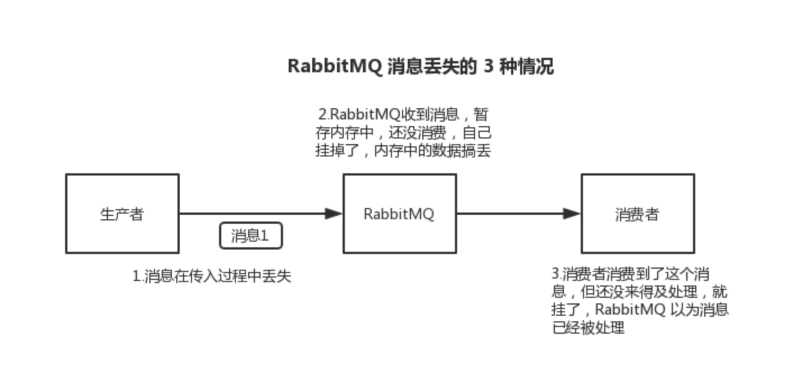
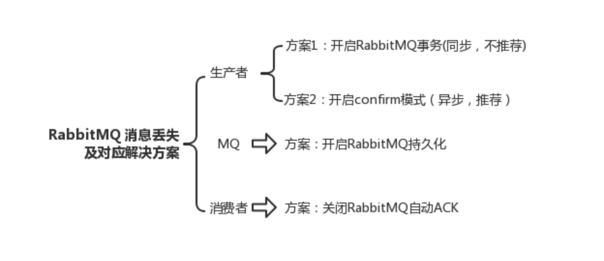
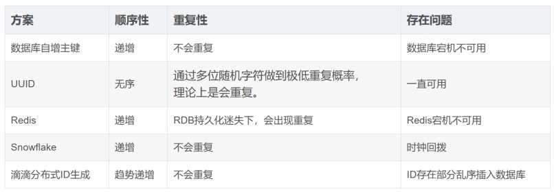

# RabbitMQ
  - [rabbitmq核心组件](#rabbitmq核心组件)
  - [**rabbitmq与线程池的区别**：](#rabbitmq与线程池的区别：)
  - [**与其他中间件的区别**](#与其他中间件的区别)
  - [轮询查询消息队列返回信息](#轮询查询消息队列返回信息)
  - [系统解耦合](#系统解耦合)
  - [如何确保**消息不丢失**：](#如何确保消息不丢失：)
  - [如何进行消息检测？](#如何进行消息检测？)
  - [怎么解决消息被**重复消费**的问题：](#怎么解决消息被重复消费的问题：)
  - [**消息积压**如何解决：](#消息积压如何解决：)
  - [Rabbitmq如何保证**高可用**：](#rabbitmq如何保证高可用：)
  - [假如让你实现一个消息队列，会如何实现？考虑哪些问题呢？](#假如让你实现一个消息队列，会如何实现？考虑哪些问题呢？)
  - [如何保证消息的**顺序性**](#如何保证消息的顺序性)
  - [你使用的是什么模式rabbitmq？](#你使用的是什么模式rabbitmq？)
  - [什么是死信队列：](#什么是死信队列：)
  - [**延迟队列**](#延迟队列)
  - [为什么使用 RabbitMQ 延迟队列，而不是 ScheduledExecutorService 定时任务](#为什么使用rabbitmq延迟队列，而不是-scheduledexecutorservice定时任务)
  - [**性能调优**](#性能调优)

后端服务中配置有线程池，监听RabbitMQ队列中的消息。通过配置mq的容器工厂参数，增加并发处理数量即可实现多线程处理监听队列，实现多线程处理消息。

## rabbitmq核心组件
1、生产者（Producer）：发送消息到RabbitMQ的应用程序
2、消费者（Consumer）：消费者是接收RabbitMQ消息的应用程序
3、交换器（Exchange）：它负责接收生产者发送的消息并将其路由到一个或多个队列
4、队列（Queue）：存储消息直到他们被消费或过期
5、绑定（Binding）：用于连接交换器和队列的规则

## **rabbitmq与线程池的区别**：
1. 任务类型：应用需要处理大量的异步任务或事件，消息队列可能更合适。如果主要涉及并发处理和任务队列，线程池可能更适合。
2. 系统复杂性：消息队列通常用于构建复杂的分布式系统，而线程池可以在**单个应用内解决并发问题**。
3. 可靠性：消息队列可以保证消息的可靠传递，即使消费者暂时不可用。线程池的可靠性取决于应用的正确实现。
如果核心逻辑和非核心逻辑需要并发执行，且有较强的相关性，或者需要较低延迟，则使用线程池可能更适合。

## **与其他中间件的区别**
可靠性：RabbitMQ提供了消息的持久化和可靠性传输。这意味着即使在消息进入队列但尚未被处理或传递给消费者时，消息也可以被保存到磁盘上，以确保消息不会丢失。这使得RabbitMQ非常适合**对消息可靠性要求较高的应用场景**。
* 灵活性：RabbitMQ支持多种消息传递模式，包括点对点、发布/订阅、请求/响应等。这使得开发人员可以根据不同的需求选择最适合的模式，并灵活地构建复杂的消息传递系统。
* 可扩展性：RabbitMQ具有良好的可扩展性，可以在需要时轻松增加或减少服务器节点。这使得RabbitMQ能够应对高负载和大流量的情况，并保持高性能和低延迟。
* 多语言支持：RabbitMQ支持多种编程语言，包括Java、Python、Ruby、C#等。这使得开发人员可以使用他们熟悉的编程语言与RabbitMQ进行交互，方便快捷地开发和维护应用程序。
* 社区支持和生态系统：RabbitMQ拥有庞大的开源社区，这意味着有大量的文档、教程、示例代码和解决方案可供参考。此外，RabbitMQ还与其他开源工具和框架集成非常好，如Spring Boot、Docker和Kubernetes等，形成了一个强大的生态系统。

Kafka主要特点是给予Pull的模式来处理消费消息，**追求高吞吐量**，一开始的目的就是用于日志收集和传输，但是可能会出现消息的重复、丢失、错误并且消费失败不支持重试
总结：
**ActiveMQ**，性能不是很好，因此在高并发的场景下，直接被pass掉了。它的Api很完善，在中小型互联网公司可以去使用。
**kafka**，主要强调高性能，如果对业务需要可靠性消息的投递的时候。那么就不能够选择kafka了。但是如果做一些日志收集呢，kafka还是很好的。因为kafka的性能是十分好的。
**RocketMQ**，它的特点非常好。它高性能、满足可靠性、分布式事物、支持水平扩展、上亿级别的消息堆积、主从之间的切换等等。MQ的所有优点它基本都满足。但是它最大的缺点：**商业版收费**。因此它有许多功能是不对外提供的。

## 轮询查询消息队列返回信息
1. 在前端发送任务请求时，附带用户ID，并将其包含在RabbitMQ消息中。
2. 后端处理完任务后，将结果消息中包含的用户ID一并发送到结果队列。
3. 前端轮询结果队列时，根据用户ID过滤，只获取属于当前用户的结果消息。

## 系统解耦合
**传统**：车辆碰撞 → 直接调用救援服务 → 直接调用通知服务 → 记录日志
车辆碰撞 → 发送消息到 RabbitMQ 延迟队列（解耦） → 各个业务模块（消费者）独立处理

## 如何确保**消息不丢失**：
首先需要明确：   

**消息生产阶段**：在生产者那里设置开启 confirm 模式之后，你每次写的消息都会分配一个唯一的 id，然后如果写入了 RabbitMQ 中，RabbitMQ 会给我们回传一个 ack 消息，告诉我们说这个消息 ok 了。如果 RabbitMQ 没能处理这个消息，会回调我们的一个 nack 接口，告诉我们这个消息接收失败，我们可以重试。而且我们可以结合这个机制自己在内存里维护每个消息 id 的状态，如果超过一定时间还没接收到这个消息的回调，那么可以重发。
**消息存储阶段**：就是 RabbitMQ 自己弄丢了数据，这个必须开启 RabbitMQ 的持久化，就是消息写入之后会持久化到磁盘，哪怕是 RabbitMQ 自己挂了，恢复之后会自动读取之前存储的数据，一般数据不会丢。除非极其罕见的是，RabbitMQ 还没持久化，自己就挂了，可能导致少量数据丢失，但是这个概率较小。
**设置持久化有两个步骤**：
1、创建 queue 的时候将其设置为持久化
这样就可以保证 RabbitMQ 持久化 queue 的元数据，但是它是不会持久化 queue 里的数据的。
2、第二个是发送消息的时候将消息的 deliveryMode 设置为 2
就是将消息设置为持久化的，此时 RabbitMQ 就会将消息持久化到磁盘上去。
必须要同时设置这两个持久化才行，RabbitMQ 哪怕是挂了，再次重启，也会从磁盘上重启恢复 queue，恢复这个 queue 里的数据。

虽然给 RabbitMQ 开启了持久化机制，也有一种可能，就是这个消息写到了 RabbitMQ 中，但是还没来得及持久化到磁盘上，结果不巧，此时 RabbitMQ 挂了，就会导致内存里的一点点数据丢失。
所以，持久化可以跟生产者那边的 confirm 机制配合起来，只有消息被持久化到磁盘之后，才会通知生产者 ack 了，所以哪怕是在持久化到磁盘之前，RabbitMQ 挂了，数据丢了，生产者收不到 ack，你也是可以自己重发的。

**消息消费阶段**： 比如我们消息刚消费到，还没处理，结果进程挂了，比如重启了，那么就尴尬了，RabbitMQ 认为你都消费了，这数据就丢了。
为了保证消息从队列中可靠地到达消费者，RabbitMQ 提供了消息确认机制。消费者在声明队列时，可以指定 noAck 参数，当 noAck=false，RabbitMQ 会等待消费者显式发回 ack 信号后，，不立即发送消费确认给 Broker，而是等到执行完业务逻辑后，再发送消费确认，才从内存（和磁盘，如果是持久化消息）中移去消息。否则，一旦消息被消费者消费，RabbitMQ 会在队列中立即删除它。

## 如何进行消息检测？
在分布式系统中，故障不可避免因此还需要消息检测，在消息生产端，给每个发出的消息都指定一个全局唯一 ID，或者附加一个连续递增的版本号（如果同时存在多个消息生产端和消息消费端就很难实现），然后在消费端做对应的版本校验。
可以利用拦截器机制。 在生产端发送消息之前，通过拦截器将消息版本号注入消息中。然后在消费端收到消息后，再通过拦截器检测版本号的连续性或消费状态。

## 怎么解决消息被**重复消费**的问题：
最简单的实现方案，就是在数据库中建一张消息日志表，这个表有两个字段：消息 ID 和消息执行状态。当然也可以通过 Redis 来代替数据库实现唯一约束的方案。这样，我们消费消息的逻辑可以变为：在消息日志表中增加一条消息记录，然后再根据消息记录，异步操作更新。
这里的核心思路是实现一个全局唯一 ID 生成。基于这个思路，不仅可以使用关系型数据库，也可以通过 Redis 来代替数据库实现唯一约束的方案。

## **消息积压**如何解决：
如果出现积压，那一定是性能问题，想要解决消息从生产到消费上的性能问题，因为消息发送之后才会出现积压的问题，所以和消息生产端没有关系，又因为绝大部分的消息队列单节点都能达到每秒钟几万的处理能力，相对于业务逻辑来说，性能不会出现在中间件的消息存储上面。所以出问题的肯定是消息消费阶段。

一个消费者一秒是 1000 条，一秒 3 个消费者是 3000 条，一分钟就是 18 万条。所以如果你积压了几百万到上千万的数据，即使消费者恢复了，也需要大概 1 小时的时间才能恢复过来。

一般这个时候，只能临时紧急扩容了，具体操作步骤和思路如下：
* 先修复 consumer 的问题，确保其恢复消费速度，然后将现有 consumer 都停掉。
* 新建一个 topic，partition 是原来的 10 倍，临时建立好原先 10 倍的 queue 数量。
* 然后写一个临时的分发数据的 consumer 程序，这个程序部署上去消费积压的数据，**消费之后不做耗时的处理**，直接均匀轮询写入临时建立好的 10 倍数量的 queue。
* 接着临时征用 10 倍的机器来部署 consumer，每一批 consumer 消费一个临时 queue 的数据。这种做法相当于是临时将 queue 资源和 consumer 资源扩大 10 倍，以正常的 10 倍速度来消费数据。
* 等快速消费完积压数据之后，**得恢复原先部署的架构，重新**用原先的 consumer 机器来消费消息。

	其次，是排查解决异常问题，如通过监控，日志等手段分析是否消费端的业务逻辑代码出现了问题，优化消费端的业务处理逻辑。
最后，如果是消费端的处理能力不足，可以通过水平扩容来提供消费端的并发处理能力，在扩容消费者的实例数的同时，必须同步扩容主题 Topic 的分区数量，确保消费者的实例数和分区数相等。如果消费者的实例数超过了分区数，由于分区是单线程消费，所以这样的扩容就没有效果。

## Rabbitmq如何保证**高可用**：
使用镜像集群模式，将queue镜像到集群中其他的节点之上。如果集群中的一个节点失效了，能自动地切换到镜像中的另一个节点以保证服务的可用性。

在镜像集群模式下，我们创建的 queue，无论是元数据还是 queue 里的消息都会**存在于多个实例上**，就是说，每个 RabbitMQ 节点都有这个 queue 的一个**完整镜像**，包含 queue 的全部数据的意思。然后每次我们写消息到 queue 的时候，都会自动把**消息同步**到多个实例的 queue 上。

## 假如让你实现一个消息队列，会如何实现？考虑哪些问题呢？
1.确定需求和功能：确定消息队列的主要功能，并分析需要处理的消息类型、消息数量和消息处理的速度等因素。
2.选择合适的架构模式：根据需求和功能，选择适合的架构模式，如 Pub/Sub 模式、队列模式、管道模式等。
3.设计存储方案：根据消息的特性和处理需求，选择合适的存储方案，如内存存储、磁盘存储、数据库存储等。
4.设计消息传输协议：确定消息传输的协议，如 TCP、UDP，或 HTTP 等。
5.实现消息处理机制：实现消息处理机制，包括消息接收、入队、出队、分发、处理等等。
6.消息确认机制：消费者需要告诉消息队列何时已经成功处理一条消息。这可以通过在消息队列中添加一个确认机制来实现。
7.错误处理机制：当消息处理失败时，需要一个错误处理机制来重新处理消息或将其发送到错误队列进行处理。
8.负载均衡机制：当有多个消费者时，需要一种负载均衡机制来分配消息。
9.支持高可用和容错：设计并实现高可用和容错机制，确保消息队列能够在面对各种异常情况下，稳定地运行。
10.监控和管理：设计并实现监控和管理机制，方便管理员监控消息队列的状态和运行情况。
11.支持扩展和升级：设计并实现扩展和升级机制，方便后续对消息队列的功能进行扩展和升级。

## 如何保证消息的**顺序性**
**场景**：一个 queue，多个 consumer。比如，生产者向 RabbitMQ 里发送了三条数据，顺序依次是 data1/data2/data3，压入的是 RabbitMQ 的一个内存队列。有三个消费者分别从 MQ 中消费这三条数据中的一条，结果消费者 2 先执行完操作，把 data2 存入数据库，然后是 data1/data3。这不明显乱了。

**解决**：
可以拆分多个 queue，每个 queue 一个 consumer，就是多一些 queue 而已，确实是麻烦点；或者就一个 queue 但是对应一个 consumer，然后这个 consumer 内部用内存队列做排队，然后分发给底层不同的 worker 来处理

>注意，这里消费者不直接消费消息，而是将消息根据关键值（比如：订单 id）进行哈希，哈希值相同的消息保存到相同的内存队列里。也就是说，需要保证顺序的消息存到了相同的内存队列，然后由一个唯一的 worker 去处理。

## 你使用的是什么模式rabbitmq？
使用的是路由模式：
1、每个消费者监听自己的队列，并且设置routingkey。
2、生产者将消息发给交换机，由交换机根据routingkey来转发消息到指定的队列。
对于生产者
首先是声明exchange_routing_inform交换机。
其次声明两个队列并且绑定到此交换机，绑定时需要指定routingkey
然后发送消息时需要指定routingkey

## 什么是死信队列：
消费失败的消息存放的队列。
消息消费失败的原因：
    消息被拒绝并且消息没有重新入队（requeue=false）
    消息超时未消费
    达到最大队列长度

## **延迟队列**
死信队列+ttl过期时间
背景：在车辆发生碰撞后，我们需要**延迟一段时间**再触发某些任务（推送事故信息给后台管理系统、监测车辆状态，如果一定时间内未恢复，则发出警报）

## 为什么使用 RabbitMQ 延迟队列，而不是 ScheduledExecutorService 定时任务
* 定时任务（ScheduledExecutorService）适用于小规模任务，但存在以下问题
    * 需要 不断扫描数据库，影响性能。
    * 分布式部署时不可靠，可能导致任务重复执行或丢失
* RabbitMQ 延迟队列的优势
    * 消息驱动，无需轮询数据库，减少数据库压力
    * 高并发支持，可同时处理大量车辆碰撞事件
    * 自动重试机制，避免任务丢失

    
## **性能调优**
1、合理配置队列和消费者：根据负载均衡的需要调整队列数量和消费者数量
2、内存和磁盘使用优化：监控和配置RabbitMQ的内存使用，避免过度使用磁盘导致性能下降
3、消息批处理：在生产者和消费者端使用批处理来减少网络调用的次数
4、避免使用持久化队列和消息：如果不需要，避免使用持久化队列和消息，因为他们会降低性能
5、硬件优化：更快的CPU和内存