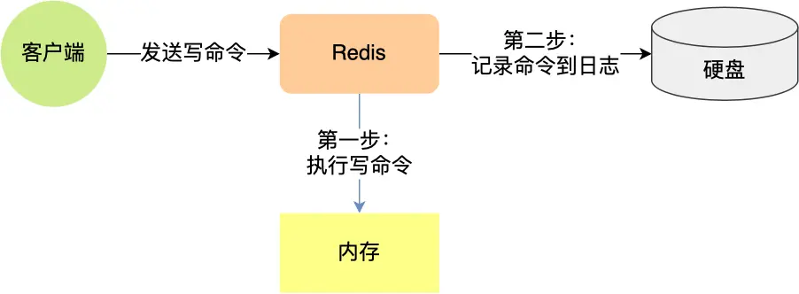
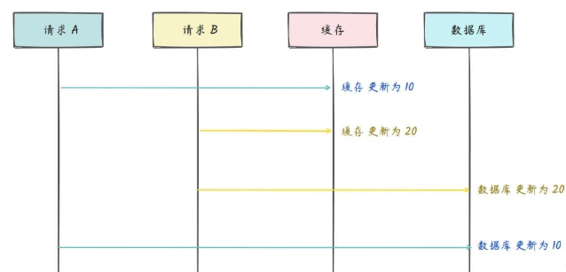
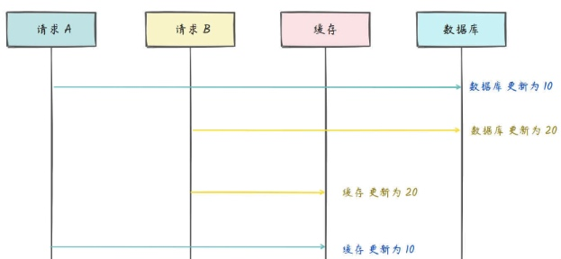
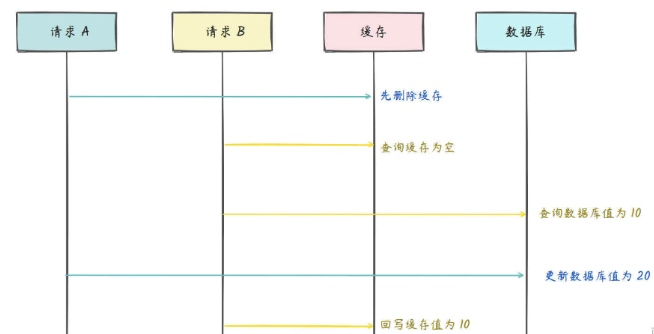
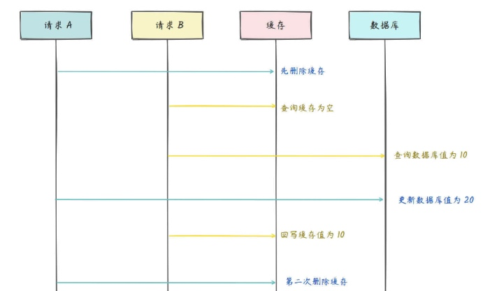
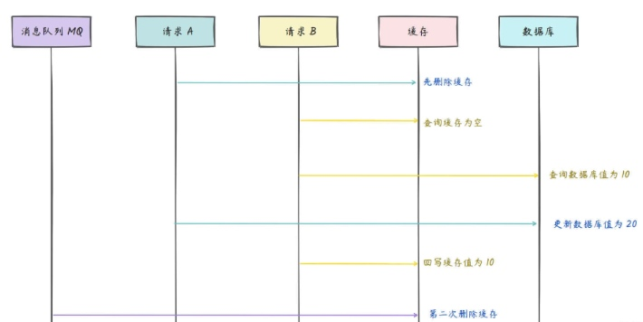
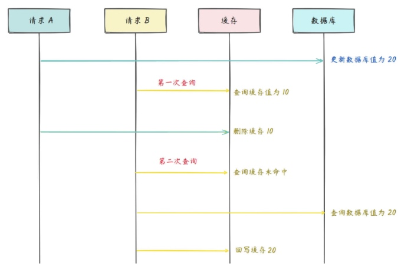
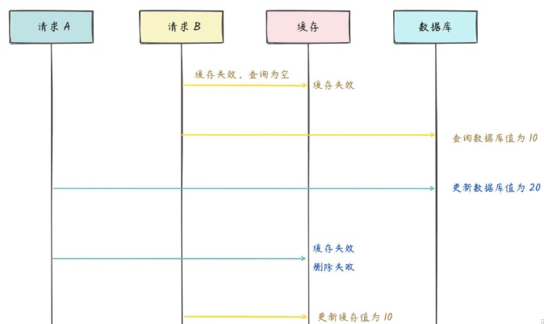
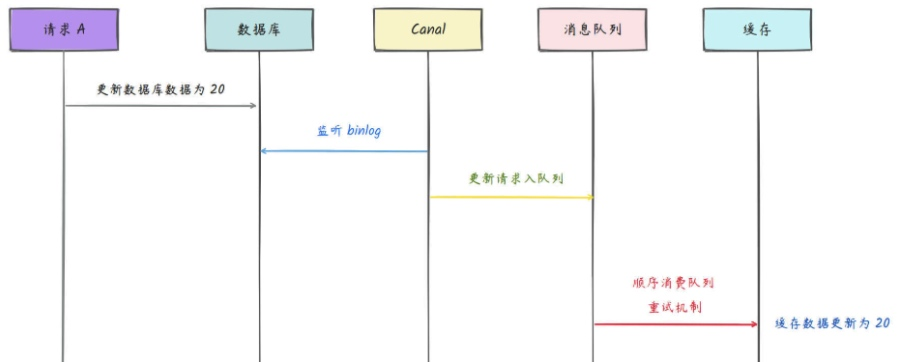

# Redis基础
- [**Redis为什么那么快**](#redis为什么那么快)
- [技术选型](#技术选型)
  - [Redis和Memcached的区别和选型](#redis和memcached的区别和选型)
- [Redis线程模型](#redis线程模型)
  - [既然是单线程，那怎么监听大量的客户端连接呢？](#既然是单线程，那怎么监听大量的客户端连接呢？)
  - [为什么使用redis而不是本地缓存：](#为什么使用redis而不是本地缓存：)
- [redis、mysql、mongodb区别，应用场景](#redis、mysql、mongodb区别，应用场景)
- [**Redis数据类型**](#redis数据类型)
  - [String底层](#string底层)
  - [Bitmap](#bitmap)
  - [**Zset跳表**](mweblib://17395330390344)
  - [redis的基础数据类型可不可以嵌套使用](#redis的基础数据类型可不可以嵌套使用)
  - [redis的key和value有大小限制吗](#redis的key和value有大小限制吗)
  - [大Key如何解决](#大key如何解决)
  - [Sorted 和 List 异同点](#sorted和-list异同点)
  - [原理](#原理)
- [**缓存穿透-访问缓存和数据库中都没有的数据**](#缓存穿透访问缓存和数据库中都没有的数据)
- [**缓存击穿-并发查同一条数据**](#缓存击穿并发查同一条数据)
- [**缓存雪崩-大量热点Key失效**](#缓存雪崩大量热点key失效)
  - [缓存雪崩和缓存击穿有什么区别？](#缓存雪崩和缓存击穿有什么区别？)
  - [缓存预热如何实现？](#缓存预热如何实现？)
- [**redis持久化方式**](#redis持久化方式)
  - [RDB和AOF的区别](#rdb和aof的区别)
    - [Fork 子进程具体 fork 了什么内容？](#fork子进程具体-fork了什么内容？)
  - [RDB（Redis Database）持久化](#rdb（redis-database）持久化)
  - [AOF（Append Only File）持久化](#aof（append-only-file）持久化)
- [Redis有哪几种**集群模式**/保证Redis高可用](#redis有哪几种集群模式保证-redis高可用)
  - [集群一个节点宕机，怎么办，该如何做？](#集群一个节点宕机，怎么办，该如何做？)
  - [主从模式 = 简单](#主从模式简单)
  - [Redis哨兵模式 = 读多](#redis哨兵模式读多)
  - [**Raft算法**](#raft算法)
  - [主服务器的选择](#主服务器的选择)
  - [故障转移](#故障转移)
  - [集群模式=写多](#集群模式写多)
  - [Redis分片集群，如何分片，有什么好处](#redis分片集群，如何分片，有什么好处)
  - [Redis cluster为什么没有使用一致性hash算法，而是使用了哈希槽预分片](#redis-cluster为什么没有使用一致性hash算法，而是使用了哈希槽预分片)
  - [Redis的hash槽为什么是16384(2^14)个卡槽，而不是65536(2^16)个？](#redis的hash槽为什么是16384-2-14个卡槽，而不是-65536-2-16个？)
- [失效策略](#失效策略)
  - [**缓存**过期**删除/淘汰策略**（保证缓存不会被占满）](#缓存过期删除淘汰策略（保证缓存不会被占满）)
  - [**内存**淘汰策略](#内存淘汰策略)
- [Redis**事务**](#redis事务)
- [如何实现**分布式锁**](#如何实现分布式锁)
  - [setnx做锁存在问题](#setnx做锁存在问题)
  - [与zookeeper分布式锁对比](#与zookeeper分布式锁对比)
  - [**Redisson分布式锁**-看门狗机制](#redisson分布式锁看门狗机制)
    - [Redission看门狗机制](#redission看门狗机制)
  - [过期时间是如何确定的?](#过期时间是如何确定的)
  - [锁重入问题：](#锁重入问题：)
  - [使用 redis 分布式锁，redis 实例崩了怎么办？](#使用redis分布式锁，-redis实例崩了怎么办？)
- [**Redis缓存与数据库双写一致性问题**](#redis缓存与数据库双写一致性问题)
  - [**一致性问题总结**](#一致性问题总结)
  - [为什么是删除缓存而不是更新缓存](#为什么是删除缓存而不是更新缓存)
  - [详细描述](#详细描述)
  - [可以做到强一致性吗？](#可以做到强一致性吗？)
  - [用ZSet实现延迟消息队列](#用zset实现延迟消息队列)
- [**并发竞争问题**：并发修改数据库并回写Redis](#并发竞争问题：并发修改数据库并回写redis)
- [**热点Key**](#热点key)
  - [热点key危害](#热点key危害)
  - [提前发现HotKey](#提前发现hotkey)
  - [解决热点Key问题](#解决热点key问题)
- [BigKey问题](#bigkey问题)
- [功能拓展](#功能拓展)
  - [搜索功能为什么基于Redis而不是ES](#搜索功能为什么基于redis而不是es)


# **Redis为什么那么快**
1、Redis纯内存操作
2、Redis整个结构类似于HashMap，查找和操作复杂度为O(1)，不需要和MySQL查找数据一样需要产生随机磁盘IO或者全表
3、Redis对于客户端的处理是单线程的，采用单线程处理所有客户端请求，避免了多线程的上下文切换和线程竞争造成的开销
4、采用IO复用机制，其底层采用select/epoll多路复用的高效非阻塞IO模型
5、多样化的数据结构：Redis 支持多种数据结构，如字符串（String）、哈希（Hash）、列表（List）、集合（Set）和有序集合（Sorted Set）等。
6、客户端通信协议采用RESP，简单易读，避免了复杂请求的解析开销


# 技术选型
## Redis和Memcached的区别和选型

|           | 基于内存 | 数据结构       | 虚拟内存                                | 过期策略 | 数据持久 | 灾难恢复 |  |
|-----------|:---------|:---------------|:----------------------------------------|:---------|:---------|----------|---|
| Redis     | 是的     | 多种结构（hash、list、zset、string） | 物理内存用完，可以将不用的数据交换到磁盘 | 有       | 有       | 有（通过AOF恢复）       |  |
| Memcached | 是的     | k/v            | 无                                      | 有       | 无       | 无       |  |

**使用场景**：
1、如果有持久方面的需求或对数据类型和处理有要求的应该选择redis
2、如果简单的kv存储应该选择Memcached

# Redis线程模型
Redis 基于 Reactor 模式设计开发了一套高效的事件处理模型 ，这套事件处理模型对应的是 Redis 中的文件事件处理器（file event handler）。由于文件事件处理器是单线程方式运行的，所以我们一般都说 Redis 是单线程模型。

## 既然是单线程，那怎么监听大量的客户端连接呢？

在rdb快照的时候会fork出子线程来处理持久化，而且在redis较新的版本中在一些删除操作或者对网络解析都用了多线程处理，但是核心处理命令请求和响应还是单线程。

Redis通过**IO 多路复用程序**来监听来自客户端的大量连接（或者说是监听多个socket），它会将感兴趣的事件及类型（读、写）注册到内核中并监听每个事件是否发生。

这样的好处非常明显：**I/O多路复用技术的使用让 Redis 不需要额外创建多余的线程来监听客户端的大量连接，降低了资源的消耗**。

文件事件处理器（file event handler）主要是包含 4 个部分：
* 多个 socket（客户端连接）
* IO 多路复用程序（支持多个客户端连接的关键）
* 文件事件分派器（将 socket 关联到相应的事件处理器）
* 事件处理器（连接应答处理器、命令请求处理器、命令回复处理器）


## 为什么使用redis而不是本地缓存：
使用redis首先是考虑到他支持多种类型的数据结构比如散列啊，列表等，其次在redis中提供了持久化的选项，即使系统重启，数据也不会丢失，而本地缓存通常不具备持久性，重启后数据将消失。还有redis会存在一些淘汰策略，自动删除一些数据防止内存无限增长，
在处理大量并发请求时具有更高的性能，并且可以通过分片和复制等方式来实现横向扩展，Redis作为中央缓存，所有节点的缓存数据更新都能及时同步。

# redis、mysql、mongodb区别，应用场景
Redis-KV数据库、Mysql-关系型数据库、MongoDB-文档型数据库BSON格式存储。
系统主要是结构化数据，业务逻辑较复杂，MySQL可能就够用了，如果业务数据量不大，不涉及分布式存储，如果数据模型结构稳定，不经常变化，不需要MongoDB；如果系统不需要高并发缓存，Redis也可以不使用，因为Redis 主要基于内存存储，而内存相对昂贵，如果数据规模较大但预算有限，可以用 MySQL 或 MongoDB 代替。


# **Redis数据类型**
* String：最常用的数据类型，String类型的值可以是字符串、数字或者二进制，但最大值不能超过512M。用途十分广泛，像缓存数据（如缓存网页内容、数据库查询结果）、实现计数器（统计文章的浏览量、网站的访问量）、分布式锁等场景都会用到。
* Hash：Hash是一个键值对集合。适合存储对象信息，像用户信息（包含用户的姓名、年龄、地址等属性）、商品信息（商品的名称、价格、库存等）。能把对象的属性和值以键值对形式存到哈希表中，方便对对象的各个属性单独操作。
* List：有序可重复集合，底层是依赖双向链表实现的。常用于消息队列（如实现异步任务处理，生产者将任务添加到列表头部，消费者从列表尾部取出任务）、最新消息排行（按发布时间顺序存储消息）等场景。
* Set：无序去重的集合。可用于去重（比如统计网站的独立访客）、Set提供了交集、并集、差集运算（如找出多个用户的共同好友）等场景。
* SortedSet/ZSet：有序Set，内部维护了一个score的参数来实现。常用于排行榜（如游戏的玩家积分排行榜、电商的商品销量排行榜）、带权重的任务调度等场景。
* Bitmap：按位存储，适合做签到、活跃用户统计这类海量低粒度数据。

## String底层
Redis 中的 String并非 Java 的 String（不可变），也不是 C 语言的字符数组，而是自研的简单动态字符串（Simple Dynamic String，**SDS**）

**Redis 为什么自研 SDS，而非用 C 字符串**
C 字符串（char*）有 3 个致命缺陷，完全不适合 Redis 的高性能、高灵活度要求：
* 不可变：修改 C 字符串需重新分配内存，频繁修改会产生大量内存碎片，且不支持预分配，性能极低；
* 无长度记录：获取字符串长度需遍历整个字符数组（时间复杂度 O (n)）；
* 非二进制安全：C 字符串以\0作为结束标志，若数据包含\0（如图片、视频二进制数据），会被截断，无法存储二进制数据。

**SDS 底层结构**
```c
struct __attribute__ ((__packed__)) sdshdr8 {
    uint8_t len;     // 已使用字节数（字符串实际长度），O(1)获取
    uint8_t alloc;   // 已分配字节数（总容量-1，不包含末尾\0）
    unsigned char flags; // 标志位，占1bit，标识SDS类型（5/8/16/32/64）
    char buf[];      // 字节数组，存储实际字符串，末尾自动加\0（兼容C字符串）
};
```
核心字段作用：
* len：记录实际长度，获取长度时间复杂度O(1)，解决 C 字符串的长度问题；
* alloc：记录总容量，用于预分配 / 惰性释放，减少内存分配次数；
* flags：1bit 标识 SDS 类型，其余 7bit 预留，按字符串长度自动切换类型（如短字符串用 sdshdr5，长字符串用 sdshdr64），极致节省内存；
* buf[]：二进制安全存储，可存任意数据（包括\0），Redis 用len判断结束，而非\0。

**SDS核心特性**：
* 二进制安全：存储数据时，不会对数据做任何修改，仅通过len字段判断数据结束，可存储字符串、数字、图片、视频等任意二进制数据，解决 C 字符串的二进制安全问题。
* O (1) 获取长度：通过len字段直接获取字符串长度，无需遍历，满足 Redis 高性能要求。
* 预分配内存，减少内存分配次数：当修改 SDS（如追加、拼接）需要扩容时，Redis 会预分配额外的内存，避免频繁调用内存分配函数：
    * 作用：将多次修改的内存分配次数从 O (n) 降为 O (1)，提升修改性能，减少内存碎片。
* 惰性释放内存，提升删除性能：当删除 SDS 中的数据时，Redis不会立即释放多余的内存，而是更新len字段，将多余内存保留在alloc中，供后续修改使用；若后续无需使用，可通过sdsshrink主动释放。
    * 作用：避免频繁的内存释放和重新分配，提升删除、截断操作的性能。

**String底层三种编码：（面试时将清楚：编码类型 + 适用场景 + 切换规则）**
Redis String会根据**存储的数据类型、数据长度**自动切换
    
| 编码类型 | 使用场景                                                            | 切换规则                                                  |
|:---------|---------------------------------------------------------------------|-----------------------------------------------------------|
| int      | 存储整数值，且值在long范围内                                         | 若修改为非整数 / 超出 long 范围，自动转为raw               |
| embstr   | 存储短字符串，长度≤44 字节                                           | 若修改后长度 > 44 字节 / 执行修改操作（如追加），自动转为raw |
| raw      | 存储长字符串（长度 > 44 字节）/ 修改后的 embstr 字符串 / 非整数型数据 | 上述场景自动触发，无回退（raw 不会转回 embstr/int）          |


**（1）`int`编码：整数的极致优化**
- 当存入的是**纯整数值**（如`set num 100`），Redis 不会创建 SDS 结构，而是直接将值以**64 位整数**存储在 Redis 对象的`ptr`指针中（利用指针的内存空间，无需额外分配内存）；
- 支持**自增 / 自减操作**（`incr/decr`），性能极高（直接整数运算）；
- 若执行`set num 100a`（非整数）或`set num 9223372036854775808`（超出 long 范围），立即转为`raw`编码。

**（2）`embstr`编码：短字符串的内存优化（Redis 6.0+ 44 字节）**
- **核心设计**：将 SDS 的**头结构（sdshdr8）+ 字符数组（buf）+ 末尾 \0**分配在**同一块连续内存**中，Redis 对象、SDS 头、buf 数组三者连续，减少内存碎片；
- **性能优势**：创建 embstr 字符串仅需**1 次内存分配**（分配连续内存），销毁仅需**1 次内存释放**；而 raw 编码需要 2 次（分别分配 Redis 对象和 SDS 的内存）；
- **只读特性**：embstr 是**只读编码**，若对 embstr 字符串执行**修改操作**（如`append num _test`、`setrange num 0 a`），会立即转为 raw 编码，即使修改后长度仍≤44 字节（不可逆）。

**（3）`raw`编码：通用型存储**
- 是 SDS 的标准实现，Redis 对象和 SDS 结构**分开分配内存**（2 次内存分配），内存不连续，存在少量内存碎片；
- 支持**任意修改操作**（追加、截断、替换），灵活性最高，是长字符串的默认编码；
- **不可逆**：一旦 String 转为 raw 编码，无论后续如何修改（如截断为短字符串），都不会再转回 embstr 或 int 编码。

**为什么 embstr 执行修改操作后会立即转为 raw？**
因为 embstr 的核心优势是**内存连续分配**，若支持修改，会出现两个问题：
1. 扩容时可能需要重新分配内存，破坏内存连续性，失去 embstr 的设计意义；
2. 频繁修改会导致预分配内存，浪费内存空间。因此 Redis 将 embstr 设计为**只读编码**，修改时直接转为 raw，兼顾性能和设计简洁性。

**String 最大存储 512MB，这个限制是怎么来的？**
Redis 为 String 的底层存储（SDS 的 buf 数组）设置了最大长度限制：SDS_MAX_LEN = 512*1024*1024（512MB），这个限制是 Redis 开发者综合业务场景 + 内存利用率设定的，实际开发中几乎不会存储 512MB 的单个 String（会导致内存碎片、查询性能下降），该限制主要是为了**防止单个键占用过多内存**，影响 Redis 整体性能。

## Bitmap
**Bitmap是基于String实现的，底层是如何存储的？**
Bitmap 的底层是 String 的二进制位存储，String 的 buf 数组是字节数组，每个字节包含 8 个二进制位，Bitmap 通过位偏移量操作对应的位（0/1），每个位仅占 1bit，极致节省内存；例如setbit sign 0 1表示将 sign 这个 String 的第 0 个二进制位设为 1，底层还是 SDS 结构，只是按位操作。

使用场景：用户签到：用一个 bit 位代表一个用户某天是否签到，比如sign:20250119这个 key，用户 ID 对应的 bit 位设为 1 表示签到。100 万用户一年仅需 ~4.5MB 内存（100w * 365 / 8 / 1024 / 1024），非常节省空间。

**为什么不用Set？**
技术选型逻辑：为什么不用普通 Set？因为 Set 存储用户 ID 是字符串，100 万用户一天就需要约 16MB（每个 ID 按 16 字节算），而 Bitmap 仅需 125KB，内存成本是 Set 的 1/128，且位运算速度极快。

**使用 bitmap 做签到时用用户 id 作为插入位置会有什么问题？**

* 核心问题：用户 ID 通常是全局自增且分散的（比如从 1 到 1000 万），如果直接用 ID 作为 bit 偏移量，会导致 Bitmap 的空间浪费。例如，若最大用户 ID 是 1000 万，即使当天只有 1 万用户签到，也需要占用 ~1.2MB 内存（1000w / 8 / 1024），大部分 bit 位都是 0。
* 更严重的问题：如果用户 ID 是 UUID 或非连续字符串，无法直接作为偏移量，Bitmap 就完全无法使用。


## [**Zset跳表**](mweblib://17395330390344)
## redis的基础数据类型可不可以嵌套使用
Redis本身并不直接支持嵌套的复合数据类型（例如：在一个哈希的字段内直接嵌套另一个哈希）。但是Redis 支持通过存储字符串来间接实现嵌套数据结构，但你需要通过序列化（如 JSON等）来实现嵌套效果。

## redis的key和value有大小限制吗
* Key的最大长度为512M，一半不使用非常大的Key，因为大Key会影响性能和内存使用
* Value的最大长度也是512M,一个value可以包含任何数据类型（字符串、哈希、列表、集合），但是整个value的大小不能超过这个限制

## 大Key如何解决
**1、对于key进行拆分**：将一个较大的key-value 拆分成几个 key-value，将操作压力平摊到多个 redis 实例中，降低对单个redis的IO影响。例如：固定一个桶的数量，比如 10000，每次存取的时候，先在本地计算field的hash值，模除 10000，确定该field落在哪个key 上，核心思想就是将value 打散，每次只get你需要的。
```
newHashKey =hashKey+(hash(field)%10000);
hset(newHashkey, field,value);
hget(newHashkey, field)
```
**2、重构业务逻辑，先行过滤**：其原因在于，无论是我们的PC端还是手机端，当前能给用户看到的屏幕内容是非常有限的，一定是对大热Key进行二次数据过滤后，才返回给客户端的。
基于此种情况，我们可以将数据筛选过滤这个动作前置化，下沉到往Redis Cluster中生成数据的时候进行，或是从Redis Cluster中获取数据的时候进行，这样就不会再出现网卡被打满，从而影响系统可用性的情况。
举个例子，比如我们通过Redis中的ZSet数据类型去构建排行榜，但在某些业务场景下排行榜中的元素会比较多，比如：电商平台上的热门商品排行榜。
此时，如果循规蹈矩、一个不落地把平台上的所有商品全部吃进ZSet中，那肯定妥妥的是一个大热Key。但换个角度思考，该排行榜在服务器端一定会进行数据过滤的，最终展示给用户会一定只有热门的十条。
在此情况下，我们其实只用ZSet存储销量Top 10的热门商品信息即可。但为了防止榜单排名发生变化，假设排在第11名的商品的销量超过排名第10的商品上榜，我们需要通过后台的定时任务来定期重构商品榜单。

## Sorted 和 List 异同点
相同点：
    1、都是有序的
    2、都可以获取某个范围内的元素
不同点：
    1、List基于链表实现，获取两端元素速度快，访问中间元素慢
    2、ZSet基于散列表和跳跃表实现，访问中间元素时间复杂度时OlogN
    3、List不能简单的调整某个元素的位置，ZSet可以（更改元素分数）
    4、ZSet更耗内存

## 原理
1. 字符串（String）
* 实现原理：Redis 的字符串基于简单动态字符串（SDS）实现。SDS 的结构包含几个关键部分，有记录字符串实际长度的 len 字段、表示字符串剩余空闲空间的 free 字段，还有用于存储字符串的字符数组 buf。和传统的 C 字符串相比，它有显著优势。比如获取字符串长度的时间复杂度是 O (1)，直接读取 len 字段就行，不用像 C 字符串那样遍历；它是二进制安全的，能存储任意二进制数据，依靠 len 字段判断结束，而非 \0 字符；而且在修改字符串时，会预先分配空闲空间，减少了频繁的内存分配和释放操作，提升了性能。
2. 哈希（Hash）
* 实现原理：Redis 的哈希表基于字典（Dict）实现。字典使用哈希表作为底层结构，主要包含字典类型 type（包含一些操作函数指针）、私有数据 privdata、两个哈希表 ht[2]（用于渐进式 rehash）、渐进式 rehash 的索引 rehashidx 以及当前正在使用的迭代器数量 iterators。其中哈希表 dictht 有哈希表数组 table、哈希表大小 size、哈希表大小掩码 sizemask（用于计算索引）和已使用的节点数量 used。当有新的键值对插入时，会先计算键的哈希值，再通过 sizemask 计算出在哈希表数组中的索引位置。如果发生哈希冲突，Redis 采用链地址法，将冲突的键值对用链表连接起来。随着数据增多，为了保证性能，会进行渐进式 rehash，把数据从一个哈希表迁移到另一个哈希表。
3. 列表（List）
* 实现原理：Redis 的列表在不同情况下有不同的实现方式。当列表元素较少时，使用压缩列表（ziplist）。压缩列表是一种紧凑的连续内存数据结构，它将所有元素依次存储在一块连续的内存中，通过特殊的编码方式来节省内存。但当列表元素数量增多或单个元素变大时，会转换为双向链表（adlist）。双向链表的每个节点包含指向前一个节点和后一个节点的指针，方便进行插入、删除和遍历操作。
4. 集合（Set）
* 实现原理：当集合中的元素都是整数时，Redis 采用整数集合（intset）实现。整数集合是一个有序的整数数组，通过不同的编码方式存储不同范围的整数，以节省内存。当集合中的元素包含字符串或者元素数量较多时，会使用哈希表实现。和哈希数据结构中的哈希表类似，通过计算元素的哈希值来确定存储位置，利用链地址法处理哈希冲突。
5. 有序集合（Sorted Set / ZSet）
* 实现原理：Redis 的有序集合结合了跳跃表（skiplist）和哈希表。哈希表用于存储元素和对应的分数，能在 O (1) 时间复杂度内查找元素。跳跃表是一种有序的数据结构，它通过在每个节点中维护多个指向其他节点的指针，实现了快速的查找、插入和删除操作，平均时间复杂度为 O (logN)。通过跳跃表，有序集合可以根据分数对元素进行排序，方便进行范围查找等操作。

# **缓存穿透-访问缓存和数据库中都没有的数据**
**概念**：缓存和数据库中都没有的数据，导致所有的请求都落到数据库上，造成数据库短时间内承受大量请求而崩掉。
**场景**：
1、用户请求的id在缓存中不存在。2、恶意用户伪造不存在的id发起请求。
这样的用户请求导致的结果是：每次从缓存中都查不到数据，而需要查询数据库，同时数据库中也没有查到该数据，也没法放入缓存。也就是说，每次这个用户请求过来的时候，都要查询一次数据库。

**解决办法3种**：

**1、设置null**：从缓存取不到的数据，在数据库中也没有取到，这时也可以将key-value对写为key-null，缓存有效时间可以设置短点，如30秒。这样可以防止攻击用户反复用同一个id暴力攻击；

**2、参数校验**：接口层增加校验，如用户鉴权校验，id做基础校验，id<=0，比如我的合法id是15xxxxxx，以15开头的。如果用户传入了16开头的id，比如：16232323，则参数校验失败，直接把相关请求拦截掉。

**3、布隆过滤器**：
采用布隆过滤器，将所有可能存在的数据哈希到一个足够大的 bitmap 中，一个不存在的数据一定会被这个 bitmap 拦截掉，从而避免了对底层存储系统的查询压力。（宁可错杀一千不可放过一人）

**概念**：二进制向量 / 位数组 和 一系列随机映射函数（哈希函数）两部分组成的数据结构。
**实现原理**：
布隆过滤器底层使用bit数组存储数据，该数组中的元素默认值是0。
布隆过滤器第一次初始化的时候，会把数据库中所有已存在的key，经过一些列的hash算法（比如：三次hash算法）计算，每个key都会计算出多个位置，然后把这些位置上的元素值设置成1。
之后，有用户key请求过来的时候，再用相同的hash算法计算位置。
如果多个位置中的元素值都是1，则说明该key在数据库中已存在。这时允许继续往后面操作。如果有1个以上的位置上的元素值是0，则说明该key在数据库中不存在。这时可以拒绝该请求，而直接返回。

**缺点**：1、占用空间少效率高，但是返回的结果是概率性的，存在漏判的情况，可能会把部分不存在的数据也放行了。2、添加到集合中的元素越多，报错的可能性越大，并且放在布隆过滤器中的元素不容易删除，如果用户信息有变化，需要实时同步到布隆过滤器，不然会有问题。

**为什么占用内存效率高**
Bloom Filter 会使用一个较大的 bit 数组来保存所有的数据，数组中的每个元素都只占用 1 bit ，并且每个元素只能是 0 或者 1（代表 false 或者 true），这也是 Bloom Filter 节省内存的核心所在。这样来算的话，申请一个 100w 个元素的位数组只占用 1000000Bit / 8 = 125000 Byte = 125000/1024 KB ≈ 122KB 的空间。

**使用场景：**
解决海量数据（缓存穿透、海量数据去重）
1. **判断给定数据是否存在**：黑名单功能（判断一个IP或手机号码是否在黑名单中）、判断一个数字是否在搜索数据集中（数据集很大，上亿），防止缓存穿透（判断缓存中是否包含某个元素）。
2. **去重**：爬给定网站的时候对已经爬取过的URL去重、对巨量的QQ号/订单号去重。

**3、缓存空值**：基于布隆过滤器的这两个缺点。还有另外一种更简单的方案，即：缓存空值。
当某个用户id在缓存中查不到，在数据库中也查不到时，也需要将该用户id缓存起来，只不过值是空的。这样后面的请求，再拿相同的用户id发起请求时，就能从缓存中获取空数据，直接返回了，而无需再去查一次数据库。
本质上是不管从数据库有没有查到数据，都将结果放入缓存中，只是如果没有查到数据，缓存中的值是空的罢了。

# **缓存击穿-并发查同一条数据**
**概念**： ​​某个热点 Key 在缓存过期的一瞬间，大量并发请求同时访问该 Key，导致请求直接打到数据库。和缓存雪崩不同的是，缓存击穿指并发查同一条数据，缓存雪崩是不同数据都过期了，很多数据都查不到从而查数据库。

**场景**：秒杀进行过程中，缓存中的某个秒杀商品的数据突然过期，这就导致瞬时大量对该商品的请求直接落到数据库上，对数据库造成了巨大的压力。

解决：
**1、数据库访问加锁(看情况)**：数据库压力过大的根源是，因为同一时刻太多的请求访问了数据库。
如果我们能够限制（限流），同一时刻只有一个请求才能访问某个productId的数据库商品信息，把从数据库中查询到的结果，又重新放入缓存中。但是性能方面这个方案就不是很好。
**2、自动续期**：另外一方面来考虑，出现缓存击穿问题是由于key过期了导致的。那么，换一种思路，在key快要过期之前，就自动给它续期，也可以避免缓存击穿的问题。
**3、提前预热 + 永久有效（推荐）**：对于很多热门key，针对其业务场景可以不用设置过期时间，让其永久有效，异步线程处理。比如参与秒杀活动的热门商品，由于这类商品id并不多，在缓存中我们可以不设置过期时间。
在秒杀活动开始前，我们先用一个程序提前从数据库中查询出商品的数据，然后同步到缓存中，提前做预热，等秒杀活动结束一段时间之后，我们再手动删除这些无用的缓存即可。
系统上线后，将相关可预期（例如排行榜）热点数据直接加载到缓存。
写一个缓存刷新页面，手动操作热点数据（例如广告推广）上下线。

# **缓存雪崩-大量热点Key失效**
**概念**：缓存同一时间大面积的失效，所以，后面的请求都会落到数据库上，造成数据库短时间内承受大量请求而崩掉。

**场景**：抢购期间，一波商品时间比较集中的放入了缓存。假设缓存一个小时，那么过了这段时间之后，这批商品的缓存就过期了，而对这批商品的访问查询，都落到数据库上，对于我们的数据库而言，就会产生周期行的压力波峰

**解决（6种）**：

**1、Redis集群保证服务高可用**：采用 Redis主从+哨兵，Redis cluster，避免全盘崩溃；

**2、多级缓存**：本地 ehcache 缓存 + hystrix 限流&降级，避免 MySQL 被打死

**3、设置随机失效时间（可选）**：了解决缓存雪崩问题，首先要尽量避免缓存同时失效的情况发生。这就要求我们不要设置相同的过期时间。可以在设置的过期时间基础上，再加个1~60秒的随机数。

**4、缓存标记**：逻辑上永不过期给每一个缓存数据增加相应的缓存标记，缓存标记失效则更新数据缓存；

**5、提前预热（推荐）**：针对热点数据提前预热，将其存入缓存中并设置合理的过期时间比如秒杀场景下的数据在秒杀结束之前不过期。

**6、服务降级**：如果做了高可用架构，redis服务还是挂了，这时候，就需要做服务降级了。可以配置一些默认的**兜底数据**。
补充：如何自动启动兜底策略：
程序中有个全局开关，比如有10个请求在最近一分钟内，从redis中获取数据失败，则全局开关打开。后面的新请求，就直接从配置中心中获取默认的数据。
当然，还需要有个job，每隔一定时间去从redis中获取数据，如果在最近一分钟内可以获取到两次数据（这个参数可以自己定），则把全局开关关闭。后面来的请求，又可以正常从redis中获取数据了


## 缓存雪崩和缓存击穿有什么区别？
缓存雪崩导致的原因是缓存中的大量或者所有数据失效，缓存击穿导致的原因主要是某个热点数据不存在缓存中（通常是因为缓存中的那份数据已经过期）。

## 缓存预热如何实现？
常见的缓存预热方式有两种：

使用定时任务，比如 xxl-job，来定时触发缓存预热的逻辑，将数据库中的热点数据查询出来并存入缓存中。
使用消息队列，比如 Kafka，来异步地进行缓存预热，将数据库中的热点数据的主键或者 ID 发送到消息队列中，然后由缓存服务消费消息队列中的数据，根据主键或者 ID 查询数据库并更新缓存。

# **redis持久化方式**

Redis的读写操作都是在内存中，但是当Redis重启之后，内存中的数据就会丢失，为了保证内存中的数据不丢失，Redis实现了数据持久化机制，这个机制会把数据存储到磁盘，防止服务因宕机导致内存数据丢失。
Redis共有是那种数据持久化的方式：
* **RDB快照**：将某一时刻的内存数据，以二进制的方式写入磁盘；
* **AOF快照**：每执行一条写操作命令，就把该命令以追加的方式写到另一个文件里；

## RDB和AOF的区别
* RDB（默认）：按照一定的时间将内存的数据以快照的形式保存到硬盘中，对应产生的数据文件为dump.rdb。通过配置文件中的save参数来定义快照的周期。
* AOF：记录每个写操作命令，数据更完整，但文件体积较大，恢复速度较慢。

**选择使用哪一个**
| 持久化方式 | 原理 | 优点 | 缺点 | 适用场景 |
| --- | --- | --- | --- | --- |
| RDB | 定期生成内存快照（dump.rdb） | 1. 快照文件小，恢复速度快；2. 对性能影响小（fork 子进程异步执行） | 1. 可能丢失最后一次快照到崩溃前的数据；2. 大内存场景下 fork 会阻塞主线程 | 适合做备份、灾备，或对数据丢失容忍度较高的场景 |
| AOF | 记录所有写命令到日志文件（appendonly.aof） | 1. 数据安全性高（默认每秒刷盘）；2. 支持重写（AOF Rewrite）压缩日志 | 1. 日志文件比 RDB 大，恢复速度慢；2. 写命令刷盘会影响性能 | 适合对数据安全性要求高的场景，比如金融、支付 |

我的实践：在秒杀系统中，我用RDB+AOF 混合持久化：RDB 做全量备份，AOF 做增量日志，既保证了数据安全，又兼顾了恢复速度。同时，我会在低峰期（凌晨）手动触发 RDB 快照，避免业务高峰时 fork 阻塞主线程。

### Fork 子进程具体 fork 了什么内容？
* 核心原理：Fork 是 Linux 的系统调用，用于创建子进程。子进程会复制父进程的内存空间、文件描述符、信号处理方式等资源，但会有独立的 PID 和 PCB（进程控制块）。
* Redis 中的应用：Redis 在 RDB 持久化和 AOF 重写时会 fork 子进程，子进程共享父进程的内存页（写时复制，Copy-On-Write），这样父进程可以继续处理请求，子进程则负责生成快照或重写日志。
我的优化：在大内存 Redis 实例（>32GB）中，fork 会消耗大量 CPU 和内存，我会通过调整vm.overcommit_memory参数为 1，避免 fork 时因为内存不足而失败，同时监控latest_fork_usec指标，确保 fork 时间在可接受范围内（<1s）。

## RDB（Redis Database）持久化
**1、原理**
按照一定的时间将内存的数据以快照的形式保存到硬盘中，对应产生的数据文件为dump.rdb。通过配置文件中的save参数来定义快照的周期。
	
**2、触发方式**
- **SAVE 命令**：执行 `SAVE` 命令时，Redis**会阻塞**当前服务器进程，直到 RDB 文件创建完毕。在阻塞期间，Redis不能处理任何其他命令。
- **BGSAVE 命令**：执行 `BGSAVE` 命令时，Redis 会派生出一个子进程来创建 RDB 文件，主进程可以继续处理客户端请求。子进程创建 RDB 文件完成后会向主进程发送信号，避免了对主线程的阻塞，这也是 Redis RDB 的默认配置。。

**怎么解决Bgsave的时候允许对数据的修改呢？**
利用 bgsave 的子线程实现的，具体操作如下：
如果主线程执行读操作，则主线程和 bgsave 子进程互相不影响；
如果主线程执行写操作，则被修改的数据会复制一份副本，然后 bgsave 子进程会把该副本数据写入 RDB 文件，在这个过程中，主线程仍然可以直接修改原来的数据

**3、优点**
1）只有一个文件 dump.rdb，方便持久化；
2）容灾性好，一个文件可以保存到安全的磁盘。
3）性能最大化，fork 子进程来进行持久化写操作，让主进程继续处理命令，只存在毫秒级不响应请求。
4）相对于数据集大时，比 AOF 的启动效率更高。

**4、缺点**
数据安全性低，RDB 是间隔一段时间进行持久化，如果持久化之间 redis 发生故障，会发生数据丢失。

## AOF（Append Only File）持久化
**1、原理**
将Redis执行的每次写命令记录到单独的日志文件中，当重启Redis会重新将持久化的日志中文件恢复数据。
Redis 先执行命令把数据写入内存，然后把命令写在buffer缓冲区中的（直接追加写），并且redis提供几种存盘的策略供我们选择什么时候把缓冲区的数据写到磁盘上。


**2、为什么先执行命令，再把数据写入日志（好处）**
* **避免额外的检查开销**：如果先将写操作命令记录到AOF日志中，再执行该命令的话，如果当前的命令语法有问题，那么如果不进行语法检查，该错误的命令记录到AOF日志中后，Redis在使用日志回复数据的时候，就会出错。
* **不会阻塞当前写操作命令的执行**：当写操作命令执行成功后，才会将命令记录到AOF文件

**3、写后日志风险**
* **数据可能会丢失**：执行写操作命令和记录日志是两个过程，那当Redis在还没来得及将命令写入到磁盘时，服务器发生宕机，这个数据就会有丢失的风险。
* **可能阻塞其他操作**：由于写操作命令执行成功后才记录到AOF日志，所以不会阻塞当前命令的执行，但因为AOF日志也是在主线程中执行，所以当Redis把日志文件写入磁盘的时候，还是会阻塞后续的操作无法执行。

**4、配置方式**
配置 AOF 文件的同步策略，有以下三种可选：
- **appendfsync always**：每次执行写命令后都将 AOF 文件同步到磁盘，数据安全性最高，但会影响 Redis 的性能。
- **appendfsync everysec**：每秒将 AOF 文件同步到磁盘一次，是一种性能和数据安全性之间的折中方案。
- **appendfsync no**：由操作系统决定何时将 AOF 文件同步到磁盘，性能最高，但数据安全性最低。

**5、优点**
1）数据安全，aof 持久化可以配置 appendfsync 属性，有 always，每进行一次 命令操作就记录到 aof 文件中一次。

2）通过 append 模式写文件，即使中途服务器宕机，可以通过 redis-check-aof 工具解决数据一致性问题。

**6、缺点**
1）AOF 文件比 RDB 文件大，且恢复速度慢。

2）数据集大的时候，比 rdb 启动效率低。

# Redis有哪几种**集群模式**/保证Redis高可用
Redis提供了三种集群策略：
1、主从复制：将一台redis服务器同步数据到多台从redis服务器上面，即一主多从的模式。
2、哨兵模式就是，当redis主从服务器出现故障的时候需要手动回复，为了解决这个问题哨兵模式做到了可以监控主从服务器，并且提供自动容灾恢复的功能。
3、Redis集群：Redis Cluster 是一种分布式去中心化的运行模式，这种模式会按照key进⾏槽位的分配，可以使得不同的key分散到不同的主节点上，利⽤这种模式可以使得整个集群⽀持更⼤的数据容量，同时每个主节点可以拥有⾃⼰的多个从节点，如果该主节点宕机，会从它的从节点中选举⼀个新的主节点，它将数据分布在不同的服务器上，以此来降低系统对单主节点的依赖，从而提高 Redis 服务的读写性能

## 集群一个节点宕机，怎么办，该如何做？
哨兵模式是指在主从集群的基础上，搭建一个哨兵集群，哨兵本身也是一个redis进程，只不过它不会对外提供读写服务，只用来监控主从节点的健康状态。当主节点挂掉后，哨兵集群会通过投票机制，选出一个新的主节点，保证集群正常对外提供服务。

## 主从模式 = 简单
主从模式最大的优点是**部署简单**，最少两个节点便可以构成主从模式，并且可以通过读写分离避免读和写同时不可用。不过，一旦 Master 节点出现故障，主从节点就无法自动切换，直接导致 SLA 下降。所以，主从模式一般适合业务发展初期，并发量低，运维成本低的情况
**主从复制原理**：
①通过从服务器发送到PSYNC命令给主服务器；
②如果是首次连接，触发一次全量复制。此时主节点会启动一个后台线程，生成 RDB 快照文件；
③主节点会将这个 RDB 发送给从节点，slave 会先写入本地磁盘，再从本地磁盘加载到内存中；
④master会将此过程中的写命令写入缓存，从节点实时同步这些数据；
⑤如果网络断开了连接，自动重连后主节点通过命令传播增量复制给从节点部分缺少的数据；

**缺点**：
所有的slave节点数据的复制和同步都由master节点来处理，会照成master节点压力太大，使用主从从结构来解决，redis4.0中引入psync2 解决了slave重启后仍然可以增量同步。

**master slave如何同步数据？**
* 增量同步：主从同步实际上同步的是指令，主节点把对数据造成修改的指令存储下来，同步到子节点，子节点一边执行同步过来的指令，一边向主节点反馈进度。
* 快照同步：在主节点使用bgsave将数据生成快照文件，快照文件被发送到子节点，子节点接收到快照文件后，立即清空内存中的数据，然后加载快照文件。在快照文件传输的过程中，主节点的指令还一直被写入内存中，如果同步时间过长，或者buffer过小，都有可能造成数据丢失

**在主从复制和故障转移的过程中会导致数据丢失吗？**
1、会的，从上面的「主从复制」流程来看，这个过程是异步的（在复制的过程中：主服务器会一直接收请求，然后把修改命令发给从服务器）
2、假如主服务器的命令还没发完给从服务器，自己就挂掉了。这时候想要让从服务器顶上主服务器，但从服务器的数据是不全的。
3、还有另一种情况就是：有可能哨兵认为主服务器挂了，由于网络抖动，其实主服务器并没有挂，而哨兵已经选举了一台从服务器当做是主服务器了，此时「客户端」还没反应过来，还继续写向旧主服务器写数据，等到旧主服务器重连的时候，已经被纳入到新主服务器的从服务器了。所以，那段时间里，客户端写进旧主服务器的数据就丢了

**解决方案**：
上面这两种情况（主从复制延迟&&脑裂），都可以通过配置来「尽可能」避免数据的丢失（达到一定的阈值，直接禁止主服务器接收写请求，企图减少数据丢失的风险）

## Redis哨兵模式 = 读多
由一个或多个sentinel实例组成sentinel集群可以监视一个或多个主服务器和多个从服务器。哨兵模式适合读请求远多于写请求的业务场景，比如在秒杀系统中用来缓存活动信息。如果写请求较多，当集群 Slave 节点数量多了后，Master 节点同步数据的压力会非常大。
当主服务器进入下线状态时，sentinel可以将该主服务器下的某一从服务器升级为主服务器继续提供服务，从而保证redis的高可用性。
**检测主观下线状态**
Sentinel每秒一次向所有与它建立了命令连接的实例(主服务器、从服务器和其他Sentinel)发送PING命 令
实例在down-after-milliseconds毫秒内返回无效回复Sentinel就会认为该实例主观下线(SDown)

**检查客观下线状态**
当一个Sentinel将一个主服务器判断为主观下线后 ，Sentinel会向监控这个主服务器的所有其他Sentinel发送查询主机状态的命令
如果达到Sentinel配置中的quorum数量的Sentinel实例都判断主服务器为主观下线，则该主服务器就会被判定为客观下线(ODown)。

**选举Leader Sentinel**
当一个主服务器被判定为客观下线后，监视这个主服务器的所有Sentinel会通过选举算法(raft)，选出一个Leader Sentinel去执行**failover(故障转移)**操作。

## **Raft算法**
Raft协议是用来解决分布式系统一致性问题的协议。Raft协议描述的节点共有三种状态:Leader, Follower, Candidate。Raft协议将时间切分为一个个的Term(任期)，可以认为是一种“逻辑时间”。选举流程:
①Raft采用心跳机制触发Leader选举系统启动后，全部节点初始化为Follower，term为0

②节点如果收到了RequestVote或者AppendEntries，就会保持自己的Follower身份 
③节点如果一段时间内没收到AppendEntries消息，在该节点的超时时间内还没发现Leader，Follower就会转换成Candidate，自己开始竞选Leader。一旦转化为Candidate，该节点立即开始下面几件事情:
--增加自己的term，启动一个新的定时器；

--给自己投一票，向所有其他节点发送RequestVote，并等待其他节点的回复。
④如果在计时器超时前，节点收到多数节点的同意投票，就转换成Leader。同时通过 AppendEntries，向其他节点发送通知。
⑤每个节点在一个term内只能投一票，采取先到先得的策略，Candidate投自己， Follower会投给第一个收到RequestVote的节点。
⑥Raft协议的定时器采取随机超时时间（选举的关键），先转为Candidate的节点会先发起投票，从而获得多数票。

## 主服务器的选择
当选举出Leader Sentinel后，Leader Sentinel会根据以下规则去从服务器中选择出新的主服务器。

1、过滤掉主观、客观下线的节点
2、选择配置slave-priority最高的节点，如果有则返回没有就继续选择
3、选择出复制偏移量最大的系节点，因为复制偏移量越大则数据复制的越完整
4、选择run_id最小的节点，因为run_id越小说明重启次数越少

## 故障转移
当Leader Sentinel完成新的主服务器选择后，Leader Sentinel会对下线的主服务器执行故障转移操作，主要有三个步骤:

1、它会将失效 Master 的其中一个 Slave 升级为新的 Master , 并让失效 Master 的其他 Slave 改为复制新的 Master ;

2、当客户端试图连接失效的 Master 时，集群会向客户端返回新 Master 的地址，使得集群当前状态只有一个Master。

3、Master 和 Slave 服务器切换后， Master 的 redis.conf 、 Slave 的 redis.conf 和 sentinel.conf 的配置文件的内容都会发生相应的改变，即 Master 主服务器的 redis.conf配置文件中会多一行 replicaof 的配置， sentinel.conf 的监控目标会随之调换。

## 集群模式=写多
为了避免单一节点负载过高导致不稳定，集群模式采用一致性哈希算法或者哈希槽的方法将 Key 分布到各个节点上。其中，每个 Master 节点后跟若干个 Slave 节点，用于出现故障时做主备切换，客户端可以连接任意 Master 节点，集群内部会按照不同 key 将请求转发到不同的 Master 节点

**集群模式是如何实现高可用的呢**集群内部节点之间会互相定时探测对方是否存活，如果多数节点判断某个节点挂了，则会将其踢出集群，然后从 Slave 节点中选举出一个节点替补挂掉的 Master 节点。整个原理基本和哨兵模式一致。

虽然集群模式避免了 Master 单节点的问题，但集群内同步数据时会占用一定的带宽。所以，只有在写操作比较多的情况下人们才使用集群模式，其他大多数情况，使用哨兵模式都能满足需求

## Redis分片集群，如何分片，有什么好处
分片集群说白了就是，Redis分片集群将数据按照一定的规则（如哈希算法）分配到不同的节点上，每个节点负责存储和处理一部分数据，所有的Redis服务器数据加起来，才组成完整的数据（分布式）
要想组成分片集群，那就需要对不同的key进行「路由」（分片）
现在一般的路由方案有两种：「客户端路由」(SDK)和「服务端路由」(Proxy)
	
**分片集群的好处**：
* 扩展性：通过增加节点，可以线性扩展集群的存储和处理能力，提高系统的吞吐量和并发性能。
* 负载均衡：将数据分散存储在多个节点上，可以均衡每个节点的负载，避免单个节点成为瓶颈，提高系统的稳定性和可用性。
* 容错性：当某个节点发生故障或宕机时，其他节点仍然可以继续提供服务，保证系统的可靠性和持久性。
* 高可用性：通过复制机制，每个分片可以有多个副本，当主节点发生故障时，可以自动切换到备用节点，实现高可用性。
**补充**：
* 客户端分片是指由客户端应用程序负责将数据分割并分配到不同的Redis节点上。具体步骤如下：
    * 分片规则定义：客户端根据一定的规则将数据进行分片，通常使用哈希函数或范围规则来确定数据应该存储在哪个节点上。
    * 分片映射表维护： 客户端维护一个分片映射表，记录每个数据项对应的Redis节点信息，以便于后续的数据读写操作。
    * 数据路由： 客户端根据分片规则选择合适的Redis节点进行数据操作，确保数据存储和读取的正确性和一致性。
* 客户端分片的优点是实现简单、灵活性高，但缺点是需要客户端维护分片映射表，并且可能会出现数据倾斜的情况。
* 服务端分片
服务端分片是指由Redis集群负责将数据分割并存储在多个节点上，客户端无需关心数据的具体分片情况，只需将请求发送到任意一个Redis节点即可。具体步骤如下：
    * 分片规则定义： Redis集群定义了一套分片规则，用于确定数据应该存储在哪个节点上，通常使用哈希函数或一致性哈希算法来实现。
    * 数据路由： 客户端将数据请求发送到任意一个Redis节点，集群会根据分片规则将请求路由到正确的节点上进行处理。
    * 数据分发： Redis集群负责将数据按照分片规则分发到各个节点上进行存储和管理。

## Redis cluster为什么没有使用一致性hash算法，而是使用了哈希槽预分片
缓存热点问题：一致性哈希算法在节点太少时，容易因为数据分布不均匀而造成缓存热点的问题。一致性哈希算法可能集中在某个hash区间内的值特别多，会导致大量的数据涌入同一个节点，造成master的热点问题(如同一时间20W的请求都在某个hash区间内)。

## Redis的hash槽为什么是16384(2^14)个卡槽，而不是65536(2^16)个？
1、如果槽位为65536，发送心跳信息的消息头达8k，发送的心跳包过于庞大。 
2、redis的集群主节点数量基本不可能超过1000个。集群节点越多，心跳包的消息体内携带的数据越多。如果节点过1000个，也会导致网络拥堵。因此redis作者，不建议redis cluster节点数量超过1000个。 那么，对于节点数在1000以内的redis cluster集群，16384个槽位够用了。没有必要拓展到65536个。
3、槽位越小，节点少的情况下，压缩率高。

# 失效策略
## **缓存**过期**删除/淘汰策略**（保证缓存不会被占满）
* 先进先出算法（FIFO）：如果一个数据最先进入缓存，则应该最早淘汰掉
* 最不经常使用（LRU）：判断数据最近使用的时间，时间最远的数据优先被淘汰
* 最近最少用（LFU）算法：在一段时间内，数据被使用的次数最少，优先被淘汰

如果假设我们设置了一批 key 只能存活 1 分钟，那么 1 分钟后，Redis常用的过期数据的删除策略就下面这几种：
1、**惰性删除**：只会在取出/查询 key 的时候才对数据进行过期检查。这种方式对 CPU 最友好，但是可能会造成太多过期 key 没有被删除。

2、**定期删除**：周期性地随机从设置了过期时间的 key 中抽查一批，然后逐个检查这些 key 是否过期，过期就删除 key。相比于惰性删除，定期删除对内存更友好，对 CPU 不太友好。

Redis 采用的是 定期删除+惰性删除 结合的策略，这也是大部分缓存框架的选择。定期删除对内存更加友好，惰性删除对 CPU 更加友好。两者各有千秋，结合起来使用既能兼顾 CPU 友好，又能兼顾内存友好。

## **内存**淘汰策略
Redis 提供了 **8 种** 内存淘汰策略，分为 **不淘汰** 和 **主动淘汰** 两类：

|       **策略**        |                     **说明**                     |            **适用场景**             |
| :-------------------: | :----------------------------------------------: | :---------------------------------: |
|   **`noeviction`**    |              不淘汰数据，写入时报错              |   默认策略，适用于内存充足的环境    |
|  **`volatile-ttl`**   |          淘汰 TTL（过期时间）最短的数据          |     适用于有明确过期时间的缓存      |
|   **`allkeys-lru`**   |    淘汰最近最少使用（LRU）的数据（所有 key）     |         适用于通用缓存场景          |
|  **`volatile-lru`**   | 淘汰最近最少使用（LRU）的数据（仅带 TTL 的 key） |     适用于部分数据有 TTL 的场景     |
| **`allkeys-random`**  |           随机淘汰任意 key（所有 key）           |     适用于无明确访问规律的场景      |
| **`volatile-random`** |       随机淘汰任意 key（仅带 TTL 的 key）        |     适用于部分数据有 TTL 的场景     |
|  **`volatile-lfu`**   |   淘汰最少使用（LFU）的数据（仅带 TTL 的 key）   | 适用于 LFU 优化的场景（Redis 4.0+） |
|   **`allkeys-lfu`**   |      淘汰最少使用（LFU）的数据（所有 key）       | 适用于 LFU 优化的场景（Redis 4.0+） |


# Redis**事务**
`multi`：标记一个事务块的开始，返回ok。

`exec`：执行所有事务块内，事务块内所有命令执行的先后顺序的返回值，操作被，返回空值nil。

`discard`：取消事务，放弃执行事务块内的所有命令，返回ok。

`watch`：监视key在事务执行之前是否被其他指令改动，若已修改则事务内的指令取消执行，返回ok。

`unwatch`：取消watch命令对key的监视，返回ok。

# 如何实现**分布式锁**

* **使用sentnx防止库存超卖**
```java
// 获取锁推荐使用set的方式String result = jedis.set(lockKey, requestId, "NX", "EX", expireTime);String result = jedis.setnx(lockKey, requestId); //如线程死掉，其他线程无法获取到锁

// 释放锁，非原子操作，可能会释放其他线程刚加上的锁if (requestId.equals(jedis.get(lockKey))) {   jedis.del(lockKey);}
// 推荐使用redis+lua脚本String lua = "if redis.call('get',KEYS[1]) == ARGV[1] then return redis.call('del',KEYS[1]) else return 0 end";Object result = jedis.eval(lua, Collections.singletonList(lockKey),

```

## setnx做锁存在问题
1. 如果加锁的线程在加锁后执行的时间较长，而锁的超时时间设置的较短，可能导致业务代码还没执行完锁被释放，并且当线程执行完后，如果没给key设置唯一ID,可能导致该线程释放了其它线程的锁
	
2. 如果加锁的线程在加锁后没有及时的解锁，也没有设置超时时间，如果客户端崩溃了，可能导致死锁

3. Setnx**不支持锁的可重入**，可以借助redission对锁的封装来实现
> 可重入：同一个线程（或客户端）可以多次获取同一个锁而不会导致死锁。即，当线程已经持有某个锁时，再次尝试获取该锁时会自动成功，而不需要等待其他线程释放锁。

4. 由于sexnx命令是对key的操作，每次只有一个线程在执行业务逻辑，所以在高并发情况下，多个客户端仍然存在竞争，从而影响性能

## 与zookeeper分布式锁对比
* redis 分布式锁，其实需要自己不断去尝试获取锁，比较消耗性能。
* zk 分布式锁，注册个监听器即可，不需要不断主动尝试获取锁，ZK获取锁会按照加锁的顺序，所以是公平锁，性能和mysql差不多，和redis差别大

## **Redisson分布式锁**-看门狗机制
**设计**
redission是在redis基础上的一个Java库，redission主要分为以下几个步骤：
1、锁的创建与获取：当一个线程尝试获取锁的时候redisssion会在redis中创建一个键使用setnx保证了只有键不存在的时候才会设置成功，并使用 SET 命令的 NX 和 EX 参数来实现原子加锁和设置过期时间，避免死锁的发生。
2、锁的续期：为了防止在线程执行的期间，锁因为超时而被自动释放。如果锁快要到期，而当前线程还需要持续持有锁，则自动更新锁的过期时间。

锁过期续期：
	锁的过期续期通过“看门狗（Watch Dog）“自动续期机制，当一个线程成功获取到锁之后，redission会启动一个后台任务，这个任务周期性的去检查持有锁的线程是否还活跃，并自动续期锁的过期时间，续期的时间是原来时间的三分之一。
	
**实现原理**：
1、加锁操作（LOCK）：
* 当一个线程尝试获取分布式锁时，Redisson 使用 Redis 的 SETNX 命令来创建一个唯一的锁键（例如：lock:{lockName}），并设置一个过期时间。
* 锁的值通常是当前线程的标识符（如 UUID），用于确保同一个线程多次加锁时不会发生死锁。
* SETNX 的作用是，如果锁键不存在（即没有被其他线程持有），则设置锁并返回成功；如果锁已经被其他线程持有（即键存在），则返回失败。
* 如果设置成功，当前线程获得了锁。如果设置失败，表示锁已被其他线程持有，当前线程需要重试。

2、锁的释放（UNLOCK）：
* 锁的释放操作首先会确认当前线程持有锁。通过比较锁的值（即线程标识符）来验证是否是当前线程持有的锁。
* 如果锁值匹配，说明当前线程可以释放锁；否则不释放锁，避免误删其他线程的锁。
* 释放锁时，Redisson 会执行 DEL 命令删除锁键。

3、过期时间：
* 锁通常会设置一个过期时间（例如 30 秒），防止在任务未完成时因为程序崩溃等原因导致锁一直被占用。
* 如果任务需要更长时间才能完成，Redisson 会使用`看门狗机制`来自动延长锁的过期时间，防止锁被提前释放。

### Redission看门狗机制
Redisson 的 **看门狗机制（Watchdog）** 是为了防止在长时间持有锁的情况下，锁被 Redis 自动释放，避免发生死锁。看门狗机制的工作原理如下：

1. **自动延长锁的过期时间**：
   - Redisson 在获取锁时，会为该锁设置一个过期时间（比如 30 秒）。
   - 在持有锁的过程中，Redisson 会定期检查该锁的过期时间，如果锁的过期时间即将到期，则会自动延长锁的过期时间。这一操作是通过 `PEXPIRE` 命令（设置新的过期时间）来完成的。
   - 默认情况下，看门狗会每 **10 秒** 续期一次，延长锁的过期时间，直到锁被释放。
2. **看门狗的工作流程**：
   - 在 Redisson 获取锁时，会启动一个后台线程来执行看门狗机制。看门狗会定期（通常是每 10 秒）检查锁是否超时，并自动延长锁的过期时间。
   - 如果任务执行时间超过了锁的初始过期时间，看门狗确保锁不会因为超时而被 Redis 释放，保证任务能够完成。
3. **自动释放锁**：
   - 当任务执行完毕时，锁会被正常释放。看门狗机制会停止，锁的延长操作也会停止。此时，锁被释放，其他线程可以获取该锁。
4. **看门狗的重入机制**：
   - 如果一个线程已经持有锁并且重新请求同一个锁，Redisson 会检查这个线程是否已经持有锁（通过 UUID 判断）。如果是，Redisson 会重置看门狗，确保锁的过期时间不断延长。
   - 如果锁被其他线程持有，Redisson 会拒绝这个请求，直到锁被释放。

**看门狗机制的优势:**

1. **防止死锁**：看门狗通过自动延长锁的过期时间，确保任务在执行过程中不会因为过期而被释放，避免任务因锁的过期而发生死锁。
2. **高可用性**：如果任务运行时间不可预见，且长时间持有锁，看门狗机制能够确保锁在任务执行期间不会被 Redis 自动释放，从而提高系统的可靠性。
3. **减少人工干预**：通过自动延长锁的过期时间，不需要手动续期，简化了锁的管理。
4. **支持长时间任务**：对于一些执行时间较长的任务，看门狗机制非常重要。它确保长时间任务在执行时不会被锁自动释放，减少了死锁的风险。

## 过期时间是如何确定的?
1. **基于任务的执行时间估算**

- **原理**：根据加锁的业务操作所需要的时间来设置锁的过期时间。例如，如果某个任务预计需要 5 秒钟才能完成，就可以为锁设置一个稍长的过期时间，比如 10 秒，来确保任务执行期间锁不会被释放。
- **缺点**：如果任务的执行时间变化很大，可能会导致过期时间设置不合适，过期时间过短可能导致锁提前释放，过期时间过长可能浪费资源。
- **示例**：假设某个任务预计执行 5 秒，可以将锁的过期时间设置为 10 秒。

2. **看门狗机制（自动续期）**

- **原理**：为了解决分布式锁中因客户端崩溃或者长时间执行导致的锁无法释放的问题，常用的做法是引入 **看门狗机制**。锁的过期时间初始设置为较短的时间，比如 10 秒。然后，客户端可以定期通过 Redis 来续期（更新过期时间），直到任务完成，避免锁被自动释放。
- **优点**：看门狗机制能动态地调整锁的过期时间，防止死锁发生。
- **缺点**：如果客户端在任务完成之前崩溃，锁仍然可能在未续期的情况下过期。
- **示例**：初始过期时间设置为 10 秒，任务执行过程中每隔 5 秒续期一次，直到任务完成。

## 锁重入问题：
锁冲入问题是通过将锁的持有计数和线程表示存储在redis中进行解决，每次线程尝试冲入这个锁的时候，redission会检查redis中记录持有这个所得线程表示是否与当前的线程标识相同，如果相同redissIon增加所得持有计数，线程释放的时候减少计数，直到计数为0的时候锁才被释放。
**锁冲突问题**：
	第一个是使用唯一标识在每个客户端获取锁的时候都会生成一个唯一的标识符，并且这些标识符会作为锁的值存在redis中。
	第二个是使用lua脚本进行所的释放主要是确保操作的原子性。

## 使用 redis 分布式锁，redis 实例崩了怎么办？
* 问题分析：如果 Redis 实例崩溃，锁信息可能丢失，导致多个客户端同时获取锁，引发数据不一致。
解决方案：
* 主从复制 + 哨兵模式：用哨兵监控 Redis 主节点，主节点崩溃时自动切换到从节点，但主从复制是异步的，可能导致锁信息未同步到从节点，引发 “锁丢失” 问题。
* Redisson 的红锁（RedLock）：在多个独立的 Redis 实例上获取锁，只有超过半数实例获取成功才认为锁获取成功，避免单节点故障的影响。
* 超时机制：给锁设置合理的过期时间（比如 30s），同时用看门狗（Watch Dog）机制自动续期，防止锁提前过期。

我的实践：在分布式任务调度系统中，我用 Redisson 的可重入锁 + 看门狗机制，同时配置了 3 个 Redis 实例做红锁，确保即使一个实例崩溃，锁依然有效。另外，我会在业务代码中增加幂等性校验，比如用订单 ID 作为唯一键，防止重复执行。


# **Redis缓存与数据库双写一致性问题**
在缓存机器的带宽被打满，或者机房网络出现波动时，缓存更新失败，新数据没有写入缓存，就会导致缓存和 DB 的数据不一致。缓存 rehash 时，某个缓存机器反复异常，多次上下线，更新请求多次 rehash。这样，一份数据存在多个节点，且每次 rehash 只更新某个节点，导致一些缓存节点产生脏数据。

**解决**：
* Cache 更新失败后，可以进行重试，同步重试会影响吞吐量，所以通常会采用异步重试，将重试失败的 key 写入mq，待缓存访问恢复后，将这些 key 从缓存删除。这些 key 在再次被查询时，重新从 DB 加载，从而保证数据的一致性
* 缓存时间适当调短，让缓存数据及早过期后，然后从 DB 重新加载，确保数据的最终一致性。
* 不采用 rehash 漂移策略，而采用缓存分层策略，尽量避免脏数据产生。
* 如果是要考虑实时一致性的话，先写Mysql，再删除Redis应该是比较优的方案，虽然短期内数据可能不一致，不过其能尽量保证数据的一致性.
* 如果考虑最终一致性的话，推荐使用binlog + 消息队列的方式，这个方案有重试和顺序消费，能最大限度地保证缓存与数据库的最终一致性。
* 如果是读写分离+ 主从复制延迟的场景下，采用延迟双删（先删除缓存，再写数据库，然后过一段时间再删除缓存），凭借经验发送「延迟消息」到队列中，延迟删除缓存，同时也要控制主从库延迟，尽可能降低不一致发生的概率。

## **一致性问题总结**
1、性能和一致性不能同时满足，为了性能考虑，通常会采用「最终一致性」的方案

2、掌握缓存和数据库一致性问题，核心问题有 3 点：缓存利用率、并发、缓存 + 数据库一起成功问题

3、失败场景下要保证一致性，常见手段就是「重试」，同步重试会影响吞吐量，所以通常会采用异步重试的方案

4、订阅变更日志的思想，本质是把权威数据源（例如 MySQL）当做 leader 副本，让其它异质系统（例如 Redis / Elasticsearch）成为它的 follower 副本，通过同步变更日志的方式，保证 leader 和 follower 之间保持一致

## 为什么是删除缓存而不是更新缓存
如果更新缓存，缓存会被回种为旧值，删除缓存后，通过重新查询数据库并加载新的数据，可以保证缓存中数据的正确性，避免脏数据污染缓存。

## 详细描述
同步可以采用以下几种方式：
1. 先更新缓存，再更新数据库（不推荐）
2. 先更新数据库，再更新缓存（不推荐）
3. 先删除缓存，再更新数据库，后续等查询把数据库的数据回种到缓存中（不推荐）
4. 先更新数据库，再删除缓存，后续等查询把数据库的数据回种到缓存中
5. 缓存双删策略。先删除缓存，再写数据库，更新完数据库后，再进行一次延迟删除
6. 使用Binlog异步更新缓存，监听数据库的Binlog变化，通过一步方式更新Redis缓存

**1、先更新缓存，再更新数据库**

由于网络原因，请求顺序无法保证，可能出现先更新缓存的请求，后更新数据库，而后更新缓存的请求反而先更新了数据库，这样就出现了缓存数据为20，数据库数据为 10，即数据不一致的情况。

**2、先写数据库，再写缓存**

这个问题上面其实一样，都是因为并发和网络问题导致的数据库与缓存不一致。


**3、先删缓存，再写数据库**

流程：
1、请求A先对缓存中的数据进行删除操作。
2、请求B这个时候来执行查询，发现缓存中的数据为空，就去数据库进行查询并写回缓存。
3、这个时候请求A删除缓存中的数据之后，进行数据库数据的更新。
4、但此时请求B已经把从数据库查询到的原始数据写回缓存了，这个时候就出现了上图的情况，数据库查询的值是20，而缓存中的数据是10。

读操作获取到的数据是过时的数据，虽然写操作已经完成了，但是因为缓存被删除了，读操作就必须从数据库中的读取到旧值，并不是最新的数据。

**4、缓存双删（先删除缓存，再写数据库，然后过一段时间再删除缓存）**

为了避免旧数据被回种，等待一段时间后再延迟删除缓存。

也可以使用消息队列、定时任务或者延迟任务等方式去实现延迟删除。


**5、先写数据库，再删除缓存**

先把数据库的信息修改了，然后再删除对应的缓存，然后在修改数据库期间，可以允许一定时间的缓存不一致，保证缓存的最终一致性。

不过这个模型也有一定问题，如下图所示：

其主要原因在于有一个写操作，此时刚好缓存失效，又在同一时刻刚好有一个并发读请求发过来，并且写回缓存的请求晚于缓存删除，导致数据库与缓存的不一致，这个发生的概率比较低，一半而言业务上都使用这个方案。

**6、先写数据库，通过Binlog，一步更新缓存**

先修改数据库，然后通过Cannal监听数据库的Binlog日志，记录数据库修改的信息，然后通过消息队列异步修改缓存的数据。这里需要保证顺序消费，保证缓存中数据按顺序更新，然后再加上重试机制，避免因网络问题导致更新失败。

## 可以做到强一致性吗？

其实很难，要想做到强一致，最常见的方案是 2PC、3PC、Paxos、Raft 这类一致性协议，但它们的性能往往比较差，而且这些方案也比较复杂，还要考虑各种容错问题。

相反，这时我们换个角度思考一下，我们引入缓存的目的是什么 --> 性能

一旦我们决定使用缓存，那必然要面临一致性问题。性能和一致性就像天平的两端，无法做到都满足要求。

而且，就拿我们前面讲到的方案来说，当操作数据库和缓存完成之前，只要有其它请求可以进来，都有可能查到「中间状态」的数据。

所以如果非要追求强一致，那必须要求所有更新操作完成之前期间，不能有「任何请求」进来。

虽然我们可以通过加「分布读写锁」的方式来实现，但我们要付出的代价，很可能会超过引入缓存带来的性能提升。
> 读写锁中的读与读操作不互斥，读写互斥、写写互斥
> 
> 写操作流程：1、获取写锁；2、更新数据库；3、删除缓存；4、释放写锁；
> 
> 读操作流程：1、获取读锁；2、查询缓存：如果命中缓存，释放读锁，返回结果。如果缓存未命中，读取数据库，并将数据更新到缓存；3、释放读锁；

所以，既然决定使用缓存，就必须容忍「一致性」问题，我们只能尽可能地去降低问题出现的概率。

同时我们也要知道，缓存都是有「失效时间」的，就算在这期间存在短期不一致，我们依旧有失效时间来兜底，这样也能达到最终一致。

## 用ZSet实现延迟消息队列
对于实现延迟消息队列，可以使用有序集合（ZSet）来存储消息。将消息的执行时间作为分数，消息内容作为成员，按照分数进行排序。通过定时任务或者轮询方式，检查有序集合中的消息，当消息的执行时间到达时，取出消息进行处理。
具体实现
使用Redis的zadd命令将消息添加到有序集合中，使用zrangebyscore命令按照分数范围获取需要执行的消息，使用zrem命令从有序集合中删除已经执行的消息，为了实现消息的自动执行，可以使用定时任务或者轮询方式，定期检查有序集合中的消息。根据消息的分数判断是否到达执行时间，如果是则取出消息进行处理。

>1、添加消息：使用有序集合的ZADD命令，将消息作为成员添加到有序集合中，同时指定一个分数（score）作为消息的优先级或执行时间。分数可以是一个时间戳或其他有序的值，用于排序消息。
2、取出消息：使用有序集合的ZRANGE命令，按照分数范围获取需要执行的消息。可以设置获取的消息数量，也可以设置获取的分数范围。获取到的消息是按照分数从小到大排序的。
3、执行消息：获取到消息后，进行相应的处理操作。可以是执行具体的业务逻辑，发送消息给其他系统，或者进行其他操作。
4、删除消息：使用有序集合的ZREM命令，从有序集合中删除已经执行的消息。删除消息可以避免重复处理。
5、定时任务或轮询：为了实现消息的自动执行，可以使用定时任务或者轮询方式，定期检查有序集合中的消息。根据消息的分数判断是否到达执行时间，如果是则取出消息进行处理。

ZSet实现消息队列的优势在于：
* 消息有序：有序集合会根据分数对消息进行排序，可以按照优先级或执行时间顺序处理消息。
* 支持延迟消息：通过设置不同的分数，可以实现延迟消息的处理，即在指定的时间后才会被取出执行。
* 支持优先级：可以根据分数设置消息的优先级，高优先级的消息会被优先处理。
* 支持批量获取：可以一次性获取多个消息，提高处理效率。
* 支持范围查询：可以按照分数范围获取消息，实现范围查询的功能。
需要注意的是，使用有序集合实现消息队列时，需要根据实际需求合理设置消息的分数和处理逻辑，以及定时任务或轮询的频率，以达到预期的消息处理效果。
使用Redis作为延迟消息队列的好处是，它具有高性能、持久化、可靠性等特点，并且提供了丰富的命令和数据结构，方便进行消息的添加、获取和删除操作。


# **并发竞争问题**：并发修改数据库并回写Redis
数据并发竞争在大流量系统也比较常见，比如车票系统，如果某个火车车次缓存信息过期，但仍然有大量用户在查询该车次信息。又比如微博系统中，如果某条微博正好被缓存淘汰，但这条微博仍然有大量的转发、评论、赞。上述情况都会造成并发竞争读取的问题。

**解决方案**：
* 对于高并发场景和数据一致性要求高的系统，使用**分布式锁或消息队列结合异步更新缓存**是较为常见的解决方案。
* 如果对一致性要求较高且业务允许牺牲一定性能，可以考虑使用**分布式事务**方案，但需要注意其复杂性和性能问题。
* 如果数据不需要即时一致性，可以采用最终一致性策略，通过**定期同步缓存和数据库来保证**最终一致性。
* 对缓存数据保持多个备份，减少并发竞争的概率


# **热点Key**
**1、什么是 hotkey？**
如果一个 key 的访问次数比较多且明显多于其他 key 的话，那这个 key 就可以看作是 **hotkey（热 Key）**。例如在 Redis 实例的每秒处理请求达到 5000 次，而其中某个 key 的每秒访问量就高达 2000 次，那这个 key 就可以看作是 hotkey。

hotkey 出现的原因主要是某个热点数据访问量暴增，如重大的热搜事件、参与秒杀的商品。

## 热点key危害
如果热点过于集中，热点 Key 的缓存过多，超过目前的缓存容量时，就会导致缓存分片服务被打垮现象的产生。当缓存服务崩溃后，此时再有请求产生，会缓存到后台 DB 上，由于DB 本身性能较弱，在面临大请求时很容易发生请求穿透现象，会进一步导致雪崩现象，严重影响设备的性能。

## 提前发现HotKey
* 对于重要节假日、线上促销活动这些提前已知的事情，可以提前评估出可能的热 key 来。
* 而对于突发事件，无法提前评估，可以通过 **Spark，对应流任务进行实时分析，及时发现新发布的热点 key**。而对于之前已发出的事情，逐步发酵成为热 key 的，则可以通过 Hadoop 对批处理任务离线计算，找出最近历史数据中的高频热 key。

## 解决热点Key问题
解决这个问题主要从两个方面考虑，第一是数据分片，让压力均摊到集群的多个分片上，防止单个机器打挂，第二是迁移隔离。
**1、key 拆分**：如果当前 key 的类型是一个二级数据结构，例如哈希类型。如果该哈希元素个数较多，可以考虑将当前 hash 进行拆分，这样该热点 key 可以拆分为若干个新的 key 分布到不同 Redis 节点上，主节点处理写请求，从节点处理读请求，从而减轻压力
**2、迁移热点 key**：以 Redis Cluster 为例，可以将热点 key 所在的 slot 单独迁移到一个新的 Redis 节点上，这样这个热点 key 即使 QPS 很高，也不会影响到整个集群的其他业务，还可以定制化开发，热点 key 自动迁移到独立节点上，这种方案也较多副本。
**3、热点 key 限流**：对于读命令我们可以通过迁移热点 key 然后添加从节点来解决，对于写命令我们可以通过单独针对这个热点 key 来限流。
**4、增加本地缓存**：对于数据一致性不是那么高的业务，可以将热点 key 缓存到业务机器的本地缓存中（JVM - Caffeine），因为是业务端的本地内存中，省去了一次远程的 IO 调用。但是当数据更新时，可能会造成业务和 Redis 数据不一致。

# BigKey问题
比如互联网系统中需要保存用户最新 1万 个粉丝的业务，比如一个用户个人信息缓存，包括基本资料、关系图谱计数、发 feed 统计等。微博的 feed 内容缓存也很容易出现，一般用户微博在 140 字以内，但很多用户也会发表 1千 字甚至更长的微博内容，这些长微博也就成了大 key

* 首先Redis底层数据结构里，根据Value的不同，会进行数据结构的重新选择；
* 可以扩展新的数据结构，进行序列化构建，然后通过 restore 一次性写入
* 将大 key 分拆为多个 key，设置较长的过期时间；


# 功能拓展
## 搜索功能为什么基于Redis而不是ES
结合我们当时的项目需求和成本综合考量后，决定使用Redis
* **1、实时性能**
    * 内存存储：Redis将数据存储在内存中，因此具有极低的读取延迟，可以快速响应实时查询请求，这对于需要实时更新的列车数据非常重要
    * 单线程模型：虽然是单线程模型，但是通过非阻塞I/O和事件循环，它可以处理大量并发请求，减少了上下文切换和锁竞争，提高了实时性
* **2、并发能力**

