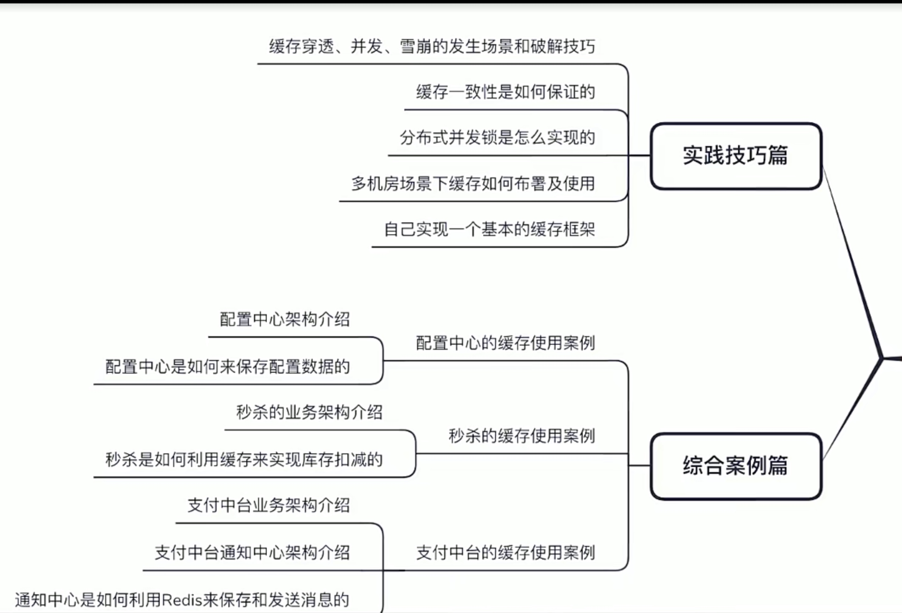

# 缓存基础

CPU 三级缓存：CPU --> L1Cache --> L2Cache --> L3Cache --> 主存

## 缓存使用场景：
1、前提：并发量比较大，将数据库中经常访问的数据加到缓存中
2、列表排序分页等场景，讲一些需要排序、分页的数据放到缓存中进行
3、并发计数器
4、详情内容数据缓存：电商，购物详细页面放到缓存中，当并发量比较大的时候，就可以直接访问.
5、分布式Session：用户权限问题，当部署服务多份的时候就会遇到Session共享问题
6、热点排名：排名系统、热点数据进行排名
7、发布订阅
8、分布式锁

## 技术选型
小型项目：Ehcache
中型项目：Spring Cache + Ehcache
大型项目：Spring Cache + Redis
分布式高并发系统：Redis

### 应用场景
Guava Cache的使用场景（数据量小，变化不频繁）：
* 愿意消耗一些内存来提升速度
* 某些键会被多次查询
* 缓存中存放的数据总量不会超过内存容量

