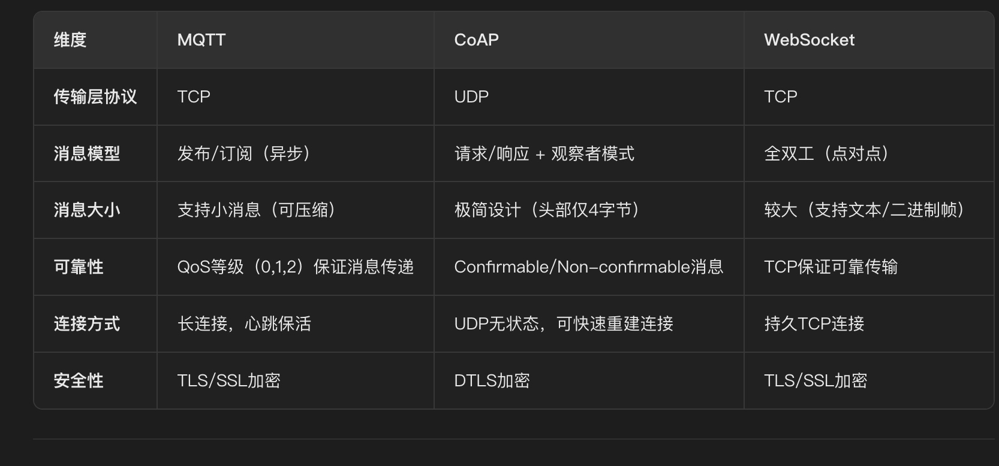

# 传输协议
- [WebSocket](#websocket)
  - [为什么选择WebSocket，而不是HTTP轮询或SSE（Server-Sent Events）](#为什么选择websocket，而不是http轮询或sse（server-sent-events）)
  - [**为什么选择WebSocket，而不使用MQTT、CoAP协议**](#为什么选择websocket，而不使用mqtt、coap协议)
  - [WebSocket服务器如何管理多个客户端的连接](#websocket服务器如何管理多个客户端的连接)
  - [任务下发的流程是怎样的，如何保证消息可靠性](#任务下发的流程是怎样的，如何保证消息可靠性)
  - [RFID设备二次扫描如何处触发任务进度更新](#rfid设备二次扫描如何处触发任务进度更新)
  - [WebSocket断线重连如何处理](#websocket断线重连如何处理)
- [MQTT && CoAP](#mqtt-coap)
  - [**MQTT与CoAP的区别**](#mqtt与coap的区别)
- [SSE](#sse)
  - [为什么使用 SSE：](#为什么使用sse：)
  - [SSE 底层原理：](#sse底层原理：)
  - [SSE 超时处理：](#sse超时处理：)

# WebSocket
## 为什么选择WebSocket，而不是HTTP轮询或SSE（Server-Sent Events）
1、WebSocket采用全双工通信，可以在任务下发后，服务器主动推送消息，减少客户端轮询带来的延迟
2、减少服务器压力：相比**HTTP轮询**（客户端需要不断发送请求），WebSocket只建立一次连接，减少不必要的请求和带宽占用
3、支持双向通信：SSE只能**服务器单向推送**，而WebSocket允许**客户端主动发送消息**（例如RFID设备反馈进度）
4、适用高并发场景：任务下发和通知通常设计大量设备，WebSocket通过**事件驱动和持久连接**，能够搞笑处理并发消息

## **为什么选择WebSocket，而不使用MQTT、CoAP协议**
**实时双向通信需求​​**
AGV系统通常需要​​实时状态反馈​​（如位置、电量）和​​双向指令交互​​（如动态路径调整）。
​​WebSocket优势​​：全双工通信允许传感器主动推送数据，同时系统可即时下发控制指令（如紧急停止），而MQTT/CoAP需要额外轮询或异步回调机制。
**​​与现有系统集成​​**
由于我们的系统已有基于HTTP/Web的架构（如Web管理后台），原先系统也有物料操作接口也是由WebSocket传输的，WebSocket可直接复用TCP连接，避免MQTT/CoAP的协议转换网关成本。
​​对比​​：MQTT需要额外Broker，CoAP需适配UDP与HTTP网关。
**​​开发与维护便捷性​​**
WebSocket API标准化（如浏览器原生支持），开发成本低；而MQTT/CoAP需引入专用客户端库和调试工具。
​​场景示例​​：AGV调度系统若用WebSocket，可直接用JavaScript与后端交互，无需处理MQTT的QoS或CoAP的Confirmable消息。
**​​二、对比其他协议的局限性​​**
​​1. MQTT的不足​​
​​单向性局限​​：MQTT的发布/订阅模式适合广播场景（如环境传感器数据），但AGV需要​​点对点精准控制​​（如调度系统直接指挥某台AGV）。
​​复杂性​​：需维护Broker集群（如EMQX、Mosquitto），增加系统复杂度，而AGV系统可能更追求轻量化。
​​2. CoAP的不足​​
​​UDP可靠性问题​​：CoAP基于UDP，虽支持重传（Confirmable消息），但在网络抖动时可能丢包，影响AGV关键指令（如避障信号）的可靠性。
​​功能冗余​​：CoAP的RESTful设计对AGV的实时流式数据传输（如连续位置更新）效率较低，而WebSocket的帧结构更适合连续数据。

## WebSocket服务器如何管理多个客户端的连接
采用唯一标识（设备ID）维护客户端连接
* 使用`ConcurrentHashMap<String, Session>`存储**设备ID** --> **WebSocket会话**的映射
```
onOpen()：新设备连接时，存入映射表。

onMessage()：收到消息时解析数据并处理。

onClose()：设备断开时，从映射表移除。

onError()：异常时进行重连或日志记录。
```

## 任务下发的流程是怎样的，如何保证消息可靠性
1、服务器端创建任务（存入数据库，标记为“待执行”）
2、通过WebSocket向RFID设备推送任务（JSON格式）
3、设备接收到任务后，回复ACK确认，服务器更新状态为“进行中”
4、设备执行任务，RFID设备二次扫描后更新任务进度
5、任务完成，服务器通知所有相关客户端
* ACK机制：设备收到任务后必须**回传确认消息**，否则服务器重试
* 离线存储：如果设备**离线**，任务存入Redis，等设备上线后**补发**
* 幂等性：任务有唯一ID，避免重复执行

## RFID设备二次扫描如何处触发任务进度更新
1、RFID设备扫描到标签之后，通过发送（设备ID、任务ID、状态）
2、服务器解析数据，更新任务进度（20% --> 50%）
3、服务器推送更新后的任务状态，通知其他客户端

## WebSocket断线重连如何处理
**前端**
```
setTimeout(connectWebSocket, 5000) // 5s后重连
```
**后端** --> 心跳检测（每30s发送心跳包）
```
private static final ScheduledExecutorService scheduler = Executors.newScheduledThreadPool(1);

public WebSocketServer() {
    scheduler.scheduleAtFixedRate(() -> {
        CLIENTS.forEach((deviceId, session) -> {
            if (session.isOpen()) {
                session.getAsyncRemote().sendText("PING");
            }
        });
    }, 0, 30, TimeUnit.SECONDS);
}
```

# MQTT && CoAP
**MQTT**
定位：轻量级发布/订阅消息协议，专为低带宽、高延迟或不可靠网络设计。
目标：物联网设备间高效通信，支持异步消息传递和离线消息缓存。

**CoAP**
定位：面向受限设备的RESTful应用层协议，基于UDP实现。
目标：替代HTTP在资源受限设备（如传感器）中的使用，支持观察者模式和低功耗操作。


## **MQTT与CoAP的区别**
**协议类型​​**
MQTT和WebSocket基于TCP，CoAP基于UDP，后者更适合对延迟敏感但允许少量丢包的场景（如工业传感器）。
**​​消息模型​​**
MQTT采用发布/订阅，适合一对多广播（如气象数据分发）；
CoAP支持请求/响应（类似HTTP）和观察者模式（资源状态变更通知）；
WebSocket是点对点全双工，适合实时聊天或游戏。
**​​资源消耗​​**
CoAP头部极简（4字节），适合内存/CPU受限设备；
MQTT头部约2-10字节，支持QoS；
WebSocket帧头至少2-10字节，但支持更复杂数据帧。
**​​适用场景​​**
MQTT：智能家居（异步控制）、远程监控；
CoAP：低功耗传感器网络、M2M通信；
WebSocket：在线协作工具、实时股票行情推送。

“协议选择本质是权衡：CoAP以牺牲可靠性换取功耗和速度，适合‘尽力而为’场景；MQTT以增加复杂度换取可靠性，适合‘零容忍’场景。真正的挑战在于理解业务需求，并在二者间找到平衡点。”​​

# SSE
## 为什么使用 SSE：
Spring Boot 中利用 SSE 实现实时数据推送既简单又实用，特别适合实时更新频率不高、实时性要求不严苛的场景。它通过服务器主动向客户端发送更新事件，有效降低了服务器负载和网络资源消耗。

## SSE 底层原理：
SSE 基于 HTTP 协议，采用了 HTTP 长连接的方式。客户端正常 http 请求服务器，通过JavaScript 的 EventSource 对象监听服务器发送的事件，并在收到更新时触发对应的事件处理器。服务器在响应头中设置 Content-Type: text/event-stream，表示该响应为事件流。当客户端请求过来的时候，服务端将该条请求挂起，然后获取最新数据将最新数据返回，继续将请求挂起这时候，返回类型是以流的形式返回，因为服务端将请求挂起，所以这条请求不会被关闭。

## SSE 超时处理：
为了避免无效的连接一直保持在服务器端，可以设置超时时间并处理连接超时的情况。可以使用 SseEmitter 对象的 setTimeout()方法设置超时时间，并通过 onTimeout()方法处理连接超时的逻辑。
