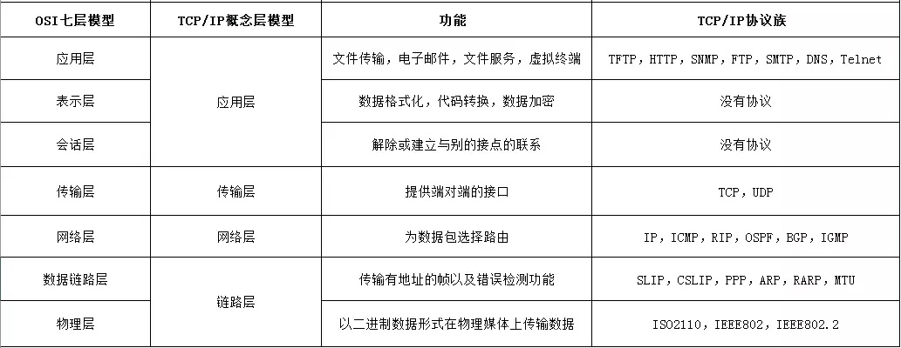
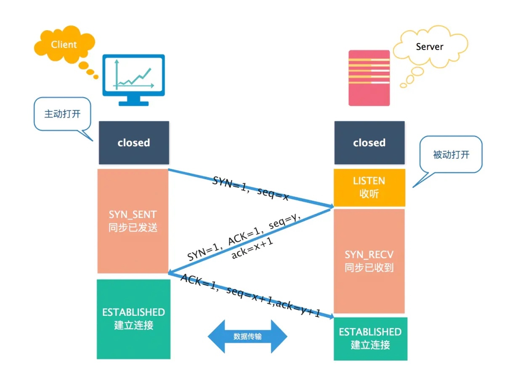
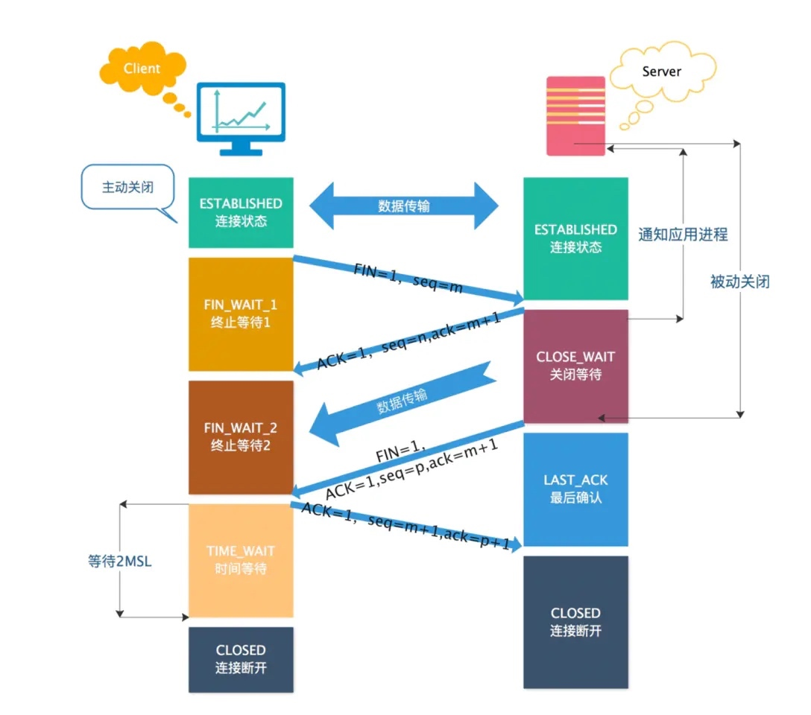
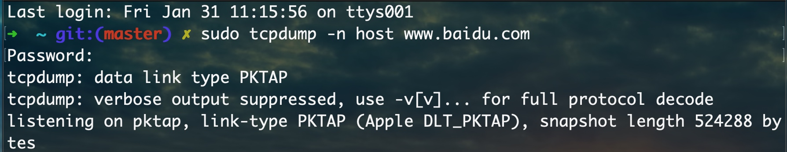

# 计算机网络
- [**从输入一个url到页面加载完成的过程**](#从输入一个url到页面加载完成的过程)
  - [整体流程](#整体流程)
    - [DNS查询过程](#dns查询过程)
    - [SSL四次握手](#ssl四次握手)
  - [浏览器访问资源没有响应,怎么排查](#浏览器访问资源没有响应怎么排查)
- [进程与线程](#进程与线程)
  - [**线程、进程、协程区别**](#线程、进程、协程区别)
  - [线程、进程间通信](#线程、进程间通信)
  - [同步互斥机制](#同步互斥机制)
  - [自旋锁和互斥锁](#自旋锁和互斥锁)
- [Http](#http)
  - [HTTP的特点](#http的特点)
  - [HTTP 协议了解吗？Content-type 了解吗？](#http协议了解吗？-content-type了解吗？)
  - [Http1.0和Http1.1和http2.0的区别](#http1-0和http1-1和http2-0的区别)
  - [为什么Http3使用UDP](#为什么http3使用udp)
  - [讲一下QUIC协议](#讲一下quic协议)
  - [QUIC的可靠性如何保证](#quic的可靠性如何保证)
  - [QUIC的多路复用](#quic的多路复用)
  - [QUIC向前纠错机制](#quic向前纠错机制)
  - [什么是半连接](#什么是半连接)
  - [半连接攻击](#半连接攻击)
  - [HTTP 的长连接与短连接](#http的长连接与短连接)
  - [HTTP 的 GET 和 POST 区别](#http的-get和-post区别)
  - [HTTPS的握手和加密过程](#https的握手和加密过程)
- [**对称加密和非对称加密**](#对称加密和非对称加密)
  - [漏洞：中间人攻击](#漏洞：中间人攻击)
- [**OSI七层参考模型**](#osi七层参考模型)
  - [为什么要分网络模型](#为什么要分网络模型)
  - [**TCP/IP四层参考模型**](#tcpip四层参考模型)
  - [比较 TCP/IP 参考模型与 OSI 参考模型](#比较tcpip参考模型与-osi参考模型)
- [TCP三次握手&四次挥手](#tcp三次握手四次挥手)
  - [TCP标志位](#tcp标志位)
  - [TCP序列号、确认号](#tcp序列号、确认号)
  - [**三次握手**](#三次握手)
    - [三次握手过程](#三次握手过程)
    - [**为什么不是两次握手**？](#为什么不是两次握手？)
    - [**为什么不是四次握手？**](#为什么不是四次握手？)
  - [为什么超时重传？如何处理丢包](#为什么超时重传？如何处理丢包)
    - [为什么需要超时重传?](#为什么需要超时重传)
    - [**如何处理丢包？**](#如何处理丢包？)
  - [**四次挥手**](#四次挥手)
    - [四次挥手过程](#四次挥手过程)
    - [**为什么需要四次挥手**](#为什么需要四次挥手)
    - [为什么四次挥手，客户端的TIME-WAIT状态必须等待2MSL的时间，才能返回到CLOSED状态](#为什么四次挥手，客户端的time-wait状态必须等待2msl的时间，才能返回到closed状态)
    - [**三次挥手可不可以？**](#三次挥手可不可以？)
    - [什么是TCP延迟确认机制](#什么是tcp延迟确认机制)
  - [如果已经建立了连接，但是客户端出现故障了怎么办？](#如果已经建立了连接，但是客户端出现故障了怎么办？)
  - [使用tcpdump抓包分析](#使用tcpdump抓包分析)
    - [操作](#操作)
- [**子网掩码的作用**](#子网掩码的作用)
- [ABC类网络](#abc类网络)
- [**TCP和UDP的区别**](#tcp和udp的区别)
  - [什么是TCP](#什么是tcp)
- [**TCP传输可靠性保障**](#tcp传输可靠性保障)
  - [TCP如何实现流量控制（滑动窗口原理）](#tcp如何实现流量控制（滑动窗口原理）)
  - [TCP拥塞控制](#tcp拥塞控制)
  - [超时重传](#超时重传)
- [IPV4和IPV6](#ipv4和ipv6)
- [状态码](#状态码)
- [**网络粘包问题**](#网络粘包问题)
  - [**TCP粘包**](#tcp粘包)
    - [长度前缀法的报头为什么选 4 字节？字节序怎么处理？](#长度前缀法的报头为什么选4字节？字节序怎么处理？)
    - [关闭 Nagle 算法为什么不能单独解决粘包](#关闭nagle算法为什么不能单独解决粘包)
  - [UDP 为什么没有粘包问题？](#udp为什么没有粘包问题？)
  - [HTTP 协议如何解决粘包？](#http协议如何解决粘包？)


**不会就强调“在同一内网下”**
# **从输入一个url到页面加载完成的过程**
## 整体流程
1、用户在某个标签页输入 URL 并回车后，浏览器主进程会新开一个网络线程，发起 HTTP 请求
2、浏览器会进行 DNS 查询，将域名解析为 IP 地址
3、浏览器获得 IP 地址后，向服务器请求建立 TCP 连接
4、浏览器向服务器发起 HTTP 请求
5、服务器处理请求，返回 HTTP 响应
6、浏览器的渲染进程解析并绘制页面
7、如果遇到 JS/CSS/图片 等静态资源的引用链接，重复上述过程，向服务器请求这些资源

**从链路层和网络层详细介绍**
浏览器输入 URL 并回车后，先经过应用层 DNS 解析拿到目标 IP，再由网络层封装 IP 报文、选路寻址，链路层封装成帧、通过 MAC 寻址和接入技术完成物理传输，中间经过交换机、路由器等设备转发，最终建立传输层连接并收发数据。


### DNS查询过程
DNS 是应用层的协议，作用是将域名转化为 IP，以供传输层建立 TCP 连接。

整体流程：浏览器搜索自身的 DNS 缓存、搜索操作系统的 DNS 缓存、读取本地的 Host 文件和向本地DNS 服务器进行查询等。

### SSL四次握手

SSL 位于传输层和应用层之间，TCP 和 HTTP 之间。SSL 协议的目的是，为通信双方提供一种在不安全的网络环境中，安全地协商一个密钥的方法。

SSL 实现的核心是非对称式密码学。非对称密码包含两个部分：公钥和私钥，一个用作加密，另一个则用作解密。使用其中一个密钥把明文加密后所得的密文，只能用相对应的另一个密钥才能解密得到原本的明文；甚至连最初用来加密的密钥也不能用作解密。

HTTPS 本质上就是 HTTP + SSL。通过 SSL 四次握手过程，客户端和服务端会商定一个共同的随机密钥，用来对称加密。握手结束后，双方都会使用这个约定的随机密钥来加密、解密会话内容，使用的完全是普通的 HTTP 协议。

## 浏览器访问资源没有响应,怎么排查

1、**检查浏览器控制台和网络面板**，F12进入开发者模式，查看Console和NetWork是否有错误或失败的请求。

2、**检查网络连接**，确保 DNS 解析和网络连接正常。

3、**检查服务器状态**，确保服务器运行正常，并查看日志信息。

4、**检查 API 或后端服务**，确认服务是否正常。

5、**清除浏览器缓存或使用无痕模式**。

6、**检查跨域问题**，确保服务器配置了正确的 CORS 头。

7、**检查代理或 VPN 设置**，确保没有影响请求。

# 进程与线程
## **线程、进程、协程区别**

首先说进程，它是操作系统进行资源分配的基本单位，每个进程都有自己独立的内存空间、文件描述符等资源，进程之间相互隔离。进程的创建、切换和销毁开销较大，因为涉及到资源的分配和释放。进程间通信需要通过 IPC 机制，比如管道、消息队列等。

然后是线程，它是进程内的执行单元，属于进程的一部分，一个进程可以包含多个线程。线程共享进程的内存空间和资源，但有自己独立的栈和程序计数器。线程的创建和切换开销比进程小很多，因为它们共享资源。线程间通信可以通过共享内存实现，更高效，但需要处理同步问题（比如锁）。线程的调度由操作系统内核负责，属于抢占式调度。

最后是协程，也叫微线程，它是用户态的轻量级线程，调度完全由用户程序控制，不依赖操作系统内核。协程的创建、切换和销毁开销极小，比线程更轻量。多个协程可以在同一个线程内运行，通过协作式调度（比如主动让出 CPU）实现并发，避免了内核态和用户态的切换成本。但协程不能利用多核 CPU，适合 I/O 密集型任务，不适合 CPU 密集型任务。

总结来说，从资源占用看：进程 > 线程 > 协程；从调度方式看：进程和线程由内核调度，协程由用户程序调度；从并发效率看：协程在特定场景下（如 I/O 密集）效率更高，进程隔离性最好但开销最大。

## 线程、进程间通信
**线程间通信**
同一进程的线程共享地址空间和所有资源，因此通信核心是共享数据的读写，主要方式有：直接用全局 / 堆内存（配合互斥锁 / 自旋锁）、使用线程安全的生产消费队列、通过条件变量 / 信号量实现等待唤醒；线程通信的关键是同步互斥，避免多线程竞态

**进程间通信**
不同进程有独立地址空间，无法直接共享内存，必须通过内核或中间件通信，分两类：
* 传统 IPC（仅同主机）：效率最高的是共享内存（需配合信号量同步），简单易用的是管道 / 命名管道，仅做异步通知用信号，有分类数据包用消息队列；
* 高级 IPC（支持跨主机，开发主流）：基于Socket（TCP） 的高层协议，如 HTTP、RPC、MQ，适合分布式系统的进程间通信；
进程通信的选择核心看场景：同主机高频大数据量用共享内存，分布式跨主机用 Socket+RPC/MQ，简单低频率用命名管道。

**二者核心差异**
核心区别在地址空间是否共享：线程通信是直接的共享内存读写，效率高、实现简单；进程通信是间接的内核 / 中间件转发，效率低、实现复杂，但支持跨主机；二者都需要同步互斥机制保证数据安全。

## 同步互斥机制
同步互斥机制，是用来解决多线程、多进程并发访问共享资源时，数据错乱和执行顺序混乱的问题。
它包含两个核心：
一是互斥，保证同一时间只有一个执行单元操作共享资源，避免竞争；
二是同步，控制多个执行单元按照约定的顺序执行，满足依赖关系。

常见的实现有互斥锁、自旋锁、读写锁、信号量、条件变量等，它们通过加锁、等待、唤醒等方式，保护临界区代码，保证并发安全和执行有序。

线程里用的同步互斥：是用户态的，比如 pthread_mutex、条件变量。
进程间用的同步互斥：是内核态的，比如 System V 信号量、共享内存配套的锁。

## 自旋锁和互斥锁
自旋锁和互斥锁的核心区别，是获取锁失败后的处理方式：
* 自旋锁会循环空转，一直占用 CPU 尝试获取，无上下文切换开销；
* 互斥锁会阻塞休眠，释放 CPU，锁释放后再被唤醒，有上下文切换开销。

适用场景上，自旋锁适合多核、锁持有时间极短的场景，比如底层内核、原子类实现；互斥锁适合锁持有时间较长、单核或高并发的场景，也是业务开发的主流选择。

# Http
## HTTP的特点
**简单性**：HTTP协议是一个文本协议，简单易用。它通过简单的请求-响应模式传输数据，易于理解和实现。
**无状态**：HTTP是无状态协议，每次请求都是独立的，服务器不会保留之前请求的状态。这简化了服务器设计，但需要客户端在每次请求时发送必要的状态信息。
**灵活性**：HTTP可以传输任意类型的数据，不仅限于文本。通过MIME类型（如text/html、image/png），客户端和服务器可以协商数据的格式。
**可扩展性**：HTTP支持多种方法（如GET、POST、PUT、DELETE），并且允许通过自定义头部字段扩展协议功能。

## HTTP 协议了解吗？Content-type 了解吗？
* HTTP 协议核心：基于请求 - 响应模型的无状态协议，通过请求方法（GET/POST/PUT/DELETE）、状态码（200/401/500）和头信息来交互。
* Content-Type：表示请求体 / 响应体的媒体类型，我常用的有：
    * application/json：最常用的接口格式，前后端交互的标准。
    * application/x-www-form-urlencoded：表单提交默认格式，参数会被编码成键值对。
    * multipart/form-data：用于上传文件，比如头像、商品图片，我在开发文件上传接口时必用。
    * text/html：返回 HTML 页面，用于 SSR 场景。

## Http1.0和Http1.1和http2.0的区别
1、HTTP1.0默认是短连接，每次与服务器交互，都需要新开一个连接
2、HTTP1.1版本最主要的是「默认持久连接」。只要客户端服务端没有断开TCP连接，就一直保持连接，可以发送多次HTTP请求。
3、其次就是「断点续传」（Chunked transfer-coding）。利用HTTP消息头使用分块传输编码，将实体主体分块进行传输。
4、HTTP/2不再以文本的方式传输，采用「二进制分帧层」，对头部进行了「压缩」，支持「流控」，最主要就是HTTP/2是支持「多路复用」的（通过单一的TCP连接「并行」发起多个的请求和响应消息也是基于分块传输）
5、HTTP/3 跟前面版本最大的区别就是：HTTP1.x和HTTP.2底层都是TCP，而HTTP.3底层是UDP。使用HTTP/3能够减少RTT「往返时延」（TCP三次握手，TLS握手）

## 为什么Http3使用UDP
首先讲一下HTTP2的一些问题：HTTP2 使用二进制传输、Header 压缩(HPACK)、多路复用等，相较于 HTTP1.1 大幅提高了数据传输效率，但它仍然存在着以下几个致命问题(主要由底层支撑的 TCP 协议造成)：
①**建立连接时间长，tcp连接需要经过三次握手**，（备注：TCP 建立连接时间 = 1.5 RTT）
（浏览器收到服务器的响应，又要等待的时间为：
一去(HTTP Request)二回 (HTTP Responses)故 HTTP 交易时间 = 1 RTT
由于 TCP 在第三次握手的时候，不需要等待服务器端的响应，所以节省 0.5 RTT，那么基于 TCP 传输的 HTTP 通信，一共花费的时间总和： 
**HTTP 通信时间总和** = TCP 建立连接时间 + HTTP 交易时间 = 1 RTT + 1 RTT = 2 RTT
https还得加上TLS 连接时间）
②**队头阻塞问题相较于 HTTP/1.1 更严重**
因为 HTTP/2 使用了多路复用，一般来说同一域名下只需要使用一个 TCP 连接。当这个连接中出现了丢包的情况，这也就是说，当某个包切分的 stream 由于某些原因丢失后，服务器不会处理其他 stream，而会优先等待客户端发送丢失的 stream ，那就会导致 HTTP/2 的表现情况反倒不如 HTTP/1 了。
HTTP/3选择了UDP，主要是为了解决队头阻塞问题。引入了QUIC传输层协议，它利用UDP作为其底层的传输机制，但在UDP之上实现了类似于TCP的可靠性、连接管理、流量控制等高级功能。

QUIC抽象出了一个stream（流）的概念，多个流，可以复用一条连接，那么滑动窗口这些概念就不用作用在连接上了，而是作用在stream上。由于UDP只管发送不管成功与否的特性，这些数据包的传输就能够并发执行。协议的server端，会解析并缓存这些数据包，进行组装和整理等。由于抽象出了stream的概念，就使得某个数据包传输失败，只会影响个stream的准确性，而不是整个连接的准确性

## 讲一下QUIC协议
QUIC 的握手连接更快，因为它使用了 UDP 作为传输层协议，这样能够减少三次握手的时间延迟。而且 QUIC 的加密协议采用了 TLS 协议的最新版本 TLS 1.3，相对之前的 TLS 1.1-1.2，TLS1.3 允许客户端无需等待 TLS 握手完成就开始发送应用程序数据的操作，可以支持1 RTT 和 0 RTT，从而达到快速建立连接的效果。

## QUIC的可靠性如何保证
我觉得可靠传输有 2 个重要特点：
（1）完整性：发送端发出的数据包，接收端都能收到
（2）有序性：接收端能按序组装数据包，解码得到有效的数据
①关于完整性，QUIC协议通过确认应答机制保证其可靠传输，客户端对未接收到确认包的PKN在超时后一律重传。
②通过offset确定数据包的顺序，而PKN设计为严格单调递增，递增是为了解决数据包的重传歧义问题。
显然，客户端发送重传包的情况有 服务器未接收到 和 服务器收到了但是客户端没有收到确认包 这两种情况，头一种情况不存在重传歧义问题，但是第二种情况如果是由于中间的网络原因导致客户端接收确认包超时了，导致发送了重传包，
那么此时服务器接收到重传包后再次发送的确认包将有可能和第一次发送的确认包混杂在一起。这种情况下如果PKN不是严格递增的话就会导致客户端无法确定数据包和确认包的对应关系。

## QUIC的多路复用
虽然 HTTP/2 支持了多路复用，但是 TCP 协议终究是没有这个功能的。QUIC 原生就实现了这个功能，并且传输的单个数据流可以保证有序交付且不会影响其他的数据流，这样的技术就解决了之前 TCP 存在的问题。
并且 QUIC 在移动端的表现也会比 TCP 好。因为 TCP 是基于 IP 和端口去识别连接的，这种方式在多变的移动端网络环境下是很脆弱的。但是 QUIC 是通过 ID 的方式去识别一个连接，不管你网络环境如何变化，只要 ID 不变，就能迅速重连上

## QUIC向前纠错机制
每个数据包除了它本身的内容之外，还包括了部分其他数据包的数据，因此少量的丢包可以通过其他包的冗余数据直接组装而无需重传。
向前纠错牺牲了每个数据包可以发送数据的上限，但是减少了因为丢包导致的数据重传，因为数据重传将会消耗更多的时间(包括确认数据包丢失、请求重传、等待新数据包等步骤的时间消耗)。
假如说这次我要发送三个包，那么协议会算出这三个包的异或值并单独发出一个校验包，也就是总共发出了四个包。
当出现其中的非校验包丢包的情况时，可以通过另外三个包计算出丢失的数据包的内容。
当然这种技术只能使用在丢失一个包的情况下，如果出现丢失多个包就不能使用纠错机制了，只能使用重传的方式了。

## 什么是半连接
半连接指的是在三次握手过程中，服务器返回SYN-ACK后，还没有收到客户端的ACK确认。这种状态下，服务器的连接还没有完全建立，仍然处于等待客户端确认的状态。

## 半连接攻击
攻击者向服务器发送大量SYN包，但不发送最终的ACK包，这会导致服务器保持大量的半连接，消耗服务器资源。最终，服务器可能因为资源耗尽而无法处理新的合法连接，导致拒绝服务。
如何防御：
1. **降低SYN-ACK的重试次数**：通过降低SYN-ACK的重试次数和减少超时等待时间，可以尽早释放半连接资源
2. **SYN Cookie**：当服务器接收到SYN包时，不立即分配资源，而是通过算法生成一个SYN Cookie（加密的序列号），并发送给客户端。客户端如果是合法用户，会返回这个SYN Cookie，服务器根据Cookie重建连接。这样可以防止攻击者占用过多资源

## HTTP 的长连接与短连接
HTTP/1.0 默认使用的是短连接。也就是说，浏览器每请求一个静态资源，就建立一次连接，任务结束就中断连接。

HTTP/1.1 默认使用的是长连接。长连接是指在一个网页打开期间，所有网络请求都使用同一条已经建立的连接。当没有数据发送时，双方需要发检测包以维持此连接。长连接不会永久保持连接，而是有一个保持时间。实现长连接要客户端和服务端都支持长连接。

长连接的优点：TCP 三次握手时会有 1.5 RTT 的延迟，以及建立连接后慢启动（slow-start）特性，当请求频繁时，建立和关闭 TCP 连接会浪费时间和带宽，而重用一条已有的连接性能更好。

长连接的缺点：长连接会占用服务器的资源。

## HTTP 的 GET 和 POST 区别
| 特性           | GET                                   | POST                       |
| -------------- | ------------------------------------- | -------------------------- |
| **用途**       | 获取数据                              | 提交数据                   |
| **数据传输**   | 数据附加在 URL 后                     | 数据在请求体中             |
| **数据长度**   | 受 URL 长度限制（通常 2000 字符以内） | 没有严格限制               |
| **缓存**       | 可缓存                                | 不缓存                     |
| **历史记录**   | 被记录在浏览器历史中                  | 不会出现在浏览器历史中     |
| **数据可见性** | 数据暴露在 URL 中                     | 数据不暴露在 URL 中        |
| **安全性**     | 不适合传输敏感数据                    | 相对更安全，但仍需要 HTTPS |
| **幂等性**     | 幂等                                  | 非幂等                     |

> **幂等性**指的是同一个操作多次执行，结果和副作用相同。

## HTTPS的握手和加密过程
首先客户端向服务器发起连接请求的时候首先会发送一个client hello消息，其中包含客户端**支持的ssl/tls版本、支持的加密算法列表、一个随机数、以及可选的客户端证书信息**。
	然后服务器收到clinet hello后，会根据自身配置选择一个双方都支持的ssl/tls版本和加密算法，并以‘server hello 消息回应客户端、包含服务器选择的加密算法、一个随机数以及服务器的数字证书：服务器的公钥和ca签名的证书信息。
	客户端接收到服务器消息后，提取证书信息，并通过本地受信任证书列表核验证书的真实性，验证的目的是确保服务器的身份是可信的，如果可信则继续进行握手过程，否则向用户发送警告。
	为了建立安全的会话，客户端会生成一个成为“预主密钥”的随机数，并使用服务器的公钥进行加密，加密后发送给服务器。这一步确保了只有服务器能够解密该预主密钥。
	服务器解密后，此时客户端和服务器都含有三部分数据客户端随机数、服务器随机数、预主密钥，双方通过这三部分数据使用约定的算法生成相同的会话密钥，并持续在后续的通信过程中用于加密和解密数据。
	双方各自使用生产的会话密钥加密一条握手完成消息，并互相发送finished消息，发送给对方，双发收到后如果能够解密和验证成功，表明握手完成。
	握手完成后双方可以通过会话密钥进行对称加密进行通信。

# **对称加密和非对称加密**
①对称加密是一种使用相同密钥进行加密和解密的加密方式。简单来说，就是发送方和接收方使用同一个密钥来进行加密和解密操作。
②非对称加密使用一对密钥进行加密和解密操作，公钥用于加密，私钥用于解密。发送方获取接收方的公钥进行加密，接收方使用自己的私钥进行解密。

**对称加密不安全，速度快，非对称加密安全系数高，耗时，如何解决这个问题？**
解决的办法是将对称加密的密钥使用非对称加密的公钥进行加密，然后发送出去，接收方使用私钥进行解密得到对称加密的密钥，然后双方可以使用对称加密来进行沟通。
1、某网站拥有用于非对称加密的公钥A、私钥A’。
2、浏览器像网站服务器请求，服务器把公钥A明文给传输浏览器。
3、浏览器随机生成一个用于对称加密的密钥X，用公钥A加密后传给服务器。
4、服务器拿到后用私钥A’解密得到密钥X。
5、这样双方就都拥有密钥X了，且别人无法知道它。之后双方所有数据都用密钥X加密解密。

## 漏洞：中间人攻击
中间人的确无法得到浏览器生成的密钥B，这个密钥本身被公钥A加密了，只有服务器才有私钥A’解开拿到它呀！然而中间人却完全不需要拿到密钥A’就能干坏事了。
1、某网站拥有用于非对称加密的公钥A、私钥A’。
2、浏览器向网站服务器请求，服务器把公钥A明文给传输浏览器。
3、中间人劫持到公钥A，保存下来，把数据包中的公钥A替换成自己伪造的公钥B（它当然也拥有公钥B对应的私钥B’）。
4、浏览器随机生成一个用于对称加密的密钥X，用公钥B（浏览器不知道公钥被替换了）加密后传给服务器。
5、中间人劫持后用私钥B’解密得到密钥X，再用公钥A加密后传给服务器。
6、服务器拿到后用私钥A’解密得到密钥X。
总结：中间人得到了密钥B。根本原因是浏览器无法确认自己收到的公钥是不是网站自己的
如何证明浏览器收到的公钥一定是该网站的公钥？ —-> 数字证书

# **OSI七层参考模型**

| 层级 | 名称       | 主要功能                         | 示例协议                   |
| ---- | ---------- | -------------------------------- | -------------------------- |
| 7    | 应用层     | 直接为用户提供网络服务           | HTTP, FTP, SMTP, DNS       |
| 6    | 表示层     | 数据格式化、加密、解密、压缩     | SSL/TLS, JPEG, GIF, ASCII  |
| 5    | 会话层     | 管理会话的建立、维持和终止       | RPC, NetBIOS, SMB          |
| 4    | 传输层     | 端到端的数据传输、错误检测与修正 | TCP, UDP                   |
| 3    | 网络层     | 路由选择、IP地址寻址、数据包转发 | IP, ICMP, ARP, IGMP        |
| 2    | 数据链路层 | 数据封装、物理地址传输、错误检测 | Ethernet, PPP, Frame Relay |
| 1    | 物理层     | 比特流传输、硬件接口、物理连接   | 电缆、光纤、无线信号       |

## 为什么要分网络模型
复杂问题拆解、分层解耦，分层后，每层只关心自己的事，上层不用关心下层怎么实现，下层不用关心上层用什么数据。


## **TCP/IP四层参考模型**
* 网络接入层：对应于 OSI 参考模型的物理层和数据链路层，负责相邻的物理节点间的可靠数据传输。协议包括WI-Fi、PPP等
* 网络层（或网际互联层）：对应于 OSI 参考模型的网络层，主要解决主机到主机的路由问题。协议包括 IP（网际协议，是用于分组交换数据网络的一种协议，功能包括寻址、路由、尽最大努力交付数据包）等
* 传输层：对应于 OSI 参考模型的传输层，为应用层实体提供端到端的、通用的通信功能，保证了数据包的顺序传送及数据的完整性。协议包括 TCP（传输控制协议，是一种面向连接的、可靠的、基于字节流的传输层通信协议）、UDP（用户数据报协议，是一个简单的、无连接的、不可靠的、面向数据报的通信协议）等
* 应用层：对应于 OSI 参考模型的应用层，为用户提供所需要的各种服务，是用户与网络之间的接口。协议包括 HTTP（超文本传输协议）、FTP（文件传输协议）、DNS（域名系统，域名和 IP 地址相互映射的分布式数据库）等

## 比较 TCP/IP 参考模型与 OSI 参考模型
共同点：
* 都采用了层次结构的概念
* 都能够提供面向连接和无连接的通信服务机制

不同点：
* OSI 采用了七层模型，而 TCP/IP 是四层
* OSI 的网络层既提供面向连接的服务，又提供无连接的服务；TCP/IP 的网络层只提供无连接的网络服务

# TCP三次握手&四次挥手


## TCP标志位
TCP标志位代表当前请求的目的，一共有6种

1、`SYN`（synchronous）：发送/同步标志，用来建立连接，和ACK标志位搭配使用。A请求与B建立连接时，SYN = 1, ACK = 0;B确认与A建立连接时，SYN=1，ACK=1
2、`ACK`（acknowledgement）：确认标志，表示确认收到请求
3、PSH（push）：推送操作，就是指数据包到达接收端以后，不对其进行队列处理，而是尽可能的将数据交给应用程序处理
4、`FIN`（finish）：结束标志，表示关闭一个TCP连接
5、RST（reset）：重制复位标志，用于复位对应的TCP连接
6、URG（urgent）：紧急标志位，用于保证TCP连接不被中断，并且督促中间层设备尽快处理
## TCP序列号、确认号
- 作用：TCP 使用序列号来记录发送数据包的顺序。TCP 传送一个数据包后，只有在指定时间里收到这个包的确认信息，才会将其从队列中删除，否则会重新发送该数据包。对接收方而言，通过数据分段中的序列号可以保证数据能够按照正常的顺序进行重组。
## **三次握手**
### 三次握手过程


> 图片来源：https://juejin.im/post/5ddd1f30e51d4532c42c5abe

* 第一次握手（SYN）：
    * 客户端向服务端发送一个**同步报文**（SYN），表示请求建立连接，并告知自己的**初始序列号**（Seq）
    * 第一次握手主要是为了：服务端确认“自己收、客户端发”报文功能正常
* 第二次握手（SYN + ACK）：
    * 服务端收到客户端的SYN报文后，回复**同步确认报文**（SYN + ACK），同时指定自己的初始序列号（Seq），并对客户端的序列号进行ACK确认（确认号=客户端的序列号 + 1）
    * 第二次握手主要是为了：客户端确认“自己发、自己收、服务端收、服务端发”报文功能正常，因此客户端认为连接已建立
* 第三次握手（ACK）：
    * 客户端收到服务器的 SYN + ACK 之后，回复一个 ACK 报文，表示自己确认了服务器的 SYN，并对服务器的序列号进行 ACK 确认（确认号 = 服务器的序列号 + 1）。
    * 第三次握手主要是为了：服务端确认“自己发、客户端收”报文功能正常，此时双方都认为连接已建立，TCP 连接正式建立

**三次握手可以解决的问题**：

1、防止历史连接误触发： 旧的 SYN 可能会因网络问题延迟到达服务器，导致服务器误以为是新的连接，三次握手确保客户端仍在等待通信。

2、确保双方的收发能力都正常： 三次握手能确保双方的 发送能力 和 接收能力 都正常，不会出现服务器单方面认为连接成功的情况。

### **为什么不是两次握手**？
用谈恋爱举例子，第一次男孩子跟女孩说我喜欢你， 然后第二次就是女孩知道了，然后说我也喜欢你，如果是两次的话，女孩就不知道男孩是不是已经收到了，就无法开始恋爱。
两次握手无法确保客户端和服务器的发送、接收能力都正常，可能会导致旧连接被误认为是新的连接，进而影响数据的可靠性。

**假设采用两次握手**：
1、客户端发送 SYN（请求建立连接）。
2、服务器收到后，直接返回 SYN + ACK，认为连接建立成功。
3、服务器直接开始发送数据。
4、问题：如果客户端因网络延迟或其他原因没有收到服务器的 SYN + ACK，或者客户端已经关闭，服务器仍然认为连接有效，会导致无效连接或错误数据传输。

### **为什么不是四次握手？**
如果使用四次握手，就会多出一步额外的 ACK 确认报文，但这在建立连接时是不必要的，因为：
* 在第三次握手中，客户端发送的 ACK 已经明确表示它收到了服务器的 SYN + ACK，并准备好通信。
* 服务器只需要确认这个 ACK 是否到达即可，而不需要再发送一个额外的确认报文。
> 但是，在 TCP 断开连接时，为什么是四次挥手？
断开连接涉及双方数据传输的结束，需要确保双方都不再发送数据，因此需要四次挥手来确保数据彻底传输完毕。

## 为什么超时重传？如何处理丢包
### 为什么需要超时重传?
在TCP传输过程中，网络环境肯能会导致**数据包丢失或ACK（确认）丢失**。为了确保数据能够可靠地传输，TCP采用**超时重传机制**

1、发送方发送数据后，会开启一个**定时器**，等待接收方的ACK确认。
2、如果在**超时时间内**没有收到ACK，发送方会**重新**发送该数据包。
3、如果仍然没有收到确认，TCP可能会指数退避地延长超时时间，并继续重传（如：RTO值递增）。
4、当达到一定的**重传上限**后，TCP会认为连接中断，并向应用层报告失败。

超时重传机制保证了即使网络环境不稳定，TCP仍然能够提供可靠的数据传输。
### **如何处理丢包？**
TCP采用**超时重传**和**快速重传**两种机制来处理丢包。

1、**超时重传**

**应用场景**：适用于网络不稳定、长时间丢包
**触发条件**：在RTO内未收到ACK
**处理方式**：重新发送数据包

* 发送方在发送数据时，启动一个定时器（RTO）
* 如果在RTO时间内没有收到ACK，TCP认为数据包丢失，重新发送该数据包
* TCP会指数退避地调整RTO，比如1s、2s、4s....直到达到最大重传次数。

缺点：
* 如果RTO设置过长，丢包恢复慢，影响性能。
* 如果RTO设置过短，可能导致**不必要的重传**，加重网络负担。

2、**快速重传**

**应用场景**：适用于部分丢包、轻微网络抖动
**触发条件**：收到3个相同的ACK
**处理方式**：立即重传丢失的数据包

当TCP发送方收到连续3个相同的ACK（即3次确认同一个数据包）时，认为该数据包**可能已经丢失**，会**立即重传**，而不等待超时。


**示例**：
1、发送方发送 Seq=1, 2, 3, 4。
2、Seq=2 丢失，但 Seq=3、4 仍然到达 接收方。
3、接收方发现 Seq=2 缺失，于是对 Seq=1 发送 3 次 ACK（ACK=2）。
4、发送方收到 3 次相同的 ACK=2，认为 Seq=2 丢失，立即重传 Seq=2。

**优点**：
* 比超时重传更快恢复丢包，提高 TCP 传输效率。

## **四次挥手**
### 四次挥手过程

> 图片来源：https://juejin.im/post/5ddd1f30e51d4532c42c5abe

* 第一次挥手：客户端向服务端发送连接释放报文（FIN=1，ACK=1），主动关闭连接，同时等待服务端的确认
    * 序列号 seq = u，即客户端上次发送的报文的最后一个字节的序号 + 1
    * 确认号 ack = k, 即服务端上次发送的报文的最后一个字节的序号 + 1
* 第二次挥手：服务端收到连接释放报文后，立即发出确认报文（ACK=1），序列号 seq = k，确认号 ack = u + 1

这时 TCP 连接处于半关闭状态，即客户端到服务端的连接已经释放了，但是服务端到客户端的连接还未释放。这表示客户端已经没有数据发送了，但是服务端可能还要给客户端发送数据。

* 第三次挥手：服务端向客户端发送连接释放报文（FIN=1，ACK=1），主动关闭连接，同时等待 ACK 的确认
    * 序列号 seq = w，即服务端上次发送的报文的最后一个字节的序号 + 1。如果半关闭状态，服务端没有发送数据，那么 w == k
    * 确认号 ack = u + 1，与第二次挥手相同，因为这段时间客户端没有发送数据
* 第四次挥手：客户端收到服务端的连接释放报文后，立即发出确认报文（ACK=1），序列号 seq = u + 1，确认号为 ack = w + 1

此时，客户端就进入了 TIME-WAIT 状态。注意此时客户端到 TCP 连接还没有释放，必须经过 2*MSL（最长报文段寿命）的时间后，才进入 CLOSED 状态。而服务端只要收到客户端发出的确认，就立即进入 CLOSED 状态。可以看到，服务端结束 TCP 连接的时间要比客户端早一些。

TCP 规定，[FIN/ACK] 包即使没有传送数据，也会消耗掉一个序列号。[FIN/ACK] 包是第一、三次挥手：

* 第一次挥手时，客户端的序列号 seq = u，消耗一个序列号。因此：
    * 第二次挥手时，服务端的确认号 ack = u + 1
    * 第四次挥手时，客户端的序列号 seq = u + 1
* 第三次挥手时，服务端的序列号 seq = w，消耗一个序列号。因此：
    * 第四次挥手时，客户端的确认号 ack = w + 1
### **为什么需要四次挥手**
因为 TCP 是全双工的，一方关闭连接后，另一方还可以继续发送数据。所以四次挥手，将断开连接分成两个独立的过程
### 为什么四次挥手，客户端的TIME-WAIT状态必须等待2MSL的时间，才能返回到CLOSED状态
确保服务器能够收到ack消息，如果没收到会重新发送fin字段。而且2msl是最长报文段寿命。

避免新的连接有旧的数据干扰。就正如我们重启服务器一样，会先优雅关闭各种资源，再留有一段时间，希望在这段时间内，资源是正常关闭的，这样重启服务器（或者发布）就基本认为不会影响到线上运行了。

**详解**：
主要有两个原因：
(1) 确保 ACK 报文能够到达服务端，从而使服务端正常关闭连接。

第四次挥手时，客户端第四次挥手的 ACK 报文不一定会到达服务端。服务端会超时重传 FIN/ACK 报文，此时如果客户端已经断开了连接，那么就无法响应服务端的二次请求，这样服务端迟迟收不到 FIN/ACK 报文的确认，就无法正常断开连接。

MSL 是报文段在网络上存活的最长时间。客户端等待 2MSL 时间，即「客户端 ACK 报文 1MSL 超时 + 服务端 FIN 报文 1MSL 传输」，就能够收到服务端重传的 FIN/ACK 报文，然后客户端重传一次 ACK 报文，并重新启动 2MSL 计时器。如此保证服务端能够正常关闭。

那如果服务端重发的 FIN 没有成功地在 2MSL 时间里传给客户端，会怎样？服务端会继续超时重试直到断开连接，见下文。

(2) 防止已失效的连接请求报文段出现在之后的连接中。

TCP 要求在 2MSL 内不使用相同的序列号。客户端在发送完最后一个 ACK 报文段后，再经过时间 2MSL，就
可以保证本连接持续的时间内产生的所有报文段都从网络中消失。这样就可以使下一个连接中不会出现这种旧的连接请求报文段。或者即使收到这些过时的报文，也可以不处理它。

### **三次挥手可不可以？**
首先来说，在一些情况下，TCP四次挥手是可以变成TCP三次挥手的。当被动关闭方在TCP挥手过程中，**没有数据要发送**并且**开启了TCP延迟确认机制**，那么第二次ack报文和第三次fin报文就会合并传输，第二次挥手和第三次挥手中间是服务端的closewait状态嘛，等closewait状态过了，再一起发送fin + ack，这样就出现了三次挥手。

### 什么是TCP延迟确认机制
当发送没有携带数据的ACK，它的网络效率是很低的，因为它也有40个字节的IP头和TCP头，但却没有携带数据报文。为了解决ACK传输效率低问题，所以就衍生出了TCP延迟确认机制。
TCP延迟劝人的策略：
* 当有响应数据要发送时，ACK会随着响应数据一起立刻发送给对方。
* 当没有响应数据要发送时，ACK将会延迟一段时间，以等待是否有响应数据可以一起发送
* 如果在延迟等待发送ACK期间，对方的第二个数据报文又到达了，这时就会立即发送ACK

## 如果已经建立了连接，但是客户端出现故障了怎么办？
或者说，如果**三次握手阶段、四次挥手阶段的包丢失了怎么办**？比如上面描述的“服务端重发 FIN”的问题。

简而言之，通过**定时器 + 超时重试机制**，尝试获取确认，直到最后会自动断开连接。

具体而言，TCP 设有一个保活计时器。服务器每收到一次客户端的数据，都会重新复位这个计时器，时间通常是设置为 2 小时。若 2 小时还没有收到客户端的任何数据，服务器就开始重试：每隔 75 秒发送一个探测报文段，若一连发送 10 个探测报文后客户端依然没有回应，那么服务器就认为连接已经断开了。
## 使用tcpdump抓包分析
### 操作
`tcpdump`是一个命令行工具，可以打印网络接口上传输的 TCP 报文。

在一个终端窗口执行以下命令，监听与`www.baidu.com`传输的数据包
```
tcpdump -n host www.baidu.com # 可能需要 sudo 权限
```
参数说明：
* -n：不要将 host.port 转成域名
* host：监听发到特定主机与端口的流量
如图，开始成功监听：

随后再开启一个终端窗口，执行以下命令，访问 ```www.baidu.com```

```
curl www.baidu.com：
```
可以看到 tcpdump 打印了信息

其中一定包含三次握手建立连接、发送数据包、四次挥手断开连接这几个过程。接下来一一分析。约定：客户端就是本机，服务端就是百度的服务器。

# **子网掩码的作用**
子网掩码是用于划分网络地址和主机地址的一个32位二进制数。
它与IP地址结合使用，用于确定一个IP地址中哪些位表示网络地址，哪些位表示主机地址。

子网掩码的作用主要有两个方面：

1、确定网络地址：子网掩码通过将IP地址中的网络部分与主机部分进行分隔，将网络地址和主机地址进行划分。子网掩码中的1表示网络部分，0表示主机部分。通过与IP地址进行逻辑与运算，可以得到网络地址。
2、确定主机地址范围：子网掩码中的0表示主机部分，确定了主机地址的范围。主机地址范围就是同一个网络中可以分配给主机的不同IP地址。子网掩码中主机部分的位数可以决定主机地址的数量，可以根据主机地址范围来分配IP地址给不同的主机。

总的来说：它可以帮助路由器和交换机等网络设备正确地识别网络地址和主机地址，实现数据的正确传输和路由。

# ABC类网络
| 类别 | 地址范围                      | 默认子网掩码        | 网络部分 | 主机部分 | 每个网络支持的主机数量 | 可用网络数量 |
| ---- | ----------------------------- | ------------------- | -------- | -------- | ---------------------- | ------------ |
| A类  | `0.0.0.0 - 127.255.255.255`   | `255.0.0.0 /8`      | 8 位     | 24 位    | 16,777,214             | 128 个       |
| B类  | `128.0.0.0 - 191.255.255.255` | `255.255.0.0 /16`   | 16 位    | 16 位    | 65,534                 | 16,384 个    |
| C类  | `192.0.0.0 - 223.255.255.255` | `255.255.255.0 /24` | 24 位    | 8 位     | 254                    | 2,097,152 个 |

应用场景：

**A 类网络**：适用于需要大量主机的非常大的网络（例如，大型 ISP 或跨国公司），但网络数量较少。

**B 类网络**：适用于中型网络，既能支持较多的主机，又能支持一定数量的子网。常用于中型公司或组织。

**C 类网络**：适用于小型网络，适合家庭、个人用户或小型企业，支持的主机较少，但支持较多的子网。

```
1100000000
255.255.255.192
```

# **TCP和UDP的区别**

**是否面向连接**：UDP 在传送数据之前不需要先建立连接。而 TCP 提供面向连接的服务，在传送数据之前必须先建立连接，数据传送结束后要释放连接。
**是否是可靠传输**：远地主机在收到 UDP 报文后，不需要给出任何确认，并且不保证数据不丢失，不保证是否顺序到达。TCP 提供可靠的传输服务，TCP 在传递数据之前，会有三次握手来建立连接，而且在数据传递时，有确认、窗口、重传、拥塞控制机制。通过 TCP 连接传输的数据，无差错、不丢失、不重复、并且按序到达。
**是否有状态**：这个和上面的“是否可靠传输”相对应。TCP 传输是有状态的，这个有状态说的是 TCP 会去记录自己发送消息的状态比如消息是否发送了、是否被接收了等等。为此 ，TCP 需要维持复杂的连接状态表。而 UDP 是无状态服务，简单来说就是不管发出去之后的事情了。
**传输效率**：由于使用 TCP 进行传输的时候多了连接、确认、重传等机制，所以 TCP 的传输效率要比 UDP 低很多。
**传输形式**：TCP 是面向字节流的，UDP 是面向报文的。首部开销：TCP 首部开销（20 ～ 60 字节）比 UDP 首部开销（8 字节）要大。
**是否提供广播或多播服务**：TCP 只支持点对点通信，UDP 支持一对一、一对多、多对一、多对多；

- **选择 TCP**：如果你的应用需要确保数据传输的可靠性、顺序控制，并且可以容忍一定的延迟（如网页浏览、文件传输、电子邮件等），就应该使用 TCP。
- **选择 UDP**：如果你的应用需要快速传输数据，且对丢包有一定容忍度，且不需要顺序控制（如流媒体、在线游戏、DNS 查询等），就应该使用 UDP。

## 什么是TCP
TCP是**面向连接的、可靠的、基于字节流的**传输层通信协议。
* 面向连接：一定是「一对一」才能连接，不能像UDP协议可以一个主机可以同时向多个主机发送消息，也就是一对多无法做到
* 可靠的：无论网络链路中出现怎样的链路变化，TCP都可以保证一个报文一定能够到达接收端
* 字节流：用户消息通过TCP协议传输时，消息可能会被操作系统「分组」成多个TCP报文，如果接收方的程序如果不知道「消息的边界」，事务发读出一个有效的用户消息的，并且TCP报文是「有序的」，当「前一个」TCP报文没有收到的时候，即使它先收到了后面的TCP报文，那么也不能扔给应用层去处理，同时对「重复」的TCP报文会自动丢弃

# **TCP传输可靠性保障**
**1、基于数据块传输**：应用数据被分割成 TCP 认为最适合发送的数据块，再传输给网络层，数据块被称为报文段或段。

**2、对失序数据包重新排序以及去重**：TCP 为了保证不发生丢包，就给每个包一个序列号，有了序列号能够将接收到的数据根据序列号排序，并且去掉重复序列号的数据就可以实现数据包去重。

**3、校验和** : TCP 将保持它首部和数据的检验和。这是一个端到端的检验和，目的是检测数据在传输过程中的任何变化。如果收到段的检验和有差错，TCP 将丢弃这个报文段和不确认收到此报文段。

**4、重传机制** : 在数据包丢失或延迟的情况下，重新发送数据包，直到收到对方的确认应答（ACK）。TCP 重传机制主要有：基于计时器的重传（也就是超时重传）、快速重传（基于接收端的反馈信息来引发重传）、SACK（在快速重传的基础上，返回最近收到的报文段的序列号范围，这样客户端就知道，哪些数据包已经到达服务器了）、D-SACK（重复 SACK，在 SACK 的基础上，额外携带信息，告知发送方有哪些数据包自己重复接收了）。

**5、流量控制** : TCP 连接的每一方都有固定大小的缓冲空间，TCP 的接收端只允许发送端发送接收端缓冲区能接纳的数据。当接收方来不及处理发送方的数据，能提示发送方降低发送的速率，防止包丢失。TCP 使用的流量控制协议是可变大小的滑动窗口协议（TCP 利用滑动窗口实现流量控制）。

**6、拥塞控制** : 当网络拥塞时，减少数据的发送。TCP 在发送数据的时候，需要考虑两个因素：一是接收方的接收能力，二是网络的拥塞程度。接收方的接收能力由滑动窗口表示，表示接收方还有多少缓冲区可以用来接收数据。网络的拥塞程度由拥塞窗口表示，它是发送方根据网络状况自己维护的一个值，表示发送方认为可以在网络中传输的数据量。发送方发送数据的大小是滑动窗口和拥塞窗口的最小值，这样可以保证发送方既不会超过接收方的接收能力，也不会造成网络的过度拥塞。

## TCP如何实现流量控制（滑动窗口原理）
TCP 利用滑动窗口实现流量控制。流量控制是为了控制发送方发送速率，保证接收方来得及接收。 接收方发送的确认报文中的窗口字段可以用来控制发送方窗口大小，从而影响发送方的发送速率。

**为什么需要流量控制?** 这是因为双方在通信的时候，发送方的速率与接收方的速率是不一定相等，如果发送方的发送速率太快，会导致接收方处理不过来。如果接收方处理不过来的话，就只能把处理不过来的数据存在 **接收缓冲区(Receiving Buffers)** 里（失序的数据包也会被存放在缓存区里）。如果缓存区满了发送方还在狂发数据的话，接收方只能把收到的数据包丢掉。出现丢包问题的同时又疯狂浪费着珍贵的网络资源。因此，我们需要控制发送方的发送速率，让接收方与发送方处于一种动态平衡才好。

这里需要注意的是（常见误区）：

- 发送端不等同于客户端
- 接收端不等同于服务端

TCP 为全双工(Full-Duplex, FDX)通信，双方可以进行双向通信，客户端和服务端既可能是发送端又可能是服务端。因此，两端各有一个发送缓冲区与接收缓冲区，两端都各自维护一个发送窗口和一个接收窗口。接收窗口大小取决于应用、系统、硬件的限制（TCP 传输速率不能大于应用的数据处理速率）。通信双方的发送窗口和接收窗口的要求相同

**TCP 发送窗口可以划分成四个部分**：

1. 已经发送并且确认的 TCP 段（已经发送并确认）；
2. 已经发送但是没有确认的 TCP 段（已经发送未确认）；
3. 未发送但是接收方准备接收的 TCP 段（可以发送）；
4. 未发送并且接收方也并未准备接受的 TCP 段（不可发送）。
接收窗口的大小是**根据接收端处理数据的速度动态调整的**

## TCP拥塞控制
在某段时间，若对网络中某一资源的需求超过了该资源所能提供的可用部分，网络的性能就要变坏。这种情况就叫拥塞。拥塞控制就是为了防止过多的数据注入到网络中，这样就可以使网络中的路由器或链路不致过载。
拥塞控制所要做的都有一个前提，就是网络能够承受现有的网络负荷。拥塞控制是一个全局性的过程，涉及到所有的主机，所有的路由器，以及与降低网络传输性能有关的所有因素。相反，流量控制往往是点对点通信量的控制，是个端到端的问题。流量控制所要做到的就是抑制发送端发送数据的速率，以便使接收端来得及接收。

**阻塞控制如何进行**
送方让自己的发送窗口取为拥塞窗口和接收方的接受窗口中较小的一个。TCP 的拥塞控制采用了四种算法，即 **慢开始、 拥塞避免、快重传 和 快恢复**。
* 慢开始：拥塞窗口（cwnd）一开始为1，然后每经过一个传播翻倍。当阻塞窗口大小大于慢开始门限，改为使用拥塞避免算法。
* 拥塞避免：每次cwnd 加1。
假如,出现了部分报文段丢失的情况,重传计时器超时,此时拥塞窗口变为1,重新开始慢开始算法,同时**慢开始门限值/2**.

## 超时重传
当发送方发送数据之后，它启动一个定时器，等待目的端确认收到这个报文段。接收端实体对已成功收到的包发回一个相应的确认信息（ACK）。如果发送端实体在合理的往返时延（RTT）内未收到确认消息，那么对应的数据包就被假设为已丢失并进行重传。

- RTT（Round Trip Time）：往返时间，也就是数据包从发出去到收到对应 ACK 的时间。
- RTO（Retransmission Time Out）：重传超时时间，即从数据发送时刻算起，超过这个时间便执行重传。

RTO 的确定是一个关键问题，因为它直接影响到 TCP 的性能和效率。如果 RTO 设置得太小，会导致不必要的重传，增加网络负担；如果 RTO 设置得太大，会导致数据传输的延迟，降低吞吐量。因此，RTO 应该根据网络的实际状况，动态地进行调整。

RTT 的值会随着网络的波动而变化，所以 TCP 不能直接使用 RTT 作为 RTO。为了动态地调整 RTO，TCP 协议采用了一些算法，如加权移动平均（EWMA）算法，Karn 算法，Jacobson 算法等，这些算法都是根据往返时延（RTT）的测量和变化来估计 RTO 的值。

# IPV4和IPV6
首先来说它们是互联网协议的两个版本，用于在网络中标识和定位设备（计算机、手机、服务器等），使它们能够相互通信。

1、**区别**
ipv6比ipv4的地址长度（32位-128位）、地址数量（43亿-几乎无限）要大，ipv4采用点分十进制并且头部大小不固定（20-60字节），ipv6采用冒号分隔十六进制，头部大小固定（40字节）

2、**既然有了IPV4，为什么还要有IPV6**
（1）解决地址耗尽问题：IPv6 的地址空间足以支持未来数十年的互联网增长
（2）提升网络性能：简化头部结构，优化路由效率。

# 状态码
200 - 成功处理请求
400 - 客户端不理解请求的语法。
401 - 未授权
404 - 未找到页面
500 - 服务器遇到错误，无法请求


# **网络粘包问题**
## **TCP粘包**
定义：TCP 是面向字节流的协议，无天然数据边界，发送方连续发的多包数据，到接收方可能被合并成一个大包（粘包），或一个完整包被拆成多个小包

**根本原因：**
「**发送方合并发送 + 接收方缓存接收**」，无边界导致接收方无法区分包的结束位置：
* 发送方：默认开启**Nagle 算法**，会合并小数据包（凑满 MSS 大小 / 等待超时）再发送，避免频繁发小包占用网络；
* 接收方：有**TCP 接收缓冲区**，数据到达后先存入缓冲区，若接收方未及时读取，多个数据包会堆积，读取时就会拿到粘包数据；

**解决方式：**
1、固定长度包
核心：约定所有数据包为**固定字节长度**，接收方每次固定读取指定长度，未读满则等待，读满即为一个完整包；
场景：适配固定长度数据
缺点：无法适配动态数据

2、特殊分隔符分割
核心：在**每个数据包末尾添加唯一特殊分隔符**（如\r\n、###、自定义字符组合），接收方读取到分隔符即视为一个完整包
场景：无特殊符号的文本 / 二进制数据
缺点：若数据本身含分隔符（如文本里的\r\n），会导致误拆分，需做转义处理

3、长度前缀法（最通用、生产首选，面试重点）
核心：每个数据包分为「**固定长度报头 + 报文体**」，报头是数字（如 2/4 字节），表示后续报文体的**有效字节长度**；接收方先读报头解析出长度，再精准读取对应长度的报文体，完美解决粘包 + 半包；
场景：绝大多数生产场景

4、长度前缀法 + 关闭 Nagle 算法（工业级方案）
* 发送方：关闭 Nagle 算法，将数据封装为自定义协议：[4字节大端报头（报文体长度）] + [报文体（有效数据）]，后直接发送；
* 接收方：① 先读 4 字节报头，转为主机字节序解析出报文体长度 L；② 循环读取缓冲区，直到读满 L 字节报文体，视为一个完整包；③ 剩余数据留在缓冲区，等待下一次读取，避免半包；

### 长度前缀法的报头为什么选 4 字节？字节序怎么处理？
* 4 字节 int 可表示最大长度 2^31-1（约 2G），能覆盖绝大多数业务的数据包长度（2 字节最大仅 65535 字节，无法适配大文件）；
* 网络传输默认大端序（网络字节序），发送方需将主机字节序转为大端序，接收方再转回，避免 x86（小端）、ARM（大端）等不同架构的解析错误。

### 关闭 Nagle 算法为什么不能单独解决粘包
Nagle 算法仅**解决发送方的小包合并**问题，但粘包的另一核心原因是**接收方的缓冲区缓存**—— 即使发送方发的是独立小包，若接收方未及时读取，多个小包仍会堆积在接收缓冲区，读取时还是会拿到粘包数据。

## UDP 为什么没有粘包问题？
UDP 是面向报文的协议，有天然的数据边界，与 TCP 的 “字节流” 设计本质不同：
* 发送方：一次sendto对应一个独立 UDP 报文包，操作系统不会合并，直接发送；
* 接收方：一次recvfrom只能读取一个完整的 UDP 报文包，缓冲区数据不足则返回错误，数据超出缓冲区则多余部分直接丢弃；

总结：UDP 从根源避免了粘包，但 UDP 是不可靠传输（丢包、乱序、无重传），适合实时性要求高、可容忍少量丢包的场景（音视频、游戏）。

## HTTP 协议如何解决粘包？
HTTP 结合特殊分隔符和长度前缀法，按需使用：
1、短连接 / 文本数据（请求行、请求头）：用\r\n分隔；
2、长连接 / 二进制数据（POST 表单、文件）：用Content-Length字段指定请求体长度（长度前缀法）；
3、动态生成数据（视频流）：用Transfer-Encoding: chunked分块传输，每个分块前标注分块长度。
