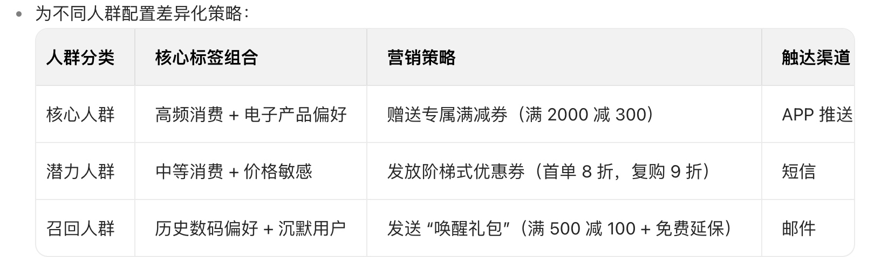

# 用户画像构建：Spark MLlib 聚类分析
- [数据处理流程](#数据处理流程)
  - [历史订单数据的特征工程是如何做的？请列举 3 个核心用户标签的构建逻辑（如消费频次、运输偏好等）。](#历史订单数据的特征工程是如何做的？请列举3个核心用户标签的构建逻辑（如消费频次、运输偏好等）。)
  - [**用户标签构建**](#用户标签构建)
  - [聚类算法（如 K-means）的参数调优过程是怎样的？如何确定最佳聚类数量？](#聚类算法（如k-means）的参数调优过程是怎样的？如何确定最佳聚类数量？)
- [工程实现细节](#工程实现细节)
  - [用户画像数据是存储在 Redis 还是 Hive？不同存储选型的应用场景分别是什么？](#用户画像数据是存储在redis还是-hive？不同存储选型的应用场景分别是什么？)
  - [画像标签的更新频率是实时还是定时？如何处理增量数据对历史标签的影响？](#画像标签的更新频率是实时还是定时？如何处理增量数据对历史标签的影响？)
- [业务价值落地](#业务价值落地)
  - [构建的用户标签体系如何与精准营销系统对接？有没有具体的业务案例（如客户分层后的转化率提升）？](#构建的用户标签体系如何与精准营销系统对接？有没有具体的业务案例（如客户分层后的转化率提升）？)

# 数据处理流程
## 历史订单数据的特征工程是如何做的？请列举 3 个核心用户标签的构建逻辑（如消费频次、运输偏好等）。
1、原始数据预处理
* 数据清洗：
    * 过滤无效订单（如取消、退款、测试订单）。
    * 填充缺失值（如通过均值 / 众数填充配送地址缺失字段）。
    * 异常值处理（如订单金额超过 3 倍标准差的记录标记为异常）。
* 时间维度标准化：
    * 将订单创建时间、支付时间、配送时间转换为时间戳或相对时间间隔（如距当前时间的天数）。
    * 提取时间特征（如周几、是否节假日、季度等）。
2、基础特征提取
* 订单属性特征：
    * 数值型：订单金额、商品数量、折扣力度、运费等。
    * 类别型：商品类目、支付方式（微信 / 支付宝）、配送方式（快递 / 自提）等。
* 用户行为特征：
    * 下单时段分布（如凌晨 / 白天下单占比）、支付耗时（从下单到支付的时间间隔）。
3、聚合特征构建
* 时间窗口聚合：
    * 近 7 天 / 30 天 / 90 天的订单数、消费金额、客单价等。
    * 按周 / 月统计的消费频次波动（如周末消费占比）。
* 交叉特征：
    * 商品类目 × 消费金额（如电子产品类目的高消费用户）。
    * 配送方式 × 下单时段（如夜间下单选择自提的用户）。

## **用户标签构建**

**消费频次标签**：近 30 天活跃消费用户
构建逻辑：
1、定义 “活跃消费” 阈值：近 30 天内下单≥2 次，且订单状态为 “已完成”。
2、计算滑动窗口内的订单次数：通过 SQL 或 Spark 按用户 ID 分组，统计最近 30 天的有效订单数。
3、标签分级：
* 高频用户：近 30 天≥5 单
* 中频用户：近 30 天 2-4 单
* 低频用户：近 30 天 1 单
* 沉默用户：近 30 天 0 单

业务应用：高频用户推送会员权益，低频用户触发复购营销（如优惠券）。

**运输偏好标签**：极速配送敏感型用户
构建逻辑：
1、提取配送相关特征：
* 历史订单中选择 “次日达”“当日达” 的次数占比。
* 配送时间满意度评分（用户对配送速度的评分≥4 分）。
* 取消订单中因 “配送太慢” 的占比。

加权计算偏好指数

标签分类：
强偏好：preference ≥ 0.7
中等偏好：0.3 ≤ preference < 0.7
无偏好：preference < 0.3

业务应用：为强偏好用户优先推送极速配送服务，或在促销时强调物流速度。

## 聚类算法（如 K-means）的参数调优过程是怎样的？如何确定最佳聚类数量？

# 工程实现细节
## 用户画像数据是存储在 Redis 还是 Hive？不同存储选型的应用场景分别是什么？
实际业务中，常采用 “离线计算 + 在线缓存” 的混合架构：
* Hive 作为标签数据源：负责全量标签的计算与存储，支持复杂逻辑（如跨月统计、机器学习模型输出的预测标签）。
* Redis 作为标签缓存层：仅存储高频访问的核心标签，通过定时同步（如每小时）或触发式更新（如用户行为变更时）保持与 Hive 的数据一致性。

Redis：基于内存的高速键值存储
存储特点：数据存储在内存中，读写速度极快（毫秒级响应），但容量受限于服务器内存，且数据非持久化（需配合持久化策略）。
典型应用场景：
实时查询与推荐：用户访问 APP 时，需快速获取标签用于实时推荐（如电商首页的个性化商品展示）。
短周期高频访问：营销活动中，需频繁获取用户标签进行实时筛选（如直播带货时的用户分层触达）。
缓存层加速：作为 Hive 等离线存储的缓存层，减少底层存储的访问压力。

Hive：基于 Hadoop 的分布式数据仓库
存储特点：数据持久化存储在磁盘，查询需通过 MapReduce 或 Spark 计算引擎，适合批量处理，但实时性较差。
典型应用场景：
离线标签计算与更新：每日 / 每周全量更新用户长期标签（如消费能力、兴趣偏好的周期性统计）。
深度分析与挖掘：支持 SQL 式查询，便于数据分析师进行用户群体细分、标签相关性分析等。
历史数据归档：存储长时间跨度的用户标签演变数据，用于趋势分析或合规审计。

## 画像标签的更新频率是实时还是定时？如何处理增量数据对历史标签的影响？
**1、实时更新**
触发条件：当用户行为或业务数据发生变更时，立即触发标签计算，例如用户下单、浏览商品、修改个人信息等实时事件。
技术实现：基于Flink监听Kafka数据管道，实时处理增量数据并更新标签。
适用场景：
对时效性要求极高的场景（如实时推荐、实时风控）。
高频且影响标签核心属性的行为（如电商用户的实时购买偏好）。

**2、定时更新**
触发条件：按预设时间周期（分钟、小时、天、周）批量处理累积数据，更新标签。
技术实现：通过调度系统（Airflow、Oozie）定时触发Spark Batch批处理任务，扫描全量或增量数据。
适用场景：
时效性要求较低的标签（如用户地域、职业等静态属性）。
数据量庞大但更新频率低的场景（如月度消费统计）。

# 业务价值落地
## 构建的用户标签体系如何与精准营销系统对接？有没有具体的业务案例（如客户分层后的转化率提升）？
1、标签筛选阶段
营销团队通过标签中心筛选目标人群：
核心人群：近 30 天高频消费（≥5 单）且购买过电子产品的用户。
潜力人群：近 90 天消费 2-4 单但大促期间未下单的用户。
召回人群：近 90 天未消费但历史购买过数码产品的用户。

实时效果追踪与优化
通过 Flink 实时计算营销触达后的转化数据（如点击量、下单量），动态调整策略：
若核心人群转化率低于预期，增加优惠券金额（如满 2000 减 400）。
若召回人群打开率低，更换邮件标题（如从 “限时优惠” 改为 “您的专属数码礼包已到”）。